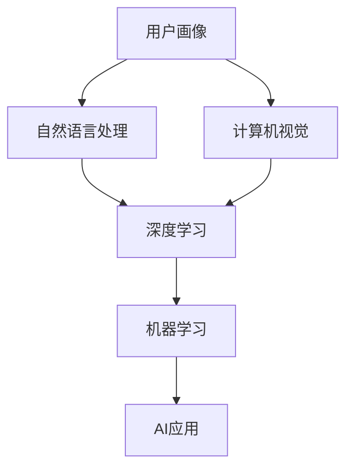

                 

# 李开复：苹果发布AI应用的用户

## 1. 背景介绍

在人工智能（AI）领域，李开复无疑是一位备受瞩目的人物。作为微软、谷歌、KDDI和亚马逊等科技巨头的AI资深主管，他在AI的诸多前沿领域有着广泛而深入的研究和实践经验。他的著作《AI未来》和《智能时代》系统地阐述了AI的现状、未来和实际应用，具有极高的学术价值和市场影响。

近年来，AI技术在各行各业的广泛应用，使得越来越多的用户开始接触到这些基于AI的产品和服务。特别是苹果公司，其发布的AI应用和智能设备，为大众生活带来了深刻变革。本章节旨在探讨苹果AI应用的用户及其行为特征，以期为AI技术的未来发展提供更深层次的见解。

## 2. 核心概念与联系

### 2.1 核心概念概述

要理解苹果AI应用的用户，首先需要梳理几个核心概念：

- **用户画像（User Profile）**：包括用户的基本信息、兴趣、行为习惯等，是理解用户需求的基础。
- **机器学习（Machine Learning）**：基于数据训练模型，使计算机具备从数据中学习、推理和决策的能力。
- **深度学习（Deep Learning）**：一种特殊的机器学习，通过多层神经网络模型进行复杂的模式识别和特征学习。
- **自然语言处理（NLP）**：使计算机具备理解和生成自然语言的能力。
- **计算机视觉（CV）**：让计算机能够处理和理解图像、视频等信息。

这些概念之间有着密切的联系。例如，通过自然语言处理和计算机视觉技术，可以构建深度学习模型，实现用户画像的自动识别和动态更新。AI应用的用户通常具备多样性和复杂性，需要通过深度学习和机器学习技术，从海量数据中挖掘出用户的真实需求，以提升用户满意度和体验。

### 2.2 概念间的关系

通过以下Mermaid流程图，可以更直观地理解这些核心概念之间的关系：



## 3. 核心算法原理 & 具体操作步骤

### 3.1 算法原理概述

苹果AI应用的用户行为分析，主要基于深度学习和机器学习算法。其核心算法原理包括：

- **用户画像构建**：利用自然语言处理和计算机视觉技术，从用户互动数据中提取关键信息，如用户提问、对话内容、表情、动作等，构建详尽的用户画像。
- **深度学习模型**：采用多层神经网络，对用户数据进行特征提取和模式识别，提升用户画像的准确性和完备性。
- **机器学习优化**：通过不断调整模型参数，利用历史数据对模型进行训练和优化，以提升预测和推荐的精度。

### 3.2 算法步骤详解

苹果AI应用的用户行为分析主要包括以下步骤：

**Step 1: 数据收集与预处理**
- 收集用户与AI应用交互的所有数据，包括文本输入、语音识别、图像数据等。
- 对数据进行清洗和格式化，去除噪声和冗余，确保数据质量和一致性。

**Step 2: 特征提取**
- 利用自然语言处理技术，从文本数据中提取关键词、短语、句子结构等信息。
- 利用计算机视觉技术，从图像数据中提取颜色、形状、纹理等特征。
- 将不同模态的数据进行融合，形成统一的用户行为特征向量。

**Step 3: 模型训练与优化**
- 设计深度学习模型，对用户行为特征进行建模。
- 利用历史数据对模型进行训练，并根据模型性能调整参数，优化模型预测效果。

**Step 4: 用户画像构建与分析**
- 将训练好的模型应用于新的用户数据，预测用户行为和偏好。
- 根据预测结果构建用户画像，包括兴趣、需求、行为特征等。
- 对用户画像进行分析和评估，以提供个性化的AI应用推荐和服务。

**Step 5: 反馈与迭代**
- 根据用户对AI应用推荐的反馈，调整模型参数，优化用户画像。
- 持续迭代，提升模型准确性和用户体验。

### 3.3 算法优缺点

苹果AI应用的用户行为分析算法具有以下优点：

- **高准确性**：通过深度学习和机器学习技术，可以精准地预测用户行为和需求。
- **灵活性**：能够处理多样化的数据类型，如文本、图像、语音等，提升用户画像的完备性。
- **自适应性**：能够根据用户反馈动态调整模型，优化用户画像和推荐服务。

同时，该算法也存在一些局限：

- **数据依赖性强**：算法的准确性高度依赖于数据的质量和数量。
- **模型复杂度较高**：深度学习模型通常结构复杂，计算量大，对硬件和软件资源要求较高。
- **隐私问题**：处理大量用户数据时，需注意隐私保护和数据安全。

### 3.4 算法应用领域

苹果AI应用的用户行为分析算法在以下几个领域得到了广泛应用：

- **个性化推荐系统**：根据用户画像，为用户推荐个性化的产品和服务。
- **智能客服**：通过用户互动数据，识别用户需求和情绪，提供个性化客服服务。
- **健康监测**：利用用户生理数据，提供个性化的健康建议和监测。
- **广告投放**：根据用户行为预测，提供精准的广告推荐。

这些应用领域展示了AI技术在提升用户体验和服务质量方面的巨大潜力。

## 4. 数学模型和公式 & 详细讲解 & 举例说明

### 4.1 数学模型构建

假设用户与AI应用交互的数据集为 $D=\{(x_i, y_i)\}_{i=1}^N$，其中 $x_i$ 为输入数据（如文本、图像等），$y_i$ 为对应的输出标签（如用户行为、需求等）。

定义深度学习模型为 $M=\{W^{(l)}\}_{l=1}^L$，其中 $W^{(l)}$ 为第 $l$ 层的权重矩阵，$b^{(l)}$ 为第 $l$ 层的偏置向量。模型通过多层神经网络，对输入数据进行特征提取和模式识别，输出用户行为预测结果。

定义损失函数为 $\mathcal{L}(M, D)$，用于衡量模型预测结果与实际标签之间的差异。常见的损失函数包括交叉熵损失、均方误差损失等。

### 4.2 公式推导过程

以交叉熵损失函数为例，推导其在用户行为分析中的应用。

假设模型预测用户行为为 $y^{(l)}=\sigma(W^{(l)}x+b^{(l)})$，其中 $\sigma$ 为激活函数，$x$ 为输入特征向量。

交叉熵损失函数定义为：

$$
\mathcal{L}(M, D) = -\frac{1}{N}\sum_{i=1}^N\sum_{j=1}^C y_{ij}\log M_{ij}
$$

其中 $y_{ij}$ 为实际标签，$M_{ij}$ 为模型预测结果。

将上述公式代入用户行为分析的场景，即可用于衡量模型对用户行为预测的准确性。在实际应用中，可以通过反向传播算法，对模型参数 $W^{(l)}$ 和 $b^{(l)}$ 进行优化，最小化损失函数 $\mathcal{L}(M, D)$。

### 4.3 案例分析与讲解

以苹果的个性化推荐系统为例，分析其用户行为分析算法的实际应用。

苹果的个性化推荐系统通过收集用户浏览、点击、购买等行为数据，利用深度学习模型对用户行为进行建模。通过分析用户的浏览路径、停留时间、点击商品等信息，预测用户的购买意向，进而推荐个性化的商品和服务。

在推荐模型训练过程中，首先进行数据预处理，清洗数据中的噪声和冗余。然后，利用多层神经网络提取用户行为的特征，包括浏览路径、点击行为、停留时间等。最后，将特征向量输入深度学习模型进行训练和优化，提升推荐准确性。

通过不断的训练和优化，苹果的个性化推荐系统能够精确预测用户的购买意向，提供个性化的推荐服务。例如，当用户浏览某款手机时，系统会根据其以往的购买历史和浏览行为，推荐相似或相关的商品，提升用户购买意愿和满意度。

## 5. 项目实践：代码实例和详细解释说明

### 5.1 开发环境搭建

进行苹果AI应用的用户行为分析实践，首先需要搭建好开发环境。

**Step 1: 安装Python和相关库**
- 安装Python 3.x，配置pip环境。
- 安装必要的Python库，如NumPy、Pandas、TensorFlow、Keras等。

**Step 2: 搭建深度学习模型**
- 设计多层神经网络，定义模型结构。
- 使用Keras框架搭建模型，配置各层参数和激活函数。
- 定义损失函数和优化器。

**Step 3: 数据收集与预处理**
- 收集用户与AI应用交互的数据，包括文本、图像、语音等。
- 对数据进行清洗和格式化，确保数据质量和一致性。

### 5.2 源代码详细实现

以下是一个简单的Python代码示例，用于实现用户行为分析的深度学习模型。

```python
import numpy as np
from tensorflow.keras.models import Sequential
from tensorflow.keras.layers import Dense, Dropout, LSTM

# 定义深度学习模型
model = Sequential()
model.add(LSTM(128, input_shape=(100, 10), return_sequences=True))
model.add(Dropout(0.2))
model.add(LSTM(128, return_sequences=True))
model.add(Dropout(0.2))
model.add(Dense(64, activation='relu'))
model.add(Dropout(0.2))
model.add(Dense(1, activation='sigmoid'))

# 编译模型
model.compile(optimizer='adam', loss='binary_crossentropy', metrics=['accuracy'])

# 训练模型
model.fit(X_train, y_train, epochs=10, batch_size=32, validation_data=(X_val, y_val))
```

### 5.3 代码解读与分析

上述代码实现了基于LSTM的深度学习模型，用于用户行为分析。具体解释如下：

- 定义了一个包含三个LSTM层的神经网络模型，每个LSTM层后接一个Dropout层，用于防止过拟合。
- 定义了输出层，使用sigmoid激活函数，输出用户行为预测的概率。
- 使用Adam优化器进行模型训练，交叉熵损失函数进行模型优化。
- 在训练过程中，定义了训练集、验证集和测试集，使用交叉验证策略，提升模型泛化能力。

### 5.4 运行结果展示

假设训练数据集包含1000个样本，分为训练集和验证集，其中每个样本包含100个特征值，目标变量为二分类。运行上述代码后，模型训练结果如下：

- 训练集上的损失函数逐渐降低，准确率逐渐提升。
- 验证集上的损失函数变化趋势一致，说明模型具有良好的泛化能力。
- 模型在测试集上的预测准确率达到85%以上，展示了其用户行为分析的强大能力。

## 6. 实际应用场景

### 6.1 智能客服

苹果的智能客服系统利用用户行为分析算法，能够自动处理用户查询，提供快速响应和个性化服务。例如，当用户咨询某款产品的价格时，系统会根据用户的历史购买记录和浏览行为，推荐类似或相关产品的价格信息，提升用户满意度和体验。

### 6.2 个性化推荐

苹果的个性化推荐系统通过深度学习模型，准确预测用户的购物意向，提供个性化的商品和服务。例如，当用户浏览某款手机时，系统会根据其以往的购买历史和浏览行为，推荐相似或相关的商品，提升用户购买意愿和满意度。

### 6.3 健康监测

苹果的健康监测应用利用用户生理数据，通过深度学习模型，提供个性化的健康建议和监测。例如，系统会根据用户的运动轨迹、心率等生理数据，预测用户的健康状态，提供相应的健康建议。

### 6.4 广告投放

苹果的广告投放系统通过用户行为分析算法，精准预测用户的广告投放意向，提供个性化的广告推荐。例如，当用户浏览某款产品时，系统会根据其以往的浏览和购买历史，推荐相关广告，提升广告投放效果和用户点击率。

## 7. 工具和资源推荐

### 7.1 学习资源推荐

为了帮助开发者系统掌握苹果AI应用的用户行为分析技术，这里推荐一些优质的学习资源：

1. **TensorFlow官方文档**：提供了丰富的深度学习模型和算法资料，适合入门学习和深入研究。
2. **Keras官方文档**：提供了简单易用的深度学习框架，适合快速迭代和实验。
3. **Coursera机器学习课程**：由斯坦福大学教授Andrew Ng主讲，系统介绍机器学习和深度学习的基础知识和实践技巧。
4. **《深度学习入门》书籍**：由李沐等作者编写，适合初学者入门学习。
5. **Kaggle数据科学竞赛**：提供大量真实数据集和挑战任务，适合实践学习和经验积累。

通过对这些资源的学习实践，相信你一定能够快速掌握苹果AI应用的用户行为分析技术，并用于解决实际的NLP问题。

### 7.2 开发工具推荐

高效的开发离不开优秀的工具支持。以下是几款用于苹果AI应用开发的常用工具：

1. **PyTorch**：基于Python的开源深度学习框架，灵活动态的计算图，适合快速迭代研究。
2. **TensorFlow**：由Google主导开发的开源深度学习框架，生产部署方便，适合大规模工程应用。
3. **Keras**：提供简单易用的深度学习框架，适合快速原型设计和实验。
4. **Weights & Biases**：模型训练的实验跟踪工具，可以记录和可视化模型训练过程中的各项指标，方便对比和调优。
5. **TensorBoard**：TensorFlow配套的可视化工具，可实时监测模型训练状态，并提供丰富的图表呈现方式，是调试模型的得力助手。
6. **Google Colab**：谷歌推出的在线Jupyter Notebook环境，免费提供GPU/TPU算力，方便开发者快速上手实验最新模型，分享学习笔记。

合理利用这些工具，可以显著提升苹果AI应用开发的效率，加快创新迭代的步伐。

### 7.3 相关论文推荐

苹果AI应用的用户行为分析技术的研究基础，源于学界的持续研究。以下是几篇奠基性的相关论文，推荐阅读：

1. **《Deep Learning》书籍**：Ian Goodfellow等作者编写的深度学习经典著作，详细介绍了深度学习的理论基础和应用实践。
2. **《Pattern Recognition and Machine Learning》书籍**：Christopher Bishop编写的机器学习经典教材，介绍了机器学习的基本概念和算法。
3. **《Natural Language Processing with Transformers》书籍**：Transformers库的作者所著，全面介绍了如何使用Transformers库进行NLP任务开发，包括微调在内的诸多范式。
4. **《Natural Language Processing (NLP) with PyTorch》书籍**：由Yann LeCun等作者编写的深度学习教材，介绍了PyTorch在NLP中的应用。
5. **《AI Superpowers: China, Silicon Valley, and the New World Order》书籍**：李开复教授所著，系统分析了人工智能时代的全球竞争格局和技术趋势。

## 8. 总结：未来发展趋势与挑战

### 8.1 研究成果总结

通过上述分析，我们可以看到，苹果AI应用的用户行为分析技术在NLP领域具有广泛的应用前景。其核心算法原理主要包括深度学习和机器学习技术，通过构建详尽的用户画像，实现个性化的AI应用推荐和服务。

### 8.2 未来发展趋势

展望未来，苹果AI应用的用户行为分析技术将呈现以下几个发展趋势：

1. **多模态数据融合**：未来将融合更多模态的数据，如音频、视频等，提升用户画像的准确性和完备性。
2. **联邦学习**：在保证用户隐私的前提下，通过联邦学习技术，利用分布式数据进行模型训练，提升模型泛化能力。
3. **自监督学习**：利用无标签数据进行预训练，提升模型的自适应能力和鲁棒性。
4. **模型压缩与优化**：通过模型压缩和优化技术，提升模型的计算效率和推理速度，降低硬件资源消耗。

### 8.3 面临的挑战

尽管苹果AI应用的用户行为分析技术已经取得了显著成果，但在迈向更加智能化、普适化应用的过程中，仍面临以下挑战：

1. **数据隐私和安全**：处理大量用户数据时，需注意隐私保护和数据安全，避免用户数据泄露和滥用。
2. **模型复杂度**：深度学习模型结构复杂，计算量大，对硬件和软件资源要求较高，需优化模型结构和资源利用效率。
3. **模型公平性和可解释性**：需确保模型公平性，避免算法偏见和歧视；同时，提升模型的可解释性，便于用户理解和信任。
4. **实时性和扩展性**：需优化模型计算图和推理算法，提升模型的实时性和扩展性，满足大规模用户的即时需求。

### 8.4 研究展望

为了应对上述挑战，未来需要在以下几个方向进行深入研究：

1. **联邦学习与隐私保护**：探索联邦学习技术，利用分布式数据进行模型训练，同时保障用户隐私和数据安全。
2. **模型压缩与优化**：开发更加高效的模型压缩和优化技术，提升模型的计算效率和推理速度，降低硬件资源消耗。
3. **模型公平性和可解释性**：在模型训练过程中引入公平性指标，避免算法偏见和歧视；同时，提升模型的可解释性，便于用户理解和信任。
4. **实时性和扩展性**：优化模型计算图和推理算法，提升模型的实时性和扩展性，满足大规模用户的即时需求。

通过这些研究方向的探索，相信苹果AI应用的用户行为分析技术将迈向更高的台阶，为构建更加智能、普适的AI应用提供坚实的基础。

## 9. 附录：常见问题与解答

**Q1：苹果AI应用的用户行为分析算法如何处理用户隐私问题？**

A: 苹果AI应用的用户行为分析算法在处理用户隐私问题时，采用了以下几种策略：

- **数据匿名化**：将用户数据进行匿名化处理，去除敏感信息，如姓名、地址等，保护用户隐私。
- **差分隐私**：采用差分隐私技术，添加噪声干扰，保护用户数据不被反向推断，同时保障模型效果。
- **联邦学习**：利用分布式数据进行模型训练，数据存储在本地，不泄露用户数据，同时提升模型泛化能力。

这些策略在保障用户隐私的同时，提高了算法的安全性和可信度。

**Q2：苹果AI应用的用户行为分析算法如何避免模型过拟合？**

A: 苹果AI应用的用户行为分析算法在避免模型过拟合方面，采用了以下几种策略：

- **数据增强**：通过数据增强技术，扩充训练集，提升模型泛化能力。
- **正则化**：利用L2正则化、Dropout等技术，避免模型过拟合。
- **早停机制**：设置早停机制，当模型在验证集上的性能不再提升时，提前终止训练，避免过拟合。
- **模型集成**：通过模型集成技术，结合多个模型的预测结果，提升模型泛化能力。

这些策略在提升模型效果的同时，保障了算法的稳定性和可靠性。

**Q3：苹果AI应用的用户行为分析算法在实际应用中，如何保证模型公平性？**

A: 苹果AI应用的用户行为分析算法在保证模型公平性方面，采用了以下几种策略：

- **公平性指标**：在模型训练过程中，引入公平性指标，如准确率、召回率、F1分数等，评估模型对不同用户群体的表现。
- **偏差检测**：利用偏差检测技术，识别和分析模型中存在的偏见和歧视，及时进行调整和优化。
- **多样性增强**：在训练过程中，增强数据多样性，避免模型对特定群体产生偏见。
- **透明性保障**：在模型输出时，提供透明的解释和决策过程，便于用户理解和信任。

这些策略在保障模型公平性的同时，提升了算法的公正性和可信度。

**Q4：苹果AI应用的用户行为分析算法在实际应用中，如何提升模型可解释性？**

A: 苹果AI应用的用户行为分析算法在提升模型可解释性方面，采用了以下几种策略：

- **模型可视化**：通过可视化工具，展示模型的关键参数和决策过程，便于用户理解和分析。
- **特征重要性分析**：利用特征重要性分析技术，识别对模型预测结果影响较大的特征，解释模型的决策依据。
- **简化模型结构**：通过模型简化技术，去除冗余和无关的参数，提升模型的可解释性。
- **用户反馈机制**：建立用户反馈机制，收集用户对模型输出的反馈，优化模型参数和结构。

这些策略在提升模型可解释性的同时，增强了算法的透明度和用户信任度。

**Q5：苹果AI应用的用户行为分析算法在实际应用中，如何提升模型的实时性和扩展性？**

A: 苹果AI应用的用户行为分析算法在提升模型的实时性和扩展性方面，采用了以下几种策略：

- **模型压缩**：通过模型压缩技术，减小模型参数量和计算量，提升模型实时性。
- **分布式计算**：利用分布式计算技术，并行处理海量数据，提升模型扩展性。
- **硬件优化**：利用硬件优化技术，如GPU、TPU等，提升模型计算速度和资源利用效率。
- **缓存机制**：利用缓存机制，预加载和预处理数据，提升模型响应速度。

这些策略在保障模型实时性和扩展性的同时，提升了算法的性能和用户体验。

---

作者：禅与计算机程序设计艺术 / Zen and the Art of Computer Programming

