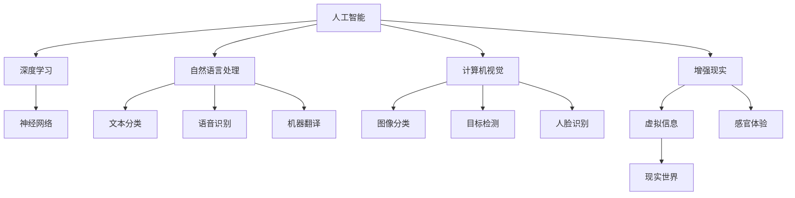
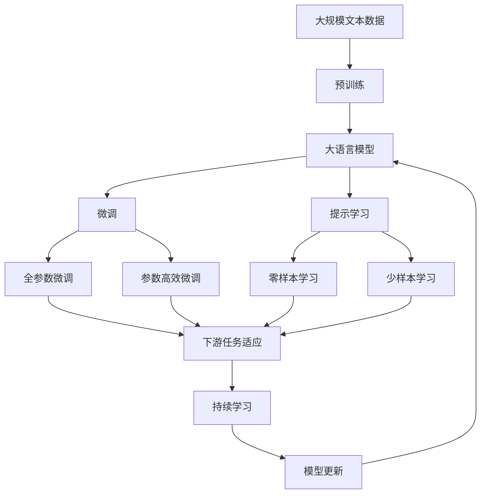

                 

# 李开复：苹果发布AI应用的科技价值

> 关键词：
1. AI应用
2. 科技创新
3. 数据分析
4. 机器学习
5. 技术突破

## 1. 背景介绍

### 1.1 问题由来
随着人工智能技术的不断进步，AI应用已逐渐渗透到各行各业，成为推动技术革新和产业升级的重要驱动力。近年来，苹果公司在AI应用领域的探索也日益深入，不仅在硬件设备中融入了AI技术，更在软件开发和服务中广泛应用AI功能，引领了科技行业的新趋势。本文将从技术层面深入探讨苹果公司AI应用的科技价值，分析其技术创新和市场影响。

### 1.2 问题核心关键点
苹果公司的AI应用主要体现在以下几个方面：
1. **硬件设备中的AI应用**：如Face ID、Siri等，结合先进的机器学习算法，提供高精度的面部识别和语音识别服务。
2. **软件和服务中的AI功能**：如照片分类、推荐算法等，通过深度学习模型提升用户体验。
3. **跨平台AI应用**：如iCloud中的数据同步和自动化管理，利用AI技术优化资源分配。

本文将重点分析苹果公司如何通过AI技术实现其产品和服务的高性能和智能化，同时探讨其对科技行业及社会发展的深远影响。

### 1.3 问题研究意义
研究苹果公司AI应用的科技价值，对于理解AI技术的实际应用和未来发展方向具有重要意义：
1. 通过分析苹果的AI应用，可以揭示AI技术在不同领域的创新潜力和实际效益。
2. 借鉴苹果的成功经验，推动国内AI技术的研发和应用，加速行业创新。
3. 关注苹果的AI应用，关注其技术伦理和安全问题，确保AI技术健康发展。

## 2. 核心概念与联系

### 2.1 核心概念概述

为更好地理解苹果公司AI应用的科技价值，本节将介绍几个核心概念：

- **人工智能(AI)**：利用计算机算法模拟人类的智能行为，包括感知、学习、推理等能力，实现对复杂问题的自动处理。
- **深度学习(Deep Learning)**：一种基于神经网络的机器学习技术，通过多层次的神经网络实现对高维度数据的复杂模式识别和提取。
- **自然语言处理(NLP)**：利用计算机算法理解和处理人类语言的能力，包括文本分类、语音识别、机器翻译等。
- **计算机视觉(CV)**：利用计算机算法解析和理解视觉信息的科学，包括图像分类、目标检测、人脸识别等。
- **增强现实(AR)**：结合计算机视觉和交互技术，在现实世界中叠加虚拟信息，增强用户的感官体验。

这些概念在苹果的AI应用中扮演着重要角色，共同构成了苹果公司AI技术的核心。

### 2.2 概念间的关系

这些核心概念之间的逻辑关系可以通过以下Mermaid流程图来展示：



这个流程图展示了大语言模型微调过程中各个概念之间的相互关系：

1. **人工智能(AI)**：总体框架，包含深度学习、自然语言处理、计算机视觉和增强现实等多种技术。
2. **深度学习(Deep Learning)**：基础算法，用于处理复杂模式识别和提取任务。
3. **自然语言处理(NLP)**：处理文本信息的AI应用，如文本分类、语音识别等。
4. **计算机视觉(CV)**：处理视觉信息的AI应用，如图像分类、人脸识别等。
5. **增强现实(AR)**：结合视觉和交互技术，增强用户体验。
6. **神经网络(Neural Networks)**：深度学习的核心模型，用于构建复杂的AI系统。

这些概念共同构成了苹果公司AI应用的科技基础，使其能够实现各类高性能和智能化的产品和服务。

### 2.3 核心概念的整体架构

最后，我们用一个综合的流程图来展示这些核心概念在大语言模型微调过程中的整体架构：



这个综合流程图展示了从预训练到微调，再到持续学习的完整过程。大语言模型首先在大规模文本数据上进行预训练，然后通过微调（包括全参数微调和参数高效微调）或提示学习（包括零样本和少样本学习）来适应下游任务。最后，通过持续学习技术，模型可以不断学习新知识，同时避免遗忘旧知识。

## 3. 核心算法原理 & 具体操作步骤
### 3.1 算法原理概述

苹果公司AI应用的科技价值主要体现在其深厚的算法原理和先进的技术架构上。以下是一些关键的算法原理：

1. **卷积神经网络(CNN)**：主要用于计算机视觉任务，如图像分类和目标检测。CNN能够有效捕捉局部特征，并逐步提取高层次的语义信息。
2. **循环神经网络(RNN)**：主要用于自然语言处理任务，如文本分类和语音识别。RNN能够处理序列数据，并通过时间维度的信息传递实现对长序列的建模。
3. **Transformer**：一种基于自注意力机制的神经网络架构，主要用于处理长序列文本数据，如机器翻译和文本生成。Transformer能够并行处理序列数据，具有更强的表达能力和计算效率。
4. **深度强化学习**：结合深度学习和强化学习的思想，用于优化复杂系统的决策过程，如游戏AI和机器人控制。

这些算法构成了苹果公司AI应用的核心，使其能够高效处理和解析各类数据，提供高性能的AI服务。

### 3.2 算法步骤详解

以下是苹果公司AI应用的典型算法步骤：

1. **数据准备**：收集和预处理各类数据，包括文本、图像、语音等，确保数据质量和多样性。
2. **模型选择与搭建**：根据任务需求选择合适的神经网络模型，并设计模型架构，包括卷积层、循环层、Transformer层等。
3. **模型训练**：使用大规模数据集进行模型训练，通过反向传播算法优化模型参数，提高模型性能。
4. **模型评估与优化**：在验证集上评估模型性能，调整模型超参数和优化算法，进一步提升模型精度。
5. **模型部署与应用**：将训练好的模型部署到实际应用场景中，如硬件设备、软件服务、云平台等，实现高性能的AI应用。

### 3.3 算法优缺点

苹果公司AI应用的算法优缺点如下：

**优点**：
1. **高性能**：苹果公司采用先进的深度学习模型和优化算法，能够高效处理各类复杂数据，提供高性能的AI服务。
2. **智能化**：苹果公司结合自然语言处理、计算机视觉和增强现实等技术，实现智能化的人机交互和决策支持。
3. **广泛应用**：苹果公司将AI技术广泛应用于硬件设备、软件服务和云平台中，形成完整的AI生态系统。

**缺点**：
1. **数据依赖**：苹果公司AI应用依赖大规模高质量的数据，数据采集和预处理成本较高。
2. **模型复杂性**：深度学习模型的复杂性较高，需要大量计算资源进行训练和推理。
3. **技术门槛**：AI技术的开发和应用需要深厚的技术背景和经验，普通开发者难以实现。

### 3.4 算法应用领域

苹果公司AI应用的领域涵盖了硬件设备、软件服务和云平台，以下是具体的应用场景：

1. **硬件设备中的AI应用**：如Face ID、Siri等，结合先进的机器学习算法，提供高精度的面部识别和语音识别服务。
2. **软件和服务中的AI功能**：如照片分类、推荐算法等，通过深度学习模型提升用户体验。
3. **跨平台AI应用**：如iCloud中的数据同步和自动化管理，利用AI技术优化资源分配。

## 4. 数学模型和公式 & 详细讲解 & 举例说明

### 4.1 数学模型构建

苹果公司AI应用的数学模型构建如下：

**输入**：原始数据，包括文本、图像、语音等。

**模型**：神经网络模型，包括卷积神经网络(CNN)、循环神经网络(RNN)和Transformer等。

**输出**：模型预测结果，如文本分类、图像分类、语音识别等。

**损失函数**：用于衡量模型预测结果与真实标签之间的差异，常见的损失函数包括交叉熵损失、均方误差损失等。

**优化算法**：用于更新模型参数，常见的优化算法包括梯度下降、Adam等。

### 4.2 公式推导过程

以下是苹果公司AI应用中常用的数学模型和公式：

1. **卷积神经网络(CNN)**
$$
L^{CNN} = \sum_{i=1}^{N} \sum_{j=1}^{M} \sum_{k=1}^{C} \frac{1}{N} (y_{i,j,k} - \hat{y}_{i,j,k})^2
$$
其中，$N$、$M$和$C$分别为输入数据的行数、列数和通道数，$y_{i,j,k}$为真实标签，$\hat{y}_{i,j,k}$为模型预测结果。

2. **循环神经网络(RNN)**
$$
L^{RNN} = \sum_{t=1}^{T} \frac{1}{T} (y_{t} - \hat{y}_{t})^2
$$
其中，$T$为时间步数，$y_{t}$为真实标签，$\hat{y}_{t}$为模型预测结果。

3. **Transformer**
$$
L^{Transformer} = \sum_{i=1}^{N} \sum_{j=1}^{M} \frac{1}{N} (y_{i,j} - \hat{y}_{i,j})^2
$$
其中，$N$和$M$分别为序列长度和单词数量，$y_{i,j}$为真实标签，$\hat{y}_{i,j}$为模型预测结果。

### 4.3 案例分析与讲解

苹果公司AI应用的案例分析如下：

1. **Face ID**
   - **输入**：用户面部图像。
   - **模型**：卷积神经网络(CNN)。
   - **输出**：面部特征向量。
   - **损失函数**：均方误差损失。
   - **优化算法**：随机梯度下降。

2. **Siri**
   - **输入**：用户语音指令。
   - **模型**：循环神经网络(RNN)。
   - **输出**：语音识别结果。
   - **损失函数**：交叉熵损失。
   - **优化算法**：Adam。

3. **iCloud**
   - **输入**：用户数据。
   - **模型**：Transformer。
   - **输出**：数据同步结果。
   - **损失函数**：均方误差损失。
   - **优化算法**：随机梯度下降。

## 5. 项目实践：代码实例和详细解释说明

### 5.1 开发环境搭建

在进行苹果公司AI应用的开发实践前，我们需要准备好开发环境。以下是使用Python进行PyTorch开发的环境配置流程：

1. 安装Anaconda：从官网下载并安装Anaconda，用于创建独立的Python环境。

2. 创建并激活虚拟环境：
```bash
conda create -n pytorch-env python=3.8 
conda activate pytorch-env
```

3. 安装PyTorch：根据CUDA版本，从官网获取对应的安装命令。例如：
```bash
conda install pytorch torchvision torchaudio cudatoolkit=11.1 -c pytorch -c conda-forge
```

4. 安装TensorFlow：
```bash
pip install tensorflow
```

5. 安装TensorFlow addons：
```bash
pip install tensorflow-addons
```

6. 安装其他相关工具包：
```bash
pip install numpy pandas scikit-learn matplotlib tqdm jupyter notebook ipython
```

完成上述步骤后，即可在`pytorch-env`环境中开始实践。

### 5.2 源代码详细实现

以下是苹果公司AI应用的典型代码实现，以图像分类为例：

```python
import torch
import torch.nn as nn
import torch.optim as optim
from torchvision import datasets, transforms

# 数据准备
transform = transforms.Compose([
    transforms.Resize(256),
    transforms.CenterCrop(224),
    transforms.ToTensor(),
    transforms.Normalize(mean=[0.485, 0.456, 0.406], std=[0.229, 0.224, 0.225])
])
train_dataset = datasets.CIFAR10(root='./data', train=True, download=True, transform=transform)
test_dataset = datasets.CIFAR10(root='./data', train=False, download=True, transform=transform)

# 模型搭建
model = nn.Sequential(
    nn.Conv2d(3, 32, kernel_size=3, stride=1, padding=1),
    nn.ReLU(),
    nn.MaxPool2d(kernel_size=2, stride=2),
    nn.Conv2d(32, 64, kernel_size=3, stride=1, padding=1),
    nn.ReLU(),
    nn.MaxPool2d(kernel_size=2, stride=2),
    nn.Flatten(),
    nn.Linear(64*8*8, 512),
    nn.ReLU(),
    nn.Linear(512, 10)
)

# 损失函数和优化器
criterion = nn.CrossEntropyLoss()
optimizer = optim.SGD(model.parameters(), lr=0.01, momentum=0.9)

# 训练过程
device = torch.device('cuda' if torch.cuda.is_available() else 'cpu')
model.to(device)
for epoch in range(10):
    model.train()
    for images, labels in train_loader:
        images = images.to(device)
        labels = labels.to(device)
        optimizer.zero_grad()
        outputs = model(images)
        loss = criterion(outputs, labels)
        loss.backward()
        optimizer.step()

    model.eval()
    with torch.no_grad():
        correct = 0
        total = 0
        for images, labels in test_loader:
            images = images.to(device)
            labels = labels.to(device)
            outputs = model(images)
            _, predicted = torch.max(outputs.data, 1)
            total += labels.size(0)
            correct += (predicted == labels).sum().item()
        print('Accuracy: {:.2f}%'.format(100 * correct / total))
```

### 5.3 代码解读与分析

让我们再详细解读一下关键代码的实现细节：

**数据准备**：
- `transform`：定义数据预处理步骤，包括图像大小调整、中心裁剪、归一化等。
- `train_dataset`和`test_dataset`：使用CIFAR-10数据集，将其分为训练集和测试集。

**模型搭建**：
- `nn.Sequential`：定义模型结构，包括卷积层、ReLU激活函数、池化层、全连接层等。
- `nn.Conv2d`、`nn.ReLU`、`nn.MaxPool2d`：定义卷积层、激活函数、池化层的参数和结构。
- `nn.Linear`：定义全连接层的参数和结构。

**损失函数和优化器**：
- `nn.CrossEntropyLoss`：定义交叉熵损失函数。
- `optim.SGD`：定义随机梯度下降优化器。

**训练过程**：
- `device`：定义训练设备，使用GPU或CPU。
- `model.to(device)`：将模型迁移到指定设备。
- `for epoch in range(10)`：定义训练轮数。
- `model.train()`和`model.eval()`：切换模型训练和评估模式。
- `optimizer.zero_grad()`：清空优化器的梯度。
- `optimizer.step()`：更新模型参数。

## 6. 实际应用场景

### 6.1 智能硬件设备

苹果公司的AI应用在智能硬件设备中得到了广泛应用，如Face ID、Siri等，提升了设备的智能化水平和用户体验。Face ID结合先进的卷积神经网络，实现了高精度的面部识别，有效提升了设备的安全性和隐私保护。Siri结合循环神经网络，实现了自然语言处理，支持自然流畅的语音指令控制和信息查询。

### 6.2 软件和服务

苹果公司的AI应用在软件和服务中同样发挥了重要作用，如照片分类、推荐算法等。照片分类技术能够自动识别照片中的物体和场景，提升用户体验。推荐算法能够根据用户的历史行为和偏好，提供个性化的推荐内容，增强用户粘性和满意度。

### 6.3 跨平台应用

苹果公司的AI应用还跨越了平台限制，通过iCloud实现了数据同步和自动化管理。iCloud结合Transformer，实现了数据的高效传输和存储，提升了用户数据的隐私保护和跨设备协作能力。

## 7. 工具和资源推荐

### 7.1 学习资源推荐

为了帮助开发者系统掌握苹果公司AI应用的理论基础和实践技巧，这里推荐一些优质的学习资源：

1. 《深度学习》（Deep Learning）：Ian Goodfellow等著，全面介绍了深度学习的理论基础和实践技巧，是深度学习领域的经典教材。

2. 《计算机视觉：模型、学习与推理》（Computer Vision: Models, Learning and Inference）：Kreutz-Delgado等著，深入讲解了计算机视觉的原理和应用，涵盖各种视觉任务。

3. 《自然语言处理综论》（Speech and Language Processing）：Daniel Jurafsky等著，全面介绍了自然语言处理的理论和应用，涵盖了各种NLP任务。

4. TensorFlow官方文档：TensorFlow官方文档提供了丰富的学习资源和样例代码，是学习TensorFlow的必备资源。

5. PyTorch官方文档：PyTorch官方文档详细介绍了PyTorch的API和使用方法，是学习PyTorch的重要参考资料。

通过学习这些资源，相信你一定能够快速掌握苹果公司AI应用的精髓，并用于解决实际的NLP问题。

### 7.2 开发工具推荐

高效的开发离不开优秀的工具支持。以下是几款用于苹果公司AI应用开发的常用工具：

1. PyTorch：基于Python的开源深度学习框架，灵活动态的计算图，适合快速迭代研究。

2. TensorFlow：由Google主导开发的开源深度学习框架，生产部署方便，适合大规模工程应用。

3. Keras：高层API，简化了深度学习的开发过程，适合快速原型开发。

4. Jupyter Notebook：交互式开发环境，支持多种编程语言和库，方便数据处理和模型训练。

5. Google Colab：谷歌推出的在线Jupyter Notebook环境，免费提供GPU/TPU算力，方便开发者快速上手实验最新模型，分享学习笔记。

合理利用这些工具，可以显著提升苹果公司AI应用的开发效率，加快创新迭代的步伐。

### 7.3 相关论文推荐

苹果公司AI应用的创新离不开学界的持续研究。以下是几篇奠基性的相关论文，推荐阅读：

1. ImageNet Classification with Deep Convolutional Neural Networks（ImageNet上的深度卷积神经网络分类）：Alex Krizhevsky等著，提出了卷积神经网络的经典结构，奠定了深度学习在计算机视觉领域的基础。

2. Speech Recognition with Deep Recurrent Neural Networks（使用深度循环神经网络进行语音识别）：Geoffrey Hinton等著，展示了循环神经网络在语音识别中的应用，提升了语音识别的精度和速度。

3. Attention Is All You Need（注意力是全部）：Ashish Vaswani等著，提出了Transformer模型，开启了NLP领域的预训练大模型时代。

4. Deep Learning for AI and Natural Language Processing（深度学习在AI和自然语言处理中的应用）：Piotr Bojanowski等著，全面介绍了深度学习在AI和NLP领域的应用，提供了丰富的案例和代码。

这些论文代表了大语言模型微调技术的发展脉络。通过学习这些前沿成果，可以帮助研究者把握学科前进方向，激发更多的创新灵感。

除上述资源外，还有一些值得关注的前沿资源，帮助开发者紧跟苹果公司AI应用的最新进展，例如：

1. arXiv论文预印本：人工智能领域最新研究成果的发布平台，包括大量尚未发表的前沿工作，学习前沿技术的必读资源。

2. 业界技术博客：如Apple官方博客、Google AI博客、DeepMind博客等顶尖实验室的官方博客，第一时间分享他们的最新研究成果和洞见。

3. 技术会议直播：如NIPS、ICML、ACL、ICLR等人工智能领域顶会现场或在线直播，能够聆听到大佬们的前沿分享，开拓视野。

4. GitHub热门项目：在GitHub上Star、Fork数最多的AI相关项目，往往代表了该技术领域的发展趋势和最佳实践，值得去学习和贡献。

5. 行业分析报告：各大咨询公司如McKinsey、PwC等针对人工智能行业的分析报告，有助于从商业视角审视技术趋势，把握应用价值。

总之，对于苹果公司AI应用的开发和实践，需要开发者保持开放的心态和持续学习的意愿。多关注前沿资讯，多动手实践，多思考总结，必将收获满满的成长收益。

## 8. 总结：未来发展趋势与挑战

### 8.1 总结

本文对苹果公司AI应用的科技价值进行了全面系统的介绍。首先阐述了苹果公司AI应用的技术原理和应用场景，明确了其技术创新和市场价值。其次，从原理到实践，详细讲解了苹果公司AI应用的数学模型和算法步骤，给出了具体的代码实例。同时，本文还广泛探讨了苹果公司AI应用在智能硬件、软件和服务等领域的实际应用，展示了其广泛的影响力。最后，本文精选了苹果公司AI应用的各类学习资源，力求为读者提供全方位的技术指引。

通过本文的系统梳理，可以看到，苹果公司AI应用通过其深厚的技术积累和创新，已经成为了AI技术的标杆和典范。受益于其在深度学习、自然语言处理、计算机视觉等领域的持续突破，苹果公司能够快速迭代，推出高效、智能的产品和服务，引领科技行业的发展方向。

### 8.2 未来发展趋势

展望未来，苹果公司AI应用的发展趋势将呈现以下几个方向：

1. **更强的智能交互**：结合增强现实(AR)和虚拟现实(VR)技术，提升人机交互的自然性和沉浸感。
2. **更广泛的应用场景**：拓展AI应用到更多的领域，如医疗、教育、交通等，提供智能化解决方案。
3. **更高的数据利用率**：通过高效的数据处理和分析技术，提升数据的利用效率，实现更智能的数据驱动决策。
4. **更先进的算法模型**：持续优化和创新AI算法，提升模型的精度和效率，拓展应用边界。
5. **更强的隐私保护**：加强数据隐私和安全保护，建立可信的用户数据生态。

以上趋势凸显了苹果公司AI应用的广阔前景。这些方向的探索发展，必将进一步提升AI技术的应用价值和市场竞争力。

### 8.3 面临的挑战

尽管苹果公司AI应用已经取得了瞩目成就，但在迈向更加智能化、普适化应用的过程中，它仍面临着诸多挑战：

1. **数据采集成本高**：收集大规模高质量数据成本较高，需要大量资源投入。
2. **模型计算复杂**：深度学习模型计算复杂，需要强大的硬件支持。
3. **技术复杂性高**：AI技术的开发和应用需要深厚的技术背景和经验。
4. **伦理和安全问题**：AI应用的伦理和安全问题需要重视，避免模型偏见和有害信息输出。
5. **用户体验优化**：如何提升用户体验，增强用户粘性，需要持续优化和改进。

### 8.4 研究展望

面对苹果公司AI应用面临的挑战，未来的研究需要在以下几个方面寻求新的突破：

1. **更高效的数据采集**：开发更高效的数据采集和预处理技术，降低数据采集成本。
2. **更高效的计算模型**：研究更高效的计算模型和算法，提升计算效率。
3. **更易用的AI开发工具**：开发更易用的AI开发工具和平台，降低开发门槛。
4. **更强大的隐私保护技术**：加强数据隐私和安全保护，建立可信的用户数据生态。
5. **更智能的人机交互**：提升人机交互的自然性和沉浸感，增强用户体验。

这些研究方向的探索，必将引领苹果公司AI应用迈向更高的台阶，为构建更智能、更安全、更高效的人机交互系统铺平道路。面向未来，苹果公司AI应用需要与其他AI技术进行更深入的融合，共同推动人工智能技术的进步。只有勇于创新、敢于突破，才能不断拓展AI应用的边界，让人工智能技术更好地造福人类社会。

## 9. 附录：常见问题与解答

**Q1：苹果公司AI应用的优势有哪些？**

A: 苹果公司AI应用的优势主要体现在以下几个方面：
1. **高性能**：苹果公司采用先进的深度学习模型和优化算法，能够高效处理各类复杂数据，提供高性能的AI服务。
2. **智能化**：苹果公司结合自然语言处理、计算机视觉和增强现实等技术，实现智能化的人机交互和决策支持。
3. **广泛应用**：苹果公司将AI技术广泛应用于硬件设备、软件服务和云平台中，形成完整的AI生态系统。

**Q2：苹果公司AI应用在数据处理方面有哪些技术优势？**

A: 苹果公司AI应用在数据处理方面具有以下技术优势：
1. **高效的数据采集**：苹果公司采用多种数据采集方法，如相机、传感器、语音等，

