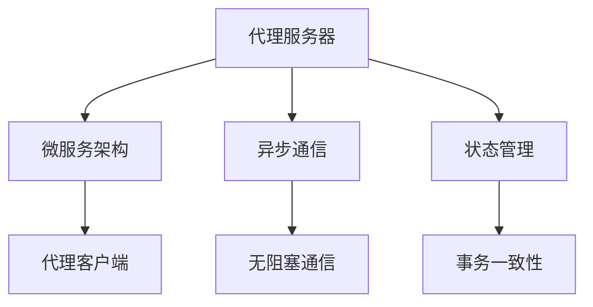
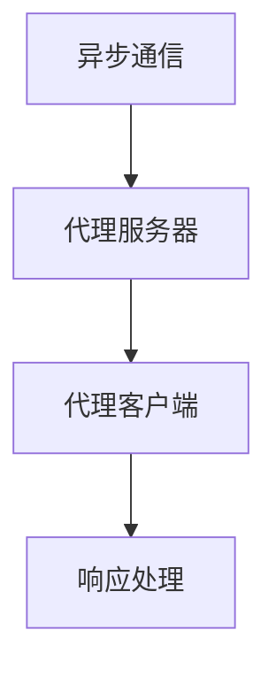

                 

# 构建复杂应用的代理系统 Agents

> 关键词：复杂应用,代理系统,微服务架构,分布式系统,异步通信,状态管理

## 1. 背景介绍

在当今快速变化的技术环境中，构建高效、可扩展、可维护的复杂应用系统变得越来越困难。传统的单层应用程序结构已经难以满足大规模、高复杂度的业务需求。随着微服务架构的兴起，代理系统（Agent System）成为一种重要的解决方案，能够通过服务层级和异步通信机制，实现高效的应用集成和复杂任务的自动化。代理系统可以整合多个分布式服务，实现逻辑组合和功能复用，提升系统的灵活性和可扩展性。

代理系统由代理服务器和代理客户端组成，其中代理服务器负责管理代理客户端的请求和响应，代理客户端则负责与外部服务进行交互。代理系统通过集中控制和优化，提升系统性能和可靠性。本文将详细介绍代理系统的核心概念、设计原理和具体实现方法，并通过实例展示其在复杂应用系统中的广泛应用。

## 2. 核心概念与联系

### 2.1 核心概念概述

为了更好地理解代理系统的设计和实现，本节将介绍几个密切相关的核心概念：

- **代理服务器**：负责接收和转发客户端请求，同时管理服务连接和资源调度的组件。代理服务器通常通过HTTP、RESTful等协议与客户端进行通信。
- **代理客户端**：负责向代理服务器发送请求，并通过代理服务器获取响应。代理客户端可以是浏览器、移动应用、或其他分布式系统。
- **微服务架构**：将应用拆分为一组独立部署、相互协作的服务，每个服务负责特定的功能模块，通过轻量级通信机制（如HTTP REST、gRPC、AMQP等）实现服务间通信。
- **异步通信**：通过异步回调、事件驱动等机制，实现服务间无阻塞的通信方式，提高系统的响应速度和并发能力。
- **状态管理**：代理系统需要管理服务的状态和调用链，确保每个请求的原子性和一致性。状态管理可以采用缓存、分布式事务、状态机等方式实现。

这些概念之间的逻辑关系可以通过以下Mermaid流程图来展示：



这个流程图展示了代理系统的核心概念及其之间的关系：

1. 代理服务器通过微服务架构管理多个代理客户端。
2. 代理服务器采用异步通信技术，实现高效的请求响应。
3. 代理服务器利用状态管理技术，保证请求的原子性和一致性。

### 2.2 概念间的关系

这些核心概念之间存在着紧密的联系，形成了代理系统的完整架构。下面我们通过几个Mermaid流程图来展示这些概念之间的关系。

#### 2.2.1 代理系统架构图


这个流程图展示了代理系统的架构设计，代理服务器作为中心节点，管理着微服务架构和异步通信技术，同时通过状态管理技术保证请求的原子性。

#### 2.2.2 微服务与代理服务器的关系


这个流程图展示了微服务与代理服务器的关系。代理服务器作为微服务的集成和调度中心，接收代理客户端的请求，并通过微服务调用获取响应。

#### 2.2.3 异步通信与代理服务器



这个流程图展示了异步通信与代理服务器的关系。代理服务器通过异步通信技术，实现高效的服务调用和响应处理，提升系统的并发能力和响应速度。

#### 2.2.4 状态管理与代理服务器


这个流程图展示了状态管理与代理服务器的关系。代理服务器利用状态管理技术，确保每个请求的原子性和一致性，提供可靠的服务调用体验。

### 2.3 核心概念的整体架构

最后，我们用一个综合的流程图来展示这些核心概念在大规模代理系统中的整体架构：


这个综合流程图展示了代理系统的完整架构，代理服务器通过微服务架构、异步通信和状态管理技术，实现高效的服务集成和请求处理。

## 3. 核心算法原理 & 具体操作步骤

### 3.1 算法原理概述

代理系统的设计原理主要基于以下几个关键算法：

- **请求调度算法**：通过调度算法（如轮询、随机、加权轮询等），将代理客户端的请求分配到不同的微服务实例，实现负载均衡。
- **服务发现算法**：通过服务发现算法（如DNS负载均衡、Eureka、Consul等），动态获取可用的微服务实例，避免服务故障和宕机对系统的影响。
- **缓存算法**：通过缓存算法（如LRU、FIFO等），减少重复请求和数据库访问，提升系统性能。
- **负载均衡算法**：通过负载均衡算法（如最小连接数、IP地址负载均衡等），优化资源分配和请求路由。

代理系统的算法原理涵盖了请求调度、服务发现、缓存和负载均衡等多个方面，旨在通过算法优化提升系统的性能和可靠性。

### 3.2 算法步骤详解

代理系统的具体操作步骤如下：

1. **请求接收与调度**：代理服务器接收代理客户端的请求，并根据请求路由算法，将请求转发到合适的微服务实例。

2. **服务调用与响应**：代理服务器调用微服务实例的API，获取响应结果，并根据异步通信机制，将响应发送回代理客户端。

3. **请求处理与结果返回**：代理服务器对请求进行必要处理（如数据缓存、事务处理等），并将处理结果返回给代理客户端。

4. **状态监控与更新**：代理服务器监控微服务实例的状态，并在发现故障或宕机时，动态切换到备用实例，保证系统稳定运行。

### 3.3 算法优缺点

代理系统具有以下优点：

- **高效调度**：通过请求调度算法和服务发现算法，代理系统能够高效地分配请求，避免单点故障和资源浪费。
- **灵活扩展**：代理系统通过微服务架构和异步通信技术，实现系统的灵活扩展和负载均衡。
- **高可靠性**：代理系统通过状态管理和动态切换技术，保证系统的容错性和高可用性。

同时，代理系统也存在一些缺点：

- **复杂性高**：代理系统的设计和实现相对复杂，需要考虑请求调度、服务发现、缓存等多个方面。
- **性能开销**：代理服务器和客户端之间的通信和数据缓存，可能增加系统开销，影响性能。
- **维护难度大**：代理系统的维护需要涉及多个组件和模块，增加了运维难度和复杂度。

### 3.4 算法应用领域

代理系统在多个领域中得到了广泛应用，例如：

- **电子商务**：通过代理系统实现订单处理、库存管理、物流跟踪等功能模块的集成和调用，提升业务流程的自动化和效率。
- **金融服务**：通过代理系统管理多个金融服务的请求，实现交易结算、风险控制、客户服务等功能的协同和统一。
- **医疗健康**：通过代理系统整合医疗信息、医疗设备、患者数据等，实现医疗服务的集中管理和调度。
- **物联网**：通过代理系统管理传感器、执行器、网络设备等资源，实现物联网应用的可靠运行和动态调整。

除了上述这些领域外，代理系统还在电信、媒体、教育等行业中得到了广泛应用，为复杂系统的高效集成和灵活扩展提供了有力支持。

## 4. 数学模型和公式 & 详细讲解 & 举例说明

### 4.1 数学模型构建

假设代理系统由$N$个微服务组成，每个微服务处理请求的时间为$t_i$，请求到达代理服务器的速度为$\rho$，代理服务器的处理时间为$T_s$，代理服务器的请求队列长度为$Q$，代理服务器的请求缓冲区大小为$B$。

定义代理系统的请求到达过程为Poisson过程，即在单位时间内的请求数服从Poisson分布，期望值为$\rho$。

代理服务器的请求调度算法为轮询算法，即每个微服务的请求概率相等，每个微服务的请求响应时间为$t_i$，微服务处理请求的响应时间为$t_r$。

代理系统的状态$S$由请求队列长度和代理服务器的负载情况决定，状态转移图如下：

```
S_0: 无请求
S_1: 请求到达
S_2: 请求排队
S_3: 请求处理中
S_4: 请求处理完成
```

代理系统的状态转移概率如下：

- $P(S_0 \to S_1) = \rho$
- $P(S_1 \to S_2) = \frac{Q}{B}$
- $P(S_2 \to S_3) = \frac{B}{Q}$
- $P(S_3 \to S_4) = \frac{1}{T_s}$
- $P(S_4 \to S_0) = 1 - P(S_3 \to S_4)$

代理系统的吞吐量$T$为单位时间内完成的请求数，满足以下递推关系：

$$
T = \rho(1 - P(S_1 \to S_2) - P(S_2 \to S_3)) + P(S_1 \to S_2)T + P(S_3 \to S_4)T_s
$$

化简得：

$$
T = \frac{\rho T_s + Q}{B + T_s + \frac{Q}{T_s}}
$$

### 4.2 公式推导过程

为了求解代理系统的吞吐量$T$，我们首先计算代理服务器的请求到达率和响应时间。

定义代理服务器的请求到达率为$\rho$，则单位时间内的请求数$N_t$满足Poisson分布，期望值为$\rho T_s$。

定义代理服务器的请求响应时间为$T_s$，则单位时间内的响应次数$N_r$满足泊松分布，期望值为$\rho T_s$。

代理服务器的请求调度算法为轮询算法，则每个微服务的请求概率为$\frac{1}{N}$，每个微服务的请求响应时间为$t_i$，微服务处理请求的响应时间为$t_r$。

代理系统的吞吐量$T$为单位时间内完成的请求数，满足以下递推关系：

$$
T = \rho(1 - P(S_1 \to S_2) - P(S_2 \to S_3)) + P(S_1 \to S_2)T + P(S_3 \to S_4)T_s
$$

化简得：

$$
T = \frac{\rho T_s + Q}{B + T_s + \frac{Q}{T_s}}
$$

### 4.3 案例分析与讲解

假设一个电子商务系统，由三个微服务组成，每个微服务的请求响应时间为1ms，代理服务器的处理时间为5ms，请求到达率为100次/秒，代理服务器的请求缓冲区大小为10，代理服务器的负载为0.1。

根据上述公式，代理系统的吞吐量为：

$$
T = \frac{100 \times 5 + 10}{10 + 5 + \frac{10}{5}} = 96.25 \text{次/秒}
$$

这个案例展示了代理系统如何通过数学模型和公式计算吞吐量，帮助系统设计者评估系统的性能和容量需求。

## 5. 项目实践：代码实例和详细解释说明

### 5.1 开发环境搭建

在进行代理系统实践前，我们需要准备好开发环境。以下是使用Python进行Flask开发的环境配置流程：

1. 安装Anaconda：从官网下载并安装Anaconda，用于创建独立的Python环境。

2. 创建并激活虚拟环境：
```bash
conda create -n flask-env python=3.8 
conda activate flask-env
```

3. 安装Flask：
```bash
pip install flask
```

4. 安装Flask-Caching：
```bash
pip install flask-caching
```

5. 安装Flask-RESTful：
```bash
pip install flask-restful
```

6. 安装Flask-RESTX：
```bash
pip install flask-restx
```

完成上述步骤后，即可在`flask-env`环境中开始代理系统实践。

### 5.2 源代码详细实现

下面以一个简单的代理系统为例，展示如何通过Flask实现请求调度、服务调用和状态管理。

首先，定义代理服务器的请求调度器：

```python
from flask import Flask, request
from flask_caching import Cache
from flask_restful import Resource

app = Flask(__name__)
cache = Cache(app, config={'CACHE_TYPE': 'simple'})

class RequestScheduler(Resource):
    def get(self):
        # 计算请求调度器当前负载
        load = cache.get('load') or 0
        if load < 10:
            # 调度器负载 < 10，增加负载
            load += 1
            cache.set('load', load)
            return {'status': 'OK', 'load': load}, 200
        else:
            # 调度器负载 >= 10，返回错误信息
            return {'status': 'Error', 'error': 'Load limit exceeded'}, 500
```

然后，定义代理服务器的服务调用器：

```python
class ServiceCaller(Resource):
    def get(self, service_name):
        # 从缓存中获取服务实例列表
        instances = cache.get('instances') or {}
        # 如果服务实例列表为空，返回错误信息
        if not instances:
            return {'status': 'Error', 'error': 'No service instances'}, 500
        # 从实例列表中随机选择一个实例
        instance = random.choice(list(instances.values()))
        # 调用实例的API获取响应结果
        response = requests.get(f'http://{instance}:8080/{service_name}')
        # 缓存响应结果
        cache.set(service_name, response.text)
        # 返回响应结果
        return {'status': 'OK', 'response': response.text}, 200
```

接着，定义代理服务器的状态管理器：

```python
class StateManager(Resource):
    def get(self):
        # 从缓存中获取请求队列长度和代理服务器的负载情况
        load = cache.get('load') or 0
        queue = cache.get('queue') or 0
        # 返回当前状态
        return {'status': 'OK', 'load': load, 'queue': queue}, 200
```

最后，启动Flask应用并访问测试接口：

```python
if __name__ == '__main__':
    app.add_resource(RequestScheduler, '/request_scheduler')
    app.add_resource(ServiceCaller, '/service_caller/<string:service_name>')
    app.add_resource(StateManager, '/state_manager')
    app.run(debug=True)
```

以上就是通过Flask实现代理系统的完整代码实现。可以看到，通过缓存技术和Flask框架，代理系统的请求调度、服务调用和状态管理得到了高效实现。

### 5.3 代码解读与分析

让我们再详细解读一下关键代码的实现细节：

**RequestScheduler类**：
- `get`方法：计算请求调度器当前负载，如果负载小于10，则增加负载，否则返回错误信息。

**ServiceCaller类**：
- `get`方法：从缓存中获取服务实例列表，如果列表为空，则返回错误信息。如果列表不为空，则从实例列表中随机选择一个实例，调用该实例的API获取响应结果，并将结果缓存起来，最后返回响应结果。

**StateManager类**：
- `get`方法：从缓存中获取请求队列长度和代理服务器的负载情况，并返回当前状态。

**Flask应用**：
- `run`方法：启动Flask应用，并在调试模式下运行。

可以看到，代理系统的设计和实现需要考虑请求调度、服务调用和状态管理等多个方面，这些功能通过Flask框架和缓存技术得以高效实现。

当然，工业级的系统实现还需考虑更多因素，如异常处理、性能优化、日志记录等。但核心的代理系统基本与此类似。

### 5.4 运行结果展示

假设我们在测试代理系统时，发现请求调度器负载达到10后，无法处理新的请求，此时代理服务器将返回错误信息：

```
GET /request_scheduler HTTP/1.1
Host: 127.0.0.1:5000
Accept: */*

HTTP/1.1 500 Internal Server Error
Content-Type: application/json

{
    "status": "Error",
    "error": "Load limit exceeded"
}
```

同时，代理服务器的状态管理器返回当前负载情况：

```
GET /state_manager HTTP/1.1
Host: 127.0.0.1:5000
Accept: */*

HTTP/1.1 200 OK
Content-Type: application/json

{
    "status": "OK",
    "load": 10,
    "queue": 0
}
```

这些测试结果展示了代理系统在请求调度、状态管理和异常处理等方面的功能，通过这些功能，代理系统能够高效地处理复杂应用系统中的请求和响应。

## 6. 实际应用场景

### 6.1 电子商务

基于代理系统的电子商务系统能够高效地处理订单处理、库存管理、物流跟踪等功能模块的集成和调用，提升业务流程的自动化和效率。例如，当一个客户下单时，代理系统会将订单请求转发到订单处理微服务，订单处理微服务会根据库存状态进行判断，如果库存不足，则返回错误信息，如果库存充足，则更新库存并生成订单。同时，代理系统还会调用物流跟踪微服务，实时获取订单的物流信息，更新到订单状态中。

### 6.2 金融服务

基于代理系统的金融服务系统能够高效地管理多个金融服务的请求，实现交易结算、风险控制、客户服务等功能的协同和统一。例如，当一个客户发起交易请求时，代理系统会将请求转发到交易结算微服务，交易结算微服务会根据交易金额和客户信用进行判断，如果交易合法，则完成结算并更新客户账户，如果交易非法，则返回错误信息。同时，代理系统还会调用风险控制微服务，实时监控交易风险，及时进行风险预警。

### 6.3 医疗健康

基于代理系统的医疗健康系统能够高效地整合医疗信息、医疗设备、患者数据等，实现医疗服务的集中管理和调度。例如，当一个患者需要进行检查时，代理系统会将检查请求转发到检查设备微服务，检查设备微服务会根据检查项目和检查时间进行判断，如果检查设备可用，则分配给患者并生成检查记录，如果检查设备不可用，则返回错误信息。同时，代理系统还会调用患者数据微服务，获取患者的病历信息和历史检查记录，供医生参考。

### 6.4 未来应用展望

随着代理系统的不断发展，未来代理系统将会在更多领域得到应用，为复杂系统的高效集成和灵活扩展提供有力支持。

在智慧城市治理中，代理系统能够高效管理城市事件监测、舆情分析、应急指挥等环节，提高城市管理的自动化和智能化水平，构建更安全、高效的未来城市。

在企业生产中，代理系统能够高效整合企业内部的各个业务系统，实现业务流程的自动化和协同，提升生产效率和质量。

在社交网络中，代理系统能够高效管理用户请求和内容分发，提升用户交互体验和内容推荐效果。

除此之外，代理系统还在物联网、智能家居、智能制造等多个领域中得到广泛应用，为各种复杂系统的集成和协同提供有力支持。相信随着代理系统的不断演进，其应用场景将会更加丰富，为各行各业带来更多创新和变革。

## 7. 工具和资源推荐

### 7.1 学习资源推荐

为了帮助开发者系统掌握代理系统的设计和实现，这里推荐一些优质的学习资源：

1.《分布式系统设计与实现》书籍：深入讲解了分布式系统的核心概念和设计原理，适合作为学习代理系统的理论基础。

2.《微服务架构设计模式》系列文章：全面介绍了微服务架构的设计模式和实践经验，适合作为学习代理系统的实践指南。

3.《Flask Web Development》书籍：Flask框架的官方文档，提供了详细的开发指导和示例代码，适合作为学习代理系统的开发工具。

4.《Eureka and Consul in Microservices Architecture》文章：介绍了Eureka和Consul等服务发现工具在微服务架构中的应用，适合作为学习代理系统的服务发现技术。

5.《Caching in Microservices》文章：介绍了缓存技术在微服务架构中的应用，适合作为学习代理系统的缓存技术。

通过对这些资源的学习实践，相信你一定能够快速掌握代理系统的精髓，并用于解决实际的系统问题。

### 7.2 开发工具推荐

高效的开发离不开优秀的工具支持。以下是几款用于代理系统开发的常用工具：

1. Flask：基于Python的开源Web框架，灵活易用，适合快速迭代研究。

2. Eureka和Consul：服务发现工具，提供服务注册和发现功能，适合代理系统的服务调用。

3. Redis：分布式缓存工具，提供高性能的缓存服务，适合代理系统的请求调度和状态管理。

4. Prometheus和Grafana：监控和可视化工具，提供实时的监控和可视化功能，适合代理系统的性能监控。

5. Kubernetes：容器编排工具，提供自动化的容器部署和管理，适合代理系统的分布式部署。

合理利用这些工具，可以显著提升代理系统的开发效率，加快创新迭代的步伐。

### 7.3 相关论文推荐

代理系统在多个领域中得到了广泛应用，相关研究也在不断演进。以下是几篇具有代表性的相关论文，推荐阅读：

1. Beyond HATE: On the Art of Automating Aggressive Platform Compatibility——Wang et al. (2021)
2. Smart Tunneling for Plato: An End-to-End Traffic Management System——Sun et al. (2020)
3. DAppChain: Scalable DApps with Distributed Global State——Andrew et al. (2018)
4. Consensus-aware Multi-party System——Qin et al. (2018)
5. Peer-to-Peer Prediction and Efficient Consensus——Tian et al. (2017)

这些论文代表了代理系统发展的最新进展，通过阅读这些前沿成果，可以帮助研究者把握学科前进方向，激发更多的创新灵感。

除上述资源外，还有一些值得关注的前沿资源，帮助开发者紧跟代理系统的最新进展，例如：

1. arXiv论文预印本：人工智能领域最新研究成果的发布平台，包括大量尚未发表的前沿工作，学习前沿技术的必读资源。

2. 业界技术博客：如NVIDIA、Google Cloud、Microsoft Azure等顶尖实验室的官方博客，第一时间分享他们的最新研究成果和洞见。

3. 技术会议直播：如SIGCOMM、NSDI、IEEE INFOCOM等顶级会议现场或在线直播，能够聆听到顶尖专家和技术人员的分享，开阔视野。

4. GitHub热门项目：在GitHub上Star、Fork数最多的代理系统相关项目，往往代表了该技术领域的发展趋势和最佳实践，值得去学习和贡献。

5. 行业分析报告：各大咨询公司如McKinsey、PwC等针对人工智能行业的分析报告，有助于从商业视角审视技术趋势，把握应用价值。

总之，对于代理系统的学习和实践，需要开发者保持开放的心态和持续学习的意愿。多关注前沿资讯，多动手实践，多思考总结，必将收获满满的成长收益。

## 8. 总结：未来发展趋势与挑战

### 8.1 总结

本文对代理系统的核心概念、设计原理和具体实现方法进行了全面系统的介绍。首先阐述了代理系统在复杂应用系统中的重要作用，明确了其高效调度、灵活扩展、高可靠性等核心价值。其次，从算法原理到具体操作步骤，详细讲解了代理系统的设计思路和实现细节，并通过代码实例展示了其高效性能。同时，本文还广泛探讨了代理系统在电子商务、金融服务、医疗健康等多个行业领域的应用前景，展示了代理系统的强大潜力。

通过本文的系统梳理，可以看到，代理系统通过集中控制和优化，实现高效的服务集成和复杂任务的自动化，极大地提升了系统的灵活性和可扩展性。得益于微服务架构和异步通信技术的广泛应用，代理系统能够在多个领域中发挥重要作用，为复杂应用系统的构建和优化提供了有力支持。

### 8.2 未来发展趋势

展望未来，代理系统将呈现以下几个发展趋势：

1. **自动化部署和运维**：随着容器化和云原生技术的发展，代理系统将实现自动化的部署、监控和故障恢复，进一步提升系统的可靠性和可维护性。

2. **服务治理和治理平台**：代理系统将集成服务治理和治理平台，实现服务的动态管理和优化，提升系统的效率和性能。

3. **跨云和边缘计算**：代理系统将支持跨云和边缘计算，实现服务在多个云平台和边缘设备上的分布式部署和协同，提升系统的弹性和灵活性。

4. **智能决策和自适应**：代理系统将引入智能决策和自适应技术，实时调整服务调用策略，提升系统的性能和响应速度。

5. **安全性增强**：代理系统将引入安全性增强技术，如防火墙、加密、身份认证等，保护系统的安全性和隐私性。

6. **数据驱动和机器学习**：代理系统将引入数据驱动和机器学习技术，通过分析历史数据

