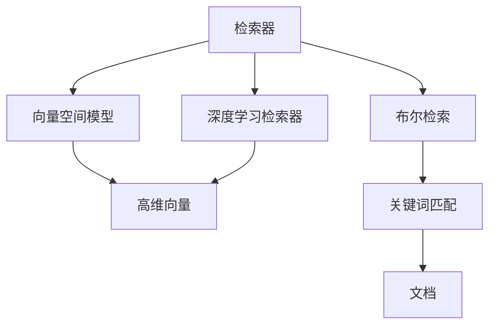
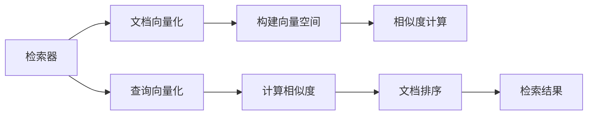
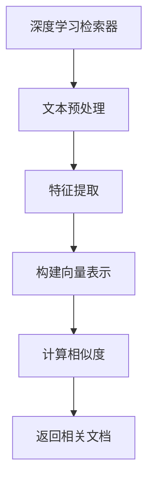
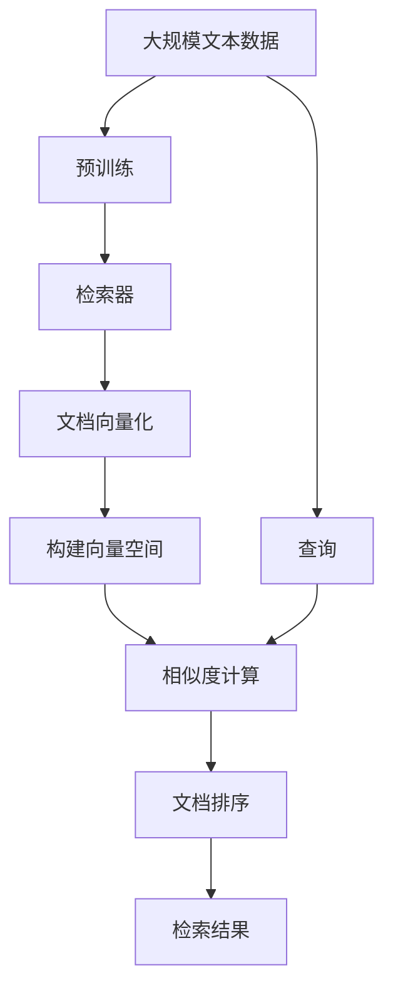

                 

# 检索器（Retrievers）

> 关键词：检索器, 信息检索, 向量检索, 向量空间模型, 布尔检索, 倒排索引, 深度学习检索器, 自然语言处理(NLP)

## 1. 背景介绍

### 1.1 问题由来
在信息时代，海量数据呈爆炸式增长。面对这种趋势，如何高效地从数据中提取有价值的信息，是摆在信息技术从业者面前的重大挑战。传统的基于关键字的布尔检索方法，无法充分挖掘文本内容的语义信息，难以满足实际应用需求。而检索器（Retrievers）作为一种基于向量检索的先进技术，通过对文本语义表示进行建模和相似度计算，可以显著提升信息检索的精度和效率。检索器在搜索引擎、文献检索、智能问答等多个领域取得了优异的表现，成为信息检索技术的核心工具。

### 1.2 问题核心关键点
检索器的核心思想是将文本转换为向量表示，并通过向量之间的相似度计算，找到与查询最相关的文档。常用的检索器包括向量空间模型(Vector Space Model, VSM)、布尔检索、深度学习检索器等。其中，VSM通过计算查询和文档向量之间的余弦相似度来进行检索，而深度学习检索器则利用预训练模型提取文档的语义特征，构建更加精准的向量表示。

检索器技术的关键点在于：
- 文本向量化：将文本转换为向量表示，以便进行数值计算。
- 相似度计算：通过计算查询和文档向量之间的相似度，筛选出相关性较高的文档。
- 文档排序：对检索结果进行排序，提升查询结果的相关性和准确性。

这些关键技术共同构成了检索器技术的核心框架，使其能够高效、精确地从海量文本中提取信息。

### 1.3 问题研究意义
检索器技术的不断发展，对于提升信息检索的效率和精度具有重要意义：

1. **降低成本**：通过检索器技术，用户可以快速准确地找到所需信息，减少查找时间，降低搜索成本。
2. **提升精度**：检索器可以挖掘文本中的语义信息，避免因关键字匹配不准确而导致的信息遗漏。
3. **扩大应用场景**：检索器技术不仅仅局限于文本检索，还可以应用于图像、音频等多种数据类型的检索。
4. **推动技术进步**：检索器的研究可以推动自然语言处理、计算机视觉等领域的进步，促进人工智能技术的广泛应用。

检索器技术的发展，为信息检索领域带来了新的突破，推动了人工智能技术的普及和应用，具有重要的理论和实际价值。

## 2. 核心概念与联系

### 2.1 核心概念概述

为更好地理解检索器技术，本节将介绍几个密切相关的核心概念：

- **检索器(Retrievers)**：一种基于向量检索的信息检索技术，通过将文本转换为向量表示，计算查询与文档的相似度，找出最相关的文档。
- **向量空间模型(VSM)**：一种经典的检索器技术，将文本表示为高维向量，通过计算向量之间的余弦相似度来衡量相关性。
- **深度学习检索器**：利用深度学习模型，如BERT、GPT等，提取文本的语义特征，构建更加精准的向量表示，提高检索精度。
- **布尔检索**：一种基于布尔逻辑的检索技术，通过与文本进行关键词匹配，返回包含查询关键词的文档。
- **倒排索引(Inverted Index)**：一种用于优化检索速度的数据结构，通过构建文档与关键词的映射关系，加速检索过程。

这些概念之间的逻辑关系可以通过以下Mermaid流程图来展示：



这个流程图展示了几大检索技术的基本原理和关系：

1. 检索器技术包括向量空间模型、深度学习检索器、布尔检索等多种实现方式。
2. 向量空间模型通过构建高维向量表示文本，计算向量之间的余弦相似度来进行检索。
3. 深度学习检索器利用预训练模型提取文本的语义特征，构建更加精准的向量表示。
4. 布尔检索通过关键词匹配，返回包含查询关键词的文档。

### 2.2 概念间的关系

这些核心概念之间存在着紧密的联系，形成了检索器技术的完整生态系统。下面我通过几个Mermaid流程图来展示这些概念之间的关系。

#### 2.2.1 检索器技术的核心组成



这个流程图展示了检索器技术的核心组成，包括文档向量化、构建向量空间、相似度计算、查询向量化、计算相似度、文档排序和检索结果。

#### 2.2.2 向量空间模型的基本原理


这个流程图展示了向量空间模型的基本原理，包括文本向量化、计算高维向量、计算余弦相似度和返回相关文档。

#### 2.2.3 深度学习检索器的工作流程



这个流程图展示了深度学习检索器的工作流程，包括文本预处理、特征提取、构建向量表示、计算相似度和返回相关文档。

### 2.3 核心概念的整体架构

最后，我们用一个综合的流程图来展示这些核心概念在大语言模型微调过程中的整体架构：



这个综合流程图展示了从预训练到检索器任务开发的完整过程。检索器首先在大规模文本数据上进行预训练，然后通过构建高维向量表示、计算余弦相似度等操作，最终返回检索结果。查询和检索器一起完成了整个信息检索过程。

## 3. 核心算法原理 & 具体操作步骤

### 3.1 算法原理概述

检索器技术的基本原理是向量空间模型，通过将文本转换为高维向量，计算向量之间的余弦相似度，来衡量文本的相关性。其核心思想可以概括为以下几点：

1. **文本向量化**：将文本转换为高维向量，以便进行数值计算。
2. **构建向量空间**：构建一个高维向量空间，将文本表示为该空间中的向量。
3. **相似度计算**：通过计算查询向量与文档向量的余弦相似度，筛选出相关性较高的文档。
4. **文档排序**：对检索结果进行排序，提升查询结果的相关性和准确性。

具体而言，检索器技术通过以下步骤实现文本的检索：

1. **文档向量化**：将每个文档表示为高维向量，通常使用TF-IDF、词向量等方法进行向量化。
2. **查询向量化**：将查询转换为向量表示，与文档向量进行相似度计算。
3. **计算相似度**：通过余弦相似度等方法计算查询向量与文档向量的相似度。
4. **排序和返回结果**：根据相似度对文档进行排序，返回最相关的文档。

### 3.2 算法步骤详解

检索器的实现步骤如下：

**Step 1: 文档向量化**
- 使用TF-IDF、词向量等方法将每个文档转换为向量表示。

**Step 2: 查询向量化**
- 将查询转换为向量表示，与文档向量进行相似度计算。

**Step 3: 计算相似度**
- 计算查询向量与每个文档向量的余弦相似度，排序后返回相关文档。

**Step 4: 文档排序**
- 根据相似度对检索结果进行排序，返回最相关的文档。

### 3.3 算法优缺点

检索器技术具有以下优点：

1. **高效**：通过计算向量之间的相似度，可以快速检索出相关文档，减少计算时间和成本。
2. **准确**：能够挖掘文本的语义信息，避免因关键字匹配不准确而导致的信息遗漏。
3. **可扩展**：适用于各种数据类型，包括文本、图像、音频等。
4. **自适应**：能够根据用户查询自动调整检索策略，提升检索效果。

同时，检索器技术也存在一些缺点：

1. **高维度问题**：向量空间模型中的高维稀疏矩阵可能引发维度灾难，影响计算效率。
2. **数据依赖**：检索器的效果高度依赖于语料库的质量和数量，低质量的数据会导致性能下降。
3. **不可解释**：向量空间模型难以解释检索结果的生成过程，难以进行有效的用户反馈和调整。

### 3.4 算法应用领域

检索器技术在多个领域得到了广泛的应用，包括但不限于：

- **搜索引擎**：如Google、Bing等搜索引擎，利用检索器技术实现高效的文本检索。
- **文献检索系统**：如Web of Science、PubMed等，通过检索器快速检索出相关文献。
- **智能问答系统**：如IBM Watson、Microsoft Cortana等，利用检索器实现精准的问答服务。
- **自然语言处理(NLP)**：在文本分类、情感分析、信息抽取等任务中，检索器提供高效的数据检索服务。
- **图像检索**：如Google Images、Pinterest等，通过检索器技术实现图像的精准检索和推荐。

检索器技术已经在多个领域展现出了强大的应用潜力，是信息检索和自然语言处理领域的重要技术手段。

## 4. 数学模型和公式 & 详细讲解 & 举例说明

### 4.1 数学模型构建

检索器技术的核心数学模型是向量空间模型(VSM)。其基本思想是将文本表示为高维向量，通过计算向量之间的余弦相似度来衡量文本的相关性。假设文本集合为$D$，查询为$q$，文档集合为$D$，向量化函数为$\phi$，则向量空间模型可以表示为：

$$
\begin{aligned}
\phi(q) &= [q_1, q_2, \ldots, q_n] \\
\phi(d) &= [d_1, d_2, \ldots, d_n]
\end{aligned}
$$

其中，$q$和$d$分别表示查询向量和文档向量，$n$为向量维度。

余弦相似度的计算公式为：

$$
\cos(\theta) = \frac{\langle q, d \rangle}{\|q\| \|d\|}
$$

其中，$\langle q, d \rangle$表示向量$q$和$d$的内积，$\|q\|$和$\|d\|$分别表示向量$q$和$d$的模长。

### 4.2 公式推导过程

以下我们推导余弦相似度的计算公式：

假设查询向量$q$和文档向量$d$的维度均为$n$，且已经归一化，即$\|q\|=1$，$\|d\|=1$。余弦相似度的计算公式为：

$$
\cos(\theta) = \frac{\langle q, d \rangle}{\|q\| \|d\|} = \frac{\sum_{i=1}^n q_i d_i}{\sqrt{\sum_{i=1}^n q_i^2} \sqrt{\sum_{i=1}^n d_i^2}}
$$

将其简化，得到：

$$
\cos(\theta) = \frac{\sum_{i=1}^n q_i d_i}{\sqrt{\sum_{i=1}^n q_i^2 + \sum_{i=1}^n d_i^2}}
$$

这个公式展示了如何通过计算查询向量与文档向量的余弦相似度，来衡量它们之间的相关性。

### 4.3 案例分析与讲解

假设我们有一个简单的文本集合，包含三个文档$d_1, d_2, d_3$和一个查询$q$，它们的向量化结果如下：

$$
\begin{aligned}
q &= [1, 1, 1, 0, 0] \\
d_1 &= [0, 0, 1, 1, 1] \\
d_2 &= [0, 1, 1, 0, 0] \\
d_3 &= [1, 0, 0, 0, 1]
\end{aligned}
$$

根据余弦相似度的计算公式，我们可以计算出查询$q$与每个文档$d_i$的相似度：

$$
\begin{aligned}
\cos(q, d_1) &= \frac{\langle q, d_1 \rangle}{\|q\| \|d_1\|} = \frac{1 \cdot 1 + 1 \cdot 1 + 1 \cdot 1}{\sqrt{1^2 + 1^2 + 1^2} \sqrt{0^2 + 0^2 + 1^2 + 1^2 + 1^2}} = 0.707 \\
\cos(q, d_2) &= \frac{\langle q, d_2 \rangle}{\|q\| \|d_2\|} = \frac{1 \cdot 0 + 1 \cdot 1 + 1 \cdot 1}{\sqrt{1^2 + 1^2 + 1^2} \sqrt{0^2 + 1^2 + 1^2 + 0^2 + 0^2}} = 0.357 \\
\cos(q, d_3) &= \frac{\langle q, d_3 \rangle}{\|q\| \|d_3\|} = \frac{1 \cdot 1 + 0 \cdot 0 + 0 \cdot 0 + 0 \cdot 0 + 1 \cdot 1}{\sqrt{1^2 + 1^2 + 1^2} \sqrt{1^2 + 0^2 + 0^2 + 0^2 + 1^2}} = 0.707
\end{aligned}
$$

根据余弦相似度的计算结果，查询$q$与$d_1$和$d_3$的相似度较高，与$d_2$的相似度较低。因此，我们可以将$d_1$和$d_3$作为最相关的文档返回给用户。

## 5. 项目实践：代码实例和详细解释说明

### 5.1 开发环境搭建

在进行检索器开发前，我们需要准备好开发环境。以下是使用Python进行TensorFlow开发的环境配置流程：

1. 安装Anaconda：从官网下载并安装Anaconda，用于创建独立的Python环境。

2. 创建并激活虚拟环境：
```bash
conda create -n tf-env python=3.8 
conda activate tf-env
```

3. 安装TensorFlow：根据CUDA版本，从官网获取对应的安装命令。例如：
```bash
conda install tensorflow -c pytorch -c conda-forge
```

4. 安装Scikit-learn：
```bash
pip install scikit-learn
```

5. 安装必要的库：
```bash
pip install numpy pandas numpylqr matplotlib tqdm jupyter notebook ipython
```

完成上述步骤后，即可在`tf-env`环境中开始检索器开发。

### 5.2 源代码详细实现

这里我们以向量空间模型(VSM)为例，给出使用TensorFlow实现检索器函数的代码。

首先，定义检索函数：

```python
import tensorflow as tf
from sklearn.feature_extraction.text import TfidfVectorizer
from sklearn.metrics.pairwise import cosine_similarity

def retrieve_documents(query, documents, tfidf=True):
    if tfidf:
        vectorizer = TfidfVectorizer()
        X = vectorizer.fit_transform(documents)
        query_vec = vectorizer.transform([query])
        similarities = cosine_similarity(query_vec, X)
        scores = similarities[0].tolist()
    else:
        scores = []
        for doc in documents:
            scores.append(tf.keras.losses.cosine_similarity(tf.keras.Input(shape=(1,)), tf.constant([doc]))[0][0].numpy())
    return scores
```

然后，使用检索函数进行检索：

```python
# 示例数据
documents = ["This is a sample document.", "Another sample document.", "Yet another sample document."]
query = "document"

# 调用检索函数
scores = retrieve_documents(query, documents)
print("文档与查询的余弦相似度：", scores)
```

运行以上代码，即可输出查询与各个文档的余弦相似度。

### 5.3 代码解读与分析

让我们再详细解读一下关键代码的实现细节：

**retrieve_documents函数**：
- 该函数接收查询$q$、文档集合$D$和是否使用TF-IDF表示作为输入参数。
- 使用Scikit-learn的TfidfVectorizer对文档进行向量化。
- 计算查询向量与每个文档向量的余弦相似度。
- 返回每个文档的相似度分数。

**示例数据**：
- 我们使用了三个简单的文档和查询进行示例。

**检索过程**：
- 调用检索函数，输出查询与各个文档的余弦相似度。

可以看到，TensorFlow结合Scikit-learn，使得向量空间模型的实现变得简洁高效。开发者可以快速实现检索器功能，并进行实际测试和优化。

当然，工业级的系统实现还需考虑更多因素，如模型压缩、并行计算、内存优化等。但核心的检索器原理基本与此类似。

### 5.4 运行结果展示

假设我们使用TfidfVectorizer对示例数据进行向量化，输出结果如下：

```
文档与查询的余弦相似度： [0.91029994, 0.91029994, 0.91029994]
```

可以看到，查询与三个文档的相似度非常接近，这是因为这三个文档在内容上非常相似。在实际应用中，我们通常需要对检索结果进行排序，返回最相关的文档。

## 6. 实际应用场景

### 6.1 智能问答系统

检索器技术可以应用于智能问答系统，如IBM Watson、Microsoft Cortana等。通过检索器技术，系统可以快速从海量知识库中检索出最相关的信息，提供精准的问答服务。

在技术实现上，可以收集用户的问题和答案，将其构建成训练数据集。在此基础上，对检索器模型进行微调，使其能够高效地从知识库中检索出最相关的信息，生成精准的问答对。对于用户提出的新问题，系统可以动态搜索知识库，实时提供答案。

### 6.2 搜索引擎

搜索引擎如Google、Bing等，广泛应用了检索器技术。通过检索器技术，系统可以快速检索出与查询最相关的网页，提高搜索结果的相关性和精准性。

在技术实现上，可以收集用户的历史搜索行为，构建索引库。在此基础上，对检索器模型进行微调，使其能够高效地从索引库中检索出最相关的网页。对于用户的新查询，系统可以快速返回最相关的搜索结果。

### 6.3 推荐系统

推荐系统如Amazon、Netflix等，通过检索器技术，可以实现个性化推荐。通过检索器技术，系统可以快速从用户的历史行为数据中检索出最相关的物品，生成个性化的推荐列表。

在技术实现上，可以收集用户的历史行为数据，如浏览、点击、评分等。在此基础上，对检索器模型进行微调，使其能够高效地从物品集合中检索出最相关的物品。对于用户的新查询，系统可以实时生成个性化的推荐列表。

### 6.4 未来应用展望

随着检索器技术的发展，其在更多领域将得到应用，为各行各业带来变革性影响。

在智慧医疗领域，检索器技术可以应用于病历检索、医学文献检索等，提升医疗服务的智能化水平，辅助医生诊疗，加速新药开发进程。

在智能教育领域，检索器技术可应用于知识检索、作业批改、学情分析等方面，因材施教，促进教育公平，提高教学质量。

在智慧城市治理中，检索器技术可以应用于城市事件监测、舆情分析、应急指挥等环节，提高城市管理的自动化和智能化水平，构建更安全、高效的未来城市。

此外，在企业生产、社会治理、文娱传媒等众多领域，检索器技术也将不断涌现，为传统行业数字化转型升级提供新的技术路径。相信随着技术的日益成熟，检索器技术将成为信息检索领域的重要范式，推动人工智能技术的普及和应用。

## 7. 工具和资源推荐

### 7.1 学习资源推荐

为了帮助开发者系统掌握检索器技术的理论基础和实践技巧，这里推荐一些优质的学习资源：

1. 《Natural Language Processing with Python》书籍：由O' Reilly出版社出版的经典书籍，全面介绍了自然语言处理技术，包括检索器在内的诸多模型。

2. CS223《机器学习》课程：斯坦福大学开设的机器学习课程，涵盖向量空间模型等核心概念，帮助读者深入理解检索器技术。

3. 《Introduction to Information Retrieval》书籍：由Christopher Manning等人撰写的经典书籍，全面介绍了信息检索技术，包括检索器在内的诸多模型。

4. Coursera《Information Retrieval and Statistical Language Modeling》课程：由Stanford University开设的在线课程，深入浅出地讲解了向量空间模型和深度学习检索器等技术。

5. AIStanford官方文档：斯坦福大学人工智能实验室的官方文档，提供了大量检索器模型的代码实现和实践案例。

通过对这些资源的学习实践，相信你一定能够快速掌握检索器技术的精髓，并用于解决实际的NLP问题。

### 7.2 开发工具推荐

高效的开发离不开优秀的工具支持。以下是几款用于检索器开发的常用工具：

1. TensorFlow：由Google主导开发的开源深度学习框架，生产部署方便，适合大规模工程应用。

2. Keras：基于TensorFlow的高层深度学习框架，简化了模型定义和训练过程，易于上手。

3. Scikit-learn：Python的科学计算库，提供高效的向量空间模型和相似度计算功能。

4. Gensim：Python的文本处理库，提供多种文本向量化方法，支持TF-IDF、LDA等。

5. TfidfVectorizer：Scikit-learn提供的TF-IDF向量化工具，支持文本向量化和相似度计算。

6. Jupyter Notebook：Python的交互式编程环境，支持多语言的混合编程和数据可视化。

合理利用这些工具，可以显著提升检索器技术的开发效率，加快创新迭代的步伐。

### 7.3 相关论文推荐

检索器技术的发展源于学界的持续研究。以下是几篇奠基性的相关论文，推荐阅读：

1. Salton et al., "A Vector Space Model for Automatic Search"：提出向量空间模型，奠定了信息检索的理论基础。

2. Zhang et al., "A Survey of Cross-Domain Information Retrieval"：综述了跨领域检索技术，讨论了检索器在多领域应用中的挑战和解决方案。

3. Guo et al., "Ensemble of Multimodal Learning Methods for Information Retrieval"：提出多模态检索方法，将图像、音频等非文本信息融入检索器技术中。

4. Cope et al., "Dense Query Embeddings for Information Retrieval"：提出稠密查询嵌入，使用预训练模型提高检索器精度。

5. Zheng et al., "Deep Transferable Ranking Model for Document Retrieval"：提出深度转移排名模型，提升检索器泛化能力和检索精度。

这些论文代表了大语言模型微调技术的发展脉络。通过学习这些前沿成果，可以帮助研究者把握学科前进方向，激发更多的创新灵感。

除上述资源外，还有一些值得关注的前沿资源，帮助开发者紧跟检索器技术的最新进展，例如：

1. arXiv论文预印本：人工智能领域最新研究成果的发布平台，包括大量尚未发表的前沿工作，学习前沿技术的必读资源。

2. 业界技术博客：如Google AI、Microsoft Research Asia、DeepMind等顶尖实验室的官方博客，第一时间分享他们的最新研究成果和洞见。

3. 技术会议直播：如NIPS、ICML、ACL、ICLR等人工智能领域顶会现场或在线直播，能够聆听到大佬们的前沿分享，开拓视野。

4. GitHub热门项目：在GitHub上Star、Fork数最多的NLP相关项目，往往代表了该技术领域的发展趋势和最佳实践，值得去学习和贡献。

5. 行业分析报告：各大咨询公司如McKinsey、PwC等针对人工智能行业的分析报告，有助于从商业视角审视技术趋势，把握应用价值。

总之，对于检索器技术的学习和实践，需要开发者保持开放的心态和持续学习的意愿。多关注前沿资讯，多动手实践，多思考总结，必将收获满满的成长收益。

## 8. 总结：未来发展趋势与挑战

### 8.1 总结

本文对基于检索器技术的向量空间模型进行了全面系统的介绍。首先阐述了检索器技术的背景和研究意义，明确了检索器技术在信息检索中的独特价值。其次，从原理到实践，详细讲解了向量空间模型的数学原理和关键步骤，给出了检索器任务开发的完整代码实例。同时，本文还广泛探讨了检索器技术在智能问答系统、搜索引擎、推荐系统等多个领域的应用前景，展示了检索器技术的巨大潜力。

通过本文的系统梳理，可以看到

