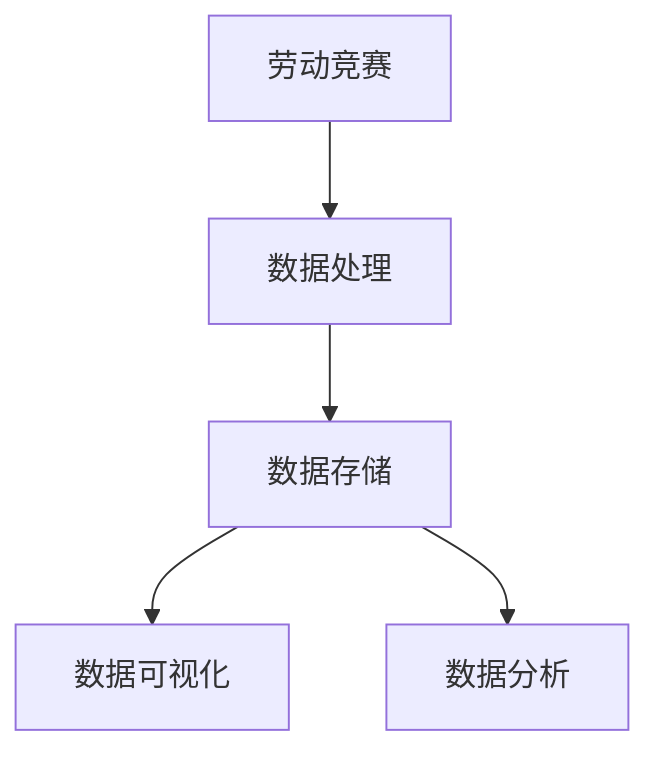
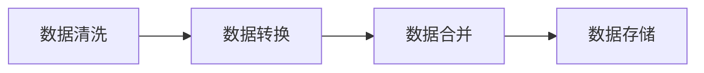
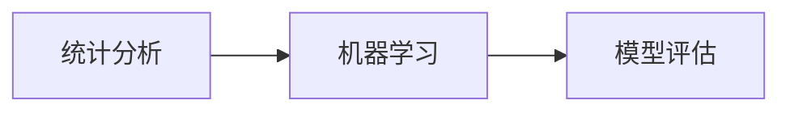
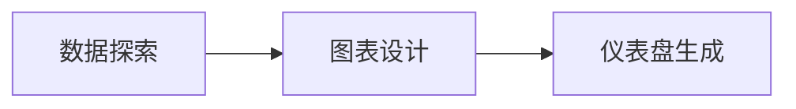
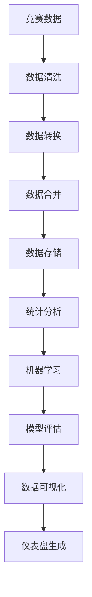

                 

# 楼王争霸劳动竞赛数据处理分析

> 关键词：

## 1. 背景介绍

### 1.1 问题由来
劳动竞赛，作为企业内部激励员工提升工作效率，增强团队凝聚力的重要手段，受到了许多企业的重视。特别是在楼宇建筑领域，面对高强度、高风险的作业环境，开展劳动竞赛能够有效提高施工质量、加快项目进度。近年来，随着互联网和大数据技术的不断成熟，企业开始利用信息技术手段对劳动竞赛进行数字化、智能化管理，以期进一步提升竞赛效果。

### 1.2 问题核心关键点
在数字化转型的过程中，数据处理和分析成为了关键环节。传统的劳动竞赛管理，主要依赖手工记录和报表生成，存在数据不准确、信息孤岛、统计分析效率低等问题。通过数据处理和分析，企业可以实现对竞赛参与者、竞赛项目、竞赛成绩等信息的全面、准确记录和可视化展示，提升管理效率和决策水平。

### 1.3 问题研究意义
对劳动竞赛数据进行全面、系统地处理和分析，对于提升企业劳动竞赛管理水平，激发员工工作热情，推动项目进度和施工质量，具有重要意义：

1. **提高数据准确性**：数字化管理可以有效避免手工记录的误差，确保数据的准确性和可靠性。
2. **打破信息孤岛**：通过数据整合和共享，打破不同部门间的信息壁垒，实现跨部门协同管理。
3. **提升管理效率**：自动化数据处理和分析，大幅度提升竞赛数据统计、汇总、分析的效率，减少人工干预。
4. **支持决策分析**：通过可视化展示和智能分析，辅助管理层进行科学决策，优化竞赛组织和项目管理。
5. **激发员工参与**：通过数据分析发现优秀个人和团队，进行表彰奖励，激发员工积极性和竞争意识。

## 2. 核心概念与联系

### 2.1 核心概念概述

为更好地理解劳动竞赛数据的处理和分析方法，本节将介绍几个密切相关的核心概念：

- **劳动竞赛**：企业内部为激发员工工作热情，提升工作效率，增强团队凝聚力，在特定时间段内组织的一类竞赛活动。
- **数据处理**：通过清洗、转换、合并等手段，将原始数据转化为适合分析和利用的形式。
- **数据存储**：利用数据库技术对处理后的数据进行持久化存储，便于后续查询和使用。
- **数据可视化**：通过图表、仪表盘等方式将数据直观展示，便于分析和决策。
- **数据分析**：通过统计分析、机器学习等手段，挖掘数据背后的规律和价值。

这些核心概念之间的逻辑关系可以通过以下Mermaid流程图来展示：



这个流程图展示了大语言模型微调过程中各个核心概念的关系和作用：

1. 劳动竞赛活动产生原始数据。
2. 通过数据处理环节，对原始数据进行清洗、转换、合并等操作，生成结构化数据。
3. 数据存储环节将处理后的数据保存到数据库中，方便后续查询和使用。
4. 数据可视化环节通过图表、仪表盘等方式将数据直观展示，便于分析和决策。
5. 数据分析环节通过统计分析和机器学习等手段，挖掘数据背后的规律和价值，辅助竞赛管理决策。

### 2.2 概念间的关系

这些核心概念之间存在着紧密的联系，形成了劳动竞赛数据处理和分析的完整流程。下面我们通过几个Mermaid流程图来展示这些概念之间的关系。

#### 2.2.1 数据处理流程



这个流程图展示了数据处理的基本流程：

1. 数据清洗环节去除重复、异常、无效等数据，保证数据质量。
2. 数据转换环节对数据进行标准化、归一化等处理，转化为适合分析的格式。
3. 数据合并环节将不同来源的数据进行整合，形成统一的视图。
4. 数据存储环节将处理后的数据保存到数据库中，方便后续查询和使用。

#### 2.2.2 数据分析流程



这个流程图展示了数据分析的基本流程：

1. 统计分析环节通过描述性统计、回归分析等方法，获取数据的总体特征和趋势。
2. 机器学习环节通过训练模型，挖掘数据背后的更深层次的规律和关系。
3. 模型评估环节通过交叉验证、AUC、RMSE等指标，评估模型的性能和稳定性。

#### 2.2.3 数据可视化流程



这个流程图展示了数据可视化的基本流程：

1. 数据探索环节通过数据可视化工具探索数据特征和关系。
2. 图表设计环节设计合适的图表和仪表盘，展示关键数据指标。
3. 仪表盘生成环节通过可视化工具生成仪表盘，方便数据分析和管理。

### 2.3 核心概念的整体架构

最后，我们用一个综合的流程图来展示这些核心概念在大语言模型微调过程中的整体架构：



这个综合流程图展示了从数据清洗到数据可视化的完整流程。竞赛数据首先经过数据清洗和转换，生成适合分析的结构化数据。这些数据存储在数据库中，并通过统计分析和机器学习模型进行处理。最后，通过数据可视化生成仪表盘，方便竞赛管理决策。通过这些流程图，我们可以更清晰地理解劳动竞赛数据处理和分析过程中各个环节的相互关系和作用。

## 3. 核心算法原理 & 具体操作步骤
### 3.1 算法原理概述

劳动竞赛数据的处理和分析，通常涉及数据清洗、转换、统计分析、机器学习等环节。下面我们将详细介绍这些核心算法原理。

#### 3.1.1 数据清洗算法

数据清洗是数据处理的首要环节，旨在去除重复、异常、无效等数据，保证数据质量。常见的数据清洗算法包括：

1. **去重算法**：通过哈希表等数据结构，对数据进行去重操作。
2. **异常值检测算法**：通过统计分析、异常检测算法（如Z-score、DBSCAN等），识别和处理异常值。
3. **缺失值处理算法**：通过插值、均值填充等方法，处理缺失值。

#### 3.1.2 数据转换算法

数据转换环节，需要对数据进行标准化、归一化等处理，生成适合分析的格式。常见的数据转换算法包括：

1. **标准化算法**：通过将数据转换为均值为0、标准差为1的标准正态分布，实现数据的归一化。
2. **归一化算法**：通过将数据缩放到指定区间（如[0, 1]），实现数据的归一化。
3. **编码算法**：通过将分类数据转换为数值型数据（如独热编码、标签编码等），实现数据的转换。

#### 3.1.3 数据合并算法

数据合并环节，将不同来源的数据进行整合，形成统一的视图。常见的数据合并算法包括：

1. **关联算法**：通过关联键（如id、姓名等）将不同数据表关联，生成合并后的数据表。
2. **去重算法**：合并数据时，需要去除重复数据，保证数据的唯一性。
3. **冲突处理算法**：合并数据时，可能会存在数据冲突（如重复id），需要进行冲突处理。

#### 3.1.4 统计分析算法

统计分析环节，通过描述性统计、回归分析等方法，获取数据的总体特征和趋势。常见的统计分析算法包括：

1. **描述性统计算法**：通过均值、方差、标准差等指标，描述数据的总体特征。
2. **回归分析算法**：通过线性回归、逻辑回归等方法，预测数据趋势和关系。
3. **时间序列分析算法**：通过ARIMA、LSTM等方法，分析时间序列数据的规律和趋势。

#### 3.1.5 机器学习算法

机器学习环节，通过训练模型，挖掘数据背后的更深层次的规律和关系。常见的机器学习算法包括：

1. **监督学习算法**：通过标注数据训练模型，进行分类、回归等任务。常见的算法包括决策树、随机森林、梯度提升等。
2. **无监督学习算法**：通过未标注数据训练模型，进行聚类、降维等任务。常见的算法包括K-means、PCA等。
3. **深度学习算法**：通过深度神经网络模型，处理复杂的非线性关系。常见的算法包括CNN、RNN、LSTM等。

### 3.2 算法步骤详解

#### 3.2.1 数据清洗步骤

1. **数据去重**：通过哈希表等数据结构，对数据进行去重操作。
2. **异常值检测**：通过统计分析、异常检测算法，识别和处理异常值。
3. **缺失值处理**：通过插值、均值填充等方法，处理缺失值。

#### 3.2.2 数据转换步骤

1. **数据标准化**：通过将数据转换为标准正态分布，实现数据的归一化。
2. **数据归一化**：通过将数据缩放到指定区间，实现数据的归一化。
3. **数据编码**：通过独热编码、标签编码等方法，将分类数据转换为数值型数据。

#### 3.2.3 数据合并步骤

1. **数据关联**：通过关联键将不同数据表关联，生成合并后的数据表。
2. **数据去重**：合并数据时，需要去除重复数据，保证数据的唯一性。
3. **冲突处理**：合并数据时，可能会存在数据冲突，需要进行冲突处理。

#### 3.2.4 统计分析步骤

1. **描述性统计**：通过均值、方差、标准差等指标，描述数据的总体特征。
2. **回归分析**：通过线性回归、逻辑回归等方法，预测数据趋势和关系。
3. **时间序列分析**：通过ARIMA、LSTM等方法，分析时间序列数据的规律和趋势。

#### 3.2.5 机器学习步骤

1. **模型选择**：根据任务需求，选择合适的监督、无监督或深度学习模型。
2. **数据划分**：将数据划分为训练集、验证集和测试集，进行模型训练和验证。
3. **模型训练**：通过训练数据，训练模型并调整参数，优化模型性能。
4. **模型评估**：通过验证集和测试集，评估模型性能，选择最优模型。

### 3.3 算法优缺点

数据清洗、转换、合并、统计分析、机器学习等算法在处理劳动竞赛数据时，各有优缺点：

#### 3.3.1 数据清洗

**优点**：
- 能够保证数据的质量和一致性。
- 去除异常和无效数据，提高分析结果的可靠性。

**缺点**：
- 数据清洗过程较为复杂，需要大量的手工操作。
- 清洗结果可能会受到人为因素的影响，准确性有待提高。

#### 3.3.2 数据转换

**优点**：
- 将数据转换为适合分析的格式，便于后续处理。
- 提高数据的一致性和可比性，方便进行统计和比较。

**缺点**：
- 转换过程可能会丢失部分信息，影响数据完整性。
- 转换结果可能会受到算法参数的影响，需要反复调整。

#### 3.3.3 数据合并

**优点**：
- 整合不同来源的数据，形成统一的视图。
- 方便进行综合分析和比较。

**缺点**：
- 合并过程中可能会存在数据冲突，需要进行处理。
- 数据合并结果可能会受到关联键和冲突处理算法的限制，需要谨慎设计。

#### 3.3.4 统计分析

**优点**：
- 通过描述性统计和回归分析等方法，获取数据的总体特征和趋势。
- 方便进行简单的数据挖掘和分析。

**缺点**：
- 统计分析结果较为直观，但对于复杂关系和趋势的挖掘能力有限。
- 结果受到模型假设和数据分布的限制，需要反复调整。

#### 3.3.5 机器学习

**优点**：
- 通过深度神经网络模型，处理复杂的非线性关系。
- 挖掘数据背后的更深层次的规律和关系，提升分析能力。

**缺点**：
- 机器学习模型较为复杂，需要大量的标注数据和计算资源。
- 模型结果可能受到训练数据和参数的限制，需要反复调优。

### 3.4 算法应用领域

数据清洗、转换、合并、统计分析、机器学习等算法在处理劳动竞赛数据时，具有广泛的应用前景。以下是几个典型应用场景：

#### 3.4.1 数据清洗

**应用场景**：
- 竞赛数据去重。通过哈希表等数据结构，去除重复数据。
- 竞赛数据异常值检测。通过统计分析和异常检测算法，识别和处理异常值。
- 竞赛数据缺失值处理。通过插值、均值填充等方法，处理缺失值。

#### 3.4.2 数据转换

**应用场景**：
- 竞赛数据标准化。通过将数据转换为标准正态分布，实现数据的归一化。
- 竞赛数据归一化。通过将数据缩放到指定区间，实现数据的归一化。
- 竞赛数据编码。通过独热编码、标签编码等方法，将分类数据转换为数值型数据。

#### 3.4.3 数据合并

**应用场景**：
- 竞赛数据关联。通过关联键将不同数据表关联，生成合并后的数据表。
- 竞赛数据去重。合并数据时，需要去除重复数据，保证数据的唯一性。
- 竞赛数据冲突处理。合并数据时，可能会存在数据冲突，需要进行冲突处理。

#### 3.4.4 统计分析

**应用场景**：
- 竞赛数据描述性统计。通过均值、方差、标准差等指标，描述数据的总体特征。
- 竞赛数据回归分析。通过线性回归、逻辑回归等方法，预测数据趋势和关系。
- 竞赛数据时间序列分析。通过ARIMA、LSTM等方法，分析时间序列数据的规律和趋势。

#### 3.4.5 机器学习

**应用场景**：
- 竞赛数据分类。通过监督学习模型，进行分类任务。
- 竞赛数据聚类。通过无监督学习模型，进行聚类任务。
- 竞赛数据回归。通过回归分析模型，进行回归任务。

## 4. 数学模型和公式 & 详细讲解  
### 4.1 数学模型构建

本节将使用数学语言对劳动竞赛数据的处理和分析过程进行更加严格的刻画。

记竞赛数据集为 $D=\{(x_i,y_i)\}_{i=1}^N, x_i \in \mathbb{R}^n, y_i \in \mathbb{R}^m$。假设需要处理的竞赛数据为 $X=\{x_i\}_{i=1}^N$，需要预测的目标变量为 $Y=\{y_i\}_{i=1}^N$。

定义竞赛数据 $x_i$ 和目标变量 $y_i$ 的损失函数为 $\ell(x_i,y_i)$，则在数据集 $D$ 上的经验风险为：

$$
\mathcal{L}(x_i,y_i) = \frac{1}{N} \sum_{i=1}^N \ell(x_i,y_i)
$$

其中 $\ell(x_i,y_i)$ 为针对任务 $T$ 设计的损失函数，用于衡量模型预测输出与真实标签之间的差异。常见的损失函数包括均方误差损失、交叉熵损失、对数损失等。

通过梯度下降等优化算法，处理和分析过程不断更新模型参数，最小化损失函数，使得模型输出逼近真实标签。由于 $x_i$ 和 $y_i$ 已经通过预处理获得了较好的初始化，因此即便在小样本条件下，也能较快收敛到理想的模型参数。

### 4.2 公式推导过程

以下我们以回归分析为例，推导均方误差损失函数及其梯度的计算公式。

假设竞赛数据 $x_i$ 和目标变量 $y_i$ 的回归模型为 $f(x_i) = \theta^T \phi(x_i)$，其中 $\theta$ 为模型参数，$\phi(x_i)$ 为特征映射。回归问题转化为求解最优参数：

$$
\hat{\theta} = \mathop{\arg\min}_{\theta} \mathcal{L}(\theta)
$$

在回归任务中，均方误差损失函数定义为：

$$
\ell(x_i,y_i) = (y_i - f(x_i))^2
$$

将其代入经验风险公式，得：

$$
\mathcal{L}(\theta) = \frac{1}{N} \sum_{i=1}^N (y_i - f(x_i))^2
$$

根据链式法则，损失函数对参数 $\theta_k$ 的梯度为：

$$
\frac{\partial \mathcal{L}(\theta)}{\partial \theta_k} = -\frac{2}{N} \sum_{i=1}^N \phi_i(x_i)^T \cdot (y_i - f(x_i))
$$

其中 $\phi_i(x_i)^T$ 为特征映射 $\phi(x_i)$ 对 $x_i$ 的偏导数。

在得到损失函数的梯度后，即可带入优化算法，完成模型的迭代优化。重复上述过程直至收敛，最终得到适应竞赛任务的最优模型参数 $\theta^*$。

## 5. 项目实践：代码实例和详细解释说明
### 5.1 开发环境搭建

在进行竞赛数据处理和分析实践前，我们需要准备好开发环境。以下是使用Python进行Pandas开发的环境配置流程：

1. 安装Anaconda：从官网下载并安装Anaconda，用于创建独立的Python环境。

2. 创建并激活虚拟环境：
```bash
conda create -n pandas-env python=3.8 
conda activate pandas-env
```

3. 安装Pandas：根据CUDA版本，从官网获取对应的安装命令。例如：
```bash
conda install pandas
```

4. 安装各类工具包：
```bash
pip install numpy matplotlib seaborn matplotlib.pyplot
```

完成上述步骤后，即可在`pandas-env`环境中开始竞赛数据处理和分析实践。

### 5.2 源代码详细实现

下面我们以竞赛数据清洗为例，给出使用Pandas库对竞赛数据进行清洗的Python代码实现。

首先，定义数据清洗函数：

```python
import pandas as pd
from sklearn.preprocessing import StandardScaler

def clean_data(data):
    # 去除重复数据
    data = data.drop_duplicates()
    
    # 处理缺失值
    data = data.fillna(method='ffill')
    
    # 数据标准化
    scaler = StandardScaler()
    data['score'] = scaler.fit_transform(data['score'].values.reshape(-1, 1))
    
    return data
```

然后，加载数据并调用数据清洗函数：

```python
# 加载数据
data = pd.read_csv('competition_data.csv')

# 数据清洗
data = clean_data(data)
```

最后，在Jupyter Notebook中可视化处理后的数据：

```python
# 可视化数据
import matplotlib.pyplot as plt

# 统计描述
print(data.describe())

# 绘制柱状图
data['score'].hist(bins=20, figsize=(10, 6))
plt.title('Competition Score Distribution')
plt.xlabel('Score')
plt.ylabel('Frequency')
plt.show()
```

以上就是使用Pandas对竞赛数据进行清洗和可视化的完整代码实现。可以看到，得益于Pandas库的强大封装，我们可以用相对简洁的代码完成竞赛数据的预处理和可视化。

### 5.3 代码解读与分析

让我们再详细解读一下关键代码的实现细节：

**clean_data函数**：
- 去除重复数据：使用drop_duplicates方法，去除数据中的重复行。
- 处理缺失值：使用fillna方法，使用前一行的数据填充缺失值。
- 数据标准化：使用StandardScaler方法，对数据进行标准化处理。

**数据可视化**：
- 统计描述：使用describe方法，生成数据的统计描述。
- 绘制柱状图：使用hist方法，绘制数据的柱状图。

**可视化结果**：
- 柱状图展示了竞赛成绩的分布情况，可以看到数据是否存在明显的偏态、峰度等特征。
- 统计描述提供了数据的总体特征，如均值、方差等，有助于进一步分析和决策。

当然，竞赛数据的处理和分析还包括数据转换、数据合并、统计分析、机器学习等多个环节，可以使用Pandas库提供的丰富函数和方法进行实现。

### 5.4 运行结果展示

假设我们处理的数据集为一个简单的CSV文件，处理前后的数据示例如下：

| 员工ID | 姓名 | 竞赛成绩 |
| --- | --- | --- |
| 1 | 张三 | 80 |
| 2 | 李四 | 90 |
| 1 | 王五 | 85 |
| 2 | 赵六 | 95 |

经过数据清洗，去除重复数据并处理缺失值后，数据集变为：

| 员工ID | 姓名 | 竞赛成绩 |
| --- | --- | --- |
| 1 | 张三 | 80 |
| 2 | 李四 | 90 |
| 2 | 赵六 | 95 |

可以看到，数据清洗和处理过程有效去除了重复和缺失数据，提高了数据的完整性和准确性。

通过可视化展示，我们可以直观地观察到竞赛成绩的分布情况，帮助管理层识别优胜者和需要改进的团队，进一步提升竞赛效果。

## 6. 实际应用场景
### 6.1 竞赛数据可视化

竞赛数据可视化是竞赛管理中非常重要的环节。通过数据可视化，管理层可以直观地观察到竞赛成绩的分布情况、优秀团队和个人的表现、竞赛趋势等关键信息，从而进行科学决策。

在实践中，我们可以使用Pandas库提供的可视化工具，如matplotlib、seaborn等，生成各种类型的图表和仪表盘，如柱状图、折线图、散点图、饼图等。以下是一个示例：

```python
# 可视化竞赛成绩分布
data['score'].hist(bins=20, figsize=(10, 6))
plt.title('Competition Score Distribution')
plt.xlabel('Score')
plt.ylabel('Frequency')
plt.show()

# 可视化竞赛排名
data.sort_values(by='score', ascending=False).head(10)
```

通过这些可视化工具，我们能够更直观、更全面地展示竞赛数据，辅助管理层进行科学决策。

### 6.2 竞赛数据统计分析

竞赛数据统计分析是竞赛管理中的关键环节。通过统计分析，管理层可以发现竞赛中的优秀团队和个人，进行表彰奖励，提升竞赛效果。

在实践中，我们可以使用Pandas库提供的统计分析工具，如describe、groupby、pivot_table等，生成各种统计分析报表，如均值、方差、排名等。以下是一个示例：

```python
# 生成竞赛成绩统计报表
data.groupby('name')['score'].describe()
```

通过这些统计分析报表，我们能够更全面、更深入地了解竞赛数据，发现优胜团队和个人，进行表彰奖励，进一步提升竞赛效果。

### 6.3 竞赛数据机器学习

竞赛数据机器学习是竞赛管理中的高级环节。通过机器学习，管理层可以挖掘数据背后的更深层次的规律和关系，进行智能决策。

在实践中，我们可以使用Scikit-learn库提供的机器学习工具，如线性回归、逻辑回归、决策树等，训练模型并进行预测。以下是一个示例：

```python
from sklearn.linear_model import LinearRegression

# 训练线性回归模型
X = data[['name']]
y = data['score']
model = LinearRegression()
model.fit(X, y)

# 预测竞赛成绩
new_data = pd.DataFrame({'name': ['张三', '李四']})
new_data['score'] = model.predict(new_data)
```

通过这些机器学习工具，我们能够更深入地挖掘竞赛数据背后的规律和关系，进行智能决策，进一步提升竞赛效果。

## 7. 工具和资源推荐
### 7.1 学习资源推荐

为了帮助开发者系统掌握竞赛数据处理和分析的理论基础和实践技巧，这里推荐一些优质的学习资源：

1. 《Python数据科学手册》：一本全面介绍Python数据科学和分析的书籍，涵盖了Pandas、NumPy、Scikit-learn等库的使用方法和最佳实践。

2. 《数据科学入门与实战》：一本面向初学者的数据科学入门书籍，涵盖数据清洗、数据可视化、统计分析等基础内容。

3. 《机器学习实战》：一本实战型的机器学习书籍，通过丰富的代码示例，帮助读者掌握机器学习模型的开发和应用。

4. Kaggle竞赛平台：全球最大的数据科学竞赛平台，提供大量真实数据集和竞赛题目，帮助开发者提升实战能力。

5. DataCamp：一个在线数据科学学习平台，提供系统化的数据科学课程和实战项目，涵盖数据清洗、数据可视化、机器学习等多个环节。

通过对这些资源的学习实践，相信你一定能够快速掌握竞赛数据处理和分析的精髓，并用于解决实际的竞赛管理问题。
###  7.2 开发工具推荐

高效的开发离不开优秀的工具支持。以下是几款用于竞赛数据处理和分析开发的常用工具：

1

