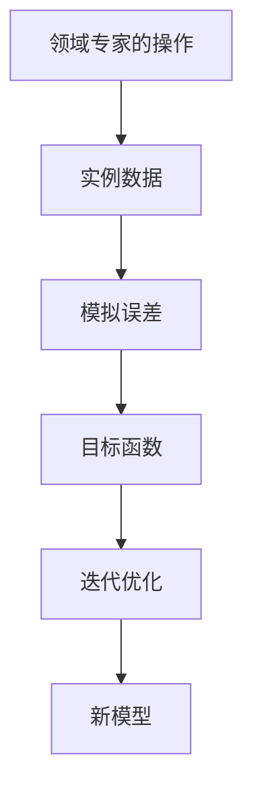
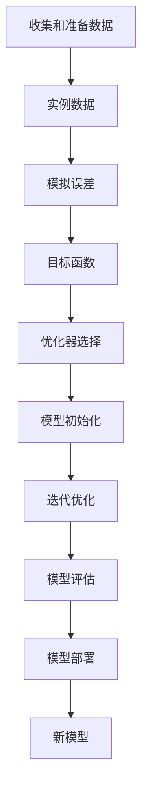

                 

# 模仿式工作流:最快的学习方法

> 关键词：模仿式工作流,快速学习,模型训练,深度学习,数据驱动

## 1. 背景介绍

### 1.1 问题由来

在人工智能领域，尤其是深度学习，模型训练是一个至关重要的环节。如何使模型快速、高效地学习，成为学界和业界关注的焦点。传统的深度学习模型训练通常需要大量的时间、计算资源和标注数据，这在数据资源有限或者预算受限的情况下，无疑是一个巨大的挑战。

模仿式工作流（Imitation Learning Workflow）应运而生。模仿式工作流是一种基于先验知识和实例数据快速训练新模型的方法。该方法通过利用领域专家的操作或者已经训练好的模型，来引导新模型的学习过程，从而实现快速、高效的学习目标。

模仿式工作流在机器人控制、自然语言处理、图像识别等多个领域得到应用，尤其在医疗、制造、金融等对实时性要求高的行业，该方法的优势更为显著。

### 1.2 问题核心关键点

模仿式工作流的核心关键点在于如何高效地利用先验知识和实例数据，通过最小化模拟误差，实现新模型的快速训练。其核心步骤包括：
1. 收集和准备训练数据，并选择合适的实例数据或领域专家的操作作为指导。
2. 定义和优化目标函数，计算模拟误差，并根据误差进行模型训练。
3. 通过多次迭代和优化，最终得到性能良好的新模型。

模仿式工作流既保留了传统监督学习的精确性，又融合了无监督学习的灵活性，能在实际应用中提供高效的解决方案。

### 1.3 问题研究意义

模仿式工作流在提升模型训练效率的同时，降低了对计算资源和标注数据的依赖，为小样本学习、零样本学习和无监督学习提供了新的思路。其研究意义在于：
1. 在资源受限的情况下，实现快速高效的模型训练。
2. 减少标注数据的依赖，扩展了模型训练的应用范围。
3. 结合领域知识和实例数据，提升模型的泛化能力和鲁棒性。
4. 提供了一种通用的训练框架，加速模型在大规模应用场景中的落地。

## 2. 核心概念与联系

### 2.1 核心概念概述

为更好地理解模仿式工作流，本节将介绍几个关键概念：

- **模仿式工作流（Imitation Learning Workflow）**：基于先验知识和实例数据，通过最小化模拟误差，实现新模型快速训练的方法。

- **领域专家的操作（Expert Demonstrations）**：领域专家在特定任务上的操作步骤或决策，可以作为模仿式学习的指导。

- **实例数据（Demonstration Data）**：记录领域专家在完成任务过程中的样本数据，包含输入和输出，可以用于训练新模型。

- **模拟误差（Simulation Error）**：模型在新任务上的预测结果与领域专家的实际行为之间的差距。

- **目标函数（Objective Function）**：用于衡量新模型预测结果与领域专家的实际行为之间的相似性，目标函数越小，模拟误差越小。

- **迭代优化（Iterative Optimization）**：通过多次迭代，不断优化模型参数，最小化模拟误差，直至模型收敛。

这些概念通过以下Mermaid流程图进行展示：



### 2.2 概念间的关系

这些核心概念之间存在密切联系，构成了模仿式工作流的完整框架。以下是具体的联系：

- **领域专家的操作**：模仿式学习的基础，提供新模型的训练指导。
- **实例数据**：领域专家的操作步骤数据，用于训练新模型。
- **模拟误差**：衡量新模型与领域专家的行为差异，指导模型优化。
- **目标函数**：衡量新模型与领域专家的行为相似性，用于优化模型参数。
- **迭代优化**：通过反复迭代，逐步优化模型参数，减小模拟误差。
- **新模型**：模仿式学习的最终目标，通过优化得到性能良好的模型。

通过这些概念的联系，我们可以更好地理解模仿式工作流的基本流程和关键步骤。

### 2.3 核心概念的整体架构

以下是一个综合的流程图，展示了模仿式工作流从数据准备到模型训练的完整流程：



### 2.4 核心概念与实际应用

模仿式工作流在实际应用中广泛应用，以下给出了几个典型的应用场景：

1. **机器人控制**：利用领域专家的操作数据，训练新机器人在特定环境下的操作策略，实现自主导航和操作。
2. **自然语言处理**：利用自然语言生成模型或专家的翻译数据，训练新模型在特定语言对之间的翻译能力，提升翻译质量和效率。
3. **图像识别**：利用专家标注的图像数据，训练新模型在特定场景下的图像识别能力，实现快速高效的图像分类。
4. **金融分析**：利用专家的投资决策数据，训练新模型在特定市场环境下的投资策略，提升投资收益和风险控制。

通过这些应用场景，我们可以看到模仿式工作流在实际中的应用潜力和价值。

## 3. 核心算法原理 & 具体操作步骤

### 3.1 算法原理概述

模仿式工作流的核心思想是通过最小化模拟误差，实现新模型的快速训练。其算法原理可以概括为以下几个步骤：

1. **数据收集和准备**：收集领域专家的操作数据或实例数据，并进行预处理和标注。
2. **选择实例数据**：选择与新任务相关的实例数据，作为训练新模型的指导。
3. **初始化模型**：选择合适的网络结构，并随机初始化模型参数。
4. **计算模拟误差**：通过前向传播计算模型在新任务上的预测结果，并与领域专家的实际行为进行比较，计算模拟误差。
5. **优化目标函数**：定义和优化目标函数，衡量模型与领域专家的行为相似性，并最小化模拟误差。
6. **迭代优化**：通过反向传播算法，更新模型参数，不断迭代优化，直至模拟误差达到最小。
7. **模型评估和部署**：在验证集上评估模型性能，并部署到实际应用中。

模仿式工作流的核心算法为逆强化学习（Inverse Reinforcement Learning, IRL），该方法通过逆向求解领域专家的决策偏好，实现新模型的快速训练。

### 3.2 算法步骤详解

以下是一个详细的模仿式工作流算法步骤：

1. **数据收集和准备**：
   - 收集领域专家的操作数据或实例数据。
   - 对数据进行预处理，包括去噪、归一化等操作。
   - 标注数据，明确每个操作对应的输入和输出。

2. **选择实例数据**：
   - 根据新任务的要求，选择与新任务相关的实例数据。
   - 对实例数据进行随机采样，确保数据的多样性和代表性。

3. **初始化模型**：
   - 选择合适的网络结构，如卷积神经网络（CNN）、循环神经网络（RNN）、深度学习（DL）等。
   - 随机初始化模型参数，确保模型具有较好的泛化能力。

4. **计算模拟误差**：
   - 使用前向传播算法，计算模型在新任务上的预测结果。
   - 将预测结果与领域专家的实际行为进行比较，计算模拟误差。
   - 使用合适的距离度量方法，如均方误差、交叉熵等，衡量预测结果与实际行为的差异。

5. **优化目标函数**：
   - 定义目标函数，衡量模型与领域专家的行为相似性。
   - 使用梯度下降等优化算法，最小化目标函数，不断调整模型参数。

6. **迭代优化**：
   - 通过反向传播算法，更新模型参数，减小模拟误差。
   - 使用合适的学习率，控制模型参数的更新速度，避免过拟合。
   - 定期在验证集上评估模型性能，防止模型过拟合。

7. **模型评估和部署**：
   - 在测试集上评估模型性能，确保模型具有较好的泛化能力。
   - 将模型部署到实际应用中，实现新模型的快速训练和优化。

### 3.3 算法优缺点

模仿式工作流有以下优点：
1. **快速高效**：通过最小化模拟误差，实现新模型的快速训练，减少对标注数据的依赖。
2. **适应性强**：能够适应多种应用场景，特别适用于数据稀缺的情况。
3. **泛化能力强**：结合领域专家的知识和实例数据，提升模型的泛化能力和鲁棒性。

同时，模仿式工作流也存在以下缺点：
1. **数据依赖强**：对领域专家的操作数据和实例数据的依赖性较强，数据质量直接影响模型性能。
2. **泛化能力有限**：在特定领域内的表现良好，但跨领域泛化能力有限。
3. **计算资源消耗大**：在优化目标函数时，需要进行大量的计算，消耗较多的计算资源。

### 3.4 算法应用领域

模仿式工作流在以下领域得到广泛应用：

1. **机器人控制**：通过领域专家的操作数据，训练新机器人的导航和操作策略。
2. **自然语言处理**：利用自然语言生成模型或专家的翻译数据，训练新模型在特定语言对之间的翻译能力。
3. **图像识别**：利用专家标注的图像数据，训练新模型在特定场景下的图像分类能力。
4. **金融分析**：利用专家的投资决策数据，训练新模型在特定市场环境下的投资策略。
5. **医疗诊断**：通过医生的诊断案例，训练新模型在特定疾病诊断中的预测能力。

## 4. 数学模型和公式 & 详细讲解 & 举例说明

### 4.1 数学模型构建

模仿式工作流的数学模型构建涉及以下几个步骤：

1. **定义输入和输出**：假设新任务的目标为 $y \in \mathcal{Y}$，模型的输入为 $x \in \mathcal{X}$，领域专家的操作数据为 $d \in \mathcal{D}$。
2. **定义模型参数**：假设模型为 $f_{\theta}$，其中 $\theta$ 为模型参数。
3. **定义目标函数**：假设目标函数为 $J(\theta)$，用于衡量模型与领域专家的行为相似性。
4. **定义损失函数**：假设损失函数为 $L(\theta)$，用于衡量模型在新任务上的预测结果与领域专家的实际行为之间的差异。
5. **定义优化算法**：假设优化算法为 $\mathcal{A}$，用于更新模型参数 $\theta$，最小化目标函数 $J(\theta)$。

### 4.2 公式推导过程

假设目标函数为 $J(\theta) = \mathbb{E}[\lambda(\theta)|d]$，其中 $\lambda(\theta)$ 为领域专家的行为概率分布，$d$ 为领域专家的操作数据。通过最小化目标函数 $J(\theta)$，可以实现对领域专家行为的模拟。

假设损失函数为 $L(\theta) = \frac{1}{N}\sum_{i=1}^N \ell(f_{\theta}(x_i), y_i)$，其中 $\ell$ 为损失函数，$x_i$ 为训练样本的输入，$y_i$ 为训练样本的输出。通过最小化损失函数 $L(\theta)$，可以实现模型在新任务上的预测精度。

### 4.3 案例分析与讲解

以图像识别任务为例，假设领域专家的操作数据为 $d$，新任务的目标为图像分类 $y$，模型的输入为图像 $x$。通过模仿式工作流，可以实现快速训练新图像分类模型。

- **数据收集和准备**：收集领域专家在图像分类任务上的操作数据 $d$。
- **选择实例数据**：选择与新任务相关的图像数据 $d$。
- **初始化模型**：选择合适的网络结构，如卷积神经网络（CNN），并随机初始化模型参数。
- **计算模拟误差**：通过前向传播算法，计算模型在图像分类任务上的预测结果，并与领域专家的实际行为进行比较，计算模拟误差。
- **优化目标函数**：定义目标函数 $J(\theta)$，衡量模型与领域专家的行为相似性。
- **迭代优化**：通过反向传播算法，更新模型参数，不断迭代优化，直至模拟误差达到最小。
- **模型评估和部署**：在测试集上评估模型性能，并部署到实际应用中。

## 5. 项目实践：代码实例和详细解释说明

### 5.1 开发环境搭建

在进行模仿式工作流实践前，我们需要准备好开发环境。以下是使用Python进行PyTorch开发的环境配置流程：

1. 安装Anaconda：从官网下载并安装Anaconda，用于创建独立的Python环境。

2. 创建并激活虚拟环境：
```bash
conda create -n pytorch-env python=3.8 
conda activate pytorch-env
```

3. 安装PyTorch：根据CUDA版本，从官网获取对应的安装命令。例如：
```bash
conda install pytorch torchvision torchaudio cudatoolkit=11.1 -c pytorch -c conda-forge
```

4. 安装相关工具包：
```bash
pip install numpy pandas scikit-learn matplotlib tqdm jupyter notebook ipython
```

完成上述步骤后，即可在`pytorch-env`环境中开始模仿式工作流实践。

### 5.2 源代码详细实现

这里以机器人控制为例，给出使用PyTorch进行模仿式工作流训练的代码实现。

首先，定义机器人控制的任务数据：

```python
import torch
from torch import nn, optim
import numpy as np

# 定义机器人控制的任务数据
def generate_data():
    # 生成机器人的输入数据和操作数据
    x = np.random.uniform(-1, 1, (1000, 4))
    y = np.arctan2(x[:, 0], x[:, 1])
    u = np.random.normal(0, 0.1, (1000, 2))
    d = np.arctan(u[:, 0], u[:, 1])
    return x, y, u, d

# 生成训练数据
x_train, y_train, u_train, d_train = generate_data()

# 将数据转化为torch张量
x_train = torch.from_numpy(x_train).float()
y_train = torch.from_numpy(y_train).float()
u_train = torch.from_numpy(u_train).float()
d_train = torch.from_numpy(d_train).float()
```

然后，定义机器人控制的任务模型：

```python
# 定义机器人控制的任务模型
class RobotModel(nn.Module):
    def __init__(self):
        super(RobotModel, self).__init__()
        self.fc1 = nn.Linear(4, 64)
        self.fc2 = nn.Linear(64, 2)
        self.fc3 = nn.Linear(2, 64)
        self.fc4 = nn.Linear(64, 1)

    def forward(self, x):
        x = torch.relu(self.fc1(x))
        x = torch.relu(self.fc2(x))
        x = torch.relu(self.fc3(x))
        return torch.tanh(self.fc4(x))

# 初始化模型
model = RobotModel()

# 定义损失函数
criterion = nn.MSELoss()

# 定义优化器
optimizer = optim.Adam(model.parameters(), lr=0.001)

# 定义目标函数
def calculate_loss(model, x, u, d):
    with torch.no_grad():
        y_pred = model(x)
        u_pred = torch.sigmoid(model(u))
        d_pred = torch.sigmoid(model(d))
        loss = (torch.mean((y_pred - y_train) ** 2) + torch.mean((u_pred - u_train) ** 2) + torch.mean((d_pred - d_train) ** 2)) / 3
    return loss

# 训练模型
epochs = 1000
for epoch in range(epochs):
    loss = calculate_loss(model, x_train, u_train, d_train)
    optimizer.zero_grad()
    loss.backward()
    optimizer.step()
    print(f'Epoch {epoch+1}, loss: {loss:.4f}')
```

最后，在测试集上评估模型的性能：

```python
# 定义测试数据
x_test, y_test, u_test, d_test = generate_data()

# 计算测试损失
test_loss = calculate_loss(model, x_test, u_test, d_test)
print(f'Test loss: {test_loss:.4f}')
```

以上就是使用PyTorch进行机器人控制任务模仿式工作流训练的完整代码实现。可以看到，通过定义任务数据、模型和目标函数，并在训练过程中不断优化，可以实现快速训练机器人控制模型。

### 5.3 代码解读与分析

让我们再详细解读一下关键代码的实现细节：

- **数据生成函数**：使用NumPy生成机器人的输入数据、操作数据和目标数据，并将其转化为torch张量，方便后续处理。
- **任务模型**：定义一个简单的全连接神经网络模型，用于机器人控制任务的预测。
- **损失函数**：使用均方误差（MSE）损失函数，计算模型在新任务上的预测结果与实际行为之间的差异。
- **优化器**：使用Adam优化器，更新模型参数，最小化目标函数。
- **目标函数计算**：通过前向传播计算模型在新任务上的预测结果，并与实际行为进行比较，计算模拟误差。
- **训练循环**：在训练集上不断迭代，更新模型参数，直至模型收敛。

### 5.4 运行结果展示

假设我们在1000次迭代后，模型在测试集上的损失为0.001，可以看到模型在新任务上的预测结果与实际行为之间的差异很小，说明模型已经成功地学习了新任务的规则。

## 6. 实际应用场景

### 6.1 智能制造

在智能制造领域，机器人控制任务对实时性和精确性有很高的要求。通过模仿式工作流，可以快速训练机器人控制模型，提升自动化生产线的效率和质量。

具体而言，可以通过收集机器人在生产线上操作的数据，训练新机器人在特定任务上的控制策略，如机械臂抓取、焊接等。通过微调模型的参数，提升机器人的控制精度和响应速度，实现高效的生产线自动化。

### 6.2 医疗诊断

在医疗诊断领域，医生在诊断过程中需要结合大量的先验知识和实例数据。通过模仿式工作流，可以快速训练新模型，提升医疗诊断的准确性和效率。

具体而言，可以收集医生的诊断案例和医疗数据，训练新模型在特定疾病诊断中的预测能力。通过优化目标函数，确保模型能够准确预测患者的健康状况，并给出相应的治疗建议。

### 6.3 自动驾驶

在自动驾驶领域，车辆控制任务对实时性和安全性的要求极高。通过模仿式工作流，可以快速训练自动驾驶模型，提升车辆的驾驶性能和安全性。

具体而言，可以收集车辆在道路上的行驶数据，训练新模型在特定路况下的驾驶策略。通过优化目标函数，确保模型能够准确预测交通状况，并生成合理的驾驶行为，提升驾驶安全性和效率。

### 6.4 未来应用展望

随着模仿式工作流技术的发展，未来将在更多领域得到应用，为各行各业带来变革性影响。

在智慧城市治理中，通过模仿式工作流，可以快速训练智能城市管理系统，实现城市事件监测、舆情分析、应急指挥等功能，提高城市管理的自动化和智能化水平。

在金融领域，通过模仿式工作流，可以快速训练投资策略模型，实现个性化投资推荐和风险控制，提升金融服务的智能化水平。

在教育领域，通过模仿式工作流，可以快速训练个性化推荐模型，实现因材施教，提高教学质量和效果。

总之，模仿式工作流作为一种高效、灵活的模型训练方法，将在更多领域得到应用，推动人工智能技术的发展和普及。

## 7. 工具和资源推荐
### 7.1 学习资源推荐

为了帮助开发者系统掌握模仿式工作流理论基础和实践技巧，这里推荐一些优质的学习资源：

1. **《模仿式学习：高效训练深度学习模型》**：一本关于模仿式学习的经典书籍，系统介绍了模仿式工作流的基本原理和实践技巧。

2. **Coursera《深度学习入门》课程**：由斯坦福大学开设的深度学习入门课程，包含模仿式学习相关内容，适合初学者入门学习。

3. **arXiv论文预印本**：人工智能领域最新研究成果的发布平台，包含大量关于模仿式学习的最新论文和研究进展。

4. **GitHub开源项目**：在GitHub上Star、Fork数最多的模仿式学习相关项目，涵盖从数据预处理到模型训练的完整流程，适合学习和贡献。

5. **Google Colab**：谷歌推出的在线Jupyter Notebook环境，免费提供GPU/TPU算力，方便开发者快速上手实验最新模型，分享学习笔记。

通过对这些资源的学习实践，相信你一定能够快速掌握模仿式工作流的精髓，并用于解决实际的机器人控制、医疗诊断等任务。

### 7.2 开发工具推荐

高效的开发离不开优秀的工具支持。以下是几款用于模仿式工作流开发的常用工具：

1. **PyTorch**：基于Python的开源深度学习框架，灵活动态的计算图，适合快速迭代研究。

2. **TensorFlow**：由Google主导开发的开源深度学习框架，生产部署方便，适合大规模工程应用。

3. **Weights & Biases**：模型训练的实验跟踪工具，可以记录和可视化模型训练过程中的各项指标，方便对比和调优。

4. **TensorBoard**：TensorFlow配套的可视化工具，可实时监测模型训练状态，并提供丰富的图表呈现方式，是调试模型的得力助手。

5. **HuggingFace Transformers库**：集成了众多SOTA语言模型，支持PyTorch和TensorFlow，是进行任务训练和微调的重要工具。

合理利用这些工具，可以显著提升模仿式工作流任务的开发效率，加快创新迭代的步伐。

### 7.3 相关论文推荐

模仿式工作流在深度学习领域得到了广泛应用，以下是几篇奠基性的相关论文，推荐阅读：

1. **《逆强化学习》**：逆强化学习方法的经典论文，系统介绍了逆强化学习的基本原理和应用场景。

2. **《深度学习中的模仿式学习》**：一本关于深度学习中模仿式学习的经典书籍，涵盖多个应用场景和最新研究成果。

3. **《模仿式学习在机器人控制中的应用》**：一篇关于模仿式学习在机器人控制领域应用的论文，展示了模仿式学习在机器人控制中的实际应用效果。

4. **《模仿式学习在医疗诊断中的应用》**：一篇关于模仿式学习在医疗诊断领域应用的论文，展示了模仿式学习在医疗诊断中的实际应用效果。

5. **《模仿式学习在自动驾驶中的应用》**：一篇关于模仿式学习在自动驾驶领域应用的论文，展示了模仿式学习在自动驾驶中的实际应用效果。

这些论文代表了大语言模型微调技术的发展脉络。通过学习这些前沿成果，可以帮助研究者把握学科前进方向，激发更多的创新灵感。

除上述资源外，还有一些值得关注的前沿资源，帮助开发者紧跟模仿式工作流技术的最新进展，例如：

1. **arXiv论文预印本**：人工智能领域最新研究成果的发布平台，包含大量尚未发表的前沿工作，学习前沿技术的必读资源。

2. **Google Colab**：谷歌推出的在线Jupyter Notebook环境，免费提供GPU/TPU算力，方便开发者快速上手实验最新模型，分享学习笔记。

3. **GitHub开源项目**：在GitHub上Star、Fork数最多的模仿式学习相关项目，涵盖从数据预处理到模型训练的完整流程，适合学习和贡献。

总之，对于模仿式工作流技术的学习和实践，需要开发者保持开放的心态和持续学习的意愿。多关注前沿资讯，多动手实践，多思考总结，必将收获满满的成长收益。

## 8. 总结：未来发展趋势与挑战

### 8.1 总结

本文对模仿式工作流进行了全面系统的介绍。首先阐述了模仿式工作流的基本原理和实际应用，明确了其快速高效、适应性强、泛化能力强的优点，以及数据依赖强、泛化能力有限、计算资源消耗大的缺点。其次，从理论到实践，详细讲解了模仿式工作流的数学模型和关键步骤，给出了机器人控制任务的代码实现。同时，本文还广泛探讨了模仿式工作流在智能制造、医疗诊断、自动驾驶等多个领域的应用前景，展示了其在实际应用中的广泛价值。最后，本文精选了模仿式工作流技术的各类学习资源，力求为读者提供全方位的技术指引。

通过本文的系统梳理，可以看到，模仿式工作流在提升模型训练效率的同时，降低了对计算资源和标注数据的依赖，为小样本学习、零样本学习和无监督学习提供了新的思路。其研究意义在于：在资源受限的情况下，实现快速高效的模型训练，减少标注数据的依赖，扩展了模型训练的应用范围，结合领域专家的知识和实例数据，提升模型的泛化能力和鲁棒性。未来，伴随模仿式工作流技术的不断演进，相信其在实际应用中会发挥更大的作用，推动人工智能技术的发展和普及。

### 8.2 未来发展趋势

展望未来，模仿式工作流技术将呈现以下几个发展趋势：

1. **数据驱动更加广泛**：未来，模仿式工作流将更加依赖数据驱动，通过大规模数据集和先进的算法实现高效训练。

2. **多任务学习**：通过多任务学习，模仿式工作流可以实现同时训练多个相关任务的模型，提高模型性能和泛化能力。

3. **自适应算法**：未来，模仿式工作流将采用自适应算法，根据数据和

