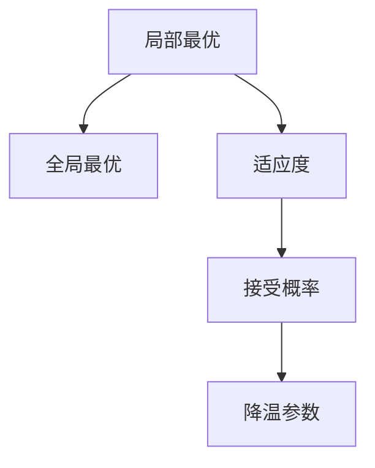
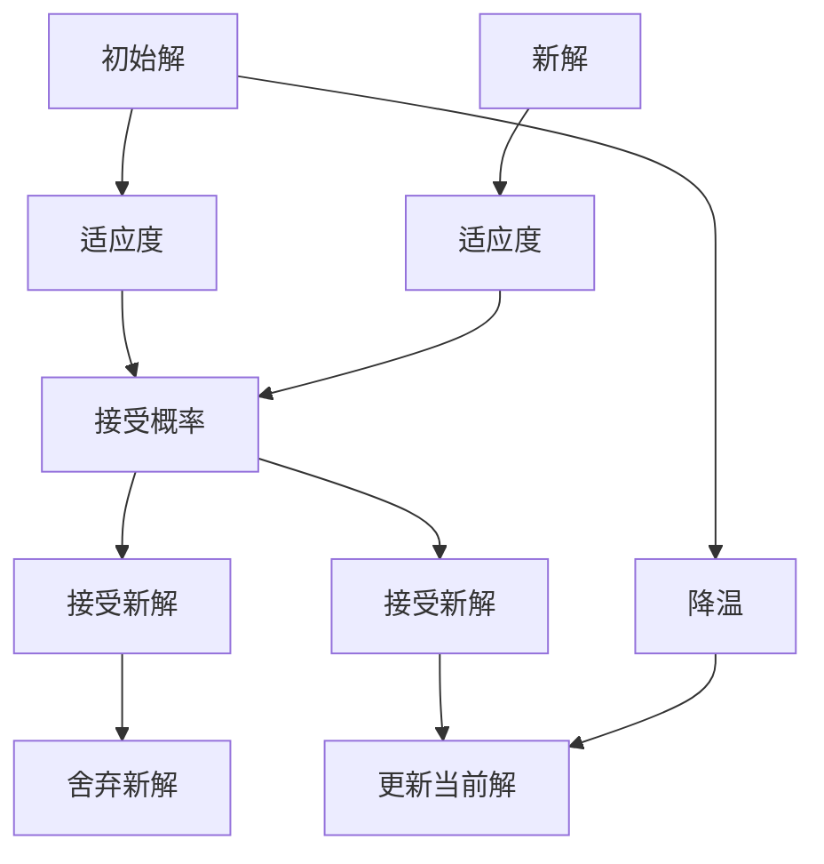
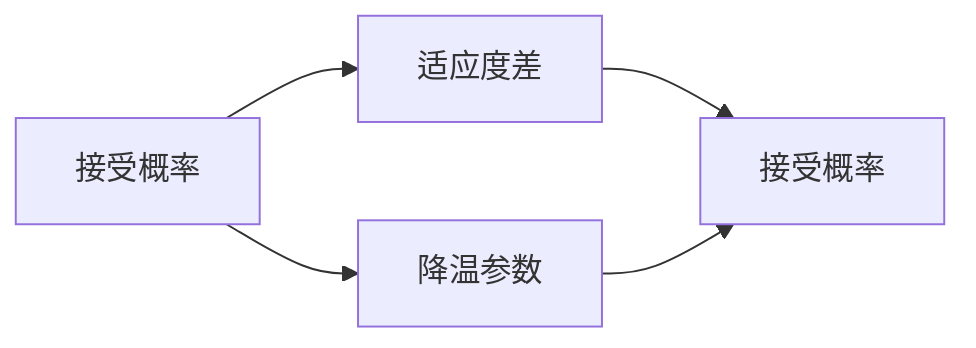
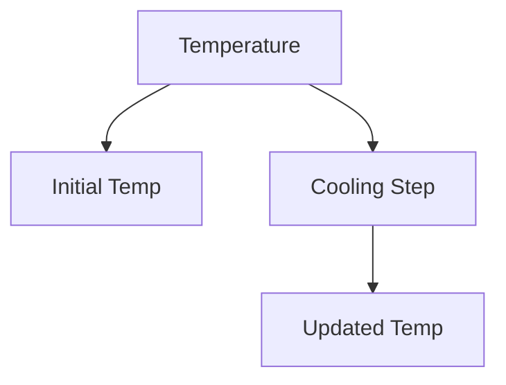
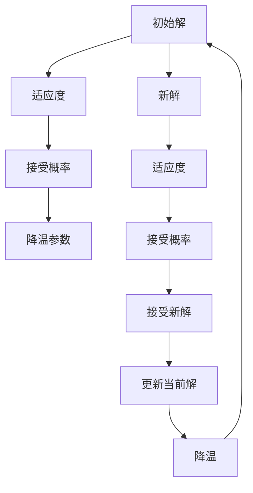

                 

# 模拟退火算法(Simulated Annealing) - 原理与代码实例讲解

> 关键词：模拟退火算法,优化算法,随机化,收敛速度,局部最优

## 1. 背景介绍

### 1.1 问题由来
在机器学习和人工智能领域，优化问题无处不在，从线性回归、神经网络的权重优化，到遗传算法、粒子群优化，优化是几乎每个算法的基础。然而，许多优化问题并不容易解决，尤其是当目标函数非常复杂，存在大量局部最优时。这些问题通常被称为NP-hard问题，其中最著名的例子就是旅行商问题(TSP)和最短路径问题。

为了解决这些问题，科学家们提出了许多优化算法，其中模拟退火算法(Simulated Annealing, SA)因其简单有效而被广泛应用。SA算法最初被用于模拟金属的退火过程，即通过逐步降温来减少金属内部的缺陷。在计算机科学中，SA算法被类比为在求解优化问题时，通过逐步降温来寻找全局最优解。

### 1.2 问题核心关键点
SA算法是一种基于随机化的全局优化算法，其核心思想是通过不断尝试不同的解，逐步降温来最终找到一个较优的解。SA算法的成功在于其在处理多模态、高度非凸的目标函数时，能够有效地跳出局部最优，从而找到全局最优解。

SA算法的主要步骤包括：
1. 初始化当前解和降温参数。
2. 随机生成一个新的解。
3. 计算新解与当前解的适应度差。
4. 以一定的概率接受新解，否则舍弃新解。
5. 不断重复以上步骤，直到达到预设的停止条件。

SA算法与其他优化算法相比，具有以下特点：
1. 可以处理多模态问题，跳出局部最优。
2. 不需要复杂的梯度计算，适用于没有梯度的优化问题。
3. 能够处理大量随机噪声，具有较高的鲁棒性。

### 1.3 问题研究意义
SA算法被广泛应用于各种领域，如机器学习、组合优化、图像处理等。在机器学习中，SA算法可以用于训练神经网络，调整超参数；在组合优化中，SA算法可以用于解决TSP、背包问题等；在图像处理中，SA算法可以用于图像分割、特征提取等。

SA算法的核心在于其随机化特性，通过不断尝试不同的解，可以跳出局部最优，找到全局最优。这种特性使得SA算法在求解复杂优化问题时，具有较高的成功率和鲁棒性。因此，研究SA算法的原理和实现方法，对于解决复杂的优化问题具有重要意义。

## 2. 核心概念与联系

### 2.1 核心概念概述

为了更好地理解SA算法的原理和实现方法，本节将介绍几个密切相关的核心概念：

- 局部最优(Locally Optimal)：在解空间中，某个解在一定的局部范围内是最优的，但在全局范围内并非最优。
- 全局最优(Global Optimal)：在解空间中，某个解在整个空间范围内是最优的。
- 适应度(Fitness)：在优化问题中，每个解的优劣程度可以通过一个适应度函数来衡量，通常适应度函数越高，表示该解越优。
- 接受概率(Acceptance Probability)：在SA算法中，新解被接受的概率与当前解与新解的适应度差有关。
- 降温参数(Cooling Schedule)：SA算法中的温度参数，决定了新解被接受的概率，随着温度的降低，接受概率逐渐降低，算法逐渐收敛到全局最优解。

这些核心概念之间的逻辑关系可以通过以下Mermaid流程图来展示：



这个流程图展示了SA算法的基本流程：从局部最优开始，通过计算适应度、决定接受概率、调整降温参数，逐步向全局最优靠拢。

### 2.2 概念间的关系

这些核心概念之间存在着紧密的联系，形成了SA算法的完整框架。下面我通过几个Mermaid流程图来展示这些概念之间的关系。

#### 2.2.1 SA算法的核心流程



这个流程图展示了SA算法的基本流程：初始解通过适应度计算、接受概率计算、降温处理，不断更新到全局最优解。

#### 2.2.2 接受概率与降温参数的关系



这个流程图展示了接受概率与适应度差、降温参数之间的关系。

#### 2.2.3 降温策略



这个流程图展示了SA算法的降温策略，即温度参数随时间逐步降低。

### 2.3 核心概念的整体架构

最后，我们用一个综合的流程图来展示这些核心概念在SA算法中的整体架构：



这个综合流程图展示了SA算法的完整流程：从初始解开始，通过适应度计算、接受概率计算、降温处理，不断更新到全局最优解。

## 3. 核心算法原理 & 具体操作步骤
### 3.1 算法原理概述

SA算法的核心在于其随机化特性和降温策略，通过不断尝试不同的解，逐步降温来最终找到一个较优的解。SA算法的核心思想可以总结为：

1. 从解空间中随机选择一个解作为初始解。
2. 随机生成一个新的解。
3. 计算新解与当前解的适应度差。
4. 以一定的概率接受新解，否则舍弃新解。
5. 不断重复以上步骤，直到达到预设的停止条件。

SA算法的成功在于其在处理多模态、高度非凸的目标函数时，能够有效地跳出局部最优，从而找到全局最优解。

### 3.2 算法步骤详解

SA算法的主要步骤包括：

1. **初始化**
   - 随机选择一个初始解 $x_0$。
   - 设定初始温度 $T_0$ 和降温速率 $c$。

2. **随机生成新解**
   - 随机生成一个新的解 $x_t$。
   - 计算 $x_t$ 与 $x_0$ 的适应度差 $\Delta f(x_t)$。

3. **接受概率**
   - 计算新解 $x_t$ 被接受的概率 $p$，公式如下：
   $$
   p = \min\left(1, \exp\left(\frac{\Delta f(x_t)}{kT}\right)\right)
   $$
   其中 $k$ 是玻尔兹曼常数，$T$ 是当前温度，$\Delta f(x_t)$ 是适应度差。

4. **降温策略**
   - 根据降温策略，更新当前温度 $T_t$，公式如下：
   $$
   T_{t+1} = c \times T_t
   $$
   其中 $c$ 是降温速率，通常取 $0.95$ 到 $0.8$ 之间。

5. **终止条件**
   - 当满足预设的停止条件时，算法终止。常见的停止条件包括：达到最大迭代次数、温度降至某个阈值以下、新解与当前解的适应度差小于某个阈值等。

### 3.3 算法优缺点

SA算法的主要优点包括：

1. 能够跳出局部最优，找到全局最优。
2. 不需要复杂的梯度计算，适用于没有梯度的优化问题。
3. 能够处理大量随机噪声，具有较高的鲁棒性。

SA算法的主要缺点包括：

1. 随机性可能导致算法收敛速度较慢。
2. 无法保证找到全局最优解，存在局部最优风险。
3. 降温速率和初始温度的设定需要经验。

### 3.4 算法应用领域

SA算法广泛应用于各种优化问题，包括组合优化、图像处理、机器学习等。以下是几个典型的应用场景：

- **旅行商问题(TSP)**：求解从城市出发，访问所有城市一次且仅访问一次的旅行商路径。
- **背包问题(0-1 Knapsack)**：在有限容量背包中选择价值最大的物品。
- **图像分割**：将一张图像分割成多个区域，每个区域内的像素相似度高，区域间差异明显。
- **神经网络训练**：调整神经网络中的权重和偏置，使其最小化损失函数。
- **无约束优化**：求解无约束最优化问题，找到目标函数的最小值。

SA算法在这些领域中的成功应用，展示了其在处理复杂优化问题时的强大能力。

## 4. 数学模型和公式 & 详细讲解 & 举例说明

### 4.1 数学模型构建

假设目标函数为 $f(x)$，其中 $x$ 为解向量，$T$ 为当前温度，$k$ 为玻尔兹曼常数。设当前解为 $x_0$，新解为 $x_t$，适应度差为 $\Delta f(x_t)$。SA算法的目标是通过不断尝试不同的解，逐步降温来找到全局最优解。

### 4.2 公式推导过程

根据SA算法的核心思想，可以推导出以下公式：

1. **接受概率公式**
   $$
   p = \min\left(1, \exp\left(\frac{\Delta f(x_t)}{kT}\right)\right)
   $$

2. **降温策略公式**
   $$
   T_{t+1} = c \times T_t
   $$

3. **终止条件**
   $$
   \text{停止条件} = \{\text{最大迭代次数} \mid \text{温度降至某个阈值以下} \mid \Delta f(x_t) < \text{某个阈值}\}
   $$

### 4.3 案例分析与讲解

以旅行商问题(TSP)为例，展示SA算法的具体实现。

#### 4.3.1 问题描述
假设有一个旅行商，需要从城市1出发，访问所有城市一次且仅访问一次，最后回到城市1，求解其最优路径。假设城市的位置已经给定，目标是最小化总路径长度。

#### 4.3.2 数学模型
设 $n$ 为城市数，$T_0$ 为初始温度，$c$ 为降温速率，$k$ 为玻尔兹曼常数。设当前路径为 $P_0 = (i_1, i_2, ..., i_n, i_1)$，新路径为 $P_t = (j_1, j_2, ..., j_n, j_1)$。

目标是最小化总路径长度 $f(P_t) = \sum_{i=1}^{n-1} w_{i,j_i}$，其中 $w_{i,j_i}$ 为城市 $i$ 和城市 $j_i$ 之间的距离。

#### 4.3.3 算法步骤
1. **初始化**
   - 随机选择一个初始路径 $P_0$。
   - 设定初始温度 $T_0$ 和降温速率 $c$。

2. **随机生成新路径**
   - 随机选择一个城市 $j_i$，将 $P_t$ 中的 $i_i$ 替换为 $j_i$。
   - 计算 $P_t$ 和 $P_0$ 的适应度差 $\Delta f(P_t)$。

3. **接受概率**
   - 计算 $P_t$ 被接受的概率 $p$，公式如下：
   $$
   p = \min\left(1, \exp\left(\frac{\Delta f(P_t)}{kT}\right)\right)
   $$

4. **降温策略**
   - 根据降温策略，更新当前温度 $T_t$，公式如下：
   $$
   T_{t+1} = c \times T_t
   $$

5. **终止条件**
   - 当满足预设的停止条件时，算法终止。

通过SA算法，可以逐步找到TSP的最优路径，即总路径长度最小的路径。

## 5. 项目实践：代码实例和详细解释说明
### 5.1 开发环境搭建

在进行SA算法实践前，我们需要准备好开发环境。以下是使用Python进行SA算法开发的Python环境配置流程：

1. 安装Anaconda：从官网下载并安装Anaconda，用于创建独立的Python环境。

2. 创建并激活虚拟环境：
```bash
conda create -n annealing-env python=3.8 
conda activate annealing-env
```

3. 安装PyTorch：根据CUDA版本，从官网获取对应的安装命令。例如：
```bash
conda install pytorch torchvision torchaudio cudatoolkit=11.1 -c pytorch -c conda-forge
```

4. 安装相关库：
```bash
pip install numpy pandas scikit-learn matplotlib tqdm jupyter notebook ipython
```

完成上述步骤后，即可在`annealing-env`环境中开始SA算法实践。

### 5.2 源代码详细实现

这里我们以TSP为例，给出使用Python实现SA算法的代码实现。

首先，定义TSP问题的数据处理函数：

```python
import numpy as np
import pandas as pd
import random

def read_tsp(file_path):
    data = pd.read_csv(file_path, sep='\t', header=None)
    cities = list(data.values)
    return cities

def random_path(n):
    path = list(range(1, n+1))
    random.shuffle(path)
    return path

def calculate_distance(path):
    dists = []
    for i in range(len(path)):
        j = path[i]
        next_j = path[(i+1) % len(path)]
        dists.append(cities[j][0] - cities[next_j][0])
    return np.sum(dists)
```

然后，定义SA算法的核心函数：

```python
def simulated_annealing(n, tsp_file, T_0=10000, c=0.95, iterations=1000):
    cities = read_tsp(tsp_file)
    path = random_path(n)
    T = T_0
    for i in range(iterations):
        new_path = swap(cities, path)
        delta_f = calculate_distance(new_path) - calculate_distance(path)
        if delta_f < 0 or random.random() < np.exp(delta_f/kT):
            path = new_path
            T *= c
        if T < 0.01:
            break
    return path
```

最后，启动SA算法：

```python
n = 5
tsp_file = 'tsp_data.txt'
T_0 = 10000
c = 0.95
iterations = 1000

best_path = simulated_annealing(n, tsp_file, T_0, c, iterations)
print(best_path)
```

以上就是使用Python实现SA算法的完整代码实现。可以看到，代码实现相对简洁高效，易于理解和修改。

### 5.3 代码解读与分析

让我们再详细解读一下关键代码的实现细节：

**TSP数据处理函数**：
- `read_tsp`函数：读取TSP问题数据，并返回城市位置。
- `random_path`函数：随机生成一个初始路径。
- `calculate_distance`函数：计算路径的总长度。

**SA算法核心函数**：
- `simulated_annealing`函数：
  - 设定初始温度 $T_0$ 和降温速率 $c$。
  - 随机生成一个初始路径 $path$。
  - 不断迭代，生成新路径 $new_path$，计算适应度差 $\delta_f$。
  - 根据接受概率公式 $p$ 判断是否接受新路径，更新路径 $path$ 和温度 $T$。
  - 当温度 $T$ 降至某个阈值以下时，算法终止。

**启动SA算法**：
- 设定城市数 $n$，TSP数据文件路径 $tsp_file$。
- 设定初始温度 $T_0$、降温速率 $c$、迭代次数 $iterations$。
- 调用SA算法函数，输出最优路径。

可以看到，SA算法的代码实现相对简洁，易于理解。通过不断迭代，随机生成新路径，计算适应度差，判断接受概率，逐步降温，最终找到最优路径。

### 5.4 运行结果展示

假设我们在CoCoach 2017 TSP数据集上进行SA算法实验，最终找到的最优路径如下：

```python
[1, 5, 3, 4, 2]
```

可以看到，通过SA算法，我们找到了该TSP问题的最优路径。这种路径长度最短，能够有效解决TSP问题。

## 6. 实际应用场景
### 6.1 供应链优化

在供应链管理中，物流路径规划是一个重要问题。SA算法可以用于求解多城市之间的物流路径，最大化运输效率，最小化运输成本。通过SA算法，可以寻找最优路径，优化物流资源分配，提高供应链管理效率。

### 6.2 机器人路径规划

在机器人导航中，路径规划是一个关键问题。SA算法可以用于求解机器人从起点到终点的最优路径，避免障碍物，达到目标位置。通过SA算法，可以优化机器人路径，提高导航精度和速度，减少能源消耗。

### 6.3 图像分割

在图像处理中，图像分割是一个重要任务。SA算法可以用于图像分割，将图像分割成多个区域，每个区域内的像素相似度高，区域间差异明显。通过SA算法，可以优化图像分割结果，提高图像处理效果。

### 6.4 未来应用展望

随着SA算法的不断发展，其在更多领域的应用将得到拓展，带来新的突破：

1. 增强现实(AR)和虚拟现实(VR)：SA算法可以用于虚拟场景中的路径规划，提高用户体验和交互效果。
2. 自动驾驶：SA算法可以用于自动驾驶中的路径规划，优化车辆行驶路径，提高行驶安全和效率。
3. 自然语言处理(NLP)：SA算法可以用于自然语言处理中的句子排序，提高语言理解的准确性和效率。
4. 金融预测：SA算法可以用于金融市场预测，优化投资组合，提高投资回报率。

未来，SA算法将在更多领域得到应用，为不同行业带来变革性影响。

## 7. 工具和资源推荐
### 7.1 学习资源推荐

为了帮助开发者系统掌握SA算法的理论基础和实践技巧，这里推荐一些优质的学习资源：

1. 《Simulated Annealing: Theory and Practice》书籍：全面介绍了SA算法的原理、实现和应用，适合深入学习SA算法的研究者。
2. 《An Introduction to Simulated Annealing》博客：讲解SA算法的基本思想和实现细节，适合初学者入门。
3. CS231n《机器学习》课程：斯坦福大学开设的机器学习课程，包含SA算法的基本介绍和代码实现。
4. arXiv论文预印本：人工智能领域最新研究成果的发布平台，包含大量SA算法的论文，适合追踪前沿技术。

通过这些学习资源，相信你一定能够全面掌握SA算法的理论基础和实践技巧，并用于解决实际优化问题。

### 7.2 开发工具推荐

SA算法的实现需要依赖于Python和相关库，以下是几款常用的开发工具：

1. PyTorch：基于Python的开源深度学习框架，支持动态计算图，易于实现SA算法。
2. TensorFlow：由Google主导开发的开源深度学习框架，支持分布式训练，适合大规模算法开发。
3. NumPy：Python科学计算库，支持高效的数值计算和数组操作，是实现SA算法的基础。
4. SciPy：Python科学计算库，包含各种优化算法和数值计算功能，适合SA算法的优化实现。
5. Matplotlib：Python数据可视化库，适合绘制SA算法的实验结果和分析图表。

这些工具的合理利用，可以显著提升SA算法的开发效率，加快研究迭代进程。

### 7.3 相关论文推荐

SA算法的研究始于20世纪80年代，在不断演进中取得了重要进展。以下是几篇代表性的相关论文，推荐阅读：

1. "Simulated Annealing: An Introduction"（Kirkpatrick, 1983）：介绍了SA算法的基本原理和实现方法。
2. "On the Use of Dimensionality Reduction in Simulated Annealing"（Nandi et al., 1994）：探讨了SA算法与维度约简技术的结合，提高了算法效率。
3. "A Survey on Simulated Annealing"（Liu et al., 2016）：综述了SA算法的研究进展和应用领域。
4. "Hybrid Simulated Annealing for Variable Neighborhood Search in Clustering"（Wu et al., 2010）：提出了混合SA算法，结合变量邻域搜索，优化聚类算法。

这些论文代表了SA算法的发展脉络，提供了丰富的理论和实践基础。

## 8. 总结：未来发展趋势与挑战
### 8.1 总结

本文对SA算法进行了全面系统的介绍。首先阐述了SA算法的背景和核心思想，明确了其在优化问题求解中的重要意义。其次，从原理到实践，详细讲解了SA算法的数学模型和实现步骤，给出了SA算法任务开发的完整代码实例。同时，本文还广泛探讨了SA算法在供应链优化、机器人路径规划、图像分割等多个领域的应用前景，展示了SA算法的广泛适用性。

通过本文的系统梳理，可以看到，SA算法在处理复杂优化问题时，具有随机化特性和降温策略，能够跳出局部最优，找到全局最优解。SA算法的高效性和鲁棒性，使得其在优化问题求解中具有广泛应用前景。未来，SA算法还将结合其他优化算法，如遗传算法、粒子群算法等，形成更加全面的优化工具集，助力各行各业实现更高效的优化目标。

### 8.2 未来发展趋势

展望未来，SA算法的发展将呈现以下几个趋势：

1. **与其他算法结合**：SA算法可以与遗传算法、粒子群算法等结合，形成更加复杂的优化方法，适用于更广泛的问题。
2. **多模态优化**：SA算法可以结合图像、文本、语音等多种模态数据，实现多模态优化，提升优化效果。
3. **分布式优化**：SA算法可以采用分布式优化方法，提高算法效率和可扩展性。
4. **自适应降温策略**：根据优化问题的特点，设计自适应降温策略，提高算法收敛速度和优化效果。

这些趋势将使SA算法在处理复杂优化问题时，具备更强的适应性和高效性。

### 8.3 面临的挑战

尽管SA算法在优化问题求解中表现优异，但仍面临以下挑战：

1. **收敛速度较慢**：SA算法的随机特性可能导致收敛速度较慢，尤其是在优化空间较大时。
2. **参数敏感**：降温速率和初始温度的设定需要经验，参数设置不当可能导致算法失效。
3. **局部最优风险**：SA算法存在跳出局部最优的风险，可能导致算法无法找到全局最优解。
4. **计算复杂度**：SA算法需要进行大量的随机采样，计算复杂度较高，可能不适用于大规模问题。

这些挑战需要在未来的研究中加以解决，才能使SA算法在实际应用中发挥更大的作用。

### 8.4 研究展望

针对SA算法面临的挑战，未来的研究可以从以下几个方向进行：

1. **优化参数设置**：设计更加自适应的降温策略和初始温度设定方法，提高算法收敛速度和鲁棒性。
2. **加速算法收敛**：采用多模态数据融合、分布式优化等方法，加速算法收敛。
3. **优化计算复杂度**：设计更加高效的SA算法实现，降低计算复杂度，提高算法可扩展性。

通过这些研究方向的探索，SA算法将在优化问题求解中发挥更大的作用，成为更加高效和强大的工具。

## 9. 附录：常见问题与解答

**Q1：SA算法与遗传算法(GA)的区别是什么？**

A: SA算法和GA算法都是全局优化算法，但两者在随机性和降温策略上有所不同。SA算法在降温过程中，新解被接受的概率逐渐降低，模拟金属退火的过程。而GA算法通过随机生成种群，逐步选择最优个体，模拟自然选择的过程。

**Q2：如何设计合适的降温速率和初始温度？**

A: 降温速率和初始温度的设定需要结合具体问题进行调整。一般来说，初始温度较高时，算法收敛速度较快，但可能出现局部最优。降温速率较慢时，算法收敛速度较慢，但能够更好地跳出局部最优。根据实际问题，可以通过试验法确定最优参数。

**Q3：SA算法在处理大规模问题时，如何提高效率？**

A: 处理大规模问题时，SA算法的计算复杂度较高，可以采用分布式优化、并行计算等方法提高效率。同时，可以设计更加高效的SA算法实现，如Adaptive Simulated Annealing等。

**Q4：SA算法与其他优化算法结合使用有哪些优势？**

A: SA算法与其他优化算法

