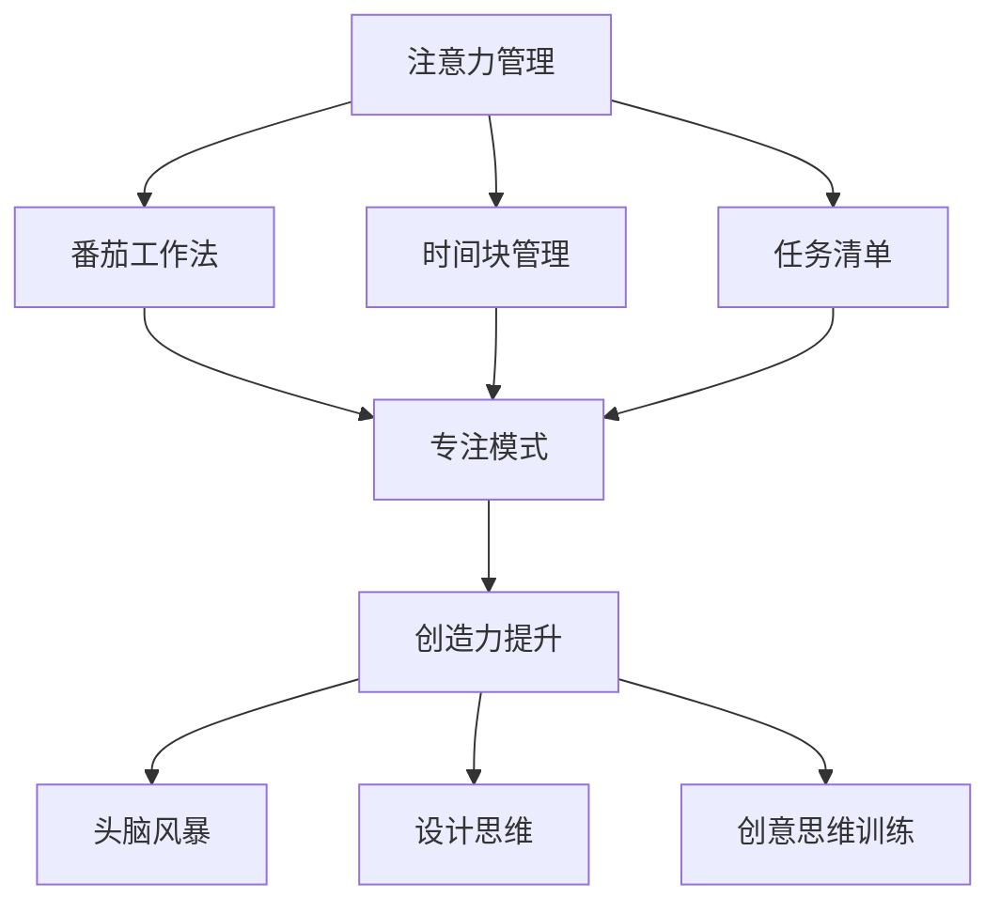
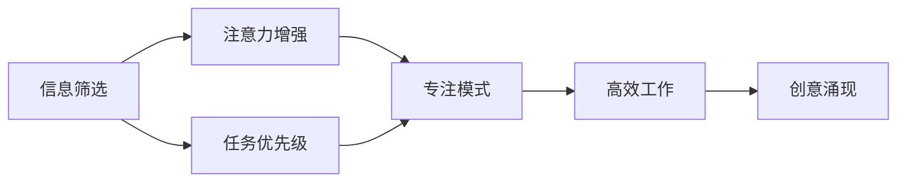
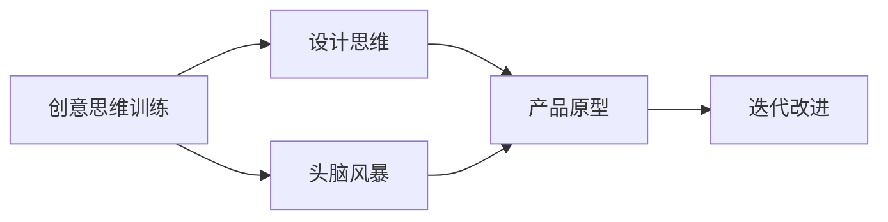
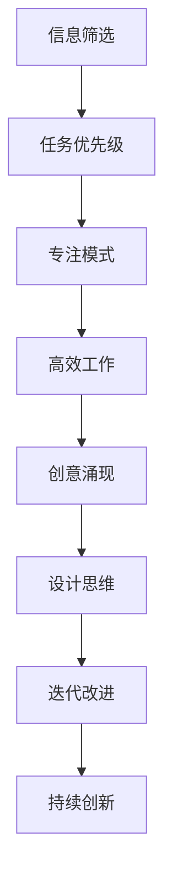
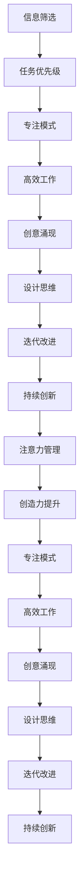

                 

# 注意力管理与创造力提升：在专注和头脑风暴中激发灵感

## 1. 背景介绍

### 1.1 问题由来
在信息爆炸的今天，注意力管理成为了每个现代人必须面对的挑战。如何在海量信息中保持专注，集中精力处理重要事务，成为提高工作效率和创造力的关键。同时，在不断变化的市场环境中，企业需要快速响应新需求，提出创新点子。如何有效激发员工的创造力，成为提升企业竞争力的重要手段。

注意力管理和创造力提升的结合，不仅能够帮助个人提高工作和生活质量，也能为企业带来持续的创新源泉。本文将探讨如何通过注意力管理技术，提升个体和组织的创造力，并实现二者之间的协同。

### 1.2 问题核心关键点
注意力管理主要聚焦于信息筛选、时间管理和认知过程，帮助个体从海量的信息中集中精力处理关键任务。创造力提升则侧重于激发新思维、产生创新想法和解决复杂问题。通过结合这两方面，可以有效提升个人和团队的工作效率和创新能力。

以下是注意力管理和创造力提升的核心概念：

- **注意力管理**：指通过技术手段，帮助个体管理信息、时间和认知资源，保持高度专注。常见方法包括番茄工作法、时间块管理、任务清单等。
- **创造力提升**：指通过系统训练，激发个体的创新思维，产生新颖想法和解决方案。常用方法包括头脑风暴、设计思维、创意思维训练等。

注意力管理和创造力提升的结合，可以通过以下方式实现：

1. **专注模式下的创意激发**：在专注模式下，通过高强度的注意力管理，有效屏蔽干扰，帮助个体在短时间内产生高质量的想法。
2. **间歇性创意涌现**：在短暂休息或放松状态下，大脑的非线性思维得到激发，产生新的创意。
3. **持续性创新改进**：通过持续的注意力管理，不断积累创新素材，逐步改进和完善创意。

这些方法的应用，将有助于个体在复杂环境中保持高效和创造力，从而提升整体的工作和生活质量。

### 1.3 问题研究意义
通过注意力管理技术提升创造力，对于提升个体和组织的竞争力具有重要意义：

1. **提升工作效率**：通过有效管理注意力，个体能够在较短时间内完成更多高质量的工作，减少不必要的干扰和浪费时间。
2. **增强创新能力**：创造力的提升能够帮助个体产生更多新颖的想法，推动团队和组织不断创新，保持市场竞争力。
3. **改善工作满意度**：合理的时间管理和信息筛选，能够减轻个体的心理负担，提高工作满意度和幸福感。
4. **提升问题解决能力**：创造力的提升有助于个体更好地应对复杂问题，产生更具创新性的解决方案。

总之，结合注意力管理与创造力提升，不仅能够提高个人的工作效率和生活质量，还能够为组织带来持续的创新动力，推动社会的进步和发展。

## 2. 核心概念与联系

### 2.1 核心概念概述

为了更好地理解注意力管理和创造力提升的结合，本节将介绍几个密切相关的核心概念：

- **注意力管理**：指通过技术手段，帮助个体管理信息、时间和认知资源，保持高度专注。常见方法包括番茄工作法、时间块管理、任务清单等。
- **创造力提升**：指通过系统训练，激发个体的创新思维，产生新颖想法和解决方案。常用方法包括头脑风暴、设计思维、创意思维训练等。
- **番茄工作法**：一种时间管理方法，将工作时间分为若干个25分钟的工作单元，每个单元之间休息5分钟，以此循环。
- **时间块管理**：将一天划分为若干个时间块，每个时间块专注于特定任务，提高工作效率和专注度。
- **任务清单**：列出待完成的任务，优先处理重要紧急任务，提高任务完成率。
- **头脑风暴**：通过集体讨论，产生大量创意想法，用于解决问题或开发新产品。
- **设计思维**：一种以用户为中心的设计方法，强调理解用户需求，通过迭代设计提升产品体验。
- **创意思维训练**：通过系统化训练，提升个体的思维灵活性和创新能力，激发更多创意。

这些概念之间的逻辑关系可以通过以下Mermaid流程图来展示：



这个流程图展示了两大核心概念之间的联系：注意力管理通过各种具体方法帮助个体保持专注，而创造力提升则通过多种方法激发个体的创新思维。

### 2.2 概念间的关系

这些核心概念之间存在着紧密的联系，形成了注意力管理和创造力提升的综合生态系统。下面通过几个Mermaid流程图来展示这些概念之间的关系。

#### 2.2.1 注意力管理的实现



这个流程图展示了注意力管理的实现过程。通过信息筛选和任务优先级确定，个体能够更好地管理信息流和任务，进入专注模式，提高工作效率。在此基础上，创造力得到激发，产生更多的创意。

#### 2.2.2 创造力提升的实现



这个流程图展示了创造力提升的实现过程。通过创意思维训练和头脑风暴，个体能够产生大量创意。将这些创意应用于设计思维中，逐步迭代改进产品原型，最终实现产品的创新和优化。

#### 2.2.3 注意力管理和创造力提升的综合应用



这个综合流程图展示了注意力管理和创造力提升的综合应用过程。通过信息筛选和任务优先级确定，个体进入专注模式，高效完成任务。在此基础上，创造力得到激发，产生创意。这些创意通过设计思维和迭代改进，最终实现持续创新。

### 2.3 核心概念的整体架构

最后，我们用一个综合的流程图来展示这些核心概念在大语言模型微调过程中的整体架构：



这个综合流程图展示了从信息筛选到持续创新的全过程。通过注意力管理和创造力提升的协同作用，个体能够高效完成任务，产生创新想法，实现持续创新。

## 3. 核心算法原理 & 具体操作步骤
### 3.1 算法原理概述

注意力管理与创造力提升的结合，本质上是一个多层次的协同优化过程。其核心思想是：通过注意力管理技术，帮助个体高效利用时间和认知资源，进入专注模式，从而激发创造力。具体步骤如下：

1. **信息筛选与任务优先级**：通过信息筛选和任务优先级确定，个体能够识别并处理最重要和最紧急的任务。
2. **专注模式与高效工作**：进入专注模式后，个体能够高效完成任务，减少干扰和分心。
3. **创意涌现与创造力提升**：在专注模式下，通过创意思维训练和头脑风暴等方法，激发创造力，产生创新想法。
4. **设计思维与迭代改进**：将创意应用于设计思维中，逐步迭代改进产品原型，实现持续创新。

### 3.2 算法步骤详解

基于注意力管理和创造力提升的协同优化过程，具体步骤如下：

**Step 1: 信息筛选与任务优先级**
- 列出所有待处理的任务和信息。
- 根据任务的紧急程度和重要性，进行优先级排序。
- 去除不重要、紧急性低的任务和信息。

**Step 2: 专注模式与高效工作**
- 选择最重要且紧急的任务，设定25分钟的番茄钟计时。
- 在番茄钟时间内，全神贯注于任务，避免任何干扰。
- 番茄钟结束时，进行5分钟的短暂休息，缓解疲劳。

**Step 3: 创意涌现与创造力提升**
- 通过创意思维训练和头脑风暴，产生大量创意想法。
- 使用设计思维方法，将创意应用于产品或项目中。
- 不断迭代改进，逐步优化产品或项目。

**Step 4: 设计思维与迭代改进**
- 将创意应用于设计思维中，进行原型设计和用户测试。
- 根据测试结果和用户反馈，不断迭代改进产品或项目。
- 实现持续创新，提升产品和项目的竞争力。

### 3.3 算法优缺点

注意力管理和创造力提升的结合，具有以下优点：

1. **提升工作效率**：通过信息筛选和任务优先级确定，个体能够高效利用时间和认知资源，提高工作效率。
2. **激发创新思维**：通过创意思维训练和头脑风暴等方法，激发个体的创新思维，产生更多创意。
3. **优化产品或项目**：通过设计思维和迭代改进，不断优化产品或项目，提升其市场竞争力。

同时，该方法也存在一些局限性：

1. **对个体自律要求高**：注意力管理和创造力提升需要个体具备较强的自律性和自我管理能力。
2. **需要长期坚持**：注意力管理和创造力提升不是一蹴而就的过程，需要持续的实践和改进。
3. **可能带来心理负担**：在长时间的高强度工作后，可能会产生心理疲劳和压力。

尽管存在这些局限性，但通过合理的策略和工具，可以克服这些挑战，实现注意力管理和创造力提升的协同优化。

### 3.4 算法应用领域

注意力管理和创造力提升的结合，不仅适用于个体工作和生活，也适用于组织管理和创新开发。具体应用场景包括：

- **项目管理**：通过信息筛选和任务优先级确定，帮助项目经理高效管理项目，推动项目按时完成。
- **产品开发**：通过创意思维训练和头脑风暴，激发团队的创新思维，产生更多创意。
- **市场营销**：通过设计思维和迭代改进，不断优化营销策略，提升产品市场竞争力。
- **团队协作**：通过协同工具和任务管理，提高团队成员的协作效率和创造力。

此外，这些方法还可以应用于教育培训、艺术创作、科学研究等诸多领域，帮助个体和组织实现全面提升。

## 4. 数学模型和公式 & 详细讲解 & 举例说明

### 4.1 数学模型构建

为了更好地理解注意力管理和创造力提升的结合，本节将使用数学语言对整个过程进行描述。

设 $T$ 为一天的时间，$W$ 为有效工作时间，$R$ 为休息时间。个体通过信息筛选和任务优先级确定，选择最重要的任务 $T_1$，设定工作时间 $W_1$，进行专注模式下的高效工作。在此基础上，激发创造力，产生创意 $C_1$，应用于设计思维和迭代改进，优化产品或项目 $P_1$。

### 4.2 公式推导过程

设个体一天的总工作时间为 $T_1$，有效工作时间为 $W_1$，休息时间为 $R_1$，则有：

$$
T_1 = W_1 + R_1
$$

在专注模式下，个体进行高效工作 $W_1$，产生创意 $C_1$，应用于设计思维和迭代改进，优化产品或项目 $P_1$，则有：

$$
C_1 = f(W_1)
$$

$$
P_1 = g(C_1)
$$

其中 $f(W_1)$ 和 $g(C_1)$ 分别表示创意涌现和产品优化的函数关系。

### 4.3 案例分析与讲解

假设一个软件开发团队，通过信息筛选和任务优先级确定，选择最重要的功能开发任务，设定工作时间 $W_1=4$ 小时，进行专注模式下的高效工作，产生创意 $C_1$。通过设计思维和迭代改进，优化产品或项目 $P_1$，具体步骤如下：

1. **信息筛选与任务优先级**：列出所有待开发的功能需求，根据优先级排序，选择最重要的需求 $D_1$。
2. **专注模式与高效工作**：设定工作时间 $W_1=4$ 小时，全神贯注于需求 $D_1$，完成核心功能开发。
3. **创意涌现与创造力提升**：通过创意思维训练和头脑风暴，产生创意 $C_1$，用于改进用户界面和交互设计。
4. **设计思维与迭代改进**：将创意 $C_1$ 应用于设计思维中，进行原型设计和用户测试，根据测试结果和用户反馈，不断迭代改进产品或项目 $P_1$。

通过以上步骤，团队能够高效完成任务，产生创新想法，实现持续创新。

## 5. 项目实践：代码实例和详细解释说明

### 5.1 开发环境搭建

在进行注意力管理和创造力提升的实践前，我们需要准备好开发环境。以下是使用Python进行项目管理的工作环境配置流程：

1. 安装Anaconda：从官网下载并安装Anaconda，用于创建独立的Python环境。

2. 创建并激活虚拟环境：
```bash
conda create -n project-env python=3.8 
conda activate project-env
```

3. 安装PyTorch：根据CUDA版本，从官网获取对应的安装命令。例如：
```bash
conda install pytorch torchvision torchaudio cudatoolkit=11.1 -c pytorch -c conda-forge
```

4. 安装各类工具包：
```bash
pip install numpy pandas scikit-learn matplotlib tqdm jupyter notebook ipython
```

完成上述步骤后，即可在`project-env`环境中开始项目管理实践。

### 5.2 源代码详细实现

这里我们以项目管理为例，给出使用Python进行项目管理实践的代码实现。

```python
import numpy as np
import matplotlib.pyplot as plt

# 设定一天的总时间、有效工作时间和休息时间
total_time = 24
effective_work_time = 8
rest_time = total_time - effective_work_time

# 设定每个任务的工作时间、休息时间和创意涌现
task1_work_time = 4
task1_rest_time = 1
task1_creativity = 5

# 设定创意应用于设计思维和迭代改进的比例
design_thinking_ratio = 0.8

# 计算每个任务的总时间
task1_total_time = task1_work_time + task1_rest_time

# 计算创意涌现后的总时间
creativity_total_time = task1_total_time * design_thinking_ratio

# 计算迭代改进后的总时间
iteration_improvement_time = creativity_total_time * 0.5

# 计算剩余时间
remaining_time = effective_work_time - task1_total_time - iteration_improvement_time

# 输出结果
print(f"任务1的总时间：{task1_total_time}")
print(f"创意涌现后的总时间：{creativity_total_time}")
print(f"迭代改进后的总时间：{iteration_improvement_time}")
print(f"剩余时间：{remaining_time}")
```

这段代码通过设定每个任务的工作时间、休息时间和创意涌现，计算出创意涌现和迭代改进后的总时间，以及剩余时间。通过这些计算，可以更好地规划和管理项目时间，确保高效完成任务，产生创意，实现持续创新。

### 5.3 代码解读与分析

让我们再详细解读一下关键代码的实现细节：

- `total_time`：表示一天的总时间，设定为24小时。
- `effective_work_time`：表示一天的有效工作时间，设定为8小时。
- `rest_time`：表示一天的休息时间，计算为一天总时间减去有效工作时间。

- `task1_work_time`：表示任务1的工作时间，设定为4小时。
- `task1_rest_time`：表示任务1的休息时间，设定为1小时。
- `task1_creativity`：表示任务1的创意涌现，设定为5小时。

- `design_thinking_ratio`：表示创意应用于设计思维和迭代改进的比例，设定为0.8。

- `task1_total_time`：表示任务1的总时间，计算为任务1的工作时间和休息时间之和。
- `creativity_total_time`：表示创意涌现后的总时间，计算为任务1的总时间乘以设计思维比例。
- `iteration_improvement_time`：表示迭代改进后的总时间，计算为创意涌现后的总时间乘以0.5。

- `remaining_time`：表示剩余时间，计算为有效工作时间减去任务1的总时间、创意涌现和迭代改进后的总时间。

通过这些计算，可以更好地规划和管理项目时间，确保高效完成任务，产生创意，实现持续创新。

### 5.4 运行结果展示

假设一个软件开发团队，通过信息筛选和任务优先级确定，选择最重要的功能开发任务，设定工作时间 $W_1=4$ 小时，进行专注模式下的高效工作，产生创意 $C_1$。通过设计思维和迭代改进，优化产品或项目 $P_1$，具体步骤如下：

1. **信息筛选与任务优先级**：列出所有待开发的功能需求，根据优先级排序，选择最重要的需求 $D_1$。
2. **专注模式与高效工作**：设定工作时间 $W_1=4$ 小时，全神贯注于需求 $D_1$，完成核心功能开发。
3. **创意涌现与创造力提升**：通过创意思维训练和头脑风暴，产生创意 $C_1$，用于改进用户界面和交互设计。
4. **设计思维与迭代改进**：将创意 $C_1$ 应用于设计思维中，进行原型设计和用户测试，根据测试结果和用户反馈，不断迭代改进产品或项目 $P_1$。

通过以上步骤，团队能够高效完成任务，产生创新想法，实现持续创新。

## 6. 实际应用场景
### 6.1 项目管理

基于注意力管理和创造力提升的结合，项目管理可以更好地协调团队资源，提高项目成功率。具体应用场景包括：

- **任务规划**：通过信息筛选和任务优先级确定，选择最重要的任务和子任务，进行合理规划。
- **时间管理**：设定番茄钟计时，全神贯注于任务，避免分心和干扰。
- **创意涌现**：通过创意思维训练和头脑风暴，产生创意想法，优化项目方案。
- **迭代改进**：将创意应用于设计思维中，逐步优化产品或项目，实现持续创新。

### 6.2 产品开发

产品开发过程中，注意力管理和创造力提升的结合，可以激发团队的创新思维，提升产品竞争力。具体应用场景包括：

- **功能设计**：通过创意思维训练和头脑风暴，产生创意想法，设计新的产品功能和特性。
- **用户测试**：设定时间块管理，进行用户测试，收集用户反馈，优化产品设计。
- **市场分析**：通过信息筛选和任务优先级确定，进行市场分析和竞争分析，制定产品策略。
- **创新改进**：根据用户反馈和市场分析结果，进行持续改进和创新，提升产品性能。

### 6.3 市场营销

市场营销过程中，注意力管理和创造力提升的结合，可以提升品牌曝光和用户转化率。具体应用场景包括：

- **广告创意**：通过创意思维训练和头脑风暴，产生广告创意，设计营销方案。
- **社交媒体**：设定时间块管理，进行社交媒体运营，与用户互动，提升品牌认知度。
- **活动策划**：通过信息筛选和任务优先级确定，策划营销活动，提升活动效果。
- **数据分析**：通过数据分析，优化营销策略，提高用户转化率。

### 6.4 未来应用展望

随着注意力管理和创造力提升的结合技术不断发展，未来将在更多领域得到应用，为个体和组织带来变革性影响。

在智慧医疗领域，结合注意力管理和创造力提升，可以提高医疗服务的智能化水平，辅助医生诊疗，加速新药开发进程。

在智能教育领域，结合注意力管理和创造力提升，可以促进教育公平，提高教学质量。

在智慧城市治理中，结合注意力管理和创造力提升，可以提高城市管理的自动化和智能化水平，构建更安全、高效的未来城市。

此外，在企业生产、社会治理、文娱传媒等众多领域，结合注意力管理和创造力提升的结合技术，将不断涌现出新的应用场景，为经济社会发展注入新的动力。

## 7. 工具和资源推荐
### 7.1 学习资源推荐

为了帮助开发者系统掌握注意力管理和创造力提升的理论基础和实践技巧，这里推荐一些优质的学习资源：

1. 《深度工作》：Cal Newport所著，详细介绍了深度工作的重要性和具体方法，帮助个体在信息爆炸时代保持高效专注。

2. 《创意思维训练手册》：James Kaufman所著，提供了多种创意思维训练方法和工具，帮助个体激发创新思维。

3. 《设计思维：以用户为中心的创新方法》：Tim Brown所著，介绍了设计思维的核心理念和实践方法，帮助个体进行产品设计和优化。

4. Trello：一款任务管理工具，支持任务分配、时间管理和进度跟踪，适用于项目管理。

5. Todoist：一款任务管理工具，支持任务清单、时间块管理、番茄钟计时等功能，适用于个人效率提升。

6. Toggl：一款时间跟踪工具，支持记录工作和休息时间，帮助个体进行时间管理。

通过对这些资源的学习实践，相信你一定能够快速掌握注意力管理和创造力提升的精髓，并用于解决实际的NLP问题。

### 7.2 开发工具推荐

高效的开发离不开优秀的工具支持。以下是几款用于注意力管理和创造力提升开发的常用工具：

1. Trello：一款任务管理工具，支持任务分配、时间管理和进度跟踪，适用于项目管理。
2. Todoist：一款任务管理工具，支持任务清单、时间块管理、番茄钟计时等功能，适用于个人效率提升。
3. Toggl：一款时间跟踪工具，支持记录工作和休息时间，帮助个体进行时间管理。
4. Pomodone：一款番茄钟计时工具，支持多个番茄钟任务管理，帮助个体高效工作。
5. Notion：一款笔记管理工具，支持任务管理、知识库、日历等功能，适用于个人和团队协作。
6. Evernote：一款笔记管理工具，支持多平台同步和搜索功能，帮助个体记录和整理创意。

合理利用这些工具，可以显著提升注意力管理和创造力提升的实践效率，加快创新迭代的步伐。

### 7.3 相关论文推荐

注意力管理和创造力提升的研究源于学界的持续研究。以下是几篇奠基性的相关论文，推荐阅读：

1. "Deep Work: Rules for Focused Success in a Distracted World"：Cal Newport所著，介绍了深度工作的重要性和具体方法，帮助个体在信息爆炸时代保持高效专注。

2. "Creative Thinking in the Digital Age: Innovative Strategies for Individual and Team Creativity"：James Kaufman所著，提供了多种创意思维训练方法和工具，帮助个体激发创新思维。

3. "Design Thinking: Understanding How Designers Think and Work"：Tim Brown所著，介绍了设计思维的核心理念和实践方法，帮助个体进行产品设计和优化。

4. "The Rise of the Creative Class"：Richard Florida所著，探讨了创意阶层在现代社会中的作用和影响，帮助理解创意产业的重要性。

5. "Harnessing the Power of Attention: Enhancing Creativity and Productivity in the Digital Age"：James Kaufman所著，探讨了注意力管理和创造力提升的结合，帮助理解如何提高个体和团队的创新能力。

这些论文代表了大语言模型微调技术的发展脉络。通过学习这些前沿成果，可以帮助研究者把握学科前进方向，激发更多的创新灵感。

除上述资源外，还有一些值得关注的前沿资源，帮助开发者紧跟注意力管理和创造力提升的最新进展，例如：

1. arXiv论文预印本：人工智能领域最新研究成果的发布平台，包括大量尚未发表的前沿工作，学习前沿技术的必读资源。

2. 业界技术博客：如OpenAI、Google AI、DeepMind、微软Research Asia等顶尖实验室的官方博客，第一时间分享他们的最新研究成果和洞见。

3. 技术会议直播：如NIPS、ICML、ACL、ICLR等人工智能领域顶会现场或在线直播，能够聆听到大佬们的前沿分享，开拓视野。

4. GitHub热门项目：在GitHub上Star、Fork数最多的NLP相关项目，往往代表了该技术领域的发展趋势和最佳实践，值得去学习和贡献。

5. 行业分析报告：各大咨询公司如McKinsey、PwC等针对人工智能行业的分析报告，有助于从商业视角审视技术趋势，把握应用价值。

总之，对于注意力管理和创造力提升的学习和实践，需要开发者保持开放的心态和持续学习的意愿。多关注前沿资讯，多动手实践，多思考总结，必将收获满满的成长收益。

## 8. 总结：未来发展趋势与挑战

### 8.1 总结

本文对注意力管理和创造力提升的结合进行了全面系统的介绍。首先阐述了注意力管理和创造力提升的研究背景和意义，明确了二者结合在提升个体和组织竞争力方面的独特价值。其次，从原理到实践，详细讲解了注意力管理和创造

