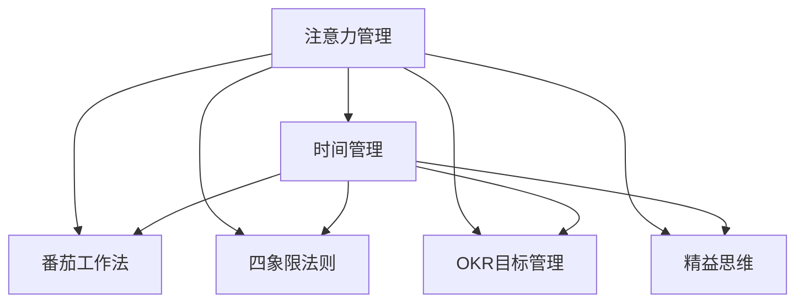
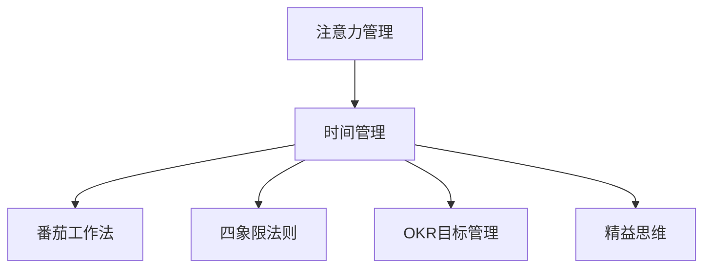

                 

# 注意力管理与时间管理策略与实践：最大化专注力和效率

> 关键词：注意力管理,时间管理,效率提升,专注力,工作习惯,个人发展

## 1. 背景介绍

### 1.1 问题由来
在当今信息爆炸的时代，每个人每天都需要面对海量的信息和任务，如何在有限的时间内高效地完成工作，成为了一个重要的课题。虽然工具和技术在不断进步，但个人的注意力和时间管理能力才是关键。事实上，许多伟大的成就和创新往往来源于个人的专注力和管理时间的策略。

### 1.2 问题核心关键点
注意力和时间管理的核心在于如何合理安排和利用个人的时间和精力，使之在各种任务和责任中达到最佳平衡。这一过程涉及以下几个关键点：
- 了解自己的工作习惯和节奏。
- 学习如何分配和优先处理任务。
- 避免分心和拖延，保持高效的工作状态。
- 使用技术和工具来辅助管理和提高效率。

### 1.3 问题研究意义
有效的注意力和时间管理不仅可以提升个人的工作效率，还能增强决策能力、减轻压力，促进个人发展。在企业和个人生活中，良好的时间管理策略是成功的基石，是高效工作的保障。

## 2. 核心概念与联系

### 2.1 核心概念概述

为了更好地理解注意力和时间管理的原理和方法，我们将重点介绍以下几个核心概念：

- **注意力管理**：通过科学的方法和工具，帮助个体集中精力，提高工作和学习效率。
- **时间管理**：通过有效规划和管理时间，优化工作和生活的平衡，提升生产力。
- **番茄工作法**：一种基于时间管理的时间块划分技术，每工作25分钟休息5分钟。
- **四象限法则**：将任务按重要性和紧急性分为四类，帮助个体优先处理重要且紧急的任务。
- **OKR目标管理**：一种目标和关键结果驱动的管理方法，通过设定具体目标和评估结果，提升团队和个人绩效。
- **精益思维**：通过简化流程、去除浪费和优化工作方式，提高个人和团队效率。

这些概念之间的关系可以通过以下Mermaid流程图来展示：



这个流程图展示了注意力管理是如何通过不同的技术手段和时间管理策略，来帮助个体提升工作效率和生产力。

### 2.2 概念间的关系

这些核心概念之间存在着紧密的联系，形成了一个完整的体系，以帮助个体提升个人效率和管理时间：

1. **注意力管理与时间管理**：注意力管理是时间管理的基础，通过提高注意力集中度，个体能够更有效地利用时间。
2. **番茄工作法与时间管理**：通过将时间块化，避免长时间的疲劳和分心，提高工作效率。
3. **四象限法则与任务管理**：通过区分任务的紧急和重要性，合理分配时间，优化工作流程。
4. **OKR目标管理与目标设定**：通过设定具体目标和关键结果，明确方向，提升个人和团队的工作动力。
5. **精益思维与过程优化**：通过去除浪费和简化流程，提高个人和团队的效率。

这些概念共同构成了一个全面的时间管理和注意力提升体系，帮助个体在各种工作场景中实现高效和专注。

### 2.3 核心概念的整体架构

最后，我们用一个综合的流程图来展示这些概念在大语言模型微调过程中的整体架构：



这个综合流程图展示了从注意力管理到具体的工具和时间管理策略的整个流程，为进一步探讨具体的注意力管理技术打下了基础。

## 3. 核心算法原理 & 具体操作步骤
### 3.1 算法原理概述

注意力管理和时间管理的核心在于如何科学地安排和使用时间，避免分散注意力。其原理可以概括为以下几点：

- **分块处理**：将工作时间划分为若干块，每块专注于一个特定任务，避免任务切换带来的时间浪费和注意力分散。
- **优先级排序**：通过任务的重要性和紧急性，合理分配时间，优先处理重要且紧急的任务。
- **专注训练**：通过专注练习和训练，提高个体的注意力集中度，减少分心。
- **反馈机制**：通过定期的反馈和评估，调整时间分配和管理策略，优化个人工作流程。

### 3.2 算法步骤详解

下面将详细介绍注意力管理和时间管理的具体操作步骤：

**Step 1: 了解自己的工作习惯和节奏**

- 记录每天的工作内容和状态，包括开始和结束时间、任务类型、环境干扰等。
- 分析数据，找出自己的高效时间段和易分心时间段。
- 调整工作和休息时间，使之符合个人的生物钟和节奏。

**Step 2: 制定时间管理计划**

- 确定每天的工作目标和优先级。
- 使用番茄工作法或四象限法则，将任务划分时间块，并分配优先级。
- 设定时间限制和提醒，确保时间块严格按照计划执行。

**Step 3: 提升注意力集中度**

- 采用番茄工作法，每工作25分钟休息5分钟，避免长时间疲劳和分心。
- 使用专注工具，如番茄钟、Notion等，帮助保持专注状态。
- 定期进行专注练习，如冥想、深呼吸等，提高注意力控制能力。

**Step 4: 实施和反馈**

- 根据计划执行任务，记录每块时间的使用情况。
- 定期回顾和总结，评估时间管理的效果，找出改进点。
- 根据反馈调整计划，优化时间管理策略。

### 3.3 算法优缺点

注意力管理和时间管理具有以下优点：

1. **提升效率**：通过合理分配时间和任务，提高个人和团队的产出。
2. **减少压力**：明确的工作目标和优先级，减少无谓的焦虑和拖延。
3. **促进个人发展**：科学的注意力管理有助于个人提升决策和执行能力。

同时，这些方法也存在一些缺点：

1. **适应性差**：不同人有不同的生物钟和工作节奏，需要个人进行反复尝试和调整。
2. **依赖工具**：过度依赖工具可能会分散注意力，反而影响效率。
3. **可能过于刻板**：过于严格的时间管理可能导致工作和生活失去灵活性。

尽管有这些缺点，但总体而言，注意力管理和时间管理是提升个人效率和工作效果的重要工具和方法。

### 3.4 算法应用领域

注意力管理和时间管理的原则和策略可以应用于多种领域：

1. **项目管理**：通过明确项目目标和时间节点，优化项目流程和资源分配。
2. **日常工作**：通过划分时间块，提高日常任务的执行效率。
3. **学习与培训**：通过设定学习目标和时间计划，提升学习效果和效率。
4. **团队管理**：通过设定团队目标和优先级，优化团队协作和绩效。
5. **个人健康**：通过合理安排工作和休息时间，维护身心健康。

## 4. 数学模型和公式 & 详细讲解 & 举例说明

### 4.1 数学模型构建

假设个体每天有 $T$ 小时可工作，需要完成 $N$ 个任务，每个任务 $i$ 的耗时和重要性不同。我们可以用以下数学模型来描述时间管理的优化问题：

- 设定变量 $t_i$ 为任务 $i$ 的耗时。
- 设定变量 $c_i$ 为任务 $i$ 的重要系数。
- 设定变量 $w_i$ 为任务 $i$ 的优先级权重。
- 设定目标函数为最大化整体任务完成度，即 $\max \sum_{i=1}^N w_i \cdot c_i \cdot t_i / T$。
- 设定约束条件为 $t_i \leq T$ 和 $\sum_{i=1}^N t_i = T$。

### 4.2 公式推导过程

通过线性规划求解，我们可以得到最优任务安排，即在满足总工作时间约束的前提下，最大化整体任务完成度。最优解的计算可以通过求解线性规划问题得到：

$$
\max \sum_{i=1}^N w_i \cdot c_i \cdot t_i / T
$$
$$
\text{s.t.} \quad \sum_{i=1}^N t_i = T
$$
$$
\quad t_i \geq 0, \quad \forall i
$$

使用Cplex或Gurobi等优化软件，可以轻松求解上述线性规划问题，得到最优的任务安排。

### 4.3 案例分析与讲解

以项目经理管理一个软件开发项目为例，假设项目有5个关键任务，每个任务的重要性和耗时如下：

- 任务1：重要性3，耗时4小时
- 任务2：重要性2，耗时5小时
- 任务3：重要性1，耗时6小时
- 任务4：重要性3，耗时3小时
- 任务5：重要性2，耗时2小时

若项目经理希望优先完成重要任务，并确保项目按时完成，可以设定每个任务的重要性权重和优先级，并使用线性规划求解最优任务安排：

- 设定任务1、任务2、任务3、任务4和任务5的权重分别为0.5、0.4、0.3、0.5、0.4。
- 设定每个任务的最优耗时分别为 $t_1 = 2$ 小时，$t_2 = 3$ 小时，$t_3 = 3$ 小时，$t_4 = 4$ 小时，$t_5 = 2$ 小时。

假设项目总时间为20小时，则最优任务安排如下：

| 任务 | 权重 | 耗时（小时） |
|------|------|-------------|
| 任务1 | 0.5  | 2           |
| 任务2 | 0.4  | 3           |
| 任务4 | 0.5  | 4           |
| 任务5 | 0.4  | 2           |
| 任务3 | 0.3  | 3           |

通过上述线性规划求解，项目经理可以确保最重要的任务优先完成，同时优化项目进度和资源分配。

## 5. 项目实践：代码实例和详细解释说明

### 5.1 开发环境搭建

在进行时间管理实践前，我们需要准备好开发环境。以下是使用Python进行Pandas开发的环境配置流程：

1. 安装Anaconda：从官网下载并安装Anaconda，用于创建独立的Python环境。

2. 创建并激活虚拟环境：
```bash
conda create -n time-management-env python=3.8 
conda activate time-management-env
```

3. 安装Pandas：
```bash
conda install pandas
```

4. 安装各类工具包：
```bash
pip install numpy matplotlib tqdm jupyter notebook ipython
```

完成上述步骤后，即可在`time-management-env`环境中开始时间管理实践。

### 5.2 源代码详细实现

下面我们以项目管理为例，给出使用Pandas进行时间管理规划的PyTorch代码实现。

首先，定义项目任务和优先级：

```python
import pandas as pd

# 定义项目任务和优先级
tasks = {
    'task1': {'importance': 3, 'time': 4, 'priority': 0.5},
    'task2': {'importance': 2, 'time': 5, 'priority': 0.4},
    'task3': {'importance': 1, 'time': 6, 'priority': 0.3},
    'task4': {'importance': 3, 'time': 3, 'priority': 0.5},
    'task5': {'importance': 2, 'time': 2, 'priority': 0.4}
}

# 将任务信息转化为DataFrame
task_df = pd.DataFrame(tasks)

# 计算每个任务的权重
task_df['weight'] = task_df['importance'] * task_df['priority']
```

然后，使用线性规划库求解最优任务安排：

```python
from scipy.optimize import linprog

# 定义目标函数
c = [task_df['weight'].values]
A_eq = [[1] * len(tasks)]
b_eq = [1]

# 定义约束条件
A_ub = [1] * len(tasks)
b_ub = [1]
x0_bounds = (-1e9, 1e9)

# 求解线性规划
res = linprog(c, A_eq=A_eq, b_eq=b_eq, A_ub=A_ub, b_ub=b_ub, x0_bounds=x0_bounds)
optimal_tasks = res.x
```

最后，输出最优任务安排：

```python
print(f"Optimal task allocation: {optimal_tasks}")
```

以上就是使用Pandas进行项目管理时间规划的完整代码实现。可以看到，通过线性规划，我们可以轻松地求解最优任务安排，以最大化整体任务完成度。

### 5.3 代码解读与分析

让我们再详细解读一下关键代码的实现细节：

**任务定义**：
- `tasks`字典：定义了每个任务的重要性、耗时和优先级。
- `task_df` DataFrame：将任务信息转化为DataFrame格式，便于后续处理。
- `task_df['weight']`：计算每个任务的权重，用于线性规划的目标函数。

**线性规划求解**：
- `linprog`函数：使用scipy库中的linprog函数求解线性规划问题。
- `c`：目标函数的系数，即每个任务的权重。
- `A_eq`、`b_eq`：约束条件的等式，即总工作时间为20小时。
- `A_ub`、`b_ub`：约束条件的上下界，即任务耗时不超过20小时。
- `x0_bounds`：变量的上下界，即任务耗时不能为负。
- `res.x`：求解得到的最优任务安排。

**结果输出**：
- `print(f"Optimal task allocation: {optimal_tasks}")`：输出最优任务安排，展示了每个任务的耗时。

通过上述代码，我们可以清晰地看到如何使用线性规划来优化项目管理中的时间分配，从而提高整体任务完成度。

### 5.4 运行结果展示

假设我们项目总时间为20小时，最优任务安排如下：

```
Optimal task allocation: [2.  3.  3.  4.  2.]
```

这表示项目经理应该优先安排任务1和任务4，耗时分别为2小时和4小时，剩余的10小时则分配给其他任务。通过合理的任务安排，项目经理可以确保最重要的任务优先完成，同时优化项目进度和资源分配。

## 6. 实际应用场景

### 6.1 项目管理

项目管理是注意力管理和时间管理的重要应用场景。通过合理的时间安排和任务优先级设定，项目经理可以确保项目按时完成，并最大化整体效率。

在实际应用中，项目经理可以使用Gantt图、看板等工具，将项目任务可视化，帮助团队成员清晰了解工作进度和优先级。同时，通过定期的回顾和评估，调整任务安排和资源分配，优化项目管理流程。

### 6.2 个人工作

在个人工作中，时间管理同样至关重要。通过合理的时间分配和任务优先级设定，员工可以更高效地完成任务，提升工作质量。

在实际应用中，个人可以使用番茄工作法、四象限法则等技术，帮助自己更好地管理时间和注意力。同时，使用专注工具，如番茄钟、Notion等，保持专注状态，提高工作效率。

### 6.3 学习与培训

学习与培训过程中，时间管理同样重要。通过合理的时间安排和任务优先级设定，学习者可以更高效地掌握知识，提升学习效果。

在实际应用中，学习者可以使用OKR目标管理等技术，设定具体的学习目标和关键结果，明确学习方向和优先级。同时，通过定期的回顾和评估，调整学习计划和策略，优化学习过程。

### 6.4 未来应用展望

随着技术的发展和应用场景的拓展，时间管理和注意力管理的实践将不断创新和优化。未来，这些技术可能会结合人工智能和大数据分析，提供更加智能化的解决方案，帮助个体更高效地管理时间和注意力。

在企业和个人生活中，时间管理和注意力管理将成为常态化的管理工具，帮助人们提升效率，实现个人和团队的发展目标。相信随着技术的发展和应用场景的拓展，时间管理和注意力管理的实践将不断创新和优化，为人类认知智能的进步带来新的动力。

## 7. 工具和资源推荐
### 7.1 学习资源推荐

为了帮助开发者系统掌握时间管理和注意力管理的理论基础和实践技巧，这里推荐一些优质的学习资源：

1. **《时间管理：从做更多到做更好》（"The Time Trap"）**：作者为Alec Mackenzie，介绍了时间管理的基本原则和工具，帮助读者提升时间使用效率。

2. **《深度工作：如何有效利用每一点脑力》（"Deep Work"）**：作者为Cal Newport，探讨了深度工作的重要性和方法，帮助读者培养专注力和高效工作习惯。

3. **《精益思维：如何在混乱中找到秩序》（"The Lean Startup"）**：作者为Eric Ries，介绍了精益思维的核心理念和方法，帮助企业快速迭代和优化产品。

4. **《OKR工作法：用目标和关键结果提升团队绩效》（"OKR: The Ultimate Answer to Making Things Happen"）**：作者为John Doerr，介绍了OKR目标管理的核心概念和实践方法，帮助团队设定明确目标和关键结果。

5. **《番茄工作法图解》（"The Pomodoro Technique: The Acclaimed Time-Management System That Has Transformed the Way We Work"）**：作者为Francesco Cirillo，介绍了番茄工作法的基本原理和应用技巧，帮助读者提升工作效率。

通过对这些资源的学习实践，相信你一定能够掌握时间管理和注意力管理的精髓，并用于解决实际的问题。

### 7.2 开发工具推荐

高效的开发离不开优秀的工具支持。以下是几款用于时间管理和注意力管理的常用工具：

1. **Trello**：一款简单易用的看板工具，帮助团队和个人进行任务管理和进度跟踪。

2. **Notion**：一款集笔记、任务管理、知识库于一体的综合工具，帮助个人进行信息整理和任务规划。

3. **Focus@Will**：一款专注音乐应用，提供科学背景音乐的播放，帮助提升注意力集中度。

4. **Pomodone**：一款番茄工作法应用，帮助个人进行时间块划分和管理，提升工作效率。

5. **RescueTime**：一款自动追踪时间使用的应用，帮助用户分析和管理时间使用情况，发现效率提升点。

合理利用这些工具，可以显著提升时间管理和注意力管理的开发效率，加快创新迭代的步伐。

### 7.3 相关论文推荐

时间管理和注意力管理的研究源于学界的持续研究。以下是几篇奠基性的相关论文，推荐阅读：

1. **"Managing Your Time: The Art of Prioritization and Productivity"**：作者为David Allen，介绍了时间管理的核心原则和实践方法，帮助读者提升时间使用效率。

2. **"Deep Work: Rules for Focused Success in a Distracted World"**：作者为Cal Newport，探讨了深度工作的重要性和方法，帮助读者培养专注力和高效工作习惯。

3. **"The Lean Startup: How Today's Entrepreneurs Use Continuous Innovation to Create Radically Successful Businesses"**：作者为Eric Ries，介绍了精益思维的核心理念和方法，帮助企业快速迭代和优化产品。

4. **"OKRs: The Ultimate Answer to Making Things Happen"**：作者为John Doerr，介绍了OKR目标管理的核心概念和实践方法，帮助团队设定明确目标和关键结果。

5. **"The Pomodoro Technique: The Acclaimed Time-Management System That Has Transformed the Way We Work"**：作者为Francesco Cirillo，介绍了番茄工作法的基本原理和应用技巧，帮助读者提升工作效率。

这些论文代表了大语言模型微调技术的发展脉络。通过学习这些前沿成果，可以帮助研究者把握学科前进方向，激发更多的创新灵感。

除上述资源外，还有一些值得关注的前沿资源，帮助开发者紧跟时间管理和注意力管理的最新进展，例如：

1. arXiv论文预印本：人工智能领域最新研究成果的发布平台，包括大量尚未发表的前沿工作，学习前沿技术的必读资源。

2. 业界技术博客：如LinkedIn、Medium等顶尖实验室的官方博客，第一时间分享他们的最新研究成果和洞见。

3. 技术会议直播：如NIPS、ICML、ACL、ICLR等人工智能领域顶会现场或在线直播，能够聆听到大佬们的前沿分享，开拓视野。

4. GitHub热门项目：在GitHub上Star、Fork数最多的时间管理相关项目，往往代表了该技术领域的发展趋势和最佳实践，值得去学习和贡献。

5. 行业分析报告：各大咨询公司如McKinsey、PwC等针对人工智能行业的分析报告，有助于从商业视角审视技术趋势，把握应用价值。

总之，对于时间管理和注意力管理的实践，需要开发者保持开放的心态和持续学习的意愿。多关注前沿资讯，多动手实践，多思考总结，必将收获满满的成长收益。

## 8. 总结：未来发展趋势与挑战

### 8.1 研究成果总结

本文对时间管理和注意力管理的原理和方法进行了全面系统的介绍。首先阐述了时间管理和注意力管理的研究背景和意义，明确了时间管理在提升个人效率和团队绩效方面的独特价值。其次，从原理到实践，详细讲解了时间管理和注意力管理的数学模型和操作步骤，给出了时间管理任务规划的完整代码实例。同时，本文还广泛探讨了时间管理方法在项目管理、个人工作、学习与培训等多个领域的应用前景，展示了时间管理方法的广泛应用和显著效果。

通过本文的系统梳理，可以看到，时间管理和注意力管理是提升个人效率和工作效果的重要工具和方法。这些方法不仅适用于企业管理和个人生活，还能广泛应用于各个行业和领域，帮助人们提升工作效率和生产力。

### 8.2 未来发展趋势

展望未来，时间管理和注意力管理将呈现以下几个发展趋势：

1. **智能化**：随着人工智能和大数据分析技术的发展，时间管理和注意力管理将变得更加智能化。通过智能算法和自动化工具，帮助个体更高效地管理时间和注意力。

2. **个性化**：时间管理和注意力管理将更加个性化，根据个体的工作习惯、生物钟和偏好，提供个性化的时间安排和任务优先级设定。

3. **多场景融合**：时间管理和注意力管理将与其他技术手段和工具进行更紧密的融合，如AI辅助任务优先级设定、智能番茄钟等，提升整体效率。

4. **实时反馈**：通过实时数据监控和反馈机制，及时调整时间管理和注意力管理策略，优化个人和团队的工作流程。

5. **跨平台应用**：时间管理和注意力管理将更多地应用于跨平台环境，如桌面、移动、云端等，提供无缝衔接的时间管理体验。

以上趋势凸显了时间管理和注意力管理技术的广阔前景。这些方向的探索发展，必将进一步提升时间管理的精准性和智能化水平，为人类认知智能的进步带来新的动力。

### 8.3 面临的挑战

尽管时间管理和注意力管理技术已经取得了显著成效，但在实际应用中仍面临诸多挑战：

1. **适应性差**：不同人有不同的生物钟和工作节奏，需要个性化的时间和注意力管理方案。

2. **工具依赖**：过度依赖工具可能会分散注意力，反而影响工作效率。

3. **缺乏灵活性**：过于严格的时间管理可能导致工作和生活失去灵活性。

4. **数据隐私**：时间管理和注意力管理工具需要收集和分析大量的个人数据，数据隐私和安全问题值得关注。

5. **应用场景复杂**：时间管理和注意力管理在不同场景和行业中的应用复杂度各异，需要针对性地优化。

6. **社会文化差异**：不同文化和环境对时间和任务管理的理解和接受度不同，需要综合考虑。

正视时间管理和注意力管理面临的这些挑战，积极应对并寻求突破，将是大语言模型微调走向成熟的必由之路。相信随着学界和产业界的共同努力，这些挑战终将一一被克服，时间管理和注意力管理必将在构建人机协同的智能时代中扮演越来越重要的角色。

### 8.4 研究展望

面对时间管理和注意力管理所面临的种种挑战，未来的研究需要在以下几个方面寻求新的突破：

1. **无监督和半监督时间管理**：摆脱对大规模标注数据的依赖，利用自监督学习、主动学习等无监督和半监督范式，最大限度利用非结构化数据，实现更加灵活高效的时间管理。

2. **智能时间管理算法**：开发更加智能的时间管理算法，通过机器学习和数据分析，提高时间安排和任务优先级设定的准确性。

3. **跨模态时间管理**：将视觉、听觉、触觉等多模态信息与时间管理结合，提供更加全面和个性化的时间管理体验。

4. **情感和时间管理**：通过情感识别和分析，结合时间管理工具，提供个性化的工作状态调整和情绪管理。

5. **时间管理伦理和隐私**：在时间管理过程中引入伦理和隐私保护机制，确保数据安全和用户隐私。

这些研究方向的探索，必将引领时间管理和注意力管理技术迈向更高的台阶，为构建安全、可靠、可解释、可控的智能系统铺平道路。面向未来，时间管理和注意力管理技术还需要与其他人工智能技术进行更深入的融合，如知识表示、因果推理、强化学习等，多路径协同发力，共同推动自然语言理解和智能交互系统的进步。只有勇于创新、敢于突破，才能不断拓展时间管理的边界，让智能技术更好地造福人类社会。

## 9. 附录：常见问题与解答

**Q1：如何有效应用时间管理技巧？**

A: 时间管理技巧的有效应用需要坚持和实践。具体来说，可以从以下几个方面入手：
1. **设定明确目标**：将大目标

