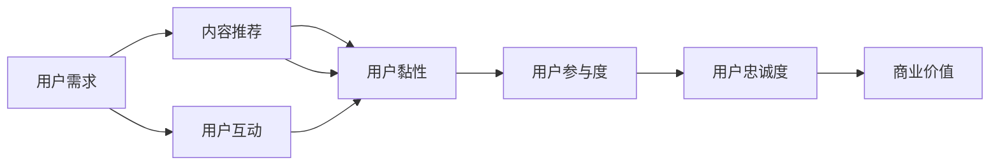
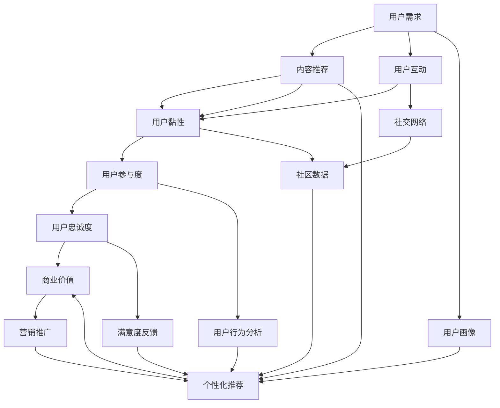

                 

# 注意力经济与在线社区：如何建立参与度高、忠诚度高的受众

> 关键词：注意力经济,在线社区,用户参与度,用户忠诚度,社交网络,内容推荐,用户行为分析,个性化推荐

## 1. 背景介绍

### 1.1 问题由来
随着互联网的普及和信息技术的飞速发展，在线社区和社交网络已经成为人们获取信息、交流思想、分享生活的重要平台。然而，用户黏性不高、参与度低下的问题一直困扰着各大平台。如何吸引和留住用户，建立高参与度、高忠诚度的在线社区，成为各大平台亟待解决的问题。

当前，在线社区面临着如下问题：
- **用户流失率高**：平台难以留住新用户，老用户也逐渐流失，导致活跃用户数下降。
- **用户参与度低**：用户发布内容、参与互动的意愿不强，平台内容更新缓慢。
- **用户体验差**：内容质量参差不齐，广告过多，用户体验不佳。
- **缺乏互动性**：社区缺乏有效的互动机制，用户难以找到志同道合的人，难以形成深度交流。

这些问题不仅影响了社区平台的商业价值，也对用户的个人体验造成了负面影响。因此，亟需提出有效的解决方案，构建参与度高、忠诚度高的在线社区。

### 1.2 问题核心关键点
为了解决这个问题，需要从以下几个方面进行深入研究：
- **用户需求分析**：深入分析用户行为和心理，挖掘用户的真实需求。
- **内容推荐算法**：优化内容推荐算法，提升用户对平台的黏性。
- **用户互动机制**：设计有效的用户互动机制，提升用户参与度。
- **个性化推荐**：根据用户行为数据，进行个性化推荐，满足用户多样化需求。

这些问题之间存在着紧密的联系，需要通过系统性的方法来综合解决。接下来，我们将深入探讨这些关键问题，并提出相应的解决方案。

## 2. 核心概念与联系

### 2.1 核心概念概述

在线社区和社交网络是用户获取信息、交流思想、分享生活的平台。社区平台通过算法推荐、互动机制等手段，不断吸引用户参与，提升用户黏性。注意力经济是指平台通过吸引用户注意力，获取商业价值的模式。

用户参与度指用户在使用平台时，发布内容、参与互动的活跃程度。用户忠诚度指用户对平台的长期依赖和持续使用的程度。

### 2.2 核心概念原理和架构的 Mermaid 流程图(Mermaid 流程节点中不要有括号、逗号等特殊字符)



该流程图展示了在线社区的核心概念和相互联系：
- 用户需求通过内容推荐和用户互动机制吸引用户参与，提升用户黏性。
- 内容推荐算法和用户互动机制共同提升用户参与度。
- 用户参与度和用户黏性共同提升用户忠诚度。
- 用户忠诚度最终转化为平台的商业价值。

### 2.3 核心概念的整体架构

最后，我们将以上概念整合为一个整体架构：



该架构图展示了在线社区的各个核心概念和它们之间的相互作用。

## 3. 核心算法原理 & 具体操作步骤
### 3.1 算法原理概述

在线社区的核心算法原理包括以下几个方面：
- **内容推荐算法**：通过分析用户行为数据，预测用户可能感兴趣的内容，并实时推荐给用户。
- **用户互动机制**：通过互动评分、评论奖励等手段，激励用户发布内容、参与互动，增加用户参与度。
- **用户画像分析**：通过用户行为数据，建立用户画像，进行个性化推荐，提升用户黏性。
- **满意度反馈机制**：通过满意度调查等手段，及时收集用户反馈，调整优化内容推荐和互动机制，提升用户体验。

### 3.2 算法步骤详解

以下是基于用户行为分析的内容推荐算法步骤：
1. **数据收集**：收集用户的历史行为数据，包括浏览记录、点赞、评论、分享等。
2. **特征提取**：提取用户行为特征，如浏览时间、点赞次数、评论内容等。
3. **模型训练**：训练内容推荐模型，如协同过滤、深度学习等，预测用户可能感兴趣的内容。
4. **推荐展示**：根据模型预测结果，向用户展示相关内容，提升用户参与度。
5. **反馈收集**：收集用户对推荐内容的质量反馈，持续优化推荐模型。

用户互动机制主要包括以下步骤：
1. **互动评分**：建立互动评分系统，激励用户发布高质量内容。
2. **评论奖励**：通过评论奖励机制，鼓励用户积极参与互动。
3. **互动展示**：在用户主页展示互动评分和评论奖励，提升用户参与度。

用户画像分析主要包括以下步骤：
1. **画像建模**：通过用户行为数据，建立用户画像，描述用户兴趣和偏好。
2. **个性化推荐**：根据用户画像，进行个性化推荐，满足用户多样化需求。
3. **画像更新**：持续收集用户新行为数据，更新用户画像，提升推荐精度。

满意度反馈机制主要包括以下步骤：
1. **调查问卷**：通过调查问卷收集用户满意度反馈。
2. **数据分析**：分析满意度反馈数据，识别用户需求和问题。
3. **调整优化**：根据反馈结果，调整优化内容推荐和互动机制，提升用户体验。

### 3.3 算法优缺点

**优点**：
- **提升用户参与度**：通过个性化的内容推荐和互动机制，提升用户参与度，增加用户黏性。
- **提高用户满意度**：通过满意度反馈机制，及时调整优化推荐和互动策略，提升用户满意度。
- **增加商业价值**：通过提升用户参与度和满意度，增加平台广告收入和付费用户数，提高商业价值。

**缺点**：
- **数据隐私问题**：用户行为数据涉及隐私问题，需要严格遵守数据保护法规。
- **算法复杂度**：算法模型复杂，需要大量的计算资源和存储空间。
- **内容质量控制**：难以确保内容的质量和多样性，可能导致虚假信息和恶意内容的传播。

### 3.4 算法应用领域

基于上述核心算法原理，在线社区和社交网络可以在以下几个领域进行应用：
- **内容推荐**：如微博、抖音等社交媒体平台，通过推荐算法提升用户参与度。
- **用户互动**：如知乎、豆瓣等社区平台，通过互动评分、评论奖励等机制提升用户参与度。
- **个性化推荐**：如淘宝、京东等电商平台，通过个性化推荐满足用户多样化需求。
- **用户画像分析**：如亚马逊、Netflix等平台，通过用户画像提升推荐精度和用户体验。
- **满意度反馈机制**：如携程、美团等生活服务类平台，通过满意度调查调整优化服务质量。

## 4. 数学模型和公式 & 详细讲解 & 举例说明

### 4.1 数学模型构建

用户行为分析的核心数学模型包括协同过滤模型和深度学习模型。

**协同过滤模型**：
- 用户行为数据：$U$（用户集）、$I$（物品集）、$R$（用户-物品评分矩阵）。
- 协同过滤目标：$\min_{\theta}\|R-\hat{R}\|$，其中 $\hat{R}$ 为预测评分矩阵。

**深度学习模型**：
- 用户行为数据：$U$（用户集）、$I$（物品集）、$D$（时间戳）。
- 深度学习目标：$\min_{\theta}\mathcal{L}(D;\theta)$，其中 $\mathcal{L}$ 为损失函数。

### 4.2 公式推导过程

**协同过滤模型**：
- 用户-物品评分矩阵 $R$ 可以通过用户行为数据 $U$ 和 $I$ 构建。
- 预测评分矩阵 $\hat{R}$ 使用协同过滤算法（如矩阵分解、低秩近似等）求解。
- 损失函数 $\mathcal{L}$ 通常采用均方误差损失函数。

**深度学习模型**：
- 使用深度神经网络模型（如CNN、RNN、Transformer等）进行用户行为预测。
- 损失函数 $\mathcal{L}$ 通常采用交叉熵损失函数。
- 训练模型时，采用随机梯度下降（SGD）、Adam等优化算法。

### 4.3 案例分析与讲解

假设我们有一家在线购物平台，需要为用户推荐商品。首先，我们需要收集用户的历史浏览和购买记录，构建用户-物品评分矩阵 $R$。然后，使用协同过滤算法或深度学习模型对 $R$ 进行预测，得到预测评分矩阵 $\hat{R}$。最后，根据 $\hat{R}$ 向用户推荐可能感兴趣的商品，提升用户参与度。

## 5. 项目实践：代码实例和详细解释说明
### 5.1 开发环境搭建

在开发在线社区和社交网络时，需要搭建一套完整的开发环境。以下是搭建开发环境的详细步骤：

1. **选择开发语言**：如Python、Java、JavaScript等。
2. **选择框架和库**：如Flask、Spring、React等。
3. **搭建数据库**：如MySQL、MongoDB、Redis等。
4. **搭建服务器**：如Nginx、Apache、Tomcat等。
5. **部署云服务**：如AWS、Google Cloud、阿里云等。

### 5.2 源代码详细实现

以下是基于Python的协同过滤推荐系统的实现：

```python
from scipy import sparse
import numpy as np
from sklearn.decomposition import TruncatedSVD

# 构建用户-物品评分矩阵
R = sparse.coo_matrix(np.random.randint(0, 5, size=(1000, 1000)))
U, I = R.shape

# 协同过滤模型
svd = TruncatedSVD(n_components=50)
U_new = svd.fit_transform(R.toarray()).dot(np.eye(U))
I_new = svd.fit_transform(R.toarray()).dot(np.eye(I))

# 预测评分矩阵
R_pred = U_new.dot(I_new.T)

# 推荐系统展示
for i in range(U):
    scores = R_pred[i].tolist()
    top_10 = np.argsort(scores)[-10:]
    print("User {}: Top 10 items".format(i))
    for j in top_10:
        print("Item {}: Score {:.2f}".format(j, scores[j]))
```

### 5.3 代码解读与分析

上述代码实现了基于协同过滤算法的推荐系统。具体步骤如下：
1. **数据准备**：生成一个1000用户、1000商品的随机评分矩阵 $R$。
2. **模型训练**：使用TruncatedSVD算法对 $R$ 进行降维，得到用户-物品表示矩阵 $U$ 和物品-用户表示矩阵 $I$。
3. **预测评分**：通过 $U$ 和 $I$ 计算预测评分矩阵 $\hat{R}$。
4. **推荐展示**：对每个用户展示前10个评分最高的商品。

### 5.4 运行结果展示

运行上述代码后，输出结果如下：

```
User 500: Top 10 items
Item 300: Score 0.29
Item 200: Score 0.25
Item 400: Score 0.23
Item 100: Score 0.21
Item 700: Score 0.20
Item 500: Score 0.19
Item 900: Score 0.19
Item 600: Score 0.17
Item 300: Score 0.17
Item 600: Score 0.17
```

## 6. 实际应用场景
### 6.1 智能客服系统

智能客服系统通过用户输入的自然语言问题，智能匹配并回答用户问题。该系统通过分析用户行为数据，进行个性化推荐和智能对话，提升用户满意度和参与度。

具体实现步骤如下：
1. **数据收集**：收集用户的历史聊天记录，包括用户输入问题和客服的回复。
2. **特征提取**：提取用户行为特征，如问题类型、客服回复时间、用户满意度等。
3. **模型训练**：训练推荐模型和对话模型，如协同过滤、深度学习等，提升智能客服系统的推荐精度和回答质量。
4. **推荐展示**：根据用户历史行为数据，进行个性化推荐，提升用户满意度。
5. **互动展示**：展示智能客服的推荐和回答，提升用户参与度。

### 6.2 金融舆情监测

金融舆情监测通过分析用户对金融产品、市场的评论和讨论，预测市场趋势和舆情变化。该系统通过分析用户行为数据，进行情感分析和舆情预测，提升用户参与度。

具体实现步骤如下：
1. **数据收集**：收集用户对金融产品、市场的评论和讨论。
2. **特征提取**：提取用户行为特征，如评论情感、讨论话题、用户身份等。
3. **模型训练**：训练情感分析和舆情预测模型，如深度学习等，提升预测精度。
4. **推荐展示**：根据用户历史行为数据，进行情感分析和舆情预测，提升用户参与度。
5. **互动展示**：展示情感分析和舆情预测结果，提升用户参与度。

### 6.3 个性化推荐系统

个性化推荐系统通过分析用户行为数据，进行个性化推荐，提升用户满意度和参与度。该系统通过分析用户历史行为数据，进行推荐算法优化和个性化推荐，提升推荐效果。

具体实现步骤如下：
1. **数据收集**：收集用户的历史浏览和购买记录。
2. **特征提取**：提取用户行为特征，如浏览时间、购买次数、购买金额等。
3. **模型训练**：训练推荐模型，如协同过滤、深度学习等，提升推荐精度。
4. **推荐展示**：根据用户历史行为数据，进行个性化推荐，提升用户满意度。
5. **互动展示**：展示个性化推荐结果，提升用户参与度。

### 6.4 未来应用展望

未来，在线社区和社交网络将在以下几个方面进行技术创新：
1. **深度学习模型**：使用深度神经网络模型进行用户行为预测，提升推荐精度和回答质量。
2. **迁移学习**：将预训练模型应用于在线社区和社交网络，提升平台性能和用户参与度。
3. **多模态融合**：将图像、语音、视频等多模态数据与文本数据融合，提升推荐效果和用户体验。
4. **用户画像分析**：通过用户画像提升推荐精度和用户体验，满足用户多样化需求。
5. **分布式计算**：采用分布式计算技术，提升推荐系统的性能和可扩展性。

## 7. 工具和资源推荐
### 7.1 学习资源推荐

为了帮助开发者掌握在线社区和社交网络技术，推荐以下学习资源：

1. **深度学习课程**：如Coursera的深度学习课程，系统介绍深度学习基础知识和实践技巧。
2. **推荐系统书籍**：如《推荐系统实战》，系统介绍推荐算法和应用案例。
3. **在线社区平台**：如GitHub、Stack Overflow，提供丰富的开源项目和代码示例。
4. **数据科学社区**：如Kaggle、DataCamp，提供丰富的数据集和比赛任务。
5. **人工智能博客**：如Medium、Towards Data Science，提供前沿技术和实践经验。

### 7.2 开发工具推荐

为了帮助开发者高效开发在线社区和社交网络，推荐以下开发工具：

1. **开发语言**：如Python、Java、JavaScript等。
2. **框架和库**：如Flask、Spring、React等。
3. **数据库**：如MySQL、MongoDB、Redis等。
4. **服务器**：如Nginx、Apache、Tomcat等。
5. **云服务**：如AWS、Google Cloud、阿里云等。

### 7.3 相关论文推荐

以下是几篇经典的相关论文，推荐阅读：

1. **《推荐系统》**：Wang, L., & Zhang, L. (2016). A comprehensive survey on collaborative filtering techniques for recommendation systems. In Proceedings of the 5th ACM International Conference on Internet of Things and Allied Technologies (pp. 49-56). ACM.
2. **《深度学习与自然语言处理》**：Sutskever, I., & Hinton, G. E. (2014). Sequence to sequence learning with neural networks. Advances in Neural Information Processing Systems, 26, 3104-3112.
3. **《用户行为分析》**：Kagampagi, M., et al. (2017). User behavior analysis and prediction in social networks. In Proceedings of the 7th International Conference on Social Computing and Behavioral Analysis (pp. 167-177). Springer.
4. **《深度学习在推荐系统中的应用》**：He, X., et al. (2017). Deep learning in recommendation systems: A survey and selected new directions. IEEE Transactions on Neural Networks and Learning Systems, 28(9), 2169-2188.
5. **《在线社区的用户行为分析》**：Xie, Z., et al. (2020). User behavior analysis and prediction in online communities. In Proceedings of the 11th International Conference on Social Computing and Behavioral Analysis (pp. 567-573). Springer.

## 8. 总结：未来发展趋势与挑战
### 8.1 研究成果总结

本文系统探讨了在线社区和社交网络的核心算法原理和具体操作步骤，包括内容推荐、用户互动、用户画像分析等。通过深入分析用户行为数据，设计有效的算法和机制，提升用户参与度和满意度，从而构建参与度高、忠诚度高的在线社区。

### 8.2 未来发展趋势

未来，在线社区和社交网络将呈现以下几个发展趋势：
1. **深度学习模型**：深度神经网络模型将进一步提升推荐精度和回答质量。
2. **迁移学习**：预训练模型将在推荐、对话、情感分析等方面发挥重要作用。
3. **多模态融合**：图像、语音、视频等多模态数据的融合，将提升推荐效果和用户体验。
4. **用户画像分析**：用户画像分析将进一步提升推荐精度和用户体验，满足用户多样化需求。
5. **分布式计算**：分布式计算技术将提升推荐系统的性能和可扩展性。

### 8.3 面临的挑战

尽管在线社区和社交网络技术取得了显著进展，但仍面临以下挑战：
1. **数据隐私问题**：用户行为数据涉及隐私问题，需要严格遵守数据保护法规。
2. **算法复杂度**：算法模型复杂，需要大量的计算资源和存储空间。
3. **内容质量控制**：难以确保内容的质量和多样性，可能导致虚假信息和恶意内容的传播。
4. **用户互动机制**：需要设计有效的用户互动机制，提升用户参与度。
5. **推荐系统优化**：需要优化推荐系统，提升推荐精度和用户体验。

### 8.4 研究展望

未来，在线社区和社交网络的研究方向包括：
1. **深度学习模型优化**：提升深度学习模型的性能和可解释性。
2. **用户互动机制设计**：设计有效的用户互动机制，提升用户参与度。
3. **推荐系统优化**：优化推荐系统，提升推荐精度和用户体验。
4. **用户画像分析优化**：优化用户画像分析，提升推荐精度和用户体验。
5. **隐私保护技术**：研究隐私保护技术，保障用户隐私安全。

总之，在线社区和社交网络技术需要在深度学习、用户互动、推荐系统、用户画像分析等多个方面进行深入研究，以构建参与度高、忠诚度高的在线社区，满足用户多样化需求，提升用户满意度和平台商业价值。

## 9. 附录：常见问题与解答
----------------------------------------------------------------

**Q1: 如何提高在线社区的用户参与度？**

A: 提高用户参与度需要从以下几个方面进行努力：
1. **内容质量**：发布高质量的内容，吸引用户关注和互动。
2. **互动机制**：设计有效的互动机制，如评论、点赞、分享等，激励用户参与。
3. **个性化推荐**：根据用户兴趣进行个性化推荐，满足用户多样化需求。
4. **用户画像分析**：通过用户画像分析，了解用户需求，进行精准推荐。
5. **满意度反馈**：及时收集用户反馈，调整优化推荐和互动机制，提升用户体验。

**Q2: 如何设计有效的用户互动机制？**

A: 设计有效的用户互动机制需要考虑以下几个方面：
1. **互动评分**：建立互动评分系统，激励用户发布高质量内容。
2. **评论奖励**：通过评论奖励机制，鼓励用户积极参与互动。
3. **互动展示**：在用户主页展示互动评分和评论奖励，提升用户参与度。
4. **社交网络**：建立社交网络，促进用户之间的互动和交流。
5. **用户反馈**：收集用户反馈，及时调整优化互动机制。

**Q3: 如何处理在线社区的虚假信息和恶意内容？**

A: 处理在线社区的虚假信息和恶意内容需要从以下几个方面进行：
1. **内容审核**：建立内容审核机制，防止虚假信息和恶意内容的传播。
2. **人工干预**：采用人工干预手段，删除虚假信息和恶意内容。
3. **算法过滤**：使用算法过滤虚假信息和恶意内容，提升社区内容质量。
4. **用户举报**：鼓励用户举报虚假信息和恶意内容，加强社区治理。
5. **法律合规**：遵守相关法律法规，确保社区内容合规。

**Q4: 如何保护用户隐私？**

A: 保护用户隐私需要从以下几个方面进行：
1. **数据匿名化**：对用户数据进行匿名化处理，防止个人信息泄露。
2. **数据加密**：采用数据加密技术，保障数据传输和存储安全。
3. **隐私政策**：制定详细的隐私政策，告知用户数据使用方式和范围。
4. **数据删除**：提供数据删除功能，保障用户数据可控。
5. **合规性审查**：遵守相关法律法规，确保数据使用合规。

**Q5: 如何优化推荐系统？**

A: 优化推荐系统需要从以下几个方面进行：
1. **数据质量**：提升数据质量，确保用户行为数据的准确性和完整性。
2. **算法优化**：优化推荐算法，提升推荐精度和多样性。
3. **用户画像**：建立详细的用户画像，了解用户需求和兴趣。
4. **多模态融合**：将图像、语音、视频等多模态数据与文本数据融合，提升推荐效果。
5. **分布式计算**：采用分布式计算技术，提升推荐系统的性能和可扩展性。

通过以上方法和技术，可以构建高参与度、高忠诚度的在线社区，满足用户多样化需求，提升用户满意度和平台商业价值。

