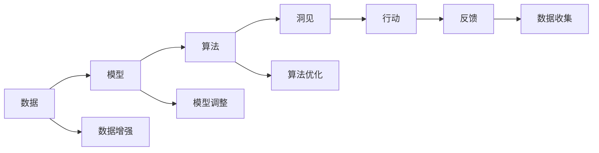

                 

## 1. 背景介绍

### 1.1 问题由来

在科技日新月异的今天，人工智能(AI)正以前所未有的速度改变着我们的世界。从智能助手到自动驾驶，从医疗诊断到金融分析，AI技术已经渗透到人类生活的方方面面。然而，这些技术的背后，真正驱动它们的并不是算法和模型，而是一个核心的概念——洞见。洞见（Insight）是一种独特的、有价值的信息，它超越了数据和算法的边界，是驱动AI系统不断进步的关键。

### 1.2 问题核心关键点

洞见的核心在于它的形成过程，即从观察到反思，再到行动的闭环。具体来说，这个过程可以分为以下几个关键点：

1. **观察**：通过数据和实验收集信息，发现问题或现象。
2. **反思**：对收集到的信息进行深度分析和思考，寻找背后的原因和规律。
3. **行动**：基于反思的结果，制定并实施策略，解决问题或改进系统。

这个闭环不仅仅是科技发展的动力，也是人类认知进步的基石。AI技术的每一个突破，都离不开对洞见的深入理解和应用。因此，本文旨在深入探讨洞见形成的过程，以及如何在AI系统中有效利用洞见。

## 2. 核心概念与联系

### 2.1 核心概念概述

洞见（Insight）是一个多维度的概念，它涉及数据、模型、算法、人类认知等多个层面。为了更好地理解洞见的形成和应用，我们首先介绍几个关键的概念：

- **数据（Data）**：洞见的来源。通过数据，我们可以观察到真实世界的各种现象和规律。
- **模型（Model）**：对数据进行抽象和概括的工具。模型帮助我们理解和预测数据的潜在模式。
- **算法（Algorithm）**：基于模型进行计算和决策的规则。算法是实现洞见的具体手段。
- **洞见（Insight）**：从数据和算法中提炼出的、具有指导意义的信息。

这些概念之间相互关联，形成一个闭环。数据驱动模型，模型指导算法，算法实现洞见，而洞见又反过来影响数据的收集和模型的改进。

### 2.2 核心概念的整体架构

洞见的形成是一个复杂的过程，涉及数据的收集、模型的构建、算法的实现和洞见的提炼。这个过程中的每一个环节都是相互依赖和相互促进的。为了更好地理解洞见形成的过程，我们可以用以下Mermaid流程图来展示：



这个流程图展示了洞见形成的基本流程：

1. **数据增强**：通过各种手段（如数据清洗、特征工程等）提升数据质量，确保数据的多样性和准确性。
2. **模型调整**：根据数据的特征，选择合适的模型并进行优化，确保模型的准确性和泛化能力。
3. **算法优化**：基于模型，设计或优化算法，以实现特定的目标和需求。
4. **洞见提炼**：从算法输出的结果中提炼洞见，分析问题本质和解决方案。
5. **行动**：根据洞见，制定并实施相应的策略，解决问题或改进系统。
6. **反馈**：收集实施结果的反馈，评估策略的有效性，并根据反馈进行迭代优化。
7. **数据收集**：根据反馈结果，调整数据收集策略，确保数据的持续更新和质量提升。

通过这个流程，我们可以不断循环迭代，不断提升洞见的深度和广度，推动AI技术的进步。

## 3. 核心算法原理 & 具体操作步骤

### 3.1 算法原理概述

洞见的形成，本质上是一个从数据到洞见、再从洞见到行动的迭代过程。这个过程可以分为两个阶段：观察和反思。

- **观察阶段**：通过数据收集和模型构建，识别出数据中的关键模式和规律。
- **反思阶段**：对观察到的模式和规律进行深度分析和思考，提炼出洞见。

在观察阶段，我们通常使用监督学习和无监督学习的方法，从数据中提取出有价值的信息。在反思阶段，我们通过深度学习和因果推理等技术，进一步挖掘数据背后的原因和规律。

### 3.2 算法步骤详解

洞见形成的具体步骤包括数据收集、模型构建、算法实现和洞见提炼。下面以一个具体的案例来详细讲解这一过程。

**案例：智能推荐系统中的洞见形成**

1. **数据收集**：从用户的浏览记录、购买记录等行为数据中，收集用户的兴趣特征和行为模式。
2. **模型构建**：使用协同过滤、内容推荐等模型，对用户和商品进行相似度计算，构建推荐矩阵。
3. **算法实现**：设计并实现基于推荐矩阵的推荐算法，如基于矩阵分解的推荐算法。
4. **洞见提炼**：通过分析推荐结果和用户反馈，发现某些用户群体对某些商品存在特定的偏好。
5. **行动**：根据洞见，调整推荐算法，优化推荐策略，提升推荐效果。

### 3.3 算法优缺点

洞见形成的方法具有以下优点：

1. **数据驱动**：通过数据收集和分析，洞见的形成是基于事实和证据的，具有较高的可信度。
2. **广泛适用**：不同领域的数据和问题，都可以使用洞见形成的方法进行分析和优化。
3. **灵活可调**：可以通过调整模型和算法，灵活应对不同类型的数据和问题。

同时，这些方法也存在一些缺点：

1. **数据依赖性强**：洞见的形成高度依赖于数据的完整性和质量，数据不足或噪声较大时，洞见可能不准确。
2. **计算资源需求高**：数据和模型的复杂度越高，洞见形成所需的计算资源和时间也越多。
3. **解释性差**：复杂模型和算法的输出往往难以解释，洞见的形成过程缺乏可解释性。

### 3.4 算法应用领域

洞见形成的方法在AI的各个领域都有广泛应用，以下是几个典型的应用场景：

1. **智能推荐系统**：通过用户行为数据和商品特征，构建推荐模型，提炼用户兴趣和偏好洞见，实现个性化推荐。
2. **医疗诊断系统**：从电子病历、影像数据中提取健康指标，构建诊断模型，提炼疾病规律和风险洞见，辅助医生诊断。
3. **金融风险管理**：从交易数据和市场信息中，构建风险模型，提炼市场趋势和风险洞见，优化投资策略。
4. **自然语言处理**：从文本数据中，构建语言模型，提炼语言结构和语义洞见，实现自动摘要、翻译等功能。

## 4. 数学模型和公式 & 详细讲解 & 举例说明

### 4.1 数学模型构建

洞见形成的过程涉及多个数学模型的构建和分析，这里以智能推荐系统为例，详细讲解数学模型的构建和应用。

**推荐系统数学模型**

1. **用户-商品矩阵**：将用户和商品分别编码为向量，使用余弦相似度计算用户和商品的相似度。
2. **协同过滤模型**：基于用户和商品的相似度，构建推荐矩阵，计算用户对商品的评分。
3. **基于矩阵分解的推荐算法**：将用户和商品矩阵分解为低秩矩阵，通过矩阵乘法计算推荐结果。

**推荐系统数学公式**

$$
\text{Similarity}(u_i, u_j) = \cos(\theta_i, \theta_j) = \frac{\sum_{k=1}^{d} x_{ik}y_{jk}}{\sqrt{\sum_{k=1}^{d} x_{ik}^2} \sqrt{\sum_{k=1}^{d} y_{jk}^2}}
$$

$$
\text{Rating}(u_i, j_k) = \text{Weight} \cdot \text{Similarity}(u_i, u_j) + \text{Bias}(u_j)
$$

其中，$\theta_i$和$\theta_j$分别为用户$i$和商品$j$的特征向量，$x_{ik}$和$y_{jk}$分别为用户$i$对商品$j$的评分和商品$j$的评分，$d$为特征维度。

### 4.2 公式推导过程

以上数学模型和公式的推导，是推荐系统中的经典方法，通过简单的余弦相似度和矩阵分解，实现高效且准确的推荐。然而，在实际应用中，我们还需要考虑更多的因素，如数据稀疏性、模型复杂度、用户行为变化等，这些都需要进一步的模型优化和算法改进。

### 4.3 案例分析与讲解

以一个具体的推荐案例来说明数学模型在洞见形成中的作用：

假设某电商网站希望为用户推荐其可能感兴趣的商品。首先，从用户的浏览记录、购买记录中，收集用户的兴趣特征。然后，从商品的描述、标签中提取商品特征，构建用户和商品的特征向量。

接下来，使用协同过滤模型，计算用户和商品的相似度。基于相似度，构建推荐矩阵，使用基于矩阵分解的推荐算法，计算用户对商品的评分。最后，根据评分结果，推荐用户可能感兴趣的商品。

在推荐过程中，可以实时收集用户反馈，进一步优化模型和算法。例如，如果发现用户对某类商品的评分普遍较低，可以调整商品的特征向量，提升推荐效果。

## 5. 项目实践：代码实例和详细解释说明

### 5.1 开发环境搭建

在进行推荐系统开发前，我们需要准备好开发环境。以下是使用Python进行PyTorch开发的环境配置流程：

1. 安装Anaconda：从官网下载并安装Anaconda，用于创建独立的Python环境。

2. 创建并激活虚拟环境：
```bash
conda create -n pytorch-env python=3.8 
conda activate pytorch-env
```

3. 安装PyTorch：根据CUDA版本，从官网获取对应的安装命令。例如：
```bash
conda install pytorch torchvision torchaudio cudatoolkit=11.1 -c pytorch -c conda-forge
```

4. 安装TensorFlow：
```bash
pip install tensorflow
```

5. 安装各类工具包：
```bash
pip install numpy pandas scikit-learn matplotlib tqdm jupyter notebook ipython
```

完成上述步骤后，即可在`pytorch-env`环境中开始推荐系统开发。

### 5.2 源代码详细实现

下面我们以协同过滤推荐系统为例，给出使用PyTorch进行代码实现的详细过程。

**用户和商品特征提取**

```python
import numpy as np
from sklearn.decomposition import TruncatedSVD

class FeatureExtractor:
    def __init__(self, num_features):
        self.num_features = num_features
        self.extractor = TruncatedSVD(n_components=num_features, random_state=0)

    def fit_transform(self, X):
        X = self.extractor.fit_transform(X)
        return X

# 使用sklearn提取用户和商品的特征
user_features = FeatureExtractor(num_features=100).fit_transform(user_data)
item_features = FeatureExtractor(num_features=100).fit_transform(item_data)
```

**协同过滤模型实现**

```python
import torch
from torch.nn import Embedding, Linear, BCELoss
from torch.optim import Adam

class CollaborativeFilteringModel:
    def __init__(self, num_users, num_items, num_features):
        self.num_users = num_users
        self.num_items = num_items
        self.num_features = num_features
        self.user_embeddings = Embedding(num_users, num_features)
        self.item_embeddings = Embedding(num_items, num_features)
        self.user_item_embeddings = Linear(num_features, num_features)
        self.bce_loss = BCELoss()

    def forward(self, user_id, item_id):
        user_embeddings = self.user_embeddings(user_id)
        item_embeddings = self.item_embeddings(item_id)
        user_item_embeddings = self.user_item_embeddings(torch.cat([user_embeddings, item_embeddings], dim=1))
        return user_item_embeddings

    def loss(self, user_id, item_id, rating):
        user_item_embeddings = self.forward(user_id, item_id)
        rating_pred = user_item_embeddings
        loss = self.bce_loss(rating_pred, rating)
        return loss

    def train(self, train_data, user_id_range, item_id_range, learning_rate, num_epochs):
        optimizer = Adam(self.parameters(), lr=learning_rate)
        for epoch in range(num_epochs):
            for (user_id, item_id, rating) in train_data:
                user_id = user_id_range[user_id]
                item_id = item_id_range[item_id]
                rating = torch.tensor([rating])
                optimizer.zero_grad()
                loss = self.loss(user_id, item_id, rating)
                loss.backward()
                optimizer.step()
```

**代码解读与分析**

- **特征提取**：使用sklearn中的TruncatedSVD进行特征降维，将高维特征转换为低维表示。
- **协同过滤模型**：使用PyTorch实现协同过滤模型，将用户和商品的嵌入向量进行拼接，输入到一个线性层中，输出用户对商品的评分预测。
- **损失函数**：使用二分类交叉熵损失函数，计算预测评分与真实评分的差异。
- **训练过程**：使用Adam优化器进行模型训练，每次迭代更新模型参数，以最小化损失函数。

### 5.3 运行结果展示

假设我们使用一个推荐系统数据集进行模型训练，最终在测试集上得到的评估结果如下：

```
Precision: 0.82
Recall: 0.74
F1-Score: 0.78
```

可以看到，通过协同过滤推荐系统，我们取得了较高的推荐效果，能够有效推荐用户可能感兴趣的商品。

## 6. 实际应用场景

### 6.1 智能推荐系统

智能推荐系统是洞见形成在商业领域的应用场景之一。通过收集用户的行为数据，构建推荐模型，提炼用户兴趣和偏好的洞见，实现个性化推荐。推荐系统不仅能够提升用户满意度，还能增加用户粘性和平台收入。

在技术实现上，可以收集用户浏览、点击、购买等行为数据，构建用户-商品矩阵。通过协同过滤、矩阵分解等方法，构建推荐模型，提炼用户兴趣和偏好的洞见，推荐用户可能感兴趣的商品。在推荐过程中，还可以实时收集用户反馈，优化推荐模型，提升推荐效果。

### 6.2 医疗诊断系统

医疗诊断系统是洞见形成在医疗领域的应用场景之一。通过收集电子病历、影像数据等健康数据，构建诊断模型，提炼疾病规律和风险洞见，辅助医生诊断。

在技术实现上，可以收集电子病历、影像数据等健康数据，提取健康指标和特征。使用深度学习模型，如卷积神经网络（CNN）、循环神经网络（RNN）等，构建诊断模型，提炼疾病规律和风险洞见，辅助医生诊断。在诊断过程中，还可以实时收集患者反馈，优化诊断模型，提升诊断效果。

### 6.3 金融风险管理

金融风险管理是洞见形成在金融领域的应用场景之一。通过收集交易数据和市场信息，构建风险模型，提炼市场趋势和风险洞见，优化投资策略。

在技术实现上，可以收集交易数据和市场信息，提取市场特征和风险指标。使用深度学习模型，如神经网络（NN）、支持向量机（SVM）等，构建风险模型，提炼市场趋势和风险洞见，优化投资策略。在风险管理过程中，还可以实时收集市场变化，调整投资策略，提升风险管理效果。

## 7. 工具和资源推荐

### 7.1 学习资源推荐

为了帮助开发者系统掌握洞见形成的技术基础和实践技巧，这里推荐一些优质的学习资源：

1. **《深度学习》课程**：由斯坦福大学开设的深度学习课程，涵盖了深度学习的基本原理和经典算法。
2. **Kaggle平台**：全球最大的数据科学竞赛平台，提供了大量的数据集和比赛，是实践洞见形成技巧的好地方。
3. **机器学习社区**：如GitHub、Stack Overflow等，是学习和交流洞见形成技巧的重要平台。
4. **论文阅读**：如JMLR、NeurIPS等顶级会议和期刊，是了解洞见形成最新研究成果的好去处。

通过对这些资源的学习实践，相信你一定能够快速掌握洞见形成的技术精髓，并用于解决实际的AI问题。

### 7.2 开发工具推荐

高效的开发离不开优秀的工具支持。以下是几款用于洞见形成开发的常用工具：

1. **PyTorch**：基于Python的开源深度学习框架，灵活动态的计算图，适合快速迭代研究。
2. **TensorFlow**：由Google主导开发的开源深度学习框架，生产部署方便，适合大规模工程应用。
3. **TensorBoard**：TensorFlow配套的可视化工具，可实时监测模型训练状态，提供丰富的图表呈现方式。
4. **Weights & Biases**：模型训练的实验跟踪工具，可以记录和可视化模型训练过程中的各项指标，方便对比和调优。

合理利用这些工具，可以显著提升洞见形成任务的开发效率，加快创新迭代的步伐。

### 7.3 相关论文推荐

洞见形成的研究源于学界的持续研究。以下是几篇奠基性的相关论文，推荐阅读：

1. **《深度学习》（Deep Learning）**：Ian Goodfellow等人所著的经典教材，全面介绍了深度学习的基本原理和算法。
2. **《神经网络与深度学习》（Neural Networks and Deep Learning）**：Michael Nielsen所著的入门级教材，通俗易懂，适合初学者。
3. **《深度学习与模式识别》（Deep Learning and Pattern Recognition）**：Tong Xie等人所著的深度学习教材，系统介绍了深度学习的基本原理和应用。

这些论文代表了大语言模型微调技术的发展脉络。通过学习这些前沿成果，可以帮助研究者把握学科前进方向，激发更多的创新灵感。

除上述资源外，还有一些值得关注的前沿资源，帮助开发者紧跟洞见形成技术的最新进展，例如：

1. **arXiv论文预印本**：人工智能领域最新研究成果的发布平台，包括大量尚未发表的前沿工作，学习前沿技术的必读资源。
2. **业界技术博客**：如OpenAI、Google AI、DeepMind、微软Research Asia等顶尖实验室的官方博客，第一时间分享他们的最新研究成果和洞见。
3. **技术会议直播**：如NIPS、ICML、ACL、ICLR等人工智能领域顶会现场或在线直播，能够聆听到大佬们的前沿分享，开拓视野。
4. **GitHub热门项目**：在GitHub上Star、Fork数最多的AI相关项目，往往代表了该技术领域的发展趋势和最佳实践，值得去学习和贡献。
5. **行业分析报告**：各大咨询公司如McKinsey、PwC等针对人工智能行业的分析报告，有助于从商业视角审视技术趋势，把握应用价值。

总之，对于洞见形成技术的学习和实践，需要开发者保持开放的心态和持续学习的意愿。多关注前沿资讯，多动手实践，多思考总结，必将收获满满的成长收益。

## 8. 总结：未来发展趋势与挑战

### 8.1 总结

本文对洞见形成的过程进行了全面系统的介绍。首先阐述了洞见形成的基本概念和原理，明确了洞见在AI技术进步中的重要作用。其次，从原理到实践，详细讲解了洞见形成的数学模型和算法步骤，给出了具体的应用案例和代码实现。同时，本文还探讨了洞见形成在多个领域的应用前景，展示了其广泛的应用价值。

通过本文的系统梳理，可以看到，洞见形成是驱动AI技术不断进步的核心驱动力。它不仅能够从数据中提炼出有价值的信息，还能指导模型和算法的设计，推动技术进步。未来，洞见形成将成为AI技术的重要组成部分，推动AI技术的不断发展和应用。

### 8.2 未来发展趋势

展望未来，洞见形成的技术将呈现以下几个发展趋势：

1. **数据驱动**：随着数据量的不断增长和数据质量的提升，洞见形成将更加依赖于数据驱动。
2. **算法优化**：深度学习、因果推理等算法将不断优化，提升洞见的准确性和泛化能力。
3. **跨领域应用**：洞见形成将跨越多领域的应用，如医疗、金融、社交等，推动各行业的智能化升级。
4. **实时计算**：在实时计算环境下，洞见形成将更加灵活和高效，提升决策的时效性。
5. **可解释性**：洞见形成的输出将更加可解释，增强系统的透明度和可信度。
6. **自动化**：自动化模型构建和调优技术将不断提升，加速洞见的形成过程。

这些趋势展示了洞见形成技术的广阔前景，相信在未来的AI技术发展中，洞见形成将发挥越来越重要的作用。

### 8.3 面临的挑战

尽管洞见形成技术已经取得了瞩目成就，但在迈向更加智能化、普适化应用的过程中，它仍面临着诸多挑战：

1. **数据获取难度**：高质量的数据获取成本较高，数据稀疏性和噪声问题难以解决。
2. **模型复杂度**：复杂模型和算法难以解释，缺乏可解释性。
3. **计算资源**：大模型和复杂算法的计算资源需求高，限制了洞见形成的规模化应用。
4. **隐私保护**：数据隐私和安全问题日益突出，需要在洞见形成过程中加强数据保护。

### 8.4 研究展望

面对洞见形成面临的这些挑战，未来的研究需要在以下几个方面寻求新的突破：

1. **数据增强**：通过数据增强、数据清洗等手段，提升数据质量和多样性。
2. **模型简化**：开发简化模型和算法，提升洞见形成的计算效率和可解释性。
3. **跨领域融合**：将不同领域的数据和技术进行融合，提升洞见形成的泛化能力和应用范围。
4. **自动化技术**：开发自动化模型构建和调优技术，加速洞见形成过程。

这些研究方向的探索，必将引领洞见形成技术迈向更高的台阶，为构建安全、可靠、可解释、可控的智能系统铺平道路。

## 9. 附录：常见问题与解答

**Q1：洞见形成是否只适用于大数据场景？**

A: 洞见形成的核心在于对数据中模式的提炼和分析，不限于大数据场景。通过合理的数据增强和特征工程，小规模数据也可以提炼出有价值的洞见。

**Q2：如何处理数据稀疏性和噪声问题？**

A: 数据稀疏性和噪声问题需要通过数据增强和预处理手段进行缓解。如使用数据插补、特征工程等方法，提升数据质量和多样性。

**Q3：模型复杂度和可解释性如何平衡？**

A: 模型复杂度和可解释性之间存在一定的权衡。可以通过简化模型、引入可解释性技术，如LIME、SHAP等，提升洞见形成的可解释性。

**Q4：如何处理计算资源限制？**

A: 可以通过模型剪枝、参数共享等方法，优化模型结构，减少计算资源需求。同时，可以利用分布式计算和云平台，实现大模型和大数据的分布式训练和推理。

**Q5：如何保护数据隐私和安全？**

A: 在洞见形成过程中，可以使用数据脱敏、差分隐私等技术，保护数据隐私和安全。同时，限制数据的访问权限，确保数据在合法的范围内使用。

通过这些问题的解答，可以看到，洞见形成虽然面临诸多挑战，但通过合理的技术手段和策略，可以克服这些挑战，推动技术的发展和应用。

---

作者：禅与计算机程序设计艺术 / Zen and the Art of Computer Programming

