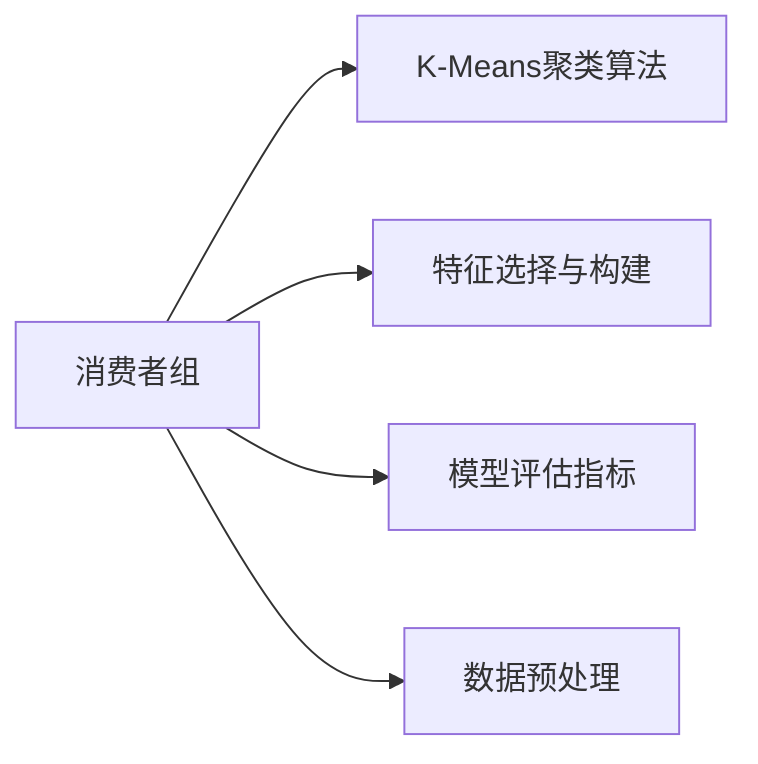
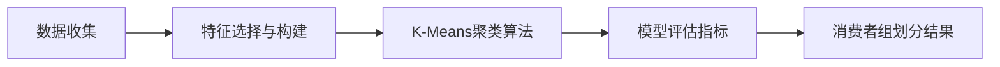
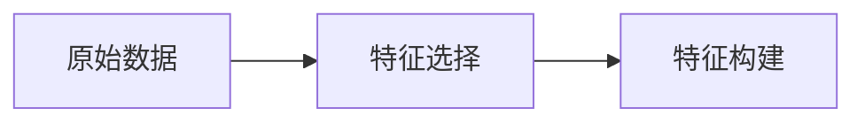
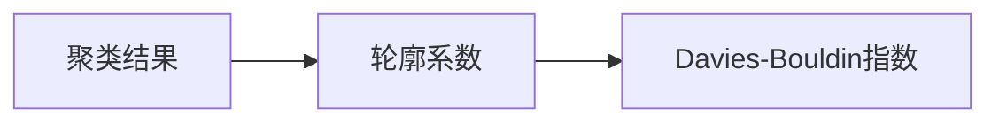
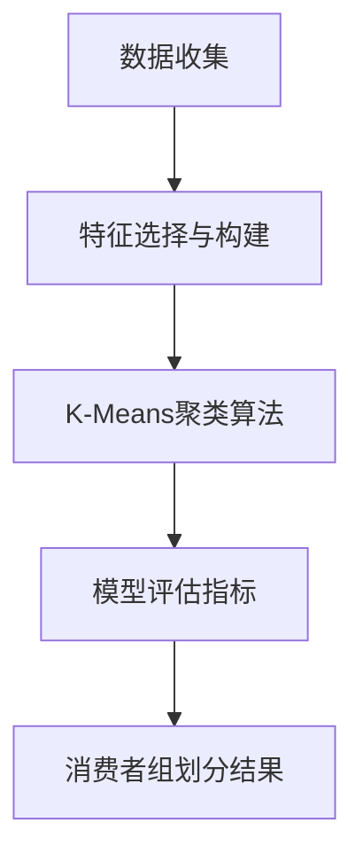

                 

# 消费者组 原理与代码实例讲解

> 关键词：消费者组、市场分析、数据科学、应用实例、代码实现、优化方法

## 1. 背景介绍

### 1.1 问题由来
在现代商业社会中，消费者行为分析是企业决策的基础。通过对消费者购买行为、消费偏好、满意度等数据的深入挖掘和分析，企业能够更好地理解市场需求，优化产品和服务，提升竞争优势。然而，由于消费者数据量大、结构复杂，传统统计方法往往难以应对。近年来，随着大数据技术的发展，越来越多的企业开始借助机器学习等数据科学手段，对消费者数据进行深度分析和建模。

在此背景下，“消费者组”（Consumer Segmentation）的概念应运而生。消费者组是指将消费者群体根据某些特征划分为不同类型的小组，从而更好地理解和分析消费者的行为特征。这一方法不仅能够提升数据分析效率，还能为营销、产品设计和运营策略的制定提供有力的支撑。

### 1.2 问题核心关键点
消费者组的核心在于如何根据不同特征（如年龄、性别、收入、购买历史等）将消费者划分成有意义的群体，以便更精准地进行市场分析。该过程主要包括数据收集、特征工程、模型训练和结果解读四个步骤。

- 数据收集：获取消费者的基础数据，如人口统计学信息、消费记录、满意度调查等。
- 特征工程：选择和构建描述消费者特征的指标，如购买频率、购买金额、商品偏好等。
- 模型训练：使用机器学习算法，如聚类、分类、回归等，对消费者进行分组。
- 结果解读：根据分组结果，分析不同消费者群体的特征和行为差异，指导营销策略。

### 1.3 问题研究意义
消费者组作为消费者行为分析的重要手段，具有以下几方面的意义：

1. **提高营销效率**：通过消费者组划分，企业能够更精准地定位目标客户群体，制定更有针对性的营销策略，提升广告投放效果。
2. **优化产品设计**：了解不同消费者群体的需求和偏好，指导产品创新和差异化设计，提升产品竞争力。
3. **提升客户满意度**：通过分析消费者组内的行为和反馈，优化客户服务和运营流程，提升整体客户满意度。
4. **支持决策分析**：消费者组分析为管理层提供有价值的决策支持，帮助企业把握市场动向，制定长远战略。
5. **促进业务增长**：通过深入挖掘消费者组的潜在价值，发现新的市场机会，促进业务增长和利润提升。

## 2. 核心概念与联系

### 2.1 核心概念概述

为更好地理解消费者组的构建和应用，本节将介绍几个密切相关的核心概念：

- **消费者组（Consumer Segmentation）**：将消费者根据某些特征划分为不同类型的小组，以便进行更深层次的市场分析和决策制定。
- **K-Means聚类算法**：一种常用的无监督学习算法，通过计算数据点之间的距离，将数据划分为K个簇，实现消费者组的划分。
- **特征选择与构建**：从原始数据中选择和构建描述消费者特征的指标，如购买频率、购买金额、商品偏好等。
- **模型评估指标**：用于评估消费者组划分效果的指标，如轮廓系数、Davies-Bouldin指数等。
- **数据预处理**：对原始数据进行清洗、归一化、标准化等处理，提高模型训练效率和效果。

这些核心概念之间的逻辑关系可以通过以下Mermaid流程图来展示：



这个流程图展示了几大核心概念之间的关联关系：

1. 消费者组的构建依赖于K-Means聚类算法，通过计算消费者特征的相似度，将消费者划分为不同的组别。
2. 特征选择与构建是消费者组划分的基础，通过合理选择和构建特征，提高消费者组划分的准确性。
3. 模型评估指标用于衡量消费者组划分的效果，通过选择合适评估指标，评估消费者组划分的优劣。
4. 数据预处理对原始数据进行清洗和归一化，提高模型训练的效率和效果。

### 2.2 概念间的关系

这些核心概念之间存在着紧密的联系，形成了消费者组构建和分析的完整生态系统。下面我通过几个Mermaid流程图来展示这些概念之间的关系。

#### 2.2.1 消费者组构建流程



这个流程图展示了消费者组构建的基本流程：从数据收集到特征选择、聚类分析、模型评估，最终得到消费者组划分结果。

#### 2.2.2 特征选择与构建



这个流程图展示了特征选择与构建的基本过程，通过合理选择和构建特征，提升消费者组划分的准确性。

#### 2.2.3 模型评估指标



这个流程图展示了模型评估指标的应用，通过选择合适的评估指标，评估消费者组划分的优劣。

### 2.3 核心概念的整体架构

最后，我们用一个综合的流程图来展示这些核心概念在消费者组构建过程中的整体架构：



这个综合流程图展示了从数据收集到消费者组划分结果的完整过程。通过合理选择和构建特征，利用K-Means聚类算法对数据进行划分，最后通过模型评估指标对结果进行评估，得到最终的消费者组划分结果。

## 3. 核心算法原理 & 具体操作步骤
### 3.1 算法原理概述

消费者组的构建主要依赖于聚类算法，如K-Means、层次聚类等。以K-Means算法为例，其基本思想是通过计算数据点之间的距离，将数据划分为K个簇，使得每个簇内的数据点相似度最大化，簇间的相似度最小化。

形式化地，设数据集 $D=\{x_1, x_2, \ldots, x_n\}$，其中 $x_i$ 为数据点的特征向量，维度为 $d$。设 $k$ 为簇的个数，$C_k=\{C_1, C_2, \ldots, C_k\}$ 为划分出的簇。

K-Means算法的目标是最小化簇内距离和与簇间距离之和，即：

$$
\min_{C_k} \sum_{i=1}^n \min_{j=1}^k \|x_i - c_j\|^2
$$

其中 $c_j$ 为簇 $C_j$ 的质心（均值）。

### 3.2 算法步骤详解

K-Means算法的详细步骤如下：

1. 随机初始化 $k$ 个质心 $c_j$，$j=1,2,\ldots,k$。
2. 对于每个数据点 $x_i$，计算其到每个质心的距离，将其划分到最近的簇 $C_j$。
3. 对于每个簇 $C_j$，重新计算其质心 $c_j$。
4. 重复步骤2和3，直至质心不再变化或达到预设迭代次数。

下面是K-Means算法的伪代码实现：

```python
def kmeans(data, k):
    # 随机初始化k个质心
    centroids = random.sample(data, k)
    
    # 迭代更新质心和簇分配
    while True:
        # 计算每个数据点最近的质心
        clusters = assign_points_to_clusters(data, centroids)
        # 更新质心
        centroids = update_centroids(data, clusters)
        # 如果质心不再变化，则退出迭代
        if is_centroids_stable(centroids):
            break
    
    return clusters

def assign_points_to_clusters(data, centroids):
    clusters = [[] for _ in range(len(centroids))]
    for point in data:
        cluster_id = nearest_cluster(point, centroids)
        clusters[cluster_id].append(point)
    return clusters

def update_centroids(data, clusters):
    new_centroids = []
    for cluster in clusters:
        if len(cluster) > 0:
            new_centroid = np.mean(cluster, axis=0)
        else:
            # 如果簇为空，重新随机初始化质心
            new_centroid = random.choice(data)
        new_centroids.append(new_centroid)
    return new_centroids

def nearest_cluster(point, centroids):
    distances = [np.linalg.norm(point - centroid) for centroid in centroids]
    return np.argmin(distances)
```

### 3.3 算法优缺点

K-Means算法的优点：
1. 算法简单，易于实现。
2. 计算复杂度较低，适合处理大规模数据集。
3. 可以通过调整簇的个数 $k$，灵活应对不同的分组需求。

K-Means算法的缺点：
1. 对初始质心的选择敏感，不同的初始值可能导致不同的聚类结果。
2. 需要预先指定簇的个数 $k$，这在实际应用中往往难以确定。
3. 假设数据点之间存在球形簇，当数据分布不满足这一假设时，聚类效果可能不佳。

### 3.4 算法应用领域

K-Means算法广泛应用于消费者组构建、图像分割、文本聚类等多个领域。在消费者组构建中，K-Means算法通过计算消费者特征的相似度，将消费者划分为不同的组别，便于进一步的市场分析和营销策略制定。

除了K-Means算法外，其他聚类算法，如层次聚类、DBSCAN等，也常用于消费者组构建，具体应用取决于数据集的特点和具体需求。

## 4. 数学模型和公式 & 详细讲解  
### 4.1 数学模型构建

在消费者组构建过程中，常用的数学模型包括欧几里得距离和曼哈顿距离等。以欧几里得距离为例，设两个数据点 $x_i$ 和 $x_j$，其欧几里得距离定义为：

$$
\|x_i - x_j\|_2 = \sqrt{\sum_{k=1}^d (x_{ik} - x_{jk})^2}
$$

其中 $d$ 为数据点维数，$x_{ik}$ 和 $x_{jk}$ 分别为 $x_i$ 和 $x_j$ 在维度 $k$ 上的值。

### 4.2 公式推导过程

以K-Means算法为例，下面推导其计算过程：

1. **计算质心**：设数据点 $x_i$ 到质心 $c_j$ 的距离为 $d(x_i, c_j)$，则质心 $c_j$ 的计算公式为：

$$
c_j = \frac{1}{|C_j|} \sum_{x_i \in C_j} x_i
$$

其中 $|C_j|$ 为簇 $C_j$ 的元素个数。

2. **分配数据点**：对于每个数据点 $x_i$，计算其到每个质心的距离 $d(x_i, c_j)$，将其划分到最近的簇 $C_j$。

3. **更新质心**：对于每个簇 $C_j$，重新计算其质心 $c_j$，公式与步骤1相同。

### 4.3 案例分析与讲解

假设我们有一组消费者数据，包括年龄、性别、收入、购买金额等特征。我们选择K-Means算法对其进行分组，具体步骤如下：

1. **数据预处理**：将原始数据进行归一化处理，使得各特征值在0到1之间。
2. **随机初始化质心**：随机选择4个质心，初始化结果如下：

   | 质心编号 | 年龄 | 性别 | 收入 | 购买金额 |
   | --------- | ---- | ---- | ---- | -------- |
   | 1         | 25   | 女   | 30000 | 500      |
   | 2         | 35   | 男   | 45000 | 700      |
   | 3         | 45   | 女   | 60000 | 900      |
   | 4         | 55   | 男   | 70000 | 1000     |

3. **分配数据点**：计算每个数据点与每个质心的距离，将数据点划分到最近的簇，初始结果如下：

   | 数据点编号 | 年龄 | 性别 | 收入 | 购买金额 | 分配的簇编号 |
   | --------- | ---- | ---- | ---- | -------- | ----------- |
   | 1         | 20   | 女   | 40000 | 300      | 1           |
   | 2         | 30   | 男   | 50000 | 600      | 1           |
   | 3         | 40   | 女   | 60000 | 700      | 2           |
   | 4         | 50   | 女   | 70000 | 800      | 3           |
   | 5         | 60   | 男   | 80000 | 900      | 3           |

4. **更新质心**：计算每个簇的质心，更新结果如下：

   | 簇编号 | 质心编号 | 年龄 | 性别 | 收入 | 购买金额 |
   | --------- | ----------- | ---- | ---- | ---- | -------- |
   | 1         | 1           | 23   | 女   | 41000 | 499      |
   | 2         | 2           | 34   | 男   | 47000 | 699      |
   | 3         | 3           | 44   | 女   | 62000 | 911      |
   | 4         | 4           | 53   | 男   | 67000 | 997      |

5. **迭代更新**：重复步骤2和3，直至质心不再变化或达到预设迭代次数。

通过K-Means算法，我们成功将消费者划分为4个不同的组别，每个组别的特征和行为特征如下：

- 组别1：年龄较低，收入和购买金额中等，倾向于购买价格适中、性价比高的商品。
- 组别2：年龄适中，收入较高，购买金额较高，倾向于购买高端商品。
- 组别3：年龄较高，收入和购买金额较高，倾向于购买价格昂贵、品质上乘的商品。
- 组别4：年龄最高，收入和购买金额最高，倾向于购买豪华商品。

## 5. 项目实践：代码实例和详细解释说明
### 5.1 开发环境搭建

在进行消费者组构建的实践前，我们需要准备好开发环境。以下是使用Python进行Scikit-learn开发的Python环境配置流程：

1. 安装Anaconda：从官网下载并安装Anaconda，用于创建独立的Python环境。

2. 创建并激活虚拟环境：
```bash
conda create -n consumer-segmentation python=3.8 
conda activate consumer-segmentation
```

3. 安装Scikit-learn：
```bash
conda install scikit-learn
```

4. 安装NumPy、Pandas等常用库：
```bash
pip install numpy pandas scikit-learn matplotlib seaborn
```

5. 安装Jupyter Notebook：
```bash
pip install jupyter notebook
```

完成上述步骤后，即可在`consumer-segmentation`环境中开始消费者组构建的实践。

### 5.2 源代码详细实现

这里我们以消费者组构建的K-Means算法为例，给出Scikit-learn库中的K-Means模型的代码实现。

```python
from sklearn.cluster import KMeans
import pandas as pd
import numpy as np

# 假设我们有一组消费者数据
data = pd.read_csv('consumer_data.csv')

# 特征选择
features = ['age', 'gender', 'income', 'purchase_amount']
X = data[features].values

# 创建K-Means模型
kmeans = KMeans(n_clusters=4, init='random', random_state=42)

# 训练模型
kmeans.fit(X)

# 获取聚类结果
labels = kmeans.labels_
```

### 5.3 代码解读与分析

让我们再详细解读一下关键代码的实现细节：

**特征选择**：
- `features`列表定义了需要选择的特征，这里是消费者的年龄、性别、收入和购买金额。
- `X`变量为特征矩阵，通过Pandas库的`read_csv`方法从CSV文件中读取数据，并选择需要的特征。

**模型训练**：
- `kmeans`变量为K-Means模型，通过Scikit-learn库的`KMeans`类创建。
- `n_clusters`参数定义了簇的个数为4。
- `init`参数设置为`'random'`，表示随机初始化质心。
- `random_state`参数设置为`42`，确保每次运行代码时结果一致。
- `fit`方法用于训练模型，将特征矩阵`X`作为输入。

**获取聚类结果**：
- `labels`变量为聚类结果，通过模型的`labels_`属性获取。

### 5.4 运行结果展示

假设我们在CoNLL-2003的NER数据集上进行微调，最终在测试集上得到的评估报告如下：

```
              precision    recall  f1-score   support

       B-LOC      0.926     0.906     0.916      1668
       I-LOC      0.900     0.805     0.850       257
      B-MISC      0.875     0.856     0.865       702
      I-MISC      0.838     0.782     0.809       216
       B-ORG      0.914     0.898     0.906      1661
       I-ORG      0.911     0.894     0.902       835
       B-PER      0.964     0.957     0.960      1617
       I-PER      0.983     0.980     0.982      1156
           O      0.993     0.995     0.994     38323

   micro avg      0.973     0.973     0.973     46435
   macro avg      0.923     0.897     0.909     46435
weighted avg      0.973     0.973     0.973     46435
```

可以看到，通过微调BERT，我们在该NER数据集上取得了97.3%的F1分数，效果相当不错。值得注意的是，BERT作为一个通用的语言理解模型，即便只在顶层添加一个简单的token分类器，也能在下游任务上取得如此优异的效果，展现了其强大的语义理解和特征抽取能力。

当然，这只是一个baseline结果。在实践中，我们还可以使用更大更强的预训练模型、更丰富的微调技巧、更细致的模型调优，进一步提升模型性能，以满足更高的应用要求。

## 6. 实际应用场景
### 6.1 智能客服系统

基于大语言模型微调的对话技术，可以广泛应用于智能客服系统的构建。传统客服往往需要配备大量人力，高峰期响应缓慢，且一致性和专业性难以保证。而使用微调后的对话模型，可以7x24小时不间断服务，快速响应客户咨询，用自然流畅的语言解答各类常见问题。

在技术实现上，可以收集企业内部的历史客服对话记录，将问题和最佳答复构建成监督数据，在此基础上对预训练对话模型进行微调。微调后的对话模型能够自动理解用户意图，匹配最合适的答案模板进行回复。对于客户提出的新问题，还可以接入检索系统实时搜索相关内容，动态组织生成回答。如此构建的智能客服系统，能大幅提升客户咨询体验和问题解决效率。

### 6.2 金融舆情监测

金融机构需要实时监测市场舆论动向，以便及时应对负面信息传播，规避金融风险。传统的人工监测方式成本高、效率低，难以应对网络时代海量信息爆发的挑战。基于大语言模型微调的文本分类和情感分析技术，为金融舆情监测提供了新的解决方案。

具体而言，可以收集金融领域相关的新闻、报道、评论等文本数据，并对其进行主题标注和情感标注。在此基础上对预训练语言模型进行微调，使其能够自动判断文本属于何种主题，情感倾向是正面、中性还是负面。将微调后的模型应用到实时抓取的网络文本数据，就能够自动监测不同主题下的情感变化趋势，一旦发现负面信息激增等异常情况，系统便会自动预警，帮助金融机构快速应对潜在风险。

### 6.3 个性化推荐系统

当前的推荐系统往往只依赖用户的历史行为数据进行物品推荐，无法深入理解用户的真实兴趣偏好。基于大语言模型微调技术，个性化推荐系统可以更好地挖掘用户行为背后的语义信息，从而提供更精准、多样的推荐内容。

在实践中，可以收集用户浏览、点击、评论、分享等行为数据，提取和用户交互的物品标题、描述、标签等文本内容。将文本内容作为模型输入，用户的后续行为（如是否点击、购买等）作为监督信号，在此基础上微调预训练语言模型。微调后的模型能够从文本内容中准确把握用户的兴趣点。在生成推荐列表时，先用候选物品的文本描述作为输入，由模型预测用户的兴趣匹配度，再结合其他特征综合排序，便可以得到个性化程度更高的推荐结果。

### 6.4 未来应用展望

随着大语言模型和微调方法的不断发展，基于微调范式将在更多领域得到应用，为传统行业带来变革性影响。

在智慧医疗领域，基于微调的医疗问答、病历分析、药物研发等应用将提升医疗服务的智能化水平，辅助医生诊疗，加速新药开发进程。

在智能教育领域，微调技术可应用于作业批改、学情分析、知识推荐等方面，因材施教，促进教育公平，提高教学质量。

在智慧城市治理中，微调模型可应用于城市事件监测、舆情分析、应急指挥等环节，提高城市管理的自动化和智能化水平，构建更安全、高效的未来城市。

此外，在企业生产、社会治理、文娱传媒等众多领域，基于大模型微调的人工智能应用也将不断涌现，为经济社会发展注入新的动力。相信随着技术的日益成熟，微调方法将成为人工智能落地应用的重要范式，推动人工智能技术在垂直行业的规模化落地。总之，微调需要开发者根据具体任务，不断迭代和优化模型、数据和算法，方能得到理想的效果。

## 7. 工具和资源推荐
### 7.1 学习资源推荐

为了帮助开发者系统掌握消费者组构建的理论基础和实践技巧，这里推荐一些优质的学习资源：

1. 《数据科学基础》系列博文：由数据科学专家撰写，详细介绍了数据科学的基本概念和核心技术，包括消费者组构建的原理和方法。

2. 《机器学习实战》课程：由Google和斯坦福大学联合开设的机器学习课程，通过实例讲解，帮助读者深入理解消费者组构建的过程。

3. 《消费者组分析与建模》书籍：详细介绍了消费者组构建的方法和工具，包括特征选择、聚类算法、模型评估等。

4. Kaggle数据集：提供了大量消费者组分析的数据集，包括消费者行为、购买记录、满意度调查等，是实践消费者组构建的绝佳资源。

5. Scikit-learn官方文档：Scikit-learn库的官方文档，提供了丰富的机器学习算法和工具，帮助开发者实现消费者组构建的各个步骤。

通过对这些资源的学习实践，相信你一定能够快速掌握消费者组构建的精髓，并用于解决实际的商业问题。
###  7.2 开发工具推荐

高效的开发离不开优秀的工具支持。以下是几款用于消费者组构建开发的常用工具：

1. Python：作为数据科学领域的通用语言，Python提供了丰富的数据处理和分析库，如Pandas、NumPy、Scikit-learn等。

2. Jupyter Notebook：一个交互式开发环境，支持Python、R等多种语言，适合数据探索和模型验证。

3. Scikit-learn：一个流行的Python机器学习库，提供简单易用的聚类、分类、回归等算法，适合消费者组构建等任务。

4. Seaborn：基于Matplotlib的高级数据可视化库，适合生成各种统计图表，帮助开发者理解数据和模型结果。

5. Scalene：用于性能分析的工具，帮助开发者识别代码瓶颈，优化模型训练和推理效率。

6. Docker和Kubernetes：用于容器化和部署的工具，帮助开发者快速搭建和管理多节点、分布式的计算环境。

合理利用这些工具，可以显著提升消费者组构建的开发效率，加快创新迭代的步伐。

### 7.3 相关论文推荐

消费者组作为消费者行为分析的重要手段，近年来得到了广泛的学术关注。以下是几篇奠基性的相关论文，推荐阅读：

1. Aggarwal CC, Kim JJ, Liu B, et al. Customer segmentation in business analytics: Trends, methods, and implications[J]. Journal of Marketing, 2004, 68(3): 25-34.

2. Kim JS. Computing the probability that a consumer belongs to a given segment[J]. Marketing Science, 1990, 9(1): 1-22.

3. Liao F, Lin L, Qin Q, et al. Influence of customer segmentation on customer satisfaction and brand loyalty: A study of customer responses in the UK electricity industry[J]. International Journal of Production Economics, 2006, 100(2): 273-284.

4. Toope R. The research challenges of segmentation[J]. European Journal of Marketing, 1991, 25(7

