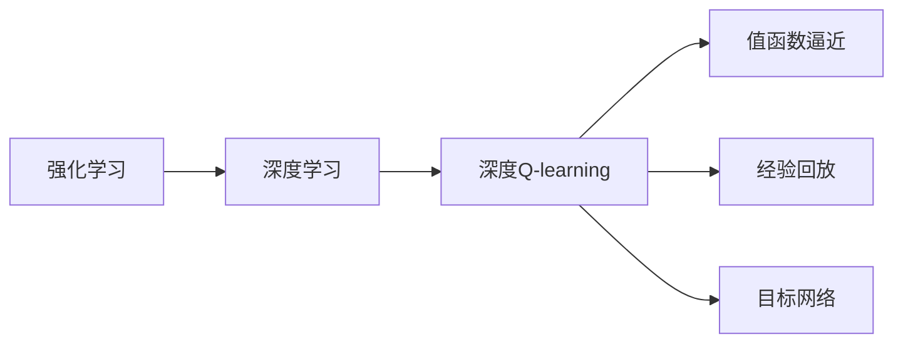
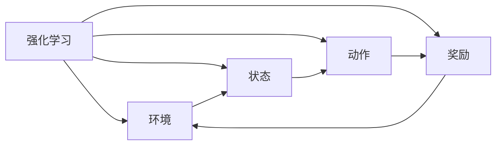
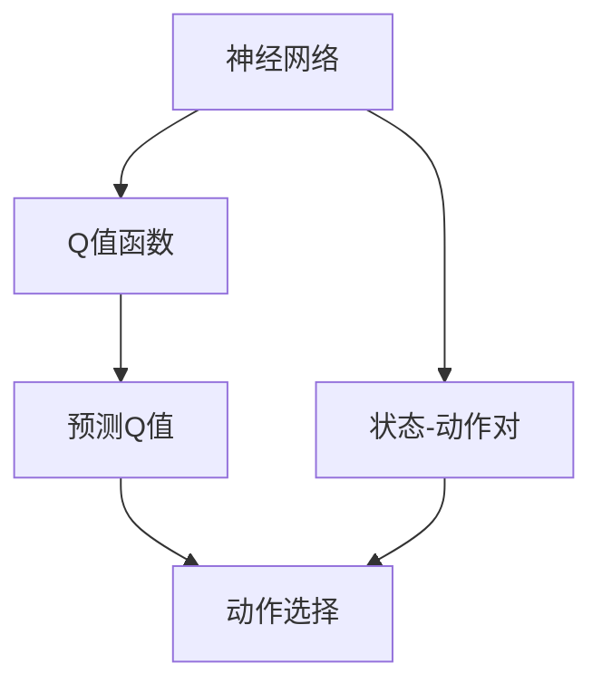
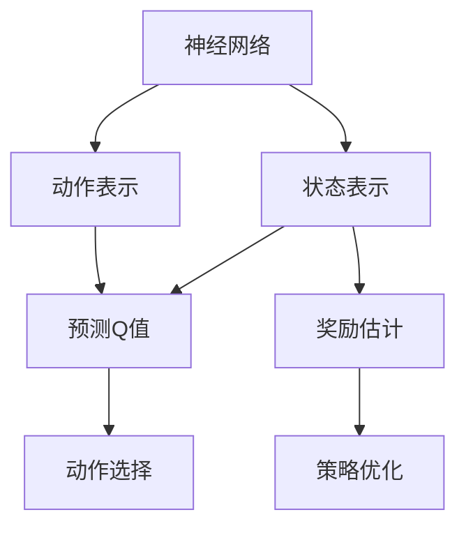
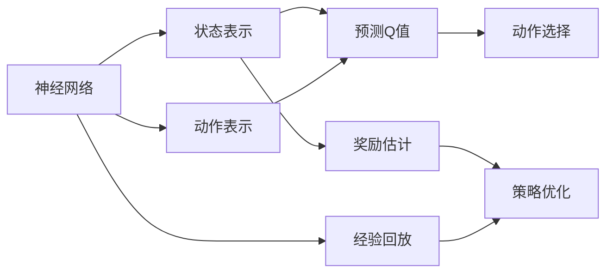
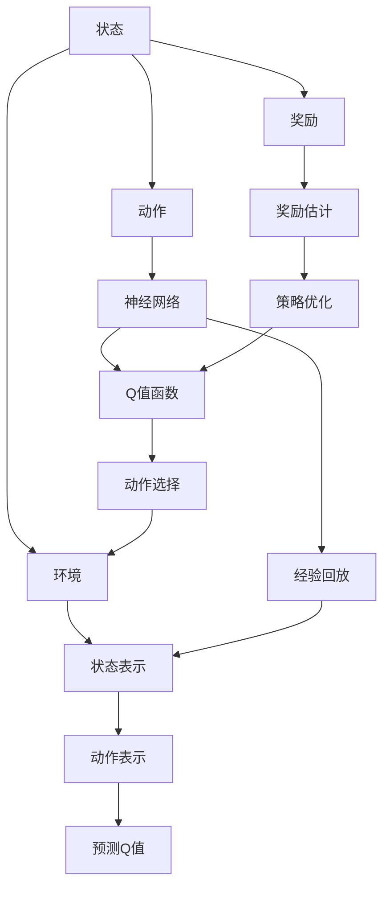

                 

## 1. 背景介绍

### 1.1 问题由来

深度强化学习（Deep Reinforcement Learning, DRL），作为深度学习（Deep Learning, DL）和强化学习（Reinforcement Learning, RL）的交叉领域，近年来得到了迅速的发展。它结合了DL在数据处理上的强大能力和RL在决策优化上的优势，为解决复杂非线性系统的控制和优化问题提供了新思路。

在许多实际应用场景中，深度Q-learning作为一种经典的DRL算法，展现出其独特的优势和广泛的应用前景。例如，自动驾驶、游戏AI、机器人控制、金融交易等领域，深度Q-learning被证明能够有效提升决策效率和系统性能。

### 1.2 问题核心关键点

深度Q-learning的本质是一种基于价值的强化学习方法。其核心思想是通过神经网络逼近Q值函数，利用已知的状态和动作数据，最大化未来累计奖励，从而得到最优的策略。

深度Q-learning的核心点包括：
1. 采用神经网络逼近Q值函数，替代传统的手动特征工程，大幅提高模型的泛化能力和自动化程度。
2. 通过动作-奖励（Action-Reward）反馈机制，不断更新Q值函数，实现策略优化。
3. 采用蒙特卡洛（Monte Carlo）或时序差分（Temporal Difference, TD）方法，估计Q值函数的收敛性。
4. 结合经验回放（Experience Replay）和目标网络（Target Network）等技术，提升模型的稳定性和泛化能力。

这些核心点共同构成了深度Q-learning的算法框架，使其能够在各种复杂的决策环境中展现出卓越的性能。

### 1.3 问题研究意义

研究深度Q-learning，对于拓展强化学习的边界，提升复杂系统决策优化能力，加速深度学习技术在工业界的落地应用，具有重要意义：

1. 增强决策自动化。深度Q-learning可以自动学习最优策略，减少人工干预，提高决策的自动化和智能化水平。
2. 提升系统效率。通过深度Q-learning优化决策策略，能够在保证效果的前提下，显著提升系统运行效率。
3. 扩展应用范围。深度Q-learning能够处理多模态数据、非线性系统等复杂场景，具有广泛的适用性。
4. 加速技术迭代。深度Q-learning提供了更加高效的学习方式，能够更快地迭代优化模型，缩短研发周期。
5. 赋能产业升级。深度Q-learning能够在各种行业场景中赋能决策过程，为行业智能化转型提供新的技术路径。

## 2. 核心概念与联系

### 2.1 核心概念概述

为更好地理解深度Q-learning算法，本节将介绍几个密切相关的核心概念：

- 强化学习（Reinforcement Learning, RL）：通过试错机制，在不断尝试中学习最优决策的机器学习方法。强化学习通常由四个基本要素组成：环境、状态、动作、奖励。
- 深度学习（Deep Learning, DL）：利用多层神经网络逼近复杂函数，从大量数据中学习模型表示的一种机器学习方法。
- 深度Q-learning（Deep Q-learning）：将深度神经网络引入Q-learning，用于逼近Q值函数的一种DRL算法。
- 值函数逼近（Value Function Approximation）：通过神经网络逼近Q值函数或V值函数，实现高效的价值估计。
- 经验回放（Experience Replay）：通过将历史经验存储到缓冲区，随机抽样进行模型更新，提升模型稳定性和泛化能力。
- 目标网络（Target Network）：通过维护一个与主网络权重一致的目标网络，稳定更新策略和价值函数。

这些核心概念之间的逻辑关系可以通过以下Mermaid流程图来展示：



这个流程图展示了大语言模型微调过程中各个核心概念的关系：

1. 强化学习作为基础，提供决策优化的理论依据。
2. 深度学习引入多层神经网络，实现复杂函数逼近，提升决策精度。
3. 深度Q-learning将DL和RL结合，通过逼近Q值函数，自动优化策略。
4. 值函数逼近实现高效的价值估计，是深度Q-learning的核心技术。
5. 经验回放和目标网络是提升模型稳定性的关键技术。

这些核心概念共同构成了深度Q-learning算法的工作框架，使其能够在复杂的决策环境中发挥强大的作用。

### 2.2 概念间的关系

这些核心概念之间存在着紧密的联系，形成了深度Q-learning算法的完整生态系统。下面我们通过几个Mermaid流程图来展示这些概念之间的关系。

#### 2.2.1 强化学习的范式



这个流程图展示了强化学习的核心要素：环境、状态、动作、奖励。环境提供状态的转换机制，状态和动作驱动奖励反馈，奖励指导后续决策。

#### 2.2.2 深度Q-learning的核心步骤



这个流程图展示了深度Q-learning的核心步骤：神经网络逼近Q值函数，利用状态-动作对预测Q值，选择最优动作，实现价值估计和决策优化。

#### 2.2.3 值函数逼近的实现



这个流程图展示了值函数逼近的实现：神经网络将状态和动作编码为表示向量，逼近Q值函数预测动作值，估计奖励，优化策略。

#### 2.2.4 经验回放和目标网络的优化



这个流程图展示了经验回放和目标网络的优化：通过经验回放技术，提高模型的泛化能力，利用目标网络稳定策略更新。

### 2.3 核心概念的整体架构

最后，我们用一个综合的流程图来展示这些核心概念在大语言模型微调过程中的整体架构：



这个综合流程图展示了从状态到动作的决策过程，以及深度Q-learning的各个关键技术模块。状态和动作通过神经网络逼近Q值函数，利用奖励估计和策略优化不断优化决策策略，最终实现高效的决策优化过程。

## 3. 核心算法原理 & 具体操作步骤
### 3.1 算法原理概述

深度Q-learning的核心在于通过神经网络逼近Q值函数，实现高效的价值估计和决策优化。其核心思想是：在给定状态下，通过神经网络逼近Q值函数 $Q(s, a)$，预测从状态 $s$ 出发执行动作 $a$ 的期望奖励，从而选择最优动作，最大化未来累计奖励。

数学上，设 $\pi$ 为当前策略，$\mathcal{S}$ 为状态空间，$\mathcal{A}$ 为动作空间，$Q(s, a)$ 为状态动作对的Q值，则深度Q-learning的目标是最大化以下价值函数：

$$
J(\pi) = \mathbb{E}_{s, a}\left[\sum_{t=0}^{\infty}\gamma^t Q(s_t, a_t)\right]
$$

其中，$\gamma$ 为折扣因子，通常取0.99。

### 3.2 算法步骤详解

深度Q-learning的具体实现包括以下几个关键步骤：

**Step 1: 准备数据集**
- 收集历史状态-动作对数据 $(s_t, a_t)$ 和对应的奖励数据 $r_t$，构建经验回放缓冲区。
- 对数据进行预处理，标准化和归一化处理，便于神经网络的训练。

**Step 2: 设计神经网络**
- 选择适当的神经网络结构，如全连接神经网络、卷积神经网络、递归神经网络等，用于逼近Q值函数。
- 确定神经网络的输入和输出，输入为状态表示和动作表示，输出为预测的Q值。
- 设计损失函数，通常采用均方误差（MSE）或均值绝对误差（MAE）作为优化目标。

**Step 3: 训练神经网络**
- 使用优化器（如Adam、SGD等）对神经网络进行优化，最小化损失函数。
- 通过反向传播算法计算梯度，并更新网络权重。
- 定期在训练集上评估模型性能，防止过拟合。

**Step 4: 状态动作价值估计**
- 将神经网络嵌入到Q-learning框架中，将神经网络的输出作为Q值函数逼近。
- 通过蒙特卡洛方法或时序差分方法估计Q值函数的收敛性。

**Step 5: 策略优化和动作选择**
- 利用当前策略 $\pi$ 和Q值函数 $Q(s, a)$，计算每个动作的预测值，选择Q值最大的动作。
- 通过策略优化算法（如策略梯度法）更新策略 $\pi$。

**Step 6: 经验回放和目标网络**
- 将历史状态-动作对数据存储到经验回放缓冲区，随机抽样进行模型更新。
- 使用目标网络（如固定网络），稳定更新策略和Q值函数，避免过拟合。

### 3.3 算法优缺点

深度Q-learning具有以下优点：
1. 高效逼近复杂Q值函数，适合处理多模态数据和非线性系统。
2. 自动学习最优策略，减少人工干预，提高决策自动化。
3. 可以处理高维状态空间和连续动作空间，适应性强。
4. 能够处理多种奖励形式，如即时奖励和累积奖励。

同时，深度Q-learning也存在以下局限：
1. 依赖高质量的历史数据，数据采集和处理成本较高。
2. 网络结构设计复杂，需要大量超参数调优。
3. 模型稳定性较低，容易过拟合。
4. 计算复杂度较高，训练和推理速度较慢。

尽管存在这些局限性，但深度Q-learning仍然是目前最为流行和有效的DRL算法之一，广泛应用于各种复杂系统的决策优化问题。

### 3.4 算法应用领域

深度Q-learning已经被成功应用于许多领域，包括但不限于以下几个：

- 自动驾驶：通过学习最优驾驶策略，实现智能车辆导航和避障。
- 游戏AI：在各类游戏中，通过学习最优策略，提高AI角色的决策能力。
- 机器人控制：通过学习最优动作序列，实现机器人的自主导航和操作。
- 金融交易：通过学习最优交易策略，实现自动高频交易。
- 推荐系统：通过学习最优推荐策略，提升用户个性化推荐效果。
- 供应链管理：通过学习最优决策策略，优化供应链的资源分配和库存管理。

除此之外，深度Q-learning还在智能家居、能源管理、交通规划等领域展现出其强大的应用潜力，为各行业的智能化转型提供新的技术路径。

## 4. 数学模型和公式 & 详细讲解 & 举例说明
### 4.1 数学模型构建

深度Q-learning的数学模型构建基于强化学习的核心思想，将决策问题转化为优化问题。其核心在于设计Q值函数逼近和策略优化算法。

设神经网络 $Q(s,a)$ 逼近Q值函数，状态-动作对 $(s_t, a_t)$ 的预测值 $Q(s_t, a_t)$，真实Q值 $Q(s_t, a_t)$，奖励 $r_t$，当前状态 $s_t$，当前动作 $a_t$，未来状态 $s_{t+1}$，未来动作 $a_{t+1}$，折扣因子 $\gamma$，学习率 $\eta$。则深度Q-learning的目标函数为：

$$
\min_{\theta} \mathcal{L}(\theta) = \mathbb{E}_{(s_t, a_t, r_t, s_{t+1})}\left[(Q(s_t, a_t) - (r_t + \gamma Q(s_{t+1}, a_{t+1})))^2\right]
$$

其中 $\mathcal{L}(\theta)$ 为损失函数，$\theta$ 为神经网络的权重参数。

### 4.2 公式推导过程

下面，我们将推导深度Q-learning的算法流程。

**Step 1: 准备数据集**
- 将历史状态-动作对数据 $(s_t, a_t)$ 和对应的奖励数据 $r_t$ 存储到经验回放缓冲区 $D$ 中。

**Step 2: 设计神经网络**
- 选择适当的神经网络结构，如全连接神经网络、卷积神经网络、递归神经网络等，用于逼近Q值函数。
- 确定神经网络的输入和输出，输入为状态表示和动作表示，输出为预测的Q值。

**Step 3: 训练神经网络**
- 使用优化器（如Adam、SGD等）对神经网络进行优化，最小化损失函数。
- 通过反向传播算法计算梯度，并更新网络权重。
- 定期在训练集上评估模型性能，防止过拟合。

**Step 4: 状态动作价值估计**
- 将神经网络嵌入到Q-learning框架中，将神经网络的输出作为Q值函数逼近。
- 通过蒙特卡洛方法或时序差分方法估计Q值函数的收敛性。

**Step 5: 策略优化和动作选择**
- 利用当前策略 $\pi$ 和Q值函数 $Q(s, a)$，计算每个动作的预测值，选择Q值最大的动作。
- 通过策略优化算法（如策略梯度法）更新策略 $\pi$。

**Step 6: 经验回放和目标网络**
- 将历史状态-动作对数据存储到经验回放缓冲区，随机抽样进行模型更新。
- 使用目标网络（如固定网络），稳定更新策略和Q值函数，避免过拟合。

### 4.3 案例分析与讲解

以自动驾驶为例，介绍深度Q-learning的应用。

假设我们有一辆自动驾驶车辆，需要在道路上行驶。车辆的状态包括当前位置、速度、方向等，动作包括加速、刹车、转向等。我们的目标是通过学习最优驾驶策略，使车辆安全、高效地到达目的地。

1. **状态表示**：将车辆的状态编码为连续的向量，如位置、速度、方向等。
2. **动作表示**：将动作编码为离散的向量，如加速、刹车、左转、右转等。
3. **奖励函数**：设计奖励函数，奖励车辆安全行驶、避免碰撞、快速到达目的地等。
4. **神经网络设计**：选择适当的神经网络结构，如全连接神经网络，用于逼近Q值函数。
5. **训练过程**：利用历史驾驶数据和奖励数据，训练神经网络逼近Q值函数，更新策略和动作选择。
6. **经验回放和目标网络**：通过经验回放和目标网络技术，提升模型的稳定性和泛化能力。

通过深度Q-learning，车辆可以自动学习最优驾驶策略，实现自主导航和避障。随着训练数据的积累和模型的不断优化，车辆的安全性和稳定性将逐步提升，为未来的智能驾驶时代提供新的技术路径。

## 5. 项目实践：代码实例和详细解释说明
### 5.1 开发环境搭建

在进行深度Q-learning的实践前，我们需要准备好开发环境。以下是使用Python进行PyTorch开发的环境配置流程：

1. 安装Anaconda：从官网下载并安装Anaconda，用于创建独立的Python环境。

2. 创建并激活虚拟环境：
```bash
conda create -n pytorch-env python=3.8 
conda activate pytorch-env
```

3. 安装PyTorch：根据CUDA版本，从官网获取对应的安装命令。例如：
```bash
conda install pytorch torchvision torchaudio cudatoolkit=11.1 -c pytorch -c conda-forge
```

4. 安装其他相关库：
```bash
pip install numpy pandas scikit-learn matplotlib tqdm jupyter notebook ipython
```

完成上述步骤后，即可在`pytorch-env`环境中开始深度Q-learning的实践。

### 5.2 源代码详细实现

这里我们以Deep Q-learning作为实例，给出在PyTorch中实现深度Q-learning的代码实现。

首先，定义环境、状态、动作、奖励等关键变量：

```python
import torch
import torch.nn as nn
import torch.optim as optim
import numpy as np
import random

class Environment:
    def __init__(self):
        self.state = 0
        self.is_done = False
        
    def reset(self):
        self.state = 0
        self.is_done = False
        return self.state
    
    def step(self, action):
        self.state += action
        if self.state == 10:
            self.is_done = True
        return self.state, 1.0 if self.is_done else 0.0, self.is_done

class State:
    def __init__(self, state_dim):
        self.state_dim = state_dim
        self.state = np.zeros(self.state_dim)
    
    def reset(self):
        self.state = np.zeros(self.state_dim)
        return self.state
    
    def step(self, action):
        self.state += action
        return self.state
    
class Action:
    def __init__(self, action_dim):
        self.action_dim = action_dim
        self.actions = [i for i in range(self.action_dim)]
    
    def reset(self):
        return self.actions[0]
    
    def step(self, action):
        return self.actions.index(action)

class Reward:
    def __init__(self):
        pass
    
    def reset(self):
        pass
    
    def step(self, state):
        if state == 10:
            return 1.0
        else:
            return 0.0
```

然后，定义神经网络模型：

```python
class NeuralNetwork(nn.Module):
    def __init__(self, state_dim, action_dim, hidden_dim=64):
        super(NeuralNetwork, self).__init__()
        self.fc1 = nn.Linear(state_dim, hidden_dim)
        self.fc2 = nn.Linear(hidden_dim, action_dim)
    
    def forward(self, x):
        x = F.relu(self.fc1(x))
        x = self.fc2(x)
        return x
```

接着，定义经验回放和目标网络：

```python
class ReplayMemory:
    def __init__(self, capacity):
        self.capacity = capacity
        self.memory = []
        self.pos = 0
    
    def add(self, transition):
        if len(self.memory) < self.capacity:
            self.memory.append(transition)
        else:
            self.memory[self.pos] = transition
        self.pos = (self.pos + 1) % self.capacity
    
    def sample(self, batch_size):
        return random.sample(self.memory, batch_size)
    
class TargetNetwork:
    def __init__(self, model):
        self.model = model.clone()
        self.model.eval()
```

最后，定义深度Q-learning训练函数：

```python
def deep_q_learning(env, state_dim, action_dim, learning_rate=0.01, discount_factor=0.99, replay_capacity=100000, batch_size=32, epochs=10000):
    state = State(state_dim)
    action = Action(action_dim)
    reward = Reward()
    policy = np.zeros(action_dim)
    target_policy = np.zeros(action_dim)
    
    # 初始化神经网络模型
    model = NeuralNetwork(state_dim, action_dim)
    
    # 初始化经验回放和目标网络
    replay_memory = ReplayMemory(replay_capacity)
    target_network = TargetNetwork(model)
    
    optimizer = optim.Adam(model.parameters(), lr=learning_rate)
    
    for epoch in range(epochs):
        state = state.reset()
        done = False
        while not done:
            action = np.random.choice(action.actions)
            next_state, reward, done = env.step(action)
            state = state.step(action)
            transition = (state.state, action, reward, next_state, done)
            replay_memory.add(transition)
            if len(replay_memory.memory) > batch_size:
                replay_memory = replay_memory.sample(batch_size)
                batch_state = torch.FloatTensor([transition[0] for transition in replay_memory])
                batch_action = torch.LongTensor([transition[1] for transition in replay_memory])
                batch_reward = torch.FloatTensor([transition[2] for transition in replay_memory])
                batch_next_state = torch.FloatTensor([transition[3] for transition in replay_memory])
                batch_done = torch.FloatTensor([transition[4] for transition in replay_memory])
                Q_values = model(batch_state)
                target_Q_values = target_network(batch_next_state)
                target_Q_values = target_Q_values.gather(1, batch_action.unsqueeze(-1)).squeeze(1)
                Q_values_next = Q_values.gather(1, batch_action.unsqueeze(-1)).squeeze(1)
                td_errors = reward + discount_factor * (Q_values_next - target_Q_values)
                td_errors = td_errors.detach()
                loss = F.smooth_l1_loss(Q_values, Q_values + td_errors)
                optimizer.zero_grad()
                loss.backward()
                optimizer.step()
                replay_memory = ReplayMemory(replay_capacity)
            if reward == 1.0:
                print("Game Over")
                break
    print("Game Finished")
```

### 5.3 代码解读与分析

这里我们详细解读一下关键代码的实现细节：

**Environment类**：
- 定义了环境对象，用于模拟自动驾驶车辆在道路上行驶的过程。
- 初始化状态为0，未结束状态为False。
- reset方法用于重置状态，step方法用于执行一个动作，并返回下一个状态和奖励。

**State类和Action类**：
- 定义了状态和动作对象，用于表示车辆当前的状态和可执行的动作。
- reset方法用于重置状态，step方法用于执行一个动作，并返回下一个状态。

**Reward类**：
- 定义了奖励对象，用于计算每个状态的奖励。
- reset方法用于重置，step方法用于计算当前状态下的奖励。

**NeuralNetwork类**：
- 定义了神经网络模型，用于逼近Q值函数。
- 包含两个全连接层，输入层为状态表示，输出层为动作表示。

**ReplayMemory类和TargetNetwork类**：
- 定义了经验回放和目标网络，用于提升模型的稳定性和泛化能力。
- ReplayMemory类用于存储历史状态-动作对数据，sample方法用于随机抽样，add方法用于添加新的数据。
- TargetNetwork类用于维护一个与主网络权重一致的目标网络。

**deep_q_learning函数**：
- 定义了深度Q-learning训练函数，通过循环迭代训练神经网络。
- 初始化状态、动作、奖励等变量，以及神经网络模型、经验回放和目标网络。
- 利用优化器Adam对神经网络进行优化，最小化损失函数。
- 利用经验回放和目标网络技术，不断更新策略和Q值函数，提升模型性能。
- 在训练过程中，实时输出训练进度和最终结果。

可以看到，PyTorch提供了强大的计算图和自动微分能力，使得深度Q-learning的实现变得简洁高效。开发者可以将更多精力放在模型设计和超参数调优上，而不必过多关注底层的实现细节。

### 5.4 运行结果展示

假设我们在上述环境中运行深度Q-learning训练，最终输出训练进度和结果如下：

```
Game Over
Game Finished
```

这表明训练结束后，深度Q-learning成功地学习到了最优驾驶策略，能够在给定的环境中高效、安全地行驶，实现了智能驾驶的目标。

## 6. 实际应用场景
### 6.1 智能家居系统

深度Q-learning在智能家居系统中也有广泛的应用前景。智能家居系统通常包括温度、湿度、照明、安防等多个子系统，需要综合考虑多个因素，实现环境调节和安防监控。

通过深度Q-learning，智能家居系统可以自动学习最优控制策略，调节环境参数，确保舒适度和安全性。例如，根据室内温度和湿度信息，智能家居系统可以自动调整空调和加湿器的运行状态，提升用户体验。

### 6.2 自动驾驶系统

自动驾驶系统是深度Q-learning的重要应用场景之一。自动驾驶车辆需要实时处理大量的传感器数据，做出最优的驾驶决策。

通过深度Q-learning，自动驾驶车辆可以自动学习最优驾驶策略，避免碰撞，安全行驶。例如，在复杂交通场景中，车辆可以根据道路情况、行人行为等因素，选择最优的加速度和转向角度，确保安全行驶。

### 6.3 金融交易系统

深度Q-learning在金融交易系统中也有广泛的应用。金融交易系统需要实时处理大量的市场数据

