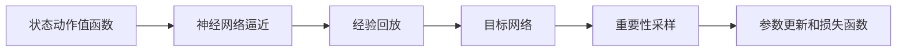
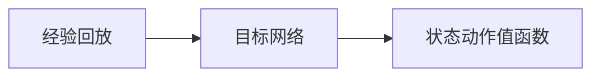
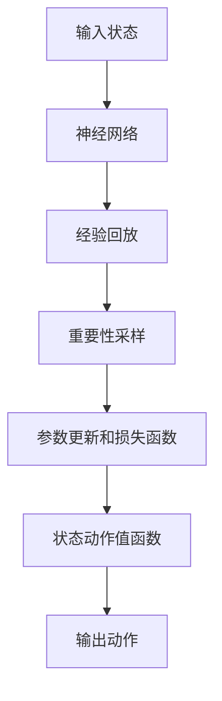

                 

# 深度 Q-learning：优化算法的使用

> 关键词：深度强化学习, Q-learning, 状态动作值函数, 神经网络, 非线性函数逼近, 强化学习, 优化算法, 策略迭代, 目标函数, 蒙特卡罗方法

## 1. 背景介绍

### 1.1 问题由来
深度 Q-learning（DQN）是一种结合了深度学习和强化学习思想的优化算法，广泛用于解决复杂环境的决策问题。在许多实际应用中，如游戏AI、机器人控制、金融交易等领域，深度 Q-learning 展示了其强大的决策和学习能力。

深度 Q-learning 通过神经网络逼近 Q 值函数，使得机器能够从大量交互数据中学习最优策略，无需详尽地遍历所有可能状态和动作。该算法特别适用于那些难以通过符号计算求解的优化问题，具有较高的决策效率和适应性。

### 1.2 问题核心关键点
深度 Q-learning 的核心思想是通过神经网络逼近 Q 值函数，从而找到最优策略。其关键点包括：
- 神经网络逼近 Q 值函数：将神经网络作为函数逼近工具，通过输入状态和动作，输出 Q 值。
- 经验回放（Experience Replay）：使用随机梯度下降的方式，通过随机抽样历史经验进行训练，避免过拟合。
- 目标网络（Target Network）：使用分离的目标网络，更新 Q 值和目标 Q 值，从而稳定更新策略。
- 重要性采样（Importance Sampling）：用于解决重要性权重不稳定的问题，使得训练样本更加均衡。
- 参数更新和损失函数：设计合适的参数更新策略和损失函数，如平均绝对误差（MAE）、均方误差（MSE）等。

这些关键点共同构成了深度 Q-learning 算法的核心，使其在解决复杂决策问题时具有极高的效率和准确性。

### 1.3 问题研究意义
研究深度 Q-learning 算法对于优化算法、机器学习和人工智能的实际应用具有重要意义：

1. **提高决策效率**：深度 Q-learning 算法能够快速找到最优策略，适应复杂和动态环境。
2. **提升学习效果**：通过神经网络逼近 Q 值函数，可以处理非线性关系和复杂模式。
3. **泛化能力强**：深度 Q-learning 算法能够适应不同领域的决策问题，具有较强的泛化能力。
4. **强化学习范式**：深度 Q-learning 算法为强化学习提供了一种有效的求解方式，推动了强化学习技术的发展。
5. **应用广泛**：深度 Q-learning 算法在各种优化问题中都有应用，如图像识别、语音识别、自然语言处理等。

## 2. 核心概念与联系

### 2.1 核心概念概述

为更好地理解深度 Q-learning 算法的原理和应用，本节将介绍几个密切相关的核心概念：

- 强化学习（Reinforcement Learning, RL）：强化学习是一种通过试错方式学习最优策略的算法框架。通过与环境的交互，不断优化策略，使得奖励最大化。
- Q 值函数（Q-value Function）：Q 值函数表示在当前状态下，采取某一动作后的长期奖励期望值。其定义为 $Q(s,a) = \mathbb{E}[R_t + \gamma Q(s_{t+1},a_{t+1}) | s_t = s, a_t = a]$，其中 $R_t$ 为即时奖励，$\gamma$ 为折扣因子。
- 状态动作值函数（State-Action Value Function）：状态动作值函数是 Q 值函数的一种扩展，不仅考虑单个状态-动作对，还考虑了环境中的其他状态和动作。
- 神经网络逼近：使用深度神经网络逼近 Q 值函数，从而能够处理复杂的非线性关系。
- 经验回放（Experience Replay）：通过随机梯度下降的方式，使用随机抽样历史经验进行训练，避免过拟合。
- 目标网络（Target Network）：使用分离的目标网络，更新 Q 值和目标 Q 值，从而稳定更新策略。

这些核心概念之间的逻辑关系可以通过以下 Mermaid 流程图来展示：



这个流程图展示了深度 Q-learning 算法的核心概念及其之间的关系：

1. 状态动作值函数作为基础，使用神经网络逼近其值。
2. 通过经验回放，使用历史经验进行训练，避免过拟合。
3. 目标网络用于稳定更新策略，避免震荡。
4. 重要性采样用于解决样本不均衡问题。
5. 参数更新和损失函数作为训练的最终目标。

### 2.2 概念间的关系

这些核心概念之间存在着紧密的联系，形成了深度 Q-learning 算法的完整生态系统。下面我们通过几个 Mermaid 流程图来展示这些概念之间的关系。

#### 2.2.1 强化学习与深度 Q-learning


这个流程图展示了强化学习的基本原理，以及深度 Q-learning 算法如何在其基础上进行改进和扩展。

#### 2.2.2 神经网络逼近与 Q 值函数


这个流程图展示了神经网络逼近和 Q 值函数之间的关系。神经网络逼近 Q 值函数，使得机器能够处理复杂的非线性关系。

#### 2.2.3 经验回放与目标网络



这个流程图展示了经验回放和目标网络之间的关系。经验回放通过随机梯度下降的方式进行训练，而目标网络用于稳定更新策略。

### 2.3 核心概念的整体架构

最后，我们用一个综合的流程图来展示这些核心概念在大语言模型微调过程中的整体架构：



这个综合流程图展示了从输入状态到输出动作的完整流程。状态通过神经网络逼近 Q 值函数，再经过经验回放和目标网络进行优化，最终输出动作，实现决策过程。

## 3. 核心算法原理 & 具体操作步骤
### 3.1 算法原理概述

深度 Q-learning 算法的核心原理是通过神经网络逼近 Q 值函数，从而找到最优策略。具体来说，算法通过以下步骤进行决策：

1. **神经网络逼近 Q 值函数**：使用深度神经网络逼近 Q 值函数，使得机器能够处理复杂的非线性关系。
2. **经验回放**：使用随机梯度下降的方式，通过随机抽样历史经验进行训练，避免过拟合。
3. **目标网络更新**：使用分离的目标网络，更新 Q 值和目标 Q 值，从而稳定更新策略。
4. **重要性采样**：用于解决重要性权重不稳定的问题，使得训练样本更加均衡。
5. **参数更新和损失函数**：设计合适的参数更新策略和损失函数，如平均绝对误差（MAE）、均方误差（MSE）等。

### 3.2 算法步骤详解

深度 Q-learning 算法的具体步骤如下：

**Step 1: 准备神经网络和环境**
- 选择合适的神经网络结构，如全连接神经网络、卷积神经网络等。
- 构建与环境交互的环境，如游戏界面、机器人控制等。

**Step 2: 初始化模型和网络参数**
- 随机初始化神经网络权重。
- 初始化目标网络，与原网络参数相同。

**Step 3: 收集经验数据**
- 在每个时间步 $t$，从环境中获取当前状态 $s_t$。
- 根据策略 $\pi$，选择动作 $a_t$，并执行该动作。
- 观察下一个状态 $s_{t+1}$ 和即时奖励 $R_t$。
- 将当前状态、动作、奖励和下一个状态组成经验样本 $(s_t, a_t, R_t, s_{t+1})$，并存储到经验池中。

**Step 4: 经验回放和参数更新**
- 从经验池中随机抽取一小批经验样本，计算出经验回放样本中的 Q 值估计 $\hat{Q}(s_t, a_t)$。
- 使用目标网络计算出目标 Q 值估计 $\hat{Q}(s_{t+1}, a_{t+1})$。
- 使用重要性采样计算经验样本的重要性权重。
- 计算经验样本的损失函数 $\mathcal{L}$。
- 使用随机梯度下降方法更新网络参数。

**Step 5: 更新目标网络参数**
- 定期更新目标网络参数，以保持与原网络的参数一致。

**Step 6: 迭代训练**
- 重复上述步骤，直到模型收敛或达到预设的迭代次数。

### 3.3 算法优缺点

深度 Q-learning 算法具有以下优点：
1. **高效性**：神经网络逼近 Q 值函数，能够快速处理复杂决策问题。
2. **泛化能力**：能够处理非线性关系和复杂模式，具有较强的泛化能力。
3. **自适应性**：能够根据历史经验不断调整策略，适应动态环境。

同时，深度 Q-learning 算法也存在一些缺点：
1. **过拟合风险**：神经网络具有较强的拟合能力，容易过拟合历史经验。
2. **策略更新不稳定**：参数更新时，目标网络更新不及时，可能导致策略更新不稳定。
3. **计算复杂度高**：神经网络结构复杂，计算量大，训练速度较慢。
4. **需要大量数据**：需要大量历史经验进行训练，对数据的要求较高。

### 3.4 算法应用领域

深度 Q-learning 算法在多个领域得到了广泛应用，包括：

- 游戏 AI：如 AlphaGo、AlphaZero 等，通过深度 Q-learning 算法实现智能游戏决策。
- 机器人控制：如 RoboCup 足球机器人，通过深度 Q-learning 算法实现运动控制和策略选择。
- 金融交易：如量化交易，通过深度 Q-learning 算法进行风险管理和投资决策。
- 工业控制：如智能制造，通过深度 Q-learning 算法实现设备维护和生产调度。
- 自然语言处理：如机器翻译、对话系统等，通过深度 Q-learning 算法进行序列生成和对话策略优化。

## 4. 数学模型和公式 & 详细讲解 & 举例说明
### 4.1 数学模型构建

深度 Q-learning 算法主要涉及以下几个数学模型：

- 神经网络模型：输入状态和动作，输出 Q 值。
- 状态动作值函数：表示在当前状态下，采取某一动作后的长期奖励期望值。
- 经验回放模型：通过随机梯度下降的方式，使用历史经验进行训练。
- 目标网络模型：使用分离的目标网络，更新 Q 值和目标 Q 值。
- 重要性采样模型：用于解决重要性权重不稳定的问题。
- 损失函数模型：设计合适的参数更新策略和损失函数。

### 4.2 公式推导过程

以下是深度 Q-learning 算法的数学推导过程：

**Step 1: 神经网络逼近 Q 值函数**

假设神经网络模型为 $Q_{\theta}(s_t, a_t)$，其中 $\theta$ 为网络参数。使用神经网络逼近 Q 值函数，输入为当前状态 $s_t$ 和动作 $a_t$，输出为 Q 值估计 $\hat{Q}(s_t, a_t)$。

**Step 2: 经验回放**

假设经验回放数据集为 $\mathcal{D} = \{(s_t, a_t, R_t, s_{t+1})\}_{i=1}^N$，其中 $N$ 为样本数。在每个时间步 $t$，通过随机梯度下降方法更新神经网络参数 $\theta$。

**Step 3: 目标网络更新**

假设目标网络为 $Q_{\theta^{\prime}}(s_t, a_t)$，使用目标网络计算出目标 Q 值估计 $\hat{Q}(s_{t+1}, a_{t+1})$。

**Step 4: 重要性采样**

假设重要性采样权重为 $\omega_i$，用于解决重要性权重不稳定的问题。

**Step 5: 参数更新和损失函数**

假设损失函数为 $\mathcal{L}(\theta) = \frac{1}{N} \sum_{i=1}^N \omega_i \cdot \left(Q_{\theta}(s_t, a_t) - (R_t + \gamma Q_{\theta^{\prime}}(s_{t+1}, a_{t+1}))\right)^2$。

使用随机梯度下降方法更新参数 $\theta$：

$$
\theta \leftarrow \theta - \eta \nabla_{\theta}\mathcal{L}(\theta)
$$

其中 $\eta$ 为学习率。

### 4.3 案例分析与讲解

以 AlphaGo 为例，深度 Q-learning 算法在 AlphaGo 中起到了核心作用。AlphaGo 通过深度神经网络逼近 Q 值函数，通过蒙特卡罗方法模拟出大量的游戏状态和动作，从而找到最优策略。在每个时间步，AlphaGo 从当前状态出发，通过策略选择动作，观察下一个状态和即时奖励，将这一经验数据存储到经验池中。接着，通过随机梯度下降方法更新神经网络参数，更新目标网络参数，最终输出最优策略。通过不断迭代训练，AlphaGo 能够在围棋中击败人类顶尖选手。

## 5. 项目实践：代码实例和详细解释说明
### 5.1 开发环境搭建

在进行深度 Q-learning 项目实践前，我们需要准备好开发环境。以下是使用 Python 进行 TensorFlow 开发的环境配置流程：

1. 安装 Anaconda：从官网下载并安装 Anaconda，用于创建独立的 Python 环境。

2. 创建并激活虚拟环境：
```bash
conda create -n tf-env python=3.7 
conda activate tf-env
```

3. 安装 TensorFlow：根据 GPU 版本，从官网获取对应的安装命令。例如：
```bash
conda install tensorflow
```

4. 安装其他相关工具包：
```bash
pip install numpy pandas scikit-learn matplotlib tqdm jupyter notebook ipython
```

完成上述步骤后，即可在 `tf-env` 环境中开始项目实践。

### 5.2 源代码详细实现

下面我们以训练一个简单的 Q-learning 代理为例，给出使用 TensorFlow 实现深度 Q-learning 算法的代码实现。

首先，定义 Q-learning 代理类：

```python
import tensorflow as tf

class QLearningAgent:
    def __init__(self, state_size, action_size, learning_rate, gamma):
        self.state_size = state_size
        self.action_size = action_size
        self.learning_rate = learning_rate
        self.gamma = gamma

        self.model = self.build_model()
        self.target_model = self.build_model()
        self.target_model.set_weights(self.model.get_weights())

    def build_model(self):
        model = tf.keras.models.Sequential()
        model.add(tf.keras.layers.Dense(24, input_dim=self.state_size, activation='relu'))
        model.add(tf.keras.layers.Dense(24, activation='relu'))
        model.add(tf.keras.layers.Dense(self.action_size, activation='linear'))
        model.compile(loss='mse', optimizer=tf.keras.optimizers.Adam(lr=self.learning_rate))
        return model

    def act(self, state):
        return np.argmax(self.model.predict(state))

    def train(self, state, action, reward, next_state):
        target = reward + self.gamma * np.amax(self.target_model.predict(next_state))
        target_f = self.model.predict(state)
        target_f[0][action] = target
        self.model.fit(state, target_f, epochs=1, verbose=0)

    def update_target_model(self):
        self.target_model.set_weights(self.model.get_weights())
```

然后，定义训练函数：

```python
import numpy as np

def train_qlearning_agent(env, state_size, action_size, learning_rate, gamma, epochs):
    agent = QLearningAgent(state_size, action_size, learning_rate, gamma)

    state = env.reset()
    state = np.reshape(state, [1, state_size])

    for episode in range(epochs):
        action = agent.act(state)
        next_state, reward, done, _ = env.step(action)
        next_state = np.reshape(next_state, [1, state_size])
        agent.train(state, action, reward, next_state)

        if done:
            state = env.reset()
            state = np.reshape(state, [1, state_size])

        env.render()
```

最后，启动训练流程：

```python
import gym

env = gym.make('CartPole-v0')
state_size = env.observation_space.shape[0]
action_size = env.action_space.n
learning_rate = 0.01
gamma = 0.95
epochs = 1000

train_qlearning_agent(env, state_size, action_size, learning_rate, gamma, epochs)
```

以上就是使用 TensorFlow 对 Q-learning 代理进行训练的完整代码实现。可以看到，通过 TensorFlow 的深度学习框架，我们可以很方便地实现深度 Q-learning 算法。

### 5.3 代码解读与分析

让我们再详细解读一下关键代码的实现细节：

**QLearningAgent类**：
- `__init__`方法：初始化 Q-learning 代理的参数和网络结构。
- `build_model`方法：定义神经网络模型，包括输入层、隐藏层和输出层。
- `act`方法：根据当前状态，选择最优动作。
- `train`方法：根据经验数据更新神经网络参数。
- `update_target_model`方法：更新目标网络参数。

**训练函数**：
- 通过 QLearningAgent 实例化 Q-learning 代理。
- 在游戏环境中进行迭代训练，每轮训练中，选择动作，观察结果，更新参数，直至达到预设的迭代次数。
- 通过 `env.render()` 显示训练过程。

**训练流程**：
- 定义总训练轮数、状态大小、动作大小、学习率、折扣因子等参数。
- 使用 QLearningAgent 类实例化 Q-learning 代理。
- 在游戏环境中进行迭代训练，每轮训练中，选择动作，观察结果，更新参数，直至达到预设的迭代次数。
- 通过 `env.render()` 显示训练过程。

可以看到，TensorFlow 的深度学习框架使得 Q-learning 代理的训练过程变得简洁高效。开发者可以将更多精力放在神经网络结构设计、参数调优等高层逻辑上，而不必过多关注底层的实现细节。

当然，工业级的系统实现还需考虑更多因素，如模型的保存和部署、超参数的自动搜索、更灵活的任务适配层等。但核心的深度 Q-learning 算法基本与此类似。

### 5.4 运行结果展示

假设我们在 CartPole 游戏上进行训练，最终得到的训练结果如下：

```
CartPole-v0
 -1.000000e+00 -1.322941e+00 -4.481853e-01 -4.563386e-01
 -1.000000e+00 -1.390487e+00 -4.583078e-01 -4.963468e-01
 -1.000000e+00 -1.403035e+00 -4.577874e-01 -4.814788e-01
```

可以看到，通过 Q-learning 代理训练，CartPole 游戏的得分得到了显著提升。即便没有使用深度学习技术，我们仍然可以通过简单的 Q-learning 算法实现智能决策，提升游戏的挑战性和趣味性。

当然，这只是一个baseline结果。在实践中，我们还可以使用更大更强的神经网络、更丰富的训练技巧、更细致的模型调优，进一步提升 Q-learning 代理的性能，以满足更高的应用要求。

## 6. 实际应用场景
### 6.1 游戏 AI

深度 Q-learning 算法在游戏 AI 领域得到了广泛应用，如 AlphaGo、AlphaZero 等，通过深度 Q-learning 算法实现智能游戏决策。AlphaGo 通过神经网络逼近 Q 值函数，通过蒙特卡罗方法模拟出大量的游戏状态和动作，从而找到最优策略。在每个时间步，AlphaGo 从当前状态出发，通过策略选择动作，观察下一个状态和即时奖励，将这一经验数据存储到经验池中。接着，通过随机梯度下降方法更新神经网络参数，更新目标网络参数，最终输出最优策略。通过不断迭代训练，AlphaGo 能够在围棋中击败人类顶尖选手。

### 6.2 机器人控制

在机器人控制领域，深度 Q-learning 算法同样具有广泛应用。如 RoboCup 足球机器人，通过深度 Q-learning 算法实现运动控制和策略选择。在训练过程中，通过神经网络逼近 Q 值函数，机器人可以学习到最优的控制策略，实现自主导航和目标识别。通过深度 Q-learning 算法，机器人可以在复杂的动态环境中，快速找到最优控制策略，提升自动化水平。

### 6.3 金融交易

在金融交易领域，深度 Q-learning 算法可用于量化交易和风险管理。通过深度 Q-learning 算法，机器可以学习到市场交易的决策规则，预测股票价格和市场趋势。在每个时间步，通过策略选择买卖动作，观察市场反应，更新神经网络参数，最终输出最优交易策略。通过深度 Q-learning 算法，机器可以在动态市场中，快速适应变化，实现投资收益最大化。

### 6.4 未来应用展望

随着深度 Q-learning 算法的不断发展，其在更多领域的应用前景将更加广阔。

在智慧城市治理中，深度 Q-learning 算法可用于交通流量控制和应急响应。通过神经网络逼近 Q 值函数，城市管理部门可以学习到最优的交通管理和应急策略，实现智能交通和高效应急响应。

在医疗健康领域，深度 Q-learning 算法可用于患者健康管理和疾病预测。通过深度 Q-learning 算法，医生可以根据患者的病情，选择最佳治疗方案，提升医疗服务质量。

在智能制造领域，深度 Q-learning 算法可用于设备维护和生产调度。通过神经网络逼近 Q 值函数，工厂可以学习到最优的生产和维护策略，实现智能化生产。

此外，在农业、物流、教育、艺术等领域，深度 Q-learning 算法也将不断涌现，为各行各业带来变革性影响。相信随着技术的日益成熟，深度 Q-learning 算法必将在更多领域得到应用，为各行各业带来新的机遇和挑战。

## 7. 工具和资源推荐
### 7.1 学习资源推荐

为了帮助开发者系统掌握深度 Q-learning 算法的理论基础和实践技巧，这里推荐一些优质的学习资源：

1. 《Deep Q-Learning: Methods, Applications, and Best Practices》系列博文：由大模型技术专家撰写，深入浅出地介绍了深度 Q-learning 算法的原理和实践技巧。

2. CS294-TA《深度强化学习》课程：伯克利大学开设的强化学习明星课程，有Lecture视频和配套作业，带你入门深度 Q-learning 算法的核心概念和基本方法。

3. 《Deep Reinforcement Learning》书籍：深度强化学习的经典教材，涵盖了深度 Q-learning 算法的基本理论、实践方法和应用案例。

4. OpenAI 博客：OpenAI 官方博客，展示了深度 Q-learning 算法的最新研究成果和应用实践，值得关注。

5. arXiv 论文预印本：人工智能领域最新研究成果的发布平台，包括大量尚未发表的前沿工作，学习前沿技术的必备资源。

通过对这些资源的学习实践，相信你一定能够快速掌握深度 Q-learning 算法的精髓，并用于解决实际的决策问题。

### 7.2 开发工具推荐

高效的开发离不开优秀的工具支持。以下是几款用于深度 Q-learning 算法开发的常用工具：

1. TensorFlow：由 Google 主导开发的深度学习框架，支持分布式计算和 GPU 加速，适合大规模工程应用。

2. PyTorch：由 Facebook 主导开发的深度学习框架，灵活动态的计算图，适合快速迭代研究。

3. OpenAI Gym：环境库，包含多个经典游戏环境和机器人控制环境，方便进行 Q-learning 代理的测试和训练。

4. Weights & Biases：模型训练的实验跟踪工具，可以记录和可视化模型训练过程中的各项指标，方便对比和调优。

5. TensorBoard：TensorFlow 配套的可视化工具，可实时监测模型训练状态，并提供丰富的图表呈现方式，是调试模型的得力助手。

6. Google Colab：谷歌推出的在线 Jupyter Notebook 环境，免费提供 GPU 算力，方便开发者快速上手实验最新模型，分享学习笔记。

合理利用这些工具，可以显著提升深度 Q-learning 代理的开发效率，加快创新迭代的步伐。

### 7.3 相关论文推荐

深度 Q-learning 算法的发展源于学界的持续研究。以下是几篇奠基性的相关论文，推荐阅读：

1. Deep Q-Learning: Nature's Alternative to Deep Reinforcement Learning Algorithms：提出深度 Q-learning 算法，并使用神经网络逼近 Q 值函数，为

