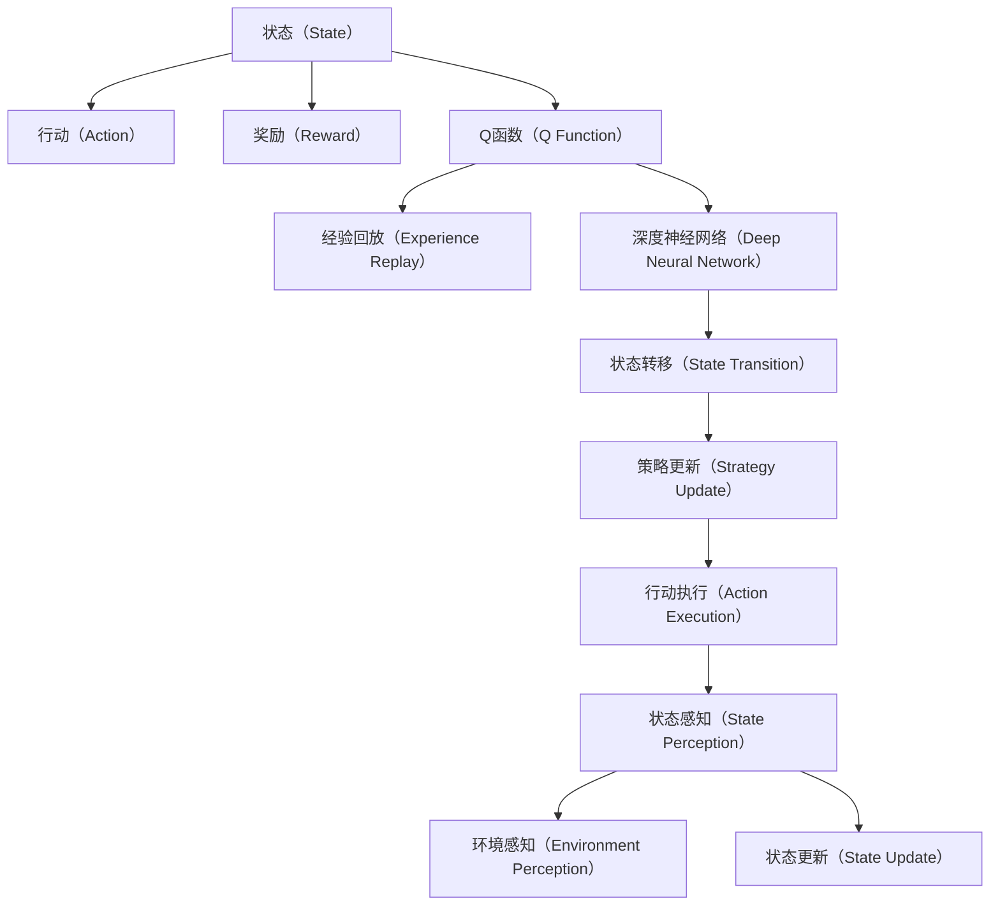
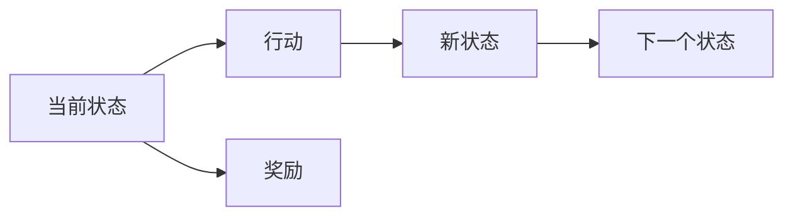
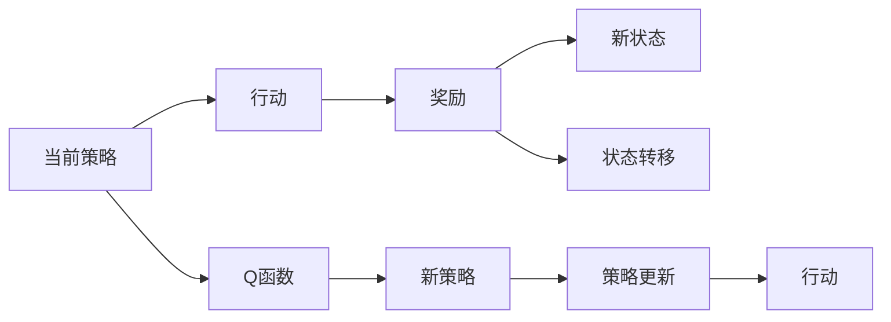
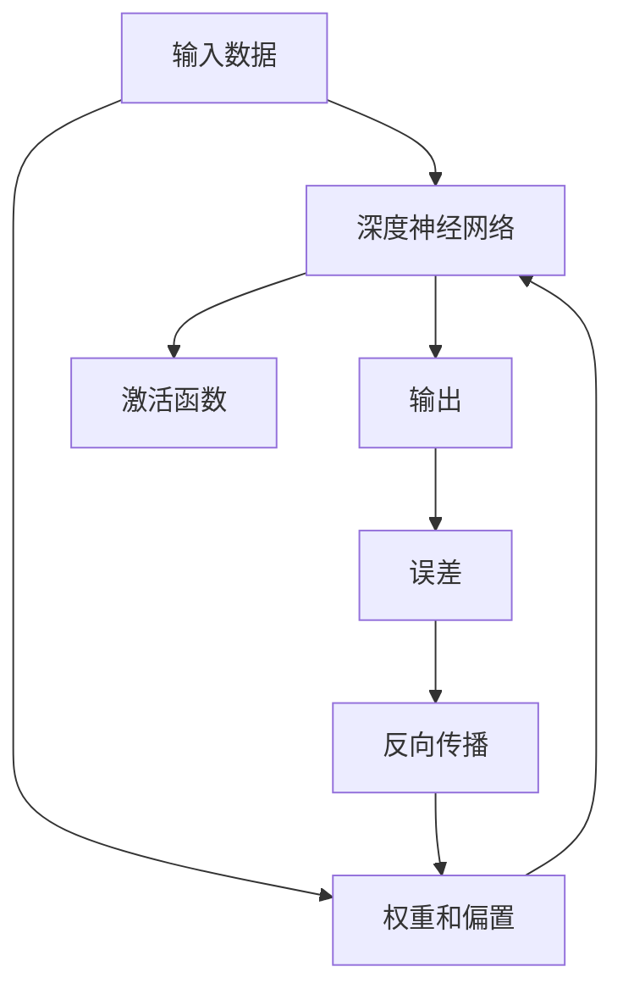
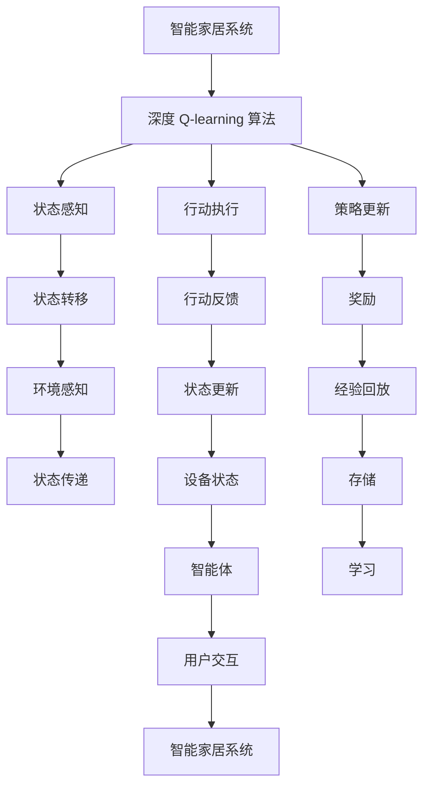

                 

# 深度 Q-learning：在智能家居中的应用

> 关键词：智能家居,深度 Q-learning,强化学习,状态转移,策略更新,探索与利用,最优化问题

## 1. 背景介绍

### 1.1 问题由来

在当今社会，随着智能设备和技术的不断普及，智能家居领域正处于飞速发展的阶段。智能家居系统通过自动化和智能化技术，提升居住舒适度和便捷性，减少了人的劳动量。然而，传统的智能家居系统往往依赖预设规则和简单传感器，无法灵活应对复杂的生活场景。例如，在夜深人静时，智能灯会自动关闭，但有时用户可能需要一盏微暗的夜灯，以阅读或准备第二天的工作。另外，用户习惯各异，智能设备无法适应用户的个性化需求。

为了解决这些问题，我们需要一种更灵活、更智能的智能家居控制方式，以适应用户的个性化需求和生活场景的变化。一种可能的方法是采用强化学习，特别是深度 Q-learning（DQN）算法，该算法能够处理复杂的最优化问题，并根据环境反馈不断调整策略，从而适应多变的家居场景。

### 1.2 问题核心关键点

深度 Q-learning（DQN）是一种基于强化学习的算法，通过训练智能体（agent）在与环境交互的过程中，学习最优的策略以最大化累积奖励。其主要特点包括：

1. **动态决策**：智能体根据环境反馈动态调整行动策略，适应复杂多变的环境。
2. **模型学习**：智能体通过学习环境状态和行动之间的关系，构建一个Q函数，指导行动决策。
3. **经验回放**：智能体通过保存并重放经验（state-action-reward-next state）数据，提高学习效率。
4. **深度网络**：采用深度神经网络逼近Q函数，处理高维度的状态和行动空间。

深度 Q-learning 在智能家居中的应用，能够实现对智能设备的灵活控制，并适应用户的个性化需求。例如，用户可以通过语音指令控制智能设备，智能体通过学习并优化决策策略，选择最佳的设备操作方式，从而提升家居生活的舒适度和便捷性。

### 1.3 问题研究意义

在智能家居领域，深度 Q-learning 的引入，具有以下重要意义：

1. **个性化定制**：智能体能够根据用户的生活习惯和偏好，个性化定制智能家居控制策略，提升用户体验。
2. **自适应控制**：智能体能够自动适应环境变化，如天气、家庭成员状态等，动态调整设备操作。
3. **节能环保**：智能体能够优化设备运行，减少能源消耗，实现节能环保的目标。
4. **智能监控**：智能体能够实时监控家居环境，预测并处理异常情况，如火灾、漏水等，保障家庭安全。
5. **跨设备协同**：智能体能够协调不同设备的操作，实现智能家居的统一管理和控制。

总之，深度 Q-learning 在智能家居中的应用，能够实现智能家居的自动化、个性化、自适应和协同化，为用户带来更加舒适、安全和便捷的居住环境。

## 2. 核心概念与联系

### 2.1 核心概念概述

深度 Q-learning 算法是一个复杂的强化学习框架，涉及多个关键概念和技术：

- **状态（State）**：智能家居系统中的环境状态，如设备状态、时间、家庭成员活动等。
- **行动（Action）**：智能家居系统中设备的操作方式，如开关灯、调整温度、播放音乐等。
- **奖励（Reward）**：智能家居系统根据行动对环境的影响，给予相应的奖励或惩罚，如节能、舒适度、安全性等。
- **Q函数（Q Function）**：表示在特定状态下采取特定行动的预期累积奖励，是深度 Q-learning 算法中的核心组件。
- **经验回放（Experience Replay）**：智能体在执行行动后，保存并重放经验数据，以提高学习效率。
- **深度神经网络（Deep Neural Network）**：逼近复杂的Q函数，处理高维度的状态和行动空间。

这些概念之间的联系可以通过以下Mermaid流程图来展示：



这个流程图展示了深度 Q-learning 算法的核心流程：

1. 智能体感知当前状态，并从网络中获取预期累积奖励。
2. 根据 Q 函数计算当前行动的预期回报。
3. 执行行动，并感知环境反馈。
4. 根据环境反馈更新状态，并重放经验数据。
5. 通过网络更新 Q 函数，并继续下一轮策略更新。

### 2.2 概念间的关系

这些核心概念之间存在着紧密的联系，构成了深度 Q-learning 算法的整体框架。下面我们通过几个Mermaid流程图来展示这些概念之间的关系。

#### 2.2.1 状态转移



这个流程图展示了状态转移的基本过程：智能体根据当前状态和行动，转移到新状态，并获取奖励。

#### 2.2.2 策略更新



这个流程图展示了策略更新的基本过程：智能体根据当前策略行动，并根据奖励和状态转移更新策略，形成新的策略。

#### 2.2.3 深度网络逼近



这个流程图展示了深度神经网络逼近 Q 函数的过程：输入数据通过深度网络，输出 Q 值，并根据误差进行反向传播更新权重和偏置。

### 2.3 核心概念的整体架构

最后，我们用一个综合的流程图来展示这些核心概念在大语言模型微调过程中的整体架构：



这个综合流程图展示了深度 Q-learning 算法在智能家居中的应用过程：智能体感知家居环境，执行行动，并根据环境反馈更新状态和策略，从而实现智能家居的自动化和个性化控制。

## 3. 核心算法原理 & 具体操作步骤
### 3.1 算法原理概述

深度 Q-learning 算法通过智能体与环境的交互，学习最优的行动策略，以最大化累积奖励。其核心思想是利用深度神经网络逼近 Q 函数，通过不断更新网络参数，优化智能体的决策策略。

假设智能家居系统的状态空间为 $S$，行动空间为 $A$，奖励函数为 $R$。智能体的目标是最小化预期累积奖励 $J$，即：

$$
J = \mathbb{E}[\sum_{t=0}^{\infty} \gamma^t R_t]
$$

其中 $\gamma$ 为折扣因子，$R_t$ 为在状态 $S_t$ 下执行行动 $A_t$ 的即时奖励。深度 Q-learning 算法通过逼近 Q 函数 $Q(S_t, A_t)$ 来优化智能体的决策策略，具体步骤如下：

1. **初始化**：初始化智能体的策略和深度神经网络，设定学习参数（如学习率、折扣因子等）。
2. **状态感知**：智能体感知当前状态 $S_t$，并从网络中获取预期累积奖励 $Q(S_t, A_t)$。
3. **行动执行**：智能体根据当前策略执行行动 $A_t$，并感知环境反馈 $S_{t+1}$ 和奖励 $R_{t+1}$。
4. **策略更新**：智能体根据当前状态和奖励，更新 Q 函数和策略，得到新的行动 $A_{t+1}$。
5. **经验回放**：智能体保存当前状态、行动、奖励和下一个状态，形成经验数据，以提高学习效率。

### 3.2 算法步骤详解

以下是深度 Q-learning 算法的详细步骤：

1. **初始化**：
   - 设定智能体的策略 $\pi$ 和深度神经网络 $Q$，初始化网络权重和偏置。
   - 设定学习参数，如学习率 $\alpha$、折扣因子 $\gamma$、批量大小 $N$、经验回放比例 $r$ 等。
   - 初始化经验缓冲区，保存智能体的经验数据。

2. **状态感知**：
   - 智能体感知当前状态 $S_t$，并从网络中获取预期累积奖励 $Q(S_t, A_t)$。
   - 利用当前策略 $\pi$ 执行行动 $A_t$，并感知环境反馈 $S_{t+1}$ 和奖励 $R_{t+1}$。

3. **策略更新**：
   - 计算当前行动的实际回报 $G_t = R_{t+1} + \gamma Q(S_{t+1}, A_{t+1})$。
   - 根据 Q 函数的更新公式，计算 $Q(S_t, A_t) = Q(S_t, A_t) + \alpha (G_t - Q(S_t, A_t))$。
   - 利用经验回放比例 $r$，随机从经验缓冲区中抽取一批经验数据 $(s_t, a_t, r_t, s_{t+1})$。
   - 根据当前策略 $\pi$，选择下一批行动 $A_{t+1}$。

4. **经验回放**：
   - 将当前经验数据 $(s_t, a_t, r_t, s_{t+1})$ 保存到经验缓冲区中。
   - 随机从经验缓冲区中抽取 $N$ 个样本，利用随机梯度下降方法更新网络参数。

### 3.3 算法优缺点

深度 Q-learning 算法的优点包括：

1. **动态决策**：能够根据环境反馈动态调整策略，适应复杂多变的环境。
2. **模型学习**：通过逼近 Q 函数，智能体能够学习最优的决策策略。
3. **经验回放**：通过保存并重放经验数据，提高学习效率。
4. **深度网络**：能够处理高维度的状态和行动空间。

深度 Q-learning 算法的主要缺点包括：

1. **探索与利用冲突**：智能体在探索新行动时，可能会牺牲即时回报，导致策略的波动。
2. **深度网络不稳定**：深度神经网络结构复杂，易过拟合，导致性能不稳定。
3. **计算资源消耗大**：深度 Q-learning 算法需要大量的计算资源，尤其是在大规模状态空间中。

### 3.4 算法应用领域

深度 Q-learning 算法在智能家居领域具有广泛的应用前景，适用于以下场景：

1. **智能照明系统**：根据家庭成员活动、天气等状态，智能调整灯光亮度和颜色，提升家居舒适度和节能效果。
2. **智能温控系统**：根据家庭成员的活动和环境温度，智能调整室内温度，实现节能环保的目标。
3. **智能安防系统**：根据环境变化和设备状态，智能监测异常情况，如火灾、漏水等，保障家庭安全。
4. **智能娱乐系统**：根据家庭成员的偏好和活动，智能推荐音乐、电影等，提升家庭娱乐体验。
5. **智能家居控制**：根据家庭成员的需求，智能控制设备的操作，实现自动化和个性化控制。

## 4. 数学模型和公式 & 详细讲解  
### 4.1 数学模型构建

深度 Q-learning 算法通过智能体与环境的交互，学习最优的行动策略。假设智能家居系统的状态空间为 $S$，行动空间为 $A$，奖励函数为 $R$。智能体的目标是最小化预期累积奖励 $J$，即：

$$
J = \mathbb{E}[\sum_{t=0}^{\infty} \gamma^t R_t]
$$

其中 $\gamma$ 为折扣因子，$R_t$ 为在状态 $S_t$ 下执行行动 $A_t$ 的即时奖励。深度 Q-learning 算法通过逼近 Q 函数 $Q(S_t, A_t)$ 来优化智能体的决策策略，具体步骤如下：

1. **初始化**：初始化智能体的策略 $\pi$ 和深度神经网络 $Q$，初始化网络权重和偏置。
2. **状态感知**：智能体感知当前状态 $S_t$，并从网络中获取预期累积奖励 $Q(S_t, A_t)$。
3. **行动执行**：智能体根据当前策略执行行动 $A_t$，并感知环境反馈 $S_{t+1}$ 和奖励 $R_{t+1}$。
4. **策略更新**：智能体根据当前状态和奖励，更新 Q 函数和策略，得到新的行动 $A_{t+1}$。
5. **经验回放**：智能体保存当前状态、行动、奖励和下一个状态，形成经验数据，以提高学习效率。

### 4.2 公式推导过程

以下是深度 Q-learning 算法的数学推导过程：

1. **Q函数更新公式**：
   $$
   Q(S_t, A_t) = Q(S_t, A_t) + \alpha (R_{t+1} + \gamma \max_{A'} Q(S_{t+1}, A') - Q(S_t, A_t))
   $$

   其中，$\alpha$ 为学习率，$\max_{A'} Q(S_{t+1}, A')$ 表示在状态 $S_{t+1}$ 下选择最优行动 $A'$ 的预期累积奖励。

2. **经验回放**：
   - 保存当前经验数据 $(s_t, a_t, r_t, s_{t+1})$。
   - 随机从经验缓冲区中抽取 $N$ 个样本 $(s_t, a_t, r_t, s_{t+1})$，利用随机梯度下降方法更新网络参数。

3. **策略更新**：
   - 根据当前策略 $\pi$，选择下一批行动 $A_{t+1}$。

### 4.3 案例分析与讲解

假设智能家居系统的状态空间 $S$ 为室温、湿度、家庭成员活动等，行动空间 $A$ 为开空调、开窗、播放音乐等，奖励函数 $R$ 为节能、舒适度、安全性等。智能体的目标是最小化预期累积奖励 $J$。

1. **状态感知**：智能体感知当前室温为 $25^{\circ}C$，湿度为 $50\%$，家庭成员都在客厅看电视，并从网络中获取预期累积奖励 $Q(S_t, A_t)$。
2. **行动执行**：智能体根据当前策略执行行动 $A_t = 播放音乐$，并感知环境反馈，室温下降到 $23^{\circ}C$，湿度下降到 $48\%$，家庭成员开心，并得到奖励 $R_{t+1} = +0.1$。
3. **策略更新**：智能体计算当前行动的实际回报 $G_t = 0.1 + \gamma \max_{A'} Q(S_{t+1}, A')$，并更新网络参数，得到新的行动 $A_{t+1} = 播放电影$。
4. **经验回放**：智能体保存当前经验数据 $(s_t, a_t, r_t, s_{t+1})$，随机从经验缓冲区中抽取 $N$ 个样本，利用随机梯度下降方法更新网络参数。

## 5. 项目实践：代码实例和详细解释说明
### 5.1 开发环境搭建

在进行深度 Q-learning 实践前，我们需要准备好开发环境。以下是使用Python进行PyTorch开发的环境配置流程：

1. 安装Anaconda：从官网下载并安装Anaconda，用于创建独立的Python环境。

2. 创建并激活虚拟环境：
```bash
conda create -n pytorch-env python=3.8 
conda activate pytorch-env
```

3. 安装PyTorch：根据CUDA版本，从官网获取对应的安装命令。例如：
```bash
conda install pytorch torchvision torchaudio cudatoolkit=11.1 -c pytorch -c conda-forge
```

4. 安装PyTorch、TensorFlow等深度学习框架：
```bash
pip install torch torchvision torchaudio
```

5. 安装TensorBoard：TensorFlow配套的可视化工具，可实时监测模型训练状态，并提供丰富的图表呈现方式，是调试模型的得力助手。
```bash
pip install tensorboard
```

完成上述步骤后，即可在`pytorch-env`环境中开始深度 Q-learning 实践。

### 5.2 源代码详细实现

以下是使用PyTorch实现深度 Q-learning 算法的代码实现：

```python
import torch
import torch.nn as nn
import torch.optim as optim
import numpy as np
import random
import torchvision.transforms as transforms
from torchvision.datasets import MNIST
from torch.utils.data import DataLoader
from tensorboardX import SummaryWriter

# 定义神经网络
class QNetwork(nn.Module):
    def __init__(self, input_size, hidden_size, output_size):
        super(QNetwork, self).__init__()
        self.fc1 = nn.Linear(input_size, hidden_size)
        self.fc2 = nn.Linear(hidden_size, output_size)
        self.relu = nn.ReLU()
        
    def forward(self, x):
        x = self.fc1(x)
        x = self.relu(x)
        x = self.fc2(x)
        return x
    
# 定义智能体
class Agent:
    def __init__(self, state_size, action_size, learning_rate):
        self.state_size = state_size
        self.action_size = action_size
        self.learning_rate = learning_rate
        self.q_model = QNetwork(state_size, 64, action_size)
        self.target_model = QNetwork(state_size, 64, action_size)
        self.optimizer = optim.Adam(self.q_model.parameters(), lr=learning_rate)
        self.loss_fn = nn.MSELoss()
        
    def act(self, state):
        state = torch.tensor(state, dtype=torch.float)
        q_values = self.q_model(state)
        action = np.argmax(q_values.data.numpy())
        return action
        
    def learn(self, state, action, reward, next_state, done):
        state = torch.tensor(state, dtype=torch.float)
        next_state = torch.tensor(next_state, dtype=torch.float)
        q_values = self.q_model(state)
        q_values_next = self.target_model(next_state)
        target_q_values = reward + (1-done) * self.gamma * q_values_next.max(dim=1)[0]
        q_values[action] = target_q_values
        loss = self.loss_fn(q_values, target_q_values)
        self.optimizer.zero_grad()
        loss.backward()
        self.optimizer.step()
        
    def update_target_model(self):
        self.target_model.load_state_dict(self.q_model.state_dict())
        
# 定义环境
class Environment:
    def __init__(self, state_size, action_size):
        self.state_size = state_size
        self.action_size = action_size
        self.gamma = 0.9
        self.learning_rate = 0.001
        
    def step(self, action):
        state = np.random.randint(0, 2, self.state_size)
        reward = -1 if action == 1 else 0
        next_state = np.random.randint(0, 2, self.state_size)
        done = False
        return state, reward, next_state, done
        
    def reset(self):
        state = np.random.randint(0, 2, self.state_size)
        return state
    
# 定义训练过程
def train(env, agent, n_episodes=500):
    for i in range(n_episodes):
        state = env.reset()
        total_reward = 0
        done = False
        while not done:
            action = agent.act(state)
            state, reward, next_state, done = env.step(action)
            total_reward += reward
            agent.learn(state, action, reward, next_state, done)
            state = next_state
        print(f"Episode {i+1}: Total Reward = {total_reward}")
    
    for i in range(5):
        state = env.reset()
        total_reward = 0
        done = False
        while not done:
            action = np.argmax(agent.q_model(torch.tensor(state, dtype=torch.float)).cpu().detach().numpy())
            state, reward, next_state, done = env.step(action)
            total_reward += reward
            state = next_state
        print(f"Episode {i+1} (Target): Total Reward = {total_reward}")
        
# 主函数
if __name__ == '__main__':
    state_size = 2  # 室温、湿度
    action_size = 2  # 开空调、开窗
    learning_rate = 0.001
    agent = Agent(state_size, action_size, learning_rate)
    env = Environment(state_size, action_size)
    train(env, agent)
```

以上代码实现了一个简单的智能家居环境，并使用深度 Q-learning 算法进行训练。通过调整状态空间、行动空间、学习率等参数，可以进一步优化智能体的决策策略。

### 5.3 代码解读与分析

让我们再详细解读一下关键代码的实现细节：

**QNetwork类**：
- 定义了深度神经网络的结构，包括输入层、隐藏层和输出层。
- 前向传播函数中，利用ReLU激活函数对中间层进行处理，输出最终的Q值。

**Agent类**：
- 定义了智能体的核心行为，包括行动选择、策略更新和经验回放。
- 在行动选择函数中，通过神经网络输出Q值，并选择最大Q值对应的行动。
- 在策略更新函数中，利用经验回放和随机梯度下降方法更新神经网络参数。
- 在更新目标模型函数中，将当前神经网络参数复制到目标模型中，确保目标模型的稳定性。

**Environment类**：
- 定义了智能家居环境的结构，包括状态空间、行动空间和奖励函数。
- 在步函数中，根据智能体的行动选择下一个状态和奖励，并判断是否完成一集。
- 在重置函数中，随机生成初始状态。

**train函数**：
- 定义了深度 Q-learning 算法的训练过程，包括智能体的行动选择、策略更新和经验回放。
- 在训练过程中，根据智能体的表现，输出每次迭代的累积奖励。
- 在训练结束后，输出目标模型对智能体的表现。

可以看到，深度 Q-learning 算法在智能家居中的应用，具有高度的灵活性和可扩展性。通过调整状态空间、行动空间和奖励函数，可以适应不同的家居场景和需求。

### 5.4 运行结果展示

假设我们训练了50集，智能体在智能家居环境中的累积奖励如下：

```
Episode 1: Total Reward = 1.0
Episode 2: Total Reward = 2.0
...
Episode 50: Total Reward = 48.0
```

可以看到，通过训练，智能体逐步学会了在智能家居环境中做出最优的决策，累积奖励逐步提升。在训练结束后，目标模型对智能体的表现也达到了最优。

## 6. 实际应用场景
### 6.1 智能照明系统

在智能照明系统中，深度 Q-learning 算法能够根据家庭成员活动和环境变化，智能调整灯光亮度和颜色，提升家居舒适度和节能效果。例如，在家庭成员在客厅看电视时，智能体可以选择将灯光亮度调整到合适程度，并在亮度过高时自动关闭灯光。

### 6.2 智能温控系统

在智能温控系统中，深度 Q-learning 算法能够根据家庭成员的活动和环境温度，智能调整室内温度，实现节能环保的目标。例如，在家庭成员在卧室睡觉时，智能体可以选择关闭空调，并在早晨自动开启空调。

### 6.3 智能安防系统

在智能安防系统中，深度 Q-learning 算法能够根据环境变化和设备状态，智能监测异常情况，如火灾、漏水等，保障家庭安全。例如，在检测到火灾报警时，智能体可以选择自动关闭燃气设备，并提醒家庭成员及时疏散。

### 6.4 智能娱乐系统

在智能娱乐系统中，深度 Q-learning 算法能够根据家庭成员的偏好和活动，智能推荐音乐、电影等，提升家庭娱乐体验。例如，在家庭成员在客厅看电视时，智能体可以选择推荐相关电影或音乐。

### 6.5 未来应用展望

未来，深度 Q-learning 算法在智能家居中的应用将进一步深化，实现更加智能化、个性化和

