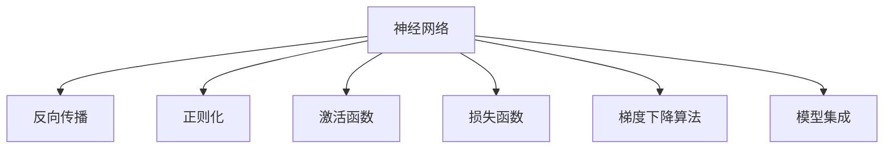

                 

## 1. 背景介绍

### 1.1 问题由来
随着深度学习技术的快速发展，深度神经网络(DNN)成为人工智能领域的重要研究对象。它不仅在计算机视觉、自然语言处理、语音识别等任务上取得了突破性进展，还被应用于推荐系统、金融分析、医疗诊断等多个垂直领域。深度学习的应用不仅推动了这些领域的创新，还为人类生产生活方式带来了深刻变革。

然而，深度学习模型的设计、调参、训练过程复杂，模型解释性较差，这限制了其在一些关键领域（如金融、医疗等）的应用。为了应对这些问题，深度学习的原理和代码实例讲解变得尤为重要，不仅有助于深入理解深度学习技术的核心思想，还能帮助开发者更好地解决实际问题。

### 1.2 问题核心关键点
深度学习原理和代码实例讲解的核心在于：
- 帮助读者理解深度学习模型的原理和架构，从而能更有效地进行模型设计和调参。
- 通过代码实例，展示深度学习模型在不同应用场景中的实现方式，帮助读者掌握实际应用技巧。
- 深入分析深度学习模型的优缺点，提出有效的改进策略。
- 梳理深度学习模型在多个领域的实际应用场景，展示其广泛的应用前景。

### 1.3 问题研究意义
对深度学习原理和代码实例进行讲解，具有重要的理论价值和实际应用意义：
1. 提升深度学习模型设计的科学性。理解深度学习模型的原理，有助于选择合适的模型结构和参数配置，从而减少实验时间和成本。
2. 增强深度学习技术的实际应用能力。掌握深度学习模型的代码实现，能够更灵活地处理实际问题，提高应用效果。
3. 培养深度学习领域的研究和开发能力。深度学习涉及大量数学、编程知识，系统学习相关原理和实例，有助于提升技术水平。
4. 推动深度学习技术在更多领域的应用。深度学习在医疗、金融等关键领域具有巨大潜力，通过原理讲解和代码实例，可以加速其在这些领域的落地。

## 2. 核心概念与联系

### 2.1 核心概念概述
深度学习涉及多个核心概念，主要包括：

- **神经网络**：模拟人脑神经元结构，由多个层次的神经元（或称为节点）组成，用于处理输入数据和输出预测。
- **反向传播**：利用链式法则计算误差梯度，用于更新神经网络参数。
- **正则化**：通过L1正则、L2正则、Dropout等方法，避免模型过拟合。
- **激活函数**：如ReLU、Sigmoid等，用于增加神经元的非线性特性。
- **损失函数**：如均方误差、交叉熵等，用于衡量模型预测与真实标签之间的差异。
- **梯度下降算法**：如SGD、Adam等，用于最小化损失函数，更新模型参数。
- **模型集成**：如Bagging、Boosting、Stacking等，用于提高模型的稳定性和泛化能力。

这些核心概念之间的逻辑关系可以通过以下Mermaid流程图来展示：



这个流程图展示了大深度学习模型主要组成部分及其相互关系：神经网络作为核心，通过反向传播算法更新参数，避免过拟合的正则化技术，增强非线性的激活函数，衡量误差大小的损失函数，用于优化模型参数的梯度下降算法，以及提升模型性能的集成技术。

### 2.2 概念间的关系
这些核心概念之间存在密切联系，共同构成深度学习模型的完整生态系统。

- **神经网络**：是深度学习的核心，由多个层次的神经元构成，用于数据处理和特征提取。
- **反向传播**：通过计算误差梯度，反向更新神经网络参数，实现模型的训练和优化。
- **正则化**：通过引入正则化项，控制模型的复杂度，避免过拟合。
- **激活函数**：增强神经元非线性特性，使得神经网络能够学习更复杂的特征表示。
- **损失函数**：衡量模型预测与真实标签之间的差异，指导模型优化。
- **梯度下降算法**：通过优化算法最小化损失函数，更新模型参数，使模型不断逼近最优解。
- **模型集成**：通过集成多个模型的预测结果，提高模型的稳定性和泛化能力。

## 3. 核心算法原理 & 具体操作步骤
### 3.1 算法原理概述
深度学习模型的训练过程主要包括前向传播和反向传播两个步骤。下面详细介绍这两个步骤的原理和具体操作步骤。

### 3.2 算法步骤详解

**前向传播**：
1. 输入数据经过第一层神经元，通过激活函数计算输出。
2. 输出传递到下一层神经元，重复计算过程，直到输出预测结果。
3. 将预测结果与真实标签比较，计算误差。

**反向传播**：
1. 从输出层开始，计算误差对每个神经元的梯度，通过链式法则传递。
2. 更新每个神经元的参数，使得误差最小化。
3. 重复前向传播和反向传播过程，直到收敛。

### 3.3 算法优缺点
深度学习模型具有以下优点：
- 强大的特征提取能力，能够自动学习数据中的复杂结构。
- 广泛的应用领域，包括计算机视觉、自然语言处理、语音识别等。
- 在大型数据集上表现优异，能够处理大规模数据。

然而，深度学习模型也存在以下缺点：
- 模型设计复杂，需要大量实验和调参。
- 训练过程耗时耗资，需要高性能计算资源。
- 模型解释性较差，难以解释模型的决策过程。
- 存在过拟合的风险，需要正则化等技术控制。

### 3.4 算法应用领域

深度学习模型在多个领域都有广泛应用，如：

- **计算机视觉**：用于图像识别、目标检测、图像生成等任务。
- **自然语言处理**：用于文本分类、情感分析、机器翻译等任务。
- **语音识别**：用于语音识别、语音合成等任务。
- **推荐系统**：用于个性化推荐、广告推荐等任务。
- **金融分析**：用于风险评估、股票预测等任务。
- **医疗诊断**：用于医学影像分析、疾病预测等任务。

## 4. 数学模型和公式 & 详细讲解
### 4.1 数学模型构建

一个典型的深度学习模型可以表示为：

$$
y = M(x; \theta)
$$

其中 $x$ 为输入数据，$\theta$ 为模型参数，$y$ 为模型输出。以单层神经网络为例，其数学模型构建如下：

$$
y_i = \sigma(w_i^T x + b_i)
$$

其中 $w_i$ 为权重，$b_i$ 为偏置，$\sigma$ 为激活函数，$x_i$ 为第 $i$ 个神经元的输入。

### 4.2 公式推导过程

以单层神经网络为例，其训练过程如下：

1. **前向传播**：

$$
y_i = \sigma(w_i^T x + b_i)
$$

2. **计算误差**：

$$
J = \frac{1}{N} \sum_{i=1}^N \frac{1}{2}(y_i - \hat{y}_i)^2
$$

3. **反向传播**：

$$
\frac{\partial J}{\partial w_i} = \frac{\partial y_i}{\partial w_i} \cdot \frac{\partial y_i}{\partial x} \cdot \frac{\partial J}{\partial x}
$$

4. **更新参数**：

$$
w_i \leftarrow w_i - \eta \cdot \frac{\partial J}{\partial w_i}
$$

其中 $\eta$ 为学习率。

### 4.3 案例分析与讲解

假设我们有一个简单的三层神经网络，用于图像分类任务。其数学模型如下：

$$
y = \sigma_1(\sigma_2(\sigma_3(x; w_3)w_2)w_1)
$$

其中 $\sigma_3$ 为第一层激活函数，$\sigma_2$ 为第二层激活函数，$\sigma_1$ 为输出层激活函数。

我们采用反向传播算法进行训练。首先，定义损失函数：

$$
J = \frac{1}{N} \sum_{i=1}^N \log(\frac{e^{y_i}}{\sum_j e^{y_j}})
$$

然后，进行前向传播和反向传播计算误差梯度：

$$
\frac{\partial J}{\partial w_1} = \frac{\partial y}{\partial w_1} \cdot \frac{\partial J}{\partial x}
$$

通过以上步骤，可以不断更新模型参数，最小化损失函数，从而得到理想的学习结果。

## 5. 项目实践：代码实例和详细解释说明
### 5.1 开发环境搭建

在搭建深度学习开发环境时，需要考虑以下几个方面：

- **Python环境**：选择Python 3.6及以上版本，安装必要的科学计算库。
- **深度学习框架**：选择TensorFlow、PyTorch、Keras等深度学习框架。
- **GPU支持**：安装CUDA工具包，安装对应版本的TensorFlow-GPU或PyTorch-GPU。
- **数据预处理**：准备数据集，进行数据增强、数据归一化等预处理操作。

### 5.2 源代码详细实现

下面以TensorFlow框架为例，给出深度学习模型的代码实现。

首先，定义模型结构：

```python
import tensorflow as tf

model = tf.keras.Sequential([
    tf.keras.layers.Dense(64, activation='relu'),
    tf.keras.layers.Dense(32, activation='relu'),
    tf.keras.layers.Dense(10, activation='softmax')
])
```

然后，编译模型：

```python
model.compile(optimizer=tf.keras.optimizers.Adam(learning_rate=0.001),
              loss='categorical_crossentropy',
              metrics=['accuracy'])
```

接下来，训练模型：

```python
model.fit(train_data, train_labels, epochs=10, batch_size=32)
```

最后，评估模型：

```python
test_loss, test_acc = model.evaluate(test_data, test_labels)
print('Test accuracy:', test_acc)
```

### 5.3 代码解读与分析

- **Sequential模型**：通过`Sequential`类定义模型结构。
- **Dense层**：通过`Dense`层定义全连接层。
- **激活函数**：通过`activation`参数设置激活函数。
- **优化器**：通过`optimizer`参数设置优化器。
- **损失函数**：通过`loss`参数设置损失函数。
- **评估指标**：通过`metrics`参数设置评估指标。

## 6. 实际应用场景
### 6.1 智能推荐系统

智能推荐系统是深度学习的重要应用领域之一。通过深度学习模型，可以处理大量用户行为数据，挖掘用户的兴趣和偏好，实现个性化推荐。

例如，使用深度学习模型对用户浏览历史、点击记录进行分析，预测用户可能感兴趣的商品，从而提高用户满意度，增加销售额。

### 6.2 自然语言处理

自然语言处理（NLP）是深度学习的重要应用方向。通过深度学习模型，可以实现文本分类、情感分析、机器翻译等任务。

例如，使用深度学习模型对用户评论进行分析，识别产品的好评和差评，从而进行产品改进和优化。

### 6.3 医疗诊断

深度学习在医疗领域也有广泛应用。通过深度学习模型，可以对医学影像进行自动分析和诊断。

例如，使用深度学习模型对医学影像进行分析，识别出肿瘤、病变等异常区域，从而辅助医生进行诊断。

## 7. 工具和资源推荐
### 7.1 学习资源推荐

为了帮助开发者深入理解深度学习技术，以下是一些优质的学习资源：

- **深度学习课程**：如斯坦福大学的CS231n、吴恩达的深度学习课程等，深入讲解深度学习的原理和应用。
- **书籍**：如《深度学习》（Goodfellow等著）、《神经网络与深度学习》（Michael Nielsen著）等，系统介绍深度学习的数学基础和实践技巧。
- **博客**：如李沐、Kaiming He等知名深度学习专家博客，分享最新的研究成果和实践经验。
- **在线课程**：如Coursera、Udacity等平台提供深度学习课程，涵盖从入门到高级的各类主题。

### 7.2 开发工具推荐

为了提高深度学习的开发效率，以下是一些常用的开发工具：

- **Python环境**：选择Anaconda、Virtualenv等工具搭建Python环境。
- **深度学习框架**：选择TensorFlow、PyTorch、Keras等深度学习框架。
- **数据可视化工具**：选择Matplotlib、Seaborn等工具可视化模型训练过程和结果。
- **数据增强工具**：选择ImageDataGenerator、TextDataGenerator等工具实现数据增强。
- **模型集成工具**：选择Scikit-learn、XGBoost等工具实现模型集成。

### 7.3 相关论文推荐

深度学习领域的研究发展迅速，以下是一些值得关注的论文：

- **ResNet论文**：提出残差网络（Residual Network），解决深度神经网络训练过程中梯度消失的问题。
- **Attention Mechanism论文**：提出注意力机制（Attention Mechanism），提升深度学习模型在序列数据上的表现。
- **GAN论文**：提出生成对抗网络（Generative Adversarial Network），用于生成新数据和图像。
- **BERT论文**：提出BERT模型，在自然语言处理任务上取得突破性进展。
- **Transformer论文**：提出Transformer模型，显著提升自然语言处理任务的效果。

## 8. 总结：未来发展趋势与挑战
### 8.1 总结

本文对深度学习原理和代码实例进行了详细讲解，帮助读者深入理解深度学习模型的设计、训练和应用。首先，介绍了深度学习模型的核心概念和架构，并通过Mermaid流程图展示了各个概念之间的联系。其次，从原理和代码实例两个方面，详细讲解了深度学习模型的训练过程。最后，梳理了深度学习模型在多个领域的实际应用场景，展示了其广泛的应用前景。

通过本文的系统讲解，读者可以全面掌握深度学习技术的核心思想，并能够灵活应用于实际问题。未来，深度学习技术将在更多领域大放异彩，带来颠覆性变革。

### 8.2 未来发展趋势

深度学习技术的发展趋势包括：

- **模型规模**：随着硬件性能的提升和数据量的增加，深度学习模型的规模将不断扩大，能够处理更复杂的数据和任务。
- **应用场景**：深度学习模型将在更多领域得到应用，如医疗、金融、教育等。
- **模型优化**：通过模型压缩、参数共享等技术，提升深度学习模型的计算效率和资源利用率。
- **模型集成**：通过模型集成技术，提升深度学习模型的泛化能力和稳定性。
- **模型解释**：通过可解释性模型（如LIME、SHAP等），增强深度学习模型的可解释性和可理解性。

### 8.3 面临的挑战

尽管深度学习技术取得了显著进展，但仍然面临一些挑战：

- **计算资源**：深度学习模型的训练和推理需要大量计算资源，成本较高。
- **数据需求**：深度学习模型需要大量的标注数据，获取高质量数据成本较高。
- **模型解释**：深度学习模型通常是黑盒模型，难以解释模型的决策过程。
- **模型过拟合**：深度学习模型容易过拟合，需要正则化等技术控制。
- **模型鲁棒性**：深度学习模型对输入数据的扰动较为敏感，需要增强模型的鲁棒性。

### 8.4 研究展望

未来的研究方向包括：

- **模型优化**：通过模型压缩、参数共享等技术，提升深度学习模型的计算效率和资源利用率。
- **模型解释**：通过可解释性模型（如LIME、SHAP等），增强深度学习模型的可解释性和可理解性。
- **模型集成**：通过模型集成技术，提升深度学习模型的泛化能力和稳定性。
- **模型优化**：通过模型优化算法，提升深度学习模型的训练效率和效果。

## 9. 附录：常见问题与解答

**Q1：深度学习模型和传统机器学习模型有何不同？**

A: 深度学习模型与传统机器学习模型的主要区别在于模型结构的复杂度和训练方法的不同。深度学习模型通常采用多层神经网络，通过反向传播算法进行训练，能够自动学习数据的复杂结构。而传统机器学习模型通常采用线性模型或决策树等简单模型，通过手工特征工程进行训练，无法自动学习数据中的复杂结构。

**Q2：深度学习模型容易出现过拟合，如何避免？**

A: 深度学习模型容易出现过拟合的问题，常见的方法包括：
- **正则化**：通过L1正则、L2正则、Dropout等方法，控制模型的复杂度。
- **数据增强**：通过回译、近义替换等方式扩充训练集，增加数据多样性。
- **早停法**：在验证集上监测模型性能，当模型性能不再提升时停止训练，防止过拟合。
- **批量归一化**：通过批量归一化技术，加速模型收敛，降低过拟合风险。

**Q3：深度学习模型在实际应用中如何调优？**

A: 深度学习模型在实际应用中需要进行调优，以提高模型的性能和稳定性。常见的方法包括：
- **超参数调整**：通过网格搜索、随机搜索等方法，寻找最优的超参数组合。
- **学习率调整**：通过学习率调度策略，如学习率衰减、学习率增益等，控制模型训练过程。
- **模型集成**：通过集成多个模型的预测结果，提高模型的泛化能力和稳定性。
- **模型优化**：通过优化算法，如Adam、SGD等，提升模型的训练效率和效果。

**Q4：深度学习模型在医疗领域的应用前景如何？**

A: 深度学习模型在医疗领域具有广泛的应用前景，如医学影像分析、疾病预测、个性化治疗等。通过深度学习模型，可以对医学影像进行自动分析和诊断，提高医疗诊断的效率和准确性。同时，通过深度学习模型，可以挖掘患者的基因信息、生活习惯等数据，进行个性化治疗，提升治疗效果。

**Q5：深度学习模型在推荐系统中的应用如何？**

A: 深度学习模型在推荐系统中具有广泛的应用前景，如个性化推荐、广告推荐等。通过深度学习模型，可以处理大量用户行为数据，挖掘用户的兴趣和偏好，实现个性化推荐。同时，通过深度学习模型，可以实现实时推荐，提高用户体验和满意度。

---

作者：禅与计算机程序设计艺术 / Zen and the Art of Computer Programming

