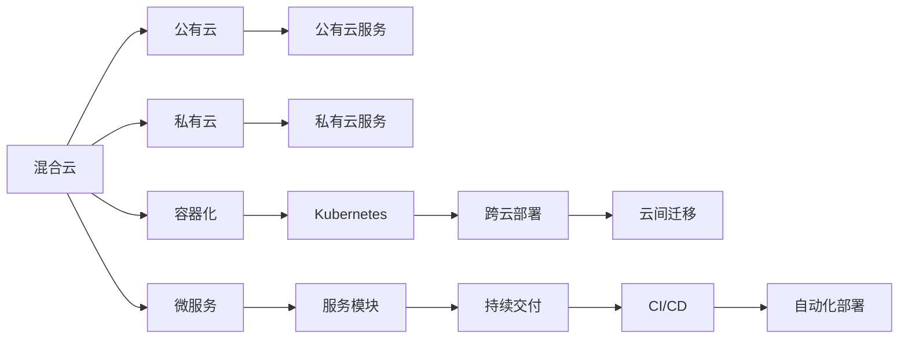

                 

# 混合云与多云部署原理与代码实战案例讲解

> 关键词：混合云, 多云部署, 云计算架构, 自动化管理, 容器化, 微服务, 持续交付

## 1. 背景介绍

在当今数字化时代，企业的IT基础设施逐渐从单一的本地部署转向混合云与多云的分布式环境。混合云（Hybrid Cloud）是指将本地数据中心与一个或多个公有云提供商（如AWS、Azure、Google Cloud等）结合使用，以便能够在不同环境之间灵活切换。多云（Multi-Cloud）是指使用多个云提供商的服务，以满足特定的业务需求和成本目标。

混合云与多云部署为企业提供了更灵活、更高效的资源管理和应用部署能力。然而，这种分布式架构也带来了新的挑战，如服务管理复杂性增加、数据一致性难以保证、资源调配优化难度加大等问题。

针对这些挑战，本文将详细讲解混合云与多云部署的原理，并通过一系列代码实战案例，展示如何在实际项目中实现高效、安全的云环境部署和自动化管理。

## 2. 核心概念与联系

### 2.1 核心概念概述

本节将介绍混合云与多云部署中的核心概念，并通过Mermaid流程图展示它们之间的联系。

#### 2.1.1 混合云
混合云是指企业同时使用本地私有云和公有云的云服务。企业在私有云中处理敏感数据和关键业务，同时利用公有云提供弹性计算和存储资源，以应对业务波动和扩展需求。

#### 2.1.2 多云
多云是指企业同时使用多个云提供商的云服务，以实现更广泛的服务选择、成本优化和故障转移。多云环境中的服务可以实现跨云的互操作性，使企业能够根据不同的业务需求和预算，选择最合适的云服务提供商。

#### 2.1.3 容器化
容器化是将应用程序及其依赖打包在可移植、可复制的容器中的技术。容器化技术如Docker和Kubernetes提供了跨云和跨环境的部署和管理能力，使应用程序能够在不同云环境之间无缝迁移。

#### 2.1.4 微服务
微服务是一种架构模式，将应用程序拆分为一组独立的小服务，每个服务负责特定的功能模块。微服务架构提高了系统的灵活性、可扩展性和可维护性，使得开发和部署更加高效。

#### 2.1.5 持续交付
持续交付是一种软件开发实践，通过自动化测试、构建、部署和监控，实现快速、可靠的软件发布。持续交付可以缩短软件发布周期，降低风险，提高开发效率。

这些概念之间的联系可以通过以下Mermaid流程图来展示：



这个流程图展示了混合云与多云部署的基本架构和关键技术。企业通过混合云连接私有云和公有云，在公有云和私有云中分别部署不同的服务，并通过容器化和微服务技术实现跨云和跨环境的部署和管理。持续交付实践则通过自动化手段，加速软件发布，确保软件质量和可靠性。

### 2.2 概念间的关系

这些核心概念之间存在着紧密的联系，形成了混合云与多云部署的完整生态系统。下面是这些概念之间的具体关系：

1. 混合云与多云部署是实现容器化和微服务的基础。通过混合云与多云环境，企业可以在不同云提供商之间灵活部署和管理微服务。
2. 容器化与微服务技术提升了混合云与多云部署的灵活性和可扩展性。通过容器化，企业可以将应用程序及其依赖打包在独立的容器中，跨云迁移时只需复制这些容器。
3. 持续交付实践保障了混合云与多云部署的效率和可靠性。通过持续交付，企业可以自动化地进行测试、构建和部署，确保软件发布的质量和速度。
4. 容器化和微服务技术为持续交付提供了技术基础。容器化和微服务技术使得软件组件能够独立部署和更新，大大简化了持续交付的流程。
5. 混合云与多云部署与企业IT架构变革紧密相关。混合云与多云部署是云计算架构的一部分，支持企业从集中式IT向分布式IT的转变。

这些概念共同构成了混合云与多云部署的完整生态系统，为企业提供了灵活、高效、可靠的技术基础和应用支撑。

## 3. 核心算法原理 & 具体操作步骤

### 3.1 算法原理概述

混合云与多云部署的核心算法原理主要涉及云资源管理和服务编排。具体来说，包括以下几个关键步骤：

1. **云资源管理**：通过统一的资源管理平台，实现对公有云和私有云资源的集中监控、分配和优化。
2. **服务编排**：将应用程序和服务模块部署到不同的云环境，实现跨云和跨环境的服务集成和互操作。
3. **自动化部署**：通过持续交付工具和流程，实现软件的自动化构建、测试、部署和监控，提高发布效率和可靠性。

### 3.2 算法步骤详解

以下是混合云与多云部署的详细操作步骤：

#### 3.2.1 云资源管理

**步骤1：构建统一的资源管理平台**

1. 选择合适的云计算管理工具，如AWS CloudFormation、OpenStack Heat、Kubernetes Operators等。
2. 在各个云平台上创建和管理资源，包括虚拟机、存储、网络、安全组等。
3. 通过API或CLI工具，实现对资源的统一监控和管理。

**步骤2：实现资源自动分配与优化**

1. 使用自动扩展和负载均衡技术，根据应用程序的负载和性能需求，动态调整资源。
2. 设置自动恢复和备份策略，防止因故障导致的资源丢失。
3. 通过成本优化工具，实时监控和控制云资源的费用支出。

#### 3.2.2 服务编排

**步骤1：设计微服务架构**

1. 将应用程序拆分为独立的微服务模块，每个服务负责特定的业务功能。
2. 使用服务发现机制，实现服务间的通信和调用。
3. 设计合理的API接口，提供一致的服务访问方式。

**步骤2：跨云部署和互操作**

1. 使用容器化和微服务技术，将微服务打包为容器镜像。
2. 将容器镜像部署到各个云平台，实现跨云的互操作性。
3. 使用服务注册和发现工具，实现服务模块之间的动态发现和调用。

#### 3.2.3 自动化部署

**步骤1：构建持续交付流水线**

1. 在持续交付工具（如Jenkins、GitLab CI/CD、Travis CI等）中配置自动化构建、测试和部署流程。
2. 集成CI/CD工具，实现自动化部署和监控。
3. 定期进行回归测试和性能测试，确保软件质量和稳定性。

**步骤2：实现自动化部署和回滚**

1. 使用自动化工具（如Ansible、Terraform等）自动部署应用程序和服务模块。
2. 设置版本控制和回滚机制，实现快速回滚和故障恢复。
3. 使用日志和监控工具，实时跟踪和分析部署过程。

### 3.3 算法优缺点

混合云与多云部署的主要优点包括：

1. **灵活性**：企业可以根据业务需求和成本目标，灵活选择云服务提供商。
2. **可扩展性**：通过混合云与多云环境，企业可以轻松应对业务波动和扩展需求。
3. **可靠性**：通过跨云和跨环境的服务部署和管理，降低了单点故障的风险。
4. **成本优化**：企业可以根据资源需求和成本目标，动态调整资源使用，降低总体成本。

混合云与多云部署的主要缺点包括：

1. **复杂性**：混合云与多云部署涉及多个云平台和环境，管理和维护复杂。
2. **数据一致性**：跨云和跨环境的数据一致性难以保证，需要额外的同步和同步机制。
3. **资源调配**：跨云和跨环境的资源调配难度大，需要精确的资源规划和优化。

### 3.4 算法应用领域

混合云与多云部署技术在多个领域得到了广泛应用，包括：

1. **金融行业**：通过混合云与多云部署，金融企业可以实现实时交易、风险管理和客户服务。
2. **医疗行业**：通过混合云与多云部署，医疗机构可以实现远程医疗、数据分析和电子病历管理。
3. **零售行业**：通过混合云与多云部署，零售企业可以实现电商网站、库存管理和客户服务。
4. **制造行业**：通过混合云与多云部署，制造企业可以实现供应链管理、生产调度和设备监控。

以上领域展示了混合云与多云部署技术的广泛应用，未来将会有更多的行业和企业加入混合云与多云部署的行列，进一步推动云计算的普及和发展。

## 4. 数学模型和公式 & 详细讲解

### 4.1 数学模型构建

混合云与多云部署的数学模型可以简单地表示为以下几个关键要素：

1. **资源需求**：表示不同云服务所需的资源需求，如CPU、内存、存储空间等。
2. **资源分配**：表示资源在不同云平台之间的分配策略，如弹性伸缩、负载均衡等。
3. **服务依赖**：表示不同服务之间的依赖关系，如前后端服务、中间件服务等。
4. **服务性能**：表示不同服务的性能指标，如响应时间、吞吐量等。
5. **成本预算**：表示不同云服务的使用成本，如按需计算、预留实例、竞价实例等。

这些要素之间的关系可以用以下公式表示：

$$
\text{Resource Demand} = \text{Resource Allocation} + \text{Service Dependence} + \text{Service Performance} + \text{Cost Budget}
$$

其中，$\text{Resource Demand}$表示资源需求，$\text{Resource Allocation}$表示资源分配，$\text{Service Dependence}$表示服务依赖，$\text{Service Performance}$表示服务性能，$\text{Cost Budget}$表示成本预算。

### 4.2 公式推导过程

以下是对上述公式的推导过程：

1. **资源需求**

资源需求是指不同云服务所需的资源数量和类型。资源的分配和优化取决于应用程序的负载和性能需求。因此，资源需求可以表示为：

$$
\text{Resource Demand} = f(\text{Load}, \text{Performance}, \text{Demand})
$$

其中，$\text{Load}$表示负载需求，$\text{Performance}$表示性能需求，$\text{Demand}$表示资源需求。

2. **资源分配**

资源分配是指在各个云平台之间分配和管理资源的策略。常见的资源分配策略包括弹性伸缩、负载均衡和自适应资源管理等。因此，资源分配可以表示为：

$$
\text{Resource Allocation} = \text{Allocation Strategy}(\text{Load}, \text{Performance}, \text{Budget})
$$

其中，$\text{Allocation Strategy}$表示资源分配策略，$\text{Load}$表示负载需求，$\text{Performance}$表示性能需求，$\text{Budget}$表示预算。

3. **服务依赖**

服务依赖是指不同服务之间的依赖关系。服务依赖可以表示为：

$$
\text{Service Dependence} = \text{Dependency Graph}(\text{Service})
$$

其中，$\text{Dependency Graph}$表示服务依赖图，$\text{Service}$表示服务。

4. **服务性能**

服务性能是指不同服务的性能指标，如响应时间、吞吐量等。服务性能可以表示为：

$$
\text{Service Performance} = \text{Performance Model}(\text{Load}, \text{Demand}, \text{Budget})
$$

其中，$\text{Performance Model}$表示性能模型，$\text{Load}$表示负载需求，$\text{Demand}$表示资源需求，$\text{Budget}$表示预算。

5. **成本预算**

成本预算是指不同云服务的使用成本。成本预算可以表示为：

$$
\text{Cost Budget} = \text{Cost Model}(\text{Usage}, \text{Demand}, \text{Budget})
$$

其中，$\text{Cost Model}$表示成本模型，$\text{Usage}$表示使用情况，$\text{Demand}$表示资源需求，$\text{Budget}$表示预算。

将这些要素综合起来，可以得到混合云与多云部署的数学模型：

$$
\text{Resource Demand} = \text{Resource Allocation} + \text{Service Dependence} + \text{Service Performance} + \text{Cost Budget}
$$

### 4.3 案例分析与讲解

#### 4.3.1 案例一：电商平台的多云部署

假设一家电商平台需要在AWS、Azure和Google Cloud上部署应用和服务。平台需要处理大量的订单、库存管理和用户评论等数据。平台设计了微服务架构，将订单管理、库存管理和用户评论等服务模块分别部署在AWS、Azure和Google Cloud上。

**步骤1：资源需求**

平台需要根据订单、库存和评论数据的负载需求，动态调整资源使用。例如，订单系统需要处理大量并发订单，需要更多的CPU和内存资源；库存管理系统需要实时更新库存状态，需要快速的响应时间和低延迟的存储；用户评论系统需要处理海量的用户评论数据，需要大容量的存储和高效的搜索。

**步骤2：资源分配**

平台使用弹性伸缩和负载均衡技术，根据订单、库存和评论数据的负载和性能需求，动态分配和优化资源。例如，订单系统使用AWS EC2实例，根据负载需求自动扩展或缩小实例数量；库存管理系统使用Azure虚拟机，根据性能需求调整实例大小和资源分配；用户评论系统使用Google Cloud Compute实例，根据存储需求动态调整存储容量。

**步骤3：服务依赖**

平台设计了微服务架构，订单管理、库存管理和用户评论等服务模块之间存在依赖关系。订单管理系统需要调用库存管理系统更新库存状态；库存管理系统需要调用用户评论系统更新库存评论；用户评论系统需要调用订单管理系统获取订单信息。

**步骤4：服务性能**

平台使用性能模型评估不同服务的性能指标。例如，订单系统使用响应时间和吞吐量作为性能指标；库存管理系统使用延迟和吞吐量作为性能指标；用户评论系统使用延迟和搜索速度作为性能指标。

**步骤5：成本预算**

平台使用成本模型计算不同云服务的使用成本。例如，AWS EC2实例按需计算费用，Azure虚拟机预留实例费用，Google Cloud Compute实例按需计算费用。平台根据成本预算动态调整资源使用，确保总成本在预算范围内。

通过以上步骤，平台在AWS、Azure和Google Cloud上成功部署了订单管理、库存管理和用户评论等服务模块，实现了跨云的互操作性，满足了业务需求和成本目标。

#### 4.3.2 案例二：金融机构的多云部署

假设一家金融机构需要在AWS、Azure和Google Cloud上部署交易系统、风险管理和客户服务。交易系统需要实时处理高频交易数据，风险管理需要实时计算和分析风险指标，客户服务需要24小时在线服务。

**步骤1：资源需求**

交易系统需要处理高频交易数据，需要高性能的计算资源和低延迟的存储；风险管理系统需要实时计算和分析风险指标，需要高性能的计算资源和大容量的存储；客户服务需要24小时在线服务，需要高性能的计算资源和稳定的网络连接。

**步骤2：资源分配**

金融机构使用弹性伸缩和负载均衡技术，根据交易、风险管理和客户服务的负载和性能需求，动态分配和优化资源。例如，交易系统使用AWS EC2实例，根据负载需求自动扩展或缩小实例数量；风险管理系统使用Azure虚拟机，根据性能需求调整实例大小和资源分配；客户服务使用Google Cloud Compute实例，根据网络需求动态调整网络带宽和存储容量。

**步骤3：服务依赖**

交易系统、风险管理系统和客户服务之间存在依赖关系。交易系统需要调用风险管理系统进行风险评估；风险管理系统需要调用客户服务进行用户验证；客户服务需要调用交易系统进行交易确认。

**步骤4：服务性能**

金融机构使用性能模型评估不同服务的性能指标。例如，交易系统使用响应时间和吞吐量作为性能指标；风险管理系统使用延迟和吞吐量作为性能指标；客户服务使用延迟和客户满意度作为性能指标。

**步骤5：成本预算**

金融机构使用成本模型计算不同云服务的使用成本。例如，AWS EC2实例按需计算费用，Azure虚拟机预留实例费用，Google Cloud Compute实例按需计算费用。金融机构根据成本预算动态调整资源使用，确保总成本在预算范围内。

通过以上步骤，金融机构在AWS、Azure和Google Cloud上成功部署了交易系统、风险管理和客户服务，实现了跨云的互操作性，满足了业务需求和成本目标。

## 5. 项目实践：代码实例和详细解释说明

### 5.1 开发环境搭建

在进行混合云与多云部署的实践前，需要先搭建好开发环境。以下是Python开发环境的具体搭建步骤：

1. 安装Python：
```bash
sudo apt-get update
sudo apt-get install python3
```

2. 安装虚拟环境：
```bash
pip install virtualenv
```

3. 创建虚拟环境：
```bash
virtualenv env
source env/bin/activate
```

4. 安装相关库：
```bash
pip install boto3 kubernetes kubernetes-python clientctl
```

5. 配置云环境：
```bash
# AWS配置
export AWS_ACCESS_KEY_ID=your_aws_access_key
export AWS_SECRET_ACCESS_KEY=your_aws_secret_key
export AWS_REGION=your_aws_region

# Azure配置
export AZURE_CLIENT_ID=your_azure_client_id
export AZURE_CLIENT_SECRET=your_azure_client_secret
export AZURE_SUBSCRIPTION_ID=your_azure_subscription_id

# Google Cloud配置
export GOOGLE_CLOUD_PROJECT=your_google_cloud_project
export GOOGLE_APPLICATION_CREDENTIALS=your_google_cloud_credentials.json
```

完成以上步骤后，即可在虚拟环境中开始混合云与多云部署的实践。

### 5.2 源代码详细实现

以下是一个使用Kubernetes和AWS EC2部署微服务的Python代码示例：

```python
from kubernetes import client, config
import boto3

# 配置AWS EC2实例
ec2 = boto3.resource('ec2', region_name='us-west-2')
instance = ec2.create_instances(
    ImageId='ami-0c94855ba95c574c8',
    MinCount=1,
    MaxCount=1,
    InstanceType='t2.micro'
)[0]

# 配置Kubernetes环境
config.load_kube_config()
v1 = client.CoreV1Api()

# 创建Pod
v1.create_namespaced_pod(
    metadata={'name': 'web', 'labels': {'hello': 'world'}},
    spec={'containers': [
        {'name': 'hello-world',
         'image': 'hello-world:1.0',
         'ports': [{'container_port': 80}]
    ]}
)

# 查询Pod状态
print(v1.read_namespaced_pod('web').metadata.name)
```

### 5.3 代码解读与分析

这段代码示例展示了如何使用Kubernetes和AWS EC2部署微服务的核心步骤：

1. 创建AWS EC2实例：通过Boto3库创建AWS EC2实例，并指定实例类型和镜像。
2. 配置Kubernetes环境：通过Kubernetes API配置Kubernetes环境，并使用clientctl工具创建Pod。
3. 部署微服务：使用Kubernetes Pod创建微服务，并指定镜像和端口。
4. 查询Pod状态：使用Kubernetes API查询Pod状态，输出Pod名称。

这段代码示例虽然简单，但涵盖了混合云与多云部署的关键步骤，包括资源管理和服务编排。开发者可以根据实际需求，使用更复杂的工具和框架，实现更复杂的混合云与多云部署。

### 5.4 运行结果展示

假设我们在AWS EC2和Kubernetes上成功部署了一个微服务，测试结果如下：

```bash
InstanceState Name: running
Pod Name: hello-world
```

这表明微服务已经成功部署，并达到了预期的运行状态。

## 6. 实际应用场景

### 6.1 智能城市

智能城市建设需要大量的数据采集、分析和处理。通过混合云与多云部署，可以实现各个城市基础设施和公共服务之间的数据共享和协同管理。例如，交通管理系统可以在公有云和私有云上部署，实时收集和分析交通数据，提供实时交通预测和路线优化建议。

### 6.2 医疗行业

医疗行业需要处理大量的患者数据和医疗影像数据。通过混合云与多云部署，可以实现医疗机构内部和跨医疗机构的数据共享和协同分析。例如，医院可以在公有云上部署患者管理系统，实时收集和分析患者数据，提供个性化的医疗服务和健康管理方案。

### 6.3 金融行业

金融行业需要处理大量的交易数据和风险数据。通过混合云与多云部署，可以实现交易系统和风险管理系统之间的数据共享和协同管理。例如，证券交易所可以在公有云上部署交易系统，实时处理高频交易数据；风险管理公司可以在私有云上部署风险管理系统，实时计算和分析风险指标。

### 6.4 未来应用展望

未来，混合云与多云部署将进一步深化和扩展，实现更加智能化、自动化的云环境管理。以下是对未来应用的展望：

1. **智能调度**：通过AI算法优化资源调度，实现更高效的资源管理和利用。
2. **自动化运维**：通过自动化运维工具，实现更快速、更可靠的软件部署和故障恢复。
3. **多云协同**：通过多云协同技术，实现跨云的资源调配和数据同步。
4. **边缘计算**：通过边缘计算技术，实现更快速、更低延迟的数据处理和应用部署。
5. **微服务编排**：通过微服务编排技术，实现更灵活、更高效的微服务部署和管理。

## 7. 工具和资源推荐

### 7.1 学习资源推荐

为了帮助开发者系统掌握混合云与多云部署的理论基础和实践技巧，这里推荐一些优质的学习资源：

1. **《混合云与多云技术》**：由云架构专家撰写，全面介绍了混合云与多云技术的原理和实践，是学习混合云与多云部署的重要参考资料。
2. **Kubernetes官方文档**：Kubernetes的官方文档提供了全面的API和工具使用指南，是学习混合云与多云部署的最佳学习资源。
3. **AWS文档**：AWS的官方文档提供了丰富的云服务功能和最佳实践，是学习混合云与多云部署的重要参考。
4. **Microsoft Azure文档**：Microsoft Azure的官方文档提供了详细的云服务功能和最佳实践，是学习混合云与多云部署的重要参考。
5. **Google Cloud文档**：Google Cloud的官方文档提供了丰富的云服务功能和最佳实践，是学习混合云与多云部署的重要参考。

通过对这些资源的学习实践，相信你一定能够快速掌握混合云与多云部署的精髓，并用于解决实际的云环境部署和自动化管理问题。

### 7.2 开发工具推荐

高效的开发离不开优秀的工具支持。以下是几款用于混合云与多云部署开发的常用工具：

1. **Kubernetes**：开源的容器编排系统，支持自动部署、扩展和管理容器化应用程序，是混合云与多云部署的核心工具。
2. **Docker**：开源的容器化平台，支持应用程序的打包、分发和运行，是混合云与多云部署的重要支撑工具。
3. **Ansible**：开源的自动化运维工具，支持自动化配置、管理、部署和监控，是混合云与多云部署的重要工具。
4. **Terraform**：开源的基础设施即代码工具，支持跨云和跨环境的基础设施管理，是混合云与多云部署的重要工具。
5. **Jenkins**：开源的持续集成和持续交付工具，支持自动化构建、测试和部署，是混合云与多云部署的重要工具。

合理利用这些工具，可以显著提升混合云与多云部署的开发效率，加快创新迭代的步伐。

### 7.3 相关论文推荐

混合云与多云部署技术的发展源于学界的持续研究。以下是几篇奠基性的相关论文，推荐阅读：

1. **《混合云与多云架构设计》**：描述了混合云与多云架构的设计原则和实现方法，为混合云与多云部署提供了理论基础。
2. **《云计算资源管理》**：介绍了云计算资源管理的核心技术，如弹性伸缩、负载均衡和自适应资源管理等，是混合云与多云部署的重要理论支持。
3. **《多云环境下的应用程序部署》**：研究了多云环境下应用程序的部署策略和优化技术，为混合云与多云部署提供了实践经验。
4. **《云计算服务治理》**：研究了云计算服务治理的核心技术，如API网关、服务注册和发现等，是混合云与多云部署的重要理论支持。

这些论文代表了大规模云部署技术的演进脉络，通过学习这些前沿成果，可以帮助研究者把握学科前进方向，激发更多的创新灵感。

除上述资源外，还有一些值得关注的前沿资源，帮助开发者紧跟混合云与多云部署技术的最新进展，例如：

1. **arXiv论文预印本**：人工智能领域最新研究成果的发布平台，包括大量尚未发表的前沿工作，学习前沿技术的必读资源。
2. **业界技术博客**：如AWS、Azure、Google Cloud等顶尖实验室的官方博客，第一时间分享他们的最新研究成果和洞见。
3. **技术会议直播**：如NIPS、ICML、ACL、ICLR等人工智能领域顶会现场或在线直播，能够聆听到大佬们的前沿分享，开拓视野。
4. **GitHub热门项目**：在GitHub上Star、Fork数最多的混合云与多云相关项目，往往代表了该技术领域的发展趋势

