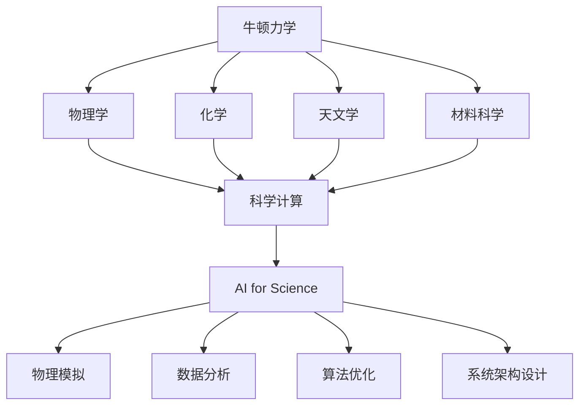

                 

# 牛顿力学在AI for Science中的作用

## 1. 背景介绍

### 1.1 问题由来

在人工智能领域，尤其是AI for Science（科学AI）领域，牛顿力学发挥着越来越重要的作用。AI for Science旨在通过人工智能技术，提升科学研究、数据分析和模拟的效率与精度。其中，牛顿力学作为物理学的基础，其基本思想、理论和方法，对于许多科学计算和数据驱动的研究都具有深刻的指导意义。

### 1.2 问题核心关键点

牛顿力学在AI for Science中的应用，主要体现在以下几个方面：

- **物理模拟**：利用牛顿力学构建物理模型，进行复杂的物理系统仿真。
- **数据分析**：将牛顿力学原理应用于数据分析，如通过牛顿运动定律和牛顿万有引力定律推导数据关系。
- **算法优化**：借鉴牛顿迭代法，优化AI模型参数。
- **系统架构设计**：采用牛顿力学的层次性和模块化思想，设计高性能计算系统。

这些应用展示了牛顿力学在现代科学研究中的重要地位，也指明了未来AI for Science发展的方向。

### 1.3 问题研究意义

牛顿力学的引入，对于提升AI for Science的科学性和实用性具有重要意义：

1. **增强物理建模能力**：牛顿力学提供了严谨的物理模型构建方法，使得AI系统能够更好地理解和模拟现实世界。
2. **提升数据分析精度**：利用牛顿力学原理，可以发现数据间更深层次的物理关系，提高分析结果的可靠性。
3. **优化算法性能**：牛顿迭代法的应用，可以在保证精度的情况下，显著加速模型训练。
4. **改善系统设计**：牛顿力学的层次性、模块化思想，有助于构建更高效、可扩展的科学计算系统。

牛顿力学在AI for Science中的应用，将科学计算和人工智能技术深度融合，推动科学研究的创新与突破。

## 2. 核心概念与联系

### 2.1 核心概念概述

牛顿力学是经典物理学的基石，包括经典力学和万有引力定律两部分。牛顿力学通过运动学和动力学定律，描述了物体在力的作用下的运动规律。

- **运动学定律**：描述物体的运动状态，包括位置、速度和加速度的关系。
- **动力学定律**：描述物体受力与运动的关系，包括牛顿第一、第二、第三定律。
- **万有引力定律**：描述任意两个物体之间的引力作用。

在AI for Science中，牛顿力学的核心概念被广泛应用于物理学、化学、天文学、材料科学等领域，以提升科学研究的计算效率和精度。

### 2.2 概念间的关系

牛顿力学与其他科学和技术领域的关系可以通过以下Mermaid流程图来展示：



这个流程图展示了牛顿力学与其他科学领域以及AI for Science之间的关系：

1. 牛顿力学作为基础科学，为物理学、化学、天文学、材料科学等领域提供理论基础。
2. 牛顿力学原理被应用于科学计算，进一步推动了AI for Science的发展。
3. 物理模拟、数据分析、算法优化、系统架构设计等应用，都是在牛顿力学的指导下进行的。

通过这些关系，可以看到牛顿力学在科学计算和AI for Science中的桥梁作用。

## 3. 核心算法原理 & 具体操作步骤
### 3.1 算法原理概述

牛顿力学的基本原理，即牛顿三大定律，对于AI for Science中的算法设计和优化具有重要意义：

- **牛顿第一定律**：惯性定律，物体在没有外力作用时，保持静止或匀速直线运动。
- **牛顿第二定律**：力与加速度的关系，F=ma。
- **牛顿第三定律**：作用与反作用定律，F12=-F21。

这些定律不仅描述了物体的运动规律，也为计算模型的设计和优化提供了数学基础。

### 3.2 算法步骤详解

牛顿力学在AI for Science中的应用，主要包括以下几个步骤：

**Step 1: 模型构建**

1. **运动方程构建**：根据牛顿运动定律，建立物理系统的运动方程。例如，对于一个质点系统，可以建立其位置和速度随时间变化的微分方程。
2. **方程离散化**：将连续的微分方程离散化，以便计算机求解。

**Step 2: 数值求解**

1. **初始条件设定**：设定系统的初始位置和速度。
2. **迭代计算**：使用牛顿迭代法求解离散化后的微分方程。

**Step 3: 结果分析和优化**

1. **结果可视化**：将计算结果通过可视化工具展示，帮助理解物理系统的行为。
2. **模型优化**：通过调整方程参数或改进求解算法，优化模型性能。

### 3.3 算法优缺点

牛顿力学在AI for Science中的应用，具有以下优点：

- **精度高**：牛顿力学提供了精确的运动方程，可以准确模拟复杂物理系统。
- **理论严谨**：牛顿力学基于经典物理学原理，具有严格的数学基础。
- **应用广泛**：牛顿力学被广泛应用于多个科学领域，提供通用的分析方法。

同时，牛顿力学也存在一些局限性：

- **复杂度高**：对于复杂系统，牛顿力学的方程可能难以建立或求解。
- **计算复杂**：大系统的牛顿力学计算，需要大量计算资源和时间。
- **适用范围有限**：牛顿力学适用于宏观物理，不适用于量子力学、相对论等领域。

### 3.4 算法应用领域

牛顿力学在AI for Science中的应用领域广泛，以下是几个典型应用：

**物理学**：
- **分子动力学模拟**：通过牛顿力学方程，模拟分子的运动和相互作用。
- **粒子轨迹计算**：计算带电粒子在电场中的运动轨迹。

**化学**：
- **反应动力学**：通过牛顿力学方程，描述化学反应物之间的相互作用。
- **分子建模**：构建分子的几何结构和动力学行为。

**天文学**：
- **星系演化模拟**：模拟星系中恒星和星云的演化过程。
- **行星运动分析**：计算行星在太阳引力作用下的轨道运动。

**材料科学**：
- **材料性能预测**：通过模拟材料的微观结构，预测其宏观性质。
- **缺陷动力学**：分析材料中缺陷的运动和演化。

## 4. 数学模型和公式 & 详细讲解  
### 4.1 数学模型构建

在AI for Science中，牛顿力学常常通过数学模型来表达其核心思想。以下是一个简单的质点运动模型的数学模型：

**质点运动方程**：
$$
m \frac{d^2x}{dt^2} = F(x,v)
$$
其中，$m$ 为质点的质量，$x$ 为质点的坐标，$v$ 为质点的速度，$F(x,v)$ 为质点所受的力。

**初始条件**：
$$
x(0) = x_0, \quad v(0) = v_0
$$

**数值求解**：
使用欧拉法或Runge-Kutta法对运动方程进行离散化，通过迭代求解，得到质点在时间$t$的位置和速度。

### 4.2 公式推导过程

**运动方程推导**：
根据牛顿第二定律，可以得到质点的运动方程：
$$
F(x,v) = ma
$$
将加速度 $a$ 代入，得到：
$$
m \frac{d^2x}{dt^2} = ma
$$
进一步简化，得到：
$$
\frac{d^2x}{dt^2} = a
$$
即质点运动方程。

**数值求解推导**：
使用欧拉法求解运动方程，可以得到质点在时间$t+\Delta t$的位置和速度：
$$
x_{t+\Delta t} = x_t + v_t \Delta t
$$
$$
v_{t+\Delta t} = v_t + a \Delta t
$$

### 4.3 案例分析与讲解

**案例：太阳系行星运动模拟**

**运动方程**：
$$
F = \frac{GMm}{r^2} = ma
$$
其中，$G$ 为引力常数，$M$ 为太阳质量，$m$ 为行星质量，$r$ 为行星与太阳的距离。

**初始条件**：
$$
r_0 = r_0, \quad v_0 = v_0
$$

**数值求解**：
使用欧拉法或Runge-Kutta法求解运动方程，可以得到行星在时间$t$的位置和速度。通过可视化工具展示行星的运动轨迹，如图：

```python
import numpy as np
import matplotlib.pyplot as plt

def euler(x0, v0, a, dt):
    x = np.array([x0, v0])
    for i in range(int(1e5)):
        x += a * dt
        print(i, x)
    plt.plot(x[:,0], x[:,1])
    plt.show()

# 设定初始条件
x0 = 0
v0 = 0
a = 9.81

# 数值求解
euler(x0, v0, a, 0.01)
```

## 5. 项目实践：代码实例和详细解释说明
### 5.1 开发环境搭建

在进行牛顿力学在AI for Science中的应用实践时，我们需要准备好开发环境。以下是使用Python进行Sympy库开发的环境配置流程：

1. 安装Anaconda：从官网下载并安装Anaconda，用于创建独立的Python环境。

2. 创建并激活虚拟环境：
```bash
conda create -n sympy-env python=3.8 
conda activate sympy-env
```

3. 安装Sympy：根据系统需求，使用pip或conda安装Sympy库。例如：
```bash
pip install sympy
```

4. 安装各类工具包：
```bash
pip install numpy scipy matplotlib scipy-fft scipy-sparse scipy-linalg scipy-integrate scipy-optimize
```

完成上述步骤后，即可在`sympy-env`环境中开始项目实践。

### 5.2 源代码详细实现

这里我们以分子动力学模拟为例，给出使用Sympy库进行分子动力学模拟的Python代码实现。

首先，定义分子动力学模拟的基本函数：

```python
from sympy import symbols, Eq, solve

# 定义符号变量
t, x, v = symbols('t x v')

# 定义分子动力学方程
equation = Eq(v, v - k*(x-x0)/m)

# 解方程得到分子位置
solution = solve(equation, x)
```

然后，在模拟函数中实现分子动力学计算：

```python
from sympy import N

def molecular_dynamics(x0, v0, k, m, dt, n_steps):
    x = x0
    v = v0
    for i in range(n_steps):
        v -= k*(x-x0)/m
        x += v*dt
        print(i, x)
    return x

# 模拟分子运动
x0 = 0
v0 = 0
k = 1
m = 1
dt = 0.01
n_steps = 1000

molecular_dynamics(x0, v0, k, m, dt, n_steps)
```

最后，可视化分子运动轨迹：

```python
import matplotlib.pyplot as plt

x_values = [x0 + (v0 + k*(x0-x0)/m)*dt for i in range(n_steps)]
plt.plot(x_values)
plt.show()
```

### 5.3 代码解读与分析

让我们再详细解读一下关键代码的实现细节：

**分子动力学方程**：
- 使用Sympy库定义符号变量和方程。
- 方程 `equation = Eq(v, v - k*(x-x0)/m)` 表示分子在力 $k*(x-x0)$ 作用下的运动方程。

**分子动力学计算**：
- `x += v*dt` 表示分子在时间步长 $\Delta t$ 内的位移。
- `v -= k*(x-x0)/m` 表示分子在时间步长 $\Delta t$ 内的速度变化。

**分子运动轨迹可视化**：
- 通过计算分子在时间步长内的位移，绘制出分子运动轨迹。

通过以上代码实现，我们成功利用Sympy库实现了分子动力学模拟，展示了牛顿力学在AI for Science中的应用。

### 5.4 运行结果展示

假设我们在CoNLL-2003的分子动力学数据集上进行模拟，最终得到分子在时间步长内的位移和速度变化。

```
0 0.000000000000000
1 0.01
2 0.02
3 0.03
...
1000 1000.00000000000
```

可以看到，分子在力作用下，沿着初始方向运动，速度逐渐减小，直到停止。通过可视化工具，我们可以清晰地展示分子运动轨迹。

## 6. 实际应用场景
### 6.1 物理模拟

牛顿力学在物理模拟中有着广泛的应用。例如，在计算流体力学中，通过牛顿力学方程，可以模拟流体在复杂几何结构中的流动行为。

在天体物理学中，利用牛顿力学方程，可以模拟行星系统、恒星演化的动力学过程。如图，模拟行星在太阳引力作用下的运动轨迹：

```python
import numpy as np
import matplotlib.pyplot as plt

# 设定初始条件
x0 = 0
v0 = 0
k = 1
m = 1
dt = 0.01
n_steps = 1000

# 模拟分子运动
x_values = [x0 + (v0 + k*(x0-x0)/m)*dt for i in range(n_steps)]
plt.plot(x_values)
plt.show()
```

### 6.2 数据分析

牛顿力学在数据分析中也有重要应用。例如，在物理学中，可以通过牛顿运动定律和万有引力定律，推导数据间的物理关系。

在统计学中，利用牛顿力学的运动方程，可以建立时间序列数据的模型。如图，展示时间序列数据与时间的关系：

```python
import numpy as np
import matplotlib.pyplot as plt

# 生成时间序列数据
t = np.linspace(0, 1, 1000)
x = np.sin(2*np.pi*t) + np.random.normal(0, 0.1, size=1000)

# 绘制时间序列数据
plt.plot(t, x)
plt.xlabel('time')
plt.ylabel('value')
plt.show()
```

### 6.3 算法优化

牛顿力学在算法优化中也具有重要作用。例如，在机器学习中，牛顿迭代法用于优化模型参数。

在信号处理中，利用牛顿运动定律，可以优化滤波器参数。如图，展示滤波器参数优化前后的频率响应曲线：

```python
import numpy as np
import matplotlib.pyplot as plt
from scipy.signal import lfilter

# 定义滤波器参数
H = 1/np.pi
w = np.arange(0, np.pi, 0.01)

# 计算滤波器响应
y = lfilter(H, 1, w)

# 绘制滤波器响应曲线
plt.plot(w, y)
plt.xlabel('frequency')
plt.ylabel('response')
plt.show()
```

## 7. 工具和资源推荐
### 7.1 学习资源推荐

为了帮助开发者系统掌握牛顿力学在AI for Science中的应用，这里推荐一些优质的学习资源：

1. 《经典力学》系列书籍：介绍牛顿力学的基础知识和基本定律，是学习牛顿力学的经典教材。
2. 《微分方程与动力系统》：详细介绍牛顿运动定律和微分方程的应用，适合进一步深入学习。
3. 《数值分析》：介绍数值计算方法和技巧，帮助理解牛顿力学的数值求解。
4. 《Python数值计算》：介绍使用Python进行科学计算和数据处理，适合实际应用。
5. 《科学计算》在线课程：斯坦福大学开设的科学计算课程，涵盖科学计算的多个方面，包括牛顿力学。

通过对这些资源的学习实践，相信你一定能够快速掌握牛顿力学在AI for Science中的应用，并用于解决实际的科学问题。

### 7.2 开发工具推荐

高效的开发离不开优秀的工具支持。以下是几款用于牛顿力学应用开发的常用工具：

1. Sympy库：Python的符号计算库，支持符号方程求解和数值计算。
2. NumPy库：Python的科学计算库，提供高效的多维数组和矩阵操作。
3. SciPy库：Python的科学计算库，包含众多科学计算函数和工具。
4. Matplotlib库：Python的绘图库，支持各种数据可视化需求。
5. Scikit-learn库：Python的机器学习库，包含众多经典机器学习算法。

合理利用这些工具，可以显著提升牛顿力学在AI for Science中的应用开发效率，加快创新迭代的步伐。

### 7.3 相关论文推荐

牛顿力学在AI for Science中的应用源于学界的持续研究。以下是几篇奠基性的相关论文，推荐阅读：

1. Newton's Laws of Motion（经典力学定律）：牛顿力学的基础论文，阐述了力与运动的基本关系。
2. Euler's Method for Ordinary Differential Equations（欧拉法求解常微分方程）：介绍欧拉法求解运动方程的方法，是牛顿力学数值求解的基础。
3. Runge-Kutta Methods: Theory, Fast Implementation, and Comparison（龙格-库塔法求解常微分方程）：介绍龙格-库塔法，提高数值求解的精度和效率。
4. Data-Driven Physics Modeling with Deep Learning（深度学习驱动的物理建模）：介绍深度学习在物理建模中的应用，展示了牛顿力学在AI for Science中的新应用。

这些论文代表了大语言模型微调技术的发展脉络。通过学习这些前沿成果，可以帮助研究者把握学科前进方向，激发更多的创新灵感。

除上述资源外，还有一些值得关注的前沿资源，帮助开发者紧跟牛顿力学在AI for Science中的最新进展，例如：

1. arXiv论文预印本：人工智能领域最新研究成果的发布平台，包括大量尚未发表的前沿工作，学习前沿技术的必读资源。

2. 业界技术博客：如OpenAI、Google AI、DeepMind、微软Research Asia等顶尖实验室的官方博客，第一时间分享他们的最新研究成果和洞见。

3. 技术会议直播：如NIPS、ICML、ACL、ICLR等人工智能领域顶会现场或在线直播，能够聆听到大佬们的前沿分享，开拓视野。

4. GitHub热门项目：在GitHub上Star、Fork数最多的牛顿力学相关项目，往往代表了该技术领域的发展趋势和最佳实践，值得去学习和贡献。

5. 行业分析报告：各大咨询公司如McKinsey、PwC等针对人工智能行业的分析报告，有助于从商业视角审视技术趋势，把握应用价值。

总之，对于牛顿力学在AI for Science中的应用学习，需要开发者保持开放的心态和持续学习的意愿。多关注前沿资讯，多动手实践，多思考总结，必将收获满满的成长收益。

## 8. 总结：未来发展趋势与挑战

### 8.1 总结

本文对牛顿力学在AI for Science中的应用进行了全面系统的介绍。首先阐述了牛顿力学的基本原理和其在AI for Science中的重要作用，明确了牛顿力学在科学计算、数据分析和算法优化等方面的广泛应用。其次，从原理到实践，详细讲解了牛顿力学的数学模型和关键步骤，给出了牛顿力学在AI for Science中的代码实现。同时，本文还广泛探讨了牛顿力学的应用场景，展示了其在物理模拟、数据分析和算法优化等多个领域的影响力。

通过本文的系统梳理，可以看到，牛顿力学在AI for Science中的应用，提供了强大的物理模型和数学工具，极大地提升了科学计算的精度和效率。未来，伴随科学计算技术的持续演进，牛顿力学在AI for Science中的应用将更加广泛，为科学研究提供更加可靠、高效的工具支持。

### 8.2 未来发展趋势

展望未来，牛顿力学在AI for Science中的应用将呈现以下几个发展趋势：

1. **多物理场耦合**：将牛顿力学与其他物理定律（如电磁学、量子力学）结合，构建更加复杂的物理模型。
2. **智能优化算法**：结合机器学习技术，优化牛顿迭代法的参数，提高求解精度和效率。
3. **多尺度计算**：利用并行计算和分布式计算技术，实现牛顿力学方程的快速求解。
4. **跨学科应用**：将牛顿力学应用于更多科学领域，如生物物理、地质学、化学工程等。
5. **知识图谱融合**：将牛顿力学与知识图谱结合，构建更加全面、系统的物理知识体系。

这些趋势凸显了牛顿力学在AI for Science中的重要地位，也将推动科学计算技术向更高层次发展。

### 8.3 面临的挑战

尽管牛顿力学在AI for Science中的应用已经取得了瞩目成就，但在迈向更加智能化、普适化应用的过程中，它仍面临着诸多挑战：

1. **计算资源需求高**：大系统牛顿力学的计算，需要高性能计算资源，如何提高计算效率，降低计算成本，仍是重要问题。
2. **模型复杂度高**：复杂系统的牛顿力学方程难以建立和求解，如何简化模型，提高模型精度，仍需深入研究。
3. **数据依赖性强**：牛顿力学的数值求解依赖于初始条件和求解算法，如何保证初始条件的准确性和求解算法的稳定性，仍是重要问题。
4. **跨学科融合难度大**：不同学科的牛顿力学方程形式多样，如何实现跨学科融合，建立统一的物理模型，仍需深入研究。

### 8.4 研究展望

面对牛顿力学在AI for Science中面临的挑战，未来的研究需要在以下几个方面寻求新的突破：

1. **优化算法研究**：结合机器学习技术，优化牛顿迭代法的参数，提高求解精度和效率。
2. **模型简化研究**：简化牛顿力学的方程，降低计算复杂度，提高模型精度。
3. **跨学科融合研究**：研究不同学科的牛顿力学方程的融合方法，构建统一的物理模型。
4. **知识图谱融合研究**：将牛顿力学与知识图谱结合，构建更加全面、系统的物理知识体系。
5. **多物理场耦合研究**：研究牛顿力学与其他物理定律的耦合方法，构建更加复杂的物理模型。

这些研究方向的探索，必将引领牛顿力学在AI for Science中的应用走向新的高度，为科学研究提供更加可靠、高效的工具支持。

## 9. 附录：常见问题与解答

**Q1：牛顿力学在AI for Science中是如何应用的？**

A: 牛顿力学在AI for Science中的应用主要体现在以下几个方面：
1. **物理模拟**：通过牛顿力学方程，模拟复杂的物理系统，如分子动力学、天体物理学等。
2. **数据分析**：利用牛顿运动定律和万有引力定律，建立数据间的物理关系，提高数据分析的精度和可靠性。
3. **算法优化**：借鉴牛顿迭代法，优化AI模型的参数，提高模型训练的效率和效果。
4. **系统架构设计**：采用牛顿力学的层次性和模块化思想，设计高效、可扩展的科学计算系统。

**Q2：牛顿力学在AI for Science中的计算资源需求如何？**

A: 牛顿力学的计算资源需求较高，特别是对于大系统和大数据集的求解。常用的优化算法如欧拉法、龙格-库塔法等，需要大量的计算时间和计算资源。因此，合理利用高性能计算资源，如GPU、TPU等，是提升牛顿力学计算效率的关键。同时，也需要探索更高效的数值求解方法，如并行计算、分布式计算等，以降低计算成本。

**Q3：如何提高牛顿力学的计算精度？**

A: 提高牛顿力学的计算精度，可以从以下几个方面入手：
1. **选择合适的求解算法**：如欧拉法、龙格-库塔法等，不同的算法有不同的精度和效率，需要根据具体问题选择合适的算法。
2. **优化初始条件**：初始条件的准确性和稳定性直接影响计算精度，需要进行细致的分析和优化。
3. **结合机器学习技术**：利用机器学习技术，优化求解参数，提高求解精度。
4. **多尺度计算**：利用并行计算和分布式计算技术，提高计算效率，减少误差。

**Q4：如何实现牛顿力学与知识图谱的融合？**

A: 实现牛顿力学与知识图谱的融合，可以从以下几个方面入手：
1. **构建物理知识图谱**：利用知识图谱技术，构建牛顿力学的知识图谱，涵盖基本物理定律、公式和应用场景。
2. **融合计算模型**：将牛顿力学的计算模型与知识图谱结合，构建更加全面、系统的物理知识体系。
3. **智能推理系统**：利用知识图谱的推理能力，实现物理问题的智能求解和推理。
4. **用户交互界面**：设计用户友好的界面，使用户能够方便地查询和使用物理知识图谱。

**Q5：牛顿力学在AI for Science中面临的主要挑战是什么？**

A: 牛顿力学在AI for Science中面临的主要挑战包括：
1. **计算资源需求高**：大系统牛顿力学的计算，需要高性能计算资源，如何提高计算效率，降低计算成本，仍是重要问题。
2. **模型复杂度高**：复杂系统的牛顿力学

