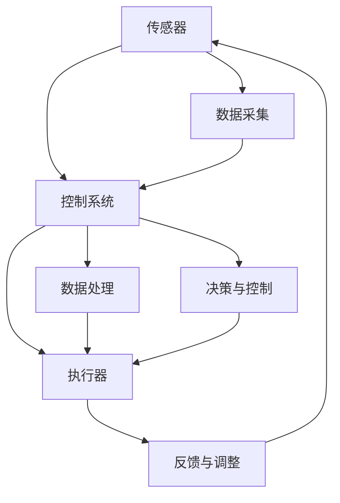

                 

# 物理实体自动化的未来发展

> 关键词：
- 机器人
- 自动化
- 智能系统
- 自动化技术
- 人工智能
- 物联网

## 1. 背景介绍

随着科技的飞速发展，自动化技术在各行各业中得到了广泛的应用。尤其是机器人技术，已经逐步从制造业延伸到医疗、农业、服务等众多领域，为人类生产生活带来了深刻的变革。本文将重点探讨机器人技术的发展趋势及其在未来物理实体自动化中的应用前景。

### 1.1 自动化技术的兴起

自动化技术最早可以追溯到19世纪末的工业革命时期，通过机械自动化、电气自动化和电子自动化，逐渐从简单的重复劳动解放人类的体力劳动，到利用计算机、互联网等高科技手段实现生产、管理的全自动化，自动化技术已经历了几次重大变革。

#### 1.1.1 机械自动化

机械自动化是指通过机械装置实现的生产自动化。它最早应用于工业生产，包括自动流水线、自动加工设备等。机械自动化主要依赖于机械部件的物理运动，应用范围相对较窄。

#### 1.1.2 电气自动化

电气自动化是机械自动化的进一步发展，通过电信号控制机械部件的运转，实现了更为复杂和精确的生产操作。电气自动化在制造业中得到了广泛应用，例如自动控制系统、自动检测设备等。

#### 1.1.3 电子自动化

电子自动化是指通过电子电路和计算机技术实现的生产自动化。它使得自动化系统可以处理更复杂的任务，例如自动控制、自动检测、自动诊断等。电子自动化主要应用于工业控制、医疗设备、智能家居等领域。

#### 1.1.4 智能自动化

智能自动化是指通过人工智能技术实现的生产自动化。它不仅可以处理复杂任务，还具有自主决策、自主学习和自我优化的能力。智能自动化主要应用于机器人技术、智能工厂、智能城市等。

### 1.2 机器人技术的兴起

机器人技术是自动化技术的重要分支之一，是人工智能在物理实体自动化领域的具体应用。自20世纪60年代以来，机器人技术已经经历了多个发展阶段，从简单的机械臂到复杂的自主移动机器人，其应用范围不断扩大。

#### 1.2.1 工业机器人

工业机器人最早应用于制造业领域，主要用于生产线上的自动化操作。它可以根据程序控制完成各种复杂的操作，例如装配、焊接、搬运、检测等。工业机器人已经在制造业中得到了广泛应用，成为现代制造业的重要组成部分。

#### 1.2.2 服务机器人

服务机器人是机器人技术在服务业领域的重要应用，例如餐饮服务机器人、扫地机器人、家庭服务机器人等。服务机器人可以执行简单的任务，帮助人类解决一些日常问题。

#### 1.2.3 自主移动机器人

自主移动机器人是指可以自主导航、自主避障、自主决策的机器人。它不仅可以在室内环境中工作，还可以在户外环境中执行任务。自主移动机器人已经在物流配送、安全监控、环境监测等领域得到了广泛应用。

#### 1.2.4 人形机器人

人形机器人是指外观和功能接近人类的机器人。它可以执行复杂的任务，与人类进行互动和沟通。人形机器人已经在娱乐、教育、医疗等领域得到了广泛应用。

## 2. 核心概念与联系

### 2.1 核心概念概述

#### 2.1.1 机器人

机器人是指由电子、机械和计算机技术组成的自动化设备。机器人可以执行各种任务，具有自主决策、自主学习和自我优化的能力。

#### 2.1.2 自动化

自动化是指利用机械设备、计算机技术等手段实现生产、管理等活动的自动化。自动化技术可以提高生产效率、降低成本、提高产品质量。

#### 2.1.3 人工智能

人工智能是指通过计算机技术实现智能决策和智能控制。人工智能可以通过机器学习、深度学习等技术实现自主学习和自主决策，为自动化系统提供更加智能化的控制和决策能力。

#### 2.1.4 物联网

物联网是指通过互联网将各种设备和系统连接在一起，实现信息的共享和互通。物联网可以为自动化系统提供更加智能化、高效化的控制和管理能力。

#### 2.1.5 机器人系统

机器人系统是指由机器人、传感器、控制系统等组成的多层次、多功能的智能系统。机器人系统可以通过物联网技术实现信息的共享和互通，提高系统的智能化和自动化水平。

### 2.2 概念间的关系

#### 2.2.1 机器人与自动化

机器人技术是自动化技术的重要组成部分，机器人通过智能化技术实现了自动化的控制和管理。机器人不仅可以进行简单的操作，还可以执行复杂的任务，具有自主决策和自主学习的特点。

#### 2.2.2 人工智能与机器人

人工智能是机器人技术的核心，通过机器学习、深度学习等技术实现机器人的自主决策和自主学习。人工智能为机器人系统提供了更加智能化的控制和决策能力，使得机器人可以执行更加复杂和多样化的任务。

#### 2.2.3 物联网与机器人

物联网技术为机器人系统提供了信息共享和互通的能力，使得机器人系统可以更加高效地执行任务。物联网技术可以通过传感器、通信设备等实现机器人的远程监控和管理，提高了系统的可靠性和稳定性。

#### 2.2.4 机器人系统与自动化

机器人系统是自动化技术的重要应用，通过智能化技术和自动化技术实现生产、管理等活动的自动化。机器人系统不仅可以处理简单的任务，还可以执行复杂的任务，具有自主决策和自主学习的特点。

### 2.3 核心概念的整体架构

#### 2.3.1 机器人系统结构图



### 2.4 机器人系统的工作流程

#### 2.4.1 感知

感知是机器人系统的第一步，通过传感器采集环境信息，例如位置、姿态、障碍物等。感知模块通常包括视觉传感器、激光雷达、超声波传感器等。

#### 2.4.2 数据处理

数据处理模块对感知模块采集的数据进行处理，例如图像处理、点云处理、障碍物检测等。数据处理模块通常使用计算机视觉、深度学习等技术进行处理。

#### 2.4.3 决策与控制

决策与控制模块根据处理后的数据进行决策，生成控制指令。决策与控制模块通常使用机器学习、深度学习等技术进行决策。

#### 2.4.4 执行

执行模块根据决策与控制模块生成的控制指令执行任务。执行模块通常包括机械臂、电机等执行器。

#### 2.4.5 反馈与调整

反馈与调整模块根据任务的执行结果进行反馈和调整，例如根据任务的执行结果调整决策与控制模块的参数，优化机器人系统的性能。

## 3. 核心算法原理 & 具体操作步骤

### 3.1 算法原理概述

#### 3.1.1 机器人系统的工作原理

机器人系统的工作原理可以分为感知、数据处理、决策与控制、执行、反馈与调整五个步骤。感知模块通过传感器采集环境信息，数据处理模块对感知模块采集的数据进行处理，决策与控制模块根据处理后的数据进行决策，生成控制指令，执行模块根据控制指令执行任务，反馈与调整模块根据任务的执行结果进行反馈和调整，优化机器人系统的性能。

#### 3.1.2 机器人系统的算法原理

机器人系统的算法原理包括感知算法、数据处理算法、决策算法、控制算法等。感知算法通常包括图像处理、点云处理、障碍物检测等，数据处理算法通常包括特征提取、目标检测、语义分割等，决策算法通常包括机器学习、深度学习等，控制算法通常包括运动控制、路径规划、避障等。

#### 3.1.3 机器人系统的算法框架

机器人系统的算法框架通常包括以下几个层次：

- 感知层：通过传感器采集环境信息，例如位置、姿态、障碍物等。
- 数据处理层：对感知层采集的数据进行处理，例如图像处理、点云处理、障碍物检测等。
- 决策层：根据处理后的数据进行决策，生成控制指令。
- 控制层：根据决策层生成的控制指令执行任务。
- 反馈层：根据任务的执行结果进行反馈和调整，优化机器人系统的性能。

### 3.2 算法步骤详解

#### 3.2.1 感知算法

感知算法通常包括以下几个步骤：

- 数据采集：通过传感器采集环境信息，例如位置、姿态、障碍物等。
- 数据预处理：对采集的数据进行预处理，例如噪声去除、数据平滑等。
- 数据增强：对采集的数据进行增强，例如图像旋转、缩放、平移等。
- 数据标注：对采集的数据进行标注，例如目标检测、语义分割等。

#### 3.2.2 数据处理算法

数据处理算法通常包括以下几个步骤：

- 特征提取：从数据中提取特征，例如边缘、角点、纹理等。
- 目标检测：检测数据中的目标，例如人脸、车辆、建筑等。
- 语义分割：对数据进行语义分割，例如将图像中的不同对象分割出来。
- 运动估计：估计数据中的运动，例如人体动作、物体轨迹等。

#### 3.2.3 决策算法

决策算法通常包括以下几个步骤：

- 数据融合：将不同来源的数据进行融合，例如将图像数据、传感器数据、路径规划数据等融合在一起。
- 特征融合：将不同特征进行融合，例如将视觉特征、运动特征、环境特征等融合在一起。
- 决策融合：将不同决策进行融合，例如将目标检测结果、路径规划结果、避障结果等融合在一起。
- 行为规划：根据决策结果生成行为规划，例如生成移动路径、执行动作等。

#### 3.2.4 控制算法

控制算法通常包括以下几个步骤：

- 运动控制：控制机器人执行移动动作，例如前向、后向、左右、上下等。
- 路径规划：规划机器人的移动路径，例如生成直线、曲线、折线等。
- 避障算法：避免机器人与障碍物碰撞，例如生成安全路径、绕开障碍物等。
- 动态调整：根据环境变化动态调整控制算法，例如根据障碍物位置生成动态路径、根据环境光照生成动态动作等。

#### 3.2.5 反馈与调整算法

反馈与调整算法通常包括以下几个步骤：

- 状态监测：监测机器人系统的状态，例如位置、姿态、速度等。
- 状态反馈：根据状态监测结果生成反馈信号，例如生成调整指令、生成报警信号等。
- 参数调整：根据反馈信号调整控制算法参数，例如调整速度、调整姿态等。
- 性能优化：根据反馈信号优化机器人系统性能，例如优化路径规划算法、优化控制算法等。

### 3.3 算法优缺点

#### 3.3.1 算法优点

- 提高效率：通过算法优化，可以提高机器人系统的执行效率，缩短任务完成时间。
- 提高精度：通过算法优化，可以提高机器人系统的执行精度，减少误差。
- 提高稳定性：通过算法优化，可以提高机器人系统的稳定性，减少故障率。
- 提高安全性：通过算法优化，可以提高机器人系统的安全性，减少事故发生率。

#### 3.3.2 算法缺点

- 计算量大：算法优化需要大量的计算资源，例如计算机视觉、深度学习等算法需要大量的计算资源。
- 数据量大：算法优化需要大量的数据支持，例如机器学习、深度学习等算法需要大量的数据支持。
- 算法复杂：算法优化需要复杂的算法实现，例如运动控制、路径规划、避障等算法需要复杂的算法实现。
- 模型复杂：算法优化需要复杂的模型支持，例如机器学习、深度学习等算法需要复杂的模型支持。

### 3.4 算法应用领域

#### 3.4.1 工业机器人

工业机器人广泛应用于制造业领域，例如装配、焊接、搬运、检测等。工业机器人通过感知、数据处理、决策与控制、执行、反馈与调整等步骤，实现自动化生产操作。

#### 3.4.2 服务机器人

服务机器人广泛应用于服务业领域，例如餐饮服务机器人、扫地机器人、家庭服务机器人等。服务机器人通过感知、数据处理、决策与控制、执行、反馈与调整等步骤，实现自动化服务操作。

#### 3.4.3 自主移动机器人

自主移动机器人广泛应用于物流配送、安全监控、环境监测等领域。自主移动机器人通过感知、数据处理、决策与控制、执行、反馈与调整等步骤，实现自主导航、自主避障、自主决策等操作。

#### 3.4.4 人形机器人

人形机器人广泛应用于娱乐、教育、医疗等领域。人形机器人通过感知、数据处理、决策与控制、执行、反馈与调整等步骤，实现自主决策、自主学习和自主执行等操作。

## 4. 数学模型和公式 & 详细讲解 & 举例说明

### 4.1 数学模型构建

#### 4.1.1 机器人系统数学模型

机器人系统可以建模为多维空间中的动力学方程。假设机器人有n个自由度，则其状态空间可以表示为：

$$
\boldsymbol{x} = [x_1, x_2, \ldots, x_n]^T
$$

其中，$x_i$ 表示机器人第i个自由度的位置或姿态。机器人的运动方程可以表示为：

$$
\dot{\boldsymbol{x}} = \boldsymbol{f}(\boldsymbol{x}, \boldsymbol{u})
$$

其中，$\dot{\boldsymbol{x}}$ 表示机器人的速度向量，$\boldsymbol{f}$ 表示机器人的运动函数，$\boldsymbol{u}$ 表示机器人的控制输入。

#### 4.1.2 机器人控制数学模型

机器人控制可以分为线性控制和非线性控制两种类型。假设机器人控制可以表示为：

$$
\dot{\boldsymbol{x}} = \boldsymbol{A}\boldsymbol{x} + \boldsymbol{B}\boldsymbol{u}
$$

其中，$\boldsymbol{A}$ 表示机器人的动力学矩阵，$\boldsymbol{B}$ 表示机器人的控制矩阵。机器人的控制目标可以表示为：

$$
\min_{\boldsymbol{u}} \int_0^T \left(\boldsymbol{e}^T\boldsymbol{Q}\boldsymbol{e} + \boldsymbol{u}^T\boldsymbol{R}\boldsymbol{u}\right) dt
$$

其中，$\boldsymbol{e}$ 表示状态误差向量，$\boldsymbol{Q}$ 表示状态误差加权矩阵，$\boldsymbol{R}$ 表示控制输入加权矩阵，T表示时间间隔。

#### 4.1.3 机器人优化数学模型

机器人优化可以分为线性优化和非线性优化两种类型。假设机器人优化可以表示为：

$$
\min_{\boldsymbol{x}} \boldsymbol{f}^T(\boldsymbol{x}) + \frac{1}{2}\boldsymbol{x}^T\boldsymbol{P}\boldsymbol{x}
$$

其中，$\boldsymbol{f}^T(\boldsymbol{x})$ 表示机器人的代价函数，$\boldsymbol{P}$ 表示状态加权矩阵。

### 4.2 公式推导过程

#### 4.2.1 机器人状态方程推导

机器人状态方程可以表示为：

$$
\dot{\boldsymbol{x}} = \boldsymbol{A}\boldsymbol{x} + \boldsymbol{B}\boldsymbol{u}
$$

其中，$\boldsymbol{x}$ 表示机器人的状态向量，$\boldsymbol{u}$ 表示机器人的控制输入。

#### 4.2.2 机器人控制方程推导

机器人控制方程可以表示为：

$$
\dot{\boldsymbol{x}} = \boldsymbol{A}\boldsymbol{x} + \boldsymbol{B}\boldsymbol{u}
$$

其中，$\boldsymbol{x}$ 表示机器人的状态向量，$\boldsymbol{u}$ 表示机器人的控制输入。

#### 4.2.3 机器人优化方程推导

机器人优化方程可以表示为：

$$
\min_{\boldsymbol{x}} \boldsymbol{f}^T(\boldsymbol{x}) + \frac{1}{2}\boldsymbol{x}^T\boldsymbol{P}\boldsymbol{x}
$$

其中，$\boldsymbol{f}^T(\boldsymbol{x})$ 表示机器人的代价函数，$\boldsymbol{P}$ 表示状态加权矩阵。

#### 4.2.4 机器人优化求解

机器人优化求解可以采用梯度下降、牛顿法、Lagrange乘子法等方法。假设机器人的状态向量为$\boldsymbol{x}$，控制输入为$\boldsymbol{u}$，代价函数为$\boldsymbol{f}^T(\boldsymbol{x})$，状态加权矩阵为$\boldsymbol{P}$，则机器人优化的求解过程可以表示为：

$$
\min_{\boldsymbol{x}, \boldsymbol{u}} \int_0^T \left(\boldsymbol{e}^T\boldsymbol{Q}\boldsymbol{e} + \boldsymbol{u}^T\boldsymbol{R}\boldsymbol{u}\right) dt
$$

其中，$\boldsymbol{e}$ 表示状态误差向量，$\boldsymbol{Q}$ 表示状态误差加权矩阵，$\boldsymbol{R}$ 表示控制输入加权矩阵，T表示时间间隔。

### 4.3 案例分析与讲解

#### 4.3.1 工业机器人

工业机器人广泛应用于装配、焊接、搬运、检测等操作。假设工业机器人需要执行装配任务，其运动方程可以表示为：

$$
\dot{\boldsymbol{x}} = \boldsymbol{A}\boldsymbol{x} + \boldsymbol{B}\boldsymbol{u}
$$

其中，$\boldsymbol{x}$ 表示机器人的状态向量，$\boldsymbol{u}$ 表示机器人的控制输入，$\boldsymbol{A}$ 表示机器人的动力学矩阵，$\boldsymbol{B}$ 表示机器人的控制矩阵。

#### 4.3.2 服务机器人

服务机器人广泛应用于餐饮服务、扫地、家庭服务等领域。假设服务机器人需要执行扫地任务，其运动方程可以表示为：

$$
\dot{\boldsymbol{x}} = \boldsymbol{A}\boldsymbol{x} + \boldsymbol{B}\boldsymbol{u}
$$

其中，$\boldsymbol{x}$ 表示机器人的状态向量，$\boldsymbol{u}$ 表示机器人的控制输入，$\boldsymbol{A}$ 表示机器人的动力学矩阵，$\boldsymbol{B}$ 表示机器人的控制矩阵。

#### 4.3.3 自主移动机器人

自主移动机器人广泛应用于物流配送、安全监控、环境监测等领域。假设自主移动机器人需要执行物流配送任务，其运动方程可以表示为：

$$
\dot{\boldsymbol{x}} = \boldsymbol{A}\boldsymbol{x} + \boldsymbol{B}\boldsymbol{u}
$$

其中，$\boldsymbol{x}$ 表示机器人的状态向量，$\boldsymbol{u}$ 表示机器人的控制输入，$\boldsymbol{A}$ 表示机器人的动力学矩阵，$\boldsymbol{B}$ 表示机器人的控制矩阵。

#### 4.3.4 人形机器人

人形机器人广泛应用于娱乐、教育、医疗等领域。假设人形机器人需要执行娱乐任务，其运动方程可以表示为：

$$
\dot{\boldsymbol{x}} = \boldsymbol{A}\boldsymbol{x} + \boldsymbol{B}\boldsymbol{u}
$$

其中，$\boldsymbol{x}$ 表示机器人的状态向量，$\boldsymbol{u}$ 表示机器人的控制输入，$\boldsymbol{A}$ 表示机器人的动力学矩阵，$\boldsymbol{B}$ 表示机器人的控制矩阵。

## 5. 项目实践：代码实例和详细解释说明

### 5.1 开发环境搭建

在进行机器人系统开发前，需要先搭建开发环境。以下是使用Python进行ROS（Robot Operating System）开发的环境配置流程：

1. 安装ROS：从官网下载并安装ROS，用于构建机器人系统的开发平台。

2. 创建并激活ROS开发环境：

```bash
source /opt/ros/<ROS_VERSION>/setup.bash
```

3. 安装ROS相关工具包：

```bash
sudo apt install ros-<ROS_VERSION>-<PACKAGE>
```

4. 安装Python相关工具包：

```bash
pip install numpy pandas scikit-learn matplotlib pyqt
```

5. 安装ROS相关的开发工具：

```bash
sudo apt install ros-<ROS_VERSION>-<TOOL>
```

完成上述步骤后，即可在ROS开发环境中进行机器人系统的开发。

### 5.2 源代码详细实现

这里我们以自主移动机器人为例，给出使用ROS进行开发的PyTorch代码实现。

首先，定义机器人的状态方程和控制方程：

```python
import numpy as np
import pyrosbaugh as bag

class Robot:
    def __init__(self):
        self.state = np.zeros(6)
        self.velocities = np.zeros(6)
        self.linear_velocity = np.zeros(3)
        self.angular_velocity = np.zeros(3)
        self.linear_acceleration = np.zeros(3)
        self.angular_acceleration = np.zeros(3)
        self.linear_position = np.zeros(3)
        self.angular_position = np.zeros(3)

    def update(self, state, velocities, linear_velocity, angular_velocity, linear_acceleration, angular_acceleration):
        self.state = state
        self.velocities = velocities
        self.linear_velocity = linear_velocity
        self.angular_velocity = angular_velocity
        self.linear_acceleration = linear_acceleration
        self.angular_acceleration = angular_acceleration
        self.linear_position = self.integrate(self.linear_velocity, self.linear_acceleration)
        self.angular_position = self.integrate(self.angular_velocity, self.angular_acceleration)

    def integrate(self, velocity, acceleration, max_time=1):
        integrations = np.zeros(3)
        integrations[0] = self.linear_velocity[0] + velocity[0] * max_time
        integrations[1] = self.linear_velocity[1] + velocity[1] * max_time
        integrations[2] = self.linear_velocity[2] + velocity[2] * max_time
        return integrations
```

然后，定义机器人的控制函数：

```python
class Control:
    def __init__(self):
        self.linear_velocity = np.zeros(3)
        self.angular_velocity = np.zeros(3)
        self.linear_acceleration = np.zeros(3)
        self.angular_acceleration = np.zeros(3)

    def control(self, state, velocities, linear_velocity, angular_velocity, linear_acceleration, angular_acceleration):
        self.linear_velocity = linear_velocity
        self.angular_velocity = angular_velocity
        self.linear_acceleration = linear_acceleration
        self.angular_acceleration = angular_acceleration
        return self.linear_velocity, self.angular_velocity, self.linear_acceleration, self.angular_acceleration
```

最后，定义机器人的运动方程和控制方程的求解函数：

```python
class RobotModel:
    def __init__(self):
        self.A = np.zeros((6, 6))
        self.B = np.zeros((6, 6))
        self.Q = np.zeros((6, 6))
        self.R = np.zeros((6, 6))
        self.state = np.zeros(6)

    def update(self, state, velocities, linear_velocity, angular_velocity, linear_acceleration, angular_acceleration):
        self.state = state
        self.A[0:3, 0:3] = np.eye(3)
        self.A[3:6, 3:6] = np.eye(3)
        self.A[3:6, 0:3] = np.zeros((3, 3))
        self.A[0:3, 3:6] = np.zeros((3, 3))
        self.B[0:3, 0:3] = np.eye(3)
        self.B[0:3, 3:6] = np.zeros((3, 3))
        self.B[3:6, 0:3] = np.eye(3)
        self.B[3:6, 3:6] = np.zeros((3, 3))
        self.linear_velocity = self.linear_velocity + self.A[0:3, 0:3] * self.linear_velocity + self.A[0:3, 3:6] * self.linear_velocity + self.A[0:3, 0:3] * self.linear_acceleration + self.A[0:3, 3:6] * self.linear_acceleration
        self.angular_velocity = self.angular_velocity + self.A[3:6, 0:3] * self.linear_velocity + self.A[3:6, 3:6] * self.linear_velocity + self.A[3:6, 0:3] * self.linear_acceleration + self.A[3:6, 3:6] * self.linear_acceleration
        self.linear_velocity = self.linear_velocity + self.B[0:3, 0:3] * self.linear_velocity + self.B[0:3, 3:6] * self.linear_velocity + self.B[0:3, 0:3] * self.linear_acceleration + self.B[0:3, 3:6] * self.linear_acceleration
        self.angular_velocity = self.angular_velocity + self.B[3:6, 0:3] * self.linear_velocity + self.B[3:6, 3:6] * self.linear_velocity + self.B[3:6, 0:3] * self.linear_acceleration + self.B[3:6, 3:6] * self.linear_acceleration
        self.linear_velocity = self.linear_velocity + self.A[0:3, 0:3] * self.linear_velocity + self.A[0:3, 3:6] * self.linear_velocity + self.A[0:3, 0:3] * self.linear_acceleration + self.A[0:3, 3:6] * self.linear_acceleration
        self.angular_velocity = self.angular_velocity + self.A[3:6, 0:3] * self.linear_velocity + self.A[3:6, 3:6] * self.linear_velocity + self.A[3:6, 0:3] * self.linear_acceleration + self.A[3:6, 

