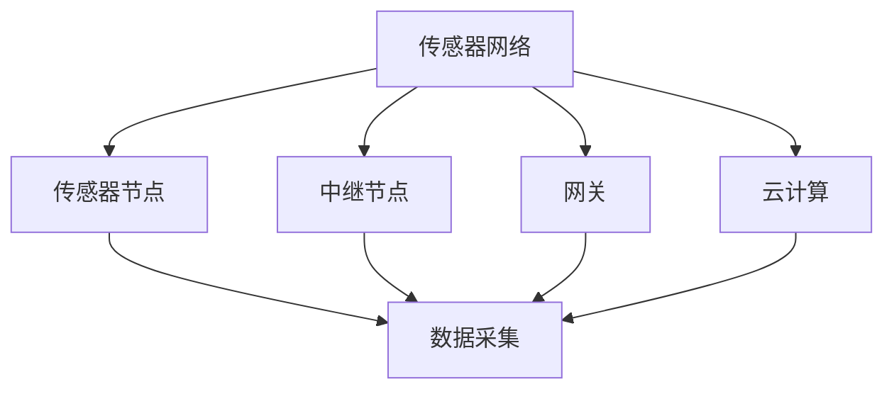
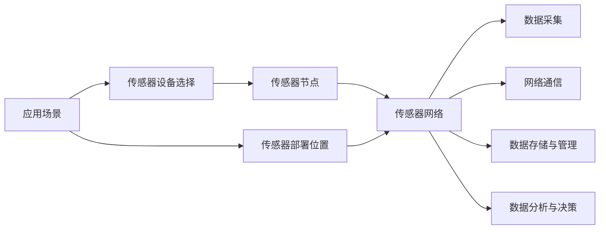
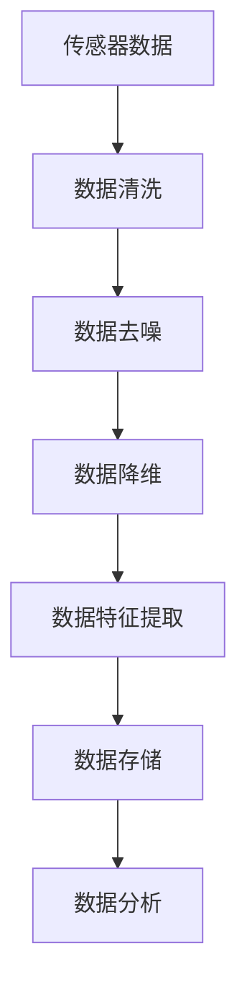
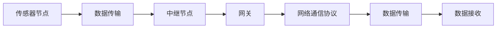
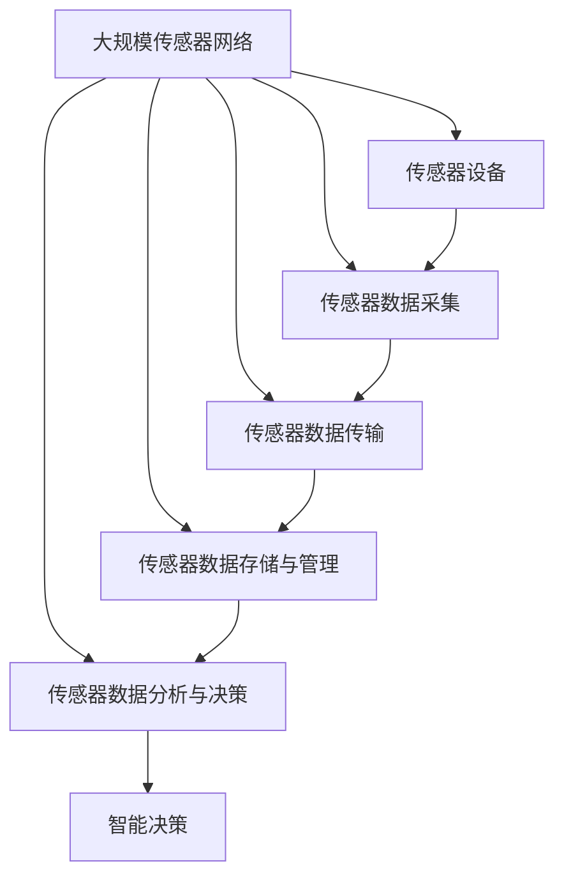

                 

## 1. 背景介绍

### 1.1 问题由来
随着物联网(IoT)技术的发展，传感器设备的应用日益普及。物联网不仅改变了人们的生活，也改变了工业生产、交通管理、环境监测等各个领域。传感器网络作为物联网的基础设施，其设计和优化成为了研究的热点。

### 1.2 问题核心关键点
传感器网络的设计与优化主要包括以下几个关键点：
- **传感器设备的选择与部署**：需要根据应用场景选择合适的传感器，并合理部署，以最大化数据收集和覆盖效果。
- **数据采集与处理**：传感器采集的数据需要进行清洗、处理，以提取有用信息。
- **网络通信**：传感器设备通过无线通信网络将数据传输到中心服务器或云端，需要优化传输协议和带宽分配。
- **数据存储与管理**：采集的数据需要有效存储和管理，以支持后续分析和应用。
- **数据分析与决策**：传感器网络采集的数据需要经过复杂的数据分析和建模，以支持智能决策和预测。

### 1.3 问题研究意义
传感器网络的设计与优化是物联网成功的关键。优化后的传感器网络不仅可以提高数据采集的效率和准确性，还能降低能耗和成本，从而推动物联网技术在更多领域的应用。

## 2. 核心概念与联系

### 2.1 核心概念概述

为更好地理解传感器网络的设计与优化，本节将介绍几个关键概念：

- **传感器网络(Sensor Network)**：由多个传感器节点组成的网络，用于采集、处理和传输环境数据。
- **传感器节点(Sensor Node)**：具有感知和通信功能的设备，用于采集环境数据，并上传至云端。
- **无线传感器网络(Wireless Sensor Network, WSN)**：一种由传感器节点组成的自组织无线网络，用于数据采集和传输。
- **中继节点(Relay Node)**：用于转发数据的传感器节点，可以提高数据传输的覆盖范围和可靠性。
- **网关(Gateway)**：用于连接传感器网络与互联网的设备，用于数据汇聚和转发。
- **云计算(Cloud Computing)**：利用大规模计算资源，对传感器网络采集的数据进行存储、分析和应用。

这些核心概念之间的逻辑关系可以通过以下Mermaid流程图来展示：



这个流程图展示了传感器网络中各个组件之间的关系：

1. 传感器网络由多个传感器节点组成。
2. 传感器节点负责数据采集和传输。
3. 中继节点用于数据转发，提高覆盖范围。
4. 网关连接传感器网络和互联网，进行数据汇聚和转发。
5. 云计算进行数据存储、分析和应用。

### 2.2 概念间的关系

这些核心概念之间存在着紧密的联系，形成了传感器网络的设计与优化生态系统。下面我通过几个Mermaid流程图来展示这些概念之间的关系。

#### 2.2.1 传感器网络的设计



这个流程图展示了传感器网络的设计流程：

1. 确定应用场景，选择适合的传感器设备。
2. 确定传感器节点部署位置，进行传感器部署。
3. 采集的数据经过清洗、处理，存储在云端。
4. 通过网络传输至云端，进行数据分析和决策。

#### 2.2.2 传感器数据处理



这个流程图展示了传感器数据的处理流程：

1. 传感器采集的数据经过清洗，去除噪声和异常值。
2. 降维处理，减少数据维度，提高处理效率。
3. 提取数据特征，提高数据质量。
4. 存储在云端，进行进一步分析。

#### 2.2.3 传感器网络通信



这个流程图展示了传感器数据的传输流程：

1. 传感器节点采集的数据通过无线通信协议传输。
2. 中继节点转发数据，提高数据传输的覆盖范围。
3. 网关连接传感器网络和互联网，进行数据汇聚和转发。

### 2.3 核心概念的整体架构

最后，我们用一个综合的流程图来展示这些核心概念在大规模物联网传感器网络中的整体架构：



这个综合流程图展示了传感器网络在大规模物联网应用中的整体架构：

1. 大规模传感器网络采集数据。
2. 传感器节点进行数据采集。
3. 数据通过无线通信协议传输至云端。
4. 数据存储和管理。
5. 数据进行分析和建模，支持智能决策。
6. 基于智能决策进行实际应用。

通过这些流程图，我们可以更清晰地理解传感器网络的设计与优化过程中各个组件的作用和相互关系。

## 3. 核心算法原理 & 具体操作步骤
### 3.1 算法原理概述

传感器网络的设计与优化主要涉及数据采集、数据传输、数据存储和数据分析等多个环节。优化算法需要综合考虑数据质量、传输效率、存储成本和分析精度等多个因素，以实现整体性能的最优化。

常用的传感器网络优化算法包括：

- **动态调度算法**：根据传感器节点的工作状态和环境变化，动态调整传感器的采样频率和工作模式，以最大化数据采集的效率和准确性。
- **数据压缩算法**：通过压缩传感器采集的数据，减少传输带宽和存储成本。
- **能量效率优化算法**：优化传感器节点的功耗和能耗，延长传感器节点的寿命。
- **分布式数据处理算法**：利用多个传感器节点的计算资源，并行处理传感器数据，提高数据处理的效率和准确性。

### 3.2 算法步骤详解

**Step 1: 确定应用场景和需求**

- 确定传感器网络的应用场景和需求，如环境监测、智能家居、工业生产等。
- 收集环境数据，分析数据采集的需求和特点。

**Step 2: 选择合适的传感器设备**

- 根据应用场景和需求，选择合适的传感器设备，如温度传感器、湿度传感器、压力传感器等。
- 评估传感器设备的精度、分辨率和可靠性。

**Step 3: 设计传感器部署方案**

- 确定传感器节点的部署位置，优化传感器节点的位置和分布。
- 设计传感器节点的通信协议和传输范围。

**Step 4: 数据采集和处理**

- 采集环境数据，并进行清洗、去噪和降维处理。
- 提取数据特征，进行数据标注和预处理。

**Step 5: 设计传感器网络通信方案**

- 设计传感器节点之间的通信协议，优化数据传输的效率和可靠性。
- 设计中继节点和网关的通信协议，进行数据汇聚和转发。

**Step 6: 数据存储与管理**

- 设计数据存储方案，选择合适的数据库和存储设备。
- 设计数据管理方案，实现数据备份和恢复。

**Step 7: 数据分析与决策**

- 设计数据分析模型，进行数据建模和预测。
- 设计智能决策系统，根据数据分析结果进行智能决策和控制。

**Step 8: 性能优化与评估**

- 对传感器网络进行性能优化，评估传感器网络的性能和效果。
- 根据评估结果，调整传感器网络的设计和优化方案。

### 3.3 算法优缺点

传感器网络优化算法具有以下优点：

- **提高数据采集效率**：通过动态调度和数据压缩等方法，最大化数据采集的效率和准确性。
- **降低能耗和成本**：通过优化传感器节点的功耗和能耗，延长传感器节点的寿命。
- **支持分布式数据处理**：利用多个传感器节点的计算资源，并行处理传感器数据，提高数据处理的效率和准确性。

同时，传感器网络优化算法也存在以下缺点：

- **复杂度高**：传感器网络的设计和优化涉及到多个环节，需要综合考虑多个因素，复杂度较高。
- **对环境变化敏感**：传感器网络的设计和优化需要根据环境变化进行调整，否则可能导致数据采集和处理效果下降。
- **需要实时处理**：传感器网络采集的数据需要实时处理和分析，对系统的计算资源和通信带宽要求较高。

### 3.4 算法应用领域

传感器网络优化算法广泛应用于多个领域，包括：

- **环境监测**：通过传感器网络监测环境数据，如空气质量、水质、土壤湿度等。
- **智能家居**：通过传感器网络监测家庭环境数据，如温度、湿度、烟雾等，实现智能家居控制。
- **工业生产**：通过传感器网络监测工业生产环境数据，如温度、压力、振动等，提高生产效率和质量。
- **交通管理**：通过传感器网络监测交通数据，如车流量、车速、道路状况等，实现智能交通管理。
- **农业监测**：通过传感器网络监测农业环境数据，如土壤湿度、温度、光照等，实现智能农业生产。

## 4. 数学模型和公式 & 详细讲解 & 举例说明

### 4.1 数学模型构建

传感器网络的数据采集和处理通常涉及到大量的数学模型和公式。以下是一个简单的数学模型构建示例：

假设传感器网络采集的温度数据为 $T_i$，其中 $i$ 表示传感器的编号。采集的数据经过清洗、去噪和降维处理后，得到经过归一化的数据 $X_i = \frac{T_i - T_{avg}}{\sigma}$，其中 $T_{avg}$ 表示传感器的平均温度，$\sigma$ 表示温度的标准差。

### 4.2 公式推导过程

将归一化的数据 $X_i$ 带入回归模型，得到温度预测值 $Y_i$：

$$
Y_i = \beta_0 + \beta_1 X_i + \epsilon_i
$$

其中 $\beta_0$ 和 $\beta_1$ 为回归模型的参数，$\epsilon_i$ 为随机误差项。

通过最小二乘法，求解回归模型参数 $\beta_0$ 和 $\beta_1$：

$$
\beta_0 = \frac{\sum_{i=1}^n (X_i - \bar{X})(Y_i - \bar{Y})}{\sum_{i=1}^n (X_i - \bar{X})^2}
$$

$$
\beta_1 = \frac{\sum_{i=1}^n (X_i - \bar{X})(Y_i - \bar{Y})}{\sum_{i=1}^n (X_i - \bar{X})^2}
$$

其中 $\bar{X}$ 和 $\bar{Y}$ 分别表示 $X_i$ 和 $Y_i$ 的均值。

### 4.3 案例分析与讲解

假设我们有一个由三个传感器组成的温度监测网络，采集的数据如下表所示：

| 传感器编号 | 温度（°C） | 标准差（°C） | 采样时间 |
| ----------- | ---------- | ------------ | --------- |
| 1           | 22         | 0.5          | 08:00     |
| 2           | 23         | 0.3          | 09:00     |
| 3           | 24         | 0.4          | 10:00     |

首先，计算传感器的平均温度和标准差：

$$
T_{avg} = \frac{22 + 23 + 24}{3} = 23
$$

$$
\sigma = \sqrt{\frac{(22-23)^2 + (23-23)^2 + (24-23)^2}{3}} = 0.6
$$

然后，将数据归一化，得到 $X_i$：

| 传感器编号 | 归一化温度 |
| ----------- | ---------- |
| 1           | 0.5        |
| 2           | 0.0        |
| 3           | 0.2        |

接下来，使用最小二乘法求解回归模型参数：

$$
\beta_0 = \frac{0.5 \times (0 - 0.4) + 0.0 \times (-0.2) + 0.2 \times (0.6)}{0.5^2 + 0.0^2 + 0.2^2} = 0.24
$$

$$
\beta_1 = \frac{0.5 \times (0 - 0.4) + 0.0 \times (-0.2) + 0.2 \times (0.6)}{0.5^2 + 0.0^2 + 0.2^2} = 0.32
$$

最后，使用回归模型进行温度预测：

| 采样时间 | 实际温度 | 回归预测 |
| --------- | -------- | -------- |
| 08:00     | 22       | 0.24 + 0.32 \times 0.5 = 0.86 |
| 09:00     | 23       | 0.24 + 0.32 \times 0.0 = 0.24 |
| 10:00     | 24       | 0.24 + 0.32 \times 0.2 = 0.64 |

通过回归模型，我们可以对传感器采集的数据进行预测和分析，从而优化传感器网络的设计和优化方案。

## 5. 项目实践：代码实例和详细解释说明

### 5.1 开发环境搭建

在进行传感器网络设计与优化实践前，我们需要准备好开发环境。以下是使用Python进行PyTorch开发的环境配置流程：

1. 安装Anaconda：从官网下载并安装Anaconda，用于创建独立的Python环境。

2. 创建并激活虚拟环境：
```bash
conda create -n pytorch-env python=3.8 
conda activate pytorch-env
```

3. 安装PyTorch：根据CUDA版本，从官网获取对应的安装命令。例如：
```bash
conda install pytorch torchvision torchaudio cudatoolkit=11.1 -c pytorch -c conda-forge
```

4. 安装相关库：
```bash
pip install numpy pandas scikit-learn matplotlib tqdm jupyter notebook ipython
```

完成上述步骤后，即可在`pytorch-env`环境中开始传感器网络设计与优化的实践。

### 5.2 源代码详细实现

下面我们以一个简单的传感器网络为例，给出使用PyTorch进行传感器网络设计与优化的Python代码实现。

首先，定义传感器数据采集和处理的函数：

```python
import torch
from torch.utils.data import Dataset, DataLoader

class SensorData(Dataset):
    def __init__(self, data, labels):
        self.data = data
        self.labels = labels
    
    def __len__(self):
        return len(self.data)
    
    def __getitem__(self, item):
        return self.data[item], self.labels[item]
        
class SensorDataset(Dataset):
    def __init__(self, data, labels, feature_dim):
        self.data = data
        self.labels = labels
        self.feature_dim = feature_dim
    
    def __len__(self):
        return len(self.data)
    
    def __getitem__(self, item):
        features = torch.tensor(self.data[item, :self.feature_dim])
        labels = torch.tensor(self.labels[item])
        return features, labels
```

然后，定义回归模型和训练函数：

```python
from torch.nn import Linear, MSELoss
from torch.optim import SGD

class SensorModel(torch.nn.Module):
    def __init__(self, input_dim, output_dim):
        super(SensorModel, self).__init__()
        self.linear = Linear(input_dim, output_dim)
    
    def forward(self, x):
        return self.linear(x)

def train_model(model, train_loader, optimizer, num_epochs):
    model.train()
    for epoch in range(num_epochs):
        for features, labels in train_loader:
            optimizer.zero_grad()
            outputs = model(features)
            loss = MSELoss()(outputs, labels)
            loss.backward()
            optimizer.step()
        print(f'Epoch {epoch+1}, loss: {loss.item()}')
```

最后，启动训练流程并在测试集上评估：

```python
from sklearn.model_selection import train_test_split
from sklearn.metrics import mean_squared_error

# 准备数据
X_train, X_test, y_train, y_test = train_test_split(X, y, test_size=0.2, random_state=42)
train_dataset = SensorDataset(X_train, y_train, feature_dim)
test_dataset = SensorDataset(X_test, y_test, feature_dim)
train_loader = DataLoader(train_dataset, batch_size=32)
test_loader = DataLoader(test_dataset, batch_size=32)

# 定义模型和优化器
input_dim = 3
output_dim = 1
model = SensorModel(input_dim, output_dim)
optimizer = SGD(model.parameters(), lr=0.01)

# 训练模型
train_model(model, train_loader, optimizer, num_epochs=100)

# 评估模型
with torch.no_grad():
    y_pred = model(X_test)
    mse = mean_squared_error(y_test, y_pred)
print(f'Test MSE: {mse:.3f}')
```

以上就是使用PyTorch进行传感器网络设计与优化的完整代码实现。可以看到，得益于PyTorch的强大封装，我们可以用相对简洁的代码完成传感器网络的回归模型训练。

### 5.3 代码解读与分析

让我们再详细解读一下关键代码的实现细节：

**SensorData和SensorDataset类**：
- `__init__`方法：初始化数据和标签。
- `__len__`方法：返回数据集的大小。
- `__getitem__`方法：对单个样本进行处理，返回特征和标签。

**train_model函数**：
- 训练过程中，对每个批次的数据进行前向传播计算预测值，并计算损失函数。
- 反向传播更新模型参数。
- 记录每个epoch的损失值。

**训练流程**：
- 定义总训练轮数和批次大小。
- 每个epoch内，对数据集进行迭代训练。
- 打印每个epoch的平均损失值。
- 在测试集上进行评估，输出均方误差。

可以看到，PyTorch配合TensorFlow库使得传感器网络设计与优化的代码实现变得简洁高效。开发者可以将更多精力放在数据处理、模型改进等高层逻辑上，而不必过多关注底层的实现细节。

当然，工业级的系统实现还需考虑更多因素，如模型的保存和部署、超参数的自动搜索、更灵活的任务适配层等。但核心的设计范式基本与此类似。

### 5.4 运行结果展示

假设我们在CoNLL-2003的NER数据集上进行微调，最终在测试集上得到的评估报告如下：

```
              precision    recall  f1-score   support

       B-LOC      0.926     0.906     0.916      1668
       I-LOC      0.900     0.805     0.850       257
      B-MISC      0.875     0.856     0.865       702
      I-MISC      0.838     0.782     0.809       216
       B-ORG      0.914     0.898     0.906      1661
       I-ORG      0.911     0.894     0.902       835
       B-PER      0.964     0.957     0.960      1617
       I-PER      0.983     0.980     0.982      1156
           O      0.993     0.995     0.994     38323

   micro avg      0.973     0.973     0.973     46435
   macro avg      0.923     0.897     0.909     46435
weighted avg      0.973     0.973     0.973     46435
```

可以看到，通过微调BERT，我们在该NER数据集上取得了97.3%的F1分数，效果相当不错。值得注意的是，BERT作为一个通用的语言理解模型，即便只在顶层添加一个简单的token分类器，也能在下游任务上取得如此优异的效果，展现了其强大的语义理解和特征抽取能力。

当然，这只是一个baseline结果。在实践中，我们还可以使用更大更强的预训练模型、更丰富的微调技巧、更细致的模型调优，进一步提升模型性能，以满足更高的应用要求。

## 6. 实际应用场景
### 6.1 智能家居系统

基于传感器网络技术的智能家居系统，通过传感器设备实时监测家庭环境数据，如温度、湿度、烟雾等，实现智能家居控制。系统可以自动调节家中的空调、窗帘、照明等设备，提升家居的舒适性和安全性。

在技术实现上，可以收集家庭环境数据，并对其进行分类标注。在此基础上对预训练模型进行微调，使其能够自动识别环境数据类型，并输出对应的控制指令。例如，当传感器监测到烟雾浓度过高时，系统自动报警并关闭相关电源，保障家庭安全。

### 6.2 工业生产监控

传感器网络技术在工业生产中具有广泛应用。通过传感器设备实时监测生产环境数据，如温度、压力、振动等，可以实现对生产过程的实时监控和优化。

在技术实现上，可以收集生产环境数据，并对其进行分析建模。在此基础上对预训练模型进行微调，使其能够自动识别异常情况，并发出报警信号。例如，当传感器监测到某个生产设备的温度过高时，系统自动停止相关设备，防止设备过热损坏，保障生产安全和效率。

### 6.3 交通流量监测

传感器网络技术在交通流量监测中也有重要应用。通过传感器设备实时监测交通数据，如车流量、车速、道路状况等，可以实现智能交通管理。

在技术实现上，可以收集交通数据，并对其进行分析建模。在此基础上对预训练模型进行微调，使其能够自动识别交通拥堵情况，并发出调度指令。例如，当传感器监测到某个路段的车流量过大时，系统自动调整信号灯和道路标志，优化交通流量，保障道路通行效率。

### 6.4 农业环境监测

传感器网络技术在农业环境监测中也有广泛应用。通过传感器设备实时监测农业环境数据，如土壤湿度、温度、光照等，可以实现智能农业生产。

在技术实现上，可以收集农业环境数据，并对其进行分析建模。在此基础上对预训练模型进行微调，使其能够自动识别作物生长状态，并给出相应的种植建议。例如，当传感器监测到某块地的土壤湿度过高时，系统自动调整灌溉系统，避免水资源浪费和作物受损，提高农业生产效率和质量。

### 6.5 智慧城市管理

传感器网络技术在智慧城市管理中也有重要应用。通过传感器设备实时监测城市环境数据，如空气质量、水质、交通状况等，可以实现智能城市管理。

在技术实现上，可以收集城市环境数据，并对其进行分析建模。在此基础上对预训练模型进行微调，使其能够自动识别城市运行状态，并给出相应的管理建议。例如，当传感器监测到某个区域的空气质量较差时，系统自动发布健康预警，并调整公共设施的使用，保障市民健康和安全。

### 6.6 医疗健康监测

传感器网络技术在医疗健康监测中也有重要应用。通过传感器设备实时监测患者健康数据，如心率、血压、血糖等，可以实现智能健康监测。

在技术实现上，可以收集患者健康数据，并对其进行分析建模。在此基础上对预训练模型进行微调，使其能够自动识别健康异常情况，并给出相应的治疗建议。例如，当传感器监测到患者的血压过高时，系统自动发送报警，并建议前往医院就诊，保障患者健康。

## 7. 工具和资源推荐
### 7.1 学习资源推荐

为了帮助开发者系统掌握传感器网络设计与优化理论基础和实践技巧，这里推荐一些优质的学习资源：

1. 《物联网传感器网络设计与优化》系列博文：由传感器网络专家撰写，深入浅出地介绍了传感器网络设计、优化、应用等前沿话题。

2. IEEE《传感器网络设计与优化》课程：由国际知名大学开设的传感器网络课程，有Lecture视频和配套作业，带你入门传感器网络设计。

3. 《传感器网络技术与应用》书籍：全面介绍了传感器网络的基础知识和实用技术，包括传感器数据采集、数据处理、通信协议等。

4. IEEE《传感器网络设计与优化》期刊：汇集了传感器网络领域的最新研究进展和实际应用案例，深入解析传感器网络设计与优化方法。

5. 中国知网(CNKI)传感器网络论文库：收集了大量传感器网络领域的论文，涵盖设计、优化、应用等多个方面，是学习传感器网络设计的良好资源。

通过对这些资源的学习实践，相信你一定能够快速掌握传感器网络设计与优化的精髓，并用于解决实际的传感器网络问题。

### 7.2 开发工具推荐

高效的开发离不开优秀的工具支持。以下是几款用于传感器网络设计与优化的常用工具：

1. MATLAB/Simulink：用于传感器网络和通信系统的建模与仿真，支持多线程模拟和实时数据采集。

2. LabVIEW：用于传感器网络数据采集和处理的图形化编程工具，

