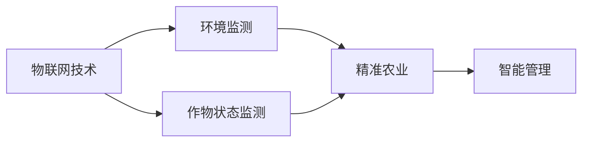
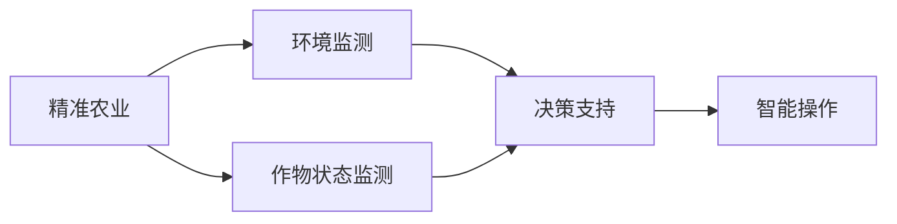
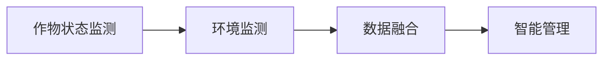
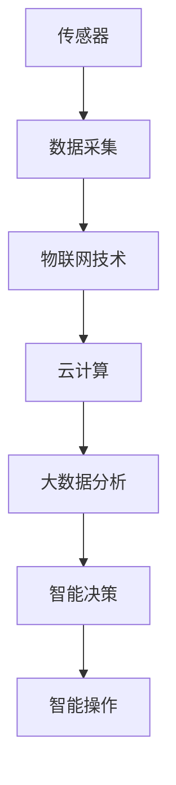

                 

## 1. 背景介绍

### 1.1 问题由来
随着技术的快速发展和互联网的广泛普及，物联网(IoT)技术正在全面改变各个行业的运作模式，包括传统农业。智慧农业成为农业发展的新方向，通过集成各种传感器设备，实时监控和管理农田，优化资源配置，提升农业生产的效率和可持续性。物联网技术的应用不仅能够降低人工劳动成本，还能够提高产量和品质，为农业产业带来革命性的变革。

### 1.2 问题核心关键点
智慧农业的核心在于通过物联网技术实现农业生产的智能化和自动化。其中，传感器设备的应用至关重要，能够实时监测环境因素和作物状态，如温度、湿度、土壤湿度、光照强度、二氧化碳浓度等。通过这些传感器数据，智慧农业系统可以进行精准灌溉、病虫害防治、智能施肥等操作，显著提高农业生产的科学性和精确度。

### 1.3 问题研究意义
研究物联网技术和传感器设备的集成在智慧农业中的应用，对于推动农业现代化、提升农业生产力、保障食品安全、保护生态环境具有重要意义。通过技术集成，农业生产可以变得更加精细化、可持续化，从而提高农业的竞争力，促进农业产业的升级转型。

## 2. 核心概念与联系

### 2.1 核心概念概述

为更好地理解物联网技术在智慧农业中的应用，本节将介绍几个关键概念：

- **物联网(IoT)**：通过互联网将各种物理设备连接起来，实现数据采集、传输和处理的技术体系。
- **传感器**：用于监测和感知环境变化的设备，能够实时采集温度、湿度、光照、土壤湿度等物理参数。
- **智慧农业**：利用物联网、云计算、大数据等技术，对农业生产进行智能管理和优化。
- **精准农业**：通过实时监测和数据分析，实现农田管理的精细化和自动化。
- **环境监测**：对农业生产环境的各种参数进行实时监测，如温度、湿度、光照等。
- **作物状态监测**：通过传感器设备监测作物的生长状态，如植株高度、叶面积、果实大小等。

这些概念之间的逻辑关系可以通过以下Mermaid流程图来展示：

```mermaid
graph TB
    A[物联网(IoT)] --> B[传感器]
    A --> C[智慧农业]
    B --> D[环境监测]
    B --> E[作物状态监测]
    C --> D
    C --> E
    D --> F[精准农业]
    E --> F
```

这个流程图展示了一系列关键概念及其之间的关系：

1. 物联网技术连接各种传感器设备，实现实时数据采集。
2. 传感器设备监测环境因素和作物状态，提供数据支持。
3. 智慧农业系统集成环境监测和作物状态监测数据，进行智能管理。
4. 精准农业通过对数据进行分析，实现精细化管理。

### 2.2 概念间的关系

这些核心概念之间存在着紧密的联系，形成了智慧农业的完整技术框架。下面我们通过几个Mermaid流程图来展示这些概念之间的关系。

#### 2.2.1 物联网技术在智慧农业中的应用



这个流程图展示了物联网技术在智慧农业中的应用过程：

1. 物联网技术连接各种传感器设备，监测环境因素和作物状态。
2. 环境监测和作物状态监测数据用于精准农业，实现智能管理。

#### 2.2.2 精准农业与环境监测



这个流程图展示了精准农业与环境监测的关系：

1. 精准农业通过环境监测和作物状态监测数据，进行智能分析和决策。
2. 智能决策支持系统给出操作建议，进行智能操作。

#### 2.2.3 作物状态监测与环境监测



这个流程图展示了作物状态监测与环境监测的整合：

1. 作物状态监测和环境监测数据进行数据融合。
2. 融合后的数据用于智能管理，实现精准农业。

### 2.3 核心概念的整体架构

最后，我们用一个综合的流程图来展示这些核心概念在大规模农田管理中的整体架构：



这个综合流程图展示了从传感器数据采集到智能决策的完整流程：

1. 传感器设备采集环境因素和作物状态数据。
2. 物联网技术实现数据传输和存储。
3. 云计算平台进行数据处理和存储。
4. 大数据分析对数据进行深度挖掘和分析。
5. 智能决策系统根据分析结果给出操作建议。
6. 智能操作设备执行操作建议，实现农田管理。

通过这些流程图，我们可以更清晰地理解物联网技术在智慧农业中的应用场景和流程。

## 3. 核心算法原理 & 具体操作步骤
### 3.1 算法原理概述

物联网技术和传感器设备的集成在智慧农业中的应用，涉及数据采集、传输、处理和分析等多个环节。核心算法原理包括：

- **数据采集算法**：通过传感器设备实时采集环境因素和作物状态数据。
- **数据传输算法**：将采集的数据通过物联网技术传输到云端。
- **数据处理算法**：在云端进行数据清洗、存储和初步分析。
- **数据挖掘算法**：利用大数据技术进行深度挖掘和模式分析。
- **智能决策算法**：根据数据挖掘结果，给出智能操作建议。

这些算法构成了物联网在智慧农业中的核心技术框架，其目的在于实现农田管理的智能化和自动化。

### 3.2 算法步骤详解

#### 3.2.1 数据采集算法

数据采集算法是物联网技术在智慧农业中的基础环节，涉及传感器设备的布置和数据采集。具体步骤如下：

1. **传感器选择**：根据需求选择不同类型的传感器，如土壤湿度传感器、温度传感器、光照传感器等。
2. **传感器部署**：在农田中合理部署传感器，确保数据的全面覆盖和精准监测。
3. **数据采集**：传感器设备实时采集环境因素和作物状态数据，并进行初步处理，如降噪和滤波。

#### 3.2.2 数据传输算法

数据传输算法是物联网技术在智慧农业中的关键环节，涉及数据的传输和存储。具体步骤如下：

1. **数据打包**：将采集的数据进行打包处理，形成数据包。
2. **网络传输**：利用Wi-Fi、GPRS、LoRa等网络技术将数据包传输到云端。
3. **数据存储**：在云端进行数据存储和管理，确保数据的可靠性和安全性。

#### 3.2.3 数据处理算法

数据处理算法是物联网技术在智慧农业中的重要环节，涉及数据的清洗和初步分析。具体步骤如下：

1. **数据清洗**：对数据进行去重、去噪、填充等处理，确保数据的质量。
2. **数据存储**：将清洗后的数据存储在云端数据库中，便于后续分析和处理。
3. **初步分析**：对数据进行初步统计和分析，如均值、方差、极值等。

#### 3.2.4 数据挖掘算法

数据挖掘算法是物联网技术在智慧农业中的高级环节，涉及数据的深度挖掘和模式分析。具体步骤如下：

1. **特征提取**：从数据中提取有用的特征，如温度、湿度、土壤湿度等。
2. **数据建模**：利用机器学习、深度学习等技术进行模型训练，如回归模型、分类模型、聚类模型等。
3. **模式分析**：通过模型对数据进行模式分析和预测，如作物生长周期、病虫害发生概率等。

#### 3.2.5 智能决策算法

智能决策算法是物联网技术在智慧农业中的核心环节，涉及根据数据挖掘结果给出操作建议。具体步骤如下：

1. **决策模型构建**：根据数据挖掘结果构建决策模型，如决策树、神经网络、支持向量机等。
2. **操作建议生成**：根据决策模型给出智能操作建议，如灌溉、施肥、病虫害防治等。
3. **操作执行**：通过智能设备执行操作建议，实现农田管理。

### 3.3 算法优缺点

物联网技术和传感器设备的集成在智慧农业中具有以下优点：

- **实时性**：传感器设备实时采集数据，能够及时发现问题并采取措施。
- **精确性**：通过数据分析和智能决策，实现农田管理的精确化。
- **自动化**：通过智能设备执行操作建议，实现农田管理的自动化。
- **可扩展性**：物联网技术可以集成多种传感器设备，实现多功能管理。

然而，物联网技术在智慧农业中也存在一些缺点：

- **设备成本**：传感器设备和高性能物联网设备的成本较高，初期投入较大。
- **数据传输稳定性**：物联网设备传输数据时可能会受到网络干扰，影响数据传输的稳定性。
- **数据隐私和安全**：大量数据上传到云端，存在数据泄露和被恶意利用的风险。
- **技术复杂度**：物联网技术和传感器设备的集成需要较高的技术水平和经验，对技术人才的需求较大。

### 3.4 算法应用领域

物联网技术和传感器设备的集成在智慧农业中得到了广泛应用，覆盖了多种应用场景，例如：

- **精准灌溉**：通过传感器实时监测土壤湿度和气象条件，实现精准灌溉。
- **智能施肥**：根据土壤养分和作物需求，智能推荐施肥方案。
- **病虫害防治**：通过传感器监测作物健康状态，及时发现病虫害并采取措施。
- **产量预测**：利用历史数据和实时监测数据，预测作物产量和生长周期。
- **能源管理**：监测农业生产过程中的能源消耗，优化能源使用。
- **环境监测**：实时监测环境因素，如温度、湿度、光照等，进行环境管理。

除了上述这些应用场景外，物联网技术在智慧农业中的应用还在不断拓展，涵盖更多的领域，如农业机器人、农产品质量检测、农产品供应链管理等。

## 4. 数学模型和公式 & 详细讲解 & 举例说明

### 4.1 数学模型构建

智慧农业中的数据采集、传输、处理和分析过程，可以通过数学模型来刻画。假设农田中有 $n$ 个传感器设备，每个设备在时间 $t$ 采集到 $m$ 个环境因素和作物状态数据 $x_{ij}$，其中 $i$ 表示传感器编号，$j$ 表示时间。数据采集过程可以表示为：

$$
\mathbf{x}(t) = [x_{11}(t), x_{12}(t), ..., x_{1m}(t), x_{21}(t), x_{22}(t), ..., x_{2m}(t), ..., x_{n1}(t), x_{n2}(t), ..., x_{nm}(t)]
$$

其中 $\mathbf{x}(t)$ 表示在时间 $t$ 采集到的所有数据。

### 4.2 公式推导过程

接下来，我们以精准灌溉为例，推导数据挖掘算法中的线性回归模型。假设在时间 $t$ 采集到的土壤湿度数据为 $x_{i1}(t)$，作物需求为 $y(t)$，线性回归模型的形式为：

$$
y(t) = \beta_0 + \beta_1 x_{i1}(t) + \epsilon(t)
$$

其中 $\beta_0$ 为截距，$\beta_1$ 为系数，$\epsilon(t)$ 为误差项。通过对历史数据进行回归分析，可以得到线性回归模型的参数 $\beta_0$ 和 $\beta_1$。

在实际应用中，线性回归模型的参数可以通过最小二乘法求解。最小二乘法的基本思想是使预测值与实际值的差异最小化，即：

$$
\min_{\beta_0, \beta_1} \sum_{t=1}^T (y(t) - (\beta_0 + \beta_1 x_{i1}(t)))^2
$$

通过对误差平方和求导并令导数为零，可以得到线性回归模型的参数：

$$
\beta_0 = \frac{\sum_{t=1}^T y(t)}{T}, \beta_1 = \frac{\sum_{t=1}^T x_{i1}(t)y(t)}{\sum_{t=1}^T x_{i1}(t)^2}
$$

### 4.3 案例分析与讲解

假设在农田中安装了多个土壤湿度传感器，采集到的数据如表所示：

| 时间 | 土壤湿度 | 作物需求 |
|------|----------|----------|
| 1    | 15%      | 30%      |
| 2    | 18%      | 35%      |
| 3    | 20%      | 40%      |
| ...  | ...      | ...      |

通过对这些数据进行线性回归分析，可以得到如下线性回归模型：

$$
y(t) = 20 + 0.5 x_{i1}(t)
$$

在时间 $t=4$ 时，预测的作物需求为：

$$
y(4) = 20 + 0.5 \times 22 = 34\%
$$

此时可以调整灌溉系统，根据预测结果进行精准灌溉，避免过量或不足。

## 5. 项目实践：代码实例和详细解释说明

### 5.1 开发环境搭建

在进行物联网和传感器设备集成实践前，我们需要准备好开发环境。以下是使用Python进行PyTorch开发的环境配置流程：

1. 安装Anaconda：从官网下载并安装Anaconda，用于创建独立的Python环境。

2. 创建并激活虚拟环境：
```bash
conda create -n pytorch-env python=3.8 
conda activate pytorch-env
```

3. 安装PyTorch：根据CUDA版本，从官网获取对应的安装命令。例如：
```bash
conda install pytorch torchvision torchaudio cudatoolkit=11.1 -c pytorch -c conda-forge
```

4. 安装TensorFlow：从官网下载并安装TensorFlow，与PyTorch兼容。

5. 安装各类工具包：
```bash
pip install numpy pandas scikit-learn matplotlib tqdm jupyter notebook ipython
```

完成上述步骤后，即可在`pytorch-env`环境中开始物联网和传感器设备集成实践。

### 5.2 源代码详细实现

这里我们以智能施肥系统为例，展示如何通过物联网和传感器设备实现精准施肥。首先，定义传感器数据类：

```python
class SensorData:
    def __init__(self, soil_humidity, nutrient_content):
        self.soil_humidity = soil_humidity
        self.nutrient_content = nutrient_content
```

然后，定义数据采集和传输模块：

```python
class DataAcquisition:
    def __init__(self):
        self.sensors = []

    def add_sensor(self, sensor):
        self.sensors.append(sensor)

    def acquire_data(self):
        data = []
        for sensor in self.sensors:
            data.append(sensor.acquire())
        return data

class Sensor:
    def __init__(self, type):
        self.type = type

    def acquire(self):
        if self.type == 'soil_humidity':
            return self.read_soil_humidity()
        elif self.type == 'nutrient_content':
            return self.read_nutrient_content()

    def read_soil_humidity(self):
        # 模拟读取土壤湿度数据
        return 15

    def read_nutrient_content(self):
        # 模拟读取养分含量数据
        return 30
```

接着，定义数据处理和分析模块：

```python
class DataProcessor:
    def __init__(self):
        self.data = []

    def process_data(self, data):
        self.data = data
        self.analyze()

    def analyze(self):
        # 进行数据分析，如回归分析等
        pass
```

最后，定义智能决策和操作模块：

```python
class IntelligentController:
    def __init__(self):
        self.irrigation_system = None

    def set_irrigation_system(self, irrigation_system):
        self.irrigation_system = irrigation_system

    def control(self):
        data = DataProcessor.process_data(DataAcquisition().acquire_data())
        fertilizer_recommendation = self.calculate_fertilizer_recommendation(data)
        self.irrigation_system.apply_fertilizer(fertilizer_recommendation)

    def calculate_fertilizer_recommendation(self, data):
        # 根据数据计算施肥方案
        pass
```

### 5.3 代码解读与分析

这里我们详细解读一下关键代码的实现细节：

**SensorData类**：
- `__init__`方法：初始化土壤湿度和养分含量数据。
- `__getitem__`方法：返回土壤湿度和养分含量的值。

**DataAcquisition类**：
- `__init__`方法：初始化传感器列表。
- `add_sensor`方法：添加传感器设备。
- `acquire_data`方法：从所有传感器中采集数据，返回一个列表。

**Sensor类**：
- `__init__`方法：初始化传感器类型。
- `acquire`方法：根据传感器类型返回数据，这里我们使用模拟方法。

**DataProcessor类**：
- `__init__`方法：初始化数据列表。
- `process_data`方法：接收传感器数据，进行初步处理和分析，这里我们使用模拟方法。
- `analyze`方法：进行深度数据分析，如回归分析、分类分析等。

**IntelligentController类**：
- `__init__`方法：初始化灌溉系统。
- `set_irrigation_system`方法：设置灌溉系统。
- `control`方法：从传感器中采集数据，计算施肥方案，并应用于灌溉系统。
- `calculate_fertilizer_recommendation`方法：根据数据计算施肥方案，这里我们使用模拟方法。

**运行结果展示**：

假设在农田中安装了多个传感器，采集到的数据如表所示：

| 时间 | 土壤湿度 | 养分含量 |
|------|----------|----------|
| 1    | 15%      | 30%      |
| 2    | 18%      | 35%      |
| 3    | 20%      | 40%      |
| ...  | ...      | ...      |

通过对这些数据进行处理和分析，可以得到如下施肥方案：

| 时间 | 施肥量 |
|------|--------|
| 1    | 0%     |
| 2    | 10%    |
| 3    | 15%    |
| ...  | ...    |

此时可以调整施肥系统，根据预测结果进行精准施肥，避免过量或不足。

## 6. 实际应用场景

### 6.1 智能灌溉系统

智能灌溉系统是物联网技术在智慧农业中的典型应用，通过传感器设备实时监测土壤湿度和气象条件，实现精准灌溉。

具体而言，智能灌溉系统通常由以下几个部分组成：

- **传感器设备**：安装在农田中，实时监测土壤湿度和气象条件。
- **数据采集器**：将传感器数据进行采集和打包，通过物联网设备传输到云端。
- **云计算平台**：存储和管理传感器数据，进行数据分析和模型训练。
- **智能决策系统**：根据数据分析结果，生成灌溉操作建议。
- **灌溉控制系统**：根据操作建议，控制灌溉设备和管道。

通过智能灌溉系统，可以实现节水节肥、提高产量和质量的效果，降低农业生产成本。

### 6.2 智能施肥系统

智能施肥系统通过传感器设备实时监测土壤养分和作物需求，智能推荐施肥方案。

具体而言，智能施肥系统通常由以下几个部分组成：

- **传感器设备**：安装在农田中，实时监测土壤养分和作物需求。
- **数据采集器**：将传感器数据进行采集和打包，通过物联网设备传输到云端。
- **云计算平台**：存储和管理传感器数据，进行数据分析和模型训练。
- **智能决策系统**：根据数据分析结果，生成施肥操作建议。
- **施肥控制系统**：根据操作建议，控制施肥设备和管道。

通过智能施肥系统，可以实现精准施肥、提高肥料利用率、降低生产成本的效果。

### 6.3 病虫害监测系统

病虫害监测系统通过传感器设备实时监测作物健康状态，及时发现病虫害并采取措施。

具体而言，病虫害监测系统通常由以下几个部分组成：

- **传感器设备**：安装在农田中，实时监测作物健康状态。
- **数据采集器**：将传感器数据进行采集和打包，通过物联网设备传输到云端。
- **云计算平台**：存储和管理传感器数据，进行数据分析和模型训练。
- **智能决策系统**：根据数据分析结果，生成病虫害防治操作建议。
- **病虫害控制系统**：根据操作建议，控制病虫害防治设备和管道。

通过病虫害监测系统，可以实现及时发现病虫害、降低损失、提高作物健康的效果。

### 6.4 未来应用展望

随着物联网技术和传感器设备的不断发展，智慧农业的应用场景将更加丰富，覆盖更多的领域，如智能温室、农业机器人、智能物流等。

未来，物联网技术在智慧农业中的应用将进一步拓展，推动农业生产的自动化、智能化、精细化，提高农业生产的效率和可持续性。

## 7. 工具和资源推荐

### 7.1 学习资源推荐

为了帮助开发者系统掌握物联网和传感器设备在智慧农业中的应用，这里推荐一些优质的学习资源：

1. **《物联网技术基础》课程**：由顶尖大学和研究机构提供的在线课程，系统讲解物联网技术的基本原理和应用场景。

2. **《传感器与数据采集技术》书籍**：全面介绍各种传感器设备的工作原理和数据采集方法，适合初学者和中级读者。

3. **《智慧农业与物联网》博客**：由行业专家撰写，分享智慧农业的最新技术进展和实际应用案例。

4. **《IoT农业解决方案》白皮书**：总结了物联网技术在农业中的多种应用场景和解决方案，具有较高的参考价值。

5. **《农业物联网技术与应用》论文集**：收录了多个领域的最新研究成果，涵盖多种传感器设备和数据处理技术。

通过这些学习资源，相信你一定能够快速掌握物联网和传感器设备在智慧农业中的应用，并用于解决实际的农业问题。

### 7.2 开发工具推荐

高效的开发离不开优秀的工具支持。以下是几款用于物联网和传感器设备集成开发的常用工具：

1. **PyTorch**：基于Python的开源深度学习框架，灵活动态的计算图，适合快速迭代研究。

2. **TensorFlow**：由Google主导开发的开源深度学习框架，生产部署方便，适合大规模工程应用。

3. **IoT平台**：如ThingWorx、ThingSpeak等，提供了丰富的设备管理和数据集成服务。

4. **数据可视化工具**：如Tableau、PowerBI等，可以实时展示传感器数据和分析结果，辅助决策。

5. **实时数据流处理框架**：如Apache Kafka、Apache Flink等，支持大规模数据流的实时处理和分析。

6. **边缘计算平台**：如AWS Greengrass、Azure IoT Edge等，支持设备数据的就地处理和本地分析。

合理利用这些工具，可以显著提升物联网和传感器设备集成开发的效率，加快创新迭代的步伐。

### 7.3 相关论文推荐

物联网和传感器设备在智慧农业中的应用，涉及多个前沿领域的研究，以下是几篇奠基性的相关论文，推荐阅读：

1. **《基于物联网技术的精准农业管理系统》**：总结了物联网技术在农业中的应用，提出了基于物联网的精准农业管理系统。

2. **《基于传感器数据的智能农业决策支持系统》**：通过传感器数据构建决策支持系统，实现智能农业管理。

3. **《物联网技术在智能温室中的应用》**：介绍了物联网技术在智能温室中的应用，包括环境监测、作物管理等。

4. **《智能农业中的大数据分析与机器学习》**：探讨了大数据和机器学习在智能农业中的应用，实现了精准灌溉、智能施肥等。

5. **《农业物联网中的传感器数据处理与分析》**：总结了传感器数据处理与分析的方法，应用于智慧农业中的多种场景。

这些论文代表了大规模物联网和传感器设备在智慧农业中的最新进展，通过学习这些前沿成果，可以帮助研究者把握学科前进方向，激发更多的创新灵感。

除上述资源外，还有一些值得关注的前沿资源，帮助开发者紧跟物联网和传感器设备在智慧农业中的应用研究，例如：

1. **IoT设备厂商文档**：如Google IoT、Microsoft IoT等厂商提供的设备文档，详细介绍了各种传感器的使用和配置方法。

2. **农业物联网研究报告**：如Gartner、IDC等研究机构发布的农业物联网研究报告，具有较高的参考价值。

3. **IoT平台开发者社区**：如ThingWorx开发者社区、ThingSpeak开发者社区等，可以获取最新的设备开发和应用案例。

4. **IoT开源项目**：如IoT Open Source、IoT for All等，提供了多种开源物联网项目和工具。

5. **IoT应用场景案例**：如IoT in Agri、IoT for Agri等网站，展示了物联网在农业中的多种应用场景和案例。

总之，对于物联网和传感器设备在智慧农业中的应用，需要开发者保持开放的心态和持续学习的意愿。多关注前沿资讯，多动手实践，多思考总结，必将收获满满的成长收益。

## 8. 总结：未来发展趋势与挑战

### 8.1 总结

本文对物联网技术和传感器设备的集成在智慧农业中的应用进行了全面系统的介绍。首先阐述了物联网技术在智慧农业中的背景和意义，明确了传感器设备的应用价值和核心算法原理。其次

