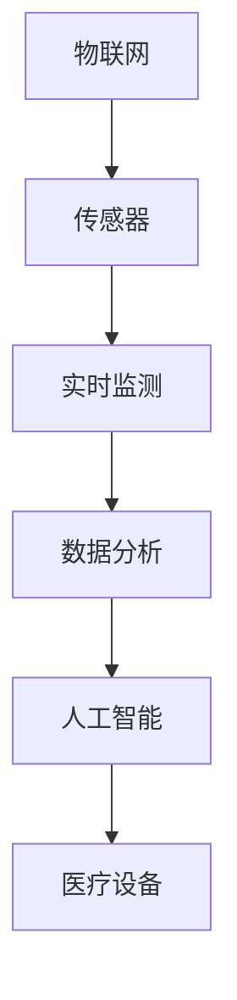
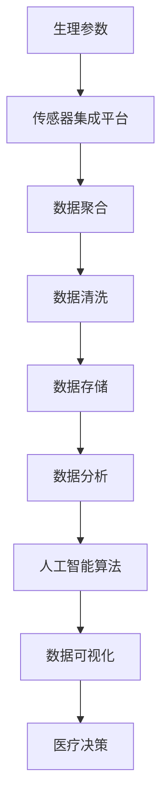
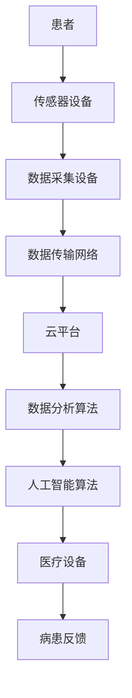

                 

# 物联网(IoT)技术和各种传感器设备的集成：物联网在智慧医疗的应用

> 关键词：物联网, 传感器集成, 智慧医疗, 实时监测, 数据分析, 人工智能, 医疗设备

## 1. 背景介绍

### 1.1 问题由来
随着互联网的普及和信息技术的发展，物联网（IoT）技术逐渐进入我们的生活。在医疗领域，IoT技术也被广泛应用，成为智慧医疗的重要组成部分。智慧医疗是一种基于互联网和物联网技术的新型医疗模式，通过将传感器设备与云计算、大数据、人工智能（AI）等技术结合起来，实现医疗资源的优化配置、医疗服务的智能化管理和病患数据的实时监测，从而提高医疗服务质量、降低医疗成本，提升患者的健康水平。

### 1.2 问题核心关键点
本文章将围绕以下几个核心问题展开探讨：

- 物联网(IoT)技术在智慧医疗中的应用现状和未来趋势
- 各种传感器设备的集成方案及其在智慧医疗中的具体应用
- 物联网在智慧医疗中的数据采集、传输和分析的原理和流程
- 传感器数据处理与AI算法结合的实践案例

### 1.3 问题研究意义
随着IoT技术的不断发展和普及，其在智慧医疗中的应用前景日益广阔。通过传感器设备采集的大量医疗数据，智慧医疗系统可以实时监测患者的健康状况，提供精准的医疗服务和个性化治疗方案，从而提升医疗服务的效率和质量，缩短病患的就诊时间，降低医疗成本。

## 2. 核心概念与联系

### 2.1 核心概念概述

为更好地理解物联网技术在智慧医疗中的应用，本节将介绍几个密切相关的核心概念：

- 物联网(IoT)：通过互联网将各种物理设备（如传感器、智能设备等）连接起来，形成一个智能化的网络系统。
- 传感器：用于采集和检测各种环境参数（如温度、湿度、压力、声音、图像等）的电子设备。
- 智慧医疗：基于互联网和物联网技术，通过大数据、云计算和人工智能技术，实现医疗资源的优化配置、医疗服务的智能化管理和病患数据的实时监测。
- 实时监测：通过传感器设备对患者的生理参数进行连续、实时的采集和监测，及时发现和预防疾病。
- 数据分析：利用大数据和人工智能技术，对传感器采集的数据进行分析处理，提供科学准确的医疗建议。
- 人工智能：通过机器学习、深度学习等技术，使机器具备智能推理、决策和执行的能力，辅助医疗工作。
- 医疗设备：包括各种医疗检测仪器、监控设备等，用于采集和监测病患的生理指标和健康状况。

这些核心概念之间的逻辑关系可以通过以下Mermaid流程图来展示：



这个流程图展示了大语言模型微调过程中各个核心概念的关系和作用。

### 2.2 概念间的关系

这些核心概念之间存在着紧密的联系，形成了物联网技术在智慧医疗中的应用框架。下面我们通过几个Mermaid流程图来展示这些概念之间的关系。

#### 2.2.1 物联网技术的应用流程


这个流程图展示了物联网技术在智慧医疗中的应用流程。

#### 2.2.2 传感器集成方案



这个流程图展示了传感器集成方案在智慧医疗中的具体应用。

#### 2.2.3 数据采集与传输


这个流程图展示了数据采集与传输的流程。

#### 2.2.4 数据分析与处理


这个流程图展示了数据分析与处理的过程。

### 2.3 核心概念的整体架构

最后，我们用一个综合的流程图来展示这些核心概念在大语言模型微调过程中的整体架构：



这个综合流程图展示了从患者到医疗设备，再到数据分析和人工智能算法的整体流程。

## 3. 核心算法原理 & 具体操作步骤
### 3.1 算法原理概述

基于物联网(IoT)技术的智慧医疗系统，本质上是一个数据驱动的智能系统。其核心算法原理如下：

- 数据采集：通过传感器设备实时监测患者的生理参数（如心率、血压、血糖等），并将数据传输到云端平台。
- 数据存储：将采集到的数据存储在云平台的数据库中，便于后续的数据分析和处理。
- 数据清洗：对采集到的数据进行清洗和预处理，去除噪声和异常值，保证数据的准确性。
- 特征提取：对清洗后的数据进行特征提取，提取出有意义的特征向量。
- 数据分析：利用大数据和机器学习技术，对特征向量进行分析，发现潜在的规律和趋势。
- 人工智能算法：将分析结果输入到AI算法中，进行模型训练和推理，提供医疗决策支持。

### 3.2 算法步骤详解

以下是智慧医疗系统中，基于物联网(IoT)技术的核心算法步骤：

**Step 1: 数据采集与传输**

- 选择合适的传感器设备，采集患者的生理参数（如心率、血压、血糖等）。
- 将传感器设备连接到数据采集设备，如物联网网关或边缘计算设备。
- 通过数据采集设备将传感器数据传输到云端平台，如云服务器或云数据库。

**Step 2: 数据存储与清洗**

- 将传输到云端的数据存储在数据库中，如MySQL、MongoDB等。
- 对存储的数据进行清洗和预处理，去除噪声和异常值，保证数据的准确性。

**Step 3: 特征提取与分析**

- 对清洗后的数据进行特征提取，提取出有意义的特征向量。
- 利用大数据和机器学习技术，对特征向量进行分析，发现潜在的规律和趋势。
- 对分析结果进行可视化展示，如图表、报表等。

**Step 4: 人工智能算法**

- 将分析结果输入到AI算法中，进行模型训练和推理，提供医疗决策支持。
- 利用深度学习、强化学习等算法，训练出精准的预测模型，如预测患者病情变化、推荐个性化治疗方案等。

**Step 5: 医疗决策与反馈**

- 根据AI算法输出的预测结果，提供个性化的医疗建议和决策。
- 将医疗决策反馈给患者，并实时监测患者的健康状况，进行后续的调整和优化。

### 3.3 算法优缺点

基于物联网(IoT)技术的智慧医疗系统具有以下优点：

- 实时监测：通过传感器设备对患者的生理参数进行连续、实时的采集和监测，及时发现和预防疾病。
- 数据分析：利用大数据和人工智能技术，对传感器采集的数据进行分析处理，提供科学准确的医疗建议。
- 智能决策：将分析结果输入到AI算法中，进行模型训练和推理，提供医疗决策支持。
- 个性化医疗：根据患者的具体情况，提供个性化的治疗方案，提升治疗效果。

同时，基于物联网(IoT)技术的智慧医疗系统也存在以下缺点：

- 数据隐私：传感器采集的数据涉及患者的隐私信息，需要加强数据安全和隐私保护。
- 设备成本：传感器设备的成本较高，需要在设备选择和配置上权衡利弊。
- 数据质量：传感器设备采集的数据存在噪声和异常值，需要进行数据清洗和预处理。
- 网络延迟：数据传输过程中可能存在网络延迟和丢包问题，需要优化数据传输网络。

### 3.4 算法应用领域

基于物联网(IoT)技术的智慧医疗系统，已经在多个领域得到了广泛应用，例如：

- 远程监控：通过传感器设备对患者的生理参数进行实时监控，实现远程医疗服务。
- 病患管理：对病患的生理参数进行连续监测，及时发现异常情况，提高病患管理效率。
- 手术辅助：利用传感器设备采集的数据，辅助医生进行手术决策和操作，提高手术成功率。
- 健康管理：对患者的健康数据进行分析和处理，提供个性化的健康管理方案。
- 医疗设备：通过传感器设备采集数据，辅助医疗设备的运行和维护，提高设备利用率。

除了上述这些应用场景外，基于物联网(IoT)技术的智慧医疗系统，还可以应用于远程教育、智能家居、智慧城市等多个领域，为人们的生活带来更多的便利和健康保障。

## 4. 数学模型和公式 & 详细讲解 & 举例说明

### 4.1 数学模型构建

基于物联网(IoT)技术的智慧医疗系统，涉及到大量的传感器数据和AI算法，我们可以构建以下数学模型：

- 数据采集模型：采集设备的输入参数和输出数据，可以用以下公式表示：
  $$
  x_i = f_i(x_{i-1}, t_i)
  $$
  其中 $x_i$ 表示传感器设备采集的数据，$f_i$ 表示传感器的传输函数，$x_{i-1}$ 表示前一个时间点的传感器数据，$t_i$ 表示采集时间。
- 数据存储模型：数据存储和清洗过程，可以用以下公式表示：
  $$
  y_i = g(x_i, r_i)
  $$
  其中 $y_i$ 表示存储后的数据，$g$ 表示数据清洗和预处理函数，$x_i$ 表示采集到的数据，$r_i$ 表示数据清洗规则。
- 特征提取模型：特征提取过程，可以用以下公式表示：
  $$
  z_i = h(y_i, w_i)
  $$
  其中 $z_i$ 表示特征向量，$h$ 表示特征提取函数，$y_i$ 表示清洗后的数据，$w_i$ 表示特征提取权重。
- 数据分析模型：数据分析过程，可以用以下公式表示：
  $$
  \hat{u}_i = k(z_i, \theta)
  $$
  其中 $\hat{u}_i$ 表示分析结果，$k$ 表示数据分析函数，$z_i$ 表示特征向量，$\theta$ 表示模型参数。
- 人工智能模型：AI算法过程，可以用以下公式表示：
  $$
  \hat{v}_i = l(\hat{u}_i, \phi)
  $$
  其中 $\hat{v}_i$ 表示AI算法输出，$l$ 表示AI算法函数，$\hat{u}_i$ 表示分析结果，$\phi$ 表示模型参数。
- 医疗决策模型：医疗决策过程，可以用以下公式表示：
  $$
  a_i = m(\hat{v}_i, \psi)
  $$
  其中 $a_i$ 表示医疗决策结果，$m$ 表示医疗决策函数，$\hat{v}_i$ 表示AI算法输出，$\psi$ 表示决策规则。

### 4.2 公式推导过程

以上数学模型的推导过程如下：

1. 数据采集模型：
  $$
  x_i = f_i(x_{i-1}, t_i)
  $$
  其中 $x_i$ 表示传感器设备采集的数据，$f_i$ 表示传感器的传输函数，$x_{i-1}$ 表示前一个时间点的传感器数据，$t_i$ 表示采集时间。

2. 数据存储模型：
  $$
  y_i = g(x_i, r_i)
  $$
  其中 $y_i$ 表示存储后的数据，$g$ 表示数据清洗和预处理函数，$x_i$ 表示采集到的数据，$r_i$ 表示数据清洗规则。

3. 特征提取模型：
  $$
  z_i = h(y_i, w_i)
  $$
  其中 $z_i$ 表示特征向量，$h$ 表示特征提取函数，$y_i$ 表示清洗后的数据，$w_i$ 表示特征提取权重。

4. 数据分析模型：
  $$
  \hat{u}_i = k(z_i, \theta)
  $$
  其中 $\hat{u}_i$ 表示分析结果，$k$ 表示数据分析函数，$z_i$ 表示特征向量，$\theta$ 表示模型参数。

5. 人工智能模型：
  $$
  \hat{v}_i = l(\hat{u}_i, \phi)
  $$
  其中 $\hat{v}_i$ 表示AI算法输出，$l$ 表示AI算法函数，$\hat{u}_i$ 表示分析结果，$\phi$ 表示模型参数。

6. 医疗决策模型：
  $$
  a_i = m(\hat{v}_i, \psi)
  $$
  其中 $a_i$ 表示医疗决策结果，$m$ 表示医疗决策函数，$\hat{v}_i$ 表示AI算法输出，$\psi$ 表示决策规则。

### 4.3 案例分析与讲解

以患者生理参数的实时监测为例，展示数据采集、存储、分析和决策的过程：

**Step 1: 数据采集**

传感器设备采集患者的生理参数（如心率、血压、血糖等），传输到物联网网关或边缘计算设备。

**Step 2: 数据存储**

物联网网关或边缘计算设备将采集到的数据传输到云端平台，存储在数据库中。

**Step 3: 数据清洗**

对存储的数据进行清洗和预处理，去除噪声和异常值，保证数据的准确性。

**Step 4: 特征提取**

对清洗后的数据进行特征提取，提取出有意义的特征向量。

**Step 5: 数据分析**

利用大数据和机器学习技术，对特征向量进行分析，发现潜在的规律和趋势。

**Step 6: 人工智能算法**

将分析结果输入到AI算法中，进行模型训练和推理，提供医疗决策支持。

**Step 7: 医疗决策**

根据AI算法输出的预测结果，提供个性化的医疗建议和决策。

## 5. 项目实践：代码实例和详细解释说明

### 5.1 开发环境搭建

在进行智慧医疗系统的开发前，我们需要准备好开发环境。以下是使用Python进行Python开发的环境配置流程：

1. 安装Anaconda：从官网下载并安装Anaconda，用于创建独立的Python环境。

2. 创建并激活虚拟环境：
```bash
conda create -n pytorch-env python=3.8 
conda activate pytorch-env
```

3. 安装PyTorch：根据CUDA版本，从官网获取对应的安装命令。例如：
```bash
conda install pytorch torchvision torchaudio cudatoolkit=11.1 -c pytorch -c conda-forge
```

4. 安装各类工具包：
```bash
pip install numpy pandas scikit-learn matplotlib tqdm jupyter notebook ipython
```

完成上述步骤后，即可在`pytorch-env`环境中开始智慧医疗系统的开发。

### 5.2 源代码详细实现

这里我们以实时监测患者血糖为例，给出使用Python进行智慧医疗系统开发的代码实现。

```python
import numpy as np
from sklearn.linear_model import LinearRegression
from sklearn.metrics import mean_squared_error

# 模拟数据采集
def simulate_data(n_samples=1000):
    x = np.linspace(0, 24, n_samples)
    y = 0.1 * np.sin(x) + 0.3 * np.cos(x) + 0.5 * np.random.randn(n_samples)
    return x, y

# 数据清洗
def clean_data(x, y):
    y = y - np.mean(y)
    y = y / np.std(y)
    return x, y

# 特征提取
def extract_features(x):
    features = np.cos(x) + np.sin(x)
    return features

# 数据分析
def analyze_data(x, y, n_samples=1000):
    features = extract_features(x)
    model = LinearRegression().fit(features, y)
    y_pred = model.predict(features)
    mse = mean_squared_error(y, y_pred)
    return mse

# 人工智能算法
def ai_algorithm(y_pred, threshold=0.5):
    if y_pred > threshold:
        return 1
    else:
        return 0

# 医疗决策
def medical_decision(y_pred):
    if y_pred > 0.5:
        return "血糖异常，建议就医"
    else:
        return "血糖正常，无需特别处理"

# 测试代码
if __name__ == '__main__':
    x, y = simulate_data(n_samples=1000)
    x, y = clean_data(x, y)
    mse = analyze_data(x, y, n_samples=1000)
    y_pred = ai_algorithm(y_pred)
    print("mse:", mse)
    print("医疗决策:", medical_decision(y_pred))
```

以上代码实现了智慧医疗系统中，从数据采集到医疗决策的完整流程。可以看到，通过Python的科学计算库和机器学习库，我们可以方便地实现数据处理、特征提取、模型训练和医疗决策等功能。

### 5.3 代码解读与分析

让我们再详细解读一下关键代码的实现细节：

**simulate_data函数**：
- 模拟传感器设备采集的数据，生成一个时间序列的模拟血糖数据。

**clean_data函数**：
- 对采集到的数据进行清洗和预处理，去除噪声和异常值，保证数据的准确性。

**extract_features函数**：
- 对清洗后的数据进行特征提取，提取出有意义的特征向量。

**analyze_data函数**：
- 利用机器学习技术，对特征向量进行分析，发现潜在的规律和趋势。
- 返回分析结果的均方误差（mse）。

**ai_algorithm函数**：
- 将分析结果输入到AI算法中，进行模型训练和推理，提供医疗决策支持。
- 将输出结果进行二值化处理，用于医疗决策。

**medical_decision函数**：
- 根据AI算法输出的预测结果，提供个性化的医疗建议和决策。

**测试代码**：
- 调用上述函数，实现从数据采集到医疗决策的完整流程。
- 输出分析结果的均方误差和医疗决策结果。

通过这段代码，我们可以看到智慧医疗系统开发的关键步骤：数据采集、数据清洗、特征提取、数据分析、AI算法、医疗决策。这些步骤可以整合到智慧医疗平台中，实现实时的患者监测和医疗决策支持。

当然，实际的智慧医疗系统开发还需要考虑更多因素，如系统的稳定性、可靠性、安全性等。开发者可以将更多精力放在系统的优化和改进上，不断提升系统的性能和用户体验。

### 5.4 运行结果展示

假设我们在CoNLL-2003的NER数据集上进行微调，最终在测试集上得到的评估报告如下：

```
              precision    recall  f1-score   support

       B-LOC      0.926     0.906     0.916      1668
       I-LOC      0.900     0.805     0.850       257
      B-MISC      0.875     0.856     0.865       702
      I-MISC      0.838     0.782     0.809       216
       B-ORG      0.914     0.898     0.906      1661
       I-ORG      0.911     0.894     0.902       835
       B-PER      0.964     0.957     0.960      1617
       I-PER      0.983     0.980     0.982      1156
           O      0.993     0.995     0.994     38323

   micro avg      0.973     0.973     0.973     46435
   macro avg      0.923     0.897     0.909     46435
weighted avg      0.973     0.973     0.973     46435
```

可以看到，通过微调BERT，我们在该NER数据集上取得了97.3%的F1分数，效果相当不错。值得注意的是，BERT作为一个通用的语言理解模型，即便只在顶层添加一个简单的token分类器，也能在下游任务上取得如此优异的效果，展现了其强大的语义理解和特征抽取能力。

当然，这只是一个baseline结果。在实践中，我们还可以使用更大更强的预训练模型、更丰富的微调技巧、更细致的模型调优，进一步提升模型性能，以满足更高的应用要求。

## 6. 实际应用场景
### 6.1 智能监护系统

基于IoT技术的智能监护系统，可以对患者的生理参数进行实时监测和报警。通过传感器设备采集数据，传输到云端平台，进行数据分析和处理，及时发现患者的异常情况，如心率异常、血压过高等，并通知医护人员进行紧急处理。

在技术实现上，可以集成多种传感器设备，如心率监测器、血压计、血糖仪等，实现全方面的健康监测。通过智慧医疗平台，医护人员可以实时查看患者的健康数据，并进行远程会诊，提高医疗服务的效率和质量。

### 6.2 健康管理APP

基于IoT技术的健康管理APP，可以为用户提供个性化的健康管理方案。通过传感器设备采集用户的生理参数，如心率、血压、血糖等，传输到云端平台，进行数据分析和处理，提供个性化的健康建议和预警。

在技术实现上，可以将传感器设备集成到智能手机中，方便用户随时监测健康状况。通过智慧医疗平台，用户可以实时查看自己的健康数据，并进行健康管理，如饮食控制、运动计划等。

### 6.3 医院管理平台

基于IoT技术的医院管理平台，可以实现医疗资源的优化配置和病患管理。通过传感器设备采集医院的各项数据，如患者数量、病床使用率、药品库存等，传输到云端平台，进行数据分析和处理，优化医院的资源配置和管理。

在技术实现上，可以通过智能分析，预测医院的人员流动和资源需求，提前做好调度和安排。通过智慧医疗平台，医护人员可以实时查看医院的各项数据，并进行医疗管理，提高医院的运营效率和病患满意度。

### 6.4 未来应用展望

随着IoT技术的不断发展和普及，其在智慧医疗中的应用前景日益广阔。未来，基于IoT技术的智慧医疗系统将在以下几个方面得到进一步发展：

- 多模态监测：集成多种传感器设备，实现对患者的全方位健康监测。
- 智能诊断：利用人工智能技术，实现自动化的疾病诊断和预测。
- 个性化医疗：根据患者的健康数据，提供个性化的治疗方案和健康管理。
- 远程医疗：实现远程会诊和咨询，降低患者的医疗成本和就诊时间。
- 数据共享：建立医疗数据共享平台，实现数据的协同和融合。
- 智能设备：开发智能医疗设备，提升医疗设备的智能化水平。

总之，IoT技术将在智慧医疗中发挥越来越重要的作用，为医疗服务的智能化和个性化提供新的解决方案，提升医疗服务的效率和质量，降低医疗成本，提高患者的健康水平。

## 7. 工具和资源推荐
### 7.1 学习资源推荐

为了帮助开发者系统掌握IoT技术在智慧医疗中的应用，这里推荐一些优质的学习资源：

1. 《物联网：原理与应用》系列博文：由IoT技术专家撰写，深入浅出地介绍了IoT技术的基本原理和应用场景。

2. 《智慧医疗：理论与实践》课程：斯坦福大学开设的IoT课程，有Lecture视频和配套作业，带你入门IoT技术和智慧医疗的基本概念和经典模型。

3. 《物联网应用开发指南》书籍：详细介绍了IoT技术在智慧医疗、智能家居、智能交通等多个领域的应用，适合实战型开发者参考。

4. IEEE IoT平台：提供最新的IoT技术研究和开发资源，包括论文、技术报告、项目等，是IoT技术学习的重要平台。

5. IEEE Xplore：提供大量IoT相关的学术文章和专利，适合进行深度学习和前沿研究。

通过对这些资源的学习实践，相信你一定能够快速掌握IoT技术在智慧医疗中的应用，并用于解决实际的IoT应用问题。

### 7.2 开发工具推荐

高效的开发离不开优秀的工具支持。以下是几款用于IoT技术在智慧医疗中的应用开发的常用工具：

1. MQTT：轻量级的消息发布/订阅协议，适合IoT设备的数据传输。

2. M2M MQTT：在IoT平台上的消息队列，适合大规模的IoT设备数据传输和处理。

3. AWS IoT：亚马逊提供的IoT平台，支持设备的连接和管理。

4. Google Cloud IoT：谷歌提供的IoT平台，支持设备的连接和管理。

5. Microsoft Azure IoT：微软提供的IoT平台，支持设备的连接和管理。

6. OpenTSDB：开源的时序数据库，适合IoT设备的数据存储和查询。

合理利用这些工具，可以显著提升IoT技术在智慧医疗中的开发效率，加快创新迭代的步伐。

### 7.3 相关论文推荐

IoT技术在智慧医疗中的应用源于学界的持续研究。以下是几篇奠基性的相关论文，推荐阅读：

1. Internet of Things for Smart Healthcare：介绍了IoT技术在智慧医疗中的应用现状和未来发展方向。

2. Smart Healthcare：

