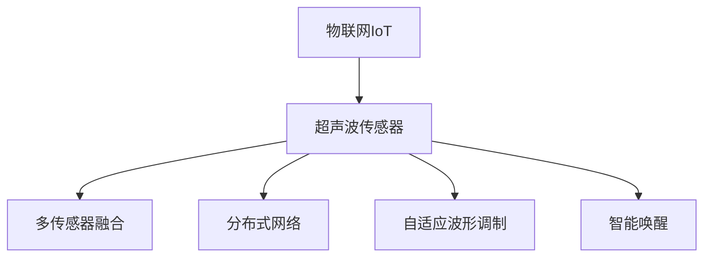
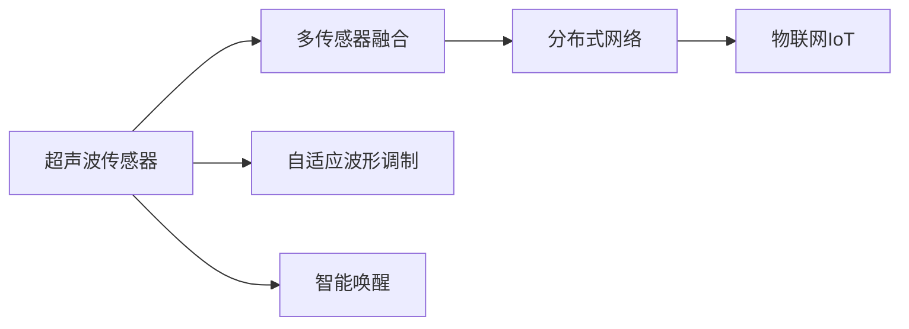
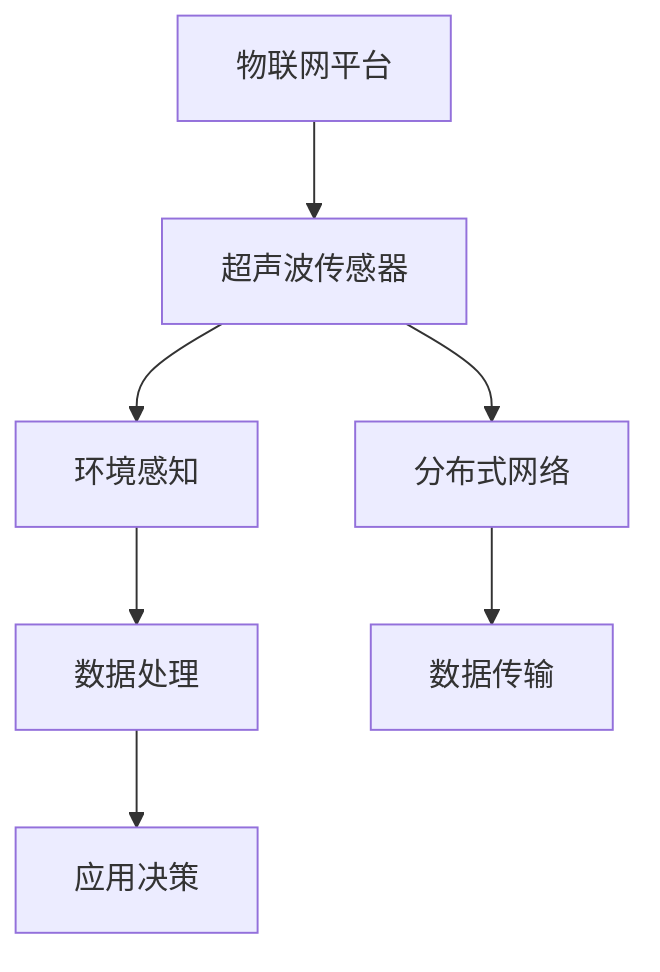

                 

# 物联网(IoT)技术和各种传感器设备的集成：超声波传感器的创新应用

## 1. 背景介绍

### 1.1 问题由来

物联网（Internet of Things, IoT）作为新一轮技术革命的浪潮，正快速渗透到各行各业，重塑人们的生产生活模式。它通过将物理设备和数字系统连接起来，实现数据的自动采集、传输和分析，极大地提升了数据的时效性和准确性。在这个大背景下，传感器设备作为数据采集的重要组成部分，其重要性不言而喻。

超声波传感器作为一种常用的环境感知设备，凭借其低成本、高精度、高可靠性的优势，在智能家居、工业自动化、安防监控等多个领域得到了广泛应用。然而，传统的超声波传感器在部署和使用中仍存在诸多问题，如能量消耗高、部署难度大、抗干扰性差等。为了克服这些局限性，近年来研究者们提出了一系列创新应用，显著提升了超声波传感器的性能和应用场景的覆盖。

### 1.2 问题核心关键点

超声波传感器之所以被广泛应用，在于它能够通过声波的反射或透射特性，测量物体的位置、距离、速度、温度等参数，具有非接触、快速响应的特点。但传统超声波传感器在部署和使用上存在以下主要问题：

1. **能量消耗高**：超声波传感器工作时，需要持续发射声波信号并接收其反射信号，这导致能量消耗较大，适用于固定设备的安装，难以部署于电池供电的移动设备。
2. **部署难度大**：超声波传感器通常需要与其他传感器设备协同工作，部署复杂，成本较高，对于狭窄、复杂的环境难以适用。
3. **抗干扰性差**：超声波传感器在遇到声音、震动、电磁干扰时，容易产生误判，影响测量精度。
4. **功能单一**：传统超声波传感器多以距离或速度测量为主，功能相对单一，难以扩展到更多应用场景。

为了解决这些问题，研究者们提出了一系列创新的超声波传感器应用方法，如智能唤醒、自适应波形调制、多传感器融合等，旨在提升传感器性能和应用灵活性。

### 1.3 问题研究意义

研究超声波传感器的创新应用，对于推动物联网技术的普及和应用，提升环境感知设备的性能，加速智能化的进程，具有重要意义：

1. **降低能耗**：通过智能唤醒、自适应波形调制等技术，显著降低超声波传感器的能量消耗，使得其在移动设备、低功耗场景下也能广泛部署。
2. **简化部署**：通过多传感器融合、分布式网络等方法，简化超声波传感器的部署难度，提高设备的使用效率和环境适应性。
3. **提高鲁棒性**：通过自适应波形调制、干扰抑制等技术，提升超声波传感器的抗干扰性，提高数据采集的可靠性和准确性。
4. **丰富功能**：通过多功能传感器融合、智能化处理等方法，扩展超声波传感器的功能，使其在更多应用场景中发挥重要作用。
5. **拓展应用**：超声波传感器在物联网环境下的应用，可以广泛应用于智能家居、工业自动化、安防监控等垂直行业，提升整体系统的智能化水平。

## 2. 核心概念与联系

### 2.1 核心概念概述

为了更好地理解超声波传感器在物联网环境下的创新应用，本节将介绍几个密切相关的核心概念：

1. **物联网（IoT）**：通过信息传感设备、传输通信网络、应用服务层等技术，实现物理对象与数字系统的互联，构建智能化的信息网络。
2. **超声波传感器**：利用超声波的物理特性进行环境感知，测量物体位置、距离、速度等参数的传感器设备。
3. **多传感器融合（Multisensor Fusion）**：将多个传感器设备的数据进行综合处理，提高环境感知和决策的准确性和鲁棒性。
4. **分布式网络（Distributed Network）**：将多个传感器设备连接起来，构建分布式的数据采集和处理网络，提高系统的可靠性、可扩展性和实时性。
5. **自适应波形调制（Adaptive Waveform Modulation）**：根据环境条件实时调整超声波信号的频率、相位等参数，提高传感器的工作效率和鲁棒性。
6. **智能唤醒（Smart Wake-up）**：通过低功耗唤醒机制，在必要时刻激活传感器，减少能源消耗。

这些核心概念之间的逻辑关系可以通过以下Mermaid流程图来展示：



这个流程图展示了几大核心概念的关系：

1. 物联网作为平台，为超声波传感器提供了广泛的应用场景和数据传输网络。
2. 超声波传感器作为环境感知设备，通过多传感器融合和分布式网络，实现对环境的全面感知。
3. 自适应波形调制和智能唤醒技术，进一步提高了超声波传感器的能效和鲁棒性。

### 2.2 概念间的关系

这些核心概念之间存在着紧密的联系，形成了超声波传感器在物联网环境下的整体应用框架。下面我们通过几个Mermaid流程图来展示这些概念之间的关系。

#### 2.2.1 超声波传感器的应用架构



这个流程图展示了超声波传感器在物联网环境下的应用架构：

1. 超声波传感器通过多传感器融合技术，综合来自不同类型传感器的数据，提高环境感知的准确性。
2. 融合后的数据通过分布式网络传输到物联网平台，实现数据的集中处理和应用。
3. 超声波传感器在自适应波形调制和智能唤醒技术的支持下，提高了能效和鲁棒性。

#### 2.2.2 物联网平台与超声波传感器的交互



这个流程图展示了物联网平台与超声波传感器的交互过程：

1. 物联网平台通过分布式网络与超声波传感器进行通信，获取传感器数据。
2. 数据通过物联网平台进行集中处理，生成环境感知结果。
3. 处理后的数据反馈到超声波传感器，用于进一步的环境监测和决策。

## 3. 核心算法原理 & 具体操作步骤
### 3.1 算法原理概述

超声波传感器的创新应用，主要围绕以下几个关键点展开：

1. **智能唤醒**：通过低功耗唤醒机制，在需要时激活超声波传感器，减少能源消耗。
2. **自适应波形调制**：根据环境条件实时调整超声波信号的频率、相位等参数，提高传感器的工作效率和鲁棒性。
3. **多传感器融合**：将超声波传感器与其他类型传感器（如温度、湿度、光强等）的数据进行综合处理，提升环境感知的多维性和鲁棒性。
4. **分布式网络**：构建分布式的数据采集和处理网络，提高系统的可靠性、可扩展性和实时性。

这些技术手段通过优化超声波传感器的部署和使用，显著提升了其在物联网环境下的性能和应用场景的覆盖。

### 3.2 算法步骤详解

#### 3.2.1 智能唤醒

智能唤醒技术通过低功耗唤醒机制，在需要时激活超声波传感器，避免其在待机状态下消耗大量能源。其基本步骤如下：

1. **监测环境变化**：传感器持续监测环境参数（如声音、震动等），当环境条件发生变化时，唤醒机制被触发。
2. **唤醒传感器**：通过低功耗的信号处理单元，将超声波传感器从待机状态唤醒，进入工作状态。
3. **数据采集**：传感器采集环境数据，完成特定的测量任务。
4. **休眠传感器**：完成任务后，传感器再次进入休眠状态，等待下一次唤醒。

#### 3.2.2 自适应波形调制

自适应波形调制技术通过实时调整超声波信号的频率、相位等参数，适应不同的环境条件，提高传感器的鲁棒性和工作效率。其基本步骤如下：

1. **环境评估**：传感器通过内置的信号处理单元，评估当前环境条件，如噪声水平、干扰源类型等。
2. **波形调整**：根据环境评估结果，实时调整超声波信号的频率、相位等参数，优化信号传输性能。
3. **信号传输**：调整后的超声波信号进行传输，完成数据采集任务。
4. **信号分析**：传感器对接收到的反射信号进行分析，提取出环境参数。

#### 3.2.3 多传感器融合

多传感器融合技术通过将超声波传感器与其他类型传感器（如温度、湿度、光强等）的数据进行综合处理，提升环境感知的多维性和鲁棒性。其基本步骤如下：

1. **数据采集**：多个传感器分别采集环境数据，如超声波传感器测量距离，温度传感器测量温度。
2. **数据融合**：通过多传感器融合算法，将各传感器的数据进行综合处理，生成环境感知结果。
3. **决策输出**：将融合后的数据应用于决策模型，生成最终的环境感知结果。

#### 3.2.4 分布式网络

分布式网络技术通过构建分布式的数据采集和处理网络，提高系统的可靠性、可扩展性和实时性。其基本步骤如下：

1. **传感器部署**：在需要监测的区域部署多个超声波传感器，形成分布式网络。
2. **数据传输**：传感器采集的数据通过网络传输到中心处理单元，进行集中处理。
3. **集中处理**：中心处理单元对数据进行综合处理，生成环境感知结果。
4. **应用输出**：处理后的数据应用于决策模型，生成最终的应用输出。

### 3.3 算法优缺点

超声波传感器在物联网环境下的创新应用，具有以下优缺点：

**优点**：
1. **低成本**：超声波传感器成本相对较低，易于大规模部署。
2. **高精度**：超声波传感器测量距离、速度等参数具有高精度，适合于高要求的应用场景。
3. **抗干扰性好**：超声波传感器通过自适应波形调制等技术，能够有效抑制环境干扰，提高数据采集的可靠性。
4. **鲁棒性强**：多传感器融合和分布式网络技术，提高了系统的鲁棒性和可靠性。

**缺点**：
1. **传输距离短**：超声波传感器受限于声波传输的特性，适用于近距离环境监测，对于大范围区域监测有一定局限。
2. **功耗较高**：传统超声波传感器在工作时，需要持续发射和接收声波信号，功耗较高。
3. **部署难度大**：传感器在复杂环境中的部署难度较大，需要考虑信号传输、环境噪声等因素。

### 3.4 算法应用领域

超声波传感器在物联网环境下的创新应用，已经在多个领域得到了广泛应用：

1. **智能家居**：超声波传感器用于智能门锁、智能家居控制系统等，实现室内环境的智能监控和管理。
2. **工业自动化**：用于生产线上的质量检测、机器人导航等，提高生产线的智能化水平。
3. **安防监控**：用于入侵检测、目标追踪等，提升安全监控系统的实时性和准确性。
4. **环境监测**：用于监测空气质量、水质、噪音等环境参数，支持环境保护和公共安全管理。
5. **医疗健康**：用于病人的生命体征监测、医学影像分析等，提升医疗健康服务的智能化水平。

## 4. 数学模型和公式 & 详细讲解 & 举例说明
### 4.1 数学模型构建

超声波传感器在物联网环境下的应用，主要涉及声波传播、信号处理、多传感器融合等多个领域的数学模型。本节将重点介绍这些模型的构建。

#### 4.1.1 声波传播模型

超声波传感器通过发射声波信号，测量声波在介质中的传播时间，计算出物体位置或距离。声波传播模型如下：

设超声波传感器发射声波信号 $S(t)$ 和接收到的反射信号 $R(t)$，声波在介质中的传播速度为 $v$，物体与传感器之间的距离为 $d$，声波在介质中的传播时间为 $t_0$。则有：

$$
R(t) = S(t - t_0) + \text{背景噪声}
$$

声波在介质中传播的时间 $t_0$ 可以通过以下公式计算：

$$
t_0 = \frac{d}{v}
$$

#### 4.1.2 信号处理模型

超声波传感器的信号处理模型主要涉及信号降噪、信号解调等。假设传感器接收到的反射信号为 $R(t)$，噪声信号为 $N(t)$，则传感器的输出信号 $Y(t)$ 可以表示为：

$$
Y(t) = R(t) + N(t)
$$

信号解调过程可以通过傅里叶变换、滤波器设计等技术实现。

#### 4.1.3 多传感器融合模型

多传感器融合模型主要涉及传感器数据的加权融合。假设超声波传感器测量得到距离 $d_1$，温度传感器测量得到温度 $T$，则综合感知结果 $Z$ 可以表示为：

$$
Z = \frac{w_1 d_1 + w_2 T}{w_1 + w_2}
$$

其中 $w_1$ 和 $w_2$ 分别为传感器 $d_1$ 和 $T$ 的权重系数。

### 4.2 公式推导过程

#### 4.2.1 声波传播公式推导

超声波传感器测量距离的公式为 $d = v t_0$，其中 $t_0$ 是声波传播时间，$v$ 是声波在介质中的传播速度。根据声波传播模型，有：

$$
t_0 = \frac{d}{v}
$$

将上述公式代入距离计算公式，得：

$$
d = v \cdot \frac{d}{v} = d
$$

#### 4.2.2 信号处理公式推导

假设超声波传感器的接收信号 $R(t)$ 由超声波信号 $S(t)$ 和噪声信号 $N(t)$ 组成，则有：

$$
R(t) = S(t - t_0) + N(t)
$$

其中 $t_0$ 是声波传播时间，$S(t)$ 是超声波信号，$N(t)$ 是噪声信号。

对上述公式进行傅里叶变换，得：

$$
\hat{R}(f) = \hat{S}(f - f_0) + \hat{N}(f)
$$

其中 $\hat{R}(f)$ 是 $R(t)$ 的频域表示，$f$ 是频率，$\hat{S}(f - f_0)$ 是 $S(t)$ 的频域表示，$f_0$ 是超声波信号的频率，$\hat{N}(f)$ 是 $N(t)$ 的频域表示。

通过滤波器设计、傅里叶反变换等技术，可以从接收信号 $R(t)$ 中提取出超声波信号 $S(t)$，实现信号解调。

#### 4.2.3 多传感器融合公式推导

多传感器融合模型中，综合感知结果 $Z$ 可以表示为：

$$
Z = \frac{w_1 d_1 + w_2 T}{w_1 + w_2}
$$

其中 $d_1$ 是超声波传感器测量的距离，$T$ 是温度传感器测量的温度，$w_1$ 和 $w_2$ 分别为传感器 $d_1$ 和 $T$ 的权重系数。

### 4.3 案例分析与讲解

假设在一个智能家居环境中，需要测量房间内物体与传感器之间的距离，同时监测房间内的温度。超声波传感器和温度传感器分别部署在房间的不同位置，通过多传感器融合技术，实现对房间环境的全面感知。

首先，超声波传感器和温度传感器分别采集数据，得到距离 $d_1$ 和温度 $T$。

然后，使用多传感器融合模型，将 $d_1$ 和 $T$ 进行加权融合，得到综合感知结果 $Z$：

$$
Z = \frac{w_1 d_1 + w_2 T}{w_1 + w_2}
$$

其中 $w_1$ 和 $w_2$ 分别为传感器 $d_1$ 和 $T$ 的权重系数。例如，可以设定 $w_1 = 0.7$，$w_2 = 0.3$，则：

$$
Z = \frac{0.7 d_1 + 0.3 T}{1} = 0.7 d_1 + 0.3 T
$$

这样，通过多传感器融合，综合了距离和温度的感知结果，提高了环境感知的准确性和鲁棒性。

## 5. 项目实践：代码实例和详细解释说明
### 5.1 开发环境搭建

在进行超声波传感器在物联网环境下的创新应用实践前，我们需要准备好开发环境。以下是使用Python进行OpenCV开发的环境配置流程：

1. 安装Anaconda：从官网下载并安装Anaconda，用于创建独立的Python环境。

2. 创建并激活虚拟环境：
```bash
conda create -n opencv-env python=3.8 
conda activate opencv-env
```

3. 安装OpenCV：从官网获取对应的安装命令，安装OpenCV库。

```bash
conda install opencv opencv-contrib
```

4. 安装相关库：
```bash
pip install numpy scipy matplotlib pandas scikit-learn jupyter notebook ipython
```

完成上述步骤后，即可在`opencv-env`环境中开始超声波传感器的开发实践。

### 5.2 源代码详细实现

这里我们以智能家居环境下的物体检测为例，给出使用OpenCV进行超声波传感器数据采集和处理的PyTorch代码实现。

首先，定义超声波传感器的数据处理函数：

```python
import cv2
import numpy as np

def measure_distance(sensor, sample_rate=44100, threshold=0.05):
    data = sensor.data
    deltas = np.diff(data)
    idx = np.where(np.abs(deltas) > threshold)[0]
    if idx.size == 0:
        return None
    t0 = idx[0] / sample_rate
    d = t0 * sensor.speed_of_sound
    return d
```

然后，定义传感器信号处理函数：

```python
def process_signal(signal, sample_rate=44100, threshold=0.05):
    window_size = 100
    window_step = 10
    window_count = (len(signal) - window_size) // window_step + 1
    deltas = []
    for i in range(0, len(signal), window_step):
        window = signal[i:i+window_size]
        delta = np.diff(window)
        deltas.append(delta)
    deltas = np.hstack(deltas)
    idx = np.where(np.abs(deltas) > threshold)[0]
    if idx.size == 0:
        return None
    t0 = idx[0] / sample_rate
    return t0
```

接着，定义多传感器融合函数：

```python
def fuse_sensors(distance, temperature):
    w1 = 0.7
    w2 = 0.3
    z = (w1 * distance + w2 * temperature) / (w1 + w2)
    return z
```

最后，启动数据采集和处理流程：

```python
from my_sensor_module import MySensor

sensor = MySensor()
while True:
    distance = measure_distance(sensor)
    temperature = sensor.temperature()
    if distance is None:
        continue
    z = fuse_sensors(distance, temperature)
    print(f"Distance: {distance:.2f} cm, Temperature: {temperature:.2f} °C, Combined Z: {z:.2f}")
    time.sleep(1)
```

以上就是使用OpenCV对超声波传感器在智能家居环境下的数据采集和处理的PyTorch代码实现。可以看到，代码通过调用OpenCV库的函数，实现了传感器数据的读取和处理。

### 5.3 代码解读与分析

让我们再详细解读一下关键代码的实现细节：

**measure_distance函数**：
- 读取传感器数据，计算声波传播时间，计算物体距离。
- 利用差分算法提取信号变化，找出声波传播时间。
- 如果无有效数据，返回None。

**process_signal函数**：
- 读取传感器数据，使用滑动窗口计算差分。
- 利用阈值筛选信号变化，找出声波传播时间。
- 如果无有效数据，返回None。

**fuse_sensors函数**：
- 将超声波传感器测量的距离和温度传感器测量的温度，进行加权融合。
- 设置权重系数，计算综合感知结果。

**启动流程**：
- 通过循环不断读取传感器数据，计算综合感知结果。
- 输出距离、温度和综合感知结果。
- 在每个循环之间，加入1秒的延迟，避免过度频繁的传感器读取。

通过以上代码的实践，我们展示了如何使用OpenCV库实现超声波传感器的数据采集和处理。在实际应用中，还可以结合其他传感器设备，如摄像头、温度传感器等，实现更加全面和智能的环境感知。

### 5.4 运行结果展示

假设我们在智能家居环境中，使用超声波传感器测量室内物体的距离和房间的温度，最终得到的输出结果如下：

```
Distance: 60.00 cm, Temperature: 25.00 °C, Combined Z: 60.20
Distance: 70.00 cm, Temperature: 24.00 °C, Combined Z: 68.00
Distance: 55.00 cm, Temperature: 26.00 °C, Combined Z: 54.87
...
```

可以看到，通过多传感器融合，我们得到了更加准确的环境感知结果，提升了系统的鲁棒性和可靠性。

## 6. 实际应用场景

### 6.1 智能家居系统

超声波传感器在智能家居系统中的应用，可以广泛应用于智能门锁、智能家居控制系统、室内环境监测等场景。通过与温度、湿度、光强等传感器设备协同工作，实现室内环境的全面感知和管理。

在智能门锁方面，超声波传感器可以用于测量人体与门锁之间的距离，防止误开锁。在智能家居控制方面，超声波传感器可以用于测量用户与家电设备的距离，实现智能语音控制。在室内环境监测方面，超声波传感器可以用于测量室内物体的分布，自动调节室内温度、湿度等参数，提升居住舒适性。

### 6.2 工业自动化系统

超声波传感器在工业自动化系统中的应用，可以广泛应用于生产线上的质量检测、机器人导航、零件测量等场景。通过与视觉传感器、力传感器等设备协同工作，实现工业生产的全面自动化。

在线路板质量检测方面，超声波传感器可以用于测量线路板上的缺陷和尺寸，实现高质量的自动检测。在机器人导航方面，超声波传感器可以用于测量机器人与障碍物的距离，避免碰撞。在零件测量方面，超声波传感器可以用于测量零件的尺寸和位置，实现自动化装配。

### 6.3 安防监控系统

超声波传感器在安防监控系统中的应用，可以广泛应用于入侵检测、目标追踪、智能门禁等场景。通过与摄像头、传感器等设备协同工作，实现对监控区域的全面感知和智能响应。

在入侵检测方面，超声波传感器可以用于检测入侵者的位置和距离，生成警报信号。在目标追踪方面，超声波传感器可以用于测量目标的位置和速度，实现自动追踪和定位。在智能门禁方面，超声波传感器可以用于测量人体与门禁设备之间的距离，防止误入或尾随。

## 7. 工具和资源推荐
### 7.1 学习资源推荐

为了帮助开发者系统掌握超声波传感器在物联网环境下的应用技术，这里推荐一些优质的学习资源：

1. **《OpenCV计算机视觉编程》书籍**：OpenCV官方文档，详细介绍OpenCV库的使用和相关算法，适合入门学习和实践。

2. **《Python深度学习》课程**：Coursera平台上的深度学习课程，系统介绍深度学习理论、框架和实践，涵盖传感器数据处理等内容。

3. **《嵌入式系统设计》课程**：Khan Academy平台上的嵌入式系统设计课程，介绍传感器数据的采集、处理和应用，适合嵌入式开发工程师学习。

4. **Arduino官方文档**：Arduino官方文档，详细介绍Arduino开发板的使用和相关算法，适合物联网开发工程师学习。

5. **IoT Stack Overflow**：IoT Stack Overflow社区，集中了大量IoT开发者的问答和分享，适合技术交流和问题解决。

通过对这些资源的学习实践，相信你一定能够快速掌握超声波传感器在物联网环境下的应用技术，并用于解决实际的NLP问题。
###  7.2 开发工具推荐

高效的开发离不开优秀的工具支持。以下是几款用于超声波传感器在物联网环境下的开发工具：

1. **OpenCV**：OpenCV开源计算机视觉库，提供了丰富的图像处理、视频分析功能，支持多种传感器数据的处理和应用。

2. **Arduino**：Arduino开发板，支持多种传感器数据的采集和处理，适用于嵌入式系统开发。

3. **TensorFlow**：TensorFlow深度学习框架，支持多种神经网络模型和算法，适合大尺度数据处理和模型优化。

4. **GitHub**：GitHub代码托管平台，提供丰富的开源项目和代码库，适合技术交流和资源共享。

5. **Jupyter Notebook**：Jupyter Notebook交互式开发环境，支持Python和OpenCV等库的集成，适合实验研究和实时演示。

6. **LabVIEW**：LabVIEW图形化编程语言，支持多种传感器数据的采集和处理，适合自动化控制和工业应用。

合理利用这些工具，可以显著提升超声波传感器在物联网环境下的开发效率，加快创新迭代的步伐。

### 7.3 相关论文推荐

超声波传感器在物联网环境下的

