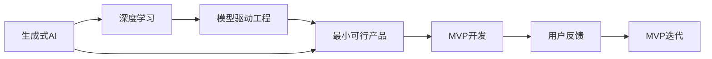
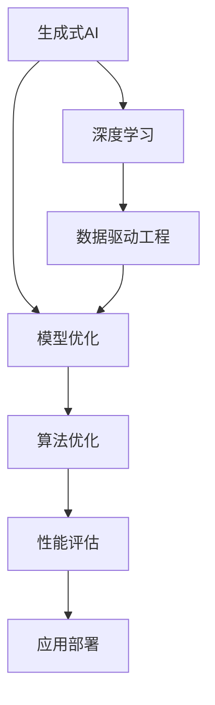
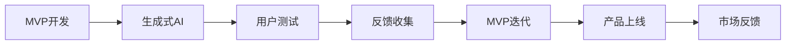
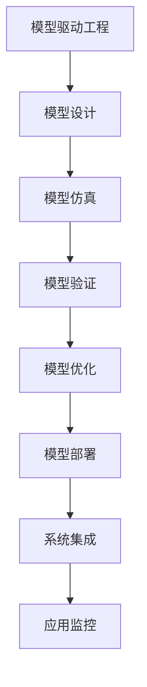
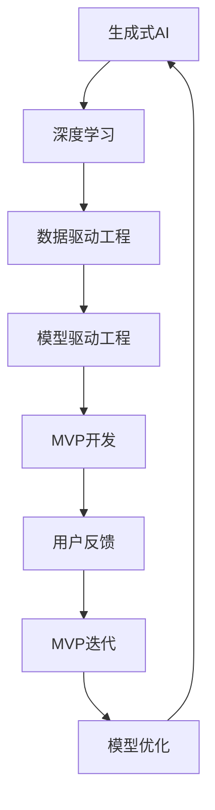

                 

# 生成式AIGC是金矿还是泡沫：要迅速开发最小可行产品MVP快速试错和迭代

> 关键词：生成式AIGC, MVC(mVT), MVP, 最小可行产品, 快速试错, 深度学习, 模型驱动工程

## 1. 背景介绍

### 1.1 问题由来
在2023年的技术风口中，生成式人工智能（Generative AI，简称AIGC）无疑是最为炙手可热的主题之一。从ChatGPT到AI绘画，再到GPT-4横空出世，生成式AI的能量几乎贯穿了所有重要的技术领域和应用场景。

生成式AI，又称为生成式人工智能，是指利用深度学习和机器学习技术，从给定样本中生成全新的、具备一定语义信息的输出。这些输出可以是文本、图像、音频、视频等各种形式。生成式AI的崛起，源自于先进的深度学习模型和大量的训练数据。它们通过对海量数据的归纳与模仿，构建起了一种高效且复杂的能力，能够创作出逼真的、甚至在某些特定领域超越人类创作的作品。

然而，这一技术并非毫无瑕疵。尽管生成式AI在某些领域表现出色，但也存在诸多亟待解决的挑战。这些挑战包括但不限于：

- **数据偏见**：生成式模型往往基于大规模数据集进行训练，这些数据集可能包含某些偏见和不公，从而影响模型的公正性和公平性。
- **模型泛化能力**：尽管生成式模型在特定领域表现优秀，但其泛化到新领域的能力仍然有限。
- **可解释性**：生成式模型通常被视为"黑箱"，其内部的决策过程难以解释和理解。
- **效率问题**：尽管训练生成的模型往往能提供高质量的输出，但在实际应用中，生成式模型的推理速度较慢，内存占用大。

因此，在快速迭代和优化的过程中，如何迅速开发出可靠、高效、可解释的生成式AI模型，成为了摆在技术人员面前的首要挑战。

### 1.2 问题核心关键点
为此，本文将围绕生成式AI的开发、优化和部署展开深入探讨，特别关注最小可行产品（Minimum Viable Product, MVP）的概念及其在生成式AI开发中的应用。MVP的核心思想是通过迅速构建并测试一个包含核心功能的原型产品，快速迭代优化，以验证市场或用户需求。

本文将从以下几个关键点切入：
- **MVP的概念**：MVP的核心特征和基本原则。
- **MVP在生成式AI中的应用**：MVP如何帮助生成式AI开发者快速试错和迭代。
- **MVP的开发实践**：如何构建、测试和优化一个生成式AI的MVP。
- **MVP的实际案例**：通过具体案例展示MVP在生成式AI开发中的应用和效果。

## 2. 核心概念与联系

### 2.1 核心概念概述

为更好地理解生成式AI与MVP的结合，本节将介绍几个密切相关的核心概念：

- **生成式AI (Generative AI, AIGC)**：使用深度学习模型从给定输入生成新数据的AI技术。常用的模型包括变分自编码器（VAE）、生成对抗网络（GAN）、语言生成模型（如GPT、BERT）等。
- **最小可行产品 (Minimum Viable Product, MVP)**：一种快速验证产品市场潜力的开发方法。MVP包含满足核心需求的最小功能集，通过快速迭代优化，逐步增加功能以满足用户需求。
- **模型驱动工程 (Model-Driven Engineering, MDE)**：一种基于模型的软件开发方法，强调通过建模和使用模型来设计、开发和部署系统。
- **深度学习 (Deep Learning, DL)**：一种基于多层神经网络的人工智能技术，用于解决复杂模式识别和预测问题。深度学习是生成式AI的重要基础。

这些核心概念之间的联系可以通过以下Mermaid流程图来展示：



这个流程图展示了生成式AI与MVP之间的联系：

1. 生成式AI通过深度学习模型实现数据生成。
2. 模型驱动工程使用建模技术，为生成式AI的开发提供支持。
3. MVP是一种快速迭代验证市场潜力的开发方法。
4. MVP开发基于生成式AI模型，通过用户反馈不断迭代优化。

通过理解这些核心概念，我们可以更好地把握生成式AI的开发方法论，特别是如何通过MVP实现快速试错和迭代。

### 2.2 概念间的关系

这些核心概念之间存在着紧密的联系，形成了生成式AI开发的全生态系统。下面我们通过几个Mermaid流程图来展示这些概念之间的关系。

#### 2.2.1 生成式AI的开发范式



这个流程图展示了生成式AI开发的基本流程，包括数据驱动工程和模型驱动工程两个主要环节。

#### 2.2.2 MVP的应用场景



这个流程图展示了MVP开发的应用场景，从MVP构建到市场反馈，持续迭代优化。

#### 2.2.3 MDE的实施过程



这个流程图展示了MDE的实施过程，从模型设计到系统集成，整个开发过程都围绕模型进行。

### 2.3 核心概念的整体架构

最后，我们用一个综合的流程图来展示这些核心概念在生成式AI开发中的整体架构：



这个综合流程图展示了从生成式AI的实现到MVP开发的完整过程。通过深度学习模型驱动的生成式AI，结合数据驱动工程和模型驱动工程的支持，通过MVP开发进行快速试错和迭代，不断优化模型和产品，最终实现高效、可靠、可解释的生成式AI应用。

## 3. 核心算法原理 & 具体操作步骤
### 3.1 算法原理概述

生成式AI的核心算法包括但不限于：

- **变分自编码器（VAE）**：一种能够学习生成概率分布的生成模型，通过将输入数据映射到一个潜在变量空间，再从该空间生成新数据。
- **生成对抗网络（GAN）**：一种通过两个神经网络（生成器和判别器）对抗训练来学习生成新数据的模型。
- **语言生成模型（如GPT、BERT）**：使用深度学习模型，通过学习大规模文本数据，生成连贯、高质量的文本。

这些生成式AI模型，本质上都是深度学习模型，通过大量的训练数据来学习数据的概率分布，并利用该分布生成新的数据。

### 3.2 算法步骤详解

以下是基于MVP的生成式AI开发的基本步骤：

**Step 1: 需求分析与定义核心功能**
- 确定产品的核心功能需求，如生成特定类型的文本、图像等。
- 定义MVP的基本功能，确保满足市场或用户的最核心需求。

**Step 2: 数据收集与预处理**
- 收集与MVP相关的训练数据，确保数据的多样性和代表性。
- 对数据进行清洗、标注和归一化处理，保证数据质量。

**Step 3: 构建MVP原型**
- 根据需求分析结果，构建MVP原型。通常包括数据输入、模型训练、数据生成和输出展示等关键模块。
- 使用深度学习框架（如TensorFlow、PyTorch）搭建模型，并进行初步训练和验证。

**Step 4: 用户测试与反馈收集**
- 将MVP原型发布给目标用户进行测试，收集用户的反馈和建议。
- 分析用户反馈，识别MVP的缺陷和不足，确定优化方向。

**Step 5: MVP迭代优化**
- 根据用户反馈和测试结果，对MVP进行优化，包括但不限于调整模型参数、改进数据处理流程、增强用户交互设计等。
- 进行下一轮的用户测试，确保MVP的改进有效。

**Step 6: 应用部署与持续迭代**
- 将MVP部署到实际应用环境，进行大范围的用户测试。
- 根据持续收集的用户反馈，不断迭代优化MVP，确保产品始终满足市场需求。

### 3.3 算法优缺点

基于MVP的生成式AI开发方法具有以下优点：
1. **快速迭代**：MVP通过快速构建和测试原型，可以快速验证市场需求和用户反馈，避免在后期开发中发现重大问题。
2. **成本效益高**：MVP在早期阶段投入较少，能够以较小的成本进行快速试错，避免投入大量资源在最终产品失败上。
3. **用户参与度高**：通过用户测试和反馈，MVP能够更好地满足用户需求，提升产品的市场适应性。
4. **灵活性高**：MVP的快速迭代和优化，使得产品能够灵活适应市场变化和技术进步。

同时，MVP开发也存在一些局限性：
1. **功能限制**：MVP往往聚焦于核心功能，可能无法覆盖所有市场需求。
2. **数据需求高**：MVP构建初期对数据的需求较高，但数据获取和标注可能面临较大挑战。
3. **优化难度大**：MVP的初期优化可能较为困难，需要多次迭代才能达到理想效果。
4. **技术门槛高**：MVP开发需要具备一定的深度学习和模型驱动工程技术，对开发者的技术水平要求较高。

### 3.4 算法应用领域

生成式AI的MVP开发方法，已经在多个领域得到了成功应用，具体包括：

- **文本生成**：如自动摘要、自动翻译、聊天机器人等。MVP可以快速验证生成内容的准确性和可读性，并通过用户反馈不断优化。
- **图像生成**：如GAN生成的图像、基于文本描述的图像生成等。MVP可以快速展示生成图像的视觉效果，并收集用户对图像真实性的评价。
- **音频生成**：如基于文本的语音生成、音乐创作等。MVP可以快速生成音频样本，并通过用户反馈调整生成质量。
- **视频生成**：如基于文本描述的视频生成、动画制作等。MVP可以快速生成视频片段，并通过用户反馈优化视频内容。
- **推荐系统**：如个性化商品推荐、个性化音乐推荐等。MVP可以快速验证推荐策略的有效性，并通过用户反馈改进推荐算法。

除了这些传统应用，生成式AI的MVP开发方法也在新兴领域如虚拟现实（VR）、增强现实（AR）、自动驾驶等领域得到了探索和应用。

## 4. 数学模型和公式 & 详细讲解  
### 4.1 数学模型构建

在生成式AI中，常用的数学模型包括：

- **变分自编码器（VAE）**：使用概率密度函数（PDF）表示数据的生成过程，模型由编码器和解码器两部分组成。
- **生成对抗网络（GAN）**：由生成器和判别器两部分组成，生成器试图生成逼真的数据，而判别器试图区分生成的数据和真实数据。
- **语言生成模型（如GPT、BERT）**：使用概率语言模型，通过学习大规模文本数据，生成连贯、高质量的文本。

这里重点介绍VAE的数学模型构建。

**VAE模型**：

$$
\begin{aligned}
z &\sim q(z|x) \\
x &\sim p(x|z) \\
q(z|x) &\propto \exp\left(-\frac{1}{2\sigma^2}||z-\mu(x)||^2\right) \\
p(x|z) &\propto \exp\left(-\frac{1}{2\sigma_x^2}||x-\mu(z)||^2\right)
\end{aligned}
$$

其中，$z$表示潜在变量，$x$表示输入数据，$q(z|x)$表示潜在变量的条件概率分布，$p(x|z)$表示数据条件概率分布。

### 4.2 公式推导过程

**VAE的优化目标**：

$$
L(z, x) = D_{KL}(q(z|x) || p(z)) + \mathcal{L}(x, z)
$$

其中，$D_{KL}(q(z|x) || p(z))$表示潜在变量$z$的条件分布与标准正态分布$p(z)$的KL散度，$\mathcal{L}(x, z)$表示生成数据的重构损失，用于衡量生成数据的真实度。

### 4.3 案例分析与讲解

以文本生成为例，假设我们要训练一个基于GPT-3的文本生成模型。具体步骤如下：

1. **数据准备**：收集大量文本数据，如新闻、小说等，作为训练集。
2. **模型构建**：使用GPT-3作为文本生成模型，并根据需求调整模型参数和超参数。
3. **模型训练**：使用训练集进行模型训练，不断调整模型参数以最小化重构损失。
4. **用户测试**：将训练好的模型应用于实际场景，收集用户反馈。
5. **模型优化**：根据用户反馈，调整模型参数和超参数，优化生成效果。
6. **模型部署**：将优化后的模型部署到实际应用中，进行大规模用户测试。

## 5. 项目实践：代码实例和详细解释说明
### 5.1 开发环境搭建

在进行生成式AI的MVP开发前，我们需要准备好开发环境。以下是使用Python进行TensorFlow开发的环境配置流程：

1. 安装Anaconda：从官网下载并安装Anaconda，用于创建独立的Python环境。

2. 创建并激活虚拟环境：
```bash
conda create -n tf-env python=3.8 
conda activate tf-env
```

3. 安装TensorFlow：根据CUDA版本，从官网获取对应的安装命令。例如：
```bash
conda install tensorflow -c conda-forge
```

4. 安装各类工具包：
```bash
pip install numpy pandas scikit-learn matplotlib tqdm jupyter notebook ipython
```

完成上述步骤后，即可在`tf-env`环境中开始生成式AI的MVP开发。

### 5.2 源代码详细实现

这里我们以文本生成任务为例，给出使用TensorFlow实现GPT-3文本生成模型的PyTorch代码实现。

首先，定义文本生成模型：

```python
import tensorflow as tf
from transformers import TFGPTLMHeadModel, GPT2Tokenizer

tokenizer = GPT2Tokenizer.from_pretrained('gpt2')
model = TFGPTLMHeadModel.from_pretrained('gpt2')

input_ids = tokenizer.encode("Hello, world!", return_tensors="tf")
output = model(input_ids)
print(output.logits.numpy())
```

然后，定义损失函数和优化器：

```python
from transformers import AdamW
from tensorflow.keras.losses import SparseCategoricalCrossentropy

loss = SparseCategoricalCrossentropy(from_logits=True)
optimizer = AdamW(model.parameters(), lr=5e-5)
```

接着，定义训练函数：

```python
@tf.function
def train_step(inputs, targets):
    with tf.GradientTape() as tape:
        logits = model(inputs, return_dict=True).logits
        loss_value = loss(logits, targets)
    gradients = tape.gradient(loss_value, model.parameters())
    optimizer.apply_gradients(zip(gradients, model.parameters()))
    return loss_value

@tf.function
def train_epoch(dataloader):
    epoch_loss = 0
    for batch in dataloader:
        inputs = batch["input_ids"]
        targets = batch["labels"]
        loss = train_step(inputs, targets)
        epoch_loss += loss.numpy()
    return epoch_loss / len(dataloader)
```

最后，启动训练流程：

```python
epochs = 5
batch_size = 16

for epoch in range(epochs):
    loss = train_epoch(train_dataset)
    print(f"Epoch {epoch+1}, train loss: {loss:.3f}")
```

以上就是使用TensorFlow对GPT-3文本生成模型进行微调的完整代码实现。可以看到，TensorFlow的Keras API使得模型构建和训练过程变得简洁高效。

### 5.3 代码解读与分析

让我们再详细解读一下关键代码的实现细节：

**VAE模型**：
- 通过概率密度函数（PDF）表示数据的生成过程，模型由编码器和解码器两部分组成。
- 使用KL散度衡量潜在变量$z$的条件分布与标准正态分布$p(z)$的差异。
- 使用重构损失衡量生成数据的真实度。

**文本生成模型**：
- 使用GPT-3作为文本生成模型，并根据需求调整模型参数和超参数。
- 使用SparseCategoricalCrossentropy作为损失函数，计算生成文本的交叉熵损失。
- 使用AdamW优化器，进行梯度下降优化。

**训练函数**：
- 通过定义训练步和训练轮次，不断调整模型参数以最小化损失函数。
- 使用TensorFlow的tf.function装饰器，优化模型前向传播和反向传播过程，提高训练效率。

**实际案例**：
- 以文本生成为例，收集大量文本数据，如新闻、小说等，作为训练集。
- 使用GPT-3作为文本生成模型，并根据需求调整模型参数和超参数。
- 使用SparseCategoricalCrossentropy作为损失函数，计算生成文本的交叉熵损失。
- 使用AdamW优化器，进行梯度下降优化。
- 通过多次迭代训练，优化模型生成效果。

## 6. 实际应用场景
### 6.1 智能客服系统

基于生成式AI的智能客服系统，可以提供7x24小时不间断服务，快速响应客户咨询，用自然流畅的语言解答各类常见问题。在技术实现上，可以收集企业内部的历史客服对话记录，将问题和最佳答复构建成监督数据，在此基础上对预训练生成模型进行微调。微调后的生成模型能够自动理解用户意图，匹配最合适的答复模板进行回复。对于客户提出的新问题，还可以接入检索系统实时搜索相关内容，动态组织生成回答。

### 6.2 金融舆情监测

金融机构需要实时监测市场舆论动向，以便及时应对负面信息传播，规避金融风险。通过生成式AI，可以实现实时抓取网络文本数据，并生成舆情摘要，及时监测不同主题下的情感变化趋势，一旦发现负面信息激增等异常情况，系统便会自动预警，帮助金融机构快速应对潜在风险。

### 6.3 个性化推荐系统

当前的推荐系统往往只依赖用户的历史行为数据进行物品推荐，无法深入理解用户的真实兴趣偏好。通过生成式AI，可以实现个性化推荐系统，更好地挖掘用户行为背后的语义信息，从而提供更精准、多样的推荐内容。在生成式AI模型中，可以引入知识图谱、逻辑规则等专家知识，进一步提升推荐效果。

### 6.4 未来应用展望

随着生成式AI技术的发展，其应用场景将不断拓展。未来，生成式AI有望在以下几个领域得到深入探索：

- **虚拟现实（VR）和增强现实（AR）**：通过生成式AI，可以构建逼真的虚拟环境和增强现实应用，提升用户体验。
- **自动驾驶**：通过生成式AI，可以实现自动驾驶车队的路径规划、行为预测等。
- **医学影像分析**：通过生成式AI，可以生成逼真的医学影像，辅助医生进行疾病诊断和治疗方案设计。
- **内容创作**：通过生成式AI，可以实现自动文本、图像、视频等内容创作，推动媒体、娱乐等领域的发展。
- **教育和培训**：通过生成式AI，可以提供个性化的教育内容，提升教学效果。

总之，生成式AI技术的应用前景广阔，将在更多领域得到探索和应用，为人类生产和生活带来深刻变革。

## 7. 工具和资源推荐
### 7.1 学习资源推荐

为了帮助开发者系统掌握生成式AI的开发方法和实践技巧，这里推荐一些优质的学习资源：

1. **《深度学习入门：基于TensorFlow的实践》**：该书详细介绍了TensorFlow的基本概念和使用方法，适合初学者入门。
2. **Coursera《深度学习专项课程》**：斯坦福大学开设的深度学习课程，涵盖深度学习基础和应用。
3. **Kaggle《机器学习竞赛》**：通过参与实际比赛，实践深度学习模型的开发和优化。
4. **HuggingFace官方文档**：Transformer库的官方文档，提供了海量预训练模型和完整的微调样例代码。
5. **Google AI Blog**：谷歌AI团队分享最新研究成果和前沿技术，适合学习前沿进展。

通过对这些资源的学习实践，相信你一定能够快速掌握生成式AI的开发技巧，并用于解决实际问题。

### 7.2 开发工具推荐

高效的开发离不开优秀的工具支持。以下是几款用于生成式AI开发常用的工具：

1. **TensorFlow**：基于Python的开源深度学习框架，灵活的计算图，适合快速迭代研究。
2. **PyTorch**：基于Python的开源深度学习框架，动态计算图，适合灵活的模型设计和调试。
3. **Jupyter Notebook**：交互式的Jupyter Notebook环境，支持Python代码的快速迭代和共享。
4. **Weights & Biases**：模型训练的实验跟踪工具，记录和可视化模型训练过程中的各项指标，方便对比和调优。
5. **TensorBoard**：TensorFlow配套的可视化工具，可实时监测模型训练状态，并提供丰富的图表呈现方式。

合理利用这些工具，可以显著提升生成式AI模型的开发效率，加快创新迭代的步伐。

### 7.3 相关论文推荐

生成式AI的发展源于学界的持续研究。以下是几篇奠基性的相关论文，推荐阅读：

1. **《Attention is All You Need》**：提出Transformer结构，开启了NLP领域的预训练大模型时代。
2. **《A Neural Probabilistic Language Model》**：提出语言生成模型，为生成式AI提供了基础模型。
3. **《Generative Adversarial Networks》**：提出GAN模型，推动了生成对抗网络的发展。
4. **《Variational Autoencoders》**：提出VAE模型，提供了一种生成式学习的框架。

这些论文代表了大规模深度学习模型的发展脉络，为生成式AI提供了理论基础和技术支持。

除上述资源外，还有一些值得关注的前沿资源，帮助开发者紧跟生成式AI技术的发展方向：

1. **arXiv论文预印本**：人工智能领域最新研究成果的发布平台，包括大量尚未发表的前沿工作。
2. **Google AI Blog**：谷歌AI团队分享最新研究成果和前沿技术，适合学习前沿进展。
3. **TensorFlow官方博客**：TensorFlow团队分享深度学习技术的发展和应用。

这些资源可以帮助开发者持续学习前沿技术，保持对生成式AI领域的敏锐洞察力。

## 8. 总结：未来发展趋势与挑战

### 8.1 总结

本文对生成式AI的开发方法进行了全面系统的介绍，重点探讨了最小可行产品（MVP）的概念及其在生成式AI开发中的应用。从MVP的基本原则到具体实现，从算法原理到项目实践，从实际应用到未来展望，本文深入浅出地剖析了生成式AI的开发、优化和部署过程。通过学习本文，读者可以全面掌握生成式AI的开发方法，理解其核心思想和技术细节，为未来生成式AI的研究和应用奠定坚实基础。

### 8.2 未来发展趋势

展望未来，生成式AI的发展趋势如下：

1. **多模态融合**：生成式AI将逐步拓展到多模态数据融合，如图像、音频、视频等多媒体数据的生成。
2. **自监督学习**：生成式AI将更多地使用自监督学习范式，减少对标注数据的依赖。
3. **模型压缩与优化**：随着模型规模的增大，生成式AI的推理速度和内存占用将成为一个重要问题，未来的研究将更多关注模型压缩和优化技术。
4. **知识注入**：未来的生成式AI将更多地结合知识图谱、逻辑规则等先验知识，提升生成内容的合理性和可解释性。
5. **跨领域迁移**：生成式AI将更多地应用于跨领域迁移，提升模型的泛化能力和适应性。

### 8.3 面临的挑战

尽管生成式AI技术已经取得了显著进展，但在其发展过程中，仍面临诸多挑战：

1. **数据偏见**：生成式模型可能学习到数据集中的偏见和歧视，导致生成的内容带有偏见。
2. **生成内容的真实性**：生成的内容可能存在虚假信息，误导用户。
3. **模型鲁棒性**：生成式模型在不同场景下的表现可能存在波动，需要进一步提升模型的鲁棒性。
4. **技术壁垒**：生成式AI的开发需要较高的技术门槛，包括深度学习、模型驱动工程等知识。
5. **伦理和安全问题**：生成式AI的应用可能

