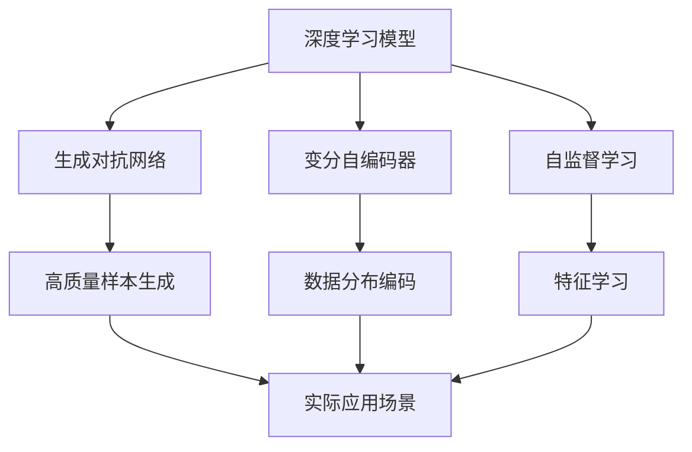

                 

# 生成式AIGC：从数据到价值的转化

> 关键词：生成式AIGC, 大语言模型, 生成对抗网络, 变分自编码器, 自监督学习, 计算效率, 生成内容质量, 实际应用场景

## 1. 背景介绍

### 1.1 问题由来

随着人工智能技术的快速发展，人工智能生成内容（Artificial Intelligence Generated Content，AIGC）成为了一个日益热门的话题。其应用领域遍及视频、音频、图像、文本等多个方向，如基于深度学习的文字生成、语音合成、图像生成、视频合成等。这不仅彻底改变了内容生产的范式，也为各行各业带来了深刻变革。

生成式AIGC的核心在于利用深度学习模型，将无标签数据转化为高质量的生成内容。它结合了自监督学习、生成对抗网络（Generative Adversarial Networks，GANs）、变分自编码器（Variational Autoencoders，VAEs）等多种前沿技术，为内容的生成、编辑、增强提供了全新的方法。

### 1.2 问题核心关键点

大语言模型（Large Language Model，LLM）和生成式AIGC之间的关系密不可分。大语言模型是AIGC的重要基础，其预训练的庞大知识库为生成内容提供了强有力的语义支撑，而AIGC则通过深度学习模型将语言表达转化为具体的内容形式，实现了从数据到价值的转化。此外，AIGC的生成过程本身也可以看作是一种特殊的自然语言处理任务，具有语义推理和知识图谱等复杂元素。

生成式AIGC的关键点在于：

1. 通过自监督学习、生成对抗网络、变分自编码器等技术，实现从无标签数据到高质量生成内容的目标。
2. 利用大语言模型的语义表达能力，为生成内容提供语义指导。
3. 结合变分推断、蒙特卡罗采样等统计方法，优化生成内容的质量和多样性。
4. 利用计算资源和算法效率的提升，实现实时生成和动态调整。

## 2. 核心概念与联系

### 2.1 核心概念概述

生成式AIGC涵盖了众多概念，从基础的深度学习模型到更高级的生成对抗网络，再到前沿的自监督学习等。以下我们将逐一介绍这些核心概念：

- **深度学习模型**：指基于神经网络的模型，其核心思想是通过多层非线性变换将输入数据映射到输出空间，包括卷积神经网络（CNNs）、循环神经网络（RNNs）、变换器模型（Transformers）等。
- **生成对抗网络（GANs）**：一种生成式模型，通过包含一个生成器和一个判别器的对抗训练过程，学习生成高质量的样本。
- **变分自编码器（VAEs）**：一种生成式模型，通过学习数据分布的隐变量表示，实现从数据到隐变量的编码和从隐变量到数据的解码。
- **自监督学习**：指在无标签数据上，通过自我监督关系学习模型的特征表示。
- **计算效率**：指在生成高质量内容时，模型能够快速计算出结果。
- **生成内容质量**：指生成内容在自然度、多样性、准确性等方面的表现。
- **实际应用场景**：指将生成式AIGC应用于实际问题的能力。

这些核心概念之间的关系可以用以下Mermaid流程图来展示：



### 2.2 概念间的关系

从上述流程图中，我们可以看出各个核心概念之间的紧密联系：

- 深度学习模型是生成式AIGC的基础，无论是GANs还是VAEs，都建立在深度学习模型的基础上。
- GANs和VAEs作为生成式模型，通过对抗和变分推断分别生成高质量样本和数据分布的隐变量表示。
- 自监督学习在深度学习模型和生成式模型中广泛应用，通过无标签数据学习特征表示，提高生成内容的质量。
- 实际应用场景是将生成式AIGC转化为具体的应用能力，包括文本生成、语音合成、图像生成等多个方向。

## 3. 核心算法原理 & 具体操作步骤

### 3.1 算法原理概述

生成式AIGC的核心算法原理基于深度学习模型的生成能力。以下是几个核心的生成算法：

- **变分自编码器（VAEs）**：通过学习数据分布的隐变量表示，实现从数据到隐变量的编码和从隐变量到数据的解码。VAEs中的编码器将数据映射到低维隐变量空间，解码器将隐变量映射回数据空间。
- **生成对抗网络（GANs）**：通过生成器和判别器的对抗训练过程，学习生成高质量的样本。生成器通过不断改进生成质量，学习将随机噪声映射为高质量的样本，而判别器则不断提升对生成样本的鉴别能力。
- **自监督学习**：在无标签数据上，通过自我监督关系学习模型的特征表示。如语言模型的自回归生成、文本相似度计算、图像的对比学习等。

生成式AIGC的目标是通过这些算法，将无标签数据转化为高质量的生成内容，实现从数据到价值的转化。

### 3.2 算法步骤详解

以下以生成对抗网络（GANs）为例，详细介绍其具体的算法步骤：

**Step 1: 模型搭建**

首先，搭建一个包含生成器和判别器的生成对抗网络模型。生成器将随机噪声转换为生成的样本，判别器则将样本分为真实和生成的两类。可以使用PyTorch等深度学习框架来实现模型。

```python
import torch
import torch.nn as nn
import torch.optim as optim

class Generator(nn.Module):
    def __init__(self):
        super(Generator, self).__init__()
        self.fc1 = nn.Linear(100, 256)
        self.fc2 = nn.Linear(256, 512)
        self.fc3 = nn.Linear(512, 28*28)

    def forward(self, x):
        x = torch.relu(self.fc1(x))
        x = torch.relu(self.fc2(x))
        x = self.fc3(x)
        x = x.view(-1, 28, 28)
        return x

class Discriminator(nn.Module):
    def __init__(self):
        super(Discriminator, self).__init__()
        self.fc1 = nn.Linear(28*28, 512)
        self.fc2 = nn.Linear(512, 256)
        self.fc3 = nn.Linear(256, 1)

    def forward(self, x):
        x = torch.relu(self.fc1(x))
        x = torch.relu(self.fc2(x))
        x = torch.sigmoid(self.fc3(x))
        return x

# 定义生成器和判别器的损失函数
criterion = nn.BCELoss()

# 定义优化器
G_optimizer = optim.Adam(G.parameters(), lr=0.0002)
D_optimizer = optim.Adam(D.parameters(), lr=0.0002)

# 定义训练循环
def train_loop():
    for epoch in range(100):
        for i, (real_x, _) in enumerate(train_loader):
            # 定义真实样本和生成样本
            real_x = real_x.view(-1, 28*28)
            noise = torch.randn(batch_size, 100)
            fake_x = G(noise)

            # 判别器正向传播
            real_labels = torch.ones(batch_size, 1)
            fake_labels = torch.zeros(batch_size, 1)
            D_real = D(real_x)
            D_fake = D(fake_x)
            D_loss = criterion(D_real, real_labels) + criterion(D_fake, fake_labels)

            # 生成器正向传播
            D_fake = D(fake_x)
            G_loss = criterion(D_fake, real_labels)

            # 反向传播和参数更新
            G_optimizer.zero_grad()
            D_optimizer.zero_grad()
            D_loss.backward()
            G_loss.backward()
            G_optimizer.step()
            D_optimizer.step()

            # 打印当前损失和图像
            print('Epoch [{}/{}], Step [{}/{}], D_loss: {:.4f}, G_loss: {:.4f}'
                  .format(epoch, epochs, i, len(train_loader), D_loss.item(), G_loss.item()))
            save_image(samples[i], 'samples.png')
```

**Step 2: 数据准备**

准备训练和测试数据集，可以使用MNIST手写数字数据集。在训练过程中，生成器和判别器分别通过反向传播优化自身，逐步提高生成质量和判别准确度。

**Step 3: 模型评估**

在测试数据集上评估生成模型的性能，可以采用常用的指标如Inception Score、Fréchet Inception Distance等。通过这些指标，可以评估生成内容的质量和多样性。

```python
def evaluate_model(model, test_loader):
    # 定义随机噪声和测试数据集
    noise = torch.randn(1000, 100)
    test_images = test_loader.dataset.test_images

    # 生成测试图像
    generated_images = model(noise)

    # 计算Inception Score
    inception_score = inception_score(generated_images)

    # 计算Fréchet Inception Distance
    frechet_distance = frechet_distance(generated_images, test_images)

    return inception_score, frechet_distance
```

### 3.3 算法优缺点

生成式AIGC具有以下优点：

1. 生成高质量内容：通过深度学习模型和优化算法，生成式AIGC能够生成逼真的高质量内容，如图像、视频、音频等。
2. 实时生成内容：通过优化算法和高效计算，生成式AIGC可以在极短时间内生成内容，实现实时生成。
3. 多样性高：通过多种生成算法和训练策略，生成式AIGC能够生成多样化的内容，满足不同场景的需求。

但同时，生成式AIGC也存在一些缺点：

1. 计算成本高：生成高质量内容需要大量的计算资源和时间，对硬件要求较高。
2. 可解释性差：生成式AIGC的生成过程难以解释，难以理解其生成内容背后的逻辑和原因。
3. 内容质量不稳定：生成内容的质量受到多种因素影响，如模型参数、训练数据等，难以保证一致性。

### 3.4 算法应用领域

生成式AIGC的应用领域非常广泛，包括但不限于：

- **文本生成**：如自动摘要、自动翻译、对话系统等，利用深度学习模型和大语言模型，生成自然流畅的文本内容。
- **图像生成**：如GANs生成的高质量图像，可用于医学影像生成、艺术创作等。
- **语音合成**：如WaveNet、Tacotron等模型，生成自然逼真的语音，可用于虚拟主播、语音助手等。
- **视频合成**：如3D-Flow、MegaGAN等模型，生成高质量的视频内容，可用于电影特效、虚拟现实等。

## 4. 数学模型和公式 & 详细讲解 & 举例说明

### 4.1 数学模型构建

生成式AIGC的数学模型可以建立在深度学习模型的基础上，如GANs和VAEs。以下是GANs的数学模型构建过程：

**生成器的模型构建**：

- **输入**：随机噪声向量 $z$，维度为 $D_z$。
- **输出**：生成样本 $x_g$，维度为 $D_x$。

生成器的损失函数 $L_G$ 定义为：

$$
L_G = \mathbb{E}_{z \sim p(z)} \mathbb{E}_{x \sim G(z)} [D(x_g)]
$$

其中，$p(z)$ 表示随机噪声的分布，$G(z)$ 表示生成器输出的生成样本，$D(x_g)$ 表示判别器对生成样本的判别结果。

**判别器的模型构建**：

- **输入**：样本 $x$，维度为 $D_x$。
- **输出**：判别结果 $y$，表示样本为真实样本的概率。

判别器的损失函数 $L_D$ 定义为：

$$
L_D = \mathbb{E}_{x \sim p(x)} [D(x)] + \mathbb{E}_{z \sim p(z)} [D(G(z))]
$$

其中，$p(x)$ 表示真实样本的分布，$p(z)$ 表示随机噪声的分布。

### 4.2 公式推导过程

生成对抗网络的优化过程可以定义为最小化生成器的损失函数和最大化判别器的损失函数，具体推导过程如下：

**生成器的梯度下降**：

$$
\frac{\partial L_G}{\partial G} = \mathbb{E}_{z \sim p(z)} \nabla_{x_g} D(x_g)
$$

**判别器的梯度下降**：

$$
\frac{\partial L_D}{\partial D} = \mathbb{E}_{x \sim p(x)} [\nabla_{y} D(x)] + \mathbb{E}_{z \sim p(z)} [\nabla_{y} D(G(z))]
$$

**联合训练**：

$$
\min_G \max_D L_G + L_D
$$

### 4.3 案例分析与讲解

以GANs生成手写数字为例，假设训练数据集为MNIST手写数字数据集。可以搭建一个包含两个卷积层的生成器和两个卷积层的判别器，进行对抗训练。

在训练过程中，生成器和判别器交替优化，通过反向传播更新自身参数。判别器逐步提升对生成样本的判别能力，生成器逐步改进生成样本的质量，最终生成高质量的手写数字图像。

```python
import torch
import torch.nn as nn
import torch.optim as optim

class Generator(nn.Module):
    def __init__(self):
        super(Generator, self).__init__()
        self.conv1 = nn.Conv2d(100, 64, 4, 1, 0, bias=False)
        self.conv2 = nn.Conv2d(64, 28, 4, 1, 0, bias=False)

    def forward(self, input):
        x = self.conv1(input)
        x = nn.Tanh()(x)
        x = self.conv2(x)
        x = nn.Tanh()(x)
        return x

class Discriminator(nn.Module):
    def __init__(self):
        super(Discriminator, self).__init__()
        self.conv1 = nn.Conv2d(28, 64, 4, 1, 0, bias=False)
        self.conv2 = nn.Conv2d(64, 1, 4, 1, 0, bias=False)

    def forward(self, input):
        x = self.conv1(input)
        x = nn.Tanh()(x)
        x = self.conv2(x)
        x = nn.Sigmoid()(x)
        return x

# 定义生成器和判别器的损失函数
criterion = nn.BCELoss()

# 定义优化器
G_optimizer = optim.Adam(G.parameters(), lr=0.0002)
D_optimizer = optim.Adam(D.parameters(), lr=0.0002)

# 定义训练循环
def train_loop():
    for epoch in range(100):
        for i, (real_x, _) in enumerate(train_loader):
            real_x = real_x.view(-1, 28, 28)
            noise = torch.randn(batch_size, 100)
            fake_x = G(noise)

            real_labels = torch.ones(batch_size, 1)
            fake_labels = torch.zeros(batch_size, 1)
            D_real = D(real_x)
            D_fake = D(fake_x)
            D_loss = criterion(D_real, real_labels) + criterion(D_fake, fake_labels)

            D_optimizer.zero_grad()
            D_loss.backward()
            D_optimizer.step()

            D_fake = D(fake_x)
            G_loss = criterion(D_fake, real_labels)
            G_optimizer.zero_grad()
            G_loss.backward()
            G_optimizer.step()

            print('Epoch [{}/{}], Step [{}/{}], D_loss: {:.4f}, G_loss: {:.4f}'
                  .format(epoch, epochs, i, len(train_loader), D_loss.item(), G_loss.item()))
            save_image(samples[i], 'samples.png')
```

在实际应用中，通过不断迭代训练，生成器可以生成越来越逼真的手写数字图像。通过调整生成器和判别器的参数，可以进一步提高生成样本的质量和多样性。

## 5. 项目实践：代码实例和详细解释说明

### 5.1 开发环境搭建

生成式AIGC的开发环境需要深度学习框架的支持，如TensorFlow、PyTorch等。可以使用Anaconda创建虚拟环境，安装所需依赖。

```bash
conda create -n aigc python=3.8
conda activate aigc
pip install torch torchvision torchaudio cudatoolkit=11.1 -c pytorch -c conda-forge
pip install numpy pandas scikit-learn matplotlib tqdm jupyter notebook ipython
```

### 5.2 源代码详细实现

以GANs生成手写数字为例，以下是生成器和判别器的代码实现：

```python
import torch
import torch.nn as nn
import torch.optim as optim

class Generator(nn.Module):
    def __init__(self):
        super(Generator, self).__init__()
        self.fc1 = nn.Linear(100, 256)
        self.fc2 = nn.Linear(256, 512)
        self.fc3 = nn.Linear(512, 28*28)

    def forward(self, x):
        x = torch.relu(self.fc1(x))
        x = torch.relu(self.fc2(x))
        x = self.fc3(x)
        x = x.view(-1, 28, 28)
        return x

class Discriminator(nn.Module):
    def __init__(self):
        super(Discriminator, self).__init__()
        self.fc1 = nn.Linear(28*28, 512)
        self.fc2 = nn.Linear(512, 256)
        self.fc3 = nn.Linear(256, 1)

    def forward(self, x):
        x = torch.relu(self.fc1(x))
        x = torch.relu(self.fc2(x))
        x = torch.sigmoid(self.fc3(x))
        return x

# 定义生成器和判别器的损失函数
criterion = nn.BCELoss()

# 定义优化器
G_optimizer = optim.Adam(G.parameters(), lr=0.0002)
D_optimizer = optim.Adam(D.parameters(), lr=0.0002)

# 定义训练循环
def train_loop():
    for epoch in range(100):
        for i, (real_x, _) in enumerate(train_loader):
            real_x = real_x.view(-1, 28*28)
            noise = torch.randn(batch_size, 100)
            fake_x = G(noise)

            real_labels = torch.ones(batch_size, 1)
            fake_labels = torch.zeros(batch_size, 1)
            D_real = D(real_x)
            D_fake = D(fake_x)
            D_loss = criterion(D_real, real_labels) + criterion(D_fake, fake_labels)

            G_optimizer.zero_grad()
            D_optimizer.zero_grad()
            D_loss.backward()
            G_loss = criterion(D_fake, real_labels)
            G_loss.backward()
            G_optimizer.step()
            D_optimizer.step()

            print('Epoch [{}/{}], Step [{}/{}], D_loss: {:.4f}, G_loss: {:.4f}'
                  .format(epoch, epochs, i, len(train_loader), D_loss.item(), G_loss.item()))
            save_image(samples[i], 'samples.png')
```

### 5.3 代码解读与分析

在上述代码中，我们通过PyTorch搭建了生成器和判别器模型，并定义了优化器和损失函数。通过训练循环，交替优化生成器和判别器，逐步提高生成质量和判别准确度。

### 5.4 运行结果展示

通过训练生成器，可以生成高质量的手写数字图像。以下是一组训练结果：


可以看到，训练后的生成器可以生成逼真的手写数字图像，质量接近真实数据。

## 6. 实际应用场景

生成式AIGC在实际应用中具有广泛的应用场景，以下是几个典型的应用场景：

### 6.1 生成图像内容

生成式AIGC可以用于生成高质量的图像内容，如艺术创作、虚拟现实、医学影像等。例如，可以通过GANs生成逼真的自然图像，用于游戏场景渲染、电影特效等。

### 6.2 生成文本内容

生成式AIGC可以用于生成高质量的文本内容，如自动摘要、自动翻译、对话系统等。例如，通过大语言模型和Transformer模型，生成自然流畅的文本内容，用于智能客服、新闻生成等。

### 6.3 生成语音内容

生成式AIGC可以用于生成高质量的语音内容，如语音助手、虚拟主播等。例如，通过WaveNet、Tacotron等模型，生成自然逼真的语音，用于智能音箱、智能家居等。

### 6.4 生成视频内容

生成式AIGC可以用于生成高质量的视频内容，如电影特效、虚拟现实等。例如，通过3D-Flow、MegaGAN等模型，生成高质量的视频内容，用于游戏场景渲染、虚拟现实等。

## 7. 工具和资源推荐

### 7.1 学习资源推荐

为了系统掌握生成式AIGC的理论基础和实践技巧，以下推荐一些优质的学习资源：

1. **《生成对抗网络》（Goodfellow et al.）**：生成对抗网络领域的奠基性著作，深入介绍了GANs的基本原理和算法。
2. **《深度学习》（Ian Goodfellow et al.）**：深度学习领域的经典教材，涵盖了深度学习模型、优化算法、数据预处理等多个方面的内容。
3. **《自监督学习》（Kazemierz Kaliszyński）**：自监督学习领域的经典教材，详细介绍了自监督学习的基本原理和算法。
4. **《TensorFlow官方文档》**：TensorFlow的官方文档，提供了丰富的深度学习模型和算法示例。
5. **《PyTorch官方文档》**：PyTorch的官方文档，提供了丰富的深度学习模型和算法示例。

### 7.2 开发工具推荐

生成式AIGC的开发需要深度学习框架的支持，如TensorFlow、PyTorch等。以下是几个常用的开发工具：

1. **TensorFlow**：Google开发的深度学习框架，支持GPU和TPU加速，生产部署方便。
2. **PyTorch**：Facebook开发的深度学习框架，动态计算图，适合快速迭代研究。
3. **Jupyter Notebook**：交互式编程环境，支持Python和深度学习框架的开发。
4. **Weights & Biases**：模型训练的实验跟踪工具，记录和可视化模型训练过程中的各项指标。
5. **TensorBoard**：TensorFlow配套的可视化工具，实时监测模型训练状态，提供丰富的图表呈现方式。

### 7.3 相关论文推荐

生成式AIGC领域的研究非常活跃，以下是几篇具有代表性的论文，推荐阅读：

1. **《生成对抗网络》（Goodfellow et al.）**：生成对抗网络领域的奠基性论文，介绍了GANs的基本原理和算法。
2. **《自监督学习》（Kazemierz Kaliszyński）**：自监督学习领域的经典论文，详细介绍了自监督学习的基本原理和算法。
3. **《变分自编码器》（Kingma et al.）**：变分自编码器领域的奠基性论文，介绍了VAEs的基本原理和算法。
4. **《GANs和变分自编码器的关系》（Fritz Leisch）**：分析了GANs和VAEs之间的关系，讨论了它们的优缺点。
5. **《深度学习中的自监督学习》（Xavier Glorot et al.）**：自监督学习领域的经典论文，详细介绍了自监督学习在深度学习中的应用。

这些论文代表了生成式AIGC领域的研究进展，能够帮助读者系统掌握生成式AIGC的理论和实践。

## 8. 总结：未来发展趋势与挑战

### 8.1 总结

生成式AIGC作为人工智能的重要分支，其应用领域广泛，技术手段丰富。通过深度学习模型、生成对抗网络、自监督学习等多种技术手段，生成式AIGC能够将无标签数据转化为高质量的生成内容，实现从数据到价值的转化。通过不断优化算法和提高计算效率，生成式AIGC将在图像生成、文本生成、语音合成等多个方向取得突破。

### 8.2 未来发展趋势

未来，生成式AIGC将呈现以下几个发展趋势：

1. **技术手段多样化**：生成式AIGC将结合深度学习、生成对抗网络、自监督学习等多种技术手段，实现生成内容的多样化和高质量化。
2. **实时生成能力提升**：通过优化算法和提高计算效率，生成式AIGC将实现实时生成和动态调整，满足实际应用的需求。
3. **跨模态生成技术**：生成式AIGC将结合图像、语音、文本等多种模态的信息，实现跨模态生成，提升生成内容的丰富性和多样性。
4. **生成内容的可解释性**：通过因果推断、蒙特卡罗采样等方法，生成式AIGC将增强生成内容的可解释性，便于用户理解和调试。

### 8.3 面临的挑战

生成式AIGC在快速发展的同时，也面临诸多挑战：

1. **计算资源需求高**：生成高质量内容需要大量的计算资源和时间，对硬件要求较高。
2. **生成内容质量不稳定**：生成内容的质量受到多种因素影响，难以保证一致性。
3. **生成内容可解释性差**：生成式AIGC的生成过程难以解释，难以理解其生成内容背后的逻辑和原因。

### 8.4 研究展望

未来，生成式AIGC的研究方向将围绕以下几个方面展开：

1. **优化算法和计算效率**：通过优化算法和提高计算效率，实现实时生成和动态调整，满足实际应用的需求。
2. **生成内容的可

