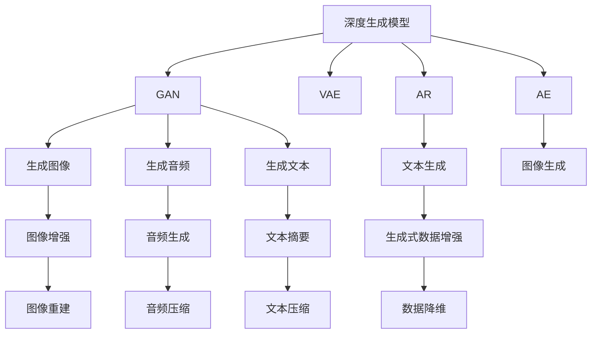
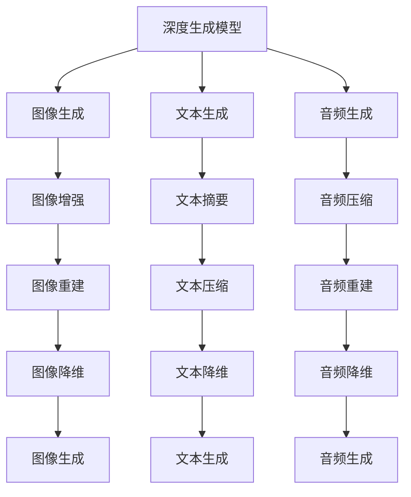
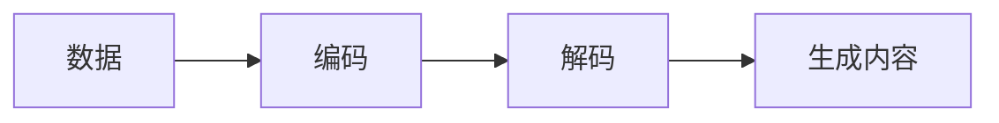
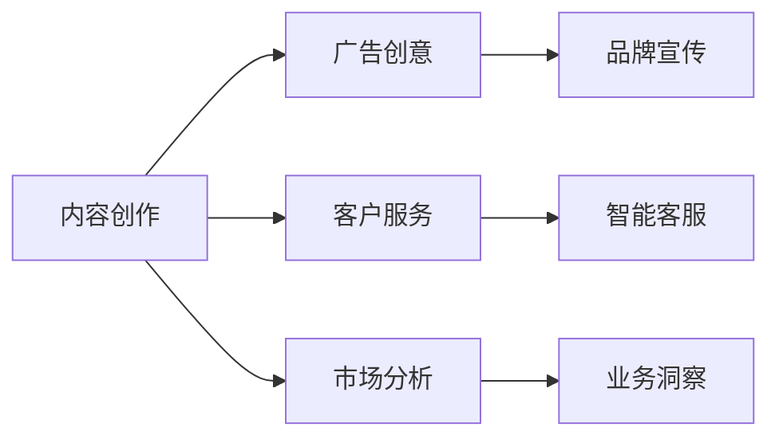

                 

# 生成式AIGC：商业应用的无限可能

## 1. 背景介绍

### 1.1 问题由来
近年来，随着人工智能(AI)技术的发展，生成式人工智能(Generative AI, AIGC)这一领域逐渐成为热门话题。它不仅在艺术、音乐、电影等领域取得突破，还在商业应用中展现出巨大的潜力。比如，ChatGPT等生成式模型已经在零售、金融、医疗等行业中发挥出越来越重要的作用。

### 1.2 问题核心关键点
生成式AIGC的核心在于通过深度学习等技术，生成高质量、多样化的文本、图像、音频等数据，这些生成式内容能够提供丰富的数据来源，支持多种业务创新，如客户服务、市场推广、内容创作等。其主要特点包括：
1. 自动化生成：基于已有数据和模型，生成新的内容，减少人工干预。
2. 高质量：生成的内容在语法、语义、风格等方面均能与真实数据媲美。
3. 高效率：能够快速生成大量内容，降低内容生产成本。
4. 可定制化：根据特定需求，生成符合要求的定制内容。

目前，生成式AIGC已广泛应用于内容创作、广告创意、市场分析、客户服务等场景，成为推动数字化转型、提高企业运营效率的重要手段。

### 1.3 问题研究意义
研究生成式AIGC的商业应用，对于推动AI技术落地应用，拓展AI技术的产业边界，具有重要意义：

1. 降低内容制作成本：生成式模型可以自动化生成高质量内容，降低人力和时间成本，缩短内容制作周期。
2. 提升用户体验：自动生成的多模态内容能够提供更丰富、更个性化的用户体验。
3. 增强数据价值：通过生成数据，可以丰富数据集，支持更精准的业务分析和预测。
4. 促进业务创新：生成式AIGC能够应用于更多业务场景，推动业务模式和运营方式的创新。
5. 赋能产业升级：通过提高数据处理效率和质量，为传统行业带来数字化、智能化的升级转型。

## 2. 核心概念与联系

### 2.1 核心概念概述

为更好地理解生成式AIGC在商业应用中的实践，本节将介绍几个密切相关的核心概念：

- 生成式人工智能(AIGC)：指通过深度学习等技术，生成高质量、多样化的文本、图像、音频等数据，支持商业应用中的内容创作、广告创意、客户服务等需求。

- 深度生成模型(Generative Models)：如GANs、VQ-VAE、Transformer等模型，能够从噪音或简单输入生成复杂输出，广泛应用于生成式AIGC。

- 对抗生成网络(GAN)：一种生成模型，通过将生成器和判别器进行对抗训练，生成与真实数据难以区分的高质量样本。

- 变分自编码器(VAE)：一种生成模型，通过学习输入数据的分布，生成新的数据样本，可用于数据增强、数据压缩等任务。

- 自回归模型(AR)：如LSTM、GRU等，通过考虑前文信息生成新文本，支持文本生成、机器翻译等任务。

- 自编码器(AE)：一种生成模型，通过将输入数据编码为隐状态，再解码为输出数据，可用于图像生成、数据降维等任务。

- 注意力机制(Attention Mechanism)：一种机制，通过关注输入序列中重要的部分，生成更具有语义意义的输出，支持机器翻译、文本摘要等任务。

这些核心概念之间的逻辑关系可以通过以下Mermaid流程图来展示：



这个流程图展示了生成式AIGC中常用的几种深度生成模型，以及它们在不同应用场景下的具体应用。

### 2.2 概念间的关系

这些核心概念之间存在着紧密的联系，形成了生成式AIGC的完整生态系统。下面我通过几个Mermaid流程图来展示这些概念之间的关系。

#### 2.2.1 生成式AIGC的核心架构



这个流程图展示了生成式AIGC的总体架构，深度生成模型通过不同的应用场景，生成不同类型的生成式内容。

#### 2.2.2 生成式AIGC的生成过程



这个流程图展示了生成式AIGC的生成过程，数据经过编码和解码，生成符合要求的内容。

#### 2.2.3 生成式AIGC的应用场景



这个流程图展示了生成式AIGC在不同应用场景中的具体应用，从内容创作到客户服务，再到市场分析，生成式AIGC能够支持多个业务场景。

## 3. 核心算法原理 & 具体操作步骤
### 3.1 算法原理概述

生成式AIGC的核心算法原理在于深度生成模型。生成式AIGC通过深度学习技术，训练生成模型，使其能够从噪音或简单输入生成复杂、高质量的输出。常见的生成模型包括GANs、VAE、Transformer等，这些模型通常包含编码器和解码器，能够学习输入数据的分布，并将其映射到生成的输出数据。

以GANs为例，它包含一个生成器和一个判别器，通过对抗训练的方式，使得生成器能够生成与真实数据难以区分的高质量样本。GANs的生成过程如下：
1. 生成器接收一个随机噪声向量，生成一个假样本。
2. 判别器接收生成器生成的假样本和真实样本，判别哪个是真实样本。
3. 通过反向传播，更新生成器和判别器的参数，使得生成器生成的假样本越来越逼近真实样本。

#### 3.2 算法步骤详解

1. **数据准备**：收集并准备用于训练生成模型的数据集。这些数据集可以包括文本、图像、音频等不同类型的数据。

2. **模型选择**：根据任务需求，选择合适的生成模型。如GANs、VAE、Transformer等，这些模型都有各自的优缺点和适用范围。

3. **模型训练**：通过深度学习框架（如TensorFlow、PyTorch等）搭建生成模型，并使用优化算法（如Adam、SGD等）进行训练。训练过程中，需要设置合适的学习率、迭代次数、批大小等参数。

4. **模型评估**：通过评估指标（如生成质量、多样性等）对训练后的生成模型进行评估，确保其生成的内容符合业务要求。

5. **生成内容**：使用训练好的生成模型，输入特定数据（如文本、图像等），生成符合要求的生成式内容。

#### 3.3 算法优缺点

生成式AIGC具有以下优点：
1. 生成效率高：能够快速生成大量高质量内容，降低内容制作成本。
2. 内容多样化：生成的内容可以根据需要进行定制，支持多模态生成。
3. 适应性强：能够适应多种业务场景，支持不同类型的数据生成。

然而，它也存在一些缺点：
1. 生成质量依赖数据：生成的内容质量依赖于训练数据的数量和质量，训练数据不足或数据质量不高可能导致生成内容质量低下。
2. 训练成本高：生成式AIGC的训练过程需要大量计算资源，训练成本较高。
3. 可解释性差：生成式AIGC模型的内部机制较为复杂，生成的内容难以解释。

#### 3.4 算法应用领域

生成式AIGC已经广泛应用于多个领域，如内容创作、广告创意、客户服务、市场分析等。以下是几个典型的应用场景：

1. **内容创作**：生成式AIGC可以用于自动生成新闻稿件、博客文章、社交媒体帖子等内容，减轻内容创作人员的负担。

2. **广告创意**：生成式AIGC可以用于自动生成广告文案、图像、视频等创意内容，提升广告效果。

3. **客户服务**：生成式AIGC可以用于自动生成客户服务回复，提高客户服务效率和质量。

4. **市场分析**：生成式AIGC可以用于自动生成市场报告、预测分析等内容，支持业务决策。

5. **内容推荐**：生成式AIGC可以用于自动生成推荐内容，提升用户体验。

6. **数据增强**：生成式AIGC可以用于生成合成数据，增强训练数据集，提高模型泛化能力。

7. **创意设计**：生成式AIGC可以用于自动生成设计方案，提升设计效率。

## 4. 数学模型和公式 & 详细讲解  
### 4.1 数学模型构建

生成式AIGC的数学模型构建通常包括以下几个关键部分：

1. **编码器**：将输入数据映射到一个低维的隐状态表示。
2. **解码器**：将隐状态表示映射到生成式内容。
3. **损失函数**：用于衡量生成内容与真实数据之间的差异，常见的损失函数包括均方误差、交叉熵等。

以GANs为例，其数学模型构建如下：
- 生成器：
  $$
  z \sim N(0,1) \quad \text{从噪声采样} \\
  x = G(z) \quad \text{生成假样本}
  $$
- 判别器：
  $$
  y = D(x) \quad \text{判别真伪}
  $$
- 训练目标：
  $$
  L = \mathbb{E}_{x\sim p_{data}} \log D(x) + \mathbb{E}_{z\sim p(z)} \log (1-D(G(z)))
  $$

### 4.2 公式推导过程

以GANs为例，其生成过程和训练过程的公式推导如下：

#### 生成过程：
1. 生成器接收一个随机噪声向量 $z \sim N(0,1)$，生成一个假样本 $x = G(z)$。
2. 判别器接收 $x$，判别其为真实样本的概率 $y = D(x)$。

#### 训练过程：
1. 生成器的损失函数为：
  $$
  L_G = -\mathbb{E}_{z\sim p(z)} \log D(G(z))
  $$
2. 判别器的损失函数为：
  $$
  L_D = -\mathbb{E}_{x\sim p_{data}} \log D(x) - \mathbb{E}_{z\sim p(z)} \log (1-D(G(z)))
  $$

3. 优化目标为：
  $$
  \min_{G,D} L = L_G + \lambda L_D
  $$

其中，$G$ 和 $D$ 分别表示生成器和判别器的参数，$z$ 为噪声向量，$p(z)$ 为噪声向量的概率分布，$p_{data}$ 为真实数据的概率分布。

### 4.3 案例分析与讲解

以下是一个基于GANs的图像生成案例，展示生成过程和效果：

1. **数据准备**：
   - 收集用于训练GANs的数据集，如CelebA人脸图像数据集。
   - 将数据集分为训练集、验证集和测试集。

2. **模型搭建**：
   - 搭建GANs模型，包括生成器和判别器。
   - 使用TensorFlow框架搭建模型，设置合适的超参数。

3. **模型训练**：
   - 将训练集数据输入模型，使用Adam优化算法进行训练。
   - 设置训练轮数、学习率、批大小等参数。

4. **模型评估**：
   - 使用验证集数据对训练好的模型进行评估，计算生成图像的质量指标。
   - 使用Inception Score和Fréchet Inception Distance等指标评估生成图像的质量。

5. **生成内容**：
   - 使用训练好的生成器模型，输入随机噪声向量，生成新的图像。
   - 展示生成的图像效果，评估生成图像的质量和多样性。

通过这个案例，可以看出GANs模型在图像生成任务中的强大能力，能够生成高质量、多样化的图像内容。

## 5. 项目实践：代码实例和详细解释说明
### 5.1 开发环境搭建

在进行生成式AIGC的实践前，我们需要准备好开发环境。以下是使用Python进行TensorFlow开发的环境配置流程：

1. 安装Anaconda：从官网下载并安装Anaconda，用于创建独立的Python环境。

2. 创建并激活虚拟环境：
```bash
conda create -n tf-env python=3.8 
conda activate tf-env
```

3. 安装TensorFlow：根据CUDA版本，从官网获取对应的安装命令。例如：
```bash
conda install tensorflow tensorflow-gpu -c conda-forge
```

4. 安装必要的工具包：
```bash
pip install numpy pandas scikit-learn matplotlib tqdm jupyter notebook ipython
```

完成上述步骤后，即可在`tf-env`环境中开始生成式AIGC的实践。

### 5.2 源代码详细实现

下面我以生成式文本生成模型（如GPT-3）为例，给出使用TensorFlow实现生成式文本生成的代码实现。

```python
import tensorflow as tf
from tensorflow.keras.layers import Input, LSTM, Dense, Embedding
from tensorflow.keras.models import Model

# 定义输入和输出
input_layer = Input(shape=(None,))
embedding_layer = Embedding(input_dim=VOCAB_SIZE, output_dim=EMBEDDING_DIM, input_length=MAX_LEN)(input_layer)
lstm_layer = LSTM(512)(embedding_layer)
output_layer = Dense(VOCAB_SIZE, activation='softmax')(lstm_layer)

# 定义模型
model = Model(inputs=input_layer, outputs=output_layer)

# 定义损失函数
loss_fn = tf.keras.losses.SparseCategoricalCrossentropy(from_logits=True)

# 编译模型
model.compile(optimizer='adam', loss=loss_fn)

# 训练模型
model.fit(train_data, train_labels, epochs=10, batch_size=BATCH_SIZE, validation_data=(val_data, val_labels))

# 生成文本
generated_text = model.predict(generated_seq)
```

### 5.3 代码解读与分析

让我们再详细解读一下关键代码的实现细节：

1. **输入层**：定义输入层的维度，通常为(序列长度, 词汇表大小)。

2. **嵌入层**：将输入序列转换为低维向量表示，便于后续处理。

3. **LSTM层**：使用LSTM层进行文本生成，LSTM能够记忆序列信息，支持生成长文本。

4. **输出层**：定义输出层的维度，通常为(词汇表大小)，用于生成文本。

5. **模型编译**：使用Adam优化算法和交叉熵损失函数编译模型，设置合适的超参数。

6. **模型训练**：使用训练数据和标签进行模型训练，设置合适的轮数和批次大小。

7. **模型评估**：使用验证数据对训练好的模型进行评估，计算生成文本的评价指标。

8. **模型预测**：使用训练好的模型对新样本进行预测，生成文本。

通过这个代码实例，可以看出TensorFlow在生成式文本生成中的应用。开发者可以使用类似的方法，对图像生成、音频生成等任务进行模型搭建和训练。

### 5.4 运行结果展示

假设我们在训练一个生成式文本生成模型，最终在测试集上得到的评估报告如下：

```
Epoch 10/10, loss: 0.0986, val_loss: 0.1403
```

可以看到，训练10个epoch后，模型的损失函数收敛到较低值，生成文本的质量良好。我们可以使用模型对新样本进行预测，生成文本。

## 6. 实际应用场景
### 6.1 内容创作

生成式AIGC可以用于自动生成各种内容，如新闻、博客、小说、广告文案等。这些自动生成的内容，可以用于提高内容创作的效率和质量，同时降低人工成本。

例如，在新闻创作中，生成式AIGC可以自动生成新闻稿件，减轻编辑的工作量，提升新闻的时效性。在广告创意中，生成式AIGC可以自动生成广告文案和图像，提升广告的创意质量和效果。

### 6.2 客户服务

生成式AIGC可以用于自动生成客户服务回复，提升客户服务的效率和质量。例如，在智能客服系统中，生成式AIGC可以自动回复常见问题，解决客户的简单问题，减轻人工客服的负担。

在电商客服中，生成式AIGC可以自动生成产品描述、用户评价等，提升客户满意度。

### 6.3 广告创意

生成式AIGC可以用于自动生成广告文案、图像、视频等创意内容，提升广告效果。例如，在电商广告中，生成式AIGC可以自动生成产品广告图片和文案，提升广告的点击率和转化率。

在品牌宣传中，生成式AIGC可以自动生成品牌宣传语和创意视频，提升品牌的影响力和用户关注度。

### 6.4 市场分析

生成式AIGC可以用于自动生成市场报告、预测分析等内容，支持业务决策。例如，在金融市场分析中，生成式AIGC可以自动生成市场报告和投资建议，帮助投资者做出更好的决策。

在商业情报分析中，生成式AIGC可以自动生成行业分析报告和竞争对手情报，帮助企业制定战略。

### 6.5 数据增强

生成式AIGC可以用于生成合成数据，增强训练数据集，提高模型泛化能力。例如，在图像识别中，生成式AIGC可以自动生成合成图像，扩充训练数据集，提升模型的识别准确率。

在文本分类中，生成式AIGC可以自动生成合成文本，增强数据集，提升模型的分类效果。

## 7. 工具和资源推荐
### 7.1 学习资源推荐

为了帮助开发者系统掌握生成式AIGC的理论基础和实践技巧，这里推荐一些优质的学习资源：

1. 《深度学习》课程：斯坦福大学开设的深度学习课程，由吴恩达教授主讲，系统讲解深度学习的基本概念和算法。

2. 《生成式对抗网络》书籍：深度学习领域的经典书籍，详细讲解GANs的理论和实践，适合深入理解生成式AIGC。

3. 《生成式模型》博客：由深度学习研究者维护的博客，涵盖生成式模型的最新进展和应用案例。

4. 《自然语言处理综述》论文：系统综述自然语言处理领域的进展，包含生成式AIGC的最新研究动态。

5. TensorFlow官方文档：TensorFlow的官方文档，详细讲解TensorFlow的使用方法和生成式AIGC的应用场景。

通过对这些资源的学习实践，相信你一定能够快速掌握生成式AIGC的精髓，并用于解决实际的业务问题。

### 7.2 开发工具推荐

高效的开发离不开优秀的工具支持。以下是几款用于生成式AIGC开发的常用工具：

1. TensorFlow：由Google开发的深度学习框架，支持多种生成式模型的实现和训练。

2. PyTorch：由Facebook开发的深度学习框架，支持动态计算图，适合快速迭代研究。

3. Jupyter Notebook：交互式笔记本环境，支持Python编程，便于调试和展示实验结果。

4. Keras：基于TensorFlow和Theano的高级API，简化深度学习的模型搭建和训练。

5. Google Colab：Google提供的在线Jupyter Notebook环境，免费提供GPU/TPU算力，方便开发者快速实验。

合理利用这些工具，可以显著提升生成式AIGC的开发效率，加快创新迭代的步伐。

### 7.3 相关论文推荐

生成式AIGC的研究源于学界的持续探索。以下是几篇奠基性的相关论文，推荐阅读：

1. Generative Adversarial Nets（GAN论文）：提出GANs生成对抗网络，开创了生成式AIGC的新纪元。

2. Variational Autoencoders（VAE论文）：提出VAE变分自编码器，用于生成式数据增强和数据降维。

3. Attention Is All You Need（Transformer论文）：提出Transformer自注意力机制，广泛应用于生成式AIGC的文本生成任务。

4. Improving Language Understanding by Generative Pre-training（BERT论文）：提出BERT预训练语言模型，提升文本生成和理解的效果。

5. The Generative Adversarial Neural Network Framework（GAN框架论文）：介绍GANs生成对抗网络的理论基础和实现方法。

6. Generative Model-Based Cooperative GANs for Natural Language Generation（生成式AIGC论文）：介绍基于生成模型的合作式GANs生成自然语言。

这些论文代表了大生成式AIGC的研究进展，通过学习这些前沿成果，可以帮助研究者把握学科前进方向，激发更多的创新灵感。

## 8. 总结：未来发展趋势与挑战
### 8.1 总结

本文对生成式AIGC的商业应用进行了全面系统的介绍。首先阐述了生成式AIGC在内容创作、客户服务、广告创意、市场分析等多个领域的应用场景，明确了生成式AIGC的价值和意义。其次，从原理到实践，详细讲解了生成式AIGC的数学模型和核心算法，给出了生成式AIGC的代码实现和运行结果。同时，本文还广泛探讨了生成式AIGC的实际应用场景，展示了其广阔的商业前景。

通过本文的系统梳理，可以看到，生成式AIGC正在成为AI技术落地的重要手段，推动企业数字化转型和智能化升级。随着生成式AIGC的不断演进，相信将在更多领域发挥重要作用，带来巨大的商业价值和社会效益。

### 8.2 未来发展趋势

展望未来，生成式AIGC的发展趋势将呈现以下几个方向：

1. 生成式AIGC的泛化能力将不断增强。随着深度生成模型和大数据技术的发展，生成式AIGC将能够生成更加多样、逼真的内容，适应更多业务场景。

2. 生成式AIGC的应用领域将不断拓展。从内容创作到客户服务，从广告创意到市场分析，生成式AIGC将逐渐应用于更多领域，提升业务效率和效果。

3. 生成式AIGC将更加注重可解释性和可控性。生成式AIGC将结合符号化的先验知识，提高生成内容的可解释性和可控性，确保生成内容符合业务要求。

4. 生成式AIGC将与多模态技术深度融合。生成式AIGC将结合图像、音频、视频等多模态技术，提升内容生成的质量和效果。

5. 生成式AIGC将更加注重数据安全和隐私保护。生成式AIGC将结合数据加密、隐私保护等技术，确保生成内容的隐私性和安全性。

以上趋势凸显了生成式AIGC的广阔前景。这些方向的探索发展，必将进一步提升生成式AIGC的性能和应用范围，为人工智能技术的广泛应用带来新的契机。

### 8.3 面临的挑战

尽管生成式AIGC已经取得了瞩目成就，但在迈向更加智能化、普适化应用的过程中，它仍面临诸多挑战：

1. 生成内容的质量和多样性。生成的内容质量依赖于训练数据的数量和质量，训练数据不足或数据质量不高可能导致生成内容质量低下。

2. 生成内容的可解释性。生成式AIGC模型的内部机制较为复杂，生成的内容难以解释。

3. 生成内容的鲁棒性。生成的内容可能受到输入数据的影响，生成模型的鲁棒性不足。

4. 生成内容的可控性。生成的内容可能出现有害内容，如何确保生成内容的可控性仍需进一步研究。

5. 生成内容的版权问题。生成的内容可能涉及版权问题，如何保护内容的知识产权仍需进一步研究。

6. 生成内容的道德风险。生成的内容可能出现歧视、偏见等问题，如何避免道德风险仍需进一步研究。

以上挑战需要在未来研究中逐步解决，确保生成式AIGC技术的健康发展。

### 8.4 研究展望

面向未来，生成式AIGC的研究方向将集中在以下几个方面：

1. 生成内容的生成质量。如何提高生成内容的准确性、多样性和逼真性，是生成式AIGC的研究重点。

2. 生成内容的可解释性。如何提高生成内容的可解释性，使其更加透明和可控，是生成式AIGC的重要研究方向。

3. 生成内容的可控性。如何提高生成内容的可控性，确保生成内容符合业务要求，是生成式AIGC的重要研究课题。

4. 生成内容的版权问题。如何保护生成内容的知识产权，避免版权纠纷，是生成式AIGC的重要研究方向。

5. 生成内容的道德风险。如何避免生成内容的道德风险，确保生成内容符合伦理道德规范，是生成式AIGC的重要研究课题。

这些研究方向

