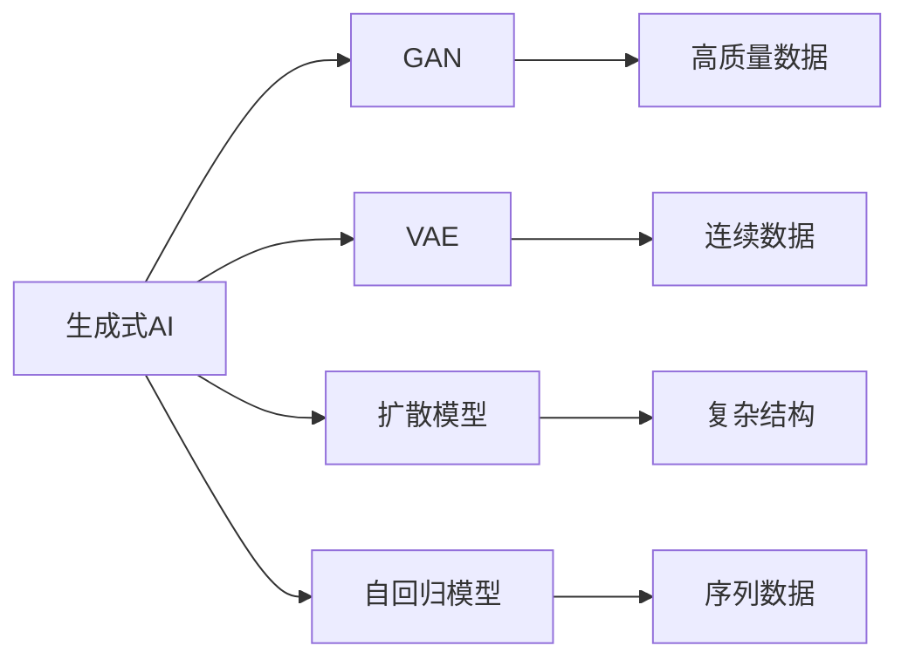

                 

# 生成式AIGC：未来商业的智能化发展

在数字经济的时代，人工智能（AI）技术的蓬勃发展为各行各业带来了前所未有的智能化机遇。生成式人工智能（Generative AI, GAI）作为一种高级的AI形式，其核心是利用深度学习模型生成新的、具有创造性和价值的数据和内容。在商业智能化发展中，生成式AI正成为推动产业升级、创新服务和创造价值的重要引擎。本文将深入探讨生成式AI的核心概念、算法原理及应用实践，并展望其未来发展趋势与挑战，为读者提供一个全面的视角，以洞察这一技术如何深刻影响商业生态。

## 1. 背景介绍

### 1.1 问题由来

随着大数据和计算能力的迅猛发展，深度学习模型在图像、文本、语音等领域取得了突破性进展。特别是生成对抗网络（GAN）和变分自编码器（VAE）等生成模型，能够生成高质量的图像和音频，甚至文本内容。这些生成模型不仅展示了强大的创造力，还带来了商业应用中的新机遇。

在商业智能化领域，生成式AI的应用涉及广告创意、内容创作、个性化推荐、图像生成等多个方面。其核心优势在于能够自动化生成高质量内容，大幅提升运营效率，降低人工成本，并通过创意和创新的内容提升用户体验。

### 1.2 问题核心关键点

生成式AI的关键在于其生成能力，即能够根据给定的输入生成新的、具有创意的内容。这一过程依赖于模型的训练数据、架构设计和优化算法。核心关键点包括：

- **数据驱动**：生成式AI通过大量的标注数据进行训练，学习到生成目标的统计特征。
- **模型架构**：通常采用神经网络架构，如GAN、VAE、Transformer等，能够捕捉输入与生成数据之间的复杂映射关系。
- **优化算法**：如梯度下降、Adam、SGD等，用于最小化损失函数，优化模型参数。
- **创造性评估**：生成式AI的输出效果往往难以直接量化，需要通过创造性评估标准，如人类感知度、艺术性、情感共鸣等，进行客观评估。

### 1.3 问题研究意义

生成式AI的研究和应用具有重要的理论和实践意义：

1. **降低成本**：自动化生成内容可以大幅度减少人工创作成本，特别是在广告、内容创作等领域。
2. **提升效率**：生成式AI能够快速生成大量高质量内容，加速产品迭代和市场响应。
3. **创新服务**：通过创意生成，提升个性化推荐、广告创意等服务的水平和用户满意度。
4. **数据增强**：生成式AI能够生成更多样化的数据，扩展训练集的规模，提升模型泛化能力。

## 2. 核心概念与联系

### 2.1 核心概念概述

- **生成式AI**：利用深度学习模型生成新内容的技术，包括图像、文本、音频等。
- **生成对抗网络（GAN）**：一种通过对抗训练生成高质量数据的深度学习框架。
- **变分自编码器（VAE）**：利用潜在变量生成连续数据的深度学习模型。
- **扩散模型（Diffusion Model）**：通过控制噪声和信号的扩散过程，生成具有复杂结构的图像和音频。
- **自回归模型（Autoregressive Model）**：如LSTM、GRU等，通过预测序列中下一个样本，生成新的文本和音频。

这些概念之间通过以下Mermaid流程图展示其联系：



### 2.2 概念间的关系

生成式AI通过不同类型的生成模型，能够生成多样化的内容。GAN和VAE是两种经典的方法，用于生成高质量图像和连续数据。扩散模型和自回归模型则针对不同的生成目标，提供了灵活的生成策略。这些模型之间的结合，能够扩展生成式AI的应用场景和效果。

## 3. 核心算法原理 & 具体操作步骤

### 3.1 算法原理概述

生成式AI的算法原理基于深度学习模型，通过学习输入与输出之间的复杂映射关系，实现内容的自动化生成。其核心算法包括：

- **生成对抗网络（GAN）**：通过两个神经网络（生成器和判别器）的对抗训练，生成高质量的图像和音频。
- **变分自编码器（VAE）**：利用潜在变量的概率分布，生成连续的图像和音频数据。
- **扩散模型**：通过控制噪声和信号的扩散过程，生成复杂的图像和音频。
- **自回归模型**：通过预测序列中下一个样本，生成新的文本和音频。

这些算法的核心目标都是最小化生成内容与真实内容之间的差异，并最大化生成内容的创意性和多样性。

### 3.2 算法步骤详解

生成式AI的训练和生成步骤主要包括以下几个环节：

1. **数据准备**：收集并预处理训练数据，进行归一化和标准化。
2. **模型训练**：通过梯度下降等优化算法，最小化生成内容与真实内容之间的差异。
3. **内容生成**：在训练好的模型上，输入随机噪声或特定的初始值，生成新的内容。
4. **评估与优化**：通过创造性评估标准，评估生成内容的创意性和多样性，进行必要的调整和优化。

### 3.3 算法优缺点

生成式AI的优点包括：

- **高效**：能够快速生成大量高质量内容。
- **创意**：通过对抗训练和复杂模型结构，生成具有创造性的内容。
- **灵活**：适应性强，能够应用于多个领域和任务。

然而，生成式AI也存在一些缺点：

- **数据依赖**：依赖高质量的标注数据进行训练，数据不足可能导致生成效果不佳。
- **可解释性差**：生成内容的来源和逻辑难以解释，缺乏透明度。
- **伦理问题**：生成的内容可能存在偏见和歧视，对社会产生负面影响。
- **计算资源需求高**：高参数量和高计算复杂度，需要强大的硬件支持。

### 3.4 算法应用领域

生成式AI已经在多个领域展示了其强大应用潜力，主要包括：

- **广告创意**：生成动态广告和创意，提升广告效果。
- **内容创作**：自动生成新闻、文章、博客等内容，加速内容生产。
- **个性化推荐**：根据用户行为生成个性化推荐，提升用户体验。
- **图像生成**：生成高质量图像，应用于游戏、影视、艺术等领域。
- **音乐生成**：生成音乐、歌曲等，应用于娱乐和教育。

## 4. 数学模型和公式 & 详细讲解 & 举例说明

### 4.1 数学模型构建

生成式AI的数学模型通常基于概率分布，用于生成具有一定概率的随机变量。以下以GAN为例，介绍其核心数学模型。

GAN由生成器（Generator）和判别器（Discriminator）组成。生成器将随机噪声作为输入，生成与真实数据分布相似的伪数据。判别器则对生成的伪数据和真实数据进行分类，最小化真实数据和伪数据之间的差异。

GAN的目标函数为：

$$
\min_G \max_D V(D,G) = \mathbb{E}_{x\sim p_{data}}\log D(x) + \mathbb{E}_{z\sim p_z}\log(1-D(G(z)))
$$

其中，$V(D,G)$为GAN的目标函数，$D$为判别器，$G$为生成器，$z$为随机噪声，$p_z$为噪声分布，$p_{data}$为真实数据分布。

### 4.2 公式推导过程

GAN的生成过程可以概括为以下几个步骤：

1. **随机噪声生成**：将随机噪声作为输入，生成伪数据$x$。
2. **判别器训练**：将伪数据$x$和真实数据$x_{data}$送入判别器$D$进行分类。
3. **生成器训练**：通过反向传播，调整生成器$G$的参数，最小化$V(D,G)$。
4. **输出伪数据**：根据调整后的生成器$G$，生成新的伪数据$x'$。

GAN的生成器$G$和判别器$D$的损失函数分别为：

$$
L_G = -\mathbb{E}_{z\sim p_z}\log D(G(z))
$$

$$
L_D = -\mathbb{E}_{x\sim p_{data}}\log D(x) - \mathbb{E}_{z\sim p_z}\log(1-D(G(z)))
$$

### 4.3 案例分析与讲解

假设我们使用GAN生成手写数字图像。首先，收集大量手写数字图像作为训练数据。然后，构建一个生成器和判别器，使用随机噪声作为输入，生成伪图像。通过交替训练生成器和判别器，生成器能够逐渐生成与真实数据分布相似的高质量手写数字图像。

在实际应用中，生成式AI的模型和算法需要根据具体任务进行调整和优化，以获得最佳效果。例如，在文本生成任务中，自回归模型如GPT-3和Transformer等，通过预测序列中的下一个样本，生成连贯的文本内容。

## 5. 项目实践：代码实例和详细解释说明

### 5.1 开发环境搭建

- **Python环境**：安装Python 3.7及以上版本，推荐使用Anaconda。
- **深度学习库**：安装TensorFlow、PyTorch等深度学习库，用于模型的构建和训练。
- **生成式AI库**：安装OpenAI的GPT-3、Google的BigQuery等生成式AI库，用于实现生成模型。

### 5.2 源代码详细实现

以下是一个使用TensorFlow实现GAN的代码实例：

```python
import tensorflow as tf
import numpy as np

# 定义生成器和判别器
class Generator(tf.keras.Model):
    def __init__(self):
        super(Generator, self).__init__()
        self.dense1 = tf.keras.layers.Dense(128, activation='relu')
        self.dense2 = tf.keras.layers.Dense(784, activation='sigmoid')

    def call(self, inputs):
        x = self.dense1(inputs)
        x = self.dense2(x)
        return x

class Discriminator(tf.keras.Model):
    def __init__(self):
        super(Discriminator, self).__init__()
        self.dense1 = tf.keras.layers.Dense(128, activation='relu')
        self.dense2 = tf.keras.layers.Dense(1, activation='sigmoid')

    def call(self, inputs):
        x = self.dense1(inputs)
        x = self.dense2(x)
        return x

# 定义损失函数和优化器
def generator_loss(discriminator, real_images):
    generated_images = generator(tf.random.normal([batch_size, noise_size]))
    d_loss_real = discriminator(tf.reshape(real_images, (batch_size, 784)))
    d_loss_fake = discriminator(tf.reshape(generated_images, (batch_size, 784)))
    g_loss = tf.reduce_mean(tf.nn.sigmoid_cross_entropy_with_logits(d_loss_fake, tf.ones_like(d_loss_fake)))
    return g_loss, d_loss_fake

def discriminator_loss(real_images, generated_images):
    d_loss_real = discriminator(tf.reshape(real_images, (batch_size, 784)))
    d_loss_fake = discriminator(tf.reshape(generated_images, (batch_size, 784)))
    return tf.reduce_mean(tf.nn.sigmoid_cross_entropy_with_logits(d_loss_real, tf.ones_like(d_loss_real)), tf.reduce_mean(tf.nn.sigmoid_cross_entropy_with_logits(d_loss_fake, tf.zeros_like(d_loss_fake)))

# 定义训练函数
@tf.function
def train_step(real_images, real_labels):
    with tf.GradientTape() as g:
        generated_images = generator(tf.random.normal([batch_size, noise_size]))
        g_loss, d_loss_fake = generator_loss(discriminator, real_images)
    g_gradients = g.gradient(g_loss, generator.trainable_variables)
    d_gradients = g.gradient(d_loss_fake, discriminator.trainable_variables)
    optimizer.apply_gradients(zip(g_gradients, generator.trainable_variables))
    optimizer.apply_gradients(zip(d_gradients, discriminator.trainable_variables))

# 加载数据和模型
real_images = load_real_images()
real_labels = load_real_labels()
generator = Generator()
discriminator = Discriminator()
optimizer = tf.keras.optimizers.Adam(learning_rate=0.0002)

# 训练模型
for epoch in range(num_epochs):
    for i in range(num_steps_per_epoch):
        train_step(real_images[i], real_labels[i])
```

### 5.3 代码解读与分析

- **模型定义**：使用TensorFlow定义生成器和判别器，通过全连接层实现。
- **损失函数**：定义生成器和判别器的损失函数，最小化生成伪数据与真实数据之间的差异。
- **训练函数**：定义训练函数，使用梯度下降优化器进行模型训练。
- **数据加载**：加载真实数据，进行归一化和标准化。

### 5.4 运行结果展示

假设在训练过程中，生成器能够逐渐生成高质量的手写数字图像。可以通过可视化工具展示训练过程中的生成效果，例如使用TensorBoard对训练过程进行监控。

```python
@tf.function
def visualize_images(images):
    return images.numpy().reshape((-1, 28, 28))

# 可视化生成图像
for epoch in range(num_epochs):
    real_images, generated_images = train_step(real_images, real_labels)
    real_images = real_images.numpy()
    generated_images = visualize_images(generated_images)
    plt.imshow(generated_images[0], cmap='gray')
    plt.show()
```

## 6. 实际应用场景

### 6.1 广告创意

生成式AI可以生成高质量的广告创意，帮助企业快速制作多样化的广告素材。例如，对于一家电商公司，可以使用生成式AI自动生成商品展示广告，提升点击率和转化率。具体步骤如下：

1. **数据准备**：收集历史广告数据和商品信息。
2. **模型训练**：使用生成式AI模型训练广告创意生成器，最小化生成的广告与真实广告之间的差异。
3. **创意生成**：根据商品信息生成新的广告创意。
4. **效果评估**：通过A/B测试评估生成的广告效果，进行优化和调整。

### 6.2 内容创作

生成式AI可以自动生成新闻、文章、博客等内容，提升内容生产效率。例如，对于一家媒体公司，可以使用生成式AI自动生成新闻稿件，减少人工写作工作量。具体步骤如下：

1. **数据准备**：收集历史新闻和相关主题的数据。
2. **模型训练**：使用生成式AI模型训练新闻生成器，最小化生成的新闻与真实新闻之间的差异。
3. **内容生成**：根据给定的主题和日期，生成新的新闻稿件。
4. **效果评估**：通过人工和自动评估标准，评估生成的新闻质量，进行优化和调整。

### 6.3 个性化推荐

生成式AI可以生成个性化的推荐内容，提升用户体验。例如，对于一家在线视频平台，可以使用生成式AI自动生成个性化推荐视频。具体步骤如下：

1. **数据准备**：收集用户行为数据和视频数据。
2. **模型训练**：使用生成式AI模型训练推荐生成器，最小化生成的推荐与用户偏好之间的差异。
3. **推荐生成**：根据用户行为生成新的推荐视频。
4. **效果评估**：通过用户反馈和点击率等指标，评估推荐效果，进行优化和调整。

### 6.4 未来应用展望

随着生成式AI技术的不断发展，未来其在商业智能化领域的应用将更加广泛和深入。以下是几个未来应用展望：

1. **虚拟内容创作**：生成式AI可以自动生成虚拟角色、虚拟场景等，应用于游戏、影视和虚拟现实等领域。
2. **虚拟助手**：通过生成式AI技术，开发智能虚拟助手，提供客服、咨询、导航等服务。
3. **个性化设计**：生成式AI可以自动生成个性化产品设计，应用于时尚、家居和汽车等领域。
4. **医疗诊断**：生成式AI可以生成医学图像和报告，辅助医疗诊断和治疗。
5. **金融风控**：生成式AI可以生成模拟数据和交易记录，用于金融风控和模拟测试。

## 7. 工具和资源推荐

### 7.1 学习资源推荐

- **《生成对抗网络：理论、算法与应用》**：书籍全面介绍GAN的理论基础和算法实现。
- **《深度学习》课程**：斯坦福大学的深度学习课程，涵盖GAN、VAE等生成模型。
- **《深度学习理论与实践》**：书籍介绍了生成式AI的理论和实践，包括GAN、VAE和扩散模型。
- **arXiv预印本**：最新的生成式AI研究成果，涵盖论文、代码和项目等资源。
- **GitHub**：大量生成式AI项目和代码库，提供实践案例和资源。

### 7.2 开发工具推荐

- **TensorFlow**：谷歌开源的深度学习框架，支持GPU和TPU等高性能计算。
- **PyTorch**：Facebook开源的深度学习框架，易于使用和扩展。
- **OpenAI GPT-3**：OpenAI提供的生成式AI模型，支持自然语言生成。
- **Google BigQuery**：谷歌提供的生成式AI模型，支持文本生成和图像生成。
- **Hugging Face**：提供预训练模型和工具库，支持多种生成式AI任务。

### 7.3 相关论文推荐

- **GAN论文**：《Image Synthesis with Improved Generative Adversarial Networks》
- **VAE论文**：《Variational Autoencoder》
- **扩散模型论文**：《Diffusion Models》
- **自回归模型论文**：《Attention is All You Need》
- **生成式AI综述**：《A Comprehensive Survey of Generative AI》

## 8. 总结：未来发展趋势与挑战

### 8.1 研究成果总结

生成式AI在商业智能化领域展示了巨大的潜力，其核心技术包括GAN、VAE、扩散模型和自回归模型。通过这些技术，生成式AI能够自动生成高质量的内容，提升运营效率和用户体验。然而，生成式AI也面临数据依赖、可解释性差和伦理问题等挑战。

### 8.2 未来发展趋势

未来生成式AI的发展趋势包括：

1. **高效生成**：开发更加高效的生成算法，提升生成速度和质量。
2. **多样化生成**：扩展生成内容的多样性和创意性，应用于更多领域。
3. **实时生成**：实现实时生成内容，满足即时需求。
4. **跨模态生成**：结合文本、图像和音频等多种模态数据，实现更丰富的生成效果。
5. **智能化设计**：结合智能决策和生成技术，提升生成内容的质量和相关性。

### 8.3 面临的挑战

生成式AI的发展面临以下挑战：

1. **数据瓶颈**：生成式AI需要大量高质量的标注数据，数据不足可能导致生成效果不佳。
2. **可解释性差**：生成内容的来源和逻辑难以解释，缺乏透明度。
3. **伦理问题**：生成的内容可能存在偏见和歧视，对社会产生负面影响。
4. **计算资源需求高**：高参数量和高计算复杂度，需要强大的硬件支持。

### 8.4 研究展望

未来的研究应在以下几个方面寻求新的突破：

1. **无监督和半监督生成**：摆脱对大量标注数据的依赖，利用无监督和半监督学习，提升生成效果。
2. **跨模态生成**：结合文本、图像和音频等多种模态数据，实现更丰富的生成效果。
3. **智能化设计**：结合智能决策和生成技术，提升生成内容的质量和相关性。
4. **伦理和隐私保护**：确保生成的内容符合伦理和隐私标准，避免负面影响。

## 9. 附录：常见问题与解答

**Q1：生成式AI的生成效果如何评估？**

A: 生成式AI的生成效果评估通常依赖于创造性评估标准，如人类感知度、艺术性、情感共鸣等。同时，通过对比生成内容与真实内容之间的差异，使用标准评估指标，如PSNR、SSIM等，进行客观评估。

**Q2：如何优化生成式AI的生成效果？**

A: 优化生成式AI的生成效果需要从数据、模型和算法等多个方面进行调整和优化。例如，通过数据增强、模型架构改进、超参数调整等手段，提升生成内容的创意性和多样性。

**Q3：生成式AI在实际应用中需要注意哪些问题？**

A: 生成式AI在实际应用中需要注意以下问题：
1. 数据隐私：确保生成内容的隐私性，避免数据泄露。
2. 伦理规范：确保生成内容的伦理合规性，避免偏见和歧视。
3. 内容真实性：确保生成内容的真实性和准确性，避免误导信息。

**Q4：生成式AI在商业智能化中的作用是什么？**

A: 生成式AI在商业智能化中起到了以下几个作用：
1. 降低成本：自动生成高质量内容，减少人工创作成本。
2. 提升效率：快速生成大量内容，加速内容生产和运营。
3. 增强创意：通过对抗训练和复杂模型结构，生成具有创造性的内容。
4. 个性化服务：根据用户行为生成个性化内容，提升用户体验。

通过以上系统梳理，我们能够全面了解生成式AI的核心概念、算法原理及应用实践，展望其未来发展趋势与挑战。在数字化时代，生成式AI将为商业智能化发展带来新的突破，开启更加智能化的未来。

---

作者：禅与计算机程序设计艺术 / Zen and the Art of Computer Programming

