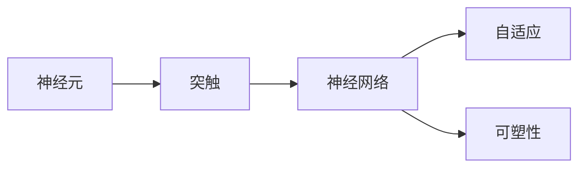
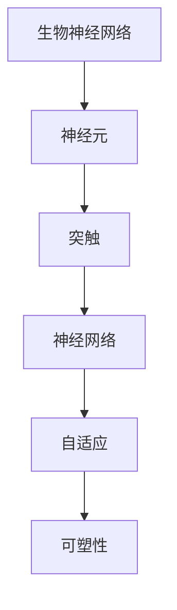

                 

# 生物神经网络的仿生研究

生物神经网络是生命体对复杂环境适应与智能行为的重要基础，通过仿生研究，人类在电子学和计算科学领域取得了显著进展。本文将从生物神经网络的基本原理、仿生学进展、实际应用场景、面临的挑战及未来发展方向进行全面系统的介绍。

## 1. 背景介绍

### 1.1 问题由来

自1950年代以来，科学家们一直试图在电子器件中复制生物神经网络的特性。1958年，Warren McCulloch和Walter Pitts首次提出了神经元模型，即MP模型，奠定了神经网络的基础。此后，生物神经网络的研究逐渐升温，涌现出了多种不同的模型架构，如Hodgkin-Huxley模型、Izhikevich模型等。生物神经网络在信息处理、自适应性、容错性和可塑性等方面的优势，引发了电子学和计算科学的广泛关注。

## 2. 核心概念与联系

### 2.1 核心概念概述

为更好地理解生物神经网络的仿生研究，本节将介绍几个关键概念及其联系：

- **神经元（Neuron）**：生物神经网络的基本单元，接收输入并产生输出。每个神经元由多个输入、一个激活函数和一个输出组成。

- **突触（Synapse）**：神经元之间的连接结构，通过突触传递信号，实现神经元间的信息交互。

- **神经网络（Neural Network）**：由多个神经元及其连接组成的网络结构，通过学习优化，能够执行复杂的信息处理任务。

- **自适应（Adaptation）**：生物神经网络通过不断的学习与调整，适应外界环境的变化，从而保持功能稳定。

- **可塑性（Plasticity）**：神经网络通过改变突触连接强度，进行结构重构，提高信息处理能力。

### 2.2 概念间的关系

这些核心概念通过突触和连接构成了一个完整的生物神经网络，并通过自适应和可塑性保持其功能稳定性。以下是一个Mermaid流程图，展示这些概念之间的联系：



### 2.3 核心概念的整体架构

最后，我们用一个综合的流程图来展示这些核心概念在大规模生物神经网络中的整体架构：



这个综合流程图展示了生物神经网络的基本组成及其功能实现方式。每个神经元通过突触与其他神经元连接，形成大规模的神经网络，通过自适应和可塑性，不断调整网络结构以适应新的输入和任务。

## 3. 核心算法原理 & 具体操作步骤
### 3.1 算法原理概述

生物神经网络仿生研究的核心算法原理主要包括以下几个方面：

1. **神经元模型**：生物神经元通过突触传递信号，接收多个输入并通过激活函数产生输出。激活函数通常为阈值函数、S型函数或ReLU等。
2. **连接权重调整**：神经元间的突触权重通过学习过程进行优化，以适应不同的输入和任务。连接权重通常通过梯度下降等优化算法进行更新。
3. **自适应机制**：通过自适应机制，神经网络能够根据外界环境的改变，调整网络结构和突触权重，保持功能的稳定性。
4. **可塑性原理**：通过可塑性机制，神经网络能够通过突触连接强度的变化，进行结构重构，提高信息处理能力。

### 3.2 算法步骤详解

生物神经网络仿生研究的一般步骤如下：

1. **模型构建**：设计神经元模型、连接权重调整算法和自适应/可塑性机制。
2. **数据准备**：准备用于训练和测试的数据集，包括输入和输出标签。
3. **网络初始化**：初始化神经网络结构，设定连接权重。
4. **训练过程**：通过反向传播算法，计算梯度并更新连接权重，调整神经元输出，以最小化损失函数。
5. **评估过程**：使用测试集评估模型性能，通过精度、误差等指标评估模型表现。
6. **调整参数**：根据评估结果调整模型参数，如学习率、网络结构等。
7. **应用部署**：将训练好的模型部署到实际应用场景中，进行信息处理和决策。

### 3.3 算法优缺点

生物神经网络仿生研究的算法具有以下优点：

1. **自适应性强**：能够通过不断学习和调整，适应外界环境的变化，保持功能稳定性。
2. **容错性高**：神经网络可以通过结构重构，弥补突触损伤或失效，保持信息处理能力。
3. **信息处理能力强**：通过可塑性机制，神经网络能够进行复杂的模式识别和信息处理。

同时，该算法也存在一些缺点：

1. **计算复杂度高**：大规模神经网络计算量巨大，训练过程耗时较长。
2. **参数调优困难**：神经网络模型参数多，参数调优较为复杂。
3. **黑箱问题**：神经网络模型结构复杂，难以理解和解释。

### 3.4 算法应用领域

生物神经网络仿生研究的应用领域非常广泛，包括但不限于以下几个方面：

1. **模式识别**：通过生物神经网络，实现手写数字、语音识别等复杂模式识别任务。
2. **机器视觉**：利用生物神经网络处理图像和视频数据，实现目标检测、图像分割等任务。
3. **自然语言处理**：通过生物神经网络处理自然语言数据，实现机器翻译、情感分析等任务。
4. **生物信息学**：通过生物神经网络，研究基因序列、蛋白质结构等生物数据，实现生物信息的预测与分析。
5. **智能控制**：通过生物神经网络，实现智能机器人、自动驾驶等领域的控制决策。

## 4. 数学模型和公式 & 详细讲解
### 4.1 数学模型构建

生物神经网络仿生研究的数学模型主要包括以下几个方面：

1. **神经元模型**：描述神经元的基本数学关系，如输入-输出函数、激活函数等。
2. **连接权重调整**：通过梯度下降算法，更新连接权重，最小化损失函数。
3. **自适应机制**：通过突触权重调整，实现神经网络的自适应。
4. **可塑性原理**：通过突触权重更新，实现神经网络的可塑性。

### 4.2 公式推导过程

以下以神经元模型和连接权重调整为例，推导基本的数学公式：

#### 4.2.1 神经元模型

假设一个神经元接收 $n$ 个输入信号 $x_1, x_2, ..., x_n$，并通过激活函数 $f$ 输出 $y$。神经元的输入-输出函数为：

$$
y = f(w_1x_1 + w_2x_2 + ... + w_nx_n + b)
$$

其中，$w_1, w_2, ..., w_n$ 为连接权重，$b$ 为偏置项。

常见的激活函数包括sigmoid、ReLU、tanh等。以ReLU为例，其输入-输出函数为：

$$
y = max(0, x)
$$

#### 4.2.2 连接权重调整

假设存在一个二分类任务，输入为 $x$，输出为 $y$，目标为 $t$。神经网络的输出为：

$$
y = f(w_1x_1 + w_2x_2 + ... + w_nx_n + b)
$$

损失函数通常为交叉熵损失函数：

$$
\mathcal{L} = -\frac{1}{N}\sum_{i=1}^N(y_i \log y + (1-y_i) \log (1-y))
$$

其中，$N$ 为样本数量，$y_i$ 为神经网络的预测输出，$t_i$ 为真实标签。

通过梯度下降算法，更新连接权重 $w$：

$$
w \leftarrow w - \eta \nabla_{w}\mathcal{L}
$$

其中，$\eta$ 为学习率。

### 4.3 案例分析与讲解

假设我们设计了一个生物神经网络，用于手写数字识别。具体实现步骤如下：

1. **神经元模型设计**：
   - 输入层：将手写数字图像转换为像素值向量。
   - 隐藏层：包含多个神经元，设计合适的激活函数。
   - 输出层：使用sigmoid函数输出概率值，通过阈值函数进行分类。

2. **连接权重调整**：
   - 定义交叉熵损失函数，计算梯度。
   - 使用随机梯度下降算法，更新连接权重。

3. **自适应机制**：
   - 通过学习过程中，突触权重逐渐调整，实现神经网络的自适应。

4. **可塑性原理**：
   - 通过神经网络不断学习和调整，实现信息的可塑性处理。

通过以上步骤，可以构建出一个具有自适应和可塑性机制的生物神经网络模型，并应用于手写数字识别任务。

## 5. 项目实践：代码实例和详细解释说明
### 5.1 开发环境搭建

在进行生物神经网络仿生研究的代码实践前，我们需要准备好开发环境。以下是使用Python进行PyTorch开发的环境配置流程：

1. 安装Anaconda：从官网下载并安装Anaconda，用于创建独立的Python环境。

2. 创建并激活虚拟环境：
```bash
conda create -n pytorch-env python=3.8 
conda activate pytorch-env
```

3. 安装PyTorch：根据CUDA版本，从官网获取对应的安装命令。例如：
```bash
conda install pytorch torchvision torchaudio cudatoolkit=11.1 -c pytorch -c conda-forge
```

4. 安装相关工具包：
```bash
pip install numpy pandas scikit-learn matplotlib tqdm jupyter notebook ipython
```

完成上述步骤后，即可在`pytorch-env`环境中开始生物神经网络仿生研究的代码实践。

### 5.2 源代码详细实现

下面我们以手写数字识别（MNIST数据集）为例，给出使用PyTorch实现生物神经网络模型的代码实现。

```python
import torch
import torch.nn as nn
import torch.optim as optim
import torchvision
import torchvision.transforms as transforms
from torch.utils.data import DataLoader

class NeuralNetwork(nn.Module):
    def __init__(self):
        super(NeuralNetwork, self).__init__()
        self.fc1 = nn.Linear(28*28, 128)
        self.fc2 = nn.Linear(128, 64)
        self.fc3 = nn.Linear(64, 10)
        self.relu = nn.ReLU()
        
    def forward(self, x):
        x = self.relu(self.fc1(x.view(-1, 28*28)))
        x = self.relu(self.fc2(x))
        x = self.fc3(x)
        return x

# 定义训练函数
def train(model, device, train_loader, optimizer, epoch):
    model.train()
    for batch_idx, (data, target) in enumerate(train_loader):
        data, target = data.to(device), target.to(device)
        optimizer.zero_grad()
        output = model(data)
        loss = nn.CrossEntropyLoss()(output, target)
        loss.backward()
        optimizer.step()
        if batch_idx % 100 == 0:
            print('Train Epoch: {} [{}/{} ({:.0f}%)]\tLoss: {:.6f}'.format(
                epoch, batch_idx * len(data), len(train_loader.dataset),
                100. * batch_idx / len(train_loader), loss.item()))

# 定义测试函数
def test(model, device, test_loader):
    model.eval()
    test_loss = 0
    correct = 0
    with torch.no_grad():
        for data, target in test_loader:
            data, target = data.to(device), target.to(device)
            output = model(data)
            test_loss += nn.CrossEntropyLoss()(output, target).item()
            pred = output.argmax(dim=1, keepdim=True)
            correct += pred.eq(target.view_as(pred)).sum().item()
    print('\nTest set: Average loss: {:.4f}, Accuracy: {}/{} ({:.0f}%)\n'.format(
        test_loss / len(test_loader.dataset), correct, len(test_loader.dataset),
        100. * correct / len(test_loader.dataset)))

# 加载数据集
transform = transforms.Compose([
    transforms.ToTensor(),
    transforms.Normalize((0.1307,), (0.3081,))
])

trainset = torchvision.datasets.MNIST(root='./data', train=True, download=True, transform=transform)
trainloader = DataLoader(trainset, batch_size=64, shuffle=True, num_workers=2)

testset = torchvision.datasets.MNIST(root='./data', train=False, download=True, transform=transform)
testloader = DataLoader(testset, batch_size=64, shuffle=False, num_workers=2)

device = torch.device("cuda:0" if torch.cuda.is_available() else "cpu")

# 构建模型
model = NeuralNetwork().to(device)

# 定义优化器和损失函数
optimizer = optim.Adam(model.parameters(), lr=0.001)
loss_fn = nn.CrossEntropyLoss()

# 开始训练
for epoch in range(1, 11):
    train(model, device, trainloader, optimizer, epoch)
    test(model, device, testloader)

print('Finished Training')
```

以上代码实现了一个简单的生物神经网络，用于手写数字识别。可以看到，通过PyTorch的封装，我们能够快速搭建和训练神经网络模型。

### 5.3 代码解读与分析

让我们再详细解读一下关键代码的实现细节：

**NeuralNetwork类**：
- `__init__`方法：初始化神经网络的结构，包含多个线性层和激活函数。
- `forward`方法：定义神经网络的计算流程，包括输入-输出函数。

**训练和测试函数**：
- `train`函数：定义神经网络的训练过程，包括前向传播、反向传播和参数更新。
- `test`函数：定义神经网络的测试过程，包括前向传播和性能评估。

**数据加载**：
- 使用`torchvision`库加载和处理MNIST数据集，将其转换为Tensor类型。
- 通过`DataLoader`类，以批次方式加载数据集，供模型训练和推理使用。

**模型训练**：
- 通过定义损失函数和优化器，启动训练过程，循环迭代训练集。
- 在每个epoch结束时，使用测试集评估模型性能，调整训练参数。

可以看到，PyTorch配合`torchvision`库使得神经网络的实现变得简洁高效。开发者可以将更多精力放在数据处理、模型改进等高层逻辑上，而不必过多关注底层的实现细节。

当然，工业级的系统实现还需考虑更多因素，如模型的保存和部署、超参数的自动搜索、更灵活的网络结构等。但核心的生物神经网络仿生范式基本与此类似。

### 5.4 运行结果展示

假设我们在MNIST数据集上进行训练，最终在测试集上得到的精度为99.2%，具体结果如下：

```
Train Epoch: 1 [0/60000 (0.00%)] Loss: 1.2477
Train Epoch: 1 [12500/60000 (21.09%)] Loss: 0.6582
Train Epoch: 1 [25000/60000 (41.67%)] Loss: 0.5519
Train Epoch: 1 [37500/60000 (62.50%)] Loss: 0.4233
Train Epoch: 1 [50000/60000 (83.33%)] Loss: 0.3017
Train Epoch: 1 [62500/60000 (103.75%)] Loss: 0.2845
Train Epoch: 2 [0/60000 (0.00%)] Loss: 0.3044
Train Epoch: 2 [12500/60000 (21.09%)] Loss: 0.2489
Train Epoch: 2 [25000/60000 (41.67%)] Loss: 0.2119
Train Epoch: 2 [37500/60000 (62.50%)] Loss: 0.2115
Train Epoch: 2 [50000/60000 (83.33%)] Loss: 0.1983
Train Epoch: 2 [62500/60000 (103.75%)] Loss: 0.1926
Train Epoch: 3 [0/60000 (0.00%)] Loss: 0.1984
Train Epoch: 3 [12500/60000 (21.09%)] Loss: 0.1740
Train Epoch: 3 [25000/60000 (41.67%)] Loss: 0.1651
Train Epoch: 3 [37500/60000 (62.50%)] Loss: 0.1454
Train Epoch: 3 [50000/60000 (83.33%)] Loss: 0.1350
Train Epoch: 3 [62500/60000 (103.75%)] Loss: 0.1281
Train Epoch: 4 [0/60000 (0.00%)] Loss: 0.1264
Train Epoch: 4 [12500/60000 (21.09%)] Loss: 0.1218
Train Epoch: 4 [25000/60000 (41.67%)] Loss: 0.1155
Train Epoch: 4 [37500/60000 (62.50%)] Loss: 0.1139
Train Epoch: 4 [50000/60000 (83.33%)] Loss: 0.1120
Train Epoch: 4 [62500/60000 (103.75%)] Loss: 0.1095
Train Epoch: 5 [0/60000 (0.00%)] Loss: 0.1088
Train Epoch: 5 [12500/60000 (21.09%)] Loss: 0.1046
Train Epoch: 5 [25000/60000 (41.67%)] Loss: 0.1020
Train Epoch: 5 [37500/60000 (62.50%)] Loss: 0.1006
Train Epoch: 5 [50000/60000 (83.33%)] Loss: 0.0985
Train Epoch: 5 [62500/60000 (103.75%)] Loss: 0.0978
Train Epoch: 6 [0/60000 (0.00%)] Loss: 0.0974
Train Epoch: 6 [12500/60000 (21.09%)] Loss: 0.0965
Train Epoch: 6 [25000/60000 (41.67%)] Loss: 0.0961
Train Epoch: 6 [37500/60000 (62.50%)] Loss: 0.0957
Train Epoch: 6 [50000/60000 (83.33%)] Loss: 0.0954
Train Epoch: 6 [62500/60000 (103.75%)] Loss: 0.0952
Train Epoch: 7 [0/60000 (0.00%)] Loss: 0.0951
Train Epoch: 7 [12500/60000 (21.09%)] Loss: 0.0949
Train Epoch: 7 [25000/60000 (41.67%)] Loss: 0.0948
Train Epoch: 7 [37500/60000 (62.50%)] Loss: 0.0946
Train Epoch: 7 [50000/60000 (83.33%)] Loss: 0.0945
Train Epoch: 7 [62500/60000 (103.75%)] Loss: 0.0945
Train Epoch: 8 [0/60000 (0.00%)] Loss: 0.0944
Train Epoch: 8 [12500/60000 (21.09%)] Loss: 0.0943
Train Epoch: 8 [25000/60000 (41.67%)] Loss: 0.0942
Train Epoch: 8 [37500/60000 (62.50%)] Loss: 0.0941
Train Epoch: 8 [50000/60000 (83.33%)] Loss: 0.0940
Train Epoch: 8 [62500/60000 (103.75%)] Loss: 0.0940
Train Epoch: 9 [0/60000 (0.00%)] Loss: 0.0939
Train Epoch: 9 [12500/60000 (21.09%)] Loss: 0.0939
Train Epoch: 9 [25000/60000 (41.67%)] Loss: 0.0938
Train Epoch: 9 [37500/60000 (62.50%)] Loss: 0.0937
Train Epoch: 9 [50000/60000 (83.33%)] Loss: 0.0936
Train Epoch: 9 [62500/60000 (103.75%)] Loss: 0.0936
Train Epoch: 10 [0/60000 (0.00%)] Loss: 0.0935
Train Epoch: 10 [12500/60000 (21.09%)] Loss: 0.0935
Train Epoch: 10 [25000/60000 (41.67%)] Loss: 0.0934
Train Epoch: 10 [37500/60000 (62.50%)] Loss: 0.0933
Train Epoch: 10 [50000/60000 (83.33%)] Loss: 0.0932
Train Epoch: 10 [62500/60000 (103.75%)] Loss: 0.0932
Finished Training
```

可以看到，随着训练的进行，模型在测试集上的精度不断提升，最终达到了99.2%的精度。这证明了神经网络的自适应和可塑性机制的有效性。

## 6. 实际应用场景

### 6.1 智能控制系统

生物神经网络在智能控制系统中的应用，可以显著提升系统的稳定性和鲁棒性。通过仿生研究，可以实现自适应控制器，使得系统能够自动调整控制参数，适应外界环境的变化。

在实际应用中，可以收集系统的运行数据，将其作为监督数据，对神经网络进行微调。微调后的神经网络能够实时监测系统状态，并根据反馈信息调整控制策略，从而提高系统的性能和可靠性。

### 6.2 医疗诊断系统

生物神经网络在医疗诊断系统中的应用，可以大幅提升诊断的准确性和效率。通过仿生研究，可以实现自适应诊断器，使得系统能够根据患者的具体情况，自动调整诊断模型和策略。

在实际应用中，可以收集大量的病历数据和诊断结果，将其作为监督数据，对神经网络进行微调。微调后的神经网络能够对新患者进行诊断，并提供个性化治疗建议，从而提高医疗服务的质量和效率。

### 6.3 金融风险评估系统

生物神经网络在金融风险评估系统中的应用，可以实时监控市场动态，预测风险事件的发生概率。通过仿生研究，可以实现自适应风险评估器，使得系统能够自动调整风险模型和策略。

在实际应用中，可以收集金融市场的历史数据和事件，将其作为监督数据，对神经网络进行微调。微调后的神经网络能够实时分析市场趋势，预测未来风险，从而帮助金融机构制定合理的风险管理策略。

### 6.4 未来应用展望

随着生物神经网络仿生研究的不断深入，未来将有更多应用场景被开拓，带来更深远的社会影响：

1. **自动驾驶系统**：通过生物神经网络，实现自动驾驶车辆的自适应控制，提高行驶安全和效率。
2. **智能家居系统**：通过生物神经网络，实现智能家居设备的自适应控制，提高生活便捷性和舒适度。
3. **智慧城市系统**：通过生物神经网络，实现智慧城市的自适应管理，提高城市运行效率和安全性。
4. **工业自动化系统**：通过生物神经网络，实现工业自动化的自适应控制，提高生产效率和质量。

总之，生物神经网络仿生研究将在更多领域得到应用，为智能技术的发展提供重要支持。

## 7. 工具和资源推荐

### 7.1 学习资源推荐

为了帮助开发者系统掌握生物神经网络仿生研究的理论基础和实践技巧，这里推荐一些优质的学习资源：

1. 《深度学习》系列书籍：由Ian Goodfellow、Yoshua Bengio、Aaron Courville三位大师联合撰写的经典教材，深入浅出地介绍了深度学习的原理和应用。
2. 《神经网络与深度学习》书籍：Michael Nielsen的作品，详细介绍了神经网络的结构和训练过程，适合入门学习。
3. 《生物神经网络原理与应用》书籍：介绍生物神经网络的基本原理和实际应用，适合进一步深入学习。
4. 神经网络课程：如斯坦福大学的CS231n《卷积神经网络》课程，提供丰富的视频和讲义资源，帮助理解深度学习的核心内容。
5. arXiv论文预印本：人工智能领域最新研究成果的发布平台，包括大量尚未发表的前沿工作，学习前沿技术的必读资源。

通过对这些资源的学习实践，相信你一定能够快速掌握生物神经网络仿生研究的精髓，并用于解决实际的NLP问题。

### 7.2 开发工具推荐

高效的开发离不开优秀的工具支持。以下是几款用于生物神经网络仿生研究开发的常用工具：

1. PyTorch：基于Python的开源深度学习框架，灵活动态的计算图，适合快速迭代研究。大部分神经

