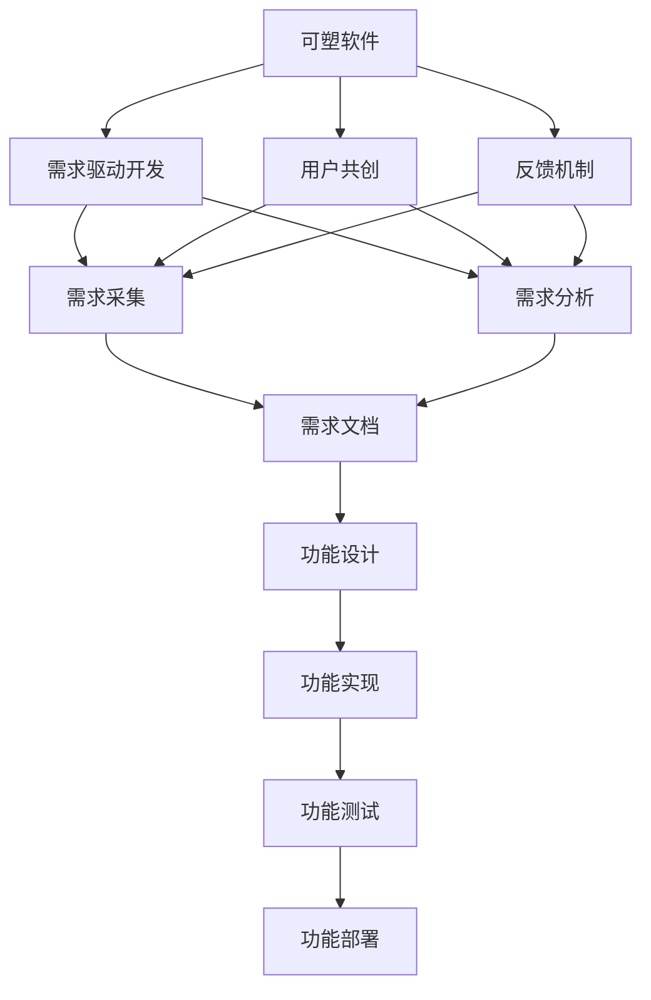
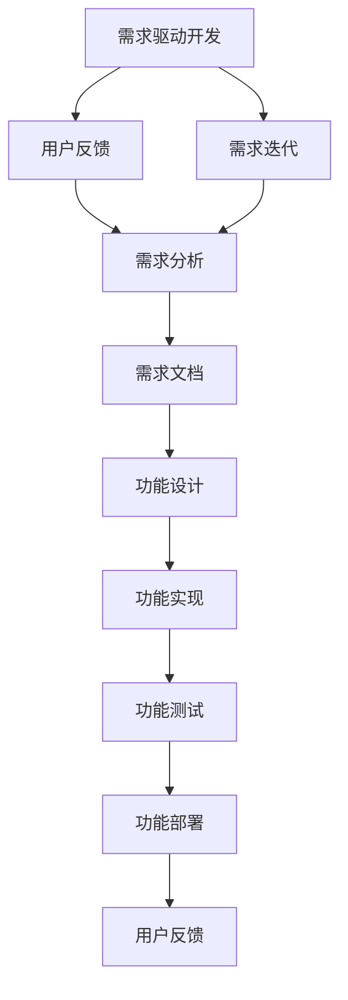
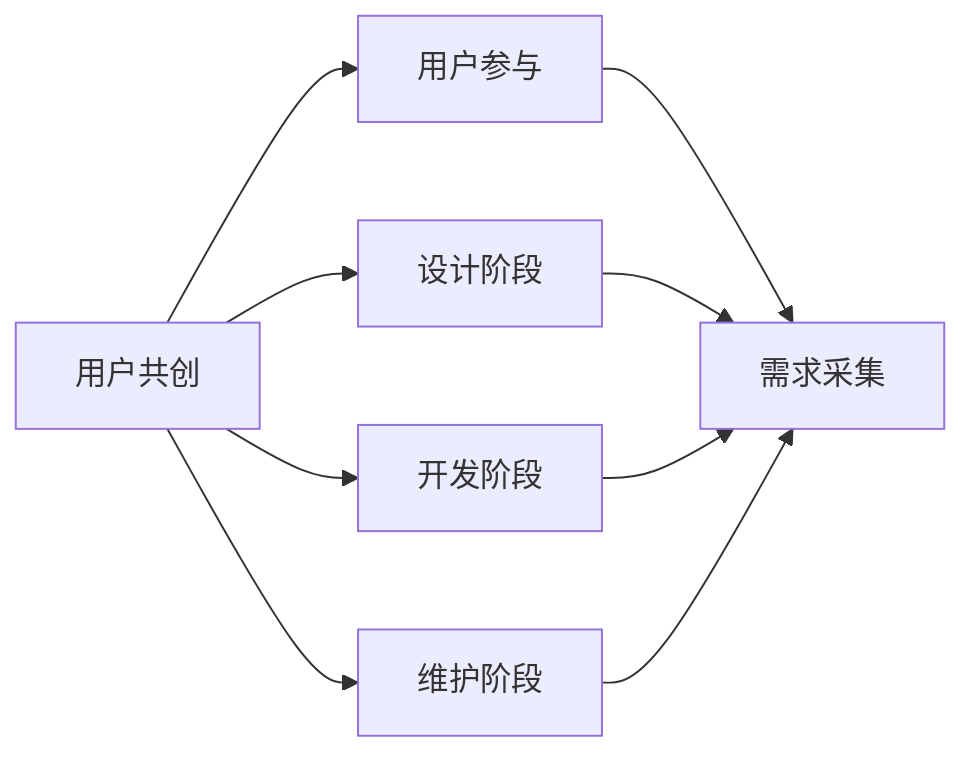
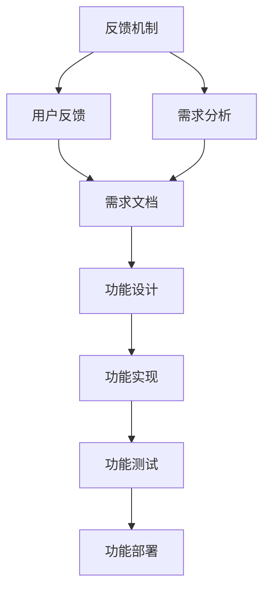
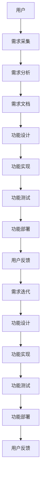

                 

# 用户共创的“可塑软件”

## 1. 背景介绍

### 1.1 问题由来

在软件开发的长期实践中，我们逐渐意识到，技术的进步和业务需求的迭代，使得原有的软件系统很难满足不断变化的需求。而另一方面，用户在实际使用过程中，往往会遇到各种问题，产生新的需求，却又缺乏有效的反馈渠道。这种技术供给与用户需求之间的脱节，导致了软件的“僵化”和“脱节”。

为了解决这个问题，我们提出了“可塑软件”（Plastic Software）的概念。这是一种全新的软件设计理念，旨在通过让用户参与到软件的开发和维护中来，实现软件系统的持续迭代和优化，从而更好地满足用户需求，提升软件的生命力和竞争力。

### 1.2 问题核心关键点

“可塑软件”的核心思想在于，通过用户共创，使软件具备高度的灵活性和适应性，能够在需求变化时快速响应，持续演进，始终保持与用户需求的同步。具体而言，包括以下几个关键点：

- **用户共创**：将用户纳入到软件的设计和开发过程中，确保软件功能能够紧密贴合用户需求。
- **需求驱动**：强调需求驱动的开发模式，以用户反馈为依据，持续优化和迭代软件功能。
- **反馈机制**：建立及时有效的反馈机制，确保用户的声音能够被准确捕捉，转化为软件功能。
- **可扩展性**：设计可扩展的架构，支持未来需求的变化和扩展。
- **自适应性**：通过算法和设计，使软件能够自适应用户行为和环境变化。

### 1.3 问题研究意义

“可塑软件”的理念，对于推动软件技术的发展和应用具有重要意义：

1. **提升用户体验**：通过用户共创，软件的用户体验能够得到持续提升，更好地满足用户需求。
2. **降低开发成本**：通过用户反馈，能够避免无效的功能开发，降低开发成本和时间。
3. **增强市场竞争力**：快速响应用户需求，保持软件系统的前沿性和竞争力。
4. **提高系统可靠性**：通过用户反馈的持续迭代，软件系统的可靠性得到增强，故障率降低。
5. **促进创新**：用户的参与和反馈，激发了更多的创新灵感，推动技术进步。

## 2. 核心概念与联系

### 2.1 核心概念概述

为了更好地理解“可塑软件”，本节将介绍几个关键概念及其之间的关系：

- **可塑软件（Plastic Software）**：指通过用户共创和需求驱动，能够持续迭代、优化和适应变化的软件系统。具有高度灵活性和适应性，能够快速响应用户需求变化。
- **需求驱动开发（DDD）**：强调以用户需求为中心的软件开发模式，通过用户反馈，不断迭代和优化软件功能。
- **用户共创**：将用户纳入到软件设计、开发和维护的每个环节中，确保软件的开发过程能够紧密贴合用户需求。
- **反馈机制**：建立及时有效的反馈机制，确保用户的声音能够被准确捕捉，转化为软件功能。
- **可扩展性**：设计可扩展的架构，支持未来需求的变化和扩展。
- **自适应性**：通过算法和设计，使软件能够自适应用户行为和环境变化。

这些概念之间的关系，可以通过以下Mermaid流程图来展示：



这个流程图展示了“可塑软件”的基本流程：从需求采集到功能设计、实现、测试、部署，用户始终参与其中，确保软件能够持续迭代、优化和适应变化。

### 2.2 概念间的关系

这些核心概念之间存在着紧密的联系，形成了“可塑软件”设计的完整生态系统。下面我们通过几个Mermaid流程图来展示这些概念之间的关系。

#### 2.2.1 需求驱动开发



这个流程图展示了需求驱动开发的基本流程。从用户反馈到需求迭代，需求分析，再到功能设计、实现、测试、部署，每个环节都强调以用户需求为中心，确保软件功能的不断优化和迭代。

#### 2.2.2 用户共创



这个流程图展示了用户共创的基本模式。用户参与从设计、开发到维护的每个阶段，确保软件的开发过程能够紧密贴合用户需求。

#### 2.2.3 反馈机制



这个流程图展示了反馈机制的基本流程。从用户反馈到需求分析，再到功能设计、实现、测试、部署，每个环节都强调及时有效的反馈，确保用户的声音能够被准确捕捉，转化为软件功能。

### 2.3 核心概念的整体架构

最后，我们用一个综合的流程图来展示这些核心概念在“可塑软件”设计中的整体架构：



这个综合流程图展示了从用户到功能设计的全过程。通过用户共创和需求驱动开发，确保软件能够持续迭代、优化和适应变化，始终保持与用户需求的同步。

## 3. 核心算法原理 & 具体操作步骤

### 3.1 算法原理概述

“可塑软件”的实现，需要依靠一系列核心算法和技术。这些算法和技术，主要包括需求分析、用户共创、需求迭代和功能优化等方面。

### 3.2 算法步骤详解

#### 3.2.1 需求分析

需求分析是“可塑软件”设计的关键步骤之一。其主要目标是从用户反馈中提取有价值的需求信息，形成可行的需求文档。具体步骤如下：

1. **需求采集**：通过问卷调查、用户访谈、社交媒体等渠道，收集用户的反馈和意见。
2. **需求分类**：对收集到的需求进行分类和归纳，区分优先级和紧急性。
3. **需求分析**：分析用户需求的背景、目标和影响，确定需求的可行性和优先级。
4. **需求文档**：将分析结果转化为需求文档，形成明确的功能描述和设计要求。

#### 3.2.2 用户共创

用户共创是“可塑软件”设计的核心环节之一。其主要目标是通过用户的参与，实现软件的持续优化和迭代。具体步骤如下：

1. **用户参与**：在需求分析和功能设计阶段，邀请用户参与讨论和决策，确保需求符合用户期望。
2. **设计迭代**：在开发和维护阶段，定期收集用户反馈，调整和优化软件功能。
3. **测试反馈**：在测试阶段，邀请用户参与测试和验收，确保软件功能的稳定性和可靠性。
4. **持续优化**：在维护阶段，持续收集用户反馈，进行功能迭代和优化。

#### 3.2.3 需求迭代

需求迭代是“可塑软件”设计的关键环节之一。其主要目标是通过需求分析和用户共创，实现软件功能的不断优化和迭代。具体步骤如下：

1. **需求采集**：通过问卷调查、用户访谈、社交媒体等渠道，收集用户的反馈和意见。
2. **需求分类**：对收集到的需求进行分类和归纳，区分优先级和紧急性。
3. **需求分析**：分析用户需求的背景、目标和影响，确定需求的可行性和优先级。
4. **需求文档**：将分析结果转化为需求文档，形成明确的功能描述和设计要求。
5. **需求迭代**：在需求分析的基础上，进行功能设计、实现、测试、部署，并持续收集用户反馈，进行迭代和优化。

#### 3.2.4 功能优化

功能优化是“可塑软件”设计的核心环节之一。其主要目标是通过功能的优化，实现软件的持续演进和升级。具体步骤如下：

1. **功能实现**：根据需求文档，进行功能设计、实现和测试。
2. **功能部署**：将实现的功能部署到生产环境，进行用户验收和测试。
3. **用户反馈**：在功能部署后，持续收集用户反馈，进行功能的迭代和优化。
4. **功能更新**：根据用户反馈，进行功能的更新和优化，确保软件功能的稳定性和可靠性。

### 3.3 算法优缺点

“可塑软件”的实现，具有以下优点：

1. **用户驱动**：通过用户共创，软件能够紧密贴合用户需求，提升用户体验。
2. **灵活性高**：能够快速响应需求变化，持续演进和优化。
3. **成本低**：通过用户反馈，避免无效的功能开发，降低开发成本和时间。
4. **可靠性高**：通过持续的反馈和迭代，软件系统的可靠性得到增强，故障率降低。

同时，也存在一些缺点：

1. **复杂度高**：用户共创和需求迭代需要复杂的设计和协调，可能增加项目复杂度。
2. **沟通成本高**：用户参与各个环节，需要更多的沟通和协调，可能增加沟通成本。
3. **需求不一致**：用户需求可能存在不一致性，需要进行权衡和取舍。

### 3.4 算法应用领域

“可塑软件”的理念，广泛应用于软件开发、系统维护、产品设计等多个领域。例如：

- **软件开发**：在软件开发过程中，通过用户共创和需求驱动，实现软件的持续迭代和优化。
- **系统维护**：在系统维护过程中，通过用户反馈，进行功能的迭代和优化，确保系统的稳定性和可靠性。
- **产品设计**：在产品设计过程中，通过用户共创，实现产品的持续演进和升级，提升产品的市场竞争力。
- **企业应用**：在企业应用中，通过用户共创和需求驱动，实现应用的持续优化和迭代，提升企业的数字化转型水平。

## 4. 数学模型和公式 & 详细讲解 & 举例说明

### 4.1 数学模型构建

“可塑软件”的实现，涉及多种数学模型和算法。下面以需求分析为例，介绍相关数学模型的构建。

设用户反馈的需求为 $D$，需求分析的目标是提取有价值的需求信息 $D'$。数学模型可以表示为：

$$
D' = f(D)
$$

其中，$f$ 为需求分析的数学模型。在实际应用中，$f$ 通常由多种算法和技术构成，包括自然语言处理、机器学习、数据挖掘等。

### 4.2 公式推导过程

以自然语言处理为例，需求分析的数学模型可以表示为：

$$
D' = T(D)
$$

其中，$T$ 为自然语言处理算法的数学模型。具体推导过程如下：

1. **分词和预处理**：对用户反馈的需求 $D$ 进行分词和预处理，将其转化为文本数据 $T_D$。
2. **文本表示**：将文本数据 $T_D$ 转化为向量表示 $V_D$，包括词向量、句向量等。
3. **特征提取**：对向量表示 $V_D$ 进行特征提取，得到需求特征 $F_D$。
4. **需求分类**：对需求特征 $F_D$ 进行分类和归纳，得到需求分类结果 $C_D$。
5. **需求文档**：根据需求分类结果 $C_D$，生成需求文档 $D'$。

### 4.3 案例分析与讲解

以某电商平台的用户反馈为例，分析其需求分析的过程。假设用户反馈的需求为：

```
1. 商品搜索功能不够智能，搜索结果不精准。
2. 购物车功能不稳定，有时会出现商品数据不一致的情况。
3. 客服响应速度慢，用户满意度较低。
```

通过自然语言处理算法，将其转化为文本数据：

```
文本数据 $T_D$ = [商品搜索功能, 搜索结果, 不精准, 购物车功能, 商品数据, 不一致, 客服响应, 速度慢, 用户满意度, 低]
```

然后进行文本表示、特征提取和需求分类，得到需求分类结果：

```
需求分类结果 $C_D$ = [搜索功能, 商品功能, 客服功能]
```

最后生成需求文档：

```
需求文档 $D'$ = 
  - 商品搜索功能改进
  - 商品功能优化
  - 客服功能提升
```

通过需求分析，可以明确软件开发的重点和优先级，确保需求符合用户期望，提升用户体验。

## 5. 项目实践：代码实例和详细解释说明

### 5.1 开发环境搭建

在进行“可塑软件”的开发实践前，我们需要准备好开发环境。以下是使用Python进行Flask开发的Python虚拟环境配置流程：

1. 安装Anaconda：从官网下载并安装Anaconda，用于创建独立的Python环境。
2. 创建并激活虚拟环境：
```bash
conda create -n flask-env python=3.8 
conda activate flask-env
```
3. 安装Flask：根据CUDA版本，从官网获取对应的安装命令。例如：
```bash
conda install flask flask-cors 
```
4. 安装Flask-RESTful：
```bash
pip install Flask-RESTful
```
5. 安装Flask-SQLAlchemy：
```bash
pip install Flask-SQLAlchemy
```

完成上述步骤后，即可在`flask-env`环境中开始“可塑软件”的开发实践。

### 5.2 源代码详细实现

这里我们以电商平台的用户反馈管理系统为例，给出使用Flask和SQLAlchemy进行“可塑软件”开发的PyTorch代码实现。

首先，定义需求模型：

```python
from flask_sqlalchemy import SQLAlchemy

db = SQLAlchemy(app)

class Demand(db.Model):
    id = db.Column(db.Integer, primary_key=True)
    content = db.Column(db.Text)
    status = db.Column(db.String(20))
```

然后，定义API接口：

```python
from flask import request, jsonify
from flask_restful import Resource

class DemandAPI(Resource):
    def get(self):
        demands = Demand.query.all()
        return jsonify([demand.serialize() for demand in demands])

    def post(self):
        content = request.json.get('content', None)
        status = request.json.get('status', None)
        if not content:
            return jsonify({'message': 'Content is required!'})
        if not status:
            return jsonify({'message': 'Status is required!'})
        new_demand = Demand(content=content, status=status)
        db.session.add(new_demand)
        db.session.commit()
        return jsonify(new_demand.serialize()), 201

class StatusAPI(Resource):
    def get(self, demand_id):
        demand = Demand.query.get_or_404(demand_id)
        return jsonify(demand.serialize())

    def put(self, demand_id):
        demand = Demand.query.get_or_404(demand_id)
        content = request.json.get('content', None)
        status = request.json.get('status', None)
        if not content:
            return jsonify({'message': 'Content is required!'})
        if not status:
            return jsonify({'message': 'Status is required!'})
        demand.content = content
        demand.status = status
        db.session.commit()
        return jsonify(demand.serialize()), 200
```

最后，启动Flask应用：

```python
if __name__ == '__main__':
    app.run(debug=True)
```

以上就是使用Flask和SQLAlchemy对“可塑软件”进行开发的完整代码实现。可以看到，通过Flask的轻量级框架和SQLAlchemy的ORM功能，开发者能够快速搭建一个用户反馈管理系统，记录和管理用户需求，实现“可塑软件”的初步落地。

### 5.3 代码解读与分析

让我们再详细解读一下关键代码的实现细节：

**Demand类**：
- `__init__`方法：初始化需求对象，包括内容(content)和状态(status)。
- `id`字段：自增长的主键，用于唯一标识需求。
- `content`字段：需求的内容，以文本形式存储。
- `status`字段：需求的当前状态，如已处理、未处理等。

**DemandAPI类**：
- `get`方法：获取所有需求信息，并返回JSON格式的数据。
- `post`方法：创建新需求，并保存至数据库。
- `get`方法：获取单个需求信息。
- `put`方法：更新单个需求信息。

**Flask应用**：
- 使用Flask的路由装饰器定义API接口，处理GET和POST请求。
- 使用Flask的JSON支持，将需求对象转换为JSON格式，返回给客户端。
- 使用Flask的SQLAlchemy扩展，方便地进行数据库操作，确保数据的安全性和可靠性。

以上代码实现展示了“可塑软件”开发的简单流程。通过Flask和SQLAlchemy，开发者能够快速搭建一个用户反馈管理系统，记录和管理用户需求，实现“可塑软件”的初步落地。

当然，工业级的系统实现还需考虑更多因素，如用户权限控制、数据备份、异常处理等。但核心的需求分析和用户共创逻辑，基本与此类似。

### 5.4 运行结果展示

假设我们在电商平台的用户反馈管理系统中记录了以下需求：

```
需求ID | 内容 | 状态
1      | 商品搜索功能不够智能，搜索结果不精准 | 已处理
2      | 购物车功能不稳定，有时会出现商品数据不一致的情况 | 未处理
3      | 客服响应速度慢，用户满意度较低 | 已处理
```

通过API接口，我们可以获取和更新这些需求信息，确保软件系统能够持续迭代和优化。

## 6. 实际应用场景

### 6.1 电商平台

“可塑软件”在电商平台中的应用，可以显著提升用户体验和业务运营效率。通过用户共创和需求驱动，电商平台能够及时响应用户反馈，持续优化商品搜索、购物车、客服等功能，提升用户体验和满意度。

例如，通过分析用户反馈的需求，电商平台可以在商品搜索算法中加入更智能的自然语言处理技术，提升搜索结果的精准度和相关性。还可以优化购物车功能的稳定性，减少商品数据不一致的情况，提高用户购物体验。此外，通过优化客服响应速度和质量，电商平台可以提升用户满意度，增加用户粘性和留存率。

### 6.2 医疗系统

在医疗系统中，“可塑软件”能够帮助医生和护士更好地理解和管理患者需求。通过用户共创和需求驱动，医疗系统能够及时响应用户反馈，持续优化诊疗、用药、护理等功能，提升医疗服务的质量和效率。

例如，通过分析患者的反馈和需求，医生可以更好地理解患者的病情和需求，提供更加个性化的诊疗方案。护士可以通过优化用药和护理流程，提高工作效率和护理质量。此外，医疗系统还可以通过用户反馈，持续优化电子病历和健康管理功能，提升患者体验和满意度。

### 6.3 智能家居

在智能家居系统中，“可塑软件”能够帮助用户更好地控制和管理家居设备。通过用户共创和需求驱动，智能家居系统能够及时响应用户反馈，持续优化设备控制、智能推荐、数据分析等功能，提升家居生活的舒适度和便利性。

例如，通过分析用户的反馈和需求，智能家居系统可以优化设备控制算法，提升设备运行的稳定性和智能化程度。还可以根据用户的使用习惯和偏好，进行智能推荐和数据分析，提升用户的体验和满意度。此外，智能家居系统还可以通过用户反馈，持续优化语音识别和自然语言处理功能，提升人机交互的自然度和流畅度。

## 7. 工具和资源推荐

### 7.1 学习资源推荐

为了帮助开发者系统掌握“可塑软件”的理论基础和实践技巧，这里推荐一些优质的学习资源：

1. 《软件工程：原理与实践》：经典软件工程教材，涵盖软件开发和管理的全面知识，适合初学者入门。
2. 《软件需求工程》：深入讲解软件需求分析和用户共创的方法，帮助开发者更好地理解需求驱动开发。
3. 《用户共创：打造用户驱动的软件》：详细探讨用户共创的实现方法和最佳实践，适合开发者实践参考。
4. 《软件开发生命周期管理》：介绍软件开发生命周期的各个阶段和相关工具，帮助开发者更好地管理软件开发项目。
5. 《用户体验设计：从用户需求到产品设计》：讲解用户体验设计的全过程和方法，帮助开发者更好地满足用户需求。

通过对这些资源的学习实践，相信你一定能够快速掌握“可塑软件”的理论基础和实践技巧，并用于解决实际的业务问题。

### 7.2 开发工具推荐

高效的开发离不开优秀的工具支持。以下是几款用于“可塑软件”开发的常用工具：

1. Flask：基于Python的轻量级Web框架，适合快速搭建API接口。
2. SQLAlchemy：Python的ORM框架，方便地进行数据库操作。
3. Git：版本控制系统，方便地管理和协作开发。
4. Docker：容器化技术，方便地进行环境部署和管理。
5. Jenkins：持续集成和持续部署工具，自动化测试和部署，提高开发效率。
6. Slack：团队协作工具，方便地进行实时沟通和协作。

合理利用这些工具，可以显著提升“可塑软件”的开发效率，加快创新迭代的步伐。

### 7.3 相关论文推荐

“可塑软件”的理念，涉及软件开发、用户共创、需求分析等多个领域。以下是几篇奠基性的相关论文，推荐阅读：

1. "The Evolution of Software Engineering"：探讨软件工程的发展历程和方法，帮助开发者更好地理解“可塑软件”的理论基础。
2. "The Role of Users in Software Development"：深入探讨用户共创在软件开发中的应用和价值，帮助开发者更好地理解和应用“可塑软件”。
3. "Requirements Engineering: Concepts, Techniques and Practices"：详细介绍需求工程的理论和方法，帮助开发者更好地进行需求分析和用户共创。
4. "Agile Software Development"：讲解敏捷开发的方法和实践，帮助开发者更好地进行软件开发和项目管理。
5. "User-Centric Software Design"：探讨用户中心的软件设计方法，帮助开发者更好地进行用户体验设计和需求驱动开发。

这些论文代表了大语言模型微调技术的发展脉络。通过学习这些前沿成果，可以帮助研究者把握学科前进方向，激发更多的创新灵感。

除上述资源外，还有一些值得关注的前沿资源，帮助开发者紧跟“可塑软件”发展的最新进展，例如：

1. arXiv论文预印本：人工智能领域最新研究成果的发布平台，包括大量尚未发表的前沿工作，学习前沿技术的必读资源。
2. 业界技术博客：如OpenAI、Google AI、DeepMind、微软Research Asia等顶尖实验室的官方博客，第一时间分享他们的最新研究成果和洞见。
3. 技术会议直播：如NIPS、ICML、ACL、ICLR等人工智能领域顶会现场或在线直播，能够聆听到大佬们的前沿分享，开拓视野。
4. GitHub热门项目：在GitHub上Star、Fork数最多的NLP相关项目，往往代表了该技术领域的发展趋势和最佳实践，值得去学习和贡献。
5. 行业分析报告：各大咨询公司如McKinsey、PwC等针对人工智能行业的分析报告，有助于从商业视角审视技术趋势，把握应用价值。

总之，对于“可塑软件”的学习和实践，需要开发者保持开放的心态和持续学习的意愿。多关注前沿资讯，多动手实践，多思考总结，必将收获满满的成长收益。

## 8. 总结：未来发展趋势与挑战

### 8.1 总结

本文对“可塑软件”的概念和实现方法进行了全面系统的介绍。首先阐述了“可塑软件”的设计理念和研究背景，明确了其核心思想和研究意义。其次，从原理到实践，详细讲解了“可塑软件”的设计流程和技术细节，给出了“可塑软件”开发的完整代码实现。同时，本文还广泛探讨了“可塑软件”在电商平台、医疗系统、智能家居等多个领域的应用前景，展示了其广阔的应用前景和应用价值。

通过本文的系统梳理，可以看到，“可塑软件”的理念正在推动软件技术的快速发展，为软件系统的持续演进和优化提供了新的思路和方法。相信随着“可塑软件”理念的普及和应用，软件系统的开发和管理将更加灵活高效，真正实现与用户需求的同步，提升用户体验和业务运营效率。

### 8.2 未来发展趋势

展望未来，“可塑软件”的发展趋势主要体现在以下几个方面：

1. **用户共创的普及**：随着用户共创理念的普及，更多企业将采用用户共创方法，提升软件系统的灵活性和适应性。
2. **需求驱动的实践**：需求驱动开发模式将成为软件开发的主流，通过用户反馈，持续优化和迭代软件功能。
3. **技术融合的加速**：“可塑软件”将与其他人工智能技术进行更深入的融合，如

