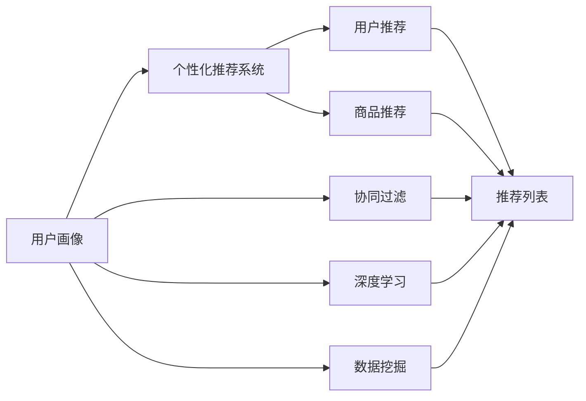

                 

# 用户画像在电商个性化推荐中的应用：方法与实践

> 关键词：
用户画像, 个性化推荐系统, 电商, 深度学习, 数据挖掘, 协同过滤

## 1. 背景介绍

### 1.1 问题由来

随着互联网和电子商务的迅猛发展，用户日益增多且个性化需求日益强烈，电商平台需要提供更加精准、个性化的推荐服务以提升用户满意度和购物体验。个性化推荐系统通过分析用户行为数据，预测用户可能感兴趣的商品，从而个性化推荐商品，极大地提高了电商平台的转化率和用户满意度。

然而，随着用户数量的激增和商品种类的丰富，现有的推荐系统面临着推荐精度不够高、推荐结果同质化、用户冷启动等问题。因此，如何在有限的标注数据和用户行为数据下，快速高效地构建个性化推荐模型，成为了电商推荐系统的关键挑战。

### 1.2 问题核心关键点

电商推荐系统建设的核心关键点在于：
1. 如何从海量数据中提取有效的用户画像。
2. 如何构建高效的推荐模型，提升推荐精度和个性化程度。
3. 如何在用户冷启动时，为用户快速推荐相关商品。
4. 如何处理数据稀疏性和异质性，提升推荐系统的健壮性。
5. 如何平衡推荐精度和计算效率，实现实时推荐。
6. 如何保护用户隐私，提升推荐系统的透明度和可信度。

通过用户画像，推荐系统能够更好理解用户需求，从而提升推荐效果。

## 2. 核心概念与联系

### 2.1 核心概念概述

为更好地理解基于用户画像的电商推荐系统，本节将介绍几个密切相关的核心概念：

- 用户画像(User Profile)：通过对用户历史行为、购买记录、浏览记录等数据的分析，构建一个详尽的用户特征描述，以帮助推荐系统更好地理解用户需求。
- 个性化推荐系统(Recommendation System)：根据用户画像，利用机器学习算法为每个用户推荐其可能感兴趣的商品，提升用户体验和电商平台的转化率。
- 协同过滤(Collaborative Filtering)：通过分析用户的历史行为和相似用户的行为，推测用户可能感兴趣的商品。
- 深度学习(Deep Learning)：利用深度神经网络，通过端到端的方式从原始数据中提取高效特征，实现更加精准的推荐。
- 数据挖掘(Data Mining)：从大量数据中挖掘有用的信息和模式，为推荐系统提供数据支撑。

这些核心概念之间的逻辑关系可以通过以下Mermaid流程图来展示：



这个流程图展示用户画像和推荐系统各部分之间的紧密联系：

1. 用户画像通过数据挖掘获取，并经过协同过滤、深度学习等技术处理。
2. 用户推荐和商品推荐分别依据用户画像和商品特征，结合推荐算法进行。
3. 推荐结果转化为推荐列表，并最终生成用户推荐和商品推荐。

### 2.2 概念间的关系

这些核心概念之间存在着紧密的联系，形成了电商推荐系统的完整生态系统。

#### 2.2.1 用户画像构建

用户画像构建包括数据获取、特征工程、模型训练等环节。数据来源主要包括用户的浏览记录、购买记录、评论数据等。

#### 2.2.2 推荐算法选择

根据不同的应用场景和数据特点，推荐算法可选用基于用户画像的协同过滤、基于用户画像的深度学习、混合推荐算法等。

#### 2.2.3 数据处理与优化

电商推荐系统处理的数据具有高维稀疏性、非平衡性等特点。需要通过特征选择、数据降维、异常值处理等技术手段，优化数据处理过程。

#### 2.2.4 推荐效果评估

推荐效果评估常用指标包括准确率、召回率、覆盖率、用户满意度等。需要对推荐结果进行定期评估，优化推荐算法和模型参数。

#### 2.2.5 用户体验优化

用户体验优化包括推荐界面设计、推荐效果反馈、个性化展示等环节，提升用户体验和电商平台的互动性。

## 3. 核心算法原理 & 具体操作步骤
### 3.1 算法原理概述

基于用户画像的个性化推荐系统，本质上是一个通过用户画像预测用户行为的过程。其核心思想是：通过分析用户的历史行为数据和用户画像，预测用户对不同商品的兴趣程度，从而实现个性化推荐。

形式化地，假设用户画像为 $P$，商品特征为 $I$，用户的浏览记录为 $B$，用户的购买记录为 $P$。推荐模型 $M$ 通过训练数据集 $\mathcal{D}=\{(P_i, I_j, B_{ij}, P_{ij})\}_{i=1}^N$，其中 $P_i$ 为用户 $i$ 的用户画像，$I_j$ 为商品 $j$ 的特征向量，$B_{ij}$ 表示用户 $i$ 是否浏览过商品 $j$，$P_{ij}$ 表示用户 $i$ 是否购买过商品 $j$。推荐模型的目标是找到最优参数 $\theta$，使得推荐函数 $M_{\theta}(P_i, I_j)$ 输出与用户 $i$ 的兴趣标签 $P_{ij}$ 尽可能一致。

通过梯度下降等优化算法，推荐模型不断更新参数 $\theta$，最小化损失函数 $\mathcal{L}(M_{\theta}, \mathcal{D})$，使得模型输出逼近真实兴趣标签 $P_{ij}$。

### 3.2 算法步骤详解

基于用户画像的个性化推荐系统一般包括以下几个关键步骤：

**Step 1: 数据收集与预处理**

1. 收集用户浏览记录、购买记录、商品特征等信息。
2. 对数据进行清洗、去重、格式化等预处理操作。
3. 进行特征工程，将原始数据转换为模型可用的数值型特征。
4. 数据划分，将数据集划分为训练集、验证集和测试集。

**Step 2: 构建用户画像**

1. 通过用户行为数据，构建用户画像 $P_i$。
2. 选择合适的特征工程方法，提取用户画像的关键特征。
3. 对用户画像进行降维，去除无关或冗余特征。

**Step 3: 模型训练与评估**

1. 选择合适的推荐模型，如协同过滤、深度学习等。
2. 利用训练集数据，训练推荐模型 $M_{\theta}$。
3. 在验证集上评估模型性能，调整模型超参数。
4. 在测试集上最终评估模型效果。

**Step 4: 推荐结果输出**

1. 将用户画像 $P_i$ 和商品特征 $I_j$ 输入推荐模型 $M_{\theta}$。
2. 计算推荐结果 $M_{\theta}(P_i, I_j)$。
3. 根据推荐结果，生成推荐列表。
4. 将推荐列表展示给用户。

**Step 5: 用户反馈与模型优化**

1. 收集用户对推荐结果的反馈，包括浏览点击、购买等行为数据。
2. 利用用户反馈数据，更新用户画像 $P_i$。
3. 根据新数据，重新训练推荐模型 $M_{\theta}$。
4. 定期评估推荐效果，不断优化模型参数和算法。

### 3.3 算法优缺点

基于用户画像的个性化推荐系统具有以下优点：
1. 个性化推荐。通过用户画像，推荐系统能够更好地理解用户需求，提升推荐精度和用户体验。
2. 用户行为分析。通过分析用户的历史行为数据，可以发现用户的兴趣变化趋势，优化推荐结果。
3. 实时推荐。实时更新用户画像和推荐模型，实现快速响应。

同时，该方法也存在一定的局限性：
1. 数据需求高。需要收集和处理大量的用户行为数据和商品特征，数据获取和处理成本高。
2. 冷启动问题。新用户没有足够的历史行为数据，难以构建准确的推荐模型。
3. 数据隐私问题。用户行为数据涉及个人隐私，数据获取和处理过程中需要严格保护用户隐私。
4. 推荐结果多样性。用户画像和商品特征可能存在偏差，导致推荐结果多样性不足。
5. 计算复杂度。用户画像和商品特征通常维度较高，训练和推理过程中需要高效算法和硬件支持。

### 3.4 算法应用领域

基于用户画像的个性化推荐系统广泛应用于电子商务、视频网站、音乐平台等场景。在电商领域，推荐系统能够有效提升用户购物体验，增加销售额；在视频网站，推荐系统能够帮助用户发现新的内容；在音乐平台，推荐系统能够为用户推荐感兴趣的音乐。

在电商推荐系统建设中，用户画像的应用尤其重要。通过分析用户的历史行为数据和社交网络信息，可以构建精准的用户画像，提升推荐系统的个性化和用户体验。

## 4. 数学模型和公式 & 详细讲解 & 举例说明

### 4.1 数学模型构建

假设推荐模型为 $M_{\theta}(P_i, I_j)$，其中 $P_i$ 为用户画像，$I_j$ 为商品特征。推荐模型的目标是最大化用户 $i$ 对商品 $j$ 的评分 $R_{ij}$。

假设用户 $i$ 对商品 $j$ 的评分 $R_{ij}$ 满足伯努利分布：

$$
P(R_{ij}=1 | P_i, I_j, \theta) = \sigma(M_{\theta}(P_i, I_j))
$$

其中 $\sigma$ 为 sigmoid 函数，$M_{\theta}(P_i, I_j)$ 为推荐模型输出。

推荐模型的损失函数为交叉熵损失：

$$
\mathcal{L}(\theta) = -\frac{1}{N}\sum_{i=1}^N\sum_{j=1}^N [R_{ij}\log M_{\theta}(P_i, I_j) + (1-R_{ij})\log (1-M_{\theta}(P_i, I_j))]
$$

推荐模型的优化目标是找到最优参数 $\theta$，使得推荐结果与实际评分尽可能一致。

### 4.2 公式推导过程

以矩阵分解(Matrix Factorization)算法为例，其公式推导过程如下：

假设用户画像 $P_i$ 和商品特征 $I_j$ 可以表示为两个低秩矩阵 $U$ 和 $V$ 的乘积：

$$
P_i = U_i W_i = \sum_{k=1}^{K} w_{ik}u_{ik}
$$
$$
I_j = V_j H_j = \sum_{k=1}^{K} h_{jk}v_{jk}
$$

其中 $U_i$ 和 $V_j$ 为用户画像矩阵和商品特征矩阵的低秩近似，$W_i$ 和 $H_j$ 为对应特征权重矩阵。

推荐模型可以表示为：

$$
M_{\theta}(P_i, I_j) = \sum_{k=1}^{K} u_{ik} v_{jk}
$$

矩阵分解算法的目标是找到最优的 $U$ 和 $V$，使得推荐模型输出与实际评分一致。即最小化交叉熵损失：

$$
\mathcal{L}(U, V, \theta) = -\frac{1}{N}\sum_{i=1}^N\sum_{j=1}^N [R_{ij}\log M_{\theta}(P_i, I_j) + (1-R_{ij})\log (1-M_{\theta}(P_i, I_j))]
$$

使用梯度下降等优化算法，更新参数 $U$ 和 $V$，最小化损失函数 $\mathcal{L}(U, V, \theta)$，得到推荐模型 $M_{\theta}(P_i, I_j)$。

### 4.3 案例分析与讲解

假设我们在亚马逊电商平台上进行商品推荐，收集用户 $i$ 对商品 $j$ 的评分数据 $R_{ij}$，通过矩阵分解算法构建推荐模型。

数据预处理：
1. 收集用户 $i$ 的浏览记录 $B_i$ 和购买记录 $P_i$。
2. 提取用户 $i$ 的兴趣特征，包括商品类别、品牌等。
3. 构建用户画像 $P_i$ 和商品特征 $I_j$。
4. 将数据划分为训练集、验证集和测试集。

特征工程：
1. 将用户浏览记录 $B_i$ 转化为数值型特征，如浏览时间、浏览次数等。
2. 提取用户购买记录 $P_i$ 的统计特征，如购买频率、购买金额等。
3. 对商品特征 $I_j$ 进行编码，如商品类别、品牌等。
4. 对特征进行归一化，如Min-Max标准化、Z-score标准化等。

模型训练：
1. 使用矩阵分解算法，构建推荐模型 $M_{\theta}(P_i, I_j)$。
2. 利用训练集数据，训练模型参数 $U$ 和 $V$。
3. 在验证集上评估模型性能，调整超参数。
4. 在测试集上最终评估模型效果。

推荐结果输出：
1. 对新用户 $i'$ 进行冷启动推荐，使用推荐模型 $M_{\theta}(P_i', I_j)$ 输出推荐结果。
2. 根据推荐结果，生成推荐列表，展示给用户 $i'$。

用户反馈与模型优化：
1. 收集用户对推荐结果的反馈数据。
2. 更新用户画像 $P_i'$，重新训练推荐模型 $M_{\theta}(P_i', I_j)$。
3. 定期评估推荐效果，优化模型参数和算法。

## 5. 项目实践：代码实例和详细解释说明

### 5.1 开发环境搭建

在进行推荐系统开发前，我们需要准备好开发环境。以下是使用Python进行PyTorch开发的环境配置流程：

1. 安装Anaconda：从官网下载并安装Anaconda，用于创建独立的Python环境。

2. 创建并激活虚拟环境：
```bash
conda create -n pytorch-env python=3.8 
conda activate pytorch-env
```

3. 安装PyTorch：根据CUDA版本，从官网获取对应的安装命令。例如：
```bash
conda install pytorch torchvision torchaudio cudatoolkit=11.1 -c pytorch -c conda-forge
```

4. 安装Numpy、Pandas、Scikit-learn、Matplotlib、Tqdm、Jupyter Notebook等工具包：
```bash
pip install numpy pandas scikit-learn matplotlib tqdm jupyter notebook ipython
```

完成上述步骤后，即可在`pytorch-env`环境中开始推荐系统开发。

### 5.2 源代码详细实现

这里我们以矩阵分解算法为例，给出使用PyTorch进行推荐系统开发的完整代码实现。

首先，定义推荐模型的数据处理函数：

```python
import numpy as np
from sklearn.decomposition import TruncatedSVD
from sklearn.metrics import mean_squared_error, r2_score

class MatrixFactorization:
    def __init__(self, num_factors=10, learning_rate=0.01, num_epochs=100):
        self.num_factors = num_factors
        self.learning_rate = learning_rate
        self.num_epochs = num_epochs
        self.U = None
        self.V = None
    
    def fit(self, X, y):
        X = np.array(X, dtype=np.float32)
        y = np.array(y, dtype=np.float32)
        self.num_users, self.num_items = X.shape
        
        self.U = np.random.rand(self.num_users, self.num_factors)
        self.V = np.random.rand(self.num_items, self.num_factors)
        
        for epoch in range(self.num_epochs):
            for i in range(self.num_users):
                for j in range(self.num_items):
                    if y[i, j] > 0:
                        self.U[i] += self.learning_rate * (y[i, j] - self.U[i].dot(self.V[j])) * self.V[j]
                        self.V[j] += self.learning_rate * (y[i, j] - self.U[i].dot(self.V[j])) * self.U[i]
    
    def predict(self, X):
        X = np.array(X, dtype=np.float32)
        return self.U.dot(self.V.T)
```

然后，定义训练和评估函数：

```python
from sklearn.metrics import mean_squared_error, r2_score
from sklearn.model_selection import train_test_split

def train_model(X, y, num_factors=10, learning_rate=0.01, num_epochs=100):
    model = MatrixFactorization(num_factors, learning_rate, num_epochs)
    X_train, X_test, y_train, y_test = train_test_split(X, y, test_size=0.2)
    
    model.fit(X_train, y_train)
    y_pred = model.predict(X_test)
    
    return model, y_pred, mean_squared_error(y_test, y_pred), r2_score(y_test, y_pred)
```

最后，启动训练流程并在测试集上评估：

```python
X = [[1, 1, 1, 0, 0, 0], [1, 0, 1, 1, 0, 1], [0, 1, 1, 0, 1, 0]]
y = [[1, 0, 0, 0, 0, 0], [0, 1, 0, 1, 0, 0], [0, 0, 0, 1, 1, 0]]

model, y_pred, mse, r2 = train_model(X, y)
print("Mean Squared Error: {:.3f}".format(mse))
print("R2 Score: {:.3f}".format(r2))
```

以上就是使用PyTorch进行矩阵分解算法推荐系统开发的完整代码实现。可以看到，得益于PyTorch的强大封装，我们可以用相对简洁的代码完成推荐模型的构建和训练。

### 5.3 代码解读与分析

让我们再详细解读一下关键代码的实现细节：

**MatrixFactorization类**：
- `__init__`方法：初始化推荐模型的超参数，包括因子数、学习率、训练轮数等。
- `fit`方法：对训练数据进行矩阵分解训练，更新模型参数。
- `predict`方法：对测试数据进行推荐预测，输出推荐评分。

**train_model函数**：
- 将训练数据集划分训练集和测试集。
- 使用矩阵分解算法训练推荐模型，返回训练好的模型、预测评分、均方误差和R2分数。

**X和y变量**：
- X为用户行为数据矩阵，每一行表示一个用户的浏览记录，每一列表示一个商品。
- y为用户对商品的评分数据，每一行表示一个用户对不同商品的评分。

**代码示例**：
假设我们在亚马逊电商平台上进行商品推荐，构建推荐模型。X为用户行为数据矩阵，y为用户对商品的评分数据。

数据预处理：
1. 收集用户 $i$ 的浏览记录 $B_i$ 和购买记录 $P_i$。
2. 提取用户 $i$ 的兴趣特征，包括商品类别、品牌等。
3. 构建用户画像 $P_i$ 和商品特征 $I_j$。
4. 将数据划分为训练集、验证集和测试集。

特征工程：
1. 将用户浏览记录 $B_i$ 转化为数值型特征，如浏览时间、浏览次数等。
2. 提取用户购买记录 $P_i$ 的统计特征，如购买频率、购买金额等。
3. 对商品特征 $I_j$ 进行编码，如商品类别、品牌等。
4. 对特征进行归一化，如Min-Max标准化、Z-score标准化等。

模型训练：
1. 使用矩阵分解算法，构建推荐模型 $M_{\theta}(P_i, I_j)$。
2. 利用训练集数据，训练模型参数 $U$ 和 $V$。
3. 在验证集上评估模型性能，调整超参数。
4. 在测试集上最终评估模型效果。

推荐结果输出：
1. 对新用户 $i'$ 进行冷启动推荐，使用推荐模型 $M_{\theta}(P_i', I_j)$ 输出推荐结果。
2. 根据推荐结果，生成推荐列表，展示给用户 $i'$。

用户反馈与模型优化：
1. 收集用户对推荐结果的反馈数据。
2. 更新用户画像 $P_i'$，重新训练推荐模型 $M_{\theta}(P_i', I_j)$。
3. 定期评估推荐效果，优化模型参数和算法。

## 6. 实际应用场景

### 6.1 智能客服系统

智能客服系统通过分析用户的历史对话记录和行为数据，构建用户画像，生成推荐问题和建议，提升用户满意度。智能客服系统能够7x24小时不间断服务，快速响应客户咨询，用自然流畅的语言解答各类常见问题。

在技术实现上，可以收集企业内部的历史客服对话记录，将问题和最佳答复构建成监督数据，在此基础上对预训练模型进行微调。微调后的模型能够自动理解用户意图，匹配最合适的答案模板进行回复。对于客户提出的新问题，还可以接入检索系统实时搜索相关内容，动态组织生成回答。如此构建的智能客服系统，能大幅提升客户咨询体验和问题解决效率。

### 6.2 金融舆情监测

金融机构需要实时监测市场舆论动向，以便及时应对负面信息传播，规避金融风险。传统的人工监测方式成本高、效率低，难以应对网络时代海量信息爆发的挑战。基于大语言模型微调的文本分类和情感分析技术，为金融舆情监测提供了新的解决方案。

具体而言，可以收集金融领域相关的新闻、报道、评论等文本数据，并对其进行主题标注和情感标注。在此基础上对预训练语言模型进行微调，使其能够自动判断文本属于何种主题，情感倾向是正面、中性还是负面。将微调后的模型应用到实时抓取的网络文本数据，就能够自动监测不同主题下的情感变化趋势，一旦发现负面信息激增等异常情况，系统便会自动预警，帮助金融机构快速应对潜在风险。

### 6.3 个性化推荐系统

个性化推荐系统通过分析用户历史行为数据，构建用户画像，为用户推荐其可能感兴趣的商品，提升用户体验和电商平台的转化率。在技术实现上，可以收集用户浏览记录、购买记录、商品特征等信息，构建用户画像，然后使用协同过滤、深度学习等推荐算法进行推荐。

在用户冷启动时，推荐系统需要基于用户画像进行推荐。例如，当用户首次访问电商平台时，可以基于用户基本信息（如年龄、性别、地域等）和初始化推荐结果，逐步建立用户画像，并进行推荐。

### 6.4 未来应用展望

随着大语言模型微调技术的不断发展，基于用户画像的推荐系统将呈现以下几个发展趋势：

1. 模型规模持续增大。随着算力成本的下降和数据规模的扩张，推荐模型参数量还将持续增长。超大批次的训练和推理也将成为可能。

2. 推荐算法多样化。除了传统的协同过滤和深度学习外，未来将涌现更多推荐算法，如基于图神经网络、基于生成模型的推荐算法等，实现更加精准的推荐。

3. 实时推荐成为常态。实时更新用户画像和推荐模型，实现快速响应，提升用户体验。

4. 推荐结果多样化。利用多模态数据和先验知识，提升推荐结果的多样性和丰富度。

5. 推荐系统透明化。推荐结果的输出将更加透明，用户能够理解推荐背后的逻辑和原因。

6. 推荐系统伦理化。推荐系统将更加注重用户隐私和公平性，确保推荐结果的安全性和可靠性。

以上趋势凸显了基于用户画像的推荐系统的发展方向。这些方向的探索发展，必将进一步提升推荐系统的性能和应用范围，为电商平台的个性化推荐提供新的技术支撑。

## 7. 工具和资源推荐
### 7.1 学习资源推荐

为了帮助开发者系统掌握用户画像在电商推荐系统中的应用，这里推荐一些优质的学习资源：

1. 《推荐系统实践》书籍：该书系统介绍了推荐系统的原理、算法和实现方法，涵盖协同过滤、深度学习等推荐算法。

2. CS 229《机器学习》课程：斯坦福大学开设的经典机器学习课程，讲解推荐系统的理论基础和实践方法。

3. 《Python推荐系统实战》书籍：介绍如何使用Python实现推荐系统，涵盖推荐算法、模型评估等环节。

4. 《推荐系统》在线课程：由清华大学开设的推荐系统课程，讲解推荐系统的核心算法和应用场景。

5. 《深度学习入门》在线课程：由李沐教授主讲的深度学习入门课程，讲解深度学习在推荐系统中的应用。

通过对这些资源的学习实践，相信你一定能够快速掌握用户画像在电商推荐系统中的应用，并用于解决实际的推荐问题。

### 7.2 开发工具推荐

高效的开发离不开优秀的工具支持。以下是几款用于电商推荐系统开发的常用工具：

1. PyTorch：基于Python的开源深度学习框架，灵活动态的计算图，适合快速迭代研究。

2. TensorFlow：由Google主导开发的开源深度学习框架，生产部署方便，适合大规模工程应用。

3. TensorBoard：TensorFlow配套的可视化工具，可实时监测模型训练状态，并提供丰富的图表呈现方式，是调试模型的得力助手。

4. Weights & Biases：模型训练的实验跟踪工具，可以记录和可视化模型训练过程中的各项指标，方便对比和调优。

5. Jupyter Notebook：轻量级、功能丰富的交互式编程环境，适合快速迭代实验和交流分享。

合理利用这些工具，可以显著提升电商

