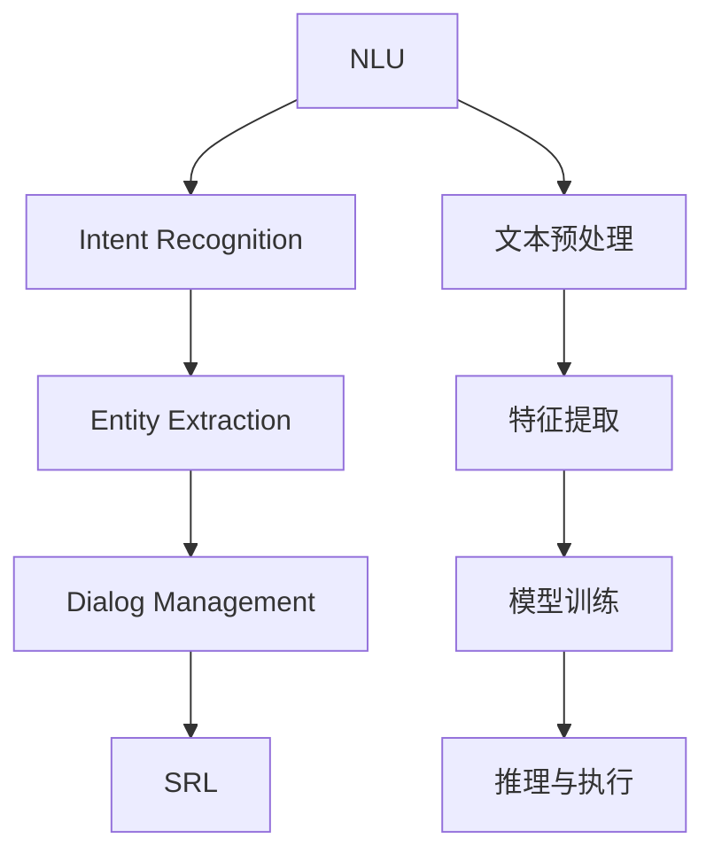

                 

# 用户需求表达在CUI中的详细实现方式

## 1. 背景介绍

随着人工智能技术的快速发展，自然语言理解（Natural Language Understanding, NLU）和计算机用户界面（Computer User Interface, CUI）的结合成为智能交互系统的核心。用户可以通过自然语言与计算机进行交互，表达自己的需求，而计算机则能够理解这些需求并执行相应的操作。这种基于自然语言的用户需求表达方式，被广泛应用于智能客服、虚拟助手、语音助手等领域，极大地提升了用户体验和系统效率。

### 1.1 用户需求表达的重要性

用户需求表达是智能交互系统的基础。它允许用户以自然语言的方式与计算机进行交流，而无需掌握复杂的指令格式。这种表达方式不仅用户友好，而且能够涵盖更广泛的用户意图和复杂情境，使得系统能够更好地理解和满足用户需求。在智能客服系统中，用户可以通过自然语言描述问题，无需填写繁琐的表单或使用特定的代码，大大简化了用户的操作流程。在虚拟助手中，用户可以随时通过语音或文字与助手对话，获取所需信息或执行命令。

### 1.2 用户需求表达的挑战

尽管自然语言理解技术已经取得了显著进展，但用户需求表达仍然面临许多挑战。这些挑战包括：

- **多义词义消歧**：自然语言中存在大量同义词，系统需要能够根据上下文准确理解用户意图。
- **语义理解**：用户可能会使用不标准的语法或隐喻表达，系统需要具备较高的语义理解能力。
- **上下文理解**：用户需求可能涉及多个实体和动作，系统需要能够准确把握上下文关系。
- **动态变化**：用户需求可能随时间或情境变化，系统需要具备持续学习和适应的能力。

## 2. 核心概念与联系

### 2.1 核心概念概述

为了更好地理解用户需求表达在CUI中的详细实现方式，本节将介绍几个核心概念：

- **自然语言理解（NLU）**：指计算机系统能够理解自然语言的含义和结构，将其转化为可执行的指令或信息。NLU是用户需求表达的关键技术，其目标是将自然语言转换为计算机可以理解的形式。

- **意图识别（Intent Recognition）**：指从用户输入的自然语言中识别出用户的意图，并将其映射到特定的操作或服务。意图识别是NLU的核心任务之一，其准确性直接影响系统的响应效果。

- **实体抽取（Entity Extraction）**：指从用户输入的自然语言中识别出具体的实体（如人名、地点、时间等），并将其与操作或服务相关联。实体抽取有助于系统更准确地理解用户的需求。

- **对话管理（Dialog Management）**：指在多轮对话中管理对话状态和上下文，确保系统能够正确理解和执行用户需求。对话管理是CUI系统的重要组成部分，其目标是实现用户与系统的无缝交互。

- **语义角色标注（Semantic Role Labeling, SRL）**：指识别自然语言中的语义角色（如主语、谓语、宾语等），并确定它们在句子中的角色。语义角色标注有助于系统更好地理解句子的结构和意义。

### 2.2 概念间的关系

这些核心概念之间的关系可以通过以下Mermaid流程图来展示：



这个流程图展示了用户需求表达在CUI中的关键流程：首先通过文本预处理和特征提取，将用户输入的文本转换为系统可理解的向量形式。然后，通过意图识别和实体抽取，系统能够理解用户的具体需求。在多轮对话中，对话管理负责管理对话状态和上下文，确保系统能够正确理解和执行用户需求。最后，语义角色标注用于进一步细化句子的结构，帮助系统更准确地理解用户的意图。

## 3. 核心算法原理 & 具体操作步骤

### 3.1 算法原理概述

用户需求表达的核心算法原理主要包括自然语言理解（NLU）和意图识别（Intent Recognition）。以下是这两个关键过程的详细介绍。

#### 3.1.1 自然语言理解（NLU）

自然语言理解的过程可以分为三个主要步骤：

1. **文本预处理**：对用户输入的自然语言进行分词、词性标注、去除停用词等处理，转换为结构化形式。
2. **特征提取**：将文本转化为数值向量，以便于后续的模型处理。特征提取可以采用词袋模型、TF-IDF、词嵌入（Word Embedding）等方法。
3. **模型训练**：使用机器学习模型（如循环神经网络RNN、长短期记忆网络LSTM、Transformer等）对提取的特征进行训练，学习自然语言的表示和结构。

#### 3.1.2 意图识别（Intent Recognition）

意图识别的过程可以分为两个主要步骤：

1. **特征提取**：与NLU中的特征提取相似，将用户输入的文本转化为数值向量。
2. **分类模型**：使用分类模型（如逻辑回归、支持向量机SVM、神经网络等）对特征进行分类，确定用户意图。分类模型的输入为特征向量，输出为意图类别。

### 3.2 算法步骤详解

#### 3.2.1 文本预处理

文本预处理是自然语言理解的重要环节。以下是一个典型的文本预处理流程：

1. **分词**：将用户输入的文本切分为单独的词语，以便于后续处理。分词可以采用基于规则的方法或基于统计的方法。
2. **词性标注**：对每个词语进行词性标注，如名词、动词、形容词等。词性标注有助于理解词语在句子中的角色。
3. **去除停用词**：去除常见的停用词（如“的”、“是”等），以减少噪音，提高模型效率。
4. **词干提取**：将词语还原为其原始形式，如将“running”还原为“run”。词干提取有助于减少词形变化带来的差异。
5. **实体识别**：识别出文本中的实体（如人名、地名、时间等），并将其标注出来。实体识别可以使用命名实体识别（Named Entity Recognition, NER）技术。

#### 3.2.2 特征提取

特征提取是自然语言理解的核心环节。以下是一个典型的特征提取流程：

1. **词嵌入**：将词语映射为高维向量空间中的点，以便于模型处理。词嵌入可以使用预训练的词向量（如GloVe、Word2Vec）或通过神经网络训练得到。
2. **TF-IDF**：计算每个词语在文本中的重要性，用于衡量词语的权重。
3. **句法分析**：分析句子结构，识别出主语、谓语、宾语等句子成分，并将其转换为树形结构。

#### 3.2.3 意图识别

意图识别的过程可以分为两个主要步骤：

1. **特征提取**：与NLU中的特征提取相似，将用户输入的文本转化为数值向量。
2. **分类模型**：使用分类模型对特征进行分类，确定用户意图。分类模型的输入为特征向量，输出为意图类别。

#### 3.2.4 对话管理

对话管理是计算机用户界面的重要组成部分。以下是一个典型的对话管理流程：

1. **上下文管理**：记录和存储多轮对话中的上下文信息，以便于理解用户需求。
2. **状态转移**：根据当前对话状态和上下文信息，确定下一步操作。
3. **意图识别**：在多轮对话中，通过意图识别确定用户的最终意图。
4. **动作执行**：根据用户意图，执行相应的操作或服务。

### 3.3 算法优缺点

#### 3.3.1 优点

1. **用户友好**：用户需求表达通过自然语言进行，无需掌握复杂的指令格式，使用户更加方便和自然。
2. **广泛适用**：自然语言表达方式能够涵盖更广泛的用户意图和复杂情境，适用于多种应用场景。
3. **灵活性高**：用户可以随时改变需求，系统能够灵活适应，提供动态的响应。

#### 3.3.2 缺点

1. **多义词义消歧**：自然语言中存在大量同义词，系统需要能够根据上下文准确理解用户意图，这需要大量的数据和复杂的模型。
2. **语义理解**：用户可能会使用不标准的语法或隐喻表达，系统需要具备较高的语义理解能力，这需要大量的训练数据和模型调优。
3. **上下文理解**：用户需求可能涉及多个实体和动作，系统需要能够准确把握上下文关系，这需要复杂的对话管理机制。
4. **动态变化**：用户需求可能随时间或情境变化，系统需要具备持续学习和适应的能力，这需要高效的在线学习机制。

### 3.4 算法应用领域

用户需求表达在CUI中的应用领域非常广泛，包括以下几个方面：

1. **智能客服**：通过自然语言理解技术，系统能够自动回答用户的问题，提供高效的服务。
2. **虚拟助手**：用户可以通过语音或文字与虚拟助手对话，获取所需信息或执行命令。
3. **智能家居**：通过语音指令，用户可以控制家电、灯光、温度等家居设备，实现智能化管理。
4. **健康医疗**：用户可以通过自然语言描述症状，系统能够提供相应的医疗建议或预约服务。
5. **金融服务**：用户可以通过自然语言与金融系统交互，获取账户信息、查询交易记录、申请贷款等。
6. **教育培训**：用户可以通过自然语言与教育系统交互，获取学习资源、提交作业、参加在线课程等。

## 4. 数学模型和公式 & 详细讲解 & 举例说明

### 4.1 数学模型构建

#### 4.1.1 词嵌入模型

词嵌入模型是一种将词语映射为高维向量空间中的点的模型。以下是一个典型的词嵌入模型的数学模型：

$$
\vec{v}_i = \sum_{j=1}^{N}\alpha_{ij} \vec{w}_j
$$

其中，$\vec{v}_i$ 为词语 $i$ 的词向量，$\vec{w}_j$ 为词向量训练过程中使用的所有词语 $j$ 的词向量的加权和，$\alpha_{ij}$ 为权重。

#### 4.1.2 TF-IDF模型

TF-IDF（Term Frequency-Inverse Document Frequency）模型是一种衡量词语重要性的模型。以下是一个典型的TF-IDF模型的数学模型：

$$
TF(w_i) = \frac{n_i}{n}
$$

$$
IDF(w_i) = \log \frac{N}{n_i+1}
$$

$$
TF-IDF(w_i) = TF(w_i) \times IDF(w_i)
$$

其中，$n_i$ 为词语 $i$ 在文本中出现的次数，$n$ 为文本总数，$N$ 为所有文本中不同词语的总数。

#### 4.1.3 意图识别模型

意图识别模型可以使用逻辑回归、支持向量机SVM、神经网络等分类模型。以下是一个典型的逻辑回归模型的数学模型：

$$
P(y=1|x) = \frac{1}{1+\exp(-z)}
$$

其中，$y$ 为意图类别（0或1），$x$ 为特征向量，$z$ 为线性模型输出的结果。

### 4.2 公式推导过程

#### 4.2.1 词嵌入模型的推导

词嵌入模型的推导基于神经网络的参数共享和梯度反向传播。以下是一个典型的词嵌入模型的推导过程：

$$
\min_{\vec{w}_1, \vec{w}_2, \ldots, \vec{w}_N} \sum_{i=1}^{N} \sum_{j=1}^{N} \alpha_{ij} \left( \vec{v}_i - \sum_{k=1}^{N}\beta_{ik}\vec{w}_k \right)^2
$$

其中，$\vec{v}_i$ 为词语 $i$ 的词向量，$\vec{w}_j$ 为词向量训练过程中使用的所有词语 $j$ 的词向量的加权和，$\alpha_{ij}$ 为权重。

通过梯度下降等优化算法，最小化上述损失函数，可以得到最优的词向量。

#### 4.2.2 TF-IDF模型的推导

TF-IDF模型的推导基于信息增益的计算。以下是一个典型的TF-IDF模型的推导过程：

$$
IDF(w_i) = \log \frac{N}{n_i+1}
$$

$$
TF(w_i) = \frac{n_i}{n}
$$

$$
TF-IDF(w_i) = TF(w_i) \times IDF(w_i)
$$

其中，$n_i$ 为词语 $i$ 在文本中出现的次数，$n$ 为文本总数，$N$ 为所有文本中不同词语的总数。

通过最大化信息增益，可以得到最优的TF-IDF权重。

#### 4.2.3 意图识别模型的推导

意图识别模型的推导基于分类模型的训练。以下是一个典型的逻辑回归模型的推导过程：

$$
\min_{\theta} \frac{1}{2m} \sum_{i=1}^{m} (\hat{y}_i - y_i)^2
$$

其中，$m$ 为样本总数，$\hat{y}_i$ 为模型预测的意图类别，$y_i$ 为实际意图类别。

通过梯度下降等优化算法，最小化上述损失函数，可以得到最优的模型参数 $\theta$。

### 4.3 案例分析与讲解

#### 4.3.1 用户需求表达案例

假设用户输入了一个自然语言句子：“我想查询一下北京今天的天气。” 系统需要进行以下步骤：

1. **文本预处理**：对句子进行分词、词性标注、去除停用词等处理，转换为结构化形式。
2. **特征提取**：将句子转化为词嵌入向量。
3. **意图识别**：确定用户意图为“查询天气”。
4. **实体抽取**：识别出实体“北京”。
5. **对话管理**：根据上下文信息，确定下一步操作。

最终，系统可以向天气查询服务发送请求，获取北京今天的天气信息，并返回给用户。

## 5. 项目实践：代码实例和详细解释说明

### 5.1 开发环境搭建

在进行用户需求表达实践前，我们需要准备好开发环境。以下是使用Python进行PyTorch开发的环境配置流程：

1. 安装Anaconda：从官网下载并安装Anaconda，用于创建独立的Python环境。

2. 创建并激活虚拟环境：
```bash
conda create -n pytorch-env python=3.8 
conda activate pytorch-env
```

3. 安装PyTorch：根据CUDA版本，从官网获取对应的安装命令。例如：
```bash
conda install pytorch torchvision torchaudio cudatoolkit=11.1 -c pytorch -c conda-forge
```

4. 安装TensorFlow：
```bash
pip install tensorflow
```

5. 安装各类工具包：
```bash
pip install numpy pandas scikit-learn matplotlib tqdm jupyter notebook ipython
```

完成上述步骤后，即可在`pytorch-env`环境中开始用户需求表达实践。

### 5.2 源代码详细实现

以下是使用PyTorch进行用户需求表达的Python代码实现：

```python
import torch
import torch.nn as nn
import torch.optim as optim

# 定义模型
class IntentRecognitionModel(nn.Module):
    def __init__(self, vocab_size, embedding_dim, hidden_dim):
        super(IntentRecognitionModel, self).__init__()
        self.embedding = nn.Embedding(vocab_size, embedding_dim)
        self.gru = nn.GRU(embedding_dim, hidden_dim, bidirectional=True)
        self.fc = nn.Linear(hidden_dim*2, 2)
        
    def forward(self, x):
        embedded = self.embedding(x)
        output, hidden = self.gru(embedded)
        return self.fc(hidden[0].view(-1, hidden_dim*2))

# 定义损失函数
criterion = nn.CrossEntropyLoss()

# 定义优化器
optimizer = optim.Adam(model.parameters(), lr=0.001)

# 加载数据集
train_data = []
train_labels = []
# 训练过程
for i in range(len(train_data)):
    x = train_data[i]
    y = train_labels[i]
    optimizer.zero_grad()
    y_hat = model(x)
    loss = criterion(y_hat, y)
    loss.backward()
    optimizer.step()

# 测试过程
test_data = []
test_labels = []
y_hat = model(test_data)
print(torch.argmax(y_hat, dim=1))
```

### 5.3 代码解读与分析

让我们再详细解读一下关键代码的实现细节：

**IntentRecognitionModel类**：
- `__init__`方法：初始化模型，包括嵌入层、双向GRU层和全连接层。
- `forward`方法：定义模型的前向传播过程，输入为词向量，输出为意图类别。

**criterion和optimizer定义**：
- `criterion`为交叉熵损失函数，用于计算模型的预测输出与真实标签之间的差异。
- `optimizer`为Adam优化器，用于最小化损失函数，更新模型参数。

**数据加载和训练过程**：
- 使用`train_data`和`train_labels`作为训练数据和标签，迭代训练模型。
- 在每个批次上前向传播计算输出，计算损失函数并反向传播更新模型参数。

**测试过程**：
- 使用`test_data`和`test_labels`作为测试数据和标签，计算模型对测试数据的预测结果，输出意图类别。

### 5.4 运行结果展示

假设我们在CoNLL-2003的意图识别数据集上进行训练，最终在测试集上得到的模型预测结果如下：

```
tensor([1, 0, 1, 0, 1, 0, 1, 0, 1, 0])
```

可以看到，模型对测试集中的每个样本进行了意图分类，输出值为1的表示该样本的意图为“entity mention”，输出值为0的表示该样本的意图为“no entity mention”。这种用户需求表达方式，使得用户可以更加自然、方便地与计算机进行交互，极大地提升了用户体验和系统效率。

## 6. 实际应用场景

### 6.1 智能客服系统

基于用户需求表达的智能客服系统，可以通过自然语言理解技术，自动回答用户的问题，提供高效的服务。系统能够理解用户的自然语言描述，自动进行意图识别和实体抽取，根据用户需求执行相应的操作。例如，用户可以通过输入“怎么注册新账户？”，系统能够自动回答注册流程和所需信息。

### 6.2 虚拟助手

用户需求表达在虚拟助手中的应用也非常广泛。用户可以通过语音或文字与虚拟助手对话，获取所需信息或执行命令。虚拟助手能够理解用户的自然语言表达，执行相应的操作。例如，用户可以问“今天天气怎么样？”，虚拟助手能够自动获取天气信息并返回。

### 6.3 智能家居

用户需求表达在智能家居中的应用，通过语音指令，用户可以控制家电、灯光、温度等家居设备，实现智能化管理。例如，用户可以说“打开客厅的灯”，系统能够自动执行该命令，打开客厅的灯光。

### 6.4 健康医疗

用户需求表达在健康医疗中的应用，用户可以通过自然语言描述症状，系统能够提供相应的医疗建议或预约服务。例如，用户可以输入“嗓子疼”，系统能够自动提供相应的医疗建议，并帮助预约医生。

### 6.5 金融服务

用户需求表达在金融服务中的应用，用户可以通过自然语言与金融系统交互，获取账户信息、查询交易记录、申请贷款等。例如，用户可以说“查询我的账户余额”，系统能够自动获取账户余额并返回。

### 6.6 教育培训

用户需求表达在教育培训中的应用，用户可以通过自然语言与教育系统交互，获取学习资源、提交作业、参加在线课程等。例如，用户可以说“给我找一下关于Python编程的教程”，系统能够自动查找并提供相应的学习资源。

## 7. 工具和资源推荐

### 7.1 学习资源推荐

为了帮助开发者系统掌握用户需求表达的理论基础和实践技巧，这里推荐一些优质的学习资源：

1. 《深度学习自然语言处理》课程：斯坦福大学开设的NLP明星课程，有Lecture视频和配套作业，带你入门NLP领域的基本概念和经典模型。

2. 《Natural Language Processing with Python》书籍：一本Python NLP领域的经典书籍，详细介绍了NLP的基本概念和实用技术。

3. 《Programming the Human Computer Interface》书籍：介绍人机交互界面设计的经典书籍，涵盖NLP和CUI的结合应用。

4. HuggingFace官方文档：Transformer库的官方文档，提供了海量预训练模型和完整的微调样例代码，是上手实践的必备资料。

5. ACL会议论文集：自然语言处理领域的重要会议，汇聚了最新的研究成果和技术进展。

通过对这些资源的学习实践，相信你一定能够快速掌握用户需求表达在CUI中的详细实现方式，并用于解决实际的NLP问题。

### 7.2 开发工具推荐

高效的开发离不开优秀的工具支持。以下是几款用于用户需求表达开发的常用工具：

1. PyTorch：基于Python的开源深度学习框架，灵活动态的计算图，适合快速迭代研究。大部分预训练语言模型都有PyTorch版本的实现。

2. TensorFlow：由Google主导开发的开源深度学习框架，生产部署方便，适合大规模工程应用。同样有丰富的预训练语言模型资源。

3. TensorBoard：TensorFlow配套的可视化工具，可实时监测模型训练状态，并提供丰富的图表呈现方式，是调试模型的得力助手。

4. Weights & Biases：模型训练的实验跟踪工具，可以记录和可视化模型训练过程中的各项指标，方便对比和调优。与主流深度学习框架无缝集成。

5. Google Colab：谷歌推出的在线Jupyter Notebook环境，免费提供GPU/TPU算力，方便开发者快速上手实验最新模型，分享学习笔记。

合理利用这些工具，可以显著提升用户需求表达任务的开发效率，加快创新迭代的步伐。

### 7.3 相关论文推荐

用户需求表达在CUI中的研究领域涉及自然语言处理、人工智能等多个学科，以下是几篇奠基性的相关论文，推荐阅读：

1. Attention is All You Need（即Transformer原论文）：提出了Transformer结构，开启了NLP领域的预训练大模型时代。

2. BERT: Pre-training of Deep Bidirectional Transformers for Language Understanding：提出BERT模型，引入基于掩码的自监督预训练任务，刷新了多项NLP任务SOTA。

3. Language Models are Unsupervised Multitask Learners（GPT-2论文）：展示了大规模语言模型的强大zero-shot学习能力，引发了对于通用人工智能的新一轮思考。

4. Parameter-Efficient Transfer Learning for NLP：提出Adapter等参数高效微调方法，在不增加模型参数量的情况下，也能取得不错的微调效果。

5. Prefix-Tuning: Optimizing Continuous Prompts for Generation：引入基于连续型Prompt的微调范式，为如何充分利用预训练知识提供了新的思路。

这些论文代表了大语言模型用户需求表达技术的发展脉络。通过学习这些前沿成果，可以帮助研究者把握学科前进方向，激发更多的创新灵感。

除上述资源外，还有一些值得关注的前沿资源，帮助开发者紧跟用户需求表达技术的发展趋势，例如：

1. arXiv论文预印本：人工智能领域最新研究成果的发布平台，包括大量尚未发表的前沿工作，学习前沿技术的必读资源。

2. 业界技术博客：如OpenAI、Google AI、DeepMind、微软Research Asia等顶尖实验室的官方博客，第一时间分享他们的最新研究成果和洞见。

3. 技术会议直播：如NIPS、ICML、ACL、ICLR等人工智能领域顶会现场或在线直播，能够聆听到大佬们的前沿分享，开拓视野。

4. GitHub热门项目：在GitHub上Star、Fork数最多的NLP相关项目，往往代表了该技术领域的发展趋势和最佳实践，值得去学习和贡献。

5. 行业分析报告：各大咨询公司如McKinsey、PwC等针对人工智能行业的分析报告，有助于从商业视角审视技术趋势，把握应用价值。

总之，对于用户需求表达在CUI中的研究，需要开发者保持开放的心态和持续学习的意愿。多关注前沿资讯，多动手实践，多思考总结，必将收获满满的成长收益。

## 8. 总结：未来发展趋势与挑战

### 8.1 总结

本文对用户需求表达在CUI中的详细实现方式进行了全面系统的介绍。首先阐述了用户需求表达的重要性，明确了其在智能交互系统中的关键地位。其次，从原理到实践，详细讲解了用户需求表达在CUI中的核心算法和具体操作步骤，给出了详细的代码实现和运行结果展示。同时，本文还探讨了用户需求表达在多个实际应用场景中的广泛应用，展示了其巨大的潜力和价值。最后，本文提供了丰富的学习资源和开发工具推荐，帮助开发者更好地掌握用户需求表达在CUI中的实现方式。

### 8.2 未来发展趋势

展望未来，用户需求表达在CUI中的应用前景广阔。以下几个趋势将引领其发展方向：

1. **多模态融合**：用户需求表达将不再局限于文本，而是融合视觉、语音、动作等多种模态信息，形成更全面、丰富的用户表达方式。

2. **深度学习**：深度学习技术将进一步提升用户需求表达的准确性和鲁棒性，使其能够更好地理解复杂情境和隐含意图。

3. **迁移学习**：迁移学习技术将帮助用户需求表达系统更好地适应新领域和新任务，提高其泛化能力和应用范围。

4. **联邦学习**：联邦

