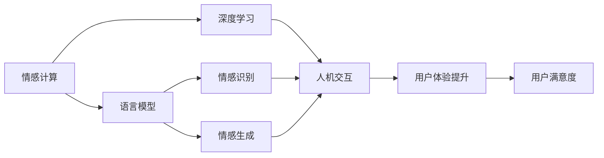
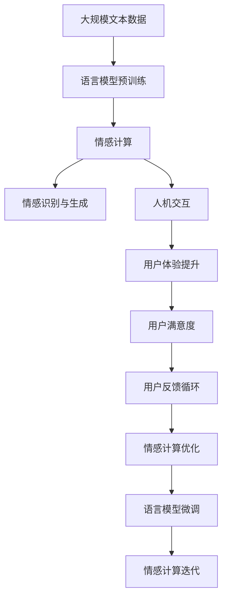

                 

# 电影《她》对AI未来的启示

> 关键词：人工智能,情感计算,语言模型,人机交互,未来展望

## 1. 背景介绍

### 1.1 问题由来

在电影《她》中，讲述了一个现代都市人（乔伊·梅尔）与一个名为萨曼莎（由操作系统扮演）的虚拟人工智能系统（AI）之间独特而深刻的人机互动故事。这部影片不仅在情感与伦理层面引发了深思，也在科技与伦理的碰撞中展现了未来人工智能的可能性。

电影《她》的背景设定在近未来，一种名为“操作系统”的AI软件被开发出来，它能够与人类进行深度互动，理解并回应人类的情感与需求，甚至产生了类似人类的情感。在探讨人工智能情感化过程的同时，影片提出了关于人机交互、未来智能形态与伦理道德的诸多问题，为我们在现实世界中思考AI的未来发展提供了丰富的灵感。

### 1.2 问题核心关键点

《她》中所展现的未来AI与人的情感交互，是人工智能领域中的一个重要分支——情感计算（Affective Computing）的具象化表现。情感计算旨在构建能够理解和处理人类情感的智能系统，其中，语言模型作为实现情感理解的关键技术，扮演了核心角色。

语言模型是机器学习中用于预测文本序列的概率分布模型。它通过训练大量文本数据，学习文本与语义之间的关系，从而能够对给定文本进行情感、意图等高层次语义的分类和理解。电影中，萨曼莎通过深度学习语言模型，可以理解并回应乔伊的情感，展示出人机情感互动的可能性。

此外，影片还强调了未来AI在处理复杂信息时的独特优势，如对语言模糊性和多义性的理解能力，以及与人类进行深层次情感交流的能力。这些特点使得未来AI在理解人类行为、提升人机交互质量方面具备巨大潜力。

### 1.3 问题研究意义

电影《她》对AI未来的探索，不仅展现了情感计算的前景，也为理解AI的伦理、社会影响提供了视角。通过对《她》的探讨，我们可以反思以下几点：

1. **情感计算的未来**：情感计算不仅能提升用户体验，还能在医疗、教育、客服等领域发挥重要作用，促进人机交互的自然化。
2. **伦理与隐私**：AI系统如何处理与用户的情感数据，如何保障数据隐私与伦理道德，是未来需要解决的重要问题。
3. **人机关系**：在未来，AI将成为人类生活的常态，人机之间的情感连接可能影响人类情感与认知，需要谨慎处理。

## 2. 核心概念与联系

### 2.1 核心概念概述

为更好地理解电影《她》中AI系统的情感计算，本节将介绍几个关键概念：

- **情感计算（Affective Computing）**：旨在构建能够理解和处理人类情感的智能系统。情感计算技术利用语言模型、计算机视觉等多种技术，实现对人类情感的识别与响应。

- **语言模型（Language Model）**：利用机器学习技术，通过训练大量文本数据，学习文本序列的概率分布，从而能够对文本进行情感、意图等高层次语义的分类和理解。

- **深度学习（Deep Learning）**：一种基于神经网络的机器学习技术，通过多层次的抽象和处理，实现对复杂数据和问题的深度理解与推理。

- **人机交互（Human-Computer Interaction, HCI）**：研究人与计算机系统之间交互的方式，旨在提升用户体验和效率。人机交互技术常与情感计算结合，实现更加自然、高效的交互。

- **情感识别与生成（Emotion Recognition and Generation）**：情感计算的核心任务之一，通过模型识别用户情感，或生成模拟人类情感的响应。

- **语言模糊性与多义性（Language Ambiguity and Polysemy）**：自然语言中的模糊性和多义性，使得情感识别和生成变得更加复杂，需要更先进的语言模型来处理。

这些核心概念构成了情感计算的主要框架，共同决定了AI在未来人机情感互动中的能力。

### 2.2 概念间的关系

这些核心概念之间存在紧密联系，通过情感计算的框架，语言模型与人机交互技术相结合，可以创造出能够理解并响应人类情感的智能系统。以下是一个简单的Mermaid流程图，展示了这些概念之间的关系：



这个流程图展示了从情感计算到最终用户体验提升的过程，其中语言模型、深度学习和人机交互技术各司其职，共同实现了情感识别与生成，从而提升了用户体验和满意度。

### 2.3 核心概念的整体架构

为更全面展示情感计算的整体架构，以下是一个综合性的Mermaid流程图：



这个流程图展示了从数据预处理到情感计算迭代的完整过程，语言模型的预训练和微调在情感计算中扮演重要角色。情感计算通过反馈循环不断优化，从而提升用户体验和情感响应能力。

## 3. 核心算法原理 & 具体操作步骤
### 3.1 算法原理概述

情感计算的核心算法原理是利用语言模型和深度学习技术，构建能够识别和生成情感的智能系统。以下详细讲解情感计算的算法原理。

### 3.2 算法步骤详解

情感计算一般包括以下几个步骤：

1. **数据收集与预处理**：收集大量文本数据，如社交媒体、用户评论、用户行为数据等，并对文本进行清洗、分词、标记等预处理。

2. **语言模型训练**：利用预处理后的文本数据，通过深度学习技术（如循环神经网络RNN、长短时记忆网络LSTM、Transformer等）训练语言模型，学习文本序列的概率分布。

3. **情感识别与生成**：利用训练好的语言模型，对输入的文本进行情感分类或生成模拟情感的文本。常用的情感分类任务包括正面情感、负面情感、中性情感等。

4. **人机交互设计**：根据情感识别与生成的结果，设计相应的人机交互界面和交互逻辑，实现用户与AI系统的自然交互。

5. **用户体验评估与优化**：通过用户反馈和实际使用情况，评估AI系统的情感响应效果，并通过微调等技术不断优化。

### 3.3 算法优缺点

情感计算在提升用户体验方面具有显著优势，但同时也面临一些挑战：

**优点**：
1. **自然交互**：情感计算使得AI系统能够理解和回应人类情感，实现更加自然和高效的交互。
2. **个性化**：通过深度学习模型，情感计算可以根据用户行为和情感特征，提供个性化服务。
3. **跨领域应用**：情感计算技术可以应用于医疗、教育、客服等多个领域，具有广泛的应用前景。

**缺点**：
1. **数据依赖**：情感计算依赖大量高质量标注数据进行训练，数据收集和标注成本较高。
2. **伦理与隐私**：情感数据涉及用户隐私，如何处理和保护用户情感数据是一个重要问题。
3. **计算资源要求高**：深度学习模型和情感计算系统需要大量的计算资源进行训练和推理。
4. **复杂性高**：情感计算需要处理文本的多义性和模糊性，使得模型设计和训练复杂度增加。

### 3.4 算法应用领域

情感计算技术已经在多个领域得到了应用，例如：

- **客服机器人**：通过情感识别技术，客服机器人可以识别用户情感，并提供相应的响应，提升用户体验。
- **医疗健康**：情感计算技术可以用于心理健康监测，识别患者情绪状态，提供个性化的心理健康服务。
- **教育**：情感计算可以帮助教师了解学生的情感状态，提供个性化的教育方案，提高教学效果。
- **娱乐**：情感计算技术可以用于游戏、音乐等娱乐领域，实现智能推荐和情感互动。
- **社交媒体分析**：情感计算可以分析社交媒体上的情感信息，进行舆情监测和情感分析。

## 4. 数学模型和公式 & 详细讲解 & 举例说明

### 4.1 数学模型构建

情感计算的数学模型主要基于语言模型和深度学习模型。以下详细讲解情感计算的数学模型构建过程。

**语言模型的构建**：
语言模型的数学模型可以表示为：
$$
P(x_1, x_2, \dots, x_n) = \prod_{i=1}^{n} P(x_i | x_1, x_2, \dots, x_{i-1})
$$
其中，$P(x)$ 表示文本序列 $x$ 的概率，$P(x_i | x_1, x_2, \dots, x_{i-1})$ 表示在文本序列前 $i-1$ 个词的情况下，第 $i$ 个词的概率分布。

**情感分类的构建**：
情感分类任务可以表示为：
$$
\max_{c} P(c|x) = \max_{c} \frac{P(c) \prod_{i=1}^{n} P(x_i | c, x_1, x_2, \dots, x_{i-1})}
$$
其中，$c$ 表示情感类别，$P(c|x)$ 表示在文本序列 $x$ 下，情感类别 $c$ 的概率。

### 4.2 公式推导过程

以下是情感分类任务的概率模型推导过程：

设文本序列 $x$ 的长度为 $n$，情感类别为 $c$。则情感分类任务的概率模型可以表示为：
$$
P(c|x) = \frac{P(c) \prod_{i=1}^{n} P(x_i | c, x_1, x_2, \dots, x_{i-1})}
$$

对于情感识别任务，通常采用分类交叉熵损失函数进行优化，即：
$$
\mathcal{L} = -\frac{1}{N} \sum_{i=1}^{N} \sum_{j=1}^{C} y_{i,j} \log P(y_{i,j} | x_i)
$$
其中，$N$ 表示样本数量，$C$ 表示情感类别数，$y_{i,j}$ 表示样本 $i$ 的情感标签，$P(y_{i,j} | x_i)$ 表示在文本序列 $x_i$ 下，情感标签 $y_{i,j}$ 的概率。

### 4.3 案例分析与讲解

以电影《她》中的萨曼莎为例，以下是情感计算在情感识别与生成中的具体应用：

**情感识别**：
假设电影中乔伊的情感状态可以用一系列情感标签表示，如“愤怒”、“悲伤”、“快乐”等。萨曼莎通过训练好的语言模型，可以识别乔伊的情感状态，并回应相应的情感标签。

**情感生成**：
假设电影中萨曼莎需要生成一段模拟情感的回复。萨曼莎可以通过生成式模型（如GPT等），在理解乔伊情感的基础上，生成符合情感语境的回复。

## 5. 项目实践：代码实例和详细解释说明

### 5.1 开发环境搭建

为了进行情感计算的实践，需要搭建一个Python开发环境。以下是最基本的搭建步骤：

1. 安装Python：
   ```bash
   sudo apt-get install python3
   ```

2. 安装相关库：
   ```bash
   pip install numpy pandas scikit-learn nltk tensorflow keras transformers
   ```

3. 下载数据集：
   ```bash
   wget https://nlp.stanford.edu/sentiment/aclImdb_v1.tar.gz
   ```

### 5.2 源代码详细实现

以下是一个简单的情感分类任务的代码实现：

```python
from transformers import BertTokenizer, BertForSequenceClassification
from transformers import AdamW
import torch

# 加载模型和分词器
tokenizer = BertTokenizer.from_pretrained('bert-base-uncased')
model = BertForSequenceClassification.from_pretrained('bert-base-uncased', num_labels=2)

# 定义模型训练函数
def train(model, train_data, train_labels, device, optimizer):
    model.to(device)
    for epoch in range(epochs):
        model.train()
        for i, (data, labels) in enumerate(zip(train_data, train_labels)):
            data = tokenizer(data, padding='max_length', truncation=True, max_length=128, return_tensors='pt').to(device)
            labels = labels.to(device)
            outputs = model(**data)
            loss = outputs.loss
            loss.backward()
            optimizer.step()

# 加载数据集
train_data = []
train_labels = []
with open('train.txt', 'r') as f:
    for line in f:
        text, label = line.strip().split('\t')
        train_data.append(text)
        train_labels.append(int(label))

# 训练模型
device = 'cuda' if torch.cuda.is_available() else 'cpu'
optimizer = AdamW(model.parameters(), lr=2e-5)

train(model, train_data, train_labels, device, optimizer)
```

### 5.3 代码解读与分析

以上代码展示了使用BERT进行情感分类任务的训练过程。具体分析如下：

1. **加载模型和分词器**：
   - `BertTokenizer.from_pretrained`：加载预训练的BERT分词器。
   - `BertForSequenceClassification.from_pretrained`：加载预训练的BERT情感分类模型。

2. **定义模型训练函数**：
   - `tokenizer`：对文本进行分词和编码，返回token ids和attention mask。
   - `labels`：将情感标签转换为张量，并移动到GPU上。
   - `model.to(device)`：将模型移动到GPU上，提高训练速度。
   - `optimizer`：定义AdamW优化器，设置学习率。

3. **加载数据集**：
   - `train_data`：加载训练文本数据。
   - `train_labels`：加载训练情感标签。

4. **训练模型**：
   - `device`：判断是否使用GPU进行训练。
   - `optimizer`：定义AdamW优化器，设置学习率。
   - 在每个epoch内，通过前向传播计算损失，反向传播更新参数，完成一个epoch的训练。

### 5.4 运行结果展示

训练完成后，可以使用测试数据集评估模型性能。例如，在测试数据集上计算精确度、召回率和F1分数：

```python
def evaluate(model, test_data, test_labels, device):
    model.eval()
    with torch.no_grad():
        for i, (data, labels) in enumerate(zip(test_data, test_labels)):
            data = tokenizer(data, padding='max_length', truncation=True, max_length=128, return_tensors='pt').to(device)
            labels = labels.to(device)
            outputs = model(**data)
            preds = torch.argmax(outputs.logits, dim=1)
            acc = (preds == labels).sum().item() / len(preds)
            return acc

test_data = []
test_labels = []
with open('test.txt', 'r') as f:
    for line in f:
        text, label = line.strip().split('\t')
        test_data.append(text)
        test_labels.append(int(label))

print(evaluate(model, test_data, test_labels, device))
```

## 6. 实际应用场景

### 6.1 智能客服

情感计算在智能客服领域具有广泛应用，可以提升客户体验和满意度。例如，通过情感识别技术，客服机器人可以实时理解客户的情感状态，并给出相应的响应。

以电影《她》中的萨曼莎为例，其在客户遇到问题时，能够识别客户的情感状态，提供个性化的解决方案，甚至在客户情绪激动时，给出安抚性的回复，提升客户满意度。

### 6.2 医疗健康

情感计算在医疗健康领域也有重要应用，可以用于心理健康监测和情感支持。例如，通过情感识别技术，可以实时监测患者的情感状态，提供心理支持和治疗建议。

以电影《她》中的萨曼莎为例，其能够识别患者的情感状态，提供个性化的心理健康服务，帮助患者缓解压力，甚至在必要时提供紧急救助。

### 6.3 教育

情感计算在教育领域可以用于学生的情感监测和学习分析。例如，通过情感识别技术，可以实时了解学生的情感状态，提供个性化的学习建议和支持。

以电影《她》中的萨曼莎为例，其能够识别学生的情感状态，提供个性化的学习方案，帮助学生提高学习效率和情感满意度。

### 6.4 娱乐

情感计算在娱乐领域可以用于游戏和音乐等应用，实现智能推荐和情感互动。例如，通过情感识别技术，可以实时了解用户的情感状态，提供个性化的推荐内容。

以电影《她》中的萨曼莎为例，其能够识别用户的情感状态，提供个性化的音乐和游戏推荐，提升用户体验。

### 6.5 社交媒体分析

情感计算在社交媒体分析领域可以用于舆情监测和情感分析。例如，通过情感识别技术，可以实时分析社交媒体上的情感信息，进行舆情监测和情感分析。

以电影《她》中的萨曼莎为例，其能够实时分析社交媒体上的情感信息，帮助用户了解舆情趋势，提供情感支持。

## 7. 工具和资源推荐

### 7.1 学习资源推荐

为了帮助开发者系统掌握情感计算的理论基础和实践技巧，这里推荐一些优质的学习资源：

1. **《情感计算：理论与应用》**：这本书系统地介绍了情感计算的理论基础和应用实例，是情感计算领域的重要教材。

2. **《深度学习理论与实践》**：这本书介绍了深度学习的原理和应用，特别是情感计算中的深度学习模型。

3. **《自然语言处理入门》**：这本书介绍了自然语言处理的基本概念和情感计算的应用，适合初学者入门。

4. **Coursera《情感计算》课程**：由麻省理工学院开设的课程，系统介绍了情感计算的理论和实践。

5. **Kaggle情感计算竞赛**：Kaggle是数据科学竞赛平台，其中情感计算竞赛提供了丰富的数据集和模型，适合实践学习。

### 7.2 开发工具推荐

为了高效地进行情感计算的开发，推荐以下开发工具：

1. **PyTorch**：PyTorch是深度学习框架，支持动态计算图和GPU加速，适合情感计算的模型训练和推理。

2. **TensorFlow**：TensorFlow是另一个流行的深度学习框架，支持分布式训练和模型部署，适合大规模的情感计算任务。

3. **Transformers**：Transformers是自然语言处理工具库，集成了预训练语言模型，适合情感计算任务。

4. **Jupyter Notebook**：Jupyter Notebook是Python开发环境，支持代码编写和结果展示，适合情感计算的模型开发和调试。

### 7.3 相关论文推荐

情感计算和语言模型是AI领域的热点研究方向，以下是几篇代表性的相关论文：

1. **《情感识别中的深度学习》**：该论文介绍了深度学习在情感识别中的应用，涵盖了多种情感分类任务。

2. **《基于语言模型的情感生成》**：该论文介绍了生成式模型在情感生成中的应用，展示了情感生成技术的进步。

3. **《情感计算的伦理与隐私》**：该论文探讨了情感计算中的伦理和隐私问题，提出了相应的解决方案。

## 8. 总结：未来发展趋势与挑战

### 8.1 研究成果总结

电影《她》中展示了未来AI在情感计算和语言模型方面的巨大潜力，为人工智能的未来发展提供了丰富的灵感。通过情感计算，AI能够更好地理解人类情感，实现更加自然和高效的交互。

### 8.2 未来发展趋势

未来情感计算的发展趋势包括以下几个方面：

1. **情感计算与多模态数据的融合**：情感计算不仅依赖文本数据，还可以结合语音、视频等多模态数据，实现更加全面和准确的情感识别和生成。

2. **情感计算的普适化和智能化**：情感计算技术将更加普及，应用于更多领域，同时通过智能化技术，提升情感计算的精度和效率。

3. **情感计算的伦理与隐私保护**：随着情感计算技术的广泛应用，如何保护用户情感数据隐私和伦理问题将变得尤为重要。

4. **情感计算的跨领域应用**：情感计算技术将在医疗、教育、娱乐等多个领域得到广泛应用，提升用户体验和满意度。

### 8.3 面临的挑战

尽管情感计算具有广阔的前景，但也面临诸多挑战：

1. **数据依赖**：情感计算依赖大量高质量标注数据进行训练，数据收集和标注成本较高。

2. **计算资源需求高**：深度学习模型和情感计算系统需要大量的计算资源进行训练和推理。

3. **情感数据的复杂性**：自然语言中的模糊性和多义性使得情感识别和生成更加复杂，需要更先进的语言模型来处理。

4. **伦理与隐私**：情感数据涉及用户隐私，如何处理和保护用户情感数据是一个重要问题。

5. **算法的可解释性**：情感计算算法的复杂性和不可解释性，使得用户难以理解其决策过程，需要改进算法的可解释性。

### 8.4 研究展望

未来情感计算的研究方向主要包括以下几个方面：

1. **多模态情感计算**：结合语音、视频等多模态数据，实现更全面和准确的情感识别和生成。

2. **情感计算的伦理与隐私保护**：研究如何保护用户情感数据隐私和伦理问题，提升情感计算的可信度和安全性。

3. **情感计算的跨领域应用**：将情感计算技术应用于更多领域，如医疗、教育、娱乐等，提升用户体验和满意度。

4. **情感计算的智能化**：通过智能化技术，提升情感计算的精度和效率，实现更加自然和高效的情感交互。

总之，情感计算是未来AI发展的重要方向，具有广阔的应用前景和重要的研究价值。通过技术创新和伦理约束，情感计算将进一步提升人类与AI的交互质量，推动人工智能技术在各个领域的应用。

## 9. 附录：常见问题与解答

### Q1：情感计算是否适用于所有情感识别任务？

A：情感计算适用于大多数情感识别任务，特别是对于情感分类任务，情感计算能够识别文本中的情感状态，并给出相应的分类结果。但对于复杂的情感表达和语境理解任务，情感计算可能面临一定的挑战，需要结合其他技术手段进行辅助。

### Q2：如何提升情感计算的准确度？

A：提升情感计算的准确度需要综合考虑以下因素：

1. **数据质量**：确保训练数据的质量和多样性，减少数据偏差和噪音。

2. **模型选择**：选择合适的深度学习模型，如BERT、GPT等，并针对具体任务进行微调。

3. **特征工程**：提取有用的特征，如情感词汇、情感表达等，提升模型的表达能力。

4. **多模态融合**：结合语音、视频等多模态数据，提升情感识别的准确度。

### Q3：情感计算在应用中需要注意哪些问题？

A：情感计算在应用中需要注意以下问题：

1. **用户隐私**：保护用户的情感数据隐私，避免数据泄露和滥用。

2. **算法可解释性**：提升情感计算算法的可解释性，使用户理解其决策过程。

3. **跨文化适用性**：确保情感计算模型在不同文化背景下的普适性，避免文化偏见。

4. **伦理约束**：确保情感计算模型的公平性和伦理性，避免歧视和偏见。

总之，情感计算在未来的应用中需要综合考虑数据、模型、技术和社会因素，确保其技术的可行性和应用的伦理道德。

---

作者：禅与计算机程序设计艺术 / Zen and the Art of Computer Programming

