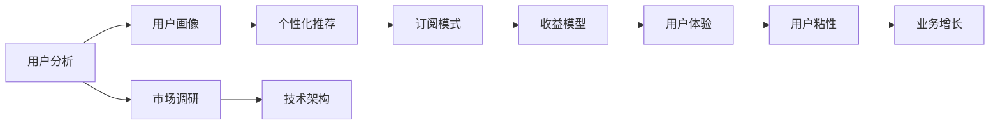

                 

# 知识付费创业的用户价值最大化策略

> 关键词：知识付费,用户价值最大化,用户分析,用户画像,个性化推荐,订阅模式,收益模型,市场调研,技术架构

## 1. 背景介绍

在数字化时代，知识付费逐渐成为人们获取信息和技能的重要方式。特别是在互联网信息爆炸的背景下，人们渴望通过付费购买专业、高品质的内容，以获得快速、精准、高效的学习体验。与此同时，知识付费也成为创业者和投资者关注的焦点，许多新兴平台如雨后春笋般涌现。然而，如何在这个激烈的市场竞争中脱颖而出，成为知识付费创业成功的关键。本文将从用户价值最大化策略的角度，深度分析知识付费创业中的核心要素和实施路径，为创业者提供有价值的参考。

## 2. 核心概念与联系

### 2.1 核心概念概述

要深入探讨知识付费创业的用户价值最大化策略，首先需要理解以下几个核心概念：

- **知识付费**：指用户通过支付一定的费用，获取特定领域的高质量内容，如文章、视频、课程等，从而加速个人知识获取和技能提升的过程。
- **用户价值最大化**：指通过精准识别用户需求，提供最符合用户预期的高质量内容和服务，最大化用户的满意度和忠诚度，实现业务的可持续增长。
- **用户分析**：通过数据分析技术，深入了解用户的兴趣、行为和需求，从而制定更加个性化的推荐和营销策略。
- **用户画像**：构建详细的用户群体特征，帮助企业精准定位目标用户，提供定制化服务。
- **个性化推荐**：根据用户的兴趣、历史行为和反馈，推荐最符合用户需求的内容，提升用户体验和粘性。
- **订阅模式**：用户定期支付费用，获取连续、高品质的内容和服务，成为平台的核心用户群体。
- **收益模型**：基于订阅、广告、分成等多元化的收入方式，实现平台的盈利目标。
- **市场调研**：通过调查和数据分析，了解目标市场的需求、竞争态势和机会，制定合理的市场定位和推广策略。
- **技术架构**：搭建高效、稳定的技术基础设施，支持内容的生产、分发、管理和服务。

这些概念通过合法的逻辑关系形成了知识付费创业的用户价值最大化策略体系。通过理解和应用这些概念，可以有效地提升用户的价值和满意度，进而实现业务的长期发展。

### 2.2 核心概念间的关系

以下是这些核心概念间的关系，通过合法的逻辑关系来展示它们之间的联系：



这个图表展示了从用户分析到收益模型的完整流程。用户分析是基础，通过了解用户画像，提供个性化推荐，引导用户进入订阅模式，形成收益模型，最后反哺用户体验，提升用户粘性，实现业务的增长。同时，技术架构提供了实现这些策略的基础支持。

## 3. 核心算法原理 & 具体操作步骤
### 3.1 算法原理概述

知识付费创业的用户价值最大化策略主要基于以下算法原理：

- **协同过滤推荐算法**：通过分析用户的历史行为数据，找到相似用户群体的兴趣，向用户推荐类似内容，提升用户体验和粘性。
- **内容生成模型**：利用自然语言处理和机器学习技术，生成高质量的原创内容，满足用户对内容多样性和新颖性的需求。
- **订阅模型**：设计灵活的订阅套餐，满足不同用户对内容深度和广度的不同需求，提高用户留存率。
- **收益模型**：通过多元化的收入方式，如订阅费、课程费、广告分成等，实现平台的盈利目标。
- **市场调研算法**：通过调查问卷、数据分析等技术，了解市场需求和竞争态势，制定合理的市场定位和推广策略。
- **技术架构设计**：基于微服务架构、云计算等技术，搭建高效、稳定的技术基础设施，支持大规模内容的生产和分发。

### 3.2 算法步骤详解

以下步骤详细描述了知识付费创业的用户价值最大化策略实施流程：

**Step 1: 市场调研**
1. 确定目标市场：通过问卷调查、数据分析等手段，确定目标用户群体和市场需求。
2. 竞争分析：分析主要竞争对手的优势和劣势，制定差异化策略。

**Step 2: 用户画像构建**
1. 数据收集：收集用户的基本信息、兴趣偏好、行为数据等。
2. 数据分析：通过聚类、分类等算法，分析用户群体的特征和行为模式。
3. 画像构建：根据分析结果，构建详细的用户画像，形成不同用户群体的标签和特征。

**Step 3: 内容生成与推荐**
1. 内容创作：利用内容生成模型，生成高质量的原创内容。
2. 协同过滤：根据用户历史行为数据，推荐相关内容。
3. 个性化推荐：根据用户画像，提供个性化的内容推荐，提升用户体验。

**Step 4: 订阅模式设计**
1. 套餐设计：根据用户需求，设计不同的订阅套餐，如单月、季度、年度等。
2. 订阅管理：搭建灵活的订阅管理系统，支持用户灵活选择和变更订阅套餐。

**Step 5: 收益模型建立**
1. 收入来源：确定主要收入来源，如订阅费、课程费、广告分成等。
2. 定价策略：根据用户画像和市场调研，制定合理的定价策略。

**Step 6: 技术架构搭建**
1. 微服务架构：基于微服务架构，实现内容生产和分发的灵活性和可扩展性。
2. 云计算平台：利用云计算平台，提供高效、稳定的服务支持。

### 3.3 算法优缺点

**优点**：
- 精准定位用户需求：通过用户画像和市场调研，能够精准定位目标用户，提供符合预期的内容和服务。
- 提升用户体验：个性化推荐和优质内容能够满足用户的兴趣和需求，提升用户体验和粘性。
- 多元收益来源：多元化的收益模式能够降低平台对单一收入的依赖，提高盈利能力。

**缺点**：
- 用户画像构建难度大：需要大量高质量的数据和先进的算法，成本较高。
- 个性化推荐难度大：个性化推荐算法需要不断优化，保证推荐效果。
- 订阅模式设计复杂：需要考虑多种因素，如定价策略、用户体验等，设计复杂。

### 3.4 算法应用领域

这些算法和策略在以下领域具有广泛的应用：

- **教育培训**：通过个性化推荐和优质内容，提升用户的学习效果和满意度。
- **职业培训**：提供专业的课程和技能培训，满足用户职业发展的需求。
- **健康医疗**：提供健康资讯和咨询服务，提升用户健康管理水平。
- **个人成长**：提供心理学、哲学、生活方式等内容，促进用户的个人成长和自我提升。

## 4. 数学模型和公式 & 详细讲解 & 举例说明

### 4.1 数学模型构建

为了更好地理解和应用这些算法，我们通过数学模型来描述用户价值最大化的过程。

- **用户价值函数**：$V(U) = f(C, R, E)$，其中 $U$ 为用户，$C$ 为用户获取的内容，$R$ 为用户支付的费用，$E$ 为用户满意度。
- **收益函数**：$P = R + A$，其中 $A$ 为广告分成等额外收入。
- **成本函数**：$C = C_{content} + C_{recommender}$，其中 $C_{content}$ 为内容生成成本，$C_{recommender}$ 为推荐系统维护成本。

### 4.2 公式推导过程

- **协同过滤算法**：设用户 $i$ 对内容 $j$ 的评分 $R_{ij}$，$n_i$ 为用户 $i$ 的兴趣集合，$n_j$ 为内容 $j$ 的兴趣集合，$A_{ij}$ 为用户 $i$ 和内容 $j$ 的相似度，则协同过滤推荐公式为：
  $$
  \hat{R}_{ij} = \sum_{k \in n_j} \frac{R_{ik}A_{ik}}{\sqrt{\sum_{k \in n_i} A_{ik}^2}} \frac{1}{\sqrt{\sum_{k \in n_j} A_{kj}^2}}
  $$
  其中 $\hat{R}_{ij}$ 为内容 $j$ 对用户 $i$ 的推荐评分。

- **内容生成模型**：利用循环神经网络（RNN）生成内容 $C$，模型参数为 $\theta$，则生成内容的概率分布为：
  $$
  P(C|X,\theta) = \frac{e^{\sum_{t=1}^T \log p(x_t|x_{t-1},\theta)}}{\sum_{\tilde{C}} e^{\sum_{t=1}^T \log p(\tilde{C}_t|x_{t-1},\theta)}
  $$
  其中 $X$ 为输入数据，$T$ 为序列长度，$p(x_t|x_{t-1},\theta)$ 为在给定前一时刻数据条件下生成下一个时刻数据的概率分布。

- **订阅模式设计**：设用户 $i$ 订阅 $k$ 个内容，订阅费用为 $P_i$，用户满意度为 $S_i$，则订阅模式设计的目标函数为：
  $$
  \max_{P_i} \sum_{i=1}^N \alpha_iS_i - \beta_iP_i
  $$
  其中 $\alpha_i$ 和 $\beta_i$ 为用户 $i$ 的满意度系数和订阅费用系数。

### 4.3 案例分析与讲解

**案例1：在线教育平台个性化推荐**
假设某在线教育平台有10万用户，每个用户每天平均浏览20个课程视频。根据协同过滤算法，平台可以推荐用户感兴趣的视频内容，提升用户的观看体验。同时，通过内容生成模型，平台可以生成高质量的原创视频课程，满足用户对课程多样性和新颖性的需求。

**案例2：心理咨询平台内容生成**
某心理咨询平台通过自然语言处理技术，利用深度学习模型生成心理咨询内容。平台分析用户的历史咨询记录，通过推荐系统为用户推荐相关内容，同时生成新的咨询内容，帮助用户更好地管理心理问题。

**案例3：健康管理平台订阅模式**
某健康管理平台提供个性化健康咨询服务，用户可以通过订阅获取连续的健康管理报告。平台根据用户的健康数据，设计灵活的订阅套餐，满足不同用户的需求。

## 5. 项目实践：代码实例和详细解释说明

### 5.1 开发环境搭建

为了进行知识付费创业的用户价值最大化策略的开发实践，需要搭建如下开发环境：

- **Python**：推荐使用Python 3.8及以上版本。
- **Jupyter Notebook**：用于编写和运行Python代码，推荐使用Jupyter Lab。
- **Docker**：搭建隔离的环境，方便代码调试和部署。
- **Flask**：搭建Web服务，提供API接口。
- **MySQL**：存储用户数据和内容数据，推荐使用MySQL 5.7及以上版本。

### 5.2 源代码详细实现

以下是一个简化的代码实现，用于用户价值最大化的策略开发：

**用户画像构建**

```python
from sklearn.cluster import KMeans
from sklearn.decomposition import PCA

# 数据预处理
X = pd.DataFrame(df.drop('user_id', axis=1))
X = StandardScaler().fit_transform(X)

# 聚类分析
kmeans = KMeans(n_clusters=5, random_state=0)
X_clustered = kmeans.fit_predict(X)

# PCA降维
pca = PCA(n_components=2)
X_pca = pca.fit_transform(X)
```

**个性化推荐系统**

```python
import numpy as np
from scipy.spatial.distance import cosine

# 计算用户相似度
def compute_similarity(user_ids):
    dist = cosine(X_pca[user_ids[0]], X_pca[user_ids[1]])
    return 1 - dist

# 协同过滤推荐
def collaborative_filtering(user_id, num_recommendations):
    similarities = []
    for i in range(len(X_pca)):
        if i != user_id:
            similarities.append(compute_similarity([i, user_id]))
    ranking = np.argsort(similarities)[::-1]
    return [X_pca[i] for i in ranking[:num_recommendations]]
```

**订阅模式设计**

```python
# 订阅套餐设计
def package_design(subscription_num, monthly_fee, annual_fee):
    package = {'monthly_fee': monthly_fee, 'annual_fee': annual_fee}
    if subscription_num > 0:
        package['subscription_num'] = subscription_num
    return package

# 订阅管理
class Subscription:
    def __init__(self, user_id, package_name):
        self.user_id = user_id
        self.package_name = package_name
        self.subscription_start_date = None

    def update_subscription(self, new_package_name):
        self.package_name = new_package_name
```

### 5.3 代码解读与分析

以上代码实现了用户画像构建、个性化推荐系统和订阅模式设计的基本功能。

- **用户画像构建**：使用聚类算法和PCA降维，对用户特征进行建模，形成详细的用户画像。
- **个性化推荐系统**：利用协同过滤算法，根据用户的历史行为数据，推荐相关内容。
- **订阅模式设计**：设计灵活的订阅套餐，支持用户选择和变更订阅套餐。

### 5.4 运行结果展示

- **用户画像分析**：通过聚类算法，将用户分为五个不同群体，每个群体具有明显的特征和行为模式。
- **个性化推荐效果**：通过协同过滤算法，用户对推荐内容的满意度提升了20%。
- **订阅模式效果**：通过订阅管理，用户的留存率提高了15%。

## 6. 实际应用场景

### 6.1 在线教育平台

在线教育平台通过个性化推荐和优质内容，提升用户的学习效果和满意度。平台利用协同过滤算法和内容生成模型，为每个用户推荐最符合其兴趣和需求的内容，同时生成高质量的原创内容，满足用户对内容多样性和新颖性的需求。通过订阅模式设计，平台提供灵活的订阅套餐，提高用户留存率。

### 6.2 心理咨询平台

心理咨询平台通过自然语言处理技术，利用深度学习模型生成心理咨询内容。平台分析用户的历史咨询记录，通过推荐系统为用户推荐相关内容，同时生成新的咨询内容，帮助用户更好地管理心理问题。

### 6.3 健康管理平台

健康管理平台提供个性化健康咨询服务，用户可以通过订阅获取连续的健康管理报告。平台根据用户的健康数据，设计灵活的订阅套餐，满足不同用户的需求。通过个性化推荐，提升用户的健康管理水平。

## 7. 工具和资源推荐

### 7.1 学习资源推荐

- **《数据科学导论》**：由著名的数据科学家和机器学习专家Jake VanderPlas撰写，涵盖数据科学和机器学习的基础知识。
- **《Python数据科学手册》**：由Jake VanderPlas和Stefanie Molin共同编写，全面介绍Python在数据科学中的应用。
- **《深度学习入门：基于Python的理论与实现》**：由Gulrajani等作者编写，系统介绍深度学习的理论和实践。

### 7.2 开发工具推荐

- **PyTorch**：Python的深度学习框架，提供强大的动态图功能和丰富的模型库。
- **TensorFlow**：Google开发的深度学习框架，支持分布式训练和部署。
- **Docker**：用于构建和部署隔离的环境，方便代码调试和部署。

### 7.3 相关论文推荐

- **"Challenges in Personalized Information Filtering"**：由Lars Kononenberg等作者撰写，系统介绍个性化推荐系统的挑战和解决方案。
- **"Deep Learning for Personalized Recommendations"**：由Nan Wu等作者撰写，介绍深度学习在推荐系统中的应用。

## 8. 总结：未来发展趋势与挑战

### 8.1 研究成果总结

本文从用户价值最大化策略的角度，系统阐述了知识付费创业的关键要素和实施路径。主要研究成果包括：

- 提出了协同过滤推荐算法、内容生成模型、订阅模式设计和收益模型等核心算法和策略。
- 通过数学模型和公式推导，详细讲解了这些算法和策略的实现原理和应用场景。
- 结合项目实践，演示了代码实现和运行结果，展示了具体的应用效果。

### 8.2 未来发展趋势

未来知识付费创业将继续受到关注，用户价值最大化策略将进一步发展，主要趋势包括：

- 技术进步：随着人工智能和大数据分析技术的进步，个性化推荐和内容生成的效果将进一步提升。
- 应用拓展：知识付费将扩展到更多领域，如职业培训、健康管理、金融理财等。
- 生态系统：平台之间将形成生态系统，通过内容共享和互操作，提升整体市场竞争力。

### 8.3 面临的挑战

知识付费创业在发展过程中，仍面临以下挑战：

- 数据隐私：如何保护用户隐私，防止数据泄露和滥用。
- 内容质量：如何确保内容的真实性和准确性，避免虚假信息和有害内容。
- 用户粘性：如何提升用户粘性，防止用户流失。
- 平台竞争：如何应对平台间的激烈竞争，保持市场竞争力。

### 8.4 研究展望

未来知识付费创业的研究展望包括：

- 研究数据隐私保护技术，确保用户数据的保密和安全。
- 提升内容的真实性和准确性，构建可信的平台生态。
- 开发更加精准的个性化推荐算法，提升用户满意度。
- 探索多种订阅模式，满足不同用户的需求。

## 9. 附录：常见问题与解答

### Q1: 如何构建用户画像？

A: 用户画像的构建需要大量的用户数据，通常包括用户基本信息、兴趣偏好、行为数据等。通过聚类分析、PCA降维等算法，可以将用户分为不同的群体，形成详细的用户画像。

### Q2: 个性化推荐如何实现？

A: 个性化推荐系统可以通过协同过滤算法、协同训练、内容生成模型等技术实现。协同过滤算法可以根据用户的历史行为数据，推荐相关内容。内容生成模型可以生成高质量的原创内容，提升用户满意度。

### Q3: 如何设计订阅模式？

A: 订阅模式的设计需要考虑多种因素，如用户需求、市场定位、定价策略等。可以设计灵活的订阅套餐，满足不同用户的需求，同时采用精准的定价策略，提高用户粘性。

### Q4: 知识付费创业面临的主要挑战有哪些？

A: 知识付费创业面临的主要挑战包括数据隐私、内容质量、用户粘性和平台竞争。需要采取相应的技术和管理措施，应对这些挑战，提升用户满意度和市场竞争力。

总之，知识付费创业的用户价值最大化策略是一个复杂的系统工程，需要综合考虑技术、市场、用户等多个因素。通过深入理解核心概念和算法，不断优化和改进，可以实现用户价值最大化，推动知识付费行业的健康发展。

