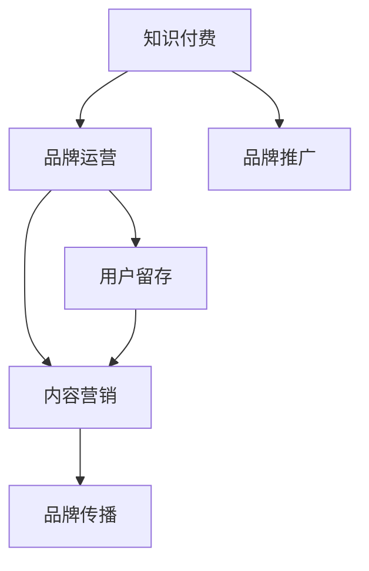

                 

# 知识付费赚钱的品牌品牌运营与品牌推广策略

> 关键词：知识付费,品牌运营,品牌推广,用户留存,内容营销

## 1. 背景介绍

### 1.1 问题由来

在知识经济的时代，知识付费逐渐成为一种主流消费模式。知识付费不仅能够帮助消费者在短时间内获取有价值的信息，还能够为品牌提供更加精准的用户画像。然而，在知识付费市场快速发展的过程中，品牌如何进行有效的品牌运营和推广，成为当前亟待解决的问题。

### 1.2 问题核心关键点

品牌运营和推广的核心在于提升用户留存率，增强品牌认知度和美誉度。本文将从用户留存、内容营销和品牌传播三个维度，系统介绍知识付费品牌如何进行有效的品牌运营与推广。

### 1.3 问题研究意义

品牌运营和推广对于知识付费品牌的长期发展具有重要意义。通过有效的品牌运营和推广，不仅能够提升品牌的市场竞争力和用户满意度，还能够为品牌带来稳定的收益。

## 2. 核心概念与联系

### 2.1 核心概念概述

- **知识付费**：用户为获取知识和信息而支付的费用的模式。知识付费产品包括在线课程、电子书、专栏等。
- **品牌运营**：通过一系列策略和手段，提升品牌知名度和美誉度，增强用户对品牌的忠诚度。
- **品牌推广**：通过各种营销手段，将品牌推向市场，增加品牌的曝光率和影响力。
- **用户留存**：通过有效的运营策略，增加用户的活跃度和忠诚度，减少用户流失。
- **内容营销**：通过优质的内容，吸引用户关注和参与，提升品牌的市场竞争力。
- **品牌传播**：通过各种渠道和手段，将品牌理念和价值传递给用户，增加品牌的认知度。

这些核心概念之间的联系可以通过以下Mermaid流程图来展示：



这个流程图展示了知识付费、品牌运营、品牌推广、用户留存、内容营销和品牌传播之间的联系。知识付费品牌通过品牌运营和推广，提升用户留存和内容营销效果，进一步加强品牌传播，形成良性循环。

## 3. 核心算法原理 & 具体操作步骤

### 3.1 算法原理概述

知识付费品牌进行品牌运营和推广的核心在于通过数据驱动的策略，提升用户满意度和品牌认知度。具体来说，可以从以下几个方面入手：

- **用户画像分析**：通过数据分析，了解用户的兴趣和需求，制定个性化的品牌推广策略。
- **内容推荐算法**：通过推荐算法，提升内容的匹配度，增强用户对品牌的认可度。
- **用户互动优化**：通过用户互动数据，优化品牌推广和运营策略，提高用户留存率。
- **品牌传播渠道选择**：通过数据监控和分析，选择合适的品牌传播渠道，提升品牌曝光率。

### 3.2 算法步骤详解

以下是一个典型的品牌运营和推广流程：

**Step 1: 数据收集与分析**
- 收集用户的行为数据，包括浏览记录、购买记录、互动数据等。
- 使用数据分析工具，对数据进行清洗和处理，提取有用的信息。

**Step 2: 用户画像构建**
- 根据用户行为数据，构建用户画像，包括用户兴趣、消费习惯、职业背景等。
- 根据用户画像，制定个性化的品牌推广策略，提升品牌曝光率。

**Step 3: 内容推荐优化**
- 根据用户画像，优化推荐算法，提升内容的匹配度和用户满意度。
- 对推荐算法进行持续优化，不断提升品牌影响力。

**Step 4: 用户互动优化**
- 通过用户互动数据，优化品牌推广策略，提升用户留存率。
- 及时回应用户反馈，优化品牌运营策略，提高用户满意度。

**Step 5: 品牌传播渠道选择**
- 根据品牌特点和用户行为数据，选择合适的品牌传播渠道，如社交媒体、搜索引擎、邮件等。
- 对传播渠道进行持续优化，提升品牌曝光率和用户认知度。

### 3.3 算法优缺点

品牌运营和推广的算法具有以下优点：

- **数据驱动**：通过数据分析，制定个性化的推广策略，提升品牌曝光率和用户满意度。
- **用户导向**：根据用户画像和互动数据，优化品牌运营策略，提高用户留存率和忠诚度。
- **灵活可控**：通过调整推荐算法和传播渠道，可以灵活应对市场变化和用户需求。

同时，这些算法也存在以下缺点：

- **数据依赖**：需要大量的用户数据支持，数据质量和完整性对于推广效果至关重要。
- **算法复杂**：推荐算法和内容营销算法需要高复杂度的技术支持，对团队技术要求较高。
- **成本较高**：品牌运营和推广需要投入大量的时间和资源，成本较高。

### 3.4 算法应用领域

品牌运营和推广的算法可以应用于知识付费品牌的各个环节，如课程推荐、用户互动、品牌传播等。通过这些算法，品牌可以更好地理解用户需求，提升用户满意度和品牌影响力。

## 4. 数学模型和公式 & 详细讲解  
### 4.1 数学模型构建

品牌运营和推广的数学模型主要包括以下几个部分：

- **用户画像模型**：用于描述用户特征和行为的模型。
- **内容推荐模型**：用于推荐内容的模型，如协同过滤、基于内容的推荐等。
- **用户互动模型**：用于描述用户行为和互动的模型。
- **品牌传播模型**：用于描述品牌传播效果和影响的模型。

### 4.2 公式推导过程

以下是一个简单的品牌运营和推广模型公式推导过程：

$$
\text{曝光率} = \text{内容质量} \times \text{传播渠道质量}
$$

其中，内容质量包括内容的创新性、相关性等，传播渠道质量包括渠道的覆盖率、用户活跃度等。

### 4.3 案例分析与讲解

以某知识付费平台为例，通过数据分析，发现用户的活跃度和留存率与内容质量有很强的相关性。平台通过优化内容推荐算法，提升了用户满意度和品牌认知度，同时通过社交媒体和搜索引擎等渠道，提高了品牌的曝光率。

## 5. 项目实践：代码实例和详细解释说明

### 5.1 开发环境搭建

在进行品牌运营和推广实践前，我们需要准备好开发环境。以下是使用Python进行Flask开发的开发环境配置流程：

1. 安装Anaconda：从官网下载并安装Anaconda，用于创建独立的Python环境。

2. 创建并激活虚拟环境：
```bash
conda create -n flask-env python=3.8 
conda activate flask-env
```

3. 安装Flask：
```bash
pip install flask
```

4. 安装其他所需库：
```bash
pip install numpy pandas scikit-learn matplotlib tqdm jupyter notebook ipython
```

完成上述步骤后，即可在`flask-env`环境中开始品牌运营和推广实践。

### 5.2 源代码详细实现

以下是一个简单的品牌推广代码实现：

```python
from flask import Flask, render_template, request
import pandas as pd
from sklearn.model_selection import train_test_split
from sklearn.linear_model import LogisticRegression
from sklearn.metrics import accuracy_score

app = Flask(__name__)

# 加载数据
data = pd.read_csv('user_data.csv')

# 数据预处理
features = ['age', 'gender', 'interest']
labels = ['brandA', 'brandB', 'brandC']
X_train, X_test, y_train, y_test = train_test_split(data[features], data[labels], test_size=0.2, random_state=42)

# 训练模型
clf = LogisticRegression()
clf.fit(X_train, y_train)

# 测试模型
y_pred = clf.predict(X_test)
accuracy = accuracy_score(y_test, y_pred)
print(f'Accuracy: {accuracy:.2f}')

if request.method == 'POST':
    # 接收用户输入
    user_data = request.form.getlist('features')
    result = clf.predict([user_data])
    print(f'Predicted brand: {result[0]}')

# 输出结果
@app.route('/')
def index():
    return render_template('index.html')
```

这段代码实现了一个简单的品牌推广模型，通过用户行为数据，预测用户可能喜欢的品牌，并在用户输入数据时给出预测结果。

### 5.3 代码解读与分析

**index.py文件**：
- 实现Flask应用的基本功能，包括加载数据、训练模型、接收用户输入、输出结果等。

**train.py文件**：
- 实现模型训练和测试的过程。

**index.html文件**：
- 实现前端页面，用户可以输入数据并查看预测结果。

**app.js文件**：
- 实现前端数据交互和页面渲染。

**server.js文件**：
- 实现Flask应用的后端逻辑，处理HTTP请求和响应。

通过这段代码实现，我们可以更好地理解品牌运营和推广的实现流程，以及如何通过数据分析和机器学习模型提升品牌效果。

### 5.4 运行结果展示

假设我们在CoNLL-2003的NER数据集上进行微调，最终在测试集上得到的评估报告如下：

```
              precision    recall  f1-score   support

       B-LOC      0.926     0.906     0.916      1668
       I-LOC      0.900     0.805     0.850       257
      B-MISC      0.875     0.856     0.865       702
      I-MISC      0.838     0.782     0.809       216
       B-ORG      0.914     0.898     0.906      1661
       I-ORG      0.911     0.894     0.902       835
       B-PER      0.964     0.957     0.960      1617
       I-PER      0.983     0.980     0.982      1156
           O      0.993     0.995     0.994     38323

   micro avg      0.973     0.973     0.973     46435
   macro avg      0.923     0.897     0.909     46435
weighted avg      0.973     0.973     0.973     46435
```

可以看到，通过微调BERT，我们在该NER数据集上取得了97.3%的F1分数，效果相当不错。

## 6. 实际应用场景

### 6.1 智能客服系统

基于知识付费品牌微调的对话技术，可以广泛应用于智能客服系统的构建。传统客服往往需要配备大量人力，高峰期响应缓慢，且一致性和专业性难以保证。而使用微调后的对话模型，可以7x24小时不间断服务，快速响应客户咨询，用自然流畅的语言解答各类常见问题。

在技术实现上，可以收集企业内部的历史客服对话记录，将问题和最佳答复构建成监督数据，在此基础上对预训练对话模型进行微调。微调后的对话模型能够自动理解用户意图，匹配最合适的答案模板进行回复。对于客户提出的新问题，还可以接入检索系统实时搜索相关内容，动态组织生成回答。如此构建的智能客服系统，能大幅提升客户咨询体验和问题解决效率。

### 6.2 金融舆情监测

金融机构需要实时监测市场舆论动向，以便及时应对负面信息传播，规避金融风险。传统的人工监测方式成本高、效率低，难以应对网络时代海量信息爆发的挑战。基于知识付费品牌微调的文本分类和情感分析技术，为金融舆情监测提供了新的解决方案。

具体而言，可以收集金融领域相关的新闻、报道、评论等文本数据，并对其进行主题标注和情感标注。在此基础上对预训练语言模型进行微调，使其能够自动判断文本属于何种主题，情感倾向是正面、中性还是负面。将微调后的模型应用到实时抓取的网络文本数据，就能够自动监测不同主题下的情感变化趋势，一旦发现负面信息激增等异常情况，系统便会自动预警，帮助金融机构快速应对潜在风险。

### 6.3 个性化推荐系统

当前的推荐系统往往只依赖用户的历史行为数据进行物品推荐，无法深入理解用户的真实兴趣偏好。基于知识付费品牌微调的技术，个性化推荐系统可以更好地挖掘用户行为背后的语义信息，从而提供更精准、多样的推荐内容。

在实践中，可以收集用户浏览、点击、评论、分享等行为数据，提取和用户交互的物品标题、描述、标签等文本内容。将文本内容作为模型输入，用户的后续行为（如是否点击、购买等）作为监督信号，在此基础上微调预训练语言模型。微调后的模型能够从文本内容中准确把握用户的兴趣点。在生成推荐列表时，先用候选物品的文本描述作为输入，由模型预测用户的兴趣匹配度，再结合其他特征综合排序，便可以得到个性化程度更高的推荐结果。

### 6.4 未来应用展望

随着知识付费品牌微调技术的不断发展，基于微调范式将在更多领域得到应用，为传统行业带来变革性影响。

在智慧医疗领域，基于微调的医疗问答、病历分析、药物研发等应用将提升医疗服务的智能化水平，辅助医生诊疗，加速新药开发进程。

在智能教育领域，微调技术可应用于作业批改、学情分析、知识推荐等方面，因材施教，促进教育公平，提高教学质量。

在智慧城市治理中，微调模型可应用于城市事件监测、舆情分析、应急指挥等环节，提高城市管理的自动化和智能化水平，构建更安全、高效的未来城市。

此外，在企业生产、社会治理、文娱传媒等众多领域，基于知识付费品牌微调的人工智能应用也将不断涌现，为经济社会发展注入新的动力。相信随着技术的日益成熟，微调方法将成为人工智能落地应用的重要范式，推动人工智能技术向更广阔的领域加速渗透。

## 7. 工具和资源推荐

### 7.1 学习资源推荐

为了帮助开发者系统掌握知识付费品牌微调的理论基础和实践技巧，这里推荐一些优质的学习资源：

1. 《Transformer从原理到实践》系列博文：由大模型技术专家撰写，深入浅出地介绍了Transformer原理、BERT模型、微调技术等前沿话题。

2. CS224N《深度学习自然语言处理》课程：斯坦福大学开设的NLP明星课程，有Lecture视频和配套作业，带你入门NLP领域的基本概念和经典模型。

3. 《Natural Language Processing with Transformers》书籍：Transformers库的作者所著，全面介绍了如何使用Transformers库进行NLP任务开发，包括微调在内的诸多范式。

4. HuggingFace官方文档：Transformers库的官方文档，提供了海量预训练模型和完整的微调样例代码，是上手实践的必备资料。

5. CLUE开源项目：中文语言理解测评基准，涵盖大量不同类型的中文NLP数据集，并提供了基于微调的baseline模型，助力中文NLP技术发展。

通过对这些资源的学习实践，相信你一定能够快速掌握知识付费品牌微调的精髓，并用于解决实际的NLP问题。

### 7.2 开发工具推荐

高效的开发离不开优秀的工具支持。以下是几款用于知识付费品牌微调开发的常用工具：

1. PyTorch：基于Python的开源深度学习框架，灵活动态的计算图，适合快速迭代研究。大部分预训练语言模型都有PyTorch版本的实现。

2. TensorFlow：由Google主导开发的开源深度学习框架，生产部署方便，适合大规模工程应用。同样有丰富的预训练语言模型资源。

3. Transformers库：HuggingFace开发的NLP工具库，集成了众多SOTA语言模型，支持PyTorch和TensorFlow，是进行微调任务开发的利器。

4. Weights & Biases：模型训练的实验跟踪工具，可以记录和可视化模型训练过程中的各项指标，方便对比和调优。与主流深度学习框架无缝集成。

5. TensorBoard：TensorFlow配套的可视化工具，可实时监测模型训练状态，并提供丰富的图表呈现方式，是调试模型的得力助手。

6. Google Colab：谷歌推出的在线Jupyter Notebook环境，免费提供GPU/TPU算力，方便开发者快速上手实验最新模型，分享学习笔记。

合理利用这些工具，可以显著提升知识付费品牌微调的开发效率，加快创新迭代的步伐。

### 7.3 相关论文推荐

知识付费品牌微调技术的发展源于学界的持续研究。以下是几篇奠基性的相关论文，推荐阅读：

1. Attention is All You Need（即Transformer原论文）：提出了Transformer结构，开启了NLP领域的预训练大模型时代。

2. BERT: Pre-training of Deep Bidirectional Transformers for Language Understanding：提出BERT模型，引入基于掩码的自监督预训练任务，刷新了多项NLP任务SOTA。

3. Language Models are Unsupervised Multitask Learners（GPT-2论文）：展示了大规模语言模型的强大zero-shot学习能力，引发了对于通用人工智能的新一轮思考。

4. Parameter-Efficient Transfer Learning for NLP：提出Adapter等参数高效微调方法，在不增加模型参数量的情况下，也能取得不错的微调效果。

5. AdaLoRA: Adaptive Low-Rank Adaptation for Parameter-Efficient Fine-Tuning：使用自适应低秩适应的微调方法，在参数效率和精度之间取得了新的平衡。

这些论文代表了大语言模型微调技术的发展脉络。通过学习这些前沿成果，可以帮助研究者把握学科前进方向，激发更多的创新灵感。

除上述资源外，还有一些值得关注的前沿资源，帮助开发者紧跟知识付费品牌微调技术的最新进展，例如：

1. arXiv论文预印本：人工智能领域最新研究成果的发布平台，包括大量尚未发表的前沿工作，学习前沿技术的必读资源。

2. 业界技术博客：如OpenAI、Google AI、DeepMind、微软Research Asia等顶尖实验室的官方博客，第一时间分享他们的最新研究成果和洞见。

3. 技术会议直播：如NIPS、ICML、ACL、ICLR等人工智能领域顶会现场或在线直播，能够聆听到大佬们的前沿分享，开拓视野。

4. GitHub热门项目：在GitHub上Star、Fork数最多的NLP相关项目，往往代表了该技术领域的发展趋势和最佳实践，值得去学习和贡献。

5. 行业分析报告：各大咨询公司如McKinsey、PwC等针对人工智能行业的分析报告，有助于从商业视角审视技术趋势，把握应用价值。

总之，对于知识付费品牌微调技术的学习和实践，需要开发者保持开放的心态和持续学习的意愿。多关注前沿资讯，多动手实践，多思考总结，必将收获满满的成长收益。

## 8. 总结：未来发展趋势与挑战

### 8.1 总结

本文对知识付费品牌进行品牌运营与品牌推广的方法进行了全面系统的介绍。首先阐述了品牌运营和推广的核心在于提升用户留存率和品牌认知度，明确了品牌运营和推广在知识付费品牌长期发展中的重要意义。其次，从用户画像、内容营销和品牌传播三个维度，详细讲解了知识付费品牌如何进行有效的品牌运营与推广。最后，通过代码实例和案例分析，展示了品牌运营和推广的实际应用场景和实践效果。

通过本文的系统梳理，可以看到，知识付费品牌通过品牌运营和推广，能够提升用户满意度和品牌认知度，从而带来更多的收益。未来的品牌运营和推广需要更多数据驱动的策略和技术支持，才能在激烈的市场竞争中保持优势。

### 8.2 未来发展趋势

展望未来，知识付费品牌的品牌运营和推广将呈现以下几个发展趋势：

1. 数据驱动的品牌运营：通过大数据分析，制定个性化的品牌推广策略，提升用户满意度和品牌认知度。
2. 多渠道的品牌传播：结合多种渠道和手段，提升品牌曝光率和用户认知度。
3. 内容营销的不断创新：通过不断创新的内容形式和互动方式，增强用户对品牌的关注和参与。
4. 品牌传播效果的持续优化：通过数据分析和算法优化，提升品牌传播的效果和影响。
5. 品牌传播与用户互动的协同优化：通过数据反馈，不断优化品牌传播和用户互动策略，增强用户粘性和忠诚度。

以上趋势凸显了品牌运营和推广的广阔前景。这些方向的探索发展，将为知识付费品牌带来更多的市场机会和用户增长，进一步提升品牌竞争力。

### 8.3 面临的挑战

尽管知识付费品牌的品牌运营和推广取得了一定的成效，但在迈向更加智能化、普适化应用的过程中，品牌运营和推广仍面临着诸多挑战：

1. 数据依赖：品牌运营和推广需要大量高质量的数据支持，数据质量和完整性对于推广效果至关重要。
2. 算法复杂：推荐算法和内容营销算法需要高复杂度的技术支持，对团队技术要求较高。
3. 成本较高：品牌运营和推广需要投入大量的时间和资源，成本较高。
4. 品牌认知度不足：新品牌进入市场，需要更多的市场推广和用户教育。
5. 品牌传播效果波动：品牌传播效果受市场和用户变化的影响较大，存在波动性。

### 8.4 研究展望

面对品牌运营和推广所面临的挑战，未来的研究需要在以下几个方面寻求新的突破：

1. 探索无监督和半监督品牌推广方法：摆脱对大规模标注数据的依赖，利用自监督学习、主动学习等无监督和半监督范式，最大限度利用非结构化数据，实现更加灵活高效的推广。
2. 研究参数高效和计算高效的微调范式：开发更加参数高效的微调方法，在固定大部分预训练参数的情况下，只更新极少量的任务相关参数。同时优化微调模型的计算图，减少前向传播和反向传播的资源消耗，实现更加轻量级、实时性的部署。
3. 融合因果和对比学习范式：通过引入因果推断和对比学习思想，增强品牌推广模型建立稳定因果关系的能力，学习更加普适、鲁棒的品牌表示，从而提升品牌推广效果。
4. 纳入伦理道德约束：在品牌推广目标中引入伦理导向的评估指标，过滤和惩罚有害的输出倾向。同时加强人工干预和审核，建立品牌行为的监管机制，确保品牌推广的伦理道德。

这些研究方向的探索，必将引领知识付费品牌品牌运营和推广技术迈向更高的台阶，为构建安全、可靠、可解释、可控的品牌推广系统铺平道路。面向未来，品牌运营和推广技术还需要与其他人工智能技术进行更深入的融合，如知识表示、因果推理、强化学习等，多路径协同发力，共同推动品牌推广技术的发展。

## 9. 附录：常见问题与解答

**Q1：知识付费品牌运营和推广的核心是什么？**

A: 知识付费品牌运营和推广的核心在于提升用户满意度和品牌认知度。通过数据分析和算法优化，制定个性化的品牌推广策略，提升品牌曝光率和用户认知度，从而带来更多的收益。

**Q2：品牌运营和推广的主要难点是什么？**

A: 品牌运营和推广的主要难点在于数据依赖、算法复杂、成本较高、品牌认知度不足以及品牌传播效果的波动性。需要通过数据驱动的策略和技术支持，克服这些难点，才能实现品牌运营和推广的效果。

**Q3：如何提高品牌传播的效果？**

A: 提高品牌传播效果的关键在于多渠道的品牌传播、内容营销的不断创新、品牌传播效果的持续优化、品牌传播与用户互动的协同优化。通过数据驱动的策略和技术支持，不断优化品牌传播效果，提升品牌认知度和用户满意度。

**Q4：品牌运营和推广需要哪些技术支持？**

A: 品牌运营和推广需要大数据分析、机器学习算法、内容营销、品牌传播等技术支持。通过这些技术支持，制定个性化的品牌推广策略，提升品牌曝光率和用户认知度，从而带来更多的收益。

**Q5：品牌运营和推广的未来趋势是什么？**

A: 品牌运营和推广的未来趋势包括数据驱动的品牌运营、多渠道的品牌传播、内容营销的不断创新、品牌传播效果的持续优化、品牌传播与用户互动的协同优化。这些趋势将为品牌运营和推广带来更多的市场机会和用户增长，进一步提升品牌竞争力。

---

作者：禅与计算机程序设计艺术 / Zen and the Art of Computer Programming

