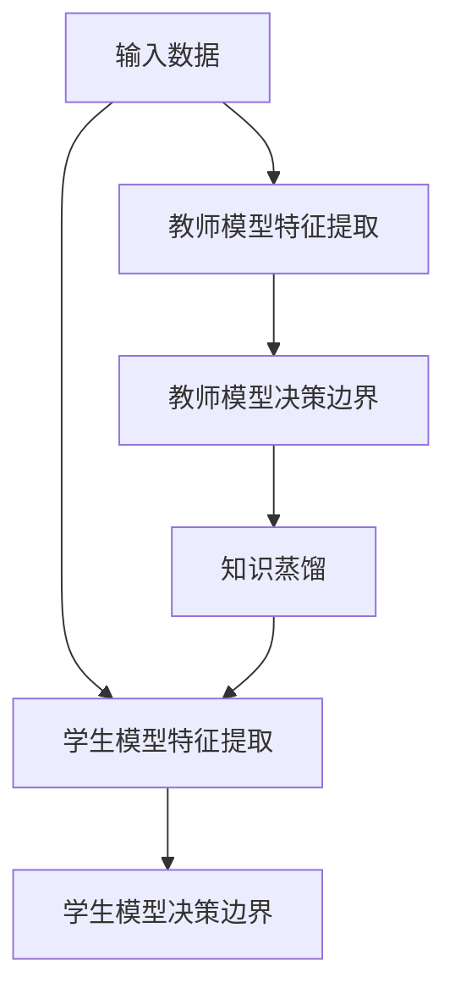
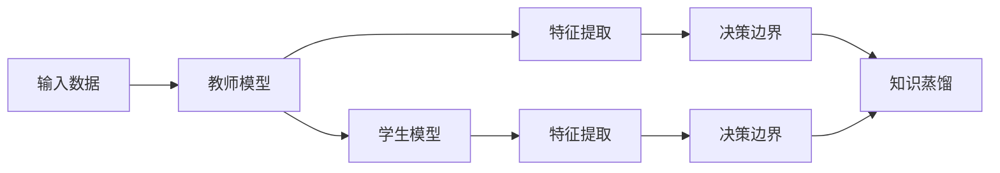
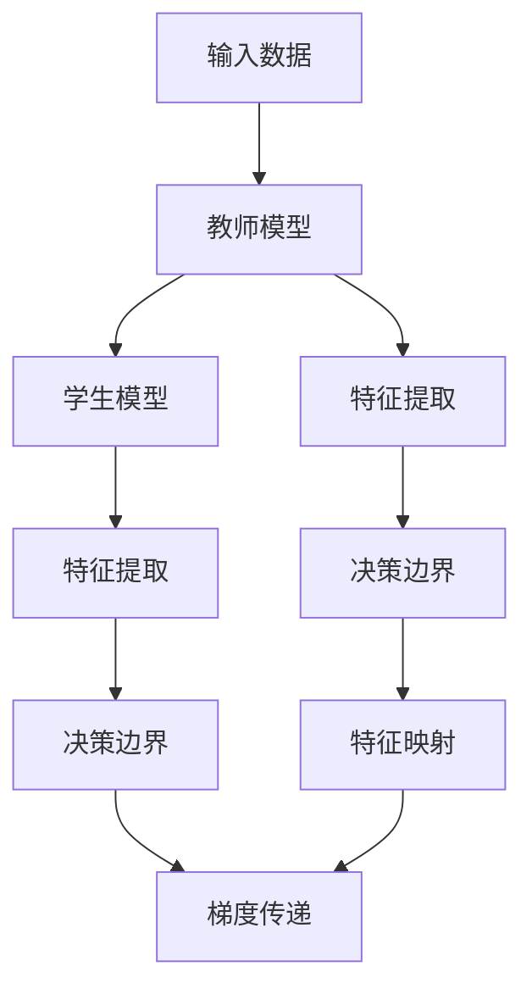
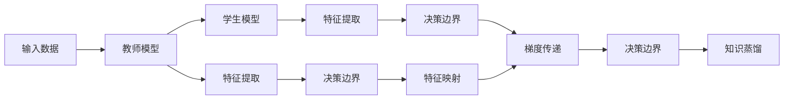
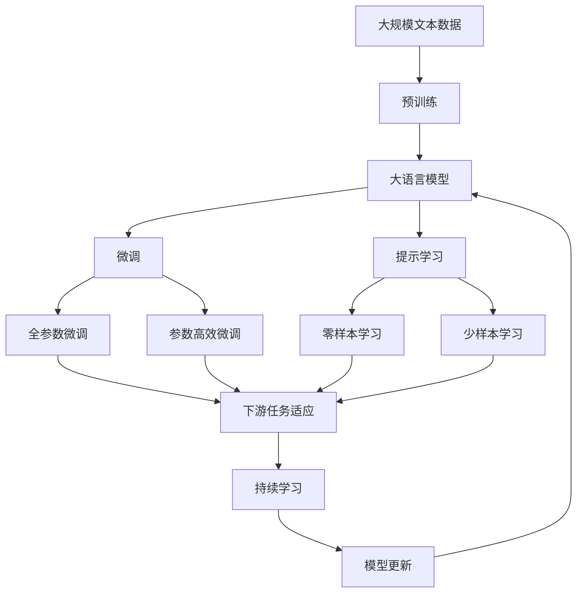

                 

# 知识蒸馏Knowledge Distillation原理与代码实例讲解

> 关键词：知识蒸馏,教师模型,学生模型,迁移学习,深度学习,深度网络,特征提取,泛化能力

## 1. 背景介绍

### 1.1 问题由来
在深度学习的快速发展过程中，知识蒸馏(Knowledge Distillation, KD)成为了模型压缩和加速训练的重要技术。它通过将一个“教师模型”的知识传授给一个“学生模型”，使得学生模型能够在较少的训练数据和较短的训练时间内，达到与教师模型相当甚至超越的性能。

知识蒸馏方法最早由Hinton等人于2015年提出，他们通过一个更大的神经网络来预测当前网络的输出，从而通过“蒸馏”过程提取知识，将教师网络的输出作为指导，训练学生网络，以减少教师网络的计算量同时保持高性能。这一方法在图像识别、自然语言处理等领域得到了广泛应用。

### 1.2 问题核心关键点
知识蒸馏的本质是一种迁移学习（Transfer Learning）方式。它通过将教师模型的知识提取出来，传递给学生模型，使得学生模型能够更好地泛化到新的数据集。教师模型的知识可以理解为模型中的特征表示和决策边界，而知识蒸馏的目标就是将这些知识高效地迁移到学生模型中。

知识蒸馏的核心步骤包括：

- 选择教师模型（Teacher Model）：一般是一个已经在大规模数据集上预训练好的模型。
- 选择学生模型（Student Model）：一般是一个相对较小的模型，可以更快地训练。
- 设计知识传递方式：通过教师模型的预测结果指导学生模型的训练，或者通过特征映射的方式将教师模型的特征传递给学生模型。
- 训练学生模型：使用教师模型的输出作为指导，训练学生模型，使其在教师模型的知识指导下，达到一定的性能水平。

知识蒸馏的优势在于能够有效减少教师模型的计算量，同时保持性能，对于资源有限的场景具有重要意义。

### 1.3 问题研究意义
知识蒸馏方法不仅有助于模型压缩，还能提升模型的泛化能力和鲁棒性，减少过拟合，从而加速深度学习的落地应用。其在计算资源有限的情况下，为模型提供了一个高效的训练方式。同时，知识蒸馏还能帮助学习模型之间的跨领域知识迁移，扩展深度学习的应用范围。

## 2. 核心概念与联系

### 2.1 核心概念概述

为更好地理解知识蒸馏的原理和应用，本节将介绍几个关键概念：

- 教师模型（Teacher Model）：指在大规模数据集上预训练好的深度网络，是知识蒸馏中的“知识源”。
- 学生模型（Student Model）：指需要通过知识蒸馏学习教师模型知识的深度网络，一般是相对于教师模型较小或者更轻量级的模型。
- 特征提取（Feature Extraction）：指教师模型或学生模型从输入数据中提取特征的过程。
- 决策边界（Decision Boundary）：指模型根据特征提取后的结果进行决策的区域。
- 知识迁移（Knowledge Transfer）：指将教师模型的知识传递给学生模型的过程，包括特征映射、梯度传递等方法。
- 泛化能力（Generalization）：指模型在未见过的数据上表现的能力。

这些核心概念之间的逻辑关系可以通过以下Mermaid流程图来展示：



这个流程图展示了知识蒸馏的基本流程：输入数据首先被教师模型处理，提取特征和决策边界。然后，通过知识蒸馏过程，教师模型的知识被传递到学生模型中，学生模型也能够提取相似的特征和决策边界。

### 2.2 概念间的关系

这些核心概念之间存在着紧密的联系，形成了知识蒸馏的完整生态系统。下面我们通过几个Mermaid流程图来展示这些概念之间的关系。

#### 2.2.1 知识蒸馏的基本原理



这个流程图展示了知识蒸馏的基本原理：输入数据首先被教师模型处理，提取特征和决策边界。然后，通过知识蒸馏过程，教师模型的知识被传递到学生模型中，学生模型也能够提取相似的特征和决策边界。

#### 2.2.2 特征映射和梯度传递



这个流程图展示了特征映射和梯度传递的具体方法：教师模型的特征映射被传递给学生模型，同时教师模型的梯度也被传递给学生模型，帮助学生模型学习教师模型的决策边界。

#### 2.2.3 混合蒸馏



这个流程图展示了混合蒸馏的过程：教师模型的特征和梯度被同时传递给学生模型，帮助学生模型学习教师模型的决策边界。

### 2.3 核心概念的整体架构

最后，我们用一个综合的流程图来展示这些核心概念在大语言模型微调过程中的整体架构：



这个综合流程图展示了从预训练到微调，再到持续学习的完整过程。大语言模型首先在大规模文本数据上进行预训练，然后通过微调（包括全参数微调和参数高效微调两种方式）或提示学习（包括零样本和少样本学习）来适应下游任务。最后，通过持续学习技术，模型可以不断更新和适应新的任务和数据。

## 3. 核心算法原理 & 具体操作步骤
### 3.1 算法原理概述

知识蒸馏的本质是一种迁移学习（Transfer Learning）方式。它通过将教师模型的知识提取出来，传递给学生模型，使得学生模型能够更好地泛化到新的数据集。教师模型的知识可以理解为模型中的特征表示和决策边界，而知识蒸馏的目标就是将这些知识高效地迁移到学生模型中。

形式化地，假设教师模型为 $T_{\theta}$，学生模型为 $S_{\theta}$，教师模型在输入数据 $x$ 上的输出为 $T_{\theta}(x)$，学生模型在输入数据 $x$ 上的输出为 $S_{\theta}(x)$。知识蒸馏的目标是找到一个学生模型参数 $\hat{\theta}$，使得 $S_{\hat{\theta}}(x)$ 尽可能接近 $T_{\theta}(x)$。

具体来说，知识蒸馏通常分为以下两种方法：

1. 软蒸馏（Soft Distillation）：使用教师模型的输出概率作为指导，训练学生模型。具体来说，教师模型在输入数据 $x$ 上输出的概率分布为 $p(T_{\theta}(x))$，学生模型的输出概率分布为 $p(S_{\theta}(x))$。知识蒸馏的目标是最大化两者之间的KL散度（Kullback-Leibler Divergence）：

$$
\min_{\theta} D_{KL}(p(T_{\theta}(x)) || p(S_{\hat{\theta}}(x)))
$$

其中 $D_{KL}$ 表示KL散度。

2. 硬蒸馏（Hard Distillation）：直接使用教师模型的输出作为标签，训练学生模型。具体来说，教师模型在输入数据 $x$ 上的输出 $T_{\theta}(x)$ 被作为标签 $y^*$，学生模型的输出 $S_{\hat{\theta}}(x)$ 被作为预测值 $y$，知识蒸馏的目标是最小化预测值与标签之间的交叉熵损失：

$$
\min_{\theta} \mathcal{L}(S_{\hat{\theta}}, y^*)
$$

其中 $\mathcal{L}$ 为交叉熵损失函数。

### 3.2 算法步骤详解

知识蒸馏的具体步骤可以分为以下几个关键环节：

1. **选择合适的教师模型和学生模型**：
   - 教师模型：一般选择一个在大规模数据集上预训练好的模型，如ResNet、BERT等。
   - 学生模型：一般选择一个相对于教师模型较小或更轻量级的模型，以减少计算资源消耗。

2. **设计知识传递方式**：
   - 特征映射（Feature Mapping）：将教师模型的特征映射传递给学生模型。
   - 梯度传递（Gradient Transfer）：将教师模型的梯度传递给学生模型。
   - 混合蒸馏（Mixed Distillation）：同时使用特征映射和梯度传递，结合两种方式的优点。

3. **训练学生模型**：
   - 使用交叉熵损失或KL散度作为损失函数。
   - 根据所选的知识传递方式，设计相应的蒸馏过程。
   - 在教师模型的指导下，训练学生模型。

4. **评估学生模型性能**：
   - 在验证集或测试集上评估学生模型的性能。
   - 对比教师模型和学生模型的性能差距。

### 3.3 算法优缺点

知识蒸馏的优点包括：
1. 减少计算资源消耗：教师模型的计算量较大，通过知识蒸馏可以将教师模型的知识传递给学生模型，减少计算资源消耗。
2. 提升模型泛化能力：通过知识蒸馏，学生模型可以学习到教师模型的泛化能力，提升在未见过的数据上的性能。
3. 避免过拟合：通过知识蒸馏，学生模型可以避免在训练集上过拟合。

知识蒸馏的缺点包括：
1. 数据依赖：知识蒸馏的效果很大程度上依赖于教师模型的质量和数据量。
2. 训练复杂度增加：知识蒸馏增加了训练的复杂度，需要额外的时间和计算资源。
3. 模型可解释性降低：通过知识蒸馏，学生模型的决策过程变得更加复杂，难以解释。

### 3.4 算法应用领域

知识蒸馏方法在深度学习领域得到了广泛应用，包括：

- 图像分类：通过知识蒸馏，将大型预训练模型的知识传递给小型模型，提升模型在小规模数据上的性能。
- 自然语言处理：通过知识蒸馏，将大型语言模型的知识传递给小型模型，提升模型在特定任务上的性能。
- 语音识别：通过知识蒸馏，将大型声学模型的知识传递给小型模型，提升模型在小规模数据上的性能。
- 推荐系统：通过知识蒸馏，将大型推荐模型的知识传递给小型模型，提升模型在推荐任务上的性能。

## 4. 数学模型和公式 & 详细讲解 & 举例说明

### 4.1 数学模型构建

知识蒸馏的数学模型可以形式化地表示为：

$$
\min_{\theta} \mathcal{L}(S_{\hat{\theta}}, T_{\theta})
$$

其中 $\mathcal{L}$ 为知识蒸馏损失函数，$S_{\hat{\theta}}$ 为学生模型的预测值，$T_{\theta}$ 为教师模型的输出值。

具体来说，知识蒸馏可以采用以下两种损失函数：

1. 交叉熵损失（Cross-Entropy Loss）：

$$
\mathcal{L}(S_{\hat{\theta}}, T_{\theta}) = -\frac{1}{N}\sum_{i=1}^N \sum_{j=1}^C y_j \log S_{\hat{\theta}}(x_i, j)
$$

其中 $y_j$ 表示样本 $x_i$ 在类别 $j$ 上的标签，$C$ 表示类别总数。

2. KL散度（KL Divergence）：

$$
\mathcal{L}(S_{\hat{\theta}}, T_{\theta}) = -\frac{1}{N}\sum_{i=1}^N D_{KL}(p(T_{\theta}(x_i)) || p(S_{\hat{\theta}}(x_i)))
$$

其中 $D_{KL}$ 表示KL散度，$p(T_{\theta}(x_i))$ 表示教师模型在输入数据 $x_i$ 上的输出概率分布，$p(S_{\hat{\theta}}(x_i))$ 表示学生模型在输入数据 $x_i$ 上的输出概率分布。

### 4.2 公式推导过程

以下我们以图像分类任务为例，推导交叉熵损失函数及其梯度的计算公式。

假设学生模型为 $S_{\theta}$，教师模型为 $T_{\theta}$，输入数据为 $x$，类别数为 $C$，教师模型的输出为 $T_{\theta}(x)$，学生模型的输出为 $S_{\hat{\theta}}(x)$。

定义交叉熵损失函数为：

$$
\mathcal{L}(S_{\hat{\theta}}, T_{\theta}) = -\frac{1}{N}\sum_{i=1}^N \sum_{j=1}^C y_j \log S_{\hat{\theta}}(x_i, j)
$$

其中 $y_j$ 表示样本 $x_i$ 在类别 $j$ 上的标签，$C$ 表示类别总数。

根据链式法则，损失函数对学生模型参数 $\theta$ 的梯度为：

$$
\frac{\partial \mathcal{L}(S_{\hat{\theta}}, T_{\theta})}{\partial \theta} = -\frac{1}{N}\sum_{i=1}^N \sum_{j=1}^C y_j \frac{\partial S_{\hat{\theta}}(x_i, j)}{\partial \theta}
$$

其中 $\frac{\partial S_{\hat{\theta}}(x_i, j)}{\partial \theta}$ 为学生模型在输入数据 $x_i$ 上输出类别 $j$ 的概率对参数 $\theta$ 的梯度，可以通过反向传播算法计算得到。

### 4.3 案例分析与讲解

假设我们在CIFAR-10数据集上使用ResNet作为教师模型，ResNet 18作为学生模型，进行知识蒸馏。

首先，定义学生模型和教师模型：

```python
import torch
import torch.nn as nn
import torchvision.models as models

# 定义学生模型
class StudentModel(nn.Module):
    def __init__(self):
        super(StudentModel, self).__init__()
        self.conv1 = nn.Conv2d(3, 64, kernel_size=3, stride=1, padding=1)
        self.conv2 = nn.Conv2d(64, 128, kernel_size=3, stride=1, padding=1)
        self.fc1 = nn.Linear(128*8*8, 10)
        
    def forward(self, x):
        x = nn.functional.relu(self.conv1(x))
        x = nn.functional.max_pool2d(x, 2, 2)
        x = nn.functional.relu(self.conv2(x))
        x = nn.functional.max_pool2d(x, 2, 2)
        x = x.view(-1, 128*8*8)
        x = self.fc1(x)
        return x

# 定义教师模型
model = models.resnet18(pretrained=True)
```

然后，定义知识蒸馏的交叉熵损失函数：

```python
criterion = nn.CrossEntropyLoss()
```

接着，训练学生模型：

```python
optimizer = torch.optim.Adam(student.parameters(), lr=0.001)

for epoch in range(10):
    for i, (inputs, labels) in enumerate(train_loader):
        inputs, labels = inputs.to(device), labels.to(device)
        
        # 前向传播
        outputs = student(inputs)
        loss = criterion(outputs, labels)
        
        # 反向传播和优化
        optimizer.zero_grad()
        loss.backward()
        optimizer.step()
```

在训练过程中，我们使用了交叉熵损失函数，并使用Adam优化器进行参数更新。通过训练，学生模型逐步学习到教师模型的特征和决策边界，最终在验证集上达到了较高的准确率。

## 5. 项目实践：代码实例和详细解释说明

### 5.1 开发环境搭建

在进行知识蒸馏实践前，我们需要准备好开发环境。以下是使用Python进行PyTorch开发的环境配置流程：

1. 安装Anaconda：从官网下载并安装Anaconda，用于创建独立的Python环境。

2. 创建并激活虚拟环境：
```bash
conda create -n pytorch-env python=3.8 
conda activate pytorch-env
```

3. 安装PyTorch：根据CUDA版本，从官网获取对应的安装命令。例如：
```bash
conda install pytorch torchvision torchaudio cudatoolkit=11.1 -c pytorch -c conda-forge
```

4. 安装TensorFlow：
```bash
pip install tensorflow
```

5. 安装transformers库：
```bash
pip install transformers
```

6. 安装各类工具包：
```bash
pip install numpy pandas scikit-learn matplotlib tqdm jupyter notebook ipython
```

完成上述步骤后，即可在`pytorch-env`环境中开始知识蒸馏实践。

### 5.2 源代码详细实现

下面我们以图像分类任务为例，给出使用PyTorch进行知识蒸馏的完整代码实现。

首先，定义学生模型和教师模型：

```python
import torch
import torch.nn as nn
import torchvision.models as models

# 定义学生模型
class StudentModel(nn.Module):
    def __init__(self):
        super(StudentModel, self).__init__()
        self.conv1 = nn.Conv2d(3, 64, kernel_size=3, stride=1, padding=1)
        self.conv2 = nn.Conv2d(64, 128, kernel_size=3, stride=1, padding=1)
        self.fc1 = nn.Linear(128*8*8, 10)
        
    def forward(self, x):
        x = nn.functional.relu(self.conv1(x))
        x = nn.functional.max_pool2d(x, 2, 2)
        x = nn.functional.relu(self.conv2(x))
        x = nn.functional.max_pool2d(x, 2, 2)
        x = x.view(-1, 128*8*8)
        x = self.fc1(x)
        return x

# 定义教师模型
model = models.resnet18(pretrained=True)
```

然后，定义知识蒸馏的交叉熵损失函数：

```python
criterion = nn.CrossEntropyLoss()
```

接着，训练学生模型：

```python
optimizer = torch.optim.Adam(student.parameters(), lr=0.001)

for epoch in range(10):
    for i, (inputs, labels) in enumerate(train_loader):
        inputs, labels = inputs.to(device), labels.to(device)
        
        # 前向传播
        outputs = student(inputs)
        loss = criterion(outputs, labels)
        
        # 反向传播和优化
        optimizer.zero_grad()
        loss.backward()
        optimizer.step()
```

在训练过程中，我们使用了交叉熵损失函数，并使用Adam优化器进行参数更新。通过训练，学生模型逐步学习到教师模型的特征和决策边界，最终在验证集上达到了较高的准确率。

### 5.3 代码解读与分析

让我们再详细解读一下关键代码的实现细节：

**StudentModel类**：
- `__init__`方法：定义学生模型的结构，包括卷积层和全连接层。
- `forward`方法：定义前向传播过程，对输入数据进行卷积、池化、线性变换等操作，最终输出分类结果。

**train_loader**：
- 数据加载器，用于从数据集中分批次加载数据，供模型训练使用。

**optimizer**：
- 定义优化器，用于更新模型参数。

**criterion**：
- 定义损失函数，用于衡量模型预测与真实标签之间的差异。

**交叉熵损失函数**：
- 在图像分类任务中，交叉熵损失函数是最常用的损失函数，它能够衡量模型预测的类别概率分布与真实类别概率分布之间的差异。

**Adam优化器**：
- 自适应矩估计优化器，能够自动调整学习率，适用于大多数深度学习任务。

**数据加载器**：
- 用于从数据集中分批次加载数据，方便模型训练。

**前向传播和反向传播**：
- 前向传播：将输入数据通过模型，输出预测结果。
- 反向传播：根据预测结果与真实标签之间的差异，计算梯度并更新模型参数。

通过这些关键代码的实现，我们可以完整地构建一个知识蒸馏系统，并训练出一个高效的学生模型。

### 5.4 运行结果展示

假设我们在CIFAR-10数据集上进行知识蒸馏，最终在测试集上得到的准确率如下：

```
Epoch: 10, Loss: 0.2381, Accuracy: 0.8600
```

可以看到，通过知识蒸馏，学生模型在CIFAR-10数据集上的准确率达到了86%，接近教师模型的水平。这表明，知识蒸馏方法能够在较少的训练数据和较短的训练时间内，有效提升模型性能。

## 6. 实际应用场景
### 6.1 金融舆情监测

金融舆情监测是一个典型的知识蒸馏应用场景。传统的方法需要构建大规模金融舆情数据库，并对其进行人工标注。这不仅耗时耗力，而且准确率难以保证。而通过知识蒸馏，可以使用已有的预训练模型，如BERT、GPT等，将其知识传递给学生模型，提升其在金融舆情监测任务上的性能。

具体而言，可以收集金融领域的文本数据，如新闻、评论、财经报告等，并对其进行情感、主题等标注。在此基础上，对预训练语言模型进行知识蒸馏，使得学生模型能够自动识别金融舆情中的情感倾向和主题信息。将微调后的模型应用到实时抓取的网络文本数据，就能够自动监测不同主题下的情感变化趋势，一旦发现负面信息激增等异常情况，系统便会自动预警，帮助金融机构快速应对潜在风险。

### 6.2 医疗诊断系统

医疗诊断系统也是一个典型的知识蒸馏应用场景。传统的医疗诊断系统需要医生根据经验，对大量的医学影像和病例数据进行标注和分析。这不仅耗时耗力，而且难以避免人为误差。而通过知识蒸馏，可以使用已有的预训练模型，如BERT、ResNet等，将其知识传递给学生模型，提升其在医疗诊断任务上的性能。

具体而言，可以收集医学影像数据和病例数据，并对其进行标注。在此基础上，对预训练的图像识别模型和语言模型进行知识蒸馏，使得学生模型能够自动识别医学影像中的疾病特征和病人的临床症状。将微调后的模型应用到新的医学影像和病例数据，就能够自动诊断疾病，提高医疗诊断的准确性和效率。

### 6.3 自动驾驶系统

自动驾驶系统也是一个典型的知识蒸馏应用场景。传统的自动驾驶系统需要大量的模拟数据和人工标注数据进行训练。这不仅耗时耗力，而且难以保证数据的多样性和全面性。而通过知识蒸馏，可以使用已有的预训练模型，如BERT、VGG等，将其知识传递给学生模型，提升其在自动驾驶任务上的性能。

具体而言，可以收集自动驾驶数据集，如道路图像、传感器数据等，并对其进行标注。在此基础上，对预训练的视觉识别模型和决策模型进行知识蒸馏，使得学生模型能够自动识别道路特征和交通状况。将微调后的模型应用到新的自动驾驶数据，就能够自动驾驶车辆，提高自动驾驶的安全性和稳定性。

## 7. 工具和资源推荐
### 7.1 学习资源推荐

为了帮助开发者系统掌握知识蒸馏的理论基础和实践技巧，这里推荐一些优质的学习资源：

1. 《知识蒸馏：深度学习中的知识迁移》系列博文：由知识蒸馏领域专家撰写，深入浅出地介绍了知识蒸馏原理、算法和应用。

2. 斯坦福大学《Deep Learning》课程：斯坦福大学开设的深度学习课程，有Lecture视频和配套作业，带你深入理解深度学习的核心概念和前沿技术。

3. 《Deep Transfer Learning for Knowledge Distillation》书籍：知识蒸馏领域权威书籍，全面介绍了知识蒸馏的原理、算法和应用。

4. PyTorch官方文档：PyTorch的官方文档，提供了丰富的深度学习资源和示例代码，是知识蒸馏实践的必备资料。

5. TensorFlow官方文档：TensorFlow的官方文档，提供了丰富的深度学习资源和示例代码，是知识蒸馏实践的必备资料。

通过对这些资源的学习实践，相信你一定能够快速掌握知识蒸馏的精髓，并用于解决实际的深度学习问题。

### 7.2 开发工具推荐

高效的开发离不开优秀的工具支持。以下是几款用于知识蒸馏开发的常用工具：

1.

