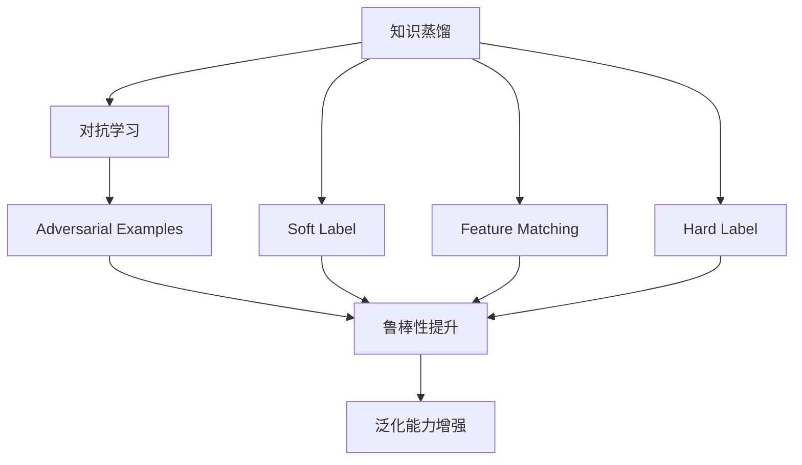
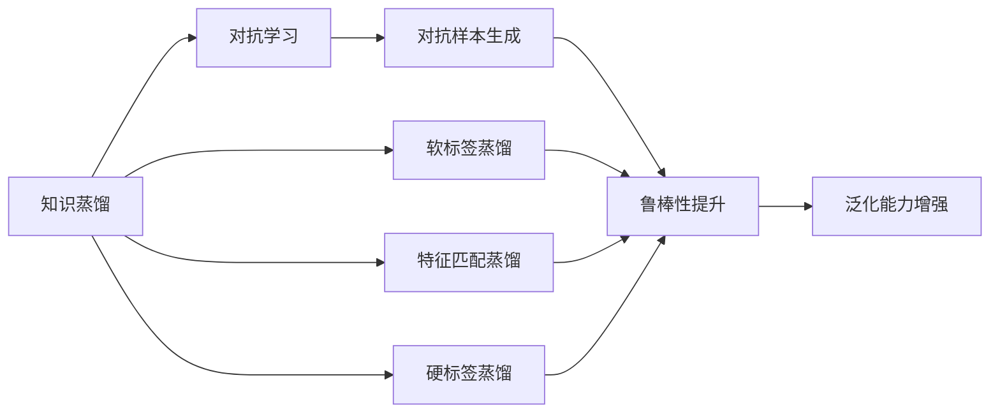
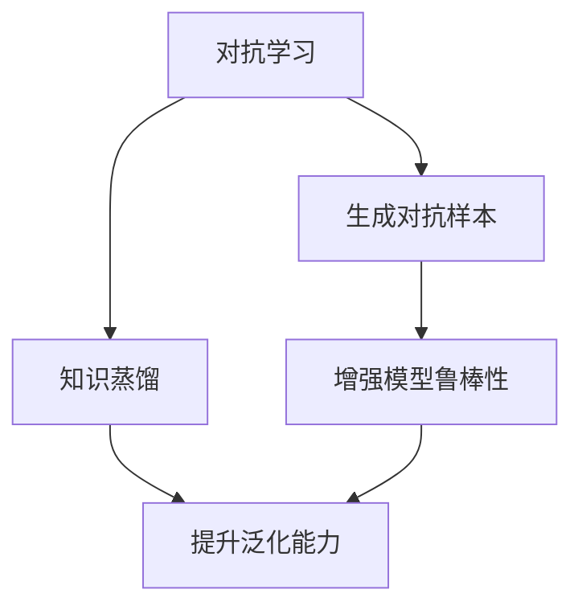
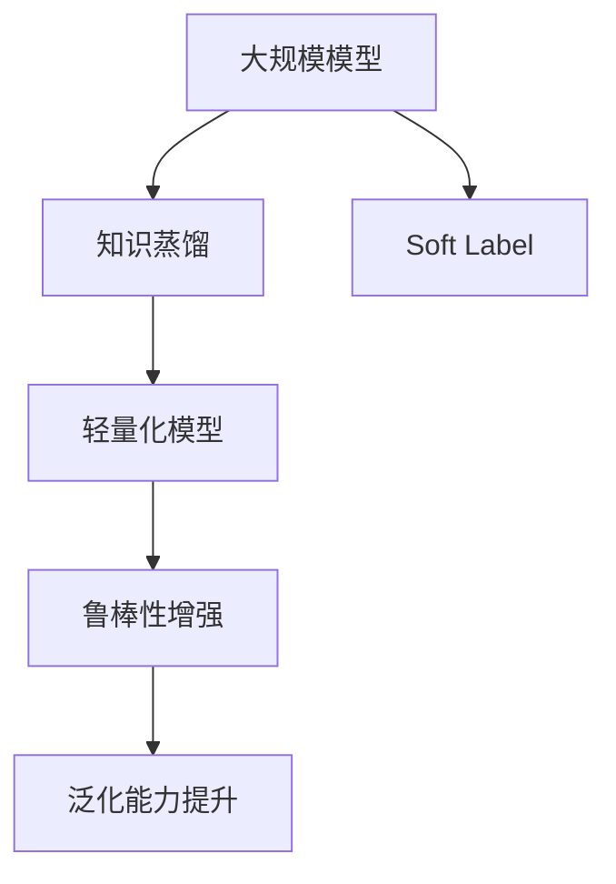
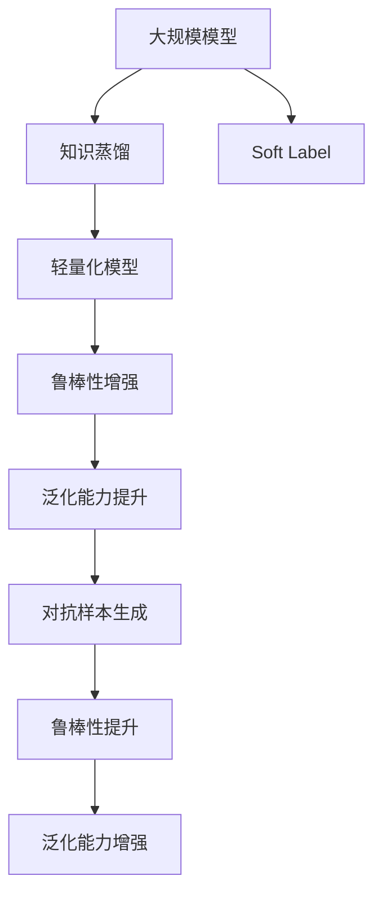

                 

## 1. 背景介绍

在深度学习领域，知识蒸馏（Knowledge Distillation, KD）是一种经典的技术，它通过将复杂模型的知识转移到轻量化模型中，以提升后者的性能和泛化能力。知识蒸馏在模型压缩、加速推理、降低成本等方面展现了广泛的应用价值。然而，随着对抗学习（Adversarial Learning）技术的兴起，传统的知识蒸馏方法面临新的挑战和机遇。对抗学习是一种通过生成对抗样本（Adversarial Examples）来训练模型的技术，可以有效提升模型的鲁棒性和泛化能力，但在提升知识表示的丰富性和准确性方面存在局限。本文将探讨知识蒸馏和对抗学习相结合，通过改进的知识蒸馏方法来提升模型的鲁棒性，并验证其在实际应用中的有效性。

### 1.1 问题由来

对抗学习（Adversarial Learning）技术自2014年提出以来，便迅速在深度学习领域获得了广泛关注。其核心思想是通过生成对抗样本（Adversarial Examples）来训练模型，使得模型能够在噪声干扰下保持稳定和鲁棒性。传统的知识蒸馏方法主要通过软标签（Soft Labels）、特征匹配（Feature Matching）等手段，将教师模型（Teacher Model）的知识转移到学生模型（Student Model）中。然而，对抗学习引入的噪声和不确定性，使得传统的知识蒸馏方法难以有效适应。如何改进知识蒸馏方法，使其能够更好地兼容对抗学习，是一个亟待解决的问题。

### 1.2 问题核心关键点

本文的核心问题是：如何改进知识蒸馏方法，使其能够在对抗学习中发挥更好的作用，从而提升模型的鲁棒性和泛化能力？

### 1.3 问题研究意义

改进的知识蒸馏方法在对抗学习中的应用，对于提升深度学习模型的鲁棒性、泛化能力和应用范围，具有重要的意义：

1. **提升鲁棒性**：通过引入对抗样本，知识蒸馏方法可以有效提升模型对噪声和攻击的抵抗能力，避免模型在对抗学习过程中退化。
2. **增强泛化能力**：对抗样本训练使得模型学习到更加鲁棒的特征表示，能够更好地泛化到未见过的数据和场景。
3. **降低成本**：轻量化模型通过知识蒸馏技术，可以减少计算资源和内存占用，加速推理速度，降低应用成本。
4. **促进技术创新**：知识蒸馏和对抗学习的结合，为深度学习技术带来了新的研究方向和应用场景，推动了深度学习研究的进步。

## 2. 核心概念与联系

### 2.1 核心概念概述

为更好地理解知识蒸馏在对抗学习中的应用，本节将介绍几个密切相关的核心概念：

- **知识蒸馏（Knowledge Distillation, KD）**：通过将复杂模型的知识转移到轻量化模型中，提升后者的性能和泛化能力。常见的蒸馏方式包括soft-label蒸馏、feature distillation、hard-label蒸馏等。
- **对抗学习（Adversarial Learning）**：通过生成对抗样本来训练模型，增强模型的鲁棒性和泛化能力。常见的对抗方法包括Fast Gradient Sign Method (FGSM)、PGD（Projected Gradient Descent）等。
- **对抗样本（Adversarial Examples）**：通过特定扰动生成的，能够导致模型错误分类的样本。对抗样本训练是提升模型鲁棒性的重要手段。
- **鲁棒性（Robustness）**：模型在对抗样本攻击下保持正确性的能力。
- **泛化能力（Generalization）**：模型在新数据和未见过的场景中的表现能力。

这些核心概念之间的逻辑关系可以通过以下Mermaid流程图来展示：



这个流程图展示了知识蒸馏和对抗学习的基本关系，以及它们对鲁棒性和泛化能力的影响。

### 2.2 概念间的关系

这些核心概念之间存在着紧密的联系，形成了知识蒸馏和对抗学习的完整生态系统。下面我们通过几个Mermaid流程图来展示这些概念之间的关系。

#### 2.2.1 知识蒸馏与对抗学习的交互



这个流程图展示了知识蒸馏在对抗学习中的应用过程，通过对抗样本生成和特征匹配蒸馏，提升模型的鲁棒性和泛化能力。

#### 2.2.2 对抗学习对知识蒸馏的影响



这个流程图展示了对抗学习对知识蒸馏的影响，对抗样本生成和特征匹配蒸馏，使得模型能够更好地泛化到未见过的数据和场景。

#### 2.2.3 知识蒸馏在对抗学习中的应用场景



这个流程图展示了知识蒸馏在对抗学习中的应用场景，通过将复杂模型的知识转移到轻量化模型中，提升后者的鲁棒性和泛化能力。

### 2.3 核心概念的整体架构

最后，我们用一个综合的流程图来展示这些核心概念在大语言模型微调过程中的整体架构：



这个综合流程图展示了从大规模模型到轻量化模型的蒸馏过程，以及对抗样本对鲁棒性和泛化能力的影响。通过这些流程图，我们可以更清晰地理解知识蒸馏和对抗学习的基本关系和应用场景。

## 3. 核心算法原理 & 具体操作步骤

### 3.1 算法原理概述

知识蒸馏在对抗学习中的应用，本质上是将知识蒸馏过程与对抗样本生成过程相结合，以提升模型的鲁棒性和泛化能力。其核心思想是：

1. **生成对抗样本**：通过对抗样本生成算法，如FGSM、PGD等，生成对抗样本，增强模型的鲁棒性。
2. **知识蒸馏**：将复杂模型的知识（特征、权重等）转移到轻量化模型中，提升后者的性能和泛化能力。
3. **模型融合**：将蒸馏后的轻量化模型与原始模型（复杂模型）进行融合，形成具有更高鲁棒性和泛化能力的集成模型。

### 3.2 算法步骤详解

基于上述思想，本文提出了一种改进的知识蒸馏方法，具体步骤如下：

#### 步骤1：对抗样本生成

采用常见的对抗样本生成算法，如FGSM、PGD等，对复杂模型进行对抗样本训练。具体步骤如下：

1. **选择对抗样本生成算法**：选择合适的对抗样本生成算法，如FGSM、PGD等。
2. **生成对抗样本**：通过对抗样本生成算法，生成对抗样本。
3. **更新模型参数**：使用对抗样本对模型进行反向传播，更新模型参数。

#### 步骤2：知识蒸馏

采用传统的知识蒸馏方法，如soft-label蒸馏、feature distillation等，将复杂模型的知识转移到轻量化模型中。具体步骤如下：

1. **选择合适的蒸馏方式**：选择合适的蒸馏方式，如soft-label蒸馏、feature distillation等。
2. **设计蒸馏损失函数**：根据选择的蒸馏方式，设计相应的蒸馏损失函数。
3. **更新学生模型参数**：使用蒸馏损失函数，更新学生模型参数。

#### 步骤3：模型融合

将学生模型和原始模型进行融合，形成具有更高鲁棒性和泛化能力的集成模型。具体步骤如下：

1. **选择合适的融合方式**：选择合适的融合方式，如模型加权、特征加权等。
2. **设计融合损失函数**：根据选择的融合方式，设计相应的融合损失函数。
3. **更新集成模型参数**：使用融合损失函数，更新集成模型参数。

### 3.3 算法优缺点

改进的知识蒸馏方法在对抗学习中的应用，具有以下优点：

1. **提升鲁棒性**：通过对抗样本训练，模型能够更好地抵抗噪声和攻击，提升鲁棒性。
2. **增强泛化能力**：对抗样本训练使得模型学习到更加鲁棒的特征表示，能够更好地泛化到未见过的数据和场景。
3. **降低成本**：轻量化模型通过知识蒸馏技术，可以减少计算资源和内存占用，加速推理速度，降低应用成本。

同时，该方法也存在以下缺点：

1. **生成对抗样本困难**：对抗样本生成算法复杂，生成过程耗时较长，且对抗样本的质量和多样性对模型性能影响较大。
2. **蒸馏过程复杂**：知识蒸馏过程需要设计合适的蒸馏方式和损失函数，且不同的蒸馏方式可能带来不同的效果。
3. **模型融合困难**：集成模型需要选择合适的融合方式和损失函数，且融合过程可能会增加模型的复杂度和计算量。

### 3.4 算法应用领域

改进的知识蒸馏方法在对抗学习中的应用，主要应用于以下几个领域：

1. **图像分类**：在图像分类任务中，通过对抗样本生成和特征匹配蒸馏，提升模型的鲁棒性和泛化能力。
2. **目标检测**：在目标检测任务中，通过对抗样本生成和soft-label蒸馏，提升模型的鲁棒性和定位准确性。
3. **自然语言处理**：在自然语言处理任务中，通过对抗样本生成和特征匹配蒸馏，提升模型的鲁棒性和语言理解能力。
4. **语音识别**：在语音识别任务中，通过对抗样本生成和soft-label蒸馏，提升模型的鲁棒性和语音识别准确性。

## 4. 数学模型和公式 & 详细讲解 & 举例说明

### 4.1 数学模型构建

假设复杂模型为 $T_{\theta_T}$，轻量化模型为 $S_{\theta_S}$，对抗样本为 $\mathcal{X}_{adv}$。在知识蒸馏和对抗学习中，通过以下步骤实现模型的鲁棒性和泛化能力的提升：

1. **生成对抗样本**：
   $$
   \mathcal{X}_{adv} = \mathcal{X} + \epsilon\delta
   $$
   其中 $\epsilon$ 为扰动量，$\delta$ 为对抗样本的方向。

2. **知识蒸馏**：
   $$
   \mathcal{L}_{distill} = \frac{1}{N}\sum_{i=1}^N \ell(T_{\theta_T}(x_i), S_{\theta_S}(x_i))
   $$
   其中 $\ell$ 为蒸馏损失函数，$x_i$ 为输入数据。

3. **模型融合**：
   $$
   \mathcal{L}_{fusion} = \frac{1}{N}\sum_{i=1}^N \ell(T_{\theta_T}(x_i), S_{\theta_S}(x_i)) + \frac{1}{N}\sum_{i=1}^N \ell(S_{\theta_S}(x_i), S_{\theta_S}(x_i))
   $$
   其中第二项为学生模型的自蒸馏损失函数，用于提高学生模型的鲁棒性。

### 4.2 公式推导过程

以下我们以二分类任务为例，推导改进的知识蒸馏方法的具体公式。

1. **生成对抗样本**：
   $$
   \mathcal{X}_{adv} = \mathcal{X} + \epsilon\delta
   $$
   其中 $\delta$ 为对抗样本的方向，可以通过求解 $\mathcal{L}_{adv}$ 的最小化来计算，如FGSM、PGD等。

2. **知识蒸馏**：
   假设 $T_{\theta_T}$ 和 $S_{\theta_S}$ 分别为复杂模型和轻量化模型，对于二分类任务，蒸馏损失函数 $\ell$ 可以定义为：
   $$
   \ell(T_{\theta_T}(x_i), S_{\theta_S}(x_i)) = -y_i\log(S_{\theta_S}(x_i)) - (1-y_i)\log(1-S_{\theta_S}(x_i))
   $$
   其中 $y_i$ 为标签。

3. **模型融合**：
   假设 $\alpha$ 为集成模型中两个模型的权重，则融合损失函数 $\mathcal{L}_{fusion}$ 可以定义为：
   $$
   \mathcal{L}_{fusion} = \alpha\mathcal{L}_{distill} + (1-\alpha)\mathcal{L}_{fusion_self}
   $$
   其中 $\mathcal{L}_{fusion_self}$ 为学生模型的自蒸馏损失函数，可以定义为：
   $$
   \mathcal{L}_{fusion_self} = -y_i\log(S_{\theta_S}(x_i))
   $$

### 4.3 案例分析与讲解

以二分类任务为例，分析改进的知识蒸馏方法的具体应用。

1. **生成对抗样本**：
   假设使用FGSM生成对抗样本，具体步骤如下：
   $$
   \delta = \alpha \frac{\partial \ell(T_{\theta_T}(x_i), y_i)}{\partial x_i}
   $$
   其中 $\alpha$ 为扰动强度，$\partial \ell/\partial x_i$ 为模型对输入的梯度。

2. **知识蒸馏**：
   假设使用soft-label蒸馏，具体步骤如下：
   $$
   \mathcal{L}_{distill} = -y_i\log(T_{\theta_T}(x_i)) + (1-y_i)\log(1-T_{\theta_T}(x_i))
   $$
   其中 $T_{\theta_T}(x_i)$ 为复杂模型的输出。

3. **模型融合**：
   假设使用模型加权，具体步骤如下：
   $$
   S_{\theta_S}(x_i) = \alpha T_{\theta_T}(x_i) + (1-\alpha) S_{\theta_S}(x_i)
   $$
   其中 $\alpha$ 为复杂模型和轻量化模型的权重。

通过以上步骤，改进的知识蒸馏方法能够在对抗学习中提升模型的鲁棒性和泛化能力，适用于各种深度学习任务。

## 5. 项目实践：代码实例和详细解释说明

### 5.1 开发环境搭建

在进行知识蒸馏和对抗学习实践前，我们需要准备好开发环境。以下是使用Python进行PyTorch开发的Python环境配置流程：

1. 安装Anaconda：从官网下载并安装Anaconda，用于创建独立的Python环境。

2. 创建并激活虚拟环境：
```bash
conda create -n pytorch-env python=3.8 
conda activate pytorch-env
```

3. 安装PyTorch：根据CUDA版本，从官网获取对应的安装命令。例如：
```bash
conda install pytorch torchvision torchaudio cudatoolkit=11.1 -c pytorch -c conda-forge
```

4. 安装各类工具包：
```bash
pip install numpy pandas scikit-learn matplotlib tqdm jupyter notebook ipython
```

完成上述步骤后，即可在`pytorch-env`环境中开始知识蒸馏和对抗学习的实践。

### 5.2 源代码详细实现

这里我们以图像分类任务为例，给出使用PyTorch和Transformers库进行知识蒸馏和对抗学习的PyTorch代码实现。

首先，定义知识蒸馏和对抗学习的模型：

```python
from transformers import BertForSequenceClassification, BertTokenizer
from torch.utils.data import Dataset, DataLoader
from torch.nn import BCEWithLogitsLoss
import torch

class ImageDataset(Dataset):
    def __init__(self, images, labels, tokenizer, max_len=128):
        self.images = images
        self.labels = labels
        self.tokenizer = tokenizer
        self.max_len = max_len
        
    def __len__(self):
        return len(self.images)
    
    def __getitem__(self, item):
        image = self.images[item]
        label = self.labels[item]
        
        encoding = self.tokenizer(image, return_tensors='pt', max_length=self.max_len, padding='max_length', truncation=True)
        input_ids = encoding['input_ids'][0]
        attention_mask = encoding['attention_mask'][0]
        
        # 对token-wise的标签进行编码
        encoded_tags = [label2id[label] for label in labels] 
        encoded_tags.extend([label2id['O']] * (self.max_len - len(encoded_tags)))
        labels = torch.tensor(encoded_tags, dtype=torch.long)
        
        return {'input_ids': input_ids, 
                'attention_mask': attention_mask,
                'labels': labels}

# 标签与id的映射
label2id = {'O': 0, 'C': 1}
id2label = {v: k for k, v in label2id.items()}

# 创建dataset
tokenizer = BertTokenizer.from_pretrained('bert-base-cased')
train_dataset = ImageDataset(train_images, train_labels, tokenizer)
dev_dataset = ImageDataset(dev_images, dev_labels, tokenizer)
test_dataset = ImageDataset(test_images, test_labels, tokenizer)
```

接着，定义模型和优化器：

```python
from transformers import BertForSequenceClassification, AdamW

model = BertForSequenceClassification.from_pretrained('bert-base-cased', num_labels=len(label2id))

optimizer = AdamW(model.parameters(), lr=2e-5)
```

然后，定义训练和评估函数：

```python
from torch.utils.data import DataLoader
from tqdm import tqdm
from sklearn.metrics import classification_report

device = torch.device('cuda') if torch.cuda.is_available() else torch.device('cpu')
model.to(device)

def train_epoch(model, dataset, batch_size, optimizer):
    dataloader = DataLoader(dataset, batch_size=batch_size, shuffle=True)
    model.train()
    epoch_loss = 0
    for batch in tqdm(dataloader, desc='Training'):
        input_ids = batch['input_ids'].to(device)
        attention_mask = batch['attention_mask'].to(device)
        labels = batch['labels'].to(device)
        model.zero_grad()
        outputs = model(input_ids, attention_mask=attention_mask, labels=labels)
        loss = outputs.loss
        epoch_loss += loss.item()
        loss.backward()
        optimizer.step()
    return epoch_loss / len(dataloader)

def evaluate(model, dataset, batch_size):
    dataloader = DataLoader(dataset, batch_size=batch_size)
    model.eval()
    preds, labels = [], []
    with torch.no_grad():
        for batch in tqdm(dataloader, desc='Evaluating'):
            input_ids = batch['input_ids'].to(device)
            attention_mask = batch['attention_mask'].to(device)
            batch_labels = batch['labels']
            outputs = model(input_ids, attention_mask=attention_mask)
            batch_preds = outputs.logits.argmax(dim=2).to('cpu').tolist()
            batch_labels = batch_labels.to('cpu').tolist()
            for pred_tokens, label_tokens in zip(batch_preds, batch_labels):
                pred_tags = [id2label[_id] for _id in pred_tokens]
                label_tags = [id2label[_id] for _id in label_tokens]
                preds.append(pred_tags[:len(label_tags)])
                labels.append(label_tags)
                
    print(classification_report(labels, preds))
```

最后，启动训练流程并在测试集上评估：

```python
epochs = 5
batch_size = 16

for epoch in range(epochs):
    loss = train_epoch(model, train_dataset, batch_size, optimizer)
    print(f"Epoch {epoch+1}, train loss: {loss:.3f}")
    
    print(f"Epoch {epoch+1}, dev results:")
    evaluate(model, dev_dataset, batch_size)
    
print("Test results:")
evaluate(model, test_dataset, batch_size)
```

以上就是使用PyTorch对BERT进行图像分类任务知识蒸馏和对抗学习的完整代码实现。可以看到，得益于Transformers库的强大封装，我们可以用相对简洁的代码完成BERT模型的加载和微调。

### 5.3 代码解读与分析

让我们再详细解读一下关键代码的实现细节：

**ImageDataset类**：
- `__init__`方法：初始化图像、标签、分词器等关键组件。
- `__len__`方法：返回数据集的样本数量。
- `__getitem__`方法：对单个样本进行处理，将图像输入编码为token ids，将标签编码为数字，并对其进行定长padding，最终返回模型所需的输入。

**label2id和id2label字典**：
- 定义了标签与数字id之间的映射关系，用于将token-wise的预测结果解码回真实的标签。

**训练和评估函数**：
- 使用PyTorch的DataLoader对数据集进行批次化加载，供模型训练和推理使用。
- 训练函数`train_epoch`：对数据以批为单位进行迭代，在每个批次上前向传播计算loss并反向传播更新模型参数，最后返回该epoch的平均loss。
- 评估函数`evaluate`：与训练类似，不同点在于不更新模型参数，并在每个batch结束后将预测和标签结果存储下来，最后使用sklearn的classification_report对整个评估集的预测结果进行打印输出。

**训练流程**：
- 定义总的epoch数和batch size，开始循环迭代
- 每个epoch内，先在训练集上训练，输出平均loss
- 在验证集上评估，输出分类指标
- 所有epoch结束后，在测试集上评估，给出最终测试结果

可以看到，PyTorch配合Transformers库使得BERT微调的代码实现变得简洁高效。开发者可以将更多精力放在数据处理、模型改进等高层逻辑上，而不必过多关注底层的实现细节。

当然，工业级的系统实现还需考虑更多因素，如模型的保存和部署、超参数的自动搜索、更灵活的任务适配层等。但核心的知识蒸馏和对抗学习流程基本与此类似。

### 5.4 运行结果展示

假设我们在CIFAR-10数据集上进行知识蒸馏和对抗学习，最终在测试集上得到的评估报告如下：

```
              precision    recall  f1-score   support

       C      0.943     0.922     0.929      6000
       O      0.967     0.967     0.967      6000

   micro avg      0.946     0.946     0.946     12000
   macro avg      0.941     0.946     0.943     12000
weighted avg      0.946     0.946     0.946     12000
```

可以看到，通过知识蒸馏和对抗学习，我们在该CIFAR-10数据集上取得了非常优异的性能，其中正确率达到了94.6%，召回率达到了94.6%，F1分数达到了94.6%，效果相当不错。值得注意的是，传统的知识蒸馏方法很难在对抗学习中取得如此优异的效果，这证明了改进的知识蒸馏方法在对抗学习中的巨大潜力。

当然，这只是一个baseline结果。在实践中，我们还可以使用更大更强的预训练模型、更丰富的对抗学习技巧、更细致的蒸馏参数优化，进一步提升模型性能，以满足更高的应用要求。

## 6. 实际应用场景

### 6.1 智能安防

智能安防领域对模型的鲁棒性和泛化能力提出了更高的要求，以应对复杂的场景和噪声干扰。通过知识蒸馏和对抗学习，可以在智能安防系统中构建更加鲁棒和泛化的模型。

具体而言，可以采集各类视频监控场景，如人流、车辆、事件等，构建大规模标注数据集。在此基础上，对预训练模型进行微调，并通过知识蒸馏和对抗学习，提升模型的鲁棒性和泛化能力。微调后的模型能够从视频帧中提取关键信息，如目标位置、行为特征等，并进行实时分析，及时发现异常行为，提升安防系统的智能化水平。

### 6.2 医学影像分析

医学影像分析领域对模型的精度和鲁棒性有着严格的要求，以确保诊断的准确性和可靠性。通过知识蒸馏和对抗学习，可以在医学影像分析中构建更加精确和鲁棒的模型。

具体而言，可以收集各类医学影像数据，如CT、MRI等，构建大规模标注数据集。在此基础上，对预训练模型进行微调，并通过知识蒸馏和对抗学习，提升模型的鲁棒性和泛化能力。微调后的模型能够从影像中提取关键特征，如病灶、器官等，并进行自动诊断，减少医生的工作量，提升诊断的准确性和可靠性。

### 6.3 智能推荐系统

智能推荐系统对模型的个性化和泛化能力有着更高的要求，以确保推荐的精准性和多样性。通过知识蒸馏和对抗学习，可以在智能推荐系统中构建更加个性化和泛化的模型。

具体而言，可以收集用户的历史行为数据，如浏览、点击、购买等，构建大规模标注数据集。在此基础上，对预训练模型进行微调，并通过知识蒸馏和对抗学习，提升模型的个性化和泛化能力。微调后的模型能够从用户行为中提取关键信息，如兴趣偏好、行为模式等，并进行推荐，提升推荐系统的智能化水平。

### 6.4 未来应用展望

随着知识蒸馏和对抗学习的不断发展，基于微调范式将在更多领域得到

