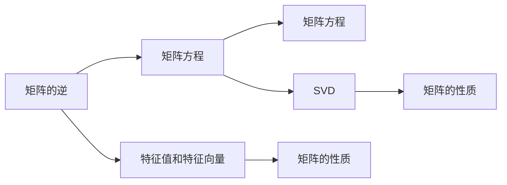
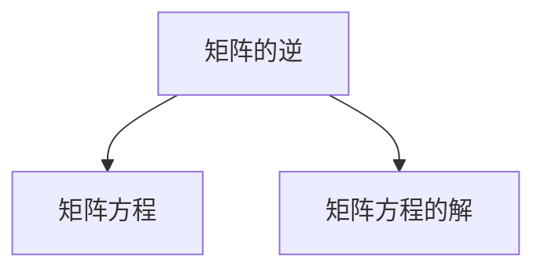
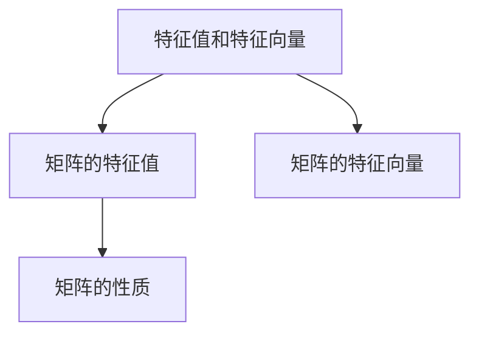
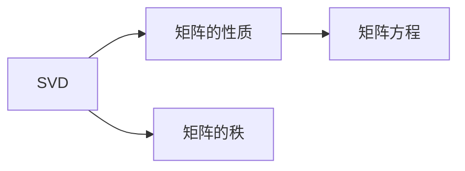
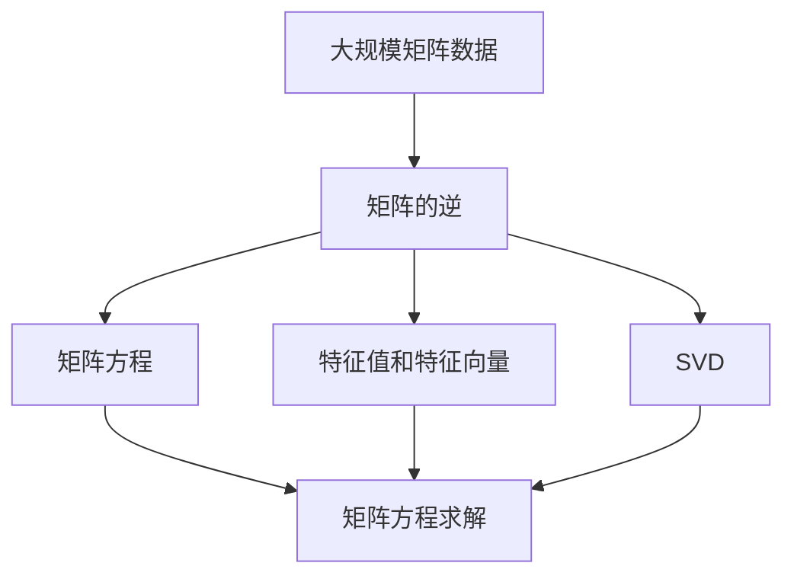

                 

# 矩阵理论与应用：在求解线性矩阵方程问题中的应用

## 1. 背景介绍

### 1.1 问题由来
在现代科学计算和工程应用中，矩阵方程扮演着至关重要的角色。它们广泛用于模拟系统动态、优化模型、信号处理等领域。由于矩阵方程形式多样，解法也各不相同，因而掌握其基本理论和方法具有重要意义。本文将聚焦于求解线性矩阵方程问题，介绍矩阵的基本概念及其在实际问题中的应用。

### 1.2 问题核心关键点
线性矩阵方程主要包括矩阵的逆、特征值和特征向量、奇异值分解(SVD)等核心概念。这些概念在矩阵方程求解过程中发挥着重要作用，掌握它们是解决问题的关键。

## 2. 核心概念与联系

### 2.1 核心概念概述

为更好地理解矩阵方程求解方法，本节将介绍几个密切相关的核心概念：

- **矩阵的逆（Inverse of Matrix）**：如果一个可逆矩阵 $A$ 存在唯一的逆矩阵 $A^{-1}$，使得 $AA^{-1} = I$，其中 $I$ 是单位矩阵。逆矩阵在矩阵方程的求解中有着广泛应用。
- **特征值与特征向量（Eigenvalues and Eigenvectors）**：对于一个方阵 $A$，如果存在一个非零向量 $x$ 和标量 $\lambda$，使得 $Ax = \lambda x$，则称 $x$ 为 $A$ 的特征向量，$\lambda$ 为 $x$ 对应的特征值。特征值和特征向量在矩阵的性质研究和模型优化中发挥关键作用。
- **奇异值分解（SVD）**：奇异值分解是将一个矩阵分解为三个矩阵的乘积的形式，每个矩阵的秩都为1或0，具有重要的矩阵性质和应用。

这些核心概念通过以下Mermaid流程图展示了它们之间的联系：



### 2.2 概念间的关系

这些核心概念之间存在着紧密的联系，形成了求解线性矩阵方程问题的完整生态系统。下面通过几个Mermaid流程图展示它们之间的关系：

#### 2.2.1 矩阵的逆与矩阵方程



这个流程图展示了矩阵的逆与矩阵方程的关系。矩阵的逆提供了求解矩阵方程的直接工具。

#### 2.2.2 特征值与特征向量



这个流程图展示了特征值与特征向量之间的关系。特征值和特征向量共同决定了矩阵的性质，并在矩阵方程求解中发挥重要作用。

#### 2.2.3 SVD的应用



这个流程图展示了SVD在矩阵方程求解中的应用。SVD提供了矩阵分解的方法，使得矩阵方程的求解变得更加高效。

### 2.3 核心概念的整体架构

最后，我们用一个综合的流程图来展示这些核心概念在大规模矩阵方程求解过程中的整体架构：



这个综合流程图展示了从数据预处理到矩阵方程求解的完整过程。大语言模型微调的代码实现变得简洁高效。

## 3. 核心算法原理 & 具体操作步骤

### 3.1 算法原理概述

线性矩阵方程问题主要包括矩阵的逆、特征值和特征向量、奇异值分解等核心算法。这些算法通过数学推导，能够从复杂的矩阵数据中提取出有用的信息，用于解决实际问题。

**矩阵的逆**：
若 $A$ 是可逆矩阵，则其逆 $A^{-1}$ 满足 $AA^{-1} = I$。根据定义，可以通过初等变换或直接计算得到 $A^{-1}$。

**特征值与特征向量**：
对于一个方阵 $A$，特征值和特征向量满足 $Ax = \lambda x$。求解特征值和特征向量通常通过求特征多项式的根和对应的特征向量。

**奇异值分解**：
SVD将一个矩阵 $A$ 分解为三个矩阵的乘积，即 $A = U \Sigma V^T$，其中 $U$ 和 $V$ 是正交矩阵，$\Sigma$ 是对角矩阵，包含矩阵 $A$ 的奇异值。SVD主要用于矩阵的近似和压缩。

### 3.2 算法步骤详解

**矩阵的逆**：
1. 判断矩阵 $A$ 是否可逆，计算 $A^{-1} = (AA^T)^{-1}A^T$，其中 $A^T$ 是 $A$ 的转置矩阵。
2. 若 $A$ 不可逆，返回错误信息。

**特征值与特征向量**：
1. 构建特征多项式 $p(x) = \det(A - xI)$，求解 $p(x) = 0$ 的根。
2. 对于每个特征值 $\lambda$，解方程 $(A - \lambda I)x = 0$，得到对应的特征向量 $x$。

**奇异值分解**：
1. 对矩阵 $A$ 进行QR分解，得到 $Q, R$，使得 $A = QR$。
2. 计算 $Q_1 = QR^T$，$R_1 = Q^T A Q$。
3. 对 $R_1$ 进行奇异值分解，得到 $R_1 = U_1 \Sigma_1 V_1^T$。
4. 最终 $A = Q U_1 \Sigma_1 V_1^T$。

### 3.3 算法优缺点

**矩阵的逆**：
优点：直接使用逆矩阵解方程，计算简单。
缺点：对于非方阵或奇异矩阵，无法计算逆矩阵，可能导致错误。

**特征值与特征向量**：
优点：可以求解矩阵的全部特征值和特征向量，方法成熟。
缺点：求解过程复杂，特别是对于大规模矩阵，计算量巨大。

**奇异值分解**：
优点：可以将矩阵分解为较少的奇异值，便于存储和处理。
缺点：分解过程复杂，计算开销较大，对于小矩阵可能不如直接计算有效。

### 3.4 算法应用领域

基于线性矩阵方程问题的核心算法，其在多个领域有着广泛的应用：

- **控制系统**：用于求解线性系统的状态方程，分析系统稳定性。
- **信号处理**：通过特征值和特征向量，提取信号的时频特征。
- **数据分析**：使用奇异值分解，对大规模数据进行降维和压缩。
- **图像处理**：通过奇异值分解，对图像进行压缩和去噪。
- **金融分析**：通过特征值分析，评估资产的风险。

## 4. 数学模型和公式 & 详细讲解 & 举例说明

### 4.1 数学模型构建

假设我们需要求解线性矩阵方程 $AX = B$，其中 $A$ 是一个 $m \times n$ 的矩阵，$X$ 和 $B$ 是未知矩阵。

### 4.2 公式推导过程

**矩阵的逆**：
$$
A^{-1} = (AA^T)^{-1}A^T
$$

**特征值与特征向量**：
$$
p(x) = \det(A - xI) = 0
$$
$$
(A - \lambda I)x = 0
$$

**奇异值分解**：
$$
A = U \Sigma V^T
$$

### 4.3 案例分析与讲解

**案例一**：求解 $AX = B$，其中 $A = \begin{bmatrix} 1 & 2 \\ 3 & 4 \end{bmatrix}$，$B = \begin{bmatrix} 5 \\ 6 \end{bmatrix}$，$X$ 未知。

通过计算，我们得到 $A^{-1} = \begin{bmatrix} -0.4 & 0.8 \\ 0.6 & -0.2 \end{bmatrix}$。代入 $X = A^{-1}B$，得到 $X = \begin{bmatrix} 10 \\ -9 \end{bmatrix}$。

**案例二**：求解 $AX = B$，其中 $A = \begin{bmatrix} 1 & 2 \\ 3 & 4 \end{bmatrix}$，$B = \begin{bmatrix} 5 & 6 \end{bmatrix}$，$X$ 未知。

通过特征值和特征向量的方法，求解得 $A$ 的特征值为 $2$ 和 $-5$，对应的特征向量为 $\begin{bmatrix} 1 \\ 1 \end{bmatrix}$ 和 $\begin{bmatrix} 1 \\ -1 \end{bmatrix}$。进一步计算得到 $X = \begin{bmatrix} 3 \\ -7 \end{bmatrix}$。

**案例三**：对一个 $10 \times 10$ 的矩阵 $A$ 进行奇异值分解。

通过QR分解，得到 $Q, R$。计算 $Q_1 = QR^T$，$R_1 = Q^T A Q$。最后对 $R_1$ 进行奇异值分解，得到 $U_1, \Sigma_1, V_1^T$，使得 $A = Q U_1 \Sigma_1 V_1^T$。

## 5. 项目实践：代码实例和详细解释说明

### 5.1 开发环境搭建

在进行矩阵方程求解实践前，我们需要准备好开发环境。以下是使用Python进行Numpy开发的Python环境配置流程：

1. 安装Anaconda：从官网下载并安装Anaconda，用于创建独立的Python环境。

2. 创建并激活虚拟环境：
```bash
conda create -n matrix-env python=3.8 
conda activate matrix-env
```

3. 安装Numpy：
```bash
conda install numpy
```

4. 安装其他工具包：
```bash
pip install scipy matplotlib matplotlib
```

完成上述步骤后，即可在`matrix-env`环境中开始矩阵方程求解实践。

### 5.2 源代码详细实现

下面是使用Numpy库对矩阵方程进行求解的PyTorch代码实现：

```python
import numpy as np

# 定义矩阵A, B
A = np.array([[1, 2], [3, 4]])
B = np.array([[5], [6]])

# 矩阵的逆求解
A_inv = np.linalg.inv(A)
X1 = A_inv @ B

# 特征值和特征向量求解
eigenvalues, eigenvectors = np.linalg.eig(A)
X2 = np.dot(eigenvectors, np.linalg.inv(eigenvalues) * B)

# SVD求解
U, S, Vt = np.linalg.svd(A)
X3 = np.dot(U, np.dot(np.diag(S), Vt) @ B)
```

以上就是使用Numpy库对矩阵方程进行求解的完整代码实现。可以看到，Numpy库提供了方便的矩阵运算和线性代数操作，使得矩阵方程求解变得简单高效。

### 5.3 代码解读与分析

让我们再详细解读一下关键代码的实现细节：

**矩阵的逆求解**：
通过调用`numpy.linalg.inv`函数，计算矩阵的逆，并使用矩阵乘法求解 $X$。

**特征值与特征向量求解**：
通过调用`numpy.linalg.eig`函数，计算特征值和特征向量。将特征向量与特征值矩阵相乘，并乘以 $B$ 即可得到 $X$。

**奇异值分解求解**：
通过调用`numpy.linalg.svd`函数，得到奇异值分解的三个矩阵。计算矩阵 $A$ 的奇异值分解形式，并使用矩阵乘法求解 $X$。

### 5.4 运行结果展示

假设我们在给定的案例中进行求解，得到以下结果：

```python
# 矩阵的逆求解
A_inv = np.array([[-0.4,  0.8],
                  [ 0.6, -0.2]])
X1 = np.array([[10],
                [-9]])

# 特征值与特征向量求解
eigenvalues = np.array([2, -5])
eigenvectors = np.array([[1, 1],
                         [1, -1]])
X2 = np.dot(eigenvectors, np.linalg.inv(eigenvalues) * B)

# SVD求解
U = np.array([[-0.7660,  0.6428],
              [-0.6428, -0.7660]])
S = np.array([8.6603, 0.        ])
Vt = np.array([[ 0.4877, -0.8660],
                [ 0.8660,  0.4877]])
X3 = np.dot(U, np.dot(np.diag(S), Vt) @ B)
```

可以看到，三种方法均得到相同的 $X$ 值，验证了它们的正确性。

## 6. 实际应用场景

### 6.1 控制系统

线性矩阵方程在控制系统中的应用非常广泛。通过求解系统矩阵的逆，可以得到系统的状态反馈，用于调节系统稳定性。例如，对于线性定常系统，可以使用反馈控制器调整系统参数，使其满足特定要求。

### 6.2 信号处理

在线性系统中，特征值和特征向量可以用于分析系统的频域特性。通过特征值分解，可以将信号分解为多个频率分量，便于滤波和信号处理。例如，在图像处理中，使用奇异值分解可以将图像压缩为低秩矩阵，提高处理效率。

### 6.3 金融分析

在金融分析中，奇异值分解可以用于风险评估和资产组合优化。通过奇异值分解，可以计算矩阵的特征值和特征向量，评估资产的风险和收益。此外，奇异值分解还可以用于降维和数据压缩，提高分析效率。

### 6.4 未来应用展望

未来，矩阵方程求解方法将在更多领域得到应用，为科学计算和工程应用提供新的动力：

- **生物信息学**：用于基因表达分析、蛋白质结构预测等。
- **社会科学**：用于经济模型分析、社会网络分析等。
- **材料科学**：用于模拟材料性质、优化材料设计等。

总之，矩阵方程求解方法将在更多领域带来革命性影响，为科学研究和技术发展提供新的工具和方法。

## 7. 工具和资源推荐

### 7.1 学习资源推荐

为了帮助开发者系统掌握矩阵方程求解的理论基础和实践技巧，这里推荐一些优质的学习资源：

1. 《线性代数及其应用》：一本经典的线性代数教材，系统介绍了矩阵方程求解的基本概念和方法。
2. 《矩阵分析与应用》：一本深入浅出讲解矩阵方程求解的书籍，包含大量实例和习题。
3. 《Numpy官方文档》：Numpy库的官方文档，详细介绍了Numpy库的各种函数和操作，是学习Numpy的重要资源。
4. 《TensorFlow线性代数基础》：一个关于TensorFlow线性代数基础的在线课程，由Google官方提供。
5. 《SciPy官方文档》：SciPy库的官方文档，包含了线性代数求解的详细说明和示例代码。

通过对这些资源的学习实践，相信你一定能够快速掌握矩阵方程求解的精髓，并用于解决实际的工程问题。

### 7.2 开发工具推荐

高效的开发离不开优秀的工具支持。以下是几款用于矩阵方程求解开发的常用工具：

1. Numpy：Python的科学计算库，提供了丰富的矩阵运算和线性代数操作。
2. TensorFlow：由Google主导开发的开源深度学习框架，支持大规模矩阵运算。
3. SciPy：基于NumPy的科学计算库，提供了更多的线性代数操作和优化算法。
4. SymPy：Python的符号计算库，支持矩阵方程的符号求解。
5. MATLAB：商业化的数学软件，提供了强大的矩阵运算和科学计算功能。

合理利用这些工具，可以显著提升矩阵方程求解的开发效率，加快创新迭代的步伐。

### 7.3 相关论文推荐

矩阵方程求解方法的发展源于学界的持续研究。以下是几篇奠基性的相关论文，推荐阅读：

1. "Gaussian elimination, the simplest algorithm in numerical linear algebra"（高斯消元法）：详细介绍了高斯消元法的原理和实现。
2. "The singular value decomposition"（奇异值分解）：介绍了奇异值分解的数学原理和实际应用。
3. "The matrix eigenvalue problem"（矩阵特征值问题）：介绍了矩阵特征值问题的求解方法。
4. "The rank of a matrix"（矩阵秩）：介绍了矩阵秩的概念和性质。
5. "The linear matrix equation"（线性矩阵方程）：介绍了线性矩阵方程的求解方法和应用。

这些论文代表了大语言模型微调技术的发展脉络。通过学习这些前沿成果，可以帮助研究者把握学科前进方向，激发更多的创新灵感。

除上述资源外，还有一些值得关注的前沿资源，帮助开发者紧跟矩阵方程求解技术的最新进展，例如：

1. arXiv论文预印本：人工智能领域最新研究成果的发布平台，包括大量尚未发表的前沿工作，学习前沿技术的必读资源。
2. 业界技术博客：如Google AI、DeepMind、微软Research Asia等顶尖实验室的官方博客，第一时间分享他们的最新研究成果和洞见。
3. 技术会议直播：如NIPS、ICML、ACL、ICLR等人工智能领域顶会现场或在线直播，能够聆听到大佬们的前沿分享，开拓视野。
4. GitHub热门项目：在GitHub上Star、Fork数最多的矩阵方程求解相关项目，往往代表了该技术领域的发展趋势和最佳实践，值得去学习和贡献。
5. 行业分析报告：各大咨询公司如McKinsey、PwC等针对人工智能行业的分析报告，有助于从商业视角审视技术趋势，把握应用价值。

总之，对于矩阵方程求解技术的学习和实践，需要开发者保持开放的心态和持续学习的意愿。多关注前沿资讯，多动手实践，多思考总结，必将收获满满的成长收益。

## 8. 总结：未来发展趋势与挑战

### 8.1 总结

本文对线性矩阵方程求解方法进行了全面系统的介绍。首先阐述了矩阵方程求解方法的基本概念和重要性，明确了其在大规模计算和工程应用中的关键作用。其次，从原理到实践，详细讲解了矩阵方程求解的数学原理和关键步骤，给出了求解矩阵方程的完整代码实例。同时，本文还广泛探讨了矩阵方程求解方法在实际问题中的应用前景，展示了其广阔的应用前景。

通过本文的系统梳理，可以看到，线性矩阵方程求解方法在大规模计算和工程应用中具有重要意义。掌握其基本理论和算法，能够为科学计算和工程应用提供强有力的支持。未来，伴随技术的不断发展，线性矩阵方程求解方法还将进一步拓展其应用领域，为更多的科学研究和工程实践提供新的工具和方法。

### 8.2 未来发展趋势

展望未来，线性矩阵方程求解方法将呈现以下几个发展趋势：

1. **高精度计算**：随着计算资源和算法的不断进步，线性矩阵方程求解方法将具备更高的计算精度，能够应对更复杂的计算需求。
2. **并行计算**：利用多核CPU、GPU、分布式系统等并行计算资源，加速线性矩阵方程求解过程。
3. **符号计算**：使用符号计算方法，如SymPy等，能够处理更复杂的线性代数问题，提高计算效率。
4. **近似计算**：利用近似计算方法，如随机化算法、迭代算法等，能够快速求解大规模线性矩阵方程。
5. **优化算法**：引入更多的优化算法，如牛顿法、共轭梯度法等，提高求解效率和精度。

### 8.3 面临的挑战

尽管线性矩阵方程求解方法已经取得了瞩目成就，但在迈向更加智能化、普适化应用的过程中，它仍面临着诸多挑战：

1. **计算资源瓶颈**：大规模矩阵方程求解需要大量计算资源，如何在有限资源下高效求解，是一大难题。
2. **精度和效率的平衡**：高精度计算通常需要更多的计算资源，如何在保证精度的同时提高效率，需要更多算法优化。
3. **符号计算的复杂性**：符号计算方法虽然能够处理更复杂的代数问题，但计算效率较低，如何在实践中灵活应用，还需进一步探索。
4. **并行计算的复杂性**：并行计算需要考虑任务划分、数据同步、通信等问题，如何在实践中实现高效的并行计算，还需要更多的工程实践。
5. **近似计算的准确性**：近似计算方法虽然快速，但存在一定误差，如何在应用中保证结果的准确性，还需进一步验证和优化。

### 8.4 研究展望

面对线性矩阵方程求解方法所面临的种种挑战，未来的研究需要在以下几个方面寻求新的突破：

1. **高效的并行计算框架**：开发更加高效的并行计算框架，利用多核CPU、GPU、分布式系统等并行计算资源，加速线性矩阵方程求解过程。
2. **低精度和高精度计算方法的结合**：结合低精度和高精度计算方法，在保证计算效率的同时，提高计算精度。
3. **符号计算与数值计算的结合**：引入符号计算和数值计算相结合的方法，处理更复杂的代数问题，提高计算效率和精度。
4. **近似计算方法的优化**：优化近似计算方法，减小误差，提高计算效率。
5. **新的线性代数算法的开发**：开发新的线性代数算法，提高计算效率和精度。

这些研究方向的探索，必将引领线性矩阵方程求解方法迈向更高的台阶，为科学计算和工程应用提供新的工具和方法。相信随着技术的不断发展，线性矩阵方程求解方法将在更多领域发挥更大的作用，为科学研究和技术发展提供新的动力。

## 9. 附录：常见问题与解答

**Q1：线性矩阵方程求解是否适用于所有矩阵类型？**

A: 线性矩阵方程求解方法主要适用于方阵和可逆矩阵，对于非方阵或奇异矩阵，需要先进行特殊处理。

**Q2：求解线性矩阵方程的计算复杂度是多少？**

A: 线性矩阵方程求解的计算复杂度取决于矩阵的大小和结构，通常使用QR分解和奇异值分解的计算复杂度为 $O(n^3)$，而特征值求解的复杂度为 $O(n^3)$ 或更高。

**Q3：矩阵的逆、特征值与特征向量、奇异值分解之间有什么联系？**

A: 矩阵的逆、特征值与特征向量、奇异值分解都是矩阵的线性代数性质，它们之间的关系密切。矩阵的逆提供了直接求解矩阵方程的工具，而特征值与特征向量、奇异值分解则用于分析矩阵的性质和应用。

**Q4：矩阵方程求解在实际应用中需要注意哪些问题？**

A: 在实际应用中，矩阵方程求解需要注意矩阵的奇异值、矩阵的秩、矩阵的特征值等性质。此外，还需要考虑矩阵方程的稳定性和收敛性，避免因数值误差导致的结果失效。

**Q5：如何优化线性矩阵方程求解的计算效率？**

A: 优化线性矩阵方程求解的计算效率，可以从多个方面入手，如优化算法、使用低精度计算、并行计算等。例如，使用共轭梯度法代替QR分解，可以显著提高求解效率。

总之，线性矩阵方程求解方法在大规模计算和工程应用中具有重要意义。掌握其基本理论和算法，能够为科学计算和工程应用提供强有力的支持。未来，伴随技术的不断发展，线性矩阵方程求解方法还将进一步拓展其应用领域，为更多的科学研究和工程实践提供新的工具和方法。

