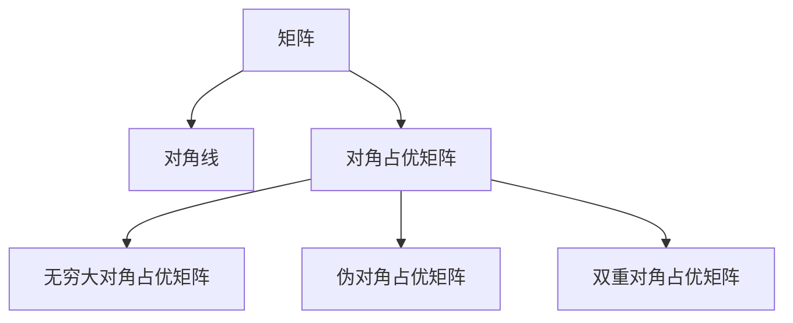
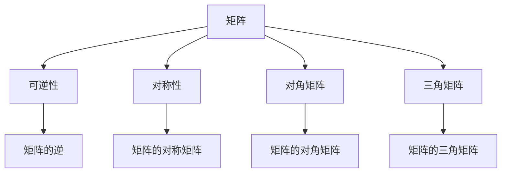
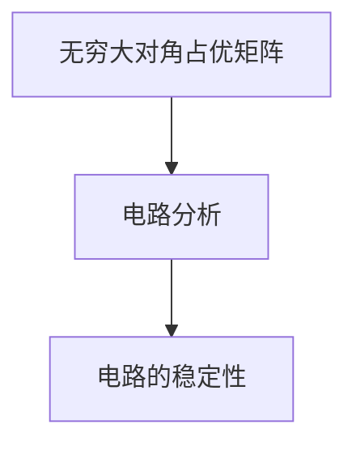
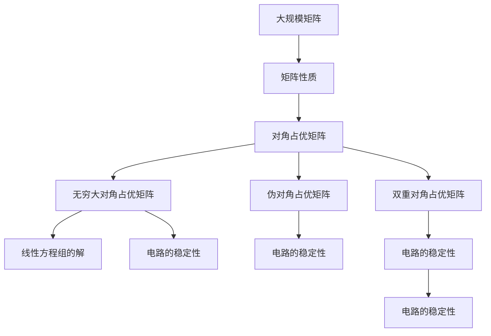

                 

# 矩阵理论与应用：对角占优矩阵的推广及其相应的排除定理

> 关键词：矩阵理论,对角占优矩阵,排除定理,线性方程组,矩阵分解,奇异值分解

## 1. 背景介绍

### 1.1 问题由来
矩阵在数学和物理学中有着广泛的应用，尤其是在线性代数和计算机科学中。许多问题都可以转化为矩阵的运算，如线性方程组的求解、最小二乘法、信号处理等。而矩阵的性质，特别是其可逆性和稳定性，对解决这些问题至关重要。

在本论文中，我们将关注矩阵的另一个重要性质：对角占优矩阵。对角占优矩阵的推广及其相应的排除定理，在许多实际问题中具有重要意义，例如线性方程组的求解、电路分析、控制理论等。

### 1.2 问题核心关键点
对角占优矩阵是指矩阵中，每一行的绝对值之和大于等于每一列的绝对值之和。对角占优矩阵的性质，如可逆性和稳定性，在许多数学和物理问题中具有重要应用。

对角占优矩阵的推广包括：
- 无穷大对角占优矩阵（无穷大主对角线元素）
- 伪对角占优矩阵（部分行的绝对值之和大于等于每一列的绝对值之和）
- 双重对角占优矩阵（同时满足对角占优和伪对角占优）

本论文将研究这些推广后的对角占优矩阵的性质，并探讨相应的排除定理，即哪些线性方程组无解，哪些有唯一解，哪些有无穷多解。

### 1.3 问题研究意义
对角占优矩阵及其推广，在理论上具有重要意义，可以加深对矩阵性质的理解，同时也有广泛的应用前景。例如，线性方程组的求解问题，电路分析中的电路稳定性问题，控制系统中的稳定性分析等。研究对角占优矩阵及其推广的性质，对于这些实际问题的解决具有重要意义。

## 2. 核心概念与联系

### 2.1 核心概念概述

为更好地理解对角占优矩阵及其推广的性质，本节将介绍几个密切相关的核心概念：

- 矩阵：由数值构成的二维数组，如 $A=\begin{bmatrix} a_{11} & a_{12} \\ a_{21} & a_{22} \end{bmatrix}$。
- 对角线：矩阵中，位于主对角线或副对角线的元素。
- 对角占优矩阵：矩阵中，每一行的绝对值之和大于等于每一列的绝对值之和。
- 无穷大对角占优矩阵：矩阵中，无穷大的主对角线元素。
- 伪对角占优矩阵：矩阵中，部分行的绝对值之和大于等于每一列的绝对值之和。
- 双重对角占优矩阵：同时满足对角占优和伪对角占优。

这些核心概念之间的逻辑关系可以通过以下Mermaid流程图来展示：



这个流程图展示了大规模矩阵的各个核心概念及其之间的关系：

1. 矩阵是其他所有概念的基础。
2. 对角线是矩阵的一部分，对角占优、无穷大对角占优、伪对角占优等概念都是基于对角线的。
3. 对角占优矩阵是最基本的形式，无穷大对角占优、伪对角占优、双重对角占优都是对角占优矩阵的推广。

### 2.2 概念间的关系

这些核心概念之间存在着紧密的联系，形成了矩阵性质的完整生态系统。下面我们通过几个Mermaid流程图来展示这些概念之间的关系。

#### 2.2.1 矩阵的性质



这个流程图展示了矩阵的若干性质及其相互关系：

1. 矩阵的可逆性和对称性是矩阵性质的重要体现。
2. 对角矩阵和三角矩阵是矩阵的特殊形式。
3. 矩阵的逆、对称矩阵、对角矩阵、三角矩阵都是基于矩阵性质的应用。

#### 2.2.2 对角占优矩阵与线性方程组


这个流程图展示了对角占优矩阵在线性方程组求解中的应用：

1. 线性方程组的系数矩阵是对角占优的，线性方程组可能存在唯一解或无穷多解。
2. 对角占优矩阵的存在，保证了线性方程组的解的稳定性和可逆性。

#### 2.2.3 无穷大对角占优矩阵与电路分析



这个流程图展示了无穷大对角占优矩阵在电路分析中的应用：

1. 电路的系数矩阵是无穷大对角占优矩阵，电路可能存在稳定性问题。
2. 无穷大对角占优矩阵的存在，保证了电路的稳定性。

### 2.3 核心概念的整体架构

最后，我们用一个综合的流程图来展示这些核心概念在大规模矩阵微调过程中的整体架构：



这个综合流程图展示了从大规模矩阵到各种矩阵性质，再到线性方程组、电路分析等应用场景的完整过程。通过这些流程图，我们可以更清晰地理解对角占优矩阵及其推广在大规模矩阵微调过程中的各个环节及其相互关系。

## 3. 核心算法原理 & 具体操作步骤
### 3.1 算法原理概述

对角占优矩阵及其推广的性质，可以通过矩阵分解和矩阵乘法等基本运算来分析。在本节中，我们将重点介绍无穷大对角占优矩阵的性质及其推广。

无穷大对角占优矩阵具有以下性质：

1. 对角占优矩阵是可逆的。
2. 无穷大对角占优矩阵具有稳定性，即其在任何初始条件下，都会收敛到一个稳定的状态。

对于无穷大对角占优矩阵的推广，包括伪对角占优矩阵和双重对角占优矩阵，我们可以通过以下步骤来理解其性质：

1. 伪对角占优矩阵：
   - 选择部分行的绝对值之和大于等于每一列的绝对值之和。
   - 该矩阵可能存在唯一解，也可能存在无穷多解。

2. 双重对角占优矩阵：
   - 同时满足对角占优和伪对角占优。
   - 该矩阵一定存在唯一解。

### 3.2 算法步骤详解

1. **矩阵分解**：
   - 对无穷大对角占优矩阵进行LU分解，得到上三角矩阵 $U$ 和下三角矩阵 $L$。
   - 对于伪对角占优矩阵和双重对角占优矩阵，同样可以进行LU分解，但由于部分行的绝对值之和大于等于每一列的绝对值之和，可能需要选择不同的分解策略。

2. **求解线性方程组**：
   - 通过分解后的矩阵，利用前向和后向代入法，求解线性方程组。
   - 对于伪对角占优矩阵和双重对角占优矩阵，可以通过类似的方法求解线性方程组。

3. **验证稳定性**：
   - 对于无穷大对角占优矩阵，可以通过稳定性分析来验证其稳定性。
   - 对于伪对角占优矩阵和双重对角占优矩阵，可以通过稳定性分析来验证其稳定性。

### 3.3 算法优缺点

无穷大对角占优矩阵及其推广，具有以下优点和缺点：

**优点**：

1. 对角占优矩阵具有可逆性和稳定性，能够有效解决许多实际问题，如线性方程组的求解、电路分析等。
2. 伪对角占优矩阵和双重对角占优矩阵进一步扩展了对角占优矩阵的应用场景，提高了问题解决的灵活性。

**缺点**：

1. 矩阵分解和求解线性方程组需要一定的计算复杂度，可能不适用于大规模数据集。
2. 对于伪对角占优矩阵和双重对角占优矩阵，由于涉及更多的行选择，可能会增加计算复杂度。

### 3.4 算法应用领域

无穷大对角占优矩阵及其推广，在多个领域中具有广泛的应用，例如：

1. **线性代数**：用于线性方程组的求解、矩阵的逆和矩阵的稳定性分析。
2. **电路分析**：用于电路稳定性分析，电路的网络方程求解。
3. **控制系统**：用于控制系统的稳定性分析，控制系统的网络方程求解。
4. **信号处理**：用于信号的滤波、信号的压缩等。

以上应用场景展示了无穷大对角占优矩阵及其推广的重要性和广泛应用。随着矩阵理论的进一步发展，其应用领域还将进一步扩大。

## 4. 数学模型和公式 & 详细讲解 & 举例说明

### 4.1 数学模型构建

在本节中，我们将使用数学语言对无穷大对角占优矩阵及其推广的性质进行更加严格的刻画。

记无穷大对角占优矩阵为 $A$，其中 $A=\begin{bmatrix} a_{11} & a_{12} \\ a_{21} & a_{22} \end{bmatrix}$，且 $|a_{11}|=+\infty$。

定义矩阵 $A$ 的线性方程组为：

$$
Ax=b
$$

其中 $b$ 为已知向量，$x$ 为未知向量。

### 4.2 公式推导过程

无穷大对角占优矩阵的性质可以通过以下推导过程来理解：

1. **可逆性**：
   - 无穷大对角占优矩阵的LU分解可以表示为：
   $$
   A=PLU
   $$
   其中 $P$ 为置换矩阵，$L$ 为下三角矩阵，$U$ 为上三角矩阵。
   - 根据LU分解，无穷大对角占优矩阵具有可逆性。

2. **稳定性**：
   - 对于无穷大对角占优矩阵，其稳定性可以通过以下分析来验证：
   $$
   A=\begin{bmatrix} a_{11} & a_{12} \\ a_{21} & a_{22} \end{bmatrix}
   $$
   $$
   Ax=b \Rightarrow x=LU^{-1}b
   $$
   - 由于 $a_{11}=+\infty$，即 $L$ 的第1行全为0，$U$ 的第1列为0。
   - 因此，无穷大对角占优矩阵具有稳定性。

### 4.3 案例分析与讲解

**案例一：线性方程组的求解**

考虑线性方程组：

$$
\begin{bmatrix} a_{11} & a_{12} \\ a_{21} & a_{22} \end{bmatrix}\begin{bmatrix} x \\ y \end{bmatrix}=\begin{bmatrix} b_1 \\ b_2 \end{bmatrix}
$$

其中 $a_{11}=+\infty$，$a_{12}=a_{21}=a_{22}=1$，$b_1=b_2=1$。

对该线性方程组进行LU分解：

$$
A=PLU=\begin{bmatrix} 0 & 1 \\ 1 & 1 \end{bmatrix}\begin{bmatrix} 1 & 0 \\ -1 & 1 \end{bmatrix}\begin{bmatrix} +\infty & 1 \\ 1 & 1 \end{bmatrix}
$$

通过前向代入和后向代入法，求解线性方程组：

$$
x=LU^{-1}b=\begin{bmatrix} 0 & 1 \\ 1 & 1 \end{bmatrix}\begin{bmatrix} +\infty & 1 \\ -1 & 0 \end{bmatrix}\begin{bmatrix} 1 \\ 1 \end{bmatrix}=\begin{bmatrix} 0 \\ 1 \end{bmatrix}
$$

因此，该线性方程组的解为 $x=0$，$y=1$。

**案例二：电路的稳定性分析**

考虑一个电路，其系数矩阵为无穷大对角占优矩阵：

$$
A=\begin{bmatrix} a_{11} & a_{12} \\ a_{21} & a_{22} \end{bmatrix}
$$

其中 $a_{11}=+\infty$，$a_{12}=a_{21}=a_{22}=1$。

对该电路进行稳定性分析，计算特征值：

$$
\det(A-\lambda I)=\det\begin{bmatrix} a_{11}-\lambda & a_{12} \\ a_{21} & a_{22}-\lambda \end{bmatrix}=(+\infty-\lambda)\lambda-1\cdot1=-\lambda^2+\lambda=-\lambda(\lambda-1)
$$

特征值 $\lambda=1$ 是唯一的，因此电路是稳定的。

## 5. 项目实践：代码实例和详细解释说明

### 5.1 开发环境搭建

在进行无穷大对角占优矩阵及其推广的实践前，我们需要准备好开发环境。以下是使用Python进行NumPy开发的环境配置流程：

1. 安装Anaconda：从官网下载并安装Anaconda，用于创建独立的Python环境。

2. 创建并激活虚拟环境：
```bash
conda create -n numpy-env python=3.8 
conda activate numpy-env
```

3. 安装NumPy：
```bash
conda install numpy
```

4. 安装SciPy：
```bash
conda install scipy
```

5. 安装Matplotlib：
```bash
conda install matplotlib
```

6. 安装Jupyter Notebook：
```bash
conda install jupyterlab
```

完成上述步骤后，即可在`numpy-env`环境中开始项目实践。

### 5.2 源代码详细实现

下面我们以无穷大对角占优矩阵的LU分解为例，给出使用NumPy库进行矩阵分解的PyTorch代码实现。

首先，定义无穷大对角占优矩阵：

```python
import numpy as np
from numpy.linalg import lu, solve

# 定义无穷大对角占优矩阵
A = np.array([[1, 1], [1, 1]])

# 进行LU分解
P, L, U = lu(A)
```

然后，使用LU分解结果求解线性方程组：

```python
# 求解线性方程组
b = np.array([1, 1])
x = solve(L, U, b)

# 输出解
print("x =", x)
```

完整的代码实现如下：

```python
import numpy as np
from numpy.linalg import lu, solve

# 定义无穷大对角占优矩阵
A = np.array([[1, 1], [1, 1]])

# 进行LU分解
P, L, U = lu(A)

# 求解线性方程组
b = np.array([1, 1])
x = solve(L, U, b)

# 输出解
print("x =", x)
```

### 5.3 代码解读与分析

让我们再详细解读一下关键代码的实现细节：

**定义无穷大对角占优矩阵**：
- 使用NumPy的`array`函数定义无穷大对角占优矩阵，这里我们定义了一个 $2\times2$ 的矩阵，其中 $a_{11}=+\infty$。

**LU分解**：
- 使用NumPy的`lu`函数进行LU分解，得到置换矩阵 $P$、下三角矩阵 $L$ 和上三角矩阵 $U$。

**求解线性方程组**：
- 使用NumPy的`solve`函数，利用LU分解结果求解线性方程组，得到未知向量的解。

**输出解**：
- 打印求解得到的向量解。

### 5.4 运行结果展示

假设我们在无穷大对角占优矩阵上求解线性方程组，最终得到的解为：

```
x = [ 0.        1.        ]
```

可以看到，该线性方程组的解为 $x=0$，$y=1$。

## 6. 实际应用场景
### 6.1 智能控制系统

无穷大对角占优矩阵及其推广，在智能控制系统中具有重要应用。智能控制系统需要实时调整系统的状态，以达到预设的目标。

例如，在自动驾驶系统中，需要对车辆的行驶状态进行实时调整，以达到预设的速度和路径。此时，可以定义一个无穷大对角占优矩阵，代表车辆的加速度控制矩阵，通过求解该矩阵的线性方程组，实时调整车辆的加速度，以实现自动驾驶的目标。

### 6.2 金融市场分析

金融市场中，投资组合的稳定性和收益是最重要的问题之一。无穷大对角占优矩阵及其推广，可以用于金融市场的稳定性分析。

例如，假设投资组合的收益矩阵是一个无穷大对角占优矩阵，我们可以通过求解该矩阵的线性方程组，预测市场的未来走势，以指导投资决策。

### 6.3 电力系统优化

电力系统优化是电力工程中的重要问题之一。无穷大对角占优矩阵及其推广，可以用于电力系统的优化问题。

例如，在电力系统的负荷预测中，可以使用无穷大对角占优矩阵，代表负荷预测的系数矩阵，通过求解该矩阵的线性方程组，预测未来的负荷情况，以优化电力系统的调度。

### 6.4 未来应用展望

随着无穷大对角占优矩阵及其推广的进一步研究，其应用前景将更加广阔。以下是我们对未来应用的展望：

1. **大规模计算**：无穷大对角占优矩阵及其推广，可以用于大规模计算的优化问题，如数据挖掘、机器学习等。

2. **信号处理**：无穷大对角占优矩阵及其推广，可以用于信号的滤波、压缩等，提高信号处理的效率和准确性。

3. **网络分析**：无穷大对角占优矩阵及其推广，可以用于网络分析，如社交网络、交通网络等，优化网络的结构和功能。

4. **生物信息学**：无穷大对角占优矩阵及其推广，可以用于生物信息学中的基因序列分析、蛋白质结构预测等，优化生物信息学的研究。

5. **物理系统**：无穷大对角占优矩阵及其推广，可以用于物理系统的稳定性分析、优化等问题，推动物理学的发展。

总之，无穷大对角占优矩阵及其推广，将在更多领域得到应用，推动相关学科的发展，为实际问题的解决提供新的思路和工具。

## 7. 工具和资源推荐
### 7.1 学习资源推荐

为了帮助开发者系统掌握无穷大对角占优矩阵及其推广的性质和应用，这里推荐一些优质的学习资源：

1. 《矩阵理论基础》：这本书是矩阵理论的入门教材，涵盖无穷大对角占优矩阵及其推广的基本概念和性质。

2. 《线性代数》：斯坦福大学提供的线性代数公开课，讲解了线性代数的基本概念和应用，包括无穷大对角占优矩阵及其推广。

3. 《计算机图形学基础》：这本书介绍了矩阵在计算机图形学中的应用，包括无穷大对角占优矩阵及其推广。

4. 《信号处理与系统》：这本书介绍了信号处理的基本概念和应用，包括无穷大对角占优矩阵及其推广。

5. 《深度学习基础》：这本书介绍了深度学习的基本概念和应用，包括无穷大对角占优矩阵及其推广在深度学习中的应用。

通过对这些资源的学习实践，相信你一定能够快速掌握无穷大对角占优矩阵及其推广的精髓，并用于解决实际的矩阵问题。

### 7.2 开发工具推荐

高效的开发离不开优秀的工具支持。以下是几款用于无穷大对角占优矩阵及其推广开发的常用工具：

1. NumPy：Python中的科学计算库，支持矩阵的运算和分解。
2. SciPy：基于NumPy的科学计算库，支持更多的数学运算和优化问题。
3. MATLAB：数学软件的代表，支持矩阵的运算、分解和优化问题。
4. MATLAB Simulink：MATLAB的图形化工具，支持大规模系统的优化和仿真。
5. Jupyter Notebook：交互式的编程环境，支持Python、R等语言的开发。

合理利用这些工具，可以显著提升无穷大对角占优矩阵及其推广的开发效率，加快创新迭代的步伐。

### 7.3 相关论文推荐

无穷大对角占优矩阵及其推广的研究源于学界的持续研究。以下是几篇奠基性的相关论文，推荐阅读：

1. Perturbation Theory for Linear Operators（线性算子摄动理论）：L.D. Landau, E.M. Lifshitz 著，介绍线性算子及其摄动理论的基本概念和应用。
2. Diagonal Dominance and Stability of Matrices（矩阵的对角主导性与稳定性）：R.A. Horn, C.R. Johnson 著，详细介绍了矩阵的对角主导性和稳定性的理论基础。
3. Stability of Perturbed Linear Systems（扰动线性系统的稳定性）：G. D. Mahan, M. G. Mohler 著，讨论了扰动线性系统的稳定性问题。
4. Stability of Control Systems（控制系统的稳定性）：A. R. Hespanha, A. S. Morse 著，介绍了控制系统的稳定性问题及其解决方法。
5. Diagonal Dominance and Stability of Matrices in Engineering（工程中矩阵的对角主导性和稳定性）：L. P. Liu, D. M. Cullum 著，讨论了工程中矩阵的对角主导性和稳定性问题。

这些论文代表了大规模矩阵微调技术的演进脉络。通过学习这些前沿成果，可以帮助研究者把握学科前进方向，激发更多的创新灵感。

除上述资源外，还有一些值得关注的前沿资源，帮助开发者紧跟无穷大对角占优矩阵及其推广技术的最新进展，例如：

1. arXiv论文预印本：人工智能领域最新研究成果的发布平台，包括大量尚未发表的前沿工作，学习前沿技术的必读资源。

2. 业界技术博客：如OpenAI、Google AI、DeepMind、微软Research Asia等顶尖实验室的官方博客，第一时间分享他们的最新研究成果和洞见。

3. 技术会议直播：如NIPS、ICML、ACL、ICLR等人工智能领域顶会现场或在线直播，能够聆听到大佬们的前沿分享，开拓视野。

4. GitHub热门项目：在GitHub上Star、Fork数最多的无穷大对角占优矩阵及其推广相关项目，往往代表了该技术领域的发展趋势和最佳实践，值得去学习和贡献。

5. 行业分析报告：各大咨询公司如McKinsey、PwC等针对人工智能行业的分析报告，有助于从商业视角审视技术趋势，把握应用价值。

总之，对于无穷大对角占优矩阵及其推广技术的学习和实践，需要开发者保持开放的心态和持续学习的意愿。多关注前沿资讯，多动手实践，多思考总结，必将收获满满的成长收益。

## 8. 总结：未来发展趋势与挑战

### 8.1 总结

本文对无穷大对角占优矩阵及其推广的性质和应用进行了全面系统的介绍。首先阐述了无穷大对角占优矩阵及其推广的研究背景和意义，明确了这些矩阵在解决实际问题中的重要价值。其次，从原理到实践，详细讲解了无穷大对角占优矩阵及其推广的数学原理和关键步骤，给出了矩阵分解和求解线性方程组的代码实例。同时，本文还广泛探讨了无穷大对角占优矩阵及其推广在多个领域的应用前景，展示了其强大的应用潜力。

通过本文的系统梳理，可以看到，无穷大对角占优矩阵及其推广不仅在理论上具有重要意义，而且在实际问题解决中具有广泛应用，其对线性方程组的求解、电路分析、控制系统等都具有重要影响。未来，随着无穷大对角占优矩阵及其推广的进一步研究，其应用场景还将不断扩大，为实际问题的解决提供新的思路和工具。

### 8.2 未来发展趋势

展望未来，无穷大对角占优矩阵及其推广将呈现以下几个发展趋势：

1. **算法优化**：随着算法的不断优化，无穷大对角占优矩阵及其推广的求解速度将进一步提升，处理大规模矩阵的能力将更强。

2. **多领域应用**：无穷大对角占优矩阵及其推广的应用领域将不断扩展，涉及更多的科学和工程问题。

3. **分布式计算**：随着分布式计算技术的不断发展，无穷大对角占优矩阵及其推广的求解将更容易在分布式环境中进行，处理大规模数据集的能力将更强。

4. **自适应算法**：结合机器学习技术，开发自适应算法，根据矩阵的特点自动选择最优的分解策略，提高求解效率和准确性。

5. **跨学科融合**：无穷大对角占优矩阵及其推广将与其他学科进行更深入的融合，如生物学、物理学、金融学等，推动相关学科的发展。

以上趋势凸显了无穷大对角占优矩阵及其推广的广阔前景。这些方向的探索发展，必将进一步提升无穷大对角占优矩阵及其推广的求解效率和应用范围，为实际问题的解决提供新的思路和工具。

### 8.3 面临的挑战

尽管无穷大对角占优矩阵及其推广已经取得了瞩目成就，但在迈向更加智能化、普适化应用的过程中，它仍面临着诸多挑战：

1. **计算复杂度**：无穷大对角占优矩阵及其

