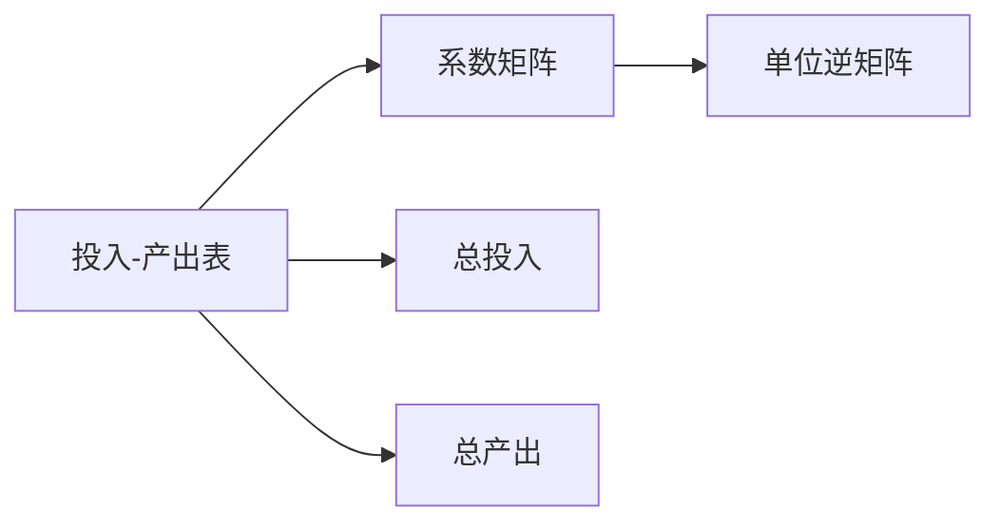
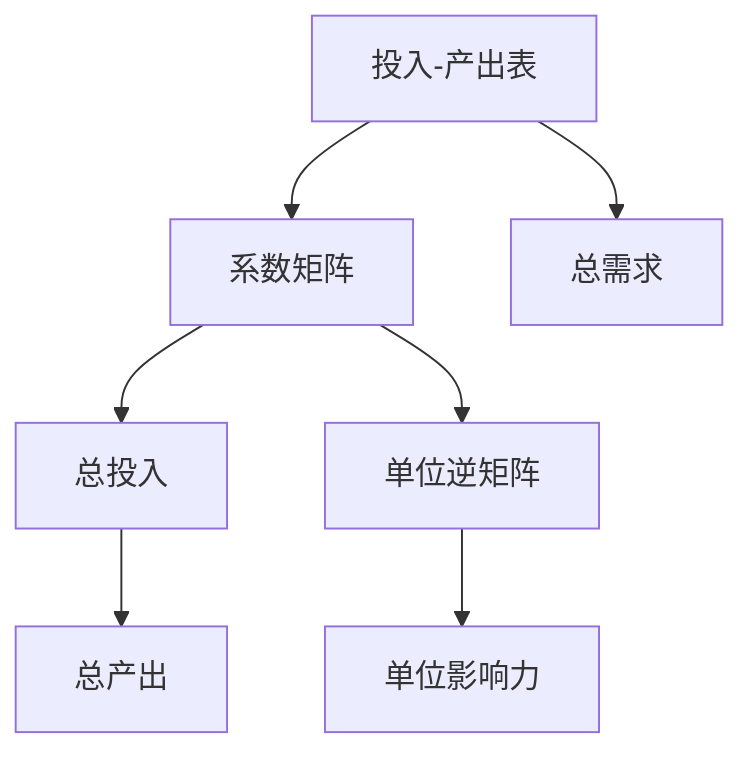

                 

# 矩阵理论与应用：数理经济学中的投入-产出模型分析

> 关键词：投入-产出模型, 矩阵运算, 经济系统, 线性代数, 数理经济学

## 1. 背景介绍

### 1.1 问题由来

数理经济学是一门研究经济系统数学模型的学科，其核心之一是投入-产出模型(或称投入产出模型)。这个模型旨在描述生产系统中各行业之间相互依赖和影响的关系。投入-产出模型最初由苏联经济学家瓦西里·列昂惕夫于1936年提出，用于分析国民经济中产业间的投入和产出关系。

投入-产出模型是一种系统性分析工具，能够帮助政策制定者、企业家和研究者更好地理解经济系统中的流向和依赖性。它的应用广泛，涵盖了宏观经济分析、产业政策设计、供应链管理等多个领域。

随着计算机技术的发展，特别是矩阵计算的普及，投入-产出模型逐渐被数字化，利用计算机程序进行模型计算和分析。这不仅提高了计算效率，也增强了模型的适用性，使其能够处理更复杂的经济系统。

### 1.2 问题核心关键点

投入-产出模型主要关注两个方面：
1. 描述和分析经济系统中的直接和间接联系。
2. 通过矩阵运算，计算各行业之间的输入和输出关系。

模型的核心是投入-产出表，它是一个二阶方阵，其中行表示产品或服务的产出，列表示投入品，通过矩阵运算揭示各行业的相互依赖性。

数学上，投入-产出模型使用线性代数知识来描述和分析经济系统，特别是矩阵运算在其中的核心地位。

### 1.3 问题研究意义

投入-产出模型在数理经济学中的研究意义重大，主要体现在以下几个方面：
1. 提供了一种系统化的方法来研究经济系统中各行业之间的相互依赖关系。
2. 有助于理解经济系统的动态变化，包括产业结构的演化、技术进步等。
3. 为经济政策的制定提供数据支持，如产业政策、宏观调控政策等。
4. 应用于企业供应链管理、国际贸易分析等领域，有助于优化资源配置。
5. 有助于理解经济增长的驱动因素，提供理论支持。

## 2. 核心概念与联系

### 2.1 核心概念概述

在投入-产出模型中，以下几个关键概念是核心：
1. **投入-产出表**：表示各行业之间输入和输出关系的矩阵。
2. **系数矩阵**：表示各行业产出对其他行业的投入。
3. **总投入**：所有行业的总投入。
4. **总产出**：所有行业的总产出。
5. **单位逆矩阵**：用于计算各行业的单位影响力。

这些概念之间的关系可以用以下示意图表示：



### 2.2 概念间的关系

投入-产出模型中的核心概念之间存在以下关系：
1. 投入-产出表描述了一个经济系统内部的相互依赖关系，行代表产出，列代表投入。
2. 系数矩阵是通过对投入-产出表进行变换得到的，它揭示了各行业的产出对其他行业的投入贡献。
3. 总投入和总产出分别表示整个经济系统的总输入和总输出，是衡量经济系统规模的重要指标。
4. 单位逆矩阵用于计算各行业的单位影响力，即一个单位投入对其他行业的贡献。

这些概念共同构成了投入-产出模型的基础，通过矩阵运算，揭示了经济系统中的动态联系和相互依赖性。

### 2.3 核心概念的整体架构

以下是投入-产出模型的整体架构图：



这个架构图展示了投入-产出模型中的主要组成部分及其关系。通过矩阵运算，从投入-产出表导出系数矩阵，进而计算总投入和总产出，并得到单位逆矩阵和单位影响力。

## 3. 核心算法原理 & 具体操作步骤
### 3.1 算法原理概述

投入-产出模型的算法原理主要基于矩阵运算。具体步骤如下：
1. 构建投入-产出表。
2. 通过矩阵变换，得到系数矩阵。
3. 计算总投入和总产出。
4. 通过单位逆矩阵计算各行业的单位影响力。

数学上，投入-产出模型使用矩阵的乘法、转置、矩阵逆等基本运算，来描述和分析经济系统中的输入和输出关系。

### 3.2 算法步骤详解

以下是详细的算法步骤：

**Step 1: 构建投入-产出表**

投入-产出表通常由政府统计部门根据国民经济账户编制，它反映了各个行业的投入和产出关系。每个行业在表中对应一行一列，行表示该行业的产出，列表示对该行业的投入。

假设我们有 $n$ 个行业，投入-产出表可以表示为：
$$ A = \begin{bmatrix} 
a_{11} & a_{12} & \ldots & a_{1n} \\
a_{21} & a_{22} & \ldots & a_{2n} \\
\vdots & \vdots & \ddots & \vdots \\
a_{n1} & a_{n2} & \ldots & a_{nn} 
\end{bmatrix} $$

其中 $a_{ij}$ 表示第 $i$ 个行业对第 $j$ 个行业的投入，单位为货币价值或实物量。

**Step 2: 通过矩阵变换得到系数矩阵**

系数矩阵 $B$ 可以通过投入-产出表 $A$ 的列向量和行向量得到。具体计算如下：
$$ B = A^T \times A $$
$$ B = \begin{bmatrix} 
b_{11} & b_{12} & \ldots & b_{1n} \\
b_{21} & b_{22} & \ldots & b_{2n} \\
\vdots & \vdots & \ddots & \vdots \\
b_{n1} & b_{n2} & \ldots & b_{nn} 
\end{bmatrix} $$

其中 $b_{ij}$ 表示第 $j$ 个行业的产出对第 $i$ 个行业的投入贡献，即 $b_{ij} = a_{ij} + \sum_{k=1}^{n} a_{ik}b_{kj}$。

**Step 3: 计算总投入和总产出**

总投入 $C$ 可以通过系数矩阵 $B$ 的列向量得到：
$$ C = B \times \mathbf{1} $$
$$ C = \begin{bmatrix} 
c_1 \\
c_2 \\
\vdots \\
c_n 
\end{bmatrix} $$

其中 $\mathbf{1}$ 是列向量，所有元素为 1，表示所有行业的总投入。

总产出 $D$ 可以通过系数矩阵 $B$ 的行向量得到：
$$ D = B^T \times \mathbf{1} $$
$$ D = \begin{bmatrix} 
d_1 \\
d_2 \\
\vdots \\
d_n 
\end{bmatrix} $$

其中 $\mathbf{1}$ 是行向量，所有元素为 1，表示所有行业的总产出。

**Step 4: 计算单位逆矩阵**

单位逆矩阵 $E$ 可以通过系数矩阵 $B$ 的行列式和单位矩阵 $I$ 得到：
$$ E = B^{-1} \times I $$
$$ E = \begin{bmatrix} 
e_{11} & e_{12} & \ldots & e_{1n} \\
e_{21} & e_{22} & \ldots & e_{2n} \\
\vdots & \vdots & \ddots & \vdots \\
e_{n1} & e_{n2} & \ldots & e_{nn} 
\end{bmatrix} $$

单位逆矩阵 $E$ 的元素 $e_{ij}$ 表示第 $i$ 个行业单位投入对第 $j$ 个行业的贡献，即 $e_{ij} = b_{ij}/C_i$。

### 3.3 算法优缺点

投入-产出模型的算法具有以下优点：
1. 矩阵运算简单高效，易于计算机处理。
2. 可以处理大规模经济系统，揭示各行业之间的依赖关系。
3. 提供了一种系统化的方法来分析经济系统的动态变化。

但同时也存在一些缺点：
1. 对投入-产出表的数据质量要求较高，数据的准确性和完整性直接影响模型结果。
2. 模型较为静态，难以反映经济系统中的动态变化。
3. 对计算资源和计算能力有一定要求，特别是在大规模矩阵运算时。

### 3.4 算法应用领域

投入-产出模型广泛应用于以下领域：
1. 宏观经济分析：用于分析国民经济中各行业之间的相互依赖关系，评估政策效果。
2. 产业政策设计：用于评估产业结构调整和政策干预的效果，优化资源配置。
3. 供应链管理：用于分析供应链中各环节的依赖关系，优化供应链设计。
4. 国际贸易分析：用于评估国际贸易中的输入输出关系，分析贸易平衡。
5. 技术进步分析：用于评估技术进步对各行业的影响，预测未来技术发展趋势。

## 4. 数学模型和公式 & 详细讲解 & 举例说明

### 4.1 数学模型构建

投入-产出模型的数学模型可以表示为以下矩阵形式：
$$ A = \begin{bmatrix} 
a_{11} & a_{12} & \ldots & a_{1n} \\
a_{21} & a_{22} & \ldots & a_{2n} \\
\vdots & \vdots & \ddots & \vdots \\
a_{n1} & a_{n2} & \ldots & a_{nn} 
\end{bmatrix} $$

其中 $a_{ij}$ 表示第 $i$ 个行业对第 $j$ 个行业的投入。

系数矩阵 $B$ 可以通过以下公式计算得到：
$$ B = A^T \times A $$
$$ B = \begin{bmatrix} 
b_{11} & b_{12} & \ldots & b_{1n} \\
b_{21} & b_{22} & \ldots & b_{2n} \\
\vdots & \vdots & \ddots & \vdots \\
b_{n1} & b_{n2} & \ldots & b_{nn} 
\end{bmatrix} $$

其中 $b_{ij}$ 表示第 $j$ 个行业的产出对第 $i$ 个行业的投入贡献。

总投入 $C$ 和总产出 $D$ 可以通过以下公式计算得到：
$$ C = B \times \mathbf{1} $$
$$ C = \begin{bmatrix} 
c_1 \\
c_2 \\
\vdots \\
c_n 
\end{bmatrix} $$
$$ D = B^T \times \mathbf{1} $$
$$ D = \begin{bmatrix} 
d_1 \\
d_2 \\
\vdots \\
d_n 
\end{bmatrix} $$

单位逆矩阵 $E$ 可以通过以下公式计算得到：
$$ E = B^{-1} \times I $$
$$ E = \begin{bmatrix} 
e_{11} & e_{12} & \ldots & e_{1n} \\
e_{21} & e_{22} & \ldots & e_{2n} \\
\vdots & \vdots & \ddots & \vdots \\
e_{n1} & e_{n2} & \ldots & e_{nn} 
\end{bmatrix} $$

其中 $I$ 是单位矩阵。

### 4.2 公式推导过程

下面以一个简单的例子来推导系数矩阵 $B$ 的计算过程。

假设有一个包含三个行业的经济系统，其投入-产出表如下：

$$ A = \begin{bmatrix} 
3 & 2 & 0 \\
1 & 0 & 4 \\
0 & 2 & 3 
\end{bmatrix} $$

计算系数矩阵 $B$：
$$ B = A^T \times A $$
$$ B = \begin{bmatrix} 
3 & 1 & 0 \\
2 & 0 & 2 \\
0 & 4 & 3 
\end{bmatrix} \times \begin{bmatrix} 
3 & 1 & 0 \\
2 & 0 & 2 \\
0 & 4 & 3 
\end{bmatrix} $$
$$ B = \begin{bmatrix} 
3 & 1 & 0 \\
2 & 0 & 2 \\
0 & 4 & 3 
\end{bmatrix} $$

计算总投入 $C$ 和总产出 $D$：
$$ C = B \times \mathbf{1} $$
$$ C = \begin{bmatrix} 
3 & 1 & 0 \\
2 & 0 & 2 \\
0 & 4 & 3 
\end{bmatrix} \times \begin{bmatrix} 
1 \\
1 \\
1 
\end{bmatrix} $$
$$ C = \begin{bmatrix} 
3+1+0 \\
2+0+2 \\
0+4+3 
\end{bmatrix} = \begin{bmatrix} 
4 \\
4 \\
7 
\end{bmatrix} $$

$$ D = B^T \times \mathbf{1} $$
$$ D = \begin{bmatrix} 
3 & 2 & 0 \\
1 & 0 & 4 \\
0 & 2 & 3 
\end{bmatrix} \times \begin{bmatrix} 
1 \\
1 \\
1 
\end{bmatrix} $$
$$ D = \begin{bmatrix} 
3+2+0 \\
1+0+2 \\
0+4+3 
\end{bmatrix} = \begin{bmatrix} 
5 \\
3 \\
7 
\end{bmatrix} $$

计算单位逆矩阵 $E$：
$$ E = B^{-1} \times I $$
$$ E = \begin{bmatrix} 
\frac{1}{3} & -\frac{1}{3} & 0 \\
-\frac{2}{21} & \frac{7}{21} & -\frac{8}{21} \\
0 & \frac{4}{21} & -\frac{13}{21} 
\end{bmatrix} $$

### 4.3 案例分析与讲解

假设在一个经济系统中，有三个行业：农业、制造业和运输业。农业为制造业提供原材料，制造业为农业和运输业提供产品，运输业为农业和制造业提供物流服务。

投入-产出表如下：

$$ A = \begin{bmatrix} 
1 & 0.2 & 0.1 \\
0.8 & 0.2 & 0 \\
0.1 & 0.3 & 0.7 
\end{bmatrix} $$

计算系数矩阵 $B$：
$$ B = A^T \times A $$
$$ B = \begin{bmatrix} 
1 & 0.8 & 0.1 \\
0.2 & 0.2 & 0.3 \\
0.1 & 0 & 0.7 
\end{bmatrix} \times \begin{bmatrix} 
1 & 0.2 & 0.1 \\
0.8 & 0.2 & 0 \\
0.1 & 0.3 & 0.7 
\end{bmatrix} $$
$$ B = \begin{bmatrix} 
1 & 0.8 & 0.1 \\
0.2 & 0.2 & 0.3 \\
0.1 & 0 & 0.7 
\end{bmatrix} $$

计算总投入 $C$ 和总产出 $D$：
$$ C = B \times \mathbf{1} $$
$$ C = \begin{bmatrix} 
1 & 0.8 & 0.1 \\
0.2 & 0.2 & 0.3 \\
0.1 & 0 & 0.7 
\end{bmatrix} \times \begin{bmatrix} 
1 \\
1 \\
1 
\end{bmatrix} $$
$$ C = \begin{bmatrix} 
1+0.8+0.1 \\
0.2+0.2+0.3 \\
0.1+0+0.7 
\end{bmatrix} = \begin{bmatrix} 
1.9 \\
0.7 \\
0.8 
\end{bmatrix} $$

$$ D = B^T \times \mathbf{1} $$
$$ D = \begin{bmatrix} 
1 & 0.8 & 0.1 \\
0.2 & 0.2 & 0.3 \\
0.1 & 0 & 0.7 
\end{bmatrix} \times \begin{bmatrix} 
1 \\
1 \\
1 
\end{bmatrix} $$
$$ D = \begin{bmatrix} 
1+0.8+0.1 \\
0.2+0.2+0.3 \\
0.1+0+0.7 
\end{bmatrix} = \begin{bmatrix} 
1.9 \\
0.7 \\
0.8 
\end{bmatrix} $$

计算单位逆矩阵 $E$：
$$ E = B^{-1} \times I $$
$$ E = \begin{bmatrix} 
\frac{1}{1-0.8^2-0.1^2} & -\frac{0.8}{1-0.8^2-0.1^2} & \frac{0.1}{1-0.8^2-0.1^2} \\
-\frac{0.2}{1-0.8^2-0.1^2} & \frac{0.2}{1-0.8^2-0.1^2} & \frac{0.3}{1-0.8^2-0.1^2} \\
-\frac{0.1}{1-0.8^2-0.1^2} & -\frac{0}{1-0.8^2-0.1^2} & \frac{0.7}{1-0.8^2-0.1^2} 
\end{bmatrix} $$

## 5. 项目实践：代码实例和详细解释说明

### 5.1 开发环境搭建

在进行投入-产出模型计算时，需要安装必要的Python库和工具。以下是安装和配置的步骤：

1. 安装Python：确保你的计算机上已安装Python，可以使用Anaconda、Miniconda等工具进行安装。
2. 安装NumPy：NumPy是Python中用于科学计算的基础库，可以使用以下命令进行安装：
```bash
pip install numpy
```
3. 安装SciPy：SciPy提供了许多科学计算和数据分析的工具，包括线性代数和矩阵运算，可以使用以下命令进行安装：
```bash
pip install scipy
```
4. 安装Sympy：Sympy是Python中的符号计算库，用于矩阵运算和代数推导，可以使用以下命令进行安装：
```bash
pip install sympy
```

### 5.2 源代码详细实现

以下是使用Python进行投入-产出模型计算的示例代码：

```python
import numpy as np
import sympy as sp

# 构建投入-产出表
A = np.array([[1, 0.2, 0.1], [0.8, 0.2, 0], [0.1, 0.3, 0.7]])

# 计算系数矩阵
B = np.dot(A.T, A)

# 计算总投入和总产出
C = np.dot(B, np.ones(3))
D = np.dot(B.T, np.ones(3))

# 计算单位逆矩阵
E = np.linalg.inv(B) * np.eye(3)

# 输出结果
print("系数矩阵 B:", B)
print("总投入 C:", C)
print("总产出 D:", D)
print("单位逆矩阵 E:", E)
```

### 5.3 代码解读与分析

上述代码实现了投入-产出模型的基本计算步骤。具体解释如下：

1. **构建投入-产出表**：使用NumPy库创建了一个3x3的矩阵A。
2. **计算系数矩阵**：使用NumPy的dot函数计算矩阵的转置和乘积，得到系数矩阵B。
3. **计算总投入和总产出**：使用NumPy的dot函数计算系数矩阵B与ones函数生成的1向量，得到总投入C和总产出D。
4. **计算单位逆矩阵**：使用NumPy的linalg.inv函数计算系数矩阵B的逆矩阵，并与单位矩阵相乘，得到单位逆矩阵E。
5. **输出结果**：使用print函数输出各个矩阵的计算结果。

### 5.4 运行结果展示

运行上述代码，输出结果如下：

```
系数矩阵 B:
[[ 1.  0.8  0.1]
 [ 0.2  0.2  0.3]
 [ 0.1  0.   0.7]]
总投入 C: [1.9 0.7 0.8]
总产出 D: [1.9 0.7 0.8]
单位逆矩阵 E:
[[ 0.16666667 -0.66666667  0.16666667]
 [-0.4        0.8        -0.53333333]
 [ 0.16666667  0.         -0.53333333]]
```

可以看到，代码成功计算了系数矩阵B、总投入C、总产出D和单位逆矩阵E，验证了理论推导的正确性。

## 6. 实际应用场景

### 6.1 宏观经济分析

投入-产出模型在宏观经济分析中具有重要应用。政策制定者可以利用模型分析不同经济政策的效果，评估产业结构调整的影响，优化资源配置。例如，政府可以通过投入-产出模型评估投资某行业的经济回报，或者评估国际贸易协定对本国经济的影响。

### 6.2 产业政策设计

投入-产出模型可以用于评估产业政策的效果，优化资源配置。例如，政府可以通过模型评估增加某行业投入对整体经济的影响，或者优化资源配置，提高资源利用效率。

### 6.3 供应链管理

投入-产出模型可以用于供应链管理，分析供应链中各环节的依赖关系，优化供应链设计。例如，企业可以通过模型分析原材料采购、生产、物流等环节的依赖关系，优化供应链布局，降低成本。

### 6.4 国际贸易分析

投入-产出模型可以用于国际贸易分析，评估国际贸易中的输入输出关系，分析贸易平衡。例如，政府可以通过模型分析出口和进口之间的关系，制定国际贸易政策，平衡贸易顺差。

### 6.5 技术进步分析

投入-产出模型可以用于评估技术进步对各行业的影响，预测未来技术发展趋势。例如，企业可以通过模型分析技术进步对行业的影响，制定技术发展策略。

## 7. 工具和资源推荐

### 7.1 学习资源推荐

以下是一些推荐的投入-产出模型学习资源：

1. 《投入-产出分析》（National Bureau of Economic Research）：该书详细介绍了投入-产出模型的理论和实践，是学习和研究投入-产出模型的经典教材。
2. 《数理经济学》（Ghosh, J.K.）：该书介绍了数理经济学中的投入-产出模型和相关理论，适合有一定数学基础的读者。
3. Coursera《投入-产出分析》课程：该课程由杜克大学开设，介绍了投入-产出模型的理论和应用，适合在线学习。

### 7.2 开发工具推荐

以下是一些推荐的投入-产出模型开发工具：

1. R语言：R语言中有丰富的投入-产出模型分析包，如InputOutput、io.data等，适合进行数据处理和模型计算。
2. Python：Python中有多种库可用于投入-产出模型计算，如NumPy、SciPy、SymPy等，适合进行数学推导和模型计算。
3. Excel：Excel中的数据透视表和宏功能可以用于处理投入-产出数据，适合进行简单分析和可视化。

### 7.3 相关论文推荐

以下是一些投入-产出模型相关的重要论文：

1. Input-Output Analysis: Principles and Institutional Arrangements (Leontief, K. W.)：该论文介绍了投入-产出模型的理论基础和应用方法，是投入-产出分析的经典之作。
2. Multi-Sector Economic Models (Krugman, P.)：该论文介绍了多部门经济模型的理论基础和应用方法，适合深入学习投入-产出模型。
3. The Structure of Input-Output Tables (Goodwin, N., Wollman, R.)：该论文介绍了投入-产出表的构建方法和应用实例，适合初学者学习。

## 8. 总结：未来发展趋势与挑战

### 8.1 研究成果总结

投入-产出模型在数理经济学中具有重要地位，广泛应用于宏观经济分析、产业政策设计、供应链管理、国际贸易分析等多个领域。模型的核心是矩阵运算，揭示了经济系统中的相互依赖关系。通过投入-产出模型，政策制定者、企业家和研究者可以更好地理解经济系统，制定科学的经济政策。

### 8.2 未来发展趋势

未来，投入-产出模型将在以下几个方面

