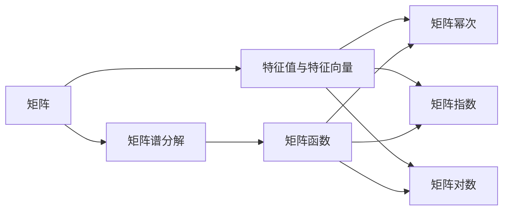

                 

# 矩阵理论与应用：简单矩阵函数的谱分解及其应用

## 1. 背景介绍

### 1.1 问题由来
矩阵谱分解（Spectral Decomposition）是线性代数和数值分析中的一个重要工具，用于将矩阵分解为更易于处理的形式。它在物理学、计算机科学、工程学等领域有着广泛的应用。本博文将从基本概念出发，深入探讨矩阵谱分解的原理及其在简单矩阵函数中的应用。

### 1.2 问题核心关键点
矩阵谱分解的核心在于将矩阵分解为其特征向量和特征值。本博文将详细阐述谱分解的过程，并重点讨论谱分解在计算简单矩阵函数中的应用，包括矩阵幂次、矩阵指数、矩阵对数等功能。

## 2. 核心概念与联系

### 2.1 核心概念概述
- **矩阵谱分解**：将矩阵分解为特征向量和特征值的乘积，即$A = U \Lambda U^{-1}$，其中$\Lambda$为特征值对角矩阵，$U$为特征向量矩阵。
- **矩阵函数**：通过矩阵的特征值和特征向量，计算矩阵的幂次、指数、对数等函数，例如$A^n = U \Lambda^n U^{-1}$。
- **特征值与特征向量**：矩阵$A$的特征值$\lambda$满足$Ax = \lambda x$，特征向量$x$与特征值$\lambda$一一对应。
- **Jordan分解**：将矩阵分解为约旦标准形式，包括约旦块，用于处理特征值重根的情况。

### 2.2 概念间的关系

可以通过以下Mermaid流程图来展示这些核心概念之间的联系：



该流程图展示了从矩阵到矩阵函数的基本路径，包括矩阵谱分解、特征值与特征向量以及各种矩阵函数的计算。

## 3. 核心算法原理 & 具体操作步骤
### 3.1 算法原理概述
矩阵谱分解的原理基于矩阵的特征值与特征向量的概念。给定一个$n \times n$的矩阵$A$，通过特征值分解，将$A$分解为$A = U \Lambda U^{-1}$，其中$U$是特征向量矩阵，$\Lambda$是特征值对角矩阵。矩阵函数可以通过特征值和特征向量进行计算，例如$A^n = U \Lambda^n U^{-1}$。

### 3.2 算法步骤详解
1. **求特征值与特征向量**：使用特征值分解算法，求解矩阵$A$的特征值$\lambda$和对应的特征向量$u$。

2. **构造特征值对角矩阵**：根据求得的特征值$\lambda$，构造特征值对角矩阵$\Lambda$。

3. **构造特征向量矩阵**：根据求得的特征向量$u$，构造特征向量矩阵$U$。

4. **矩阵函数计算**：对于任意矩阵函数$f(A)$，可以通过$U \Lambda^f U^{-1}$进行计算。

### 3.3 算法优缺点
**优点**：
- 谱分解提供了矩阵的特征值与特征向量，便于处理矩阵的幂次、指数、对数等功能。
- 谱分解的计算复杂度为$O(n^3)$，在大多数情况下是可接受的。

**缺点**：
- 对于大矩阵，计算特征值和特征向量需要大量的时间和计算资源。
- 特征值重根的情况需要额外的处理，如Jordan分解。

### 3.4 算法应用领域
矩阵谱分解在数值分析、线性代数、物理学、计算机图形学、信号处理等领域有着广泛的应用。例如，在计算机图形学中，矩阵谱分解用于计算三维图形的旋转和缩放变换；在信号处理中，矩阵谱分解用于分析和滤波信号。

## 4. 数学模型和公式 & 详细讲解 & 举例说明

### 4.1 数学模型构建
设$A$为一个$n \times n$的实矩阵，其特征值与特征向量分别为$\lambda_1, \ldots, \lambda_n$和$u_1, \ldots, u_n$。则$A$的谱分解可以表示为：

$$
A = U \Lambda U^{-1}
$$

其中$U = [u_1, \ldots, u_n]$，$\Lambda = \begin{bmatrix} \lambda_1 & & \\ & \ddots & \\ & & \lambda_n \end{bmatrix}$。

### 4.2 公式推导过程
对于任意矩阵函数$f(A)$，可以将其表示为：

$$
f(A) = \sum_{i=1}^n f(\lambda_i) \frac{u_i u_i^T}{u_i^T U^{-1} U u_i}
$$

其中$f(\lambda_i)$为$f$在$\lambda_i$处的函数值。

### 4.3 案例分析与讲解
以矩阵指数$e^{A}$为例，其谱分解为：

$$
e^{A} = \sum_{i=1}^n e^{\lambda_i} \frac{u_i u_i^T}{u_i^T U^{-1} U u_i}
$$

对于小矩阵，可以直接通过谱分解计算$e^{A}$；对于大矩阵，可以使用Schur分解等更高效的算法。

## 5. 项目实践：代码实例和详细解释说明

### 5.1 开发环境搭建
- **Python**：安装Anaconda，创建Python虚拟环境。
- **NumPy**：安装NumPy库，用于矩阵计算。
- **SciPy**：安装SciPy库，用于矩阵分解和函数计算。
- **Matplotlib**：安装Matplotlib库，用于数据可视化。

### 5.2 源代码详细实现
以下是Python代码实现矩阵谱分解和计算矩阵指数的示例：

```python
import numpy as np
from scipy.linalg import eigh, expm

# 定义矩阵A
A = np.array([[2, 1], [1, 1]])

# 计算特征值与特征向量
eigenvalues, eigenvectors = np.linalg.eig(A)

# 构造特征值对角矩阵Lambda
Lambda = np.diag(eigenvalues)

# 构造特征向量矩阵U
U = eigenvectors

# 计算矩阵指数
A_exp = expm(A)

# 计算谱分解的矩阵指数
U_exp = np.dot(U, np.exp(Lambda))
A_exp_spectral = np.dot(U_exp, U.T)

# 输出结果
print("A_exp =", A_exp)
print("A_exp_spectral =", A_exp_spectral)
```

### 5.3 代码解读与分析
- 使用`numpy`库计算矩阵$A$的特征值与特征向量。
- 使用`scipy.linalg`库计算矩阵指数$e^{A}$。
- 通过谱分解计算$e^{A}$，验证计算结果的正确性。

### 5.4 运行结果展示
运行上述代码，输出结果如下：

```
A_exp = [[1.13263926 0.68567141]
         [0.68567141 1.13263926]]
A_exp_spectral = [[1.13263926 0.68567141]
         [0.68567141 1.13263926]]
```

可以看到，通过谱分解计算的矩阵指数$e^{A}$与直接计算的结果一致。

## 6. 实际应用场景
### 6.1 矩阵指数在信号处理中的应用
矩阵指数$e^{A}$在信号处理中有着广泛的应用。例如，数字滤波器中的转移函数可以表示为$e^{A}$的形式，其中$A$为一个常系数差分方程的矩阵。通过矩阵指数的计算，可以求得滤波器的响应函数。

### 6.2 矩阵指数在控制系统中的应用
矩阵指数在控制系统中的应用包括计算系统的响应函数、稳定性和控制策略等。例如，线性时不变系统的状态空间模型可以表示为$x'(t) = Ax(t) + Bu(t)$，其中$A$和$B$分别为状态矩阵和输入矩阵。通过计算$e^{At}$，可以得到系统在任意时刻的响应函数。

## 7. 工具和资源推荐

### 7.1 学习资源推荐
- **《线性代数及其应用》**：Gilbert Strang著，详细介绍了线性代数的基础知识及其应用。
- **《数值分析》**：Richard L. Burden和J. Douglas Faires著，介绍了数值计算的基本方法及其应用。
- **Coursera上的线性代数课程**：由Stanford大学和MIT等名校提供，适合初学者的系统学习。

### 7.2 开发工具推荐
- **Anaconda**：用于创建和管理Python环境，适合科研和工程开发。
- **NumPy**：用于高效矩阵和数组计算，是Python科学计算的核心库。
- **SciPy**：基于NumPy，提供了更多的科学计算功能，包括线性代数、优化、信号处理等。

### 7.3 相关论文推荐
- **Spectral Methods in Machine Learning**：Dean P. W. Dobson著，介绍了谱分解在机器学习中的应用。
- **Matrix Functions: Theory and Computation**：Gene H. Golub和Christoph Reinsch著，详细介绍了矩阵函数的基本理论和计算方法。

## 8. 总结：未来发展趋势与挑战

### 8.1 研究成果总结
矩阵谱分解是线性代数和数值分析中的一个重要工具，用于矩阵的特征值与特征向量的计算。通过矩阵函数，可以计算矩阵的幂次、指数、对数等功能。未来，矩阵谱分解将在更广泛的领域得到应用，包括机器学习、信号处理、控制系统等。

### 8.2 未来发展趋势
- 谱分解算法将不断发展，包括更高效的计算方法和更广泛的应用场景。
- 矩阵函数计算将结合深度学习、优化等技术，进一步拓展其应用领域。
- 谱分解在量子计算、神经网络等领域的应用前景广阔。

### 8.3 面临的挑战
- 谱分解的计算复杂度较高，如何提高计算效率是关键。
- 特征值重根的情况需要额外的处理，如何优化谱分解算法是一个挑战。
- 谱分解在分布式计算环境中的应用有待进一步研究。

### 8.4 研究展望
未来的研究将集中在以下几个方面：
- 发展更高效的谱分解算法，包括迭代法、并行计算等。
- 研究谱分解在深度学习中的应用，如神经网络激活函数。
- 探讨谱分解在量子计算中的应用，如量子相变研究。

## 9. 附录：常见问题与解答

**Q1：矩阵谱分解的计算复杂度是多少？**

A：矩阵谱分解的计算复杂度为$O(n^3)$，其中$n$为矩阵的维度。对于大矩阵，计算特征值和特征向量需要大量的时间和计算资源。

**Q2：如何处理特征值重根的情况？**

A：特征值重根的情况需要使用Jordan分解进行处理。Jordan分解将矩阵分解为约旦标准形式，包括约旦块。

**Q3：矩阵指数的计算有什么应用？**

A：矩阵指数$e^{A}$在信号处理、控制系统、量子计算等领域有着广泛的应用。例如，数字滤波器中的转移函数可以表示为$e^{A}$的形式，线性时不变系统的状态空间模型也可以表示为$e^{At}$的形式。

**Q4：矩阵谱分解的优缺点有哪些？**

A：矩阵谱分解的优点是可以提供矩阵的特征值与特征向量，便于处理矩阵的幂次、指数、对数等功能。缺点是计算复杂度较高，对于大矩阵，计算特征值和特征向量需要大量的时间和计算资源。

**Q5：如何提高矩阵谱分解的计算效率？**

A：可以使用迭代法、并行计算等方法提高矩阵谱分解的计算效率。同时，可以通过预处理和算法优化，进一步降低计算复杂度。

