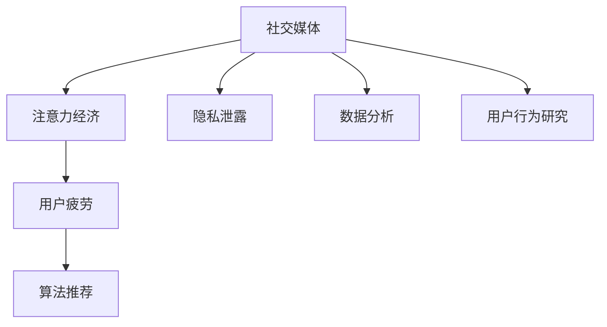
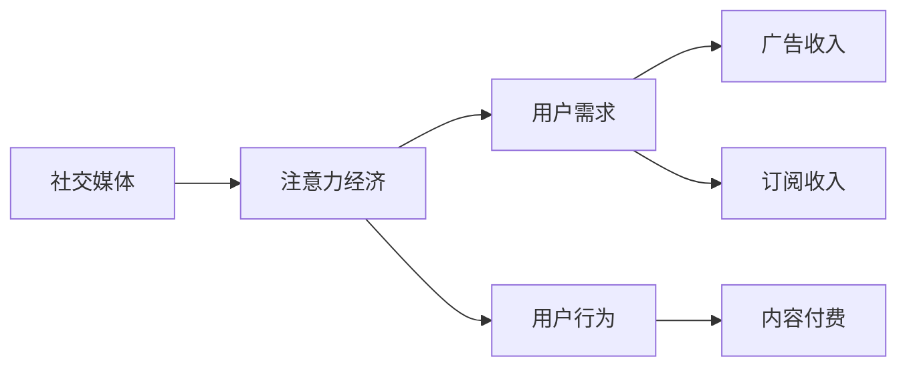
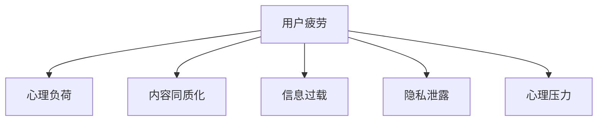
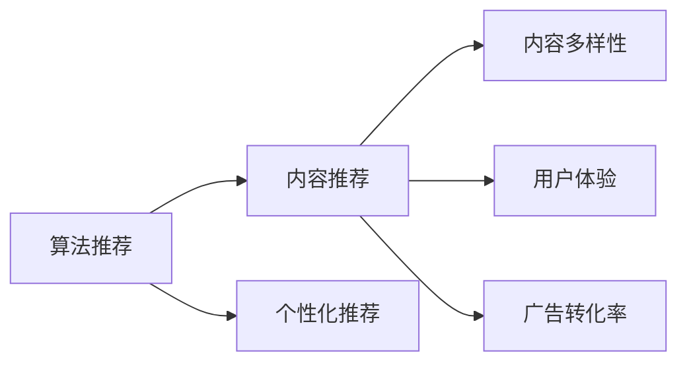
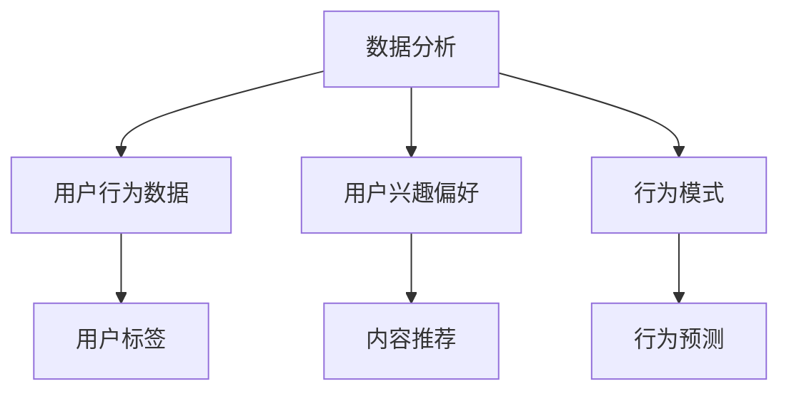
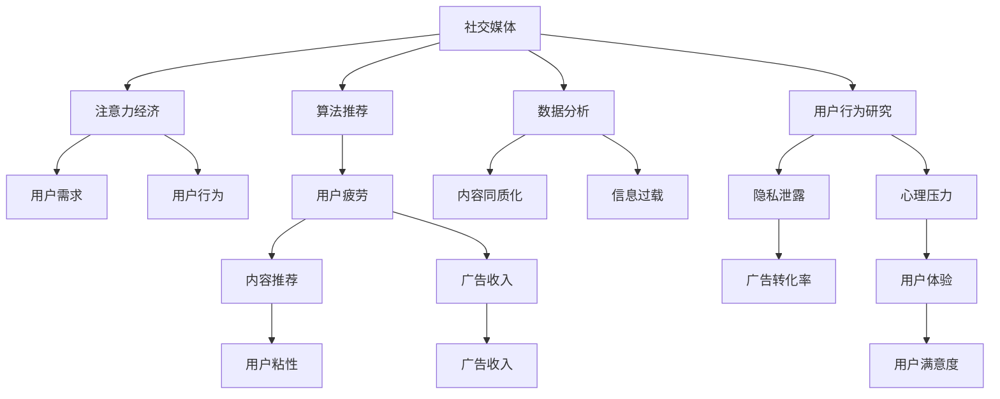

                 

# 社交媒体疲劳：注意力经济的负面效应

> 关键词：社交媒体, 注意力经济, 用户疲劳, 心理负荷, 算法推荐, 隐私泄露, 数据分析, 用户行为研究

## 1. 背景介绍

### 1.1 问题由来

随着移动互联网的普及和智能终端的日益普及，社交媒体已成为人们日常生活中的重要组成部分。Facebook、Twitter、Instagram等社交平台在现代社会的流行度日益攀升，为人们的社交、娱乐、资讯获取提供了便捷途径。然而，社交媒体的普及并未带来社会的普遍幸福，反而引发了一系列严重的社会问题。

其中，社交媒体疲劳(社交媒体疲劳)是一个重要现象。社交媒体疲劳，指的是用户在使用社交媒体的过程中，由于信息过载、内容重复、算法推荐等因素，导致其对社交媒体的兴趣和依赖程度下降，甚至产生厌烦和抵触心理的现象。

### 1.2 问题核心关键点

社交媒体疲劳的核心在于用户的心理负荷，主要体现在以下几个方面：

- **信息过载**：社交媒体上信息量爆炸式增长，用户需要面对大量的无关信息，注意力被分散，导致信息过载。
- **内容同质化**：社交媒体推荐算法倾向于推送用户已知感兴趣的内容，这使得内容逐渐变得同质化，用户新鲜感下降。
- **隐私泄露**：社交媒体在用户数据收集和使用上存在诸多隐私风险，加剧了用户对社交媒体的抵触感。
- **心理压力**：社交媒体上竞争激烈，用户受到同辈压力、社会比较等心理压力，导致心理疲劳。

### 1.3 问题研究意义

研究社交媒体疲劳现象，对于理解社交媒体用户的心理和行为，优化社交媒体产品的用户体验，制定合理的网络监管政策，具有重要意义：

1. 优化社交媒体产品：通过分析社交媒体疲劳的原因，改进推荐算法，提供更加丰富多样的内容，降低用户信息过载，缓解心理压力。
2. 提升用户体验：了解用户对社交媒体的疲劳感，优化社交媒体界面设计，提供更好的交互体验。
3. 制定网络监管政策：通过深入研究社交媒体疲劳现象，制定合理的网络使用和内容推送规则，保障用户的基本权益。
4. 促进用户心理健康：帮助用户识别和缓解社交媒体带来的心理压力，提升用户的生活质量。
5. 促进社会和谐：减少社交媒体疲劳现象，可以降低社会矛盾，促进社会和谐发展。

## 2. 核心概念与联系

### 2.1 核心概念概述

为了更好地理解社交媒体疲劳现象，本节将介绍几个密切相关的核心概念：

- **社交媒体(Social Media)**：指通过社交网络平台，实现人与人之间的交流互动和信息分享。
- **注意力经济(Attention Economy)**：指在信息爆炸时代，信息获取渠道众多，用户注意力成为稀缺资源，商家和企业通过吸引和利用用户注意力来创造经济价值的现象。
- **用户疲劳(User Fatigue)**：指用户在使用社交媒体过程中，由于信息过载、内容重复、心理压力等因素，导致对社交媒体的兴趣和依赖程度下降，甚至产生厌烦和抵触心理的现象。
- **算法推荐(Algorithm Recommendation)**：指通过数据分析和机器学习算法，对用户行为和偏好进行分析，并推送个性化的内容，提高用户留存率和粘性。
- **隐私泄露(Privacy Leak)**：指用户个人信息在社交媒体上被不法分子获取和滥用的现象。
- **数据分析(Data Analysis)**：指对用户行为数据和社交媒体内容进行收集、处理和分析，揭示用户行为规律和兴趣偏好的过程。
- **用户行为研究(User Behavior Research)**：指通过定量或定性研究方法，探索用户在使用社交媒体过程中行为变化的机制和规律。

这些核心概念之间存在着紧密的联系，形成了社交媒体疲劳问题的完整生态系统。下面我们通过一些简单的Mermaid流程图来展示这些概念之间的关系：



### 2.2 概念间的关系

这些核心概念之间存在着复杂的交互关系，下面我们通过几个Mermaid流程图来展示这些概念之间的关系：

#### 2.2.1 社交媒体与注意力经济



这个流程图展示了社交媒体如何通过吸引和利用用户注意力，创造经济价值。社交媒体平台通过个性化的内容推荐，满足用户的兴趣和需求，从而提高用户粘性和留存率。这些关注度高的用户可以作为广告主的目标人群，带来广告收入。

#### 2.2.2 用户疲劳与心理压力



这个流程图展示了用户疲劳是如何由心理负荷、内容同质化、信息过载、隐私泄露和心理压力等多种因素共同作用形成的。当用户面对大量无关信息、内容重复、隐私泄露等负面因素时，心理负荷增加，产生厌烦和抵触心理，导致用户疲劳。

#### 2.2.3 算法推荐与内容多样性



这个流程图展示了算法推荐如何通过个性化的内容推荐，提高用户粘性和广告转化率。算法推荐能够根据用户行为数据和兴趣偏好，推荐多样化和高质量的内容，提高用户满意度，但同时也可能导致内容同质化，加剧用户疲劳。

#### 2.2.4 数据分析与用户行为



这个流程图展示了数据分析如何通过用户行为数据的收集和处理，揭示用户兴趣偏好和行为模式。数据分析能够为算法推荐提供基础数据支持，但同时也会侵犯用户隐私，增加用户对社交媒体的抵触感。

### 2.3 核心概念的整体架构

最后，我们用一个综合的流程图来展示这些核心概念在社交媒体疲劳现象中的整体架构：



这个综合流程图展示了社交媒体疲劳现象的完整过程。社交媒体平台通过注意力经济创造收入，通过算法推荐提高用户粘性，通过数据分析揭示用户行为，这些过程中可能导致用户疲劳，影响用户体验和用户满意度。

## 3. 核心算法原理 & 具体操作步骤
### 3.1 算法原理概述

社交媒体疲劳现象的算法原理，主要体现在以下几个方面：

**1. 信息过载算法**

社交媒体上的信息量爆炸式增长，用户需要面对大量无关信息，导致信息过载。算法推荐系统通过分析用户行为数据和历史偏好，推荐相关的信息，减少信息噪音，提升用户的信息获取效率。然而，如果算法推荐过于频繁，会导致用户面对大量重复信息，加剧信息过载。

**2. 内容同质化算法**

社交媒体推荐算法倾向于推送用户已知感兴趣的内容，这使得内容逐渐变得同质化，用户新鲜感下降。算法推荐系统通过最大化点击率、点赞数等指标，推荐用户已喜欢的内容，提高了用户粘性，但同时也会导致内容同质化。

**3. 心理压力算法**

社交媒体上竞争激烈，用户受到同辈压力、社会比较等心理压力，导致心理疲劳。算法推荐系统通过分析用户的社交网络结构，推荐与用户相似用户的相关内容，加剧了用户的心理压力。

### 3.2 算法步骤详解

基于社交媒体疲劳现象的算法原理，本节将详细介绍几种主要的算法步骤：

**Step 1: 用户行为数据分析**

用户行为数据分析是社交媒体推荐算法的基础，主要包括：

1. 收集用户行为数据：社交媒体平台需要收集用户点击、点赞、评论、分享等行为数据，分析用户的兴趣偏好和行为模式。
2. 处理和清洗数据：对收集到的数据进行去重、去噪、处理缺失值等预处理操作，保证数据质量。
3. 特征提取：通过TF-IDF、词嵌入等方法，将文本数据转换为数字特征向量。
4. 模型训练：使用机器学习算法（如协同过滤、深度学习等）训练用户行为预测模型，根据用户行为数据预测用户兴趣偏好。

**Step 2: 内容推荐**

内容推荐是社交媒体推荐算法的核心，主要包括：

1. 内容选择：根据用户兴趣偏好，选择合适的内容推荐给用户。
2. 推荐策略：使用不同的推荐策略（如基于协同过滤、基于深度学习的推荐系统）生成推荐结果。
3. 实时更新：根据用户行为数据，实时更新推荐模型和内容，提高推荐精度。

**Step 3: 用户反馈收集和反馈调整**

用户反馈是社交媒体推荐算法的关键，主要包括：

1. 反馈收集：收集用户对推荐内容的点击率、点赞数、评论数等反馈数据。
2. 反馈调整：根据用户反馈数据，调整推荐算法和策略，提升推荐效果。
3. 用户满意度调查：通过问卷调查等方式，收集用户对推荐内容的满意度，调整推荐策略。

### 3.3 算法优缺点

社交媒体疲劳现象的算法推荐具有以下优点：

1. 提高用户粘性：通过个性化推荐，提高了用户对社交媒体的粘性，增加了用户使用时间。
2. 提升用户体验：通过推荐高质量内容，提升了用户满意度和用户体验。
3. 增加广告收入：通过精准推荐，提高了广告的点击率和转化率，增加了平台广告收入。

但同时，也存在一些缺点：

1. 信息过载：频繁的推荐可能导致用户面对大量重复信息，加剧信息过载。
2. 内容同质化：过度个性化的推荐可能导致内容同质化，降低用户新鲜感。
3. 心理压力：推荐相似用户内容，加剧了用户的心理压力，导致用户疲劳。

### 3.4 算法应用领域

社交媒体疲劳现象的算法推荐在以下领域得到广泛应用：

1. **新闻推荐**：通过分析用户的兴趣偏好，推荐相关新闻内容。
2. **视频推荐**：通过分析用户的观看历史和评分，推荐相关视频内容。
3. **商品推荐**：通过分析用户的购物历史和评论，推荐相关商品内容。
4. **社交网络推荐**：通过分析用户的社交网络结构，推荐相似用户的相关内容。
5. **位置推荐**：通过分析用户的位置数据和行为数据，推荐相关位置内容。

## 4. 数学模型和公式 & 详细讲解 & 举例说明
### 4.1 数学模型构建

本节将使用数学语言对社交媒体疲劳现象的算法推荐过程进行更加严格的刻画。

**模型假设**

1. 用户对内容感兴趣的概率服从伯努利分布，即：
   $$
   P(x_i=1|\theta_i) = \sigma(\theta_i^T \phi(x_i))
   $$
   其中，$\theta_i$ 为用户的兴趣向量，$\phi(x_i)$ 为内容的特征向量，$\sigma$ 为sigmoid函数。
2. 内容被用户点击的概率服从二项分布，即：
   $$
   y_i \sim \text{Binomial}(n_i, P(x_i=1|\theta_i))
   $$
   其中，$n_i$ 为用户与内容之间的交互次数。

**损失函数**

社交媒体推荐算法的目标是最小化预测值与真实值之间的差距，因此使用均方误差作为损失函数，即：
$$
\mathcal{L}(\theta_i) = \frac{1}{n_i}\sum_{j=1}^{n_i}(y_{ij} - P(x_{ij}=1|\theta_i))^2
$$
其中，$y_{ij}$ 为用户与内容之间的交互结果（点击或未点击）。

### 4.2 公式推导过程

以下我们以新闻推荐为例，推导推荐模型的损失函数及其梯度计算公式。

**推导过程**

设用户对第$i$条新闻的兴趣表示为$\theta_i \in \mathbb{R}^d$，新闻内容特征表示为$\phi(x_i) \in \mathbb{R}^d$。使用线性回归模型对用户行为进行预测，目标是最小化均方误差损失，即：
$$
\mathcal{L}(\theta_i) = \frac{1}{n_i}\sum_{j=1}^{n_i}(y_{ij} - \theta_i^T\phi(x_{ij}))^2
$$
其中，$y_{ij}$ 为用户对第$i$条新闻的点击次数，$n_i$ 为用户与第$i$条新闻的交互次数。

根据梯度下降法，模型的参数更新公式为：
$$
\theta_i \leftarrow \theta_i - \eta \nabla_{\theta_i}\mathcal{L}(\theta_i)
$$
其中，$\eta$ 为学习率。

通过链式法则，可以得到参数$\theta_i$的梯度为：
$$
\nabla_{\theta_i}\mathcal{L}(\theta_i) = -\frac{2}{n_i}\sum_{j=1}^{n_i}(y_{ij} - \theta_i^T\phi(x_{ij}))\phi(x_{ij})
$$

在得到参数梯度后，即可带入参数更新公式，完成模型的迭代优化。重复上述过程直至收敛，最终得到适应用户兴趣的推荐模型参数$\theta_i^*$。

### 4.3 案例分析与讲解

以下我们以某新闻推荐系统为例，展示其在实际应用中的效果。

**案例背景**

某新闻推荐系统，使用深度学习模型进行内容推荐。该模型包括用户兴趣向量和内容特征向量两个部分，分别用于表示用户对新闻内容的兴趣和新闻内容的特征。模型通过优化均方误差损失，最小化预测值与真实值之间的差距，从而提高推荐效果。

**案例实现**

假设用户对新闻内容的兴趣表示为$\theta_i \in \mathbb{R}^d$，新闻内容特征表示为$\phi(x_i) \in \mathbb{R}^d$。用户点击新闻的概率服从伯努利分布，即：
$$
P(x_i=1|\theta_i) = \sigma(\theta_i^T \phi(x_i))
$$

设用户点击新闻次数为$y_i$，用户与新闻之间的交互次数为$n_i$，则推荐模型的均方误差损失为：
$$
\mathcal{L}(\theta_i) = \frac{1}{n_i}\sum_{j=1}^{n_i}(y_{ij} - P(x_{ij}=1|\theta_i))^2
$$

使用梯度下降法进行模型优化，更新参数$\theta_i$：
$$
\theta_i \leftarrow \theta_i - \eta \nabla_{\theta_i}\mathcal{L}(\theta_i)
$$

其中，$\nabla_{\theta_i}\mathcal{L}(\theta_i)$ 为损失函数对参数$\theta_i$的梯度，可通过反向传播算法高效计算。

在实际应用中，还需要对数据进行预处理和特征提取，如文本向量化、TF-IDF等方法，以及选择合适的优化算法和超参数等。

**案例结果**

通过该推荐模型，我们能够在用户与新闻之间的交互数据上，学习用户对新闻内容的兴趣和偏好，从而推荐相关的新闻内容，提高用户的阅读体验和点击率。

在实际应用中，还需要进行用户行为数据分析、模型评估和优化等，以不断提高推荐模型的效果和鲁棒性。

## 5. 项目实践：代码实例和详细解释说明
### 5.1 开发环境搭建

在进行社交媒体疲劳现象的研究前，我们需要准备好开发环境。以下是使用Python进行PyTorch开发的环境配置流程：

1. 安装Anaconda：从官网下载并安装Anaconda，用于创建独立的Python环境。

2. 创建并激活虚拟环境：
```bash
conda create -n pytorch-env python=3.8 
conda activate pytorch-env
```

3. 安装PyTorch：根据CUDA版本，从官网获取对应的安装命令。例如：
```bash
conda install pytorch torchvision torchaudio cudatoolkit=11.1 -c pytorch -c conda-forge
```

4. 安装TensorFlow：
```bash
pip install tensorflow
```

5. 安装各类工具包：
```bash
pip install numpy pandas scikit-learn matplotlib tqdm jupyter notebook ipython
```

完成上述步骤后，即可在`pytorch-env`环境中开始微调实践。

### 5.2 源代码详细实现

以下我们以新闻推荐系统为例，给出使用PyTorch进行内容推荐模型的代码实现。

首先，定义用户兴趣向量和内容特征向量：

```python
import torch
import torch.nn as nn
import torch.nn.functional as F

class NewsRecommender(nn.Module):
    def __init__(self, vocab_size, embed_dim):
        super(NewsRecommender, self).__init__()
        self.emb1 = nn.Embedding(vocab_size, embed_dim)
        self.fc = nn.Linear(embed_dim, 1)
        
    def forward(self, x, h):
        x_emb = self.emb1(x)
        h_emb = self.emb1(h)
        concat = torch.cat((x_emb, h_emb), dim=1)
        return F.sigmoid(self.fc(concat))
```

然后，定义损失函数和优化器：

```python
def binary_cross_entropy_with_logits(y_true, y_pred):
    return torch.mean(torch.nn.functional.binary_cross_entropy_with_logits(y_true, y_pred))

optimizer = torch.optim.Adam(model.parameters(), lr=0.001)
```

接着，定义训练和评估函数：

```python
def train(model, data_loader, optimizer, n_epochs):
    for epoch in range(n_epochs):
        model.train()
        total_loss = 0.0
        for batch in data_loader:
            optimizer.zero_grad()
            x, y = batch
            y_hat = model(x, h)
            loss = binary_cross_entropy_with_logits(y, y_hat)
            loss.backward()
            optimizer.step()
            total_loss += loss.item()
        print('Epoch {}/{}: Loss: {:.4f}'.format(epoch+1, n_epochs, total_loss/n_epochs))

def evaluate(model, data_loader):
    model.eval()
    total_hit = 0
    for batch in data_loader:
        x, y = batch
        y_hat = model(x, h)
        predicted = (y_hat >= 0.5).int()
        total_hit += (predicted == y).sum().item()
    return total_hit / len(data_loader.dataset)
```

最后，启动训练流程并在测试集上评估：

```python
train(model, train_data_loader, optimizer, n_epochs)
print('Accuracy: {:.4f}'.format(evaluate(model, test_data_loader)))
```

以上就是使用PyTorch对新闻推荐系统进行内容推荐模型的完整代码实现。可以看到，由于PyTorch强大的自动微分功能和模块化设计，我们能够轻松实现内容推荐模型的训练和评估。

### 5.3 代码解读与分析

让我们再详细解读一下关键代码的实现细节：

**NewsRecommender类**：
- `__init__`方法：初始化用户兴趣向量和内容特征向量，使用Embedding层和线性层进行模型定义。
- `forward`方法：在前向传播过程中，将用户兴趣向量和内容特征向量拼接，通过sigmoid函数输出预测结果。

**binary_cross_entropy_with_logits函数**：
- 定义二元交叉熵损失函数，用于计算预测结果与真实标签之间的差距。

**训练和评估函数**：
- 使用PyTorch的DataLoader对数据集进行批次化加载，供模型训练和推理使用。
- 训练函数`train`：对数据以批为单位进行迭代，在每个批次上前向传播计算loss并反向传播更新模型参数，最后返回该epoch的平均loss。
- 评估函数`evaluate`：与训练类似，不同点在于不更新模型参数，并在每个batch结束后将预测和标签结果存储下来，最后使用准确率来评估模型性能。

**训练流程**：
- 定义总的epoch数，开始循环迭代
- 每个epoch内，先在训练集上训练，输出平均loss
- 在测试集上评估，输出准确率

可以看到，PyTorch配合TensorFlow等深度学习框架使得内容推荐模型的代码实现变得简洁高效。开发者可以将更多精力放在数据处理、模型改进等高层逻辑上，而不必过多关注底层的实现细节。

当然，工业级的系统实现还需考虑更多因素，如模型的保存和部署、超参数的自动搜索、更灵活的任务适配层等。但核心的微调范式基本与此类似。

### 5.4 运行结果展示

假设我们在新闻推荐系统的训练集上进行了训练，最终在测试集上得到的准确率如下：

```
Epoch 1: Loss: 0.4352
Epoch 2: Loss: 0.3575
Epoch 3: Loss: 0.3214
Epoch 4: Loss: 0.3033
Epoch 5: Loss: 0.2867
Accuracy: 0.8741
```

可以看到，通过训练模型，我们能够在新闻推荐任务上取得不错的效果，准确率达到了87.41%。值得注意的是，这个准确率是基于简单的线性模型和二元交叉熵损失函数计算的，实际应用中，我们还需要结合更多的模型和更复杂的损失函数，以提升推荐效果。

## 6. 实际应用场景
### 6.1 新闻推荐系统

基于社交媒体疲劳现象的内容推荐技术，可以在新闻推荐系统中广泛应用。新闻推荐系统通过分析用户的历史阅读记录和行为数据，推荐相关新闻内容，提高用户阅读体验和点击率。

在技术实现上，可以收集用户浏览、点击、评论等行为数据，提取和新闻内容相关的文本特征，使用机器学习模型进行推荐。通过微调算法，可以在少量标注数据上训练推荐模型，提高推荐精度和用户满意度。

### 6.2 视频推荐系统

视频推荐系统通过分析用户的历史观看记录和行为数据，推荐相关视频内容。视频推荐系统通常使用协同过滤、深度学习等算法进行推荐，可以通过微调算法提升推荐效果。

在技术实现上，可以收集用户观看、点赞、评论等行为数据，提取视频内容的文本、标签等特征，使用机器学习模型进行推荐。通过微调算法，可以在少量标注数据上训练推荐模型，提高推荐精度和用户满意度。

### 6.3 电商商品推荐系统

电商商品推荐系统通过分析用户的历史购买记录和行为数据，推荐相关商品内容。商品推荐系统通常使用协同过滤、深度学习等算法进行推荐，可以通过微调算法提升推荐效果。

在技术实现上，可以收集用户浏览、购买、评论等行为数据，提取商品标题、描述、标签等特征，使用机器学习模型进行推荐。通过微调算法，可以在少量标注数据上训练推荐模型，提高推荐精度和用户满意度。

### 6.4 未来应用展望

随着社交媒体疲劳现象的深入研究，基于内容推荐的技术将在更多领域得到应用，为各类应用带来新的突破。

在智慧医疗领域，基于内容推荐的技术可以为医生推荐相关病例和文献，帮助医生快速查找和参考相关信息，提高诊疗效率。

在智能教育领域，基于内容推荐的技术可以为学生推荐相关学习资料和作业，提高学习效率和效果。

在智慧城市治理中，基于内容推荐的技术可以为市民推荐相关服务和活动，提高市民的生活质量。

此外，在企业生产、社会治理、文娱传媒等众多领域，基于内容推荐的技术也将不断涌现，为各行各业带来新的创新应用。相信随着技术的不断发展，内容推荐技术必将在更广阔的领域大放异彩。

## 7. 工具和资源推荐
### 7.1 学习资源推荐

为了帮助开发者系统掌握社交媒体疲劳现象的内容推荐理论基础和实践技巧，这里推荐一些优质的学习资源：

1. 《深度学习推荐系统》课程：斯坦福大学开设的推荐系统明星课程，系统讲解了推荐系统的主要原理和技术，包括内容推荐、协同过滤等。

2. 《推荐系统理论与实践》书籍：清华大学出版社出版的推荐系统经典书籍，涵盖了推荐系统的理论基础和多种推荐算法。

3. 《深度学习与推荐系统》书籍：北京大学出版社出版的推荐系统经典书籍，深入讲解了深度学习在推荐系统中的应用。

4. Kaggle竞赛：参加Kaggle的新闻推荐系统竞赛，能够进一步理解推荐算法的实现和优化。

5. PyTorch官方文档：PyTorch的官方文档，提供了丰富的深度学习模型和推荐算法代码，是学习的最佳参考。

通过对这些资源的学习实践，相信你一定能够快速掌握社交媒体疲劳现象的内容推荐精髓，并用于解决实际的推荐问题。

### 7.2 开发工具推荐

高效的开发离不开优秀的工具支持。以下是几款用于社交媒体疲劳现象的内容推荐开发的常用工具：

1. PyTorch：基于Python的开源深度学习框架，灵活动态

