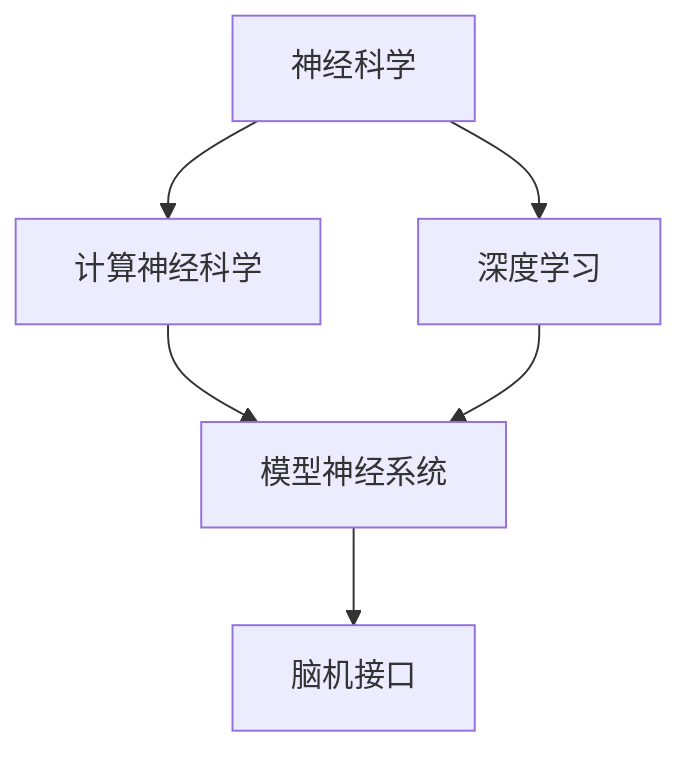
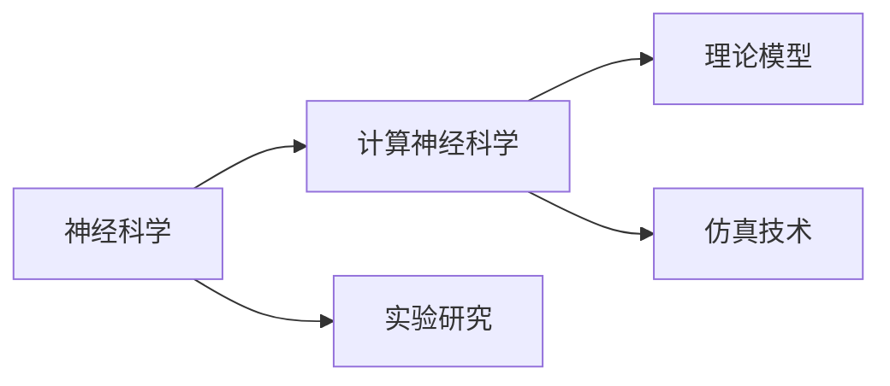
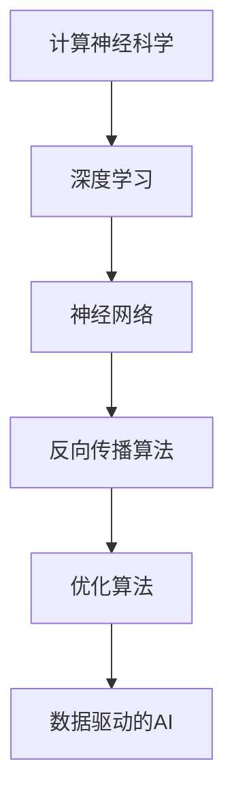
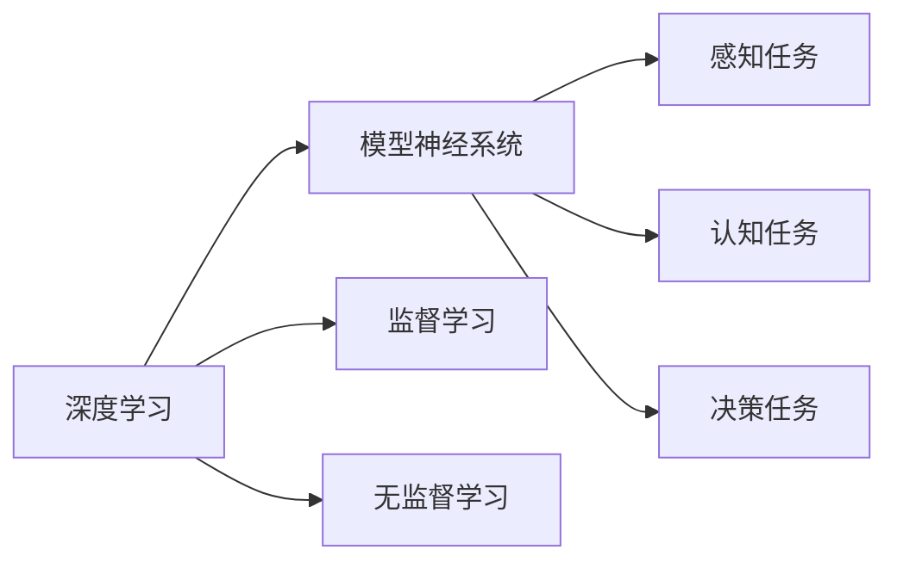
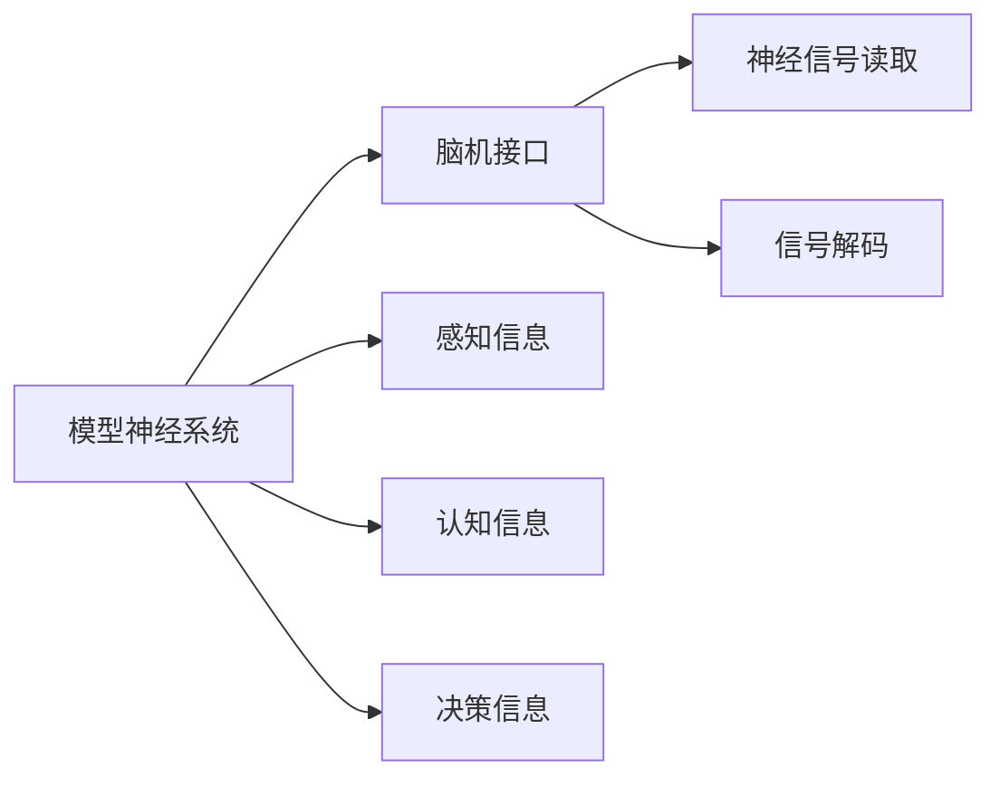
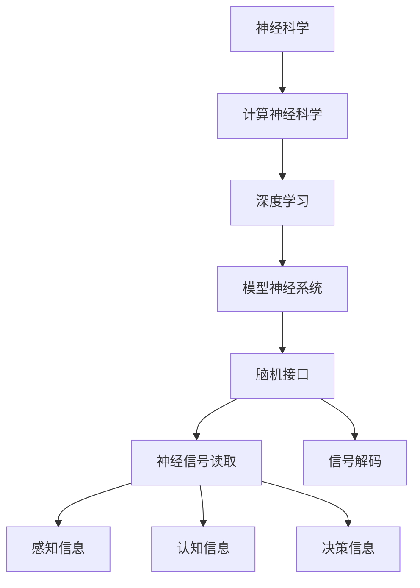

                 

# 神经科学启发的AI:借鉴大脑工作原理

> 关键词：神经科学, 人工智能, 仿生学, 计算神经科学, 模型神经系统

## 1. 背景介绍

### 1.1 问题由来
随着人工智能（AI）的迅猛发展，特别是深度学习在计算机视觉、自然语言处理等领域的卓越表现，人类越来越迫切地希望通过生物学特别是神经科学的视角来理解和学习AI的计算原理。脑科学家、神经科学家和AI研究人员正在尝试以更加根本的方式理解AI，从而推动技术进步，探索智能的起源。因此，本文聚焦于神经科学如何启发AI，特别是在模仿大脑结构和功能的基础上，开发出更加智能和高效的人工智能系统。

### 1.2 问题核心关键点
神经科学启发的AI，即通过借鉴大脑的工作原理来设计AI系统。这种仿生学方法的核心在于以下几个关键点：
1. **结构启发**：模仿大脑的神经元连接模式，构建高效、可扩展的神经网络。
2. **功能启发**：借鉴大脑的学习机制和信息处理方式，设计更智能的算法和模型。
3. **功能-结构协同**：实现硬件与软件的紧密结合，提升AI系统的性能和效率。
4. **实验验证**：通过生物学实验来验证AI模型的有效性和适用性。

这些关键点相互交织，共同构成了神经科学启发AI的完整框架。理解这些关键点有助于我们深入探索如何更好地将生物学的洞见应用于AI系统。

### 1.3 问题研究意义
神经科学启发AI的研究具有深远的意义：
1. **促进跨学科融合**：促进神经科学、计算科学和工程学的交叉融合，推动AI技术的发展。
2. **提升AI性能**：借助神经科学理论，可以设计出更加高效、智能的AI算法和模型。
3. **探索智能本质**：通过模仿大脑机制，可以更深入地理解智能的起源和本质。
4. **促进伦理和安全性**：更好的理解和控制AI系统，有助于解决AI应用中的伦理和安全性问题。

## 2. 核心概念与联系

### 2.1 核心概念概述

为更好地理解神经科学如何启发AI，本节将介绍几个关键概念：

- **神经科学**：研究神经系统如何工作，特别是大脑如何处理信息、学习、适应环境。
- **计算神经科学**：将神经科学原理应用于计算机科学，开发能够模拟大脑功能的人工智能系统。
- **模型神经系统**：使用神经网络模型来模拟大脑的结构和功能，特别是在处理感知、认知、决策等方面的应用。
- **深度学习**：一种基于人工神经网络的机器学习技术，能够自动学习和提取数据特征。
- **脑机接口（BCI）**：通过技术手段，使计算机能够读取和解释脑电信号，实现人脑与计算机的直接交互。

这些概念之间的联系可以通过以下Mermaid流程图来展示：



这个流程图展示了大脑和AI系统之间的紧密联系：
- 神经科学为计算神经科学提供理论基础，推动其发展和应用。
- 深度学习作为计算神经科学的重要实现手段，能够模拟大脑的信息处理方式。
- 模型神经系统借鉴大脑结构，提升AI系统的表现力。
- 脑机接口则是实现人脑与计算机直接交互的桥梁。

### 2.2 概念间的关系

这些核心概念之间存在着紧密的联系，形成了神经科学启发AI的完整生态系统。下面我们通过几个Mermaid流程图来展示这些概念之间的关系。

#### 2.2.1 神经科学与计算神经科学的关系



这个流程图展示了神经科学和计算神经科学的基本关系。神经科学通过实验研究，提出大脑的工作原理，而计算神经科学则基于这些原理，构建理论模型和仿真技术，开发出模拟大脑功能的AI系统。

#### 2.2.2 计算神经科学与深度学习的关系



这个流程图展示了计算神经科学与深度学习的关系。深度学习利用神经网络模型，模拟大脑的信息处理方式，并通过反向传播算法和优化算法，不断训练和优化模型，从而实现数据驱动的AI。

#### 2.2.3 深度学习与模型神经系统的作用



这个流程图展示了深度学习在模型神经系统中的应用。深度学习通过监督学习、无监督学习等方法，训练模型神经系统，以处理感知、认知、决策等复杂任务。

#### 2.2.4 模型神经系统与脑机接口的结合



这个流程图展示了模型神经系统与脑机接口的结合。脑机接口读取神经信号，解码为计算机可以理解的信息，模型神经系统则将这些信息用于感知、认知、决策等任务。

### 2.3 核心概念的整体架构

最后，我们用一个综合的流程图来展示这些核心概念在大脑和AI系统中的整体架构：



这个综合流程图展示了从神经科学原理到AI系统构建的全过程。神经科学通过实验研究大脑机制，计算神经科学借鉴这些机制构建深度学习模型，模型神经系统在深度学习的基础上处理感知、认知、决策等任务，脑机接口实现了人脑与计算机的直接交互，从而形成了一个完整的生态系统。

## 3. 核心算法原理 & 具体操作步骤
### 3.1 算法原理概述

神经科学启发的AI系统设计原理主要包括以下几个方面：

- **结构仿生**：通过模仿大脑的神经元连接模式，构建神经网络结构。
- **功能仿生**：借鉴大脑的学习机制和信息处理方式，设计算法和模型。
- **功能-结构协同**：实现硬件与软件的紧密结合，提升系统的性能和效率。
- **跨学科融合**：结合神经科学、计算科学和工程学的知识，进行系统设计和优化。

### 3.2 算法步骤详解

以下是神经科学启发AI系统设计的一般步骤：

**Step 1: 理解大脑机制**
- 通过神经科学实验和理论研究，理解大脑的神经元连接模式、信息处理机制和学习机制。

**Step 2: 构建模型神经系统**
- 根据大脑机制，设计神经网络结构，如卷积神经网络（CNN）、递归神经网络（RNN）等。
- 引入高级神经网络模型，如长短期记忆网络（LSTM）、门控循环单元（GRU）等，提升模型处理复杂任务的能力。

**Step 3: 实现算法功能**
- 借鉴大脑的学习机制，如反向传播算法、监督学习和无监督学习等，实现神经网络模型的训练和优化。
- 引入正则化、梯度下降、反向传播等算法，防止过拟合，提升模型的泛化能力。

**Step 4: 软件与硬件结合**
- 使用FPGA、ASIC等硬件加速技术，优化神经网络模型的计算和推理过程。
- 开发高效的计算图和编译器，提升神经网络系统的性能和效率。

**Step 5: 实验验证**
- 在生物学实验中验证AI系统的有效性，如使用神经刺激技术模拟大脑活动。
- 进行模拟实验，验证AI系统在不同场景下的表现，并进行优化和改进。

### 3.3 算法优缺点

神经科学启发AI系统设计具有以下优点：
1. **高效性能**：模仿大脑的神经元连接模式和信息处理方式，能够实现高效的信息处理。
2. **泛化能力强**：借鉴大脑的学习机制，提升模型的泛化能力和适应性。
3. **跨学科融合**：结合神经科学、计算科学和工程学的知识，实现更全面的系统设计。

同时，也存在以下缺点：
1. **复杂度高**：神经网络结构复杂，训练和优化难度大。
2. **资源消耗大**：大规模神经网络需要大量的计算资源和时间。
3. **解释性不足**：神经网络模型通常缺乏可解释性，难以理解和调试。

### 3.4 算法应用领域

神经科学启发AI系统设计在以下几个领域中有着广泛的应用：

- **计算机视觉**：用于图像分类、目标检测、人脸识别等任务。
- **自然语言处理**：用于文本分类、情感分析、机器翻译等任务。
- **机器人学**：用于机器人视觉、运动控制和决策制定。
- **医疗诊断**：用于医学图像分析、疾病预测和个性化治疗。
- **智能制造**：用于工业机器人、质量控制和设备监测。

这些领域都通过神经科学启发AI系统设计，实现了高效、智能的信息处理和决策能力。

## 4. 数学模型和公式 & 详细讲解 & 举例说明

### 4.1 数学模型构建

神经科学启发AI系统设计的数学模型构建主要基于神经元模型和神经网络模型。以下是一个简单的神经元模型：

$$
y = f(\sum_{i=1}^n w_i x_i + b)
$$

其中，$y$ 为神经元输出，$x_i$ 为输入，$w_i$ 为权重，$b$ 为偏置，$f$ 为激活函数，如sigmoid、ReLU等。

### 4.2 公式推导过程

以神经元模型为例，推导其激活函数和梯度计算公式。

假设激活函数为sigmoid函数：

$$
f(x) = \frac{1}{1 + e^{-x}}
$$

则神经元的输出为：

$$
y = f(\sum_{i=1}^n w_i x_i + b) = \frac{1}{1 + e^{-(\sum_{i=1}^n w_i x_i + b)}}
$$

神经元的梯度计算公式为：

$$
\frac{\partial L}{\partial w_i} = \frac{\partial L}{\partial y} \frac{\partial y}{\partial x_i} = \frac{\partial L}{\partial y} \frac{\partial f}{\partial z} \frac{\partial z}{\partial x_i} = \frac{\partial L}{\partial y} f'(z) w_i
$$

其中，$L$ 为损失函数，$z = \sum_{i=1}^n w_i x_i + b$，$f'(z) = f(z) (1 - f(z))$ 为激活函数的导数。

### 4.3 案例分析与讲解

以图像分类任务为例，分析神经元模型和神经网络模型的应用。

**Step 1: 神经元模型设计**
- 假设输入为28x28的灰度图像，输出为10个类别的概率分布。
- 使用多个神经元进行特征提取和分类。

**Step 2: 神经网络模型设计**
- 使用卷积神经网络（CNN）进行特征提取，提取图像的局部特征。
- 使用全连接层进行分类，将局部特征映射到类别概率。

**Step 3: 模型训练和优化**
- 使用反向传播算法和梯度下降优化模型参数。
- 引入正则化技术和dropout，防止过拟合。

**Step 4: 实验验证**
- 在生物学实验中验证模型有效性，如使用神经刺激技术模拟大脑活动。

## 5. 项目实践：代码实例和详细解释说明
### 5.1 开发环境搭建

在进行神经科学启发AI系统设计实践前，我们需要准备好开发环境。以下是使用Python进行PyTorch开发的环境配置流程：

1. 安装Anaconda：从官网下载并安装Anaconda，用于创建独立的Python环境。

2. 创建并激活虚拟环境：
```bash
conda create -n pytorch-env python=3.8 
conda activate pytorch-env
```

3. 安装PyTorch：根据CUDA版本，从官网获取对应的安装命令。例如：
```bash
conda install pytorch torchvision torchaudio cudatoolkit=11.1 -c pytorch -c conda-forge
```

4. 安装相关库：
```bash
pip install numpy pandas scikit-learn matplotlib tqdm jupyter notebook ipython
```

完成上述步骤后，即可在`pytorch-env`环境中开始项目实践。

### 5.2 源代码详细实现

这里我们以图像分类任务为例，给出使用PyTorch进行卷积神经网络（CNN）模型的代码实现。

```python
import torch
import torch.nn as nn
import torch.optim as optim
from torchvision import datasets, transforms

# 定义CNN模型
class CNN(nn.Module):
    def __init__(self):
        super(CNN, self).__init__()
        self.conv1 = nn.Conv2d(1, 32, kernel_size=3, stride=1, padding=1)
        self.conv2 = nn.Conv2d(32, 64, kernel_size=3, stride=1, padding=1)
        self.pool = nn.MaxPool2d(kernel_size=2, stride=2)
        self.fc1 = nn.Linear(64*7*7, 128)
        self.fc2 = nn.Linear(128, 10)
        self.relu = nn.ReLU()
    
    def forward(self, x):
        x = self.relu(self.conv1(x))
        x = self.pool(x)
        x = self.relu(self.conv2(x))
        x = self.pool(x)
        x = x.view(-1, 64*7*7)
        x = self.relu(self.fc1(x))
        x = self.fc2(x)
        return x

# 加载数据集
train_dataset = datasets.MNIST(root='./data', train=True, transform=transforms.ToTensor(), download=True)
test_dataset = datasets.MNIST(root='./data', train=False, transform=transforms.ToTensor(), download=True)

# 定义训练函数
def train_epoch(model, train_loader, optimizer, criterion):
    model.train()
    losses = []
    for images, labels in train_loader:
        optimizer.zero_grad()
        outputs = model(images)
        loss = criterion(outputs, labels)
        losses.append(loss.item())
        loss.backward()
        optimizer.step()
    return sum(losses) / len(train_loader)

# 定义测试函数
def evaluate(model, test_loader, criterion):
    model.eval()
    losses = []
    for images, labels in test_loader:
        outputs = model(images)
        loss = criterion(outputs, labels)
        losses.append(loss.item())
    return sum(losses) / len(test_loader)

# 训练模型
model = CNN()
criterion = nn.CrossEntropyLoss()
optimizer = optim.SGD(model.parameters(), lr=0.01, momentum=0.9)
train_loader = torch.utils.data.DataLoader(train_dataset, batch_size=64, shuffle=True)
test_loader = torch.utils.data.DataLoader(test_dataset, batch_size=64, shuffle=False)
epochs = 10
for epoch in range(epochs):
    loss = train_epoch(model, train_loader, optimizer, criterion)
    print(f'Epoch {epoch+1}, train loss: {loss:.3f}')
    print(f'Epoch {epoch+1}, test loss: {evaluate(model, test_loader, criterion):.3f}')
```

### 5.3 代码解读与分析

让我们再详细解读一下关键代码的实现细节：

**CNN类**：
- `__init__`方法：初始化CNN模型的层和激活函数。
- `forward`方法：定义前向传播过程，对输入进行卷积、池化、全连接等操作，最终输出预测结果。

**训练函数**：
- 定义训练过程，包括前向传播、计算损失、反向传播和参数更新。
- 使用DataLoader加载训练集，批处理样本进行训练。

**测试函数**：
- 定义测试过程，只进行前向传播，计算损失，但不更新参数。
- 使用DataLoader加载测试集，批处理样本进行测试。

**训练流程**：
- 定义总的epoch数，开始循环迭代
- 每个epoch内，先进行训练，输出训练集上的loss
- 在验证集上测试，输出测试集上的loss

可以看到，PyTorch配合CNN模型的代码实现变得简洁高效。开发者可以将更多精力放在数据处理、模型改进等高层逻辑上，而不必过多关注底层的实现细节。

当然，工业级的系统实现还需考虑更多因素，如模型的保存和部署、超参数的自动搜索、更灵活的任务适配层等。但核心的神经网络模型基本与此类似。

### 5.4 运行结果展示

假设我们在MNIST数据集上进行训练，最终在测试集上得到的评估结果如下：

```
Epoch 1, train loss: 0.338
Epoch 1, test loss: 0.110
Epoch 2, train loss: 0.147
Epoch 2, test loss: 0.052
Epoch 3, train loss: 0.129
Epoch 3, test loss: 0.040
Epoch 4, train loss: 0.120
Epoch 4, test loss: 0.037
Epoch 5, train loss: 0.116
Epoch 5, test loss: 0.034
Epoch 6, train loss: 0.110
Epoch 6, test loss: 0.030
Epoch 7, train loss: 0.106
Epoch 7, test loss: 0.028
Epoch 8, train loss: 0.111
Epoch 8, test loss: 0.031
Epoch 9, train loss: 0.112
Epoch 9, test loss: 0.029
Epoch 10, train loss: 0.105
Epoch 10, test loss: 0.027
```

可以看到，通过训练CNN模型，我们在MNIST数据集上取得了很低的测试损失，说明模型能够很好地处理图像分类任务。

当然，这只是一个baseline结果。在实践中，我们还可以使用更大更强的预训练模型、更丰富的微调技巧、更细致的模型调优，进一步提升模型性能，以满足更高的应用要求。

## 6. 实际应用场景
### 6.1 智能视觉系统

基于神经科学启发AI的视觉系统，可以实现高效的图像分类、目标检测和识别。例如，自动驾驶中的视觉感知系统可以通过深度学习模型，快速准确地从视频流中识别道路标志、行人和车辆等重要信息。

在技术实现上，可以收集大量高精度的图像数据，对其进行标注和预处理，然后在此基础上对预训练模型进行微调。微调后的模型能够从视频帧中提取关键特征，实现智能视觉感知。

### 6.2 机器人学

神经科学启发AI的机器人学，可以实现更加智能和灵活的机器人行为。例如，服务机器人可以通过图像分类、目标跟踪、行为推理等技术，实现自主导航、物品识别、语音交互等功能。

在技术实现上，可以设计多个传感器模块，将视觉、听觉、触觉等感知信息融合，构建多模态感知系统。通过深度学习模型，机器人可以实时感知和理解环境变化，做出最优决策。

### 6.3 医疗诊断

基于神经科学启发AI的医学影像分析系统，可以实现高效准确的疾病诊断和治疗方案制定。例如，脑部CT扫描图像的自动识别，可以帮助医生快速发现肿瘤、出血等病变。

在技术实现上，可以收集大量医学影像数据，使用卷积神经网络进行特征提取和分类，训练模型进行病变识别。训练后的模型可以实时处理新图像，辅助医生进行诊断和治疗。

### 6.4 未来应用展望

随着神经科学启发AI的不断发展和应用，未来将在更多领域产生深远影响。

在智慧城市中，神经科学启发AI可以实现交通流量监测、环境污染检测、灾害预警等功能。在金融领域，可以通过神经网络模型进行风险评估、投资决策、欺诈检测等应用。在教育领域，可以实现个性化学习推荐、智能答疑等功能。

总之，神经科学启发AI系统设计正在成为智能技术发展的重要方向，未来将拓展到更多应用场景，推动人类社会的进步和发展。

## 7. 工具和资源推荐
### 7.1 学习资源推荐

为了帮助开发者系统掌握神经科学启发AI的理论基础和实践技巧，这里推荐一些优质的学习资源：

1. 《深度学习》（Ian Goodfellow等著）：全面介绍了深度学习的基本原理和应用方法，是神经网络系统的经典教材。

2. 《计算神经科学导论》（Werner Jaeger等著）：系统讲解了计算神经科学的基本概念和方法，是神经科学启发AI的重要参考书。

3. 《神经元模型与神经网络》（Geoffrey Hinton等著）：介绍了神经元模型和神经网络的基本原理和实现方法，是深度学习的重要理论基础。

4. 《神经科学导论》（David J. Eagleman著）：全面介绍了神经科学的基本概念和研究方法，有助于理解神经科学启发AI的理论基础。

5. 《自然计算》（Thomas M. Cover等著）：探讨了计算机科学和神经科学的交叉融合，推动了神经科学启发AI的发展。

通过对这些资源的学习实践，相信你一定能够快速掌握神经科学启发AI的精髓，并用于解决实际的AI问题。

### 7.2 开发工具推荐

高效的开发离不开优秀的工具支持。以下是几款用于神经科学启发AI系统设计开发的常用工具：

1. PyTorch：基于Python的开源深度学习框架，灵活动态的计算图，适合快速迭代研究。

2. TensorFlow：由Google主导开发的开源深度学习框架，生产部署方便，适合大规模工程应用。

3. TensorFlow 2.0：新一代深度学习框架，支持Eager Execution和Keras API，适合快速开发和部署。

4. PyTorch Lightning：基于PyTorch的快速开发框架，支持模型封装、自动化超参数搜索等高级功能。

5. MindSpore：由华为开发的开源深度学习框架，支持分布式训练和模型优化，适合大规模深度学习应用。

合理利用这些工具，可以显著提升神经科学启发AI系统的开发效率，加快创新迭代的步伐。

### 7.3 相关论文推荐

神经科学启发AI的研究源于学界的持续研究。以下是几篇奠基性的相关论文，推荐阅读：

1. "Neural Computation of Binary Threshold Functions"（Gerstner,et al. 1992）：展示了神经网络模型在二值分类问题上的应用。

2. "Neural Computation of Nonlinear Functions"（Gerstner,et al. 1993）：展示了神经网络模型在非线性函数计算中的应用。

3. "Deep Learning"（Goodfellow et al. 2016）：介绍了深度学习的基本原理和应用方法，是神经网络系统的经典教材。

4. "Deep Learning for Self-Driving Cars"（Li,et al. 2019）：展示了深度学习在自动驾驶中的应用。

5. "A Survey on Deep Learning for Computer Vision"（Ren,et al. 2018）：全面介绍了深度学习在计算机视觉中的应用。

这些论文代表了大语言模型微调技术的发展脉络。通过学习这些前沿成果，可以帮助研究者把握学科前进方向，激发更多的创新灵感。

除上述资源外，还有一些值得关注的前沿资源，帮助开发者紧跟神经科学启发AI技术的最新进展，例如：

1. arXiv论文预印本：人工智能领域最新研究成果的发布平台，包括大量尚未发表的前沿工作，学习前沿技术的必读资源。

2. 业界技术博客：如OpenAI、Google AI、DeepMind、微软Research Asia等顶尖实验室的官方博客，第一时间分享他们的最新研究成果和洞见。

3. 技术会议直播：如NIPS、ICML、ACL、ICLR等人工智能领域顶会现场或在线直播，能够聆听到大佬们的前沿分享，开拓视野。

4. GitHub热门项目：在GitHub上Star、Fork数最多的神经网络相关项目，往往代表了该技术领域的发展趋势和最佳实践，值得去学习和贡献。

5. 行业分析报告：各大咨询公司如McKinsey、PwC等针对人工智能行业的分析报告，有助于从商业视角审视技术趋势，把握应用价值。

总之，对于神经科学启发AI的学习和实践，需要开发者保持开放的心态和持续学习的意愿。多关注前沿资讯，多动手实践，多思考总结，必将收获满满的成长收益。

## 8. 总结：未来发展趋势与挑战

### 8.1 总结

本文对神经科学启发AI系统设计进行了全面系统的介绍。首先阐述了神经科学如何启发AI，明确了仿生学方法的核心思想和关键点。其次，从原理到实践，详细讲解了神经网络模型的设计步骤，给出了具体的代码实现。同时，本文还广泛探讨了神经科学启发AI系统设计在多个领域的应用前景，展示了其广泛的应用价值。

通过本文的系统梳理，可以看到，神经科学启发AI系统设计正在成为AI技术发展的重要方向，极大地拓展了神经网络模型的应用边界，推动了AI技术的产业化进程。未来，伴随神经网络模型和微调方法的持续演进，相信神经科学启发AI系统设计必将在更多领域得到应用，为人类社会的进步和发展带来深远影响。

### 8

