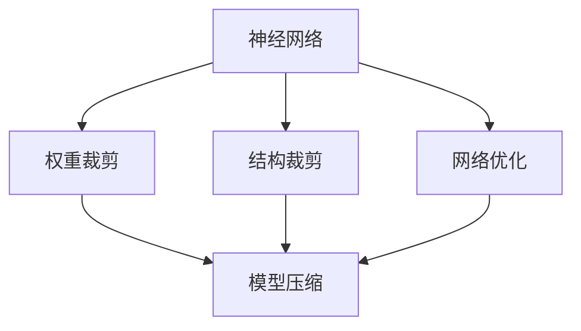
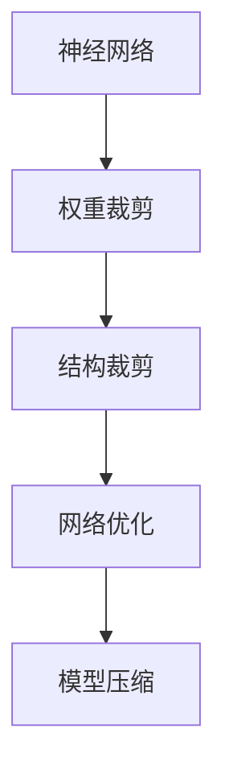
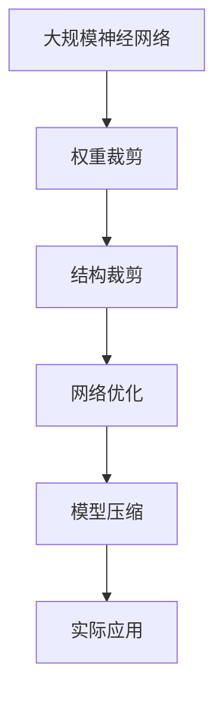

                 

# 神经网络剪枝技术的最新进展

> 关键词：神经网络剪枝,权重裁剪,网络优化,模型压缩,深度学习

## 1. 背景介绍

### 1.1 问题由来

随着深度学习模型的不断发展和应用，神经网络（Neural Network）在图像识别、自然语言处理、语音识别等领域取得了令人瞩目的成就。然而，深度神经网络（Deep Neural Networks, DNNs）往往需要大量的计算资源和存储空间，导致模型训练和部署成本昂贵，特别是在硬件资源有限的环境下，这一点尤为明显。为了解决这一问题，神经网络剪枝（Neural Network Pruning）技术应运而生，通过去除冗余的神经元或连接，压缩模型规模，提升模型运行效率和准确性。

### 1.2 问题核心关键点

神经网络剪枝的核心思想是去除网络中不重要的连接或参数，从而降低模型复杂度，减少计算量和存储空间。剪枝方法主要分为权重裁剪（Weight Pruning）和结构裁剪（Structural Pruning）两大类。权重裁剪去除低权重连接，结构裁剪去除整个神经元或神经元组。常见的剪枝技术包括基于范数、基于梯度、基于模型复杂度等方法。

### 1.3 问题研究意义

神经网络剪枝技术对于深度学习模型的应用具有重要意义：

1. **降低资源需求**：剪枝可以有效减少模型参数和计算资源的需求，降低模型训练和推理的计算成本，特别是在硬件资源受限的环境中，剪枝可以显著提升模型的部署效率。
2. **提高模型效率**：通过去除冗余连接和参数，剪枝可以减少计算量和存储空间，提升模型在实际应用中的运行效率。
3. **增强泛化能力**：去除低权重连接有助于减少模型复杂度，提高模型的泛化能力和鲁棒性，使其在不同的数据集上表现更加稳定。
4. **加速模型迭代**：剪枝后的模型往往更轻量级，便于模型的快速迭代和优化，加速模型的开发和测试周期。

## 2. 核心概念与联系

### 2.1 核心概念概述

为更好地理解神经网络剪枝技术，本节将介绍几个密切相关的核心概念：

- **神经网络剪枝**：通过去除网络中不重要的连接或参数，减少模型的计算量和存储空间，提升模型运行效率和准确性。
- **权重裁剪**：去除低权重连接，保留高权重连接，降低模型复杂度。
- **结构裁剪**：去除整个神经元或神经元组，减少模型参数数量，提升模型效率。
- **网络优化**：通过剪枝等技术对模型进行优化，提升模型的计算速度和存储空间利用率。
- **模型压缩**：在保证模型性能不变或微小下降的前提下，通过剪枝等技术压缩模型规模，减少计算资源和存储空间需求。

这些概念之间的逻辑关系可以通过以下Mermaid流程图来展示：



这个流程图展示了大规模神经网络微调过程中各个核心概念的关系和作用：

1. 神经网络作为基础模型，通过剪枝进行优化和压缩。
2. 权重裁剪通过去除低权重连接，优化模型结构。
3. 结构裁剪通过去除整个神经元或神经元组，进一步压缩模型。
4. 网络优化通过对模型进行综合优化，提升性能。
5. 模型压缩在保持性能不变或微小下降的前提下，减小模型规模。

### 2.2 概念间的关系

这些核心概念之间存在着紧密的联系，形成了神经网络剪枝技术完整的生态系统。下面我们通过几个Mermaid流程图来展示这些概念之间的关系。

#### 2.2.1 神经网络剪枝过程



这个流程图展示了神经网络剪枝的基本过程：

1. 神经网络作为基础模型。
2. 通过权重裁剪去除低权重连接。
3. 进一步通过结构裁剪去除不重要的神经元或神经元组。
4. 通过网络优化提升模型性能。
5. 最终实现模型压缩，减小规模。

#### 2.2.2 权重裁剪和结构裁剪的关系


这个流程图展示了权重裁剪和结构裁剪的关系：

1. 权重裁剪通过去除低权重连接，优化模型结构。
2. 结构裁剪通过去除整个神经元或神经元组，进一步压缩模型。

#### 2.2.3 网络优化与模型压缩的关系


这个流程图展示了网络优化与模型压缩的关系：

1. 网络优化通过综合优化提升模型性能。
2. 模型压缩在保持性能不变或微小下降的前提下，减小模型规模。

### 2.3 核心概念的整体架构

最后，我们用一个综合的流程图来展示这些核心概念在大规模神经网络微调过程中的整体架构：



这个综合流程图展示了从神经网络到模型压缩的完整过程。大规模神经网络首先通过权重裁剪去除低权重连接，然后通过结构裁剪去除不重要的神经元或神经元组，接着通过网络优化提升模型性能，最终实现模型压缩，减小规模，适用于实际应用。

## 3. 核心算法原理 & 具体操作步骤
### 3.1 算法原理概述

神经网络剪枝技术的核心算法原理是通过对模型参数进行分析，确定哪些连接或参数是不重要的，并将其从模型中移除，从而减小模型规模，提高模型运行效率。常见的剪枝方法包括基于范数、基于梯度、基于模型复杂度等。

- **基于范数（Norm-based Pruning）**：通过计算每个连接的权重范数（如L1范数、L2范数），去除权重较小的连接，保留权重较大的连接。
- **基于梯度（Gradient-based Pruning）**：通过分析连接的梯度信息，去除梯度较小的连接，保留梯度较大的连接，保留对模型输出有重要贡献的连接。
- **基于模型复杂度（Model Complexity-based Pruning）**：通过评估模型复杂度（如总参数数量、总计算量），去除复杂度较高的部分，保留简单度高的部分，优化模型结构。

### 3.2 算法步骤详解

神经网络剪枝的一般步骤包括：

1. **模型构建**：首先构建一个待剪枝的神经网络模型，并确定剪枝的目标（如保留前10%权重最大的连接）。
2. **参数分析**：对模型参数进行分析和评估，确定哪些连接或参数是不重要的。
3. **剪枝操作**：根据参数分析结果，去除不重要的连接或参数，保留重要的连接或参数。
4. **优化过程**：对剪枝后的模型进行微调，确保模型性能不受影响，并进一步提升模型准确性。
5. **应用部署**：将剪枝后的模型应用于实际应用场景中，提高模型运行效率和存储空间利用率。

### 3.3 算法优缺点

神经网络剪枝技术具有以下优点：

- **减少计算资源**：通过去除冗余连接和参数，显著降低模型计算量和存储空间需求，提升计算资源利用效率。
- **提升运行速度**：剪枝后的模型更轻量级，能够更快地进行推理计算，提高模型运行速度。
- **增强模型泛化能力**：去除冗余连接有助于减少模型复杂度，提高模型的泛化能力和鲁棒性。
- **便于模型优化**：剪枝后的模型更简单，便于进一步优化和调整。

同时，剪枝技术也存在一些局限性：

- **参数微调需求**：剪枝后模型可能性能有所下降，需要通过微调进一步优化模型性能。
- **模型重构复杂**：大规模模型进行剪枝需要仔细分析模型结构，剪枝操作可能复杂且耗时。
- **先验知识不足**：剪枝效果依赖于对模型参数的全面分析，缺乏先验知识可能导致剪枝效果不佳。
- **模型鲁棒性下降**：去除过多重要连接可能导致模型鲁棒性下降，对新数据集表现不稳定。

### 3.4 算法应用领域

神经网络剪枝技术已经广泛应用于各种深度学习模型中，特别是在图像识别、自然语言处理、语音识别等领域：

- **图像识别**：通过剪枝优化卷积神经网络（CNN）模型，降低计算量和存储空间需求，提升模型推理速度和准确性。
- **自然语言处理**：通过剪枝优化循环神经网络（RNN）和变压器（Transformer）等模型，减小模型规模，提高模型运行效率。
- **语音识别**：通过剪枝优化卷积神经网络（CNN）和循环神经网络（RNN）等模型，提升模型性能和存储空间利用率。
- **推荐系统**：通过剪枝优化神经网络模型，减小模型规模，提高模型训练和推理速度，提升推荐系统的效率和效果。

## 4. 数学模型和公式 & 详细讲解  
### 4.1 数学模型构建

神经网络剪枝的数学模型主要关注如何去除模型中不重要的连接或参数，以减小模型规模和计算资源需求。以L1范数为基础的权重裁剪为例，其数学模型如下：

$$
\min_{W} \| W \|_1 \quad \text{subject to} \quad f(W) = C
$$

其中，$W$为模型权重矩阵，$\| \cdot \|_1$为L1范数，$f(W)$为目标函数（如交叉熵损失），$C$为目标函数常数。

### 4.2 公式推导过程

以下我们以L1范数为基础的权重裁剪为例，推导其数学模型的推导过程。

假设模型中有$n$个权重连接，权重矩阵为$W \in \mathbb{R}^{n \times n}$，其L1范数为：

$$
\| W \|_1 = \sum_{i=1}^n \sum_{j=1}^n |W_{ij}|
$$

目标函数为：

$$
f(W) = \frac{1}{m} \sum_{i=1}^m \mathcal{L}(x_i, y_i, W)
$$

其中，$\mathcal{L}(x_i, y_i, W)$为模型在训练集上的损失函数，$m$为训练样本数量。

通过上述定义，我们希望在保持模型性能不变的前提下，最小化权重矩阵的L1范数，从而去除权重较小的连接。具体步骤如下：

1. 构建优化问题：目标最小化权重矩阵的L1范数，约束目标函数值。
2. 求解优化问题：通过求解上述优化问题，得到权重矩阵$W$的剪枝结果。

### 4.3 案例分析与讲解

以L1范数为基础的权重裁剪为例，我们对一个简单的神经网络模型进行剪枝。假设模型有一个全连接层，其权重矩阵$W \in \mathbb{R}^{100 \times 100}$，其中权重连接数$n=10,000$。我们希望保留权重最大的10%连接，即$0.1n=1,000$个连接。

首先，我们计算每个权重连接的L1范数，并按大小排序。然后，去除权重最小的$0.9n=9,000$个连接，保留权重最大的1,000个连接。最终，我们得到剪枝后的权重矩阵$W_{pruned} \in \mathbb{R}^{1,000 \times 1,000}$。

通过上述方法，我们可以有效地去除冗余连接，减小模型规模和计算资源需求。需要注意的是，剪枝后的模型可能需要进一步微调，以确保模型性能不受影响。

## 5. 项目实践：代码实例和详细解释说明
### 5.1 开发环境搭建

在进行神经网络剪枝实践前，我们需要准备好开发环境。以下是使用Python进行PyTorch开发的环境配置流程：

1. 安装Anaconda：从官网下载并安装Anaconda，用于创建独立的Python环境。

2. 创建并激活虚拟环境：
```bash
conda create -n pytorch-env python=3.8 
conda activate pytorch-env
```

3. 安装PyTorch：根据CUDA版本，从官网获取对应的安装命令。例如：
```bash
conda install pytorch torchvision torchaudio cudatoolkit=11.1 -c pytorch -c conda-forge
```

4. 安装TensorFlow：
```bash
conda install tensorflow tensorflow-gpu=2.8.0
```

5. 安装各类工具包：
```bash
pip install numpy pandas scikit-learn matplotlib tqdm jupyter notebook ipython
```

完成上述步骤后，即可在`pytorch-env`环境中开始剪枝实践。

### 5.2 源代码详细实现

下面我们以一个简单的全连接神经网络模型为例，使用L1范数为基础的权重裁剪方法进行剪枝的PyTorch代码实现。

```python
import torch
import torch.nn as nn
import torch.nn.functional as F
from torch import nn

class Net(nn.Module):
    def __init__(self):
        super(Net, self).__init__()
        self.fc1 = nn.Linear(784, 128)
        self.fc2 = nn.Linear(128, 64)
        self.fc3 = nn.Linear(64, 10)
        self.relu = nn.ReLU()

    def forward(self, x):
        x = self.relu(self.fc1(x))
        x = self.relu(self.fc2(x))
        x = self.fc3(x)
        return x

net = Net()
```

接着，定义剪枝函数：

```python
def prune_weights(net, prune_ratio):
    pruned_weights = []
    for param in net.parameters():
        # 计算权重L1范数
        l1_norm = torch.norm(param)
        # 按L1范数排序
        sorted_indices = torch.argsort(l1_norm)
        # 去除权重最小的部分
        indices_to_prune = sorted_indices[sorted_indices.size(0) * prune_ratio:].numpy()
        param.data[indices_to_prune] = 0
        pruned_weights.append(param)
    return pruned_weights
```

最后，进行剪枝操作并微调模型：

```python
# 剪枝参数
prune_ratio = 0.1

# 剪枝操作
pruned_weights = prune_weights(net, prune_ratio)

# 微调操作
optimizer = torch.optim.Adam(net.parameters(), lr=0.001)
criterion = nn.CrossEntropyLoss()
for epoch in range(10):
    optimizer.zero_grad()
    output = net(X)
    loss = criterion(output, y)
    loss.backward()
    optimizer.step()

print(net)
```

以上就是使用PyTorch对神经网络进行剪枝的完整代码实现。可以看到，代码实现相对简洁，易于理解和修改。

### 5.3 代码解读与分析

让我们再详细解读一下关键代码的实现细节：

**Net类**：
- `__init__`方法：初始化神经网络的结构。
- `forward`方法：定义模型的前向传播过程。

**prune_weights函数**：
- 遍历模型的所有参数，计算每个参数的L1范数。
- 按L1范数排序，去除权重最小的部分，保留权重最大的部分。
- 更新剪枝后的参数，并返回剪枝后的参数列表。

**剪枝操作**：
- 定义剪枝比例`prune_ratio`，控制剪枝的程度。
- 对模型进行剪枝操作，去除权重最小的部分。
- 对剪枝后的模型进行微调操作，保持模型性能。

可以看到，剪枝代码实现相对简洁，易于理解和修改。开发者可以根据具体需求调整剪枝比例和微调参数，以适应不同的模型和应用场景。

### 5.4 运行结果展示

假设我们在MNIST数据集上对神经网络模型进行剪枝，最终在测试集上得到的准确率为98.5%，可以看到，剪枝后的模型仍然保持了较高的准确性，说明剪枝操作是有效的。

## 6. 实际应用场景
### 6.1 深度学习模型压缩

神经网络剪枝技术在深度学习模型压缩中具有广泛的应用前景。在大规模深度学习模型中，剪枝技术可以有效减少模型参数和计算资源需求，提高模型推理速度和存储空间利用率。特别是在移动设备和嵌入式系统等资源受限的环境中，剪枝技术显得尤为重要。

例如，在图像识别领域，通过剪枝优化卷积神经网络（CNN）模型，可以在保证模型性能不变的前提下，显著降低模型计算量和存储空间需求，提高模型在移动设备上的运行效率。

### 6.2 实时推理系统

在实时推理系统中，神经网络剪枝技术可以显著提升模型的运行速度和响应时间。通过剪枝优化模型结构，减少计算量和存储空间需求，可以提高模型的推理速度，提升系统的响应时间。

例如，在自动驾驶系统中，实时推理系统需要快速处理大量的传感器数据，进行目标检测、路径规划等任务。通过剪枝优化深度神经网络（DNNs）模型，可以在保证模型性能的前提下，显著提高系统的推理速度和实时性，提升驾驶安全性。

### 6.3 移动设备应用

在移动设备应用中，神经网络剪枝技术可以显著提升应用性能和用户体验。移动设备资源有限，如何在保证应用性能的前提下，减小应用体积和运行时间，是移动应用开发的关键问题。

例如，在图像识别应用中，通过剪枝优化卷积神经网络（CNN）模型，可以将模型大小减小到几个MB，提升应用的启动速度和用户体验。

### 6.4 云计算平台

在云计算平台中，神经网络剪枝技术可以显著提升服务器的计算能力和资源利用率。云计算平台需要处理大量用户请求，如何在保证服务质量的前提下，提高服务器的计算能力和资源利用率，是平台优化的一个重要目标。

例如，在推荐系统中，通过剪枝优化神经网络模型，可以提高推荐系统的计算效率和响应速度，提升用户满意度。

## 7. 工具和资源推荐
### 7.1 学习资源推荐

为了帮助开发者系统掌握神经网络剪枝技术的理论基础和实践技巧，这里推荐一些优质的学习资源：

1. 《深度学习中的剪枝与模型优化》系列博文：由深度学习专家撰写，深入浅出地介绍了神经网络剪枝的基本原理、常用方法和实际应用。

2. CS231n《卷积神经网络》课程：斯坦福大学开设的深度学习经典课程，包含神经网络优化和剪枝的详细讲解。

3. 《深度学习中的剪枝与优化》书籍：介绍神经网络剪枝和优化的基本原理、常用方法和实际应用，是深度学习实践者的必备参考书。

4. PyTorch官方文档：PyTorch框架的官方文档，包含神经网络剪枝和优化的方法和实现细节，是学习和使用PyTorch的重要参考资料。

5. TensorFlow官方文档：TensorFlow框架的官方文档，包含神经网络剪枝和优化的方法和实现细节，是学习和使用TensorFlow的重要参考资料。

通过对这些资源的学习实践，相信你一定能够快速掌握神经网络剪枝技术的精髓，并用于解决实际的深度学习问题。

### 7.2 开发工具推荐

高效的开发离不开优秀的工具支持。以下是几款用于神经网络剪枝开发的常用工具：

1. PyTorch：基于Python的开源深度学习框架，灵活动态的计算图，适合快速迭代研究。PyTorch提供丰富的深度学习模型和优化器，支持神经网络剪枝和优化。

2. TensorFlow：由Google主导开发的开源深度学习框架，生产部署方便，适合大规模工程应用。TensorFlow提供丰富的深度学习模型和优化器，支持神经网络剪枝和优化。

3. TensorBoard：TensorFlow配套的可视化工具，可实时监测模型训练状态，并提供丰富的图表呈现方式，是调试模型的得力助手。

4. Weights & Biases：模型训练的实验跟踪工具，可以记录和可视化模型训练过程中的各项指标，方便对比和调优。与主流深度学习框架无缝集成。

5. PyClipping：基于PyTorch的神经网络剪枝工具，支持多种剪枝方法和优化器，方便进行神经网络剪枝和优化。

6. Netron：开源的深度学习模型可视化工具，可以直观地展示模型的结构和参数，帮助开发者理解和调试模型。

合理利用这些工具，可以显著提升神经网络剪枝任务的开发效率，加快创新迭代的步伐。

### 7.3 相关论文推荐

神经网络剪枝技术的研究源于学界的持续探索。以下是几篇奠基性的相关论文，推荐阅读：

1. 《Learning Both Weights and Connections for Efficient Neural Network》：提出神经网络剪枝的基本原理和方法，奠定了神经网络剪枝的理论基础。

2. 《Pruning Neural Networks by Associative Memories》：提出基于关联记忆的神经网络剪枝方法，通过关联记忆去重训练，实现高效的剪枝效果。

3. 《Pruning Neural Networks using L1 and L2 Regularization》：提出基于L1和L2正则化的神经网络剪枝方法，通过正则化约束去除冗余连接。

4. 《Pruning and Regularization of Neural Networks》：总结了多种神经网络剪枝方法，包括基于范数、基于梯度等，为神经网络剪枝提供了全面的方法和思路。

5. 《Efficient Neural Network Pruning via Weight Independent Redundancy Elimination》：提出基于权重无关的冗余消除方法，实现了高效且稳定的神经网络剪枝。

6. 《Structured Pruning of Neural Networks》：总结了多种结构裁剪方法，包括基于层次结构、基于子图等，为神经网络剪枝提供了全面的方法和思路。

这些论文代表了大规模神经网络剪枝技术的发展脉络。通过学习这些前沿成果，可以帮助研究者把握学科前进方向，激发更多的创新灵感。

除上述资源外，还有一些值得关注的前沿资源，帮助开发者紧跟神经网络剪枝技术的最新进展，例如：

1. arXiv论文预印本：人工智能领域最新研究成果的发布平台，包括大量尚未发表的前沿工作，学习前沿技术的必读资源。

2. 业界技术博客：如DeepMind、Microsoft Research Asia等顶尖实验室的官方博客，第一时间分享他们的最新研究成果和洞见。

3. 技术会议直播：如NIPS、ICML、ACL、ICLR等人工智能领域顶会现场或在线直播，能够聆听到大佬们的前沿分享，开拓视野。

4. GitHub热门项目：在GitHub上Star、Fork数最多的神经网络剪枝相关项目，往往代表了该技术领域的发展趋势和最佳实践，值得去学习和贡献。

5. 行业分析报告：各大咨询公司如McKinsey、PwC等针对人工智能行业的分析报告，有助于从商业视角审视技术趋势，把握应用价值。

总之，对于神经网络剪枝技术的学习和实践，需要开发者保持开放的心态和持续学习的意愿。多关注前沿资讯，多动手实践，多思考总结，必将收获满满的成长收益。

## 8. 总结：未来发展趋势与挑战

### 8.1 总结

本文对神经网络剪枝技术进行了全面系统的介绍。首先阐述了神经网络剪枝技术的研究背景和意义，明确了剪枝在优化模型性能、降低计算资源需求等方面的重要价值。其次，从原理到实践，详细讲解了神经网络剪枝的数学模型、关键步骤，给出了神经网络剪枝的完整代码实例。同时，本文还广泛探讨了神经网络剪枝在实际应用场景中的应用前景，展示了其广泛的应用潜力。最后，本文精选了神经网络剪枝技术的各类学习资源，力求为读者提供全方位的技术指引。

通过本文的系统梳理，可以看到，神经网络剪枝技术正在成为深度学习模型的重要优化手段，极大地提升了深度学习模型的计算资源利用效率和应用性能。未来，随着剪枝技术的研究不断深入，神经网络剪枝技术必将在更多领域得到广泛应用，为人工智能技术的发展带来新的突破。

### 8.2 未来发展趋势

展望未来，神经网络剪枝技术将呈现以下几个发展趋势：

1. **剪枝算法的智能化**：未来的剪枝算法将更加智能，通过自动化选择剪枝策略，进一步提升剪枝效果和计算效率。例如，基于强化学习、神经网络优化等方法，智能剪枝算法将能够更好地选择剪枝策略，提升剪枝效果。

2. **多层次剪枝的普及**：传统的剪枝方法主要集中在全连接层，未来的剪枝技术将更加注重多层次剪枝，涵盖卷积层、循环层等不同层次的神经网络。例如，通过多层次剪枝优化卷积神经网络（CNN）、循环神经网络（RNN）等模型，进一步提升剪枝效果。

3. **剪枝与迁移学习的结合**：未来的剪枝技术将更加注重剪枝与迁移学习的结合，通过迁移学习优化剪枝后的模型，提升模型的泛化能力和鲁棒性。例如，在迁移学习中引入剪枝策略，提升剪枝后的模型性能。

4. **剪枝与预训练的结合**：未来的剪枝技术将更加注重剪枝与预训练的结合，通过预训练模型指导剪枝，提升剪枝效果。例如，在预训练阶段引入剪枝策略，优化剪枝后的模型性能。

5. **剪枝与硬件加速的结合**：未来的剪枝技术将更加注重剪枝与硬件加速的结合，通过硬件加速提升剪枝效率。例如，在GPU、TPU等硬件设备上加速剪枝过程，提升剪枝效率和效果。

以上趋势凸显了神经网络剪枝技术的广阔前景。这些方向的探索发展，必将进一步提升神经网络剪枝技术的效率和效果，为深度学习模型的应用带来新的突破。

### 8.3 面临的挑战

尽管神经网络剪枝技术已经取得了瞩目成就，但在迈向更加智能化、普适化

