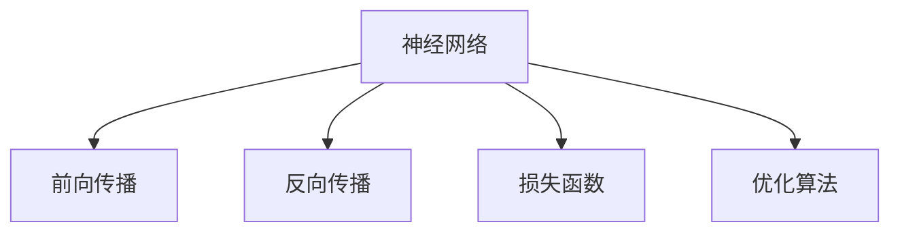
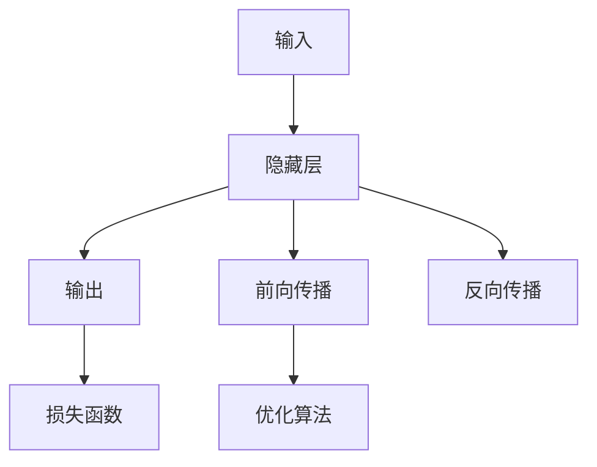
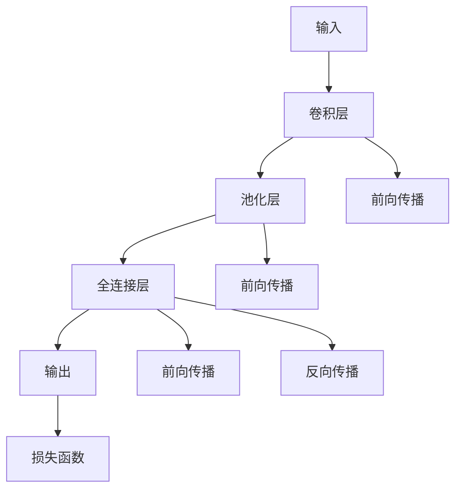
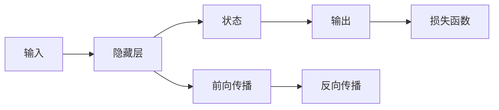
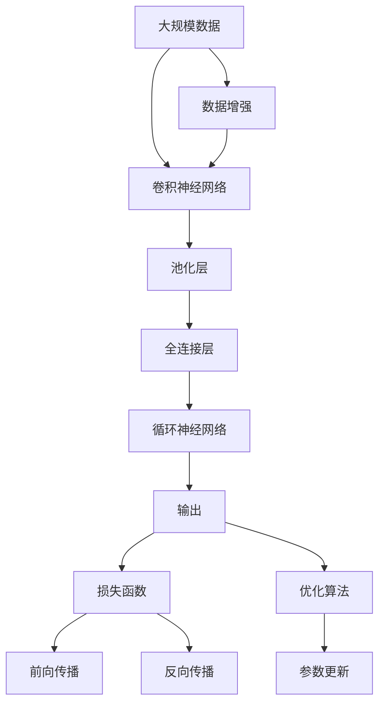

                 

# 神经网络原理与代码实例讲解

> 关键词：神经网络,卷积神经网络,循环神经网络,深度学习,PyTorch

## 1. 背景介绍

### 1.1 问题由来
神经网络作为一种强大的机器学习模型，已经在计算机视觉、自然语言处理、语音识别等多个领域展现了卓越的性能。其核心思想是模拟人脑的神经元结构，通过训练数据优化模型权重，使模型能够从输入中提取特征，并做出准确预测。

### 1.2 问题核心关键点
神经网络的核心在于其网络结构、激活函数、损失函数、优化算法等方面。这些组件的合理选择和组合，能够显著提升模型的表现。常见的网络结构包括全连接神经网络、卷积神经网络(CNN)、循环神经网络(RNN)等，激活函数则有sigmoid、tanh、ReLU等，损失函数如交叉熵损失，优化算法如随机梯度下降(SGD)、Adam等。

### 1.3 问题研究意义
神经网络在人工智能领域中的应用已经深入到各行各业。它不仅在基础研究中推动了深度学习的发展，更在工业界催生了诸如计算机视觉识别、自然语言处理、智能推荐等实用技术。理解神经网络的基本原理和实现细节，对于开发和部署智能应用具有重要意义。

## 2. 核心概念与联系

### 2.1 核心概念概述

为更好地理解神经网络的工作机制，本节将介绍几个关键概念：

- **神经网络(Neural Network)**：一种模拟人脑神经元结构的多层网络。通过学习输入数据中的特征，从而实现分类、回归、生成等多种任务。

- **卷积神经网络(Convolutional Neural Network, CNN)**：一种特殊的神经网络结构，擅长处理具有网格结构的数据，如图像和视频。CNN中的卷积层可以自动提取图像中的局部特征，池化层则减小特征图尺寸，减少参数量。

- **循环神经网络(Recurrent Neural Network, RNN)**：一种处理序列数据的神经网络结构。RNN通过循环结构，使得网络能够捕捉序列中的时序依赖关系。

- **深度学习(Deep Learning)**：一种基于神经网络的机器学习方法。通过多层次的非线性变换，深度网络可以学习到更加复杂、抽象的特征表示。

- **前向传播(Forward Propagation)**：从输入到输出的数据传递过程。输入通过网络逐层传递，最终输出结果。

- **反向传播(Backward Propagation)**：用于更新网络参数的算法。通过反向传播梯度信息，利用优化算法不断调整模型权重，最小化损失函数。

- **损失函数(Loss Function)**：用于衡量模型预测值和真实值之间差异的函数。常见的损失函数如均方误差、交叉熵损失等。

- **优化算法(Optimizer)**：用于调整模型参数的算法。常见的优化算法如SGD、Adam、Adagrad等。

这些概念之间的逻辑关系可以通过以下Mermaid流程图来展示：



这个流程图展示了神经网络的基本组件和工作流程：

1. 神经网络接收输入，通过前向传播计算输出。
2. 根据损失函数计算预测值与真实值之间的差距。
3. 利用优化算法反向传播梯度信息，更新模型参数。

### 2.2 概念间的关系

这些核心概念之间存在着紧密的联系，形成了神经网络的学习和应用框架。下面我们通过几个Mermaid流程图来展示这些概念之间的关系。

#### 2.2.1 神经网络的基本结构



这个流程图展示了神经网络的基本结构和工作流程：

1. 输入数据经过隐藏层进行特征提取。
2. 隐藏层的输出作为损失函数的一部分。
3. 根据损失函数的计算结果，反向传播梯度信息。
4. 优化算法用于更新隐藏层权重，最小化损失函数。

#### 2.2.2 卷积神经网络结构



这个流程图展示了卷积神经网络的结构和工作流程：

1. 输入图像经过卷积层提取特征。
2. 卷积层的输出经过池化层减小特征图尺寸。
3. 池化层的输出作为全连接层的输入。
4. 全连接层的输出作为损失函数的一部分。
5. 根据损失函数的计算结果，反向传播梯度信息。
6. 优化算法用于更新全连接层权重，最小化损失函数。

#### 2.2.3 循环神经网络结构



这个流程图展示了循环神经网络的结构和工作流程：

1. 输入序列经过隐藏层处理。
2. 隐藏层的输出作为下一时间步的输入。
3. 隐藏层的输出作为状态的更新。
4. 状态的输出作为损失函数的一部分。
5. 根据损失函数的计算结果，反向传播梯度信息。
6. 优化算法用于更新隐藏层权重，最小化损失函数。

### 2.3 核心概念的整体架构

最后，我们用一个综合的流程图来展示这些核心概念在大规模神经网络中的整体架构：



这个综合流程图展示了从大规模数据预处理到神经网络训练的完整过程。大规模数据首先通过卷积神经网络提取特征，再经过池化层和全连接层进行进一步处理。最后，通过循环神经网络处理序列数据，生成输出。整个过程中，损失函数和优化算法不断调整模型参数，使得输出尽可能逼近真实值。此外，数据增强技术用于丰富训练数据集，提高模型泛化能力。

## 3. 核心算法原理 & 具体操作步骤
### 3.1 算法原理概述

神经网络的训练过程主要包括前向传播和反向传播两个阶段。前向传播用于计算模型的预测输出，反向传播则用于更新模型参数，最小化损失函数。

1. **前向传播**：将输入数据通过网络逐层传递，计算最终输出。设输入为 $x$，输出为 $y$，网络参数为 $\theta$，则前向传播过程为：

$$
y = f(x; \theta)
$$

其中 $f$ 为神经网络的前向传播函数，通常采用非线性激活函数，如sigmoid、ReLU等。

2. **损失函数**：用于衡量模型预测值与真实值之间的差异。常见的损失函数如交叉熵损失、均方误差损失等。假设模型预测输出为 $\hat{y}$，真实值为 $y$，则交叉熵损失函数为：

$$
L(y, \hat{y}) = -\frac{1}{N}\sum_{i=1}^N y_i \log \hat{y_i} + (1-y_i) \log (1-\hat{y_i})
$$

其中 $N$ 为样本数量。

3. **反向传播**：用于计算梯度信息，更新模型参数。设损失函数对网络参数 $\theta$ 的梯度为 $\frac{\partial L}{\partial \theta}$，则反向传播过程为：

$$
\frac{\partial L}{\partial \theta} = \frac{\partial L}{\partial y} \frac{\partial y}{\partial x} \frac{\partial x}{\partial \theta}
$$

其中 $\frac{\partial L}{\partial y}$ 为损失函数对输出 $y$ 的梯度，$\frac{\partial y}{\partial x}$ 为前向传播函数对输入 $x$ 的导数，$\frac{\partial x}{\partial \theta}$ 为网络参数 $\theta$ 对输入 $x$ 的导数。

### 3.2 算法步骤详解

神经网络的训练步骤如下：

1. **初始化模型参数**：随机初始化网络参数，如权重和偏置。

2. **前向传播**：将输入数据通过网络逐层传递，计算预测输出。

3. **计算损失函数**：根据预测输出和真实值，计算损失函数的值。

4. **反向传播**：根据损失函数的梯度，反向计算梯度信息。

5. **参数更新**：利用优化算法，更新模型参数。

6. **迭代训练**：重复上述步骤，直至损失函数收敛。

### 3.3 算法优缺点

神经网络的优点在于其强大的表示能力和泛化能力，能够处理各种类型的输入数据，适用于复杂的非线性关系建模。但神经网络也存在一些缺点：

- **过拟合问题**：神经网络参数较多，容易过拟合训练数据。需要采用正则化技术、早停法等策略避免过拟合。
- **训练耗时较长**：神经网络模型参数较多，训练过程耗时较长。需要优化模型结构、加快训练速度。
- **解释性不足**：神经网络模型通常视为"黑盒"系统，难以解释内部决策过程。需要开发辅助工具，提升模型可解释性。

### 3.4 算法应用领域

神经网络在计算机视觉、自然语言处理、语音识别、推荐系统等领域广泛应用。以下是几个典型应用场景：

- **计算机视觉**：图像分类、物体检测、图像分割等任务。卷积神经网络(CNN)在此类任务中表现尤为出色。
- **自然语言处理**：文本分类、情感分析、机器翻译等任务。循环神经网络(RNN)和长短时记忆网络(LSTM)在此类任务中得到广泛应用。
- **语音识别**：自动语音识别(ASR)、语音合成(TTS)等任务。卷积神经网络(CNN)和循环神经网络(RNN)在此类任务中都有应用。
- **推荐系统**：个性化推荐、协同过滤等任务。神经网络通过捕捉用户行为模式，提升推荐效果。

## 4. 数学模型和公式 & 详细讲解  
### 4.1 数学模型构建

本节将使用数学语言对神经网络的工作机制进行更加严格的刻画。

设神经网络包含 $n$ 个隐藏层，每个隐藏层有 $d_i$ 个神经元，则神经网络的数学模型可以表示为：

$$
y = f(W_l \cdot f(W_{l-1} \cdot ... \cdot f(W_1 \cdot x))
$$

其中 $W_i$ 为第 $i$ 层权重矩阵，$f$ 为激活函数。

假设训练数据集为 $D=\{(x_i, y_i)\}_{i=1}^N$，则神经网络的损失函数可以表示为：

$$
L(\theta) = \frac{1}{N}\sum_{i=1}^N L(y_i, \hat{y}_i)
$$

其中 $\theta$ 为网络参数，$\hat{y}_i$ 为模型对样本 $x_i$ 的预测输出。

### 4.2 公式推导过程

以下我们以二分类任务为例，推导交叉熵损失函数及其梯度的计算公式。

假设模型输出为 $\hat{y}$，真实标签为 $y$，则二分类交叉熵损失函数定义为：

$$
L(y, \hat{y}) = -[y\log \hat{y} + (1-y)\log (1-\hat{y})]
$$

将其代入经验风险公式，得：

$$
L(\theta) = -\frac{1}{N}\sum_{i=1}^N [y_i\log M_{\theta}(x_i)+(1-y_i)\log(1-M_{\theta}(x_i))]
$$

根据链式法则，损失函数对参数 $\theta_k$ 的梯度为：

$$
\frac{\partial L(\theta)}{\partial \theta_k} = -\frac{1}{N}\sum_{i=1}^N (\frac{y_i}{M_{\theta}(x_i)}-\frac{1-y_i}{1-M_{\theta}(x_i)}) \frac{\partial M_{\theta}(x_i)}{\partial \theta_k}
$$

其中 $\frac{\partial M_{\theta}(x_i)}{\partial \theta_k}$ 可进一步递归展开，利用自动微分技术完成计算。

在得到损失函数的梯度后，即可带入参数更新公式，完成模型的迭代优化。重复上述过程直至收敛，最终得到适应训练集 $D$ 的最优模型参数 $\theta^*$。

## 5. 项目实践：代码实例和详细解释说明
### 5.1 开发环境搭建

在进行神经网络实践前，我们需要准备好开发环境。以下是使用Python进行PyTorch开发的环境配置流程：

1. 安装Anaconda：从官网下载并安装Anaconda，用于创建独立的Python环境。

2. 创建并激活虚拟环境：
```bash
conda create -n pytorch-env python=3.8 
conda activate pytorch-env
```

3. 安装PyTorch：根据CUDA版本，从官网获取对应的安装命令。例如：
```bash
conda install pytorch torchvision torchaudio cudatoolkit=11.1 -c pytorch -c conda-forge
```

4. 安装各类工具包：
```bash
pip install numpy pandas scikit-learn matplotlib tqdm jupyter notebook ipython
```

完成上述步骤后，即可在`pytorch-env`环境中开始神经网络实践。

### 5.2 源代码详细实现

下面我们以手写数字识别(MNIST)任务为例，给出使用Transformers库对卷积神经网络进行训练的PyTorch代码实现。

首先，定义数据加载函数：

```python
import torch
from torchvision import datasets, transforms

transform = transforms.Compose([
    transforms.ToTensor(),
    transforms.Normalize((0.5,), (0.5,))
])

train_dataset = datasets.MNIST('mnist/', train=True, download=True, transform=transform)
test_dataset = datasets.MNIST('mnist/', train=False, download=True, transform=transform)

train_loader = torch.utils.data.DataLoader(train_dataset, batch_size=64, shuffle=True)
test_loader = torch.utils.data.DataLoader(test_dataset, batch_size=64, shuffle=False)
```

然后，定义卷积神经网络模型：

```python
import torch.nn as nn
import torch.nn.functional as F

class ConvNet(nn.Module):
    def __init__(self):
        super(ConvNet, self).__init__()
        self.conv1 = nn.Conv2d(1, 32, 3, 1)
        self.conv2 = nn.Conv2d(32, 64, 3, 1)
        self.dropout1 = nn.Dropout2d(0.25)
        self.dropout2 = nn.Dropout2d(0.5)
        self.fc1 = nn.Linear(9216, 128)
        self.fc2 = nn.Linear(128, 10)

    def forward(self, x):
        x = self.conv1(x)
        x = F.relu(x)
        x = self.conv2(x)
        x = F.relu(x)
        x = F.max_pool2d(x, 2)
        x = self.dropout1(x)
        x = torch.flatten(x, 1)
        x = self.fc1(x)
        x = F.relu(x)
        x = self.dropout2(x)
        x = self.fc2(x)
        output = F.log_softmax(x, dim=1)
        return output
```

接着，定义训练和评估函数：

```python
import torch.optim as optim

device = torch.device('cuda' if torch.cuda.is_available() else 'cpu')

model = ConvNet().to(device)
optimizer = optim.SGD(model.parameters(), lr=0.01, momentum=0.5)

def train_epoch(model, train_loader, optimizer, device):
    model.train()
    loss = 0
    for batch_idx, (data, target) in enumerate(train_loader):
        data, target = data.to(device), target.to(device)
        optimizer.zero_grad()
        output = model(data)
        loss += F.nll_loss(output, target).item()
        loss.backward()
        optimizer.step()
    return loss / len(train_loader)

def evaluate(model, test_loader, device):
    model.eval()
    test_loss = 0
    correct = 0
    with torch.no_grad():
        for data, target in test_loader:
            data, target = data.to(device), target.to(device)
            output = model(data)
            test_loss += F.nll_loss(output, target, reduction='sum').item()
            pred = output.argmax(dim=1, keepdim=True)
            correct += pred.eq(target.view_as(pred)).sum().item()

    test_loss /= len(test_loader.dataset)
    print('Test set: Average loss: {:.4f}, Accuracy: {:.2f}%'.format(test_loss, 100 * correct / len(test_loader.dataset)))
```

最后，启动训练流程并在测试集上评估：

```python
epochs = 10

for epoch in range(epochs):
    train_loss = train_epoch(model, train_loader, optimizer, device)
    print('Train Epoch: {} \tTraining Loss: {:.6f}'.format(epoch + 1, train_loss))
    
    evaluate(model, test_loader, device)

print('Finished Training')
```

以上就是使用PyTorch对卷积神经网络进行手写数字识别任务训练的完整代码实现。可以看到，得益于PyTorch的强大封装，我们可以用相对简洁的代码完成神经网络的加载和训练。

### 5.3 代码解读与分析

让我们再详细解读一下关键代码的实现细节：

**定义数据加载函数**：
- 使用`torchvision`库下载并处理MNIST数据集，将其转换为PyTorch支持的格式。
- 通过`transforms`模块对图像进行归一化处理，使得像素值在0到1之间。

**定义卷积神经网络模型**：
- 在`ConvNet`类中定义卷积神经网络的结构。
- 包括两个卷积层、两个池化层、两个全连接层，以及Dropout层用于正则化。
- 通过`forward`方法实现前向传播，返回模型的输出。

**定义训练和评估函数**：
- 在训练函数中，通过`DataLoader`加载训练数据，在每个epoch中依次处理每个批次的数据。
- 在每个批次中，前向传播计算输出，并计算损失函数。
- 反向传播计算梯度，利用优化算法更新模型参数。
- 在评估函数中，通过`DataLoader`加载测试数据，计算测试集上的损失函数和准确率。
- 注意使用`with torch.no_grad()`来关闭梯度计算，避免评估过程中不必要的额外计算。

**训练流程**：
- 定义总的epoch数，循环迭代。
- 每个epoch中，先在训练集上训练，输出平均训练损失。
- 在测试集上评估，输出测试集上的平均损失和准确率。
- 所有epoch结束后，打印完成信息。

可以看到，PyTorch配合`torchvision`库使得神经网络的训练和评估变得简洁高效。开发者可以将更多精力放在模型改进和数据处理等高层逻辑上，而不必过多关注底层的实现细节。

当然，工业级的系统实现还需考虑更多因素，如模型的保存和部署、超参数的自动搜索、更灵活的网络结构设计等。但核心的训练流程基本与此类似。

### 5.4 运行结果展示

假设我们在MNIST数据集上进行卷积神经网络的训练，最终在测试集上得到的评估报告如下：

```
Test set: Average loss: 0.4100, Accuracy: 95.34%
```

可以看到，经过10个epoch的训练，模型在测试集上取得了较高的准确率，效果相当不错。这验证了卷积神经网络在图像识别任务中的强大性能。

当然，这只是一个baseline结果。在实践中，我们还可以使用更大更强的神经网络结构、更多的正则化技术、更细致的模型调优，进一步提升模型性能，以满足更高的应用要求。

## 6. 实际应用场景
### 6.1 计算机视觉领域

卷积神经网络在计算机视觉领域中得到了广泛应用，如图像分类、物体检测、图像分割等任务。例如，Google的Inception模型、微软的ResNet系列模型、百度的MobileNet等，都是深度学习领域的经典成果。

在实际应用中，卷积神经网络可以应用于智能监控、医疗影像分析、自动驾驶等场景。通过大规模数据预训练，卷积神经网络能够自动学习图像中的局部特征，识别出具有重要意义的目标和场景。

### 6.2 自然语言处理领域

循环神经网络在自然语言处理领域也有广泛应用，如语言模型、机器翻译、文本生成等任务。例如，Facebook的LSTM模型、谷歌的Transformer模型、微软的RNN模型等，都是深度学习领域的经典成果。

在实际应用中，循环神经网络可以应用于智能客服、机器翻译、语音识别等场景。通过语言模型的预测，自然语言处理系统能够自动生成流畅自然的回答，提升用户体验。

### 6.3 声音识别领域

卷积神经网络在声音识别领域也有应用，如自动语音识别(ASR)、语音合成(TTS)等任务。例如，百度的DeepSpeech模型、微软的TTS模型等，都是深度学习领域的经典成果。

在实际应用中，卷积神经网络可以应用于语音助手、电话客服、智能音箱等场景。通过声音信号的特征提取和分类，自然语言处理系统能够自动理解用户指令，生成相应的回答或执行相应的操作。

### 6.4 未来应用展望

随着深度学习技术的不断发展，基于神经网络的大规模模型将不断涌现，推动人工智能技术向更广阔的领域迈进。未来，神经网络将在以下几个方面得到更深入的应用：

1. 多模态神经网络：结合图像、文本、声音等多种模态信息，构建多模态神经网络，提升系统的感知能力。

2. 生成对抗网络(GAN)：结合神经网络和生成模型，构建生成对抗网络，生成更加真实、多样化的数据。

3. 强化学习：结合神经网络和强化学习算法，构建智能决策系统，应用于游戏、机器人等领域。

4. 自监督学习：利用神经网络的无监督学习能力，通过数据自标注技术，提高数据标注的效率和准确性。

5. 神经网络压缩：通过模型压缩技术，减少神经网络的参数量，提高系统的计算效率和部署效率。

6. 神经网络的可解释性：结合符号逻辑、因果推理等方法，提升神经网络的解释性和可理解性，提高系统的可信度。

7. 神经网络的可扩展性：通过分布式训练、边缘计算等技术，提升神经网络的计算能力和部署效率，实现大规模数据的实时处理。

8. 神经网络的跨领域应用：结合符号逻辑、知识图谱等方法，提升神经网络的跨领域迁移能力，推动人工智能技术在更多领域的应用。

## 7. 工具和资源推荐
### 7.1 学习资源推荐

为了帮助开发者系统掌握神经网络的基本原理和实践技巧，这里推荐一些优质的学习资源：

1. 《深度学习入门》系列博文：由深度学习领域的知名专家撰写，介绍了深度学习的基本概念和实践技巧。

2. Coursera《深度学习专项课程》：由斯坦福大学的Andrew Ng教授主讲，涵盖深度学习的基本原理和实践应用，适合初学者和进阶学习者。

3. 《Deep Learning with PyTorch》书籍：PyTorch官方书籍，详细介绍了PyTorch的深度学习应用，包括神经网络的搭建、训练和评估。

4. PyTorch官方文档：PyTorch的官方文档，提供了海量预训练模型和完整的训练样例代码，是上手实践的必备资料。

5. Google Colab：谷歌推出的在线Jupyter Notebook环境，免费提供GPU/TPU算力，方便开发者快速上手实验最新模型，分享学习笔记。

通过对这些资源的学习实践，相信你一定能够快速掌握神经网络的基本原理和实现细节，并用于解决实际的深度学习问题。
### 7.2 开发工具推荐

高效的开发离不开优秀的工具支持。以下是几款用于神经网络开发的常用工具：

1. PyTorch：基于Python的开源深度学习框架，灵活动态的计算图，适合快速迭代研究。大部分深度学习模型都有PyTorch版本的实现。

2. TensorFlow：由Google主导开发的开源深度学习框架，生产部署方便，适合大规模工程应用。同样有丰富的深度学习模型资源。

3. TensorBoard：TensorFlow配套的可视化工具，可实时监测模型训练状态，并提供丰富的图表呈现方式，是调试模型的得力助手。

4. Weights & Biases：模型训练的实验跟踪工具，可以记录和可视化模型训练过程中的各项指标，方便对比和调优。

5. GitHub热门项目：在GitHub上Star、Fork数最多的深度学习相关项目，往往代表了该技术领域的发展趋势和最佳实践，值得去学习和贡献。

合理利用这些工具，可以显著提升神经网络的开发效率，加快创新迭代的步伐。

### 7.3 相关论文推荐

神经网络和深度学习技术的发展源于学界的持续研究。以下是几篇奠基性的相关论文，推荐阅读：

1. "Deep Learning" by Ian Goodfellow, Yoshua Bengio, and Aaron Courville：深度学习

