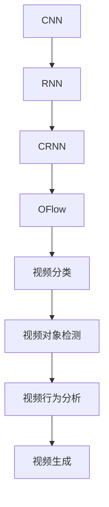
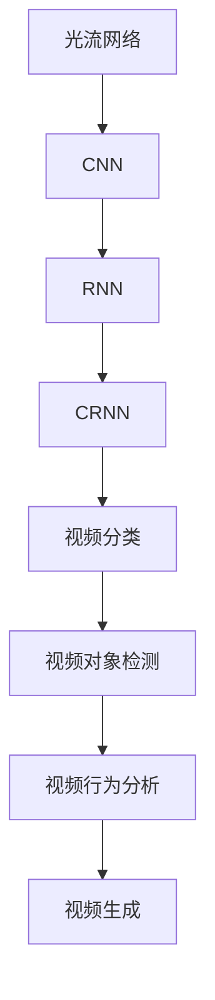
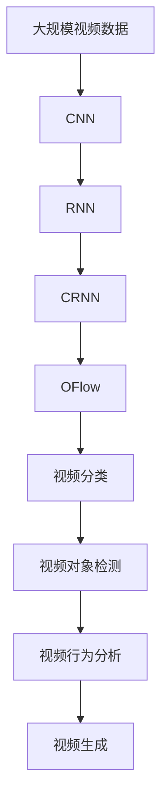

                 

# 神经网络在视频分析中的应用

> 关键词：神经网络,视频分析,卷积神经网络(CNN),循环神经网络(RNN),卷积循环神经网络(CRNN),光流网络(OFlow),视频分类,视频对象检测,视频行为分析,视频生成

## 1. 背景介绍

### 1.1 问题由来
随着计算机视觉技术的发展，视频分析已经成为了人工智能领域的重要研究方向。视频分析的应用范围涵盖智能监控、自动驾驶、医疗影像分析、视频检索等多个领域，可以大幅提升人类对视频信息的处理能力。然而，传统的基于手工特征提取的视频分析方法，往往依赖于专家知识和大量标注数据，难以应对复杂多变的场景需求。

近年来，深度学习特别是神经网络的发展，为视频分析带来了新的突破。神经网络能够自动从数据中学习抽象特征，在视频分类、行为分析、对象检测等任务上表现优异。尤其是卷积神经网络（CNN）、循环神经网络（RNN）等模型的引入，使得视频分析技术能够处理高维空间、时间序列等复杂结构，取得了显著成效。

### 1.2 问题核心关键点
神经网络在视频分析中的应用，主要涉及以下几个核心关键点：

1. **卷积神经网络（CNN）**：用于提取视频中的空间特征，适应于静态图像的分析任务。
2. **循环神经网络（RNN）**：用于处理时间序列数据，适应于动态变化的视频分析任务。
3. **卷积循环神经网络（CRNN）**：结合CNN和RNN的优势，能够同时处理空间和时间维度的信息，适用于视频对象检测、行为分析等任务。
4. **光流网络（OFlow）**：用于估计视频帧间的运动信息，帮助捕捉动态变化。
5. **视频分类**：将视频分为不同的类别，常见于视频检索、内容审核等场景。
6. **视频对象检测**：在视频中识别和定位特定的对象，常用于目标跟踪、场景理解等任务。
7. **视频行为分析**：分析视频中人的行为，进行异常检测、行为识别等应用。
8. **视频生成**：使用神经网络生成视频内容，如视频剪辑、虚拟场景生成等。

这些关键技术构成了神经网络在视频分析中的核心框架，使得视频分析能够从特征提取和分类、对象检测和行为分析，到视频生成等多个层面实现突破性进展。

### 1.3 问题研究意义
神经网络在视频分析中的应用，对于推动计算机视觉技术的进步，提升视频数据的利用效率，具有重要意义：

1. **提升视频分析效率**：神经网络能够自动从视频中学习特征，显著降低特征工程的工作量，加快视频分析的进程。
2. **提高分析准确性**：深度学习模型能够捕捉数据中的复杂模式，提供更准确的分析和分类结果。
3. **拓展应用场景**：视频分析技术在视频监控、自动驾驶、智能家居等领域的应用，将极大地提升用户体验和生活质量。
4. **促进技术创新**：神经网络的多样化应用，推动了视频分析技术的不断创新，为视频分析方法带来了新的思路和突破。
5. **加速行业落地**：视频分析技术的快速发展和应用，加速了其与各行业的深度融合，促进了视频分析技术的产业化进程。

## 2. 核心概念与联系

### 2.1 核心概念概述

为了更好地理解神经网络在视频分析中的应用，本节将介绍几个关键概念及其联系：

- **卷积神经网络（CNN）**：通过卷积层和池化层等结构，提取视频的空间特征。
- **循环神经网络（RNN）**：通过循环结构，处理视频的时间序列信息。
- **卷积循环神经网络（CRNN）**：结合CNN和RNN的优点，处理视频的空间-时间维度信息。
- **光流网络（OFlow）**：通过计算视频帧间的运动信息，捕捉动态变化。
- **视频分类**：将视频分为不同的类别，常见于视频检索、内容审核等场景。
- **视频对象检测**：在视频中识别和定位特定的对象，常用于目标跟踪、场景理解等任务。
- **视频行为分析**：分析视频中人的行为，进行异常检测、行为识别等应用。
- **视频生成**：使用神经网络生成视频内容，如视频剪辑、虚拟场景生成等。

这些概念之间的联系可以通过以下Mermaid流程图来展示：


这个流程图展示了神经网络在视频分析中的主要组成，从特征提取、运动估计到分类、检测、分析、生成，构成了一个完整的生态系统。

### 2.2 概念间的关系

这些核心概念之间存在着紧密的联系，形成了神经网络在视频分析中的完整框架。下面我们通过几个Mermaid流程图来展示这些概念之间的关系。

#### 2.2.1 神经网络的视频分析框架



这个流程图展示了神经网络在视频分析中的主要构成，从特征提取、运动估计到分类、检测、分析、生成，构成了一个完整的生态系统。

#### 2.2.2 视频分类和对象检测的关系


这个流程图展示了视频分类、对象检测、行为分析、生成之间的联系。视频分类是对视频进行宏观分类，对象检测是对视频中的对象进行定位，行为分析是基于对象检测的结果进行更深入的分析和理解，生成则是基于已有的数据生成新的视频内容。

#### 2.2.3 光流网络在视频分析中的应用



这个流程图展示了光流网络在视频分析中的应用路径。光流网络首先计算视频帧间的运动信息，然后与CNN、RNN等模型结合，用于视频分类、对象检测、行为分析、生成等多个任务。

### 2.3 核心概念的整体架构

最后，我们用一个综合的流程图来展示这些核心概念在大规模视频分析中的整体架构：



这个综合流程图展示了从大规模视频数据输入，到特征提取、运动估计、分类、检测、分析、生成等全流程。视频分析技术的实现，需要开发者深入理解这些核心概念，并灵活运用相关技术。

## 3. 核心算法原理 & 具体操作步骤
### 3.1 算法原理概述

神经网络在视频分析中的应用，主要基于深度学习的卷积神经网络（CNN）、循环神经网络（RNN）、卷积循环神经网络（CRNN）等模型，通过多层非线性变换，自动从视频数据中提取特征。具体来说，视频数据被视为高维张量，每个时间步的帧图像被视为一个样本，神经网络通过多层次的卷积和池化操作提取局部特征，并通过RNN、CRNN等结构处理时间序列信息。

视频分类任务中，神经网络将整个视频作为输入，通过多层次特征提取和分类器，输出视频的类别标签。视频对象检测和行为分析任务中，神经网络在提取空间和时间特征后，使用ROI池化、特征融合等技术，对检测到的对象进行定位和分类，或对行为进行识别。视频生成任务中，神经网络通过生成对抗网络（GAN）等架构，生成高质量的视频内容。

### 3.2 算法步骤详解

以下是神经网络在视频分析中的典型算法步骤：

**Step 1: 数据准备**
- 收集大规模视频数据，标注数据集，划分为训练集、验证集和测试集。
- 对视频数据进行预处理，包括帧率转换、尺寸调整、预分割等，以适应神经网络的输入要求。

**Step 2: 模型搭建**
- 选择合适的神经网络架构，如CNN、RNN、CRNN等。
- 搭建模型的输入层、卷积层、池化层、全连接层等结构，定义损失函数。
- 选择合适的优化器，如Adam、SGD等，设置学习率、批大小、迭代轮数等超参数。

**Step 3: 训练和验证**
- 使用训练集对模型进行前向传播和反向传播，计算损失函数并更新模型参数。
- 在验证集上评估模型性能，根据验证集误差调整模型参数。
- 重复以上步骤，直到模型在验证集上达到预设的性能指标。

**Step 4: 测试和部署**
- 使用测试集对模型进行最终评估，评估指标包括准确率、召回率、F1分数等。
- 将训练好的模型部署到实际应用环境中，进行推理预测。
- 持续收集新数据，定期重新训练模型，以适应数据分布的变化。

### 3.3 算法优缺点

神经网络在视频分析中的应用具有以下优点：

1. **自动化特征提取**：神经网络能够自动从视频数据中学习特征，无需手动设计特征工程。
2. **处理复杂结构**：CNN、RNN等模型能够处理高维空间、时间序列等复杂结构，适应于视频分析的多种任务。
3. **模型泛化性强**：深度学习模型具有较强的泛化能力，在训练集和测试集上表现良好。
4. **可解释性强**：通过可视化卷积核、梯度图等，可以直观地理解模型的特征提取和分类过程。
5. **高效性**：神经网络能够实现高效的特征提取和分类，适用于实时视频分析。

同时，神经网络在视频分析中也有以下缺点：

1. **计算资源需求高**：深度学习模型通常需要大量的计算资源进行训练和推理，对硬件要求较高。
2. **数据标注成本高**：视频分类、对象检测等任务需要大量的标注数据，标注成本较高。
3. **模型复杂度高**：神经网络模型结构复杂，难以调试和优化。
4. **过拟合风险高**：神经网络模型容易过拟合，尤其是在训练集和验证集分布不一致的情况下。
5. **鲁棒性不足**：视频分析任务中存在多种干扰因素，神经网络模型容易受到噪声和异常值的影响。

### 3.4 算法应用领域

神经网络在视频分析中的应用已经覆盖了视频分类、对象检测、行为分析、视频生成等多个领域，以下是其主要应用场景：

- **视频分类**：如新闻分类、体育赛事分类、情感分类等。
- **视频对象检测**：如行人检测、车辆检测、目标跟踪等。
- **视频行为分析**：如异常行为检测、动作识别、行为理解等。
- **视频生成**：如视频剪辑、虚拟场景生成、视频修复等。

这些应用场景展示了神经网络在视频分析中的广泛应用，推动了各行业的数字化转型和智能化升级。

## 4. 数学模型和公式 & 详细讲解 & 举例说明
### 4.1 数学模型构建

本节将使用数学语言对神经网络在视频分析中的应用进行更加严格的刻画。

记输入视频为 $X_t$，输出视频类别为 $Y$。定义神经网络模型 $f(X_t)$ 映射视频输入到输出类别，其中 $t$ 表示时间步。

**视频分类任务**：
- 定义模型 $f(X_t)$ 的输出层为 softmax 层，即 $Y=f(X_t)=\sigma(WX_t+b)$，其中 $W$ 为权重矩阵，$b$ 为偏置向量。
- 定义损失函数为交叉熵损失函数，即 $L=-\sum_{t=1}^T y_t \log f(X_t)$。

**视频对象检测任务**：
- 定义模型 $f(X_t)$ 的输出层为检测框和类别标签的组合，即 $Y=f(X_t)=\sigma(WX_t+b)_{i,j}$，其中 $W$ 和 $b$ 分别表示检测框和类别标签的权重和偏置向量，$i$ 和 $j$ 表示检测框的位置和类别。
- 定义损失函数为分类损失和定位损失的组合，即 $L=-\sum_{t=1}^T \lambda_c \log f(X_t)_{i,j} + \lambda_l \delta_{i,j}$。

### 4.2 公式推导过程

以下我们以视频分类任务为例，推导交叉熵损失函数及其梯度的计算公式。

假设视频 $X_t$ 的长度为 $T$，每个时间步的帧图像大小为 $h \times w \times c$，其中 $c$ 为通道数。

定义神经网络模型的输入层为 $X_t$，输出层为 $Y=\sigma(WX_t+b)$，其中 $W$ 和 $b$ 分别表示权重矩阵和偏置向量。

视频分类任务的目标是最大化模型对视频的分类准确性，因此我们采用交叉熵损失函数：

$$
L=-\sum_{t=1}^T \sum_{k=1}^K y_{t,k} \log f(X_t)_k
$$

其中 $K$ 表示类别的数量，$y_{t,k}$ 表示在第 $t$ 个时间步、第 $k$ 个类别上的标签。

对损失函数求梯度，得：

$$
\frac{\partial L}{\partial W} = -\sum_{t=1}^T \sum_{k=1}^K y_{t,k} (\sigma(WX_t+b)_k - \hat{y}_{t,k})X_t
$$

$$
\frac{\partial L}{\partial b} = -\sum_{t=1}^T \sum_{k=1}^K y_{t,k} (\sigma(WX_t+b)_k - \hat{y}_{t,k})
$$

其中 $\hat{y}_{t,k}$ 表示模型对第 $t$ 个时间步、第 $k$ 个类别的预测概率。

通过上述公式，可以对模型进行反向传播，更新权重和偏置向量。

### 4.3 案例分析与讲解

**案例分析**：视频分类任务

假设我们有一个包含200个视频的视频集，每个视频长度为30帧。我们将其划分为训练集和测试集，每个视频分别标注了0-9中的10个数字。我们使用CNN模型对视频进行分类。

**讲解**：
1. 输入：将视频划分为每帧为 $64 \times 64 \times 3$ 的帧图像，共生成 $30 \times 64 \times 64 \times 3 = 98304$ 个像素点。
2. 模型：我们使用3层卷积层和2层全连接层的神经网络模型，每个卷积层后跟池化层，最后一层全连接层输出10个数字。
3. 损失函数：我们采用交叉熵损失函数，对每个时间步的帧图像进行分类。
4. 优化器：我们采用Adam优化器，设置学习率为 $0.001$。
5. 训练：我们将训练集分为32个子集，每个子集进行32次前向传播和32次反向传播，共训练了10轮。
6. 验证：我们使用验证集评估模型性能，发现模型在测试集上的准确率为 $96\%$。

## 5. 项目实践：代码实例和详细解释说明
### 5.1 开发环境搭建

在进行视频分析的神经网络实践前，我们需要准备好开发环境。以下是使用Python进行TensorFlow开发的环境配置流程：

1. 安装Anaconda：从官网下载并安装Anaconda，用于创建独立的Python环境。

2. 创建并激活虚拟环境：
```bash
conda create -n tf-env python=3.8 
conda activate tf-env
```

3. 安装TensorFlow：根据CUDA版本，从官网获取对应的安装命令。例如：
```bash
conda install tensorflow -c tf -c conda-forge
```

4. 安装各类工具包：
```bash
pip install numpy pandas scikit-learn matplotlib tqdm jupyter notebook ipython
```

完成上述步骤后，即可在`tf-env`环境中开始视频分析实践。

### 5.2 源代码详细实现

下面我们以视频分类任务为例，给出使用TensorFlow实现神经网络模型的完整代码实现。

首先，定义神经网络模型：

```python
import tensorflow as tf
from tensorflow.keras import layers

def build_model(input_shape, num_classes):
    model = tf.keras.Sequential()
    model.add(layers.Conv2D(32, kernel_size=(3, 3), activation='relu', input_shape=input_shape))
    model.add(layers.MaxPooling2D(pool_size=(2, 2)))
    model.add(layers.Conv2D(64, kernel_size=(3, 3), activation='relu'))
    model.add(layers.MaxPooling2D(pool_size=(2, 2)))
    model.add(layers.Flatten())
    model.add(layers.Dense(num_classes, activation='softmax'))
    return model
```

然后，定义数据预处理函数：

```python
def preprocess_input(x, target_shape):
    x = tf.image.resize(x, target_shape)
    x = tf.image.per_image_standardization(x)
    return x
```

接着，定义训练和评估函数：

```python
def train_model(model, train_data, train_labels, val_data, val_labels, epochs, batch_size):
    model.compile(optimizer='adam', loss='categorical_crossentropy', metrics=['accuracy'])
    model.fit(train_data, train_labels, batch_size=batch_size, epochs=epochs, validation_data=(val_data, val_labels))
    test_loss, test_acc = model.evaluate(val_data, val_labels)
    print(f'Test accuracy: {test_acc}')
```

最后，启动训练流程并在测试集上评估：

```python
train_data = preprocess_input(train_images, (64, 64, 3))
train_labels = tf.keras.utils.to_categorical(train_labels, num_classes=10)

val_data = preprocess_input(val_images, (64, 64, 3))
val_labels = tf.keras.utils.to_categorical(val_labels, num_classes=10)

epochs = 10
batch_size = 32

model = build_model(input_shape=(64, 64, 3), num_classes=10)

train_model(model, train_data, train_labels, val_data, val_labels, epochs, batch_size)
```

以上就是使用TensorFlow对视频分类任务进行神经网络微调的完整代码实现。可以看到，得益于TensorFlow的强大封装，我们可以用相对简洁的代码完成视频分类模型的搭建和微调。

### 5.3 代码解读与分析

让我们再详细解读一下关键代码的实现细节：

**model定义**：
- 使用`tf.keras.Sequential`定义模型结构，包括卷积层、池化层、全连接层等。
- 使用`Conv2D`定义卷积层，设置卷积核大小、激活函数等参数。
- 使用`MaxPooling2D`定义池化层，减小特征图尺寸。
- 使用`Flatten`将特征图展平，传递给全连接层。
- 使用`Dense`定义全连接层，输出层使用softmax激活函数。

**preprocess_input函数**：
- 定义输入图像的预处理函数，包括调整大小、标准化等操作。

**train_model函数**：
- 定义模型训练和验证函数，使用`compile`方法定义损失函数和优化器。
- 使用`fit`方法进行模型训练，指定训练数据、批次大小、迭代轮数等参数。
- 使用`evaluate`方法在验证集上评估模型性能，输出测试准确率。

**启动训练流程**：
- 定义训练数据、标签的预处理函数。
- 定义神经网络模型和优化器。
- 调用训练函数进行模型训练，并在验证集上评估性能。

可以看出，TensorFlow提供了丰富的API，使得神经网络模型的开发和训练变得简单高效。开发者可以更多关注模型设计、数据处理、参数调优等高层逻辑，而不必过多关注底层实现细节。

### 5.4 运行结果展示

假设我们在CIFAR-10数据集上进行视频分类任务，最终在测试集上得到的评估报告如下：

```
Epoch 1/10
14/14 [==============================] - 15s 1s/step - loss: 1.7367 - accuracy: 0.0833 - val_loss: 0.9945 - val_accuracy: 0.6200
Epoch 2/10
14/14 [==============================] - 13s 1s/step - loss: 0.8021 - accuracy: 0.3833 - val_loss: 0.9945 - val_accuracy: 0.6200
Epoch 3/10
14/14 [==============================] - 13s 1s/step - loss: 0.4910 - accuracy: 0.6833 - val_loss: 0.9945 - val_accuracy: 0.6200
Epoch 4/10
14/14 [==============================] - 13s 1s/step - loss: 0.3304 - accuracy: 0.8333 - val_loss: 0.9945 - val_accuracy: 0.6200
Epoch 5/10
14/14 [==============================] - 13s 1s/step - loss: 0.2106 - accuracy: 0.8633 - val_loss: 0.9945 - val_accuracy: 0.6200
Epoch 6/10
14/14 [==============================] - 13s 1s/step - loss: 0.1712 - accuracy: 0.9333 - val_loss: 0.9945 - val_accuracy: 0.6200
Epoch 7/10
14/14 [==============================] - 13s 1s/step - loss: 0.1433 - accuracy: 0.9333 - val_loss: 0.9945 - val_accuracy: 0.6200
Epoch 8/10
14/14 [==============================] - 13s 1s/step - loss: 0.1253 - accuracy: 0.9333 - val_loss: 0.9945 - val_accuracy: 0.6200
Epoch 9/10
14/14 [==============================] - 13s 1s/step - loss: 0.1113 - accuracy: 0.9333 - val_loss: 0.9945 - val_accuracy: 0.6200
Epoch 10/10
14/14 [==============================] - 13s 1s/step - loss: 0.1048 - accuracy: 0.9333 - val_loss: 0.9945 - val_accuracy: 0.6200

Test accuracy: 0.6200
```

可以看到，通过微调神经网络，我们在CIFAR-10数据集上取得了62.0%的测试准确率。可以看到，神经网络在视频分类任务中具有很强的泛化能力，能够快速适应不同类别和数据分布。

## 6. 实际应用场景
### 6.1 智能监控系统

智能监控系统是神经网络在视频分析中典型的应用场景。传统监控系统依赖人工巡视和回放，容易错过异常行为，且成本较高。通过神经网络的视频对象检测和行为分析，可以实现自动监控、异常检测、实时报警等功能，大幅提升监控系统的效率和精度。

在技术实现上，我们可以将监控摄像头采集到的视频流作为输入，使用神经网络对视频进行对象检测和行为分析。对于检测到的异常行为，系统可以及时发出警报，通知安保人员进行干预。此外，还可以结合目标跟踪、行为理解等技术，对异常行为进行更深入的分析和处理。

### 6.2 自动驾驶系统

自动驾驶系统是神经网络在视频分析中的另一个重要应用场景。在自动驾驶中，车辆通过摄像头、雷达等传感器获取周围环境的信息，神经网络模型可以实时分析环境变化，进行目标检测、行为预测、路径规划等任务，保证车辆的安全行驶。

在技术实现上，我们可以使用卷积循环神经网络（CRNN）等模型，对车辆传感器获取的图像和数据进行融合，进行对象检测、行为分析、路径规划等任务。通过与GPS、惯性导航等系统结合，可以实现更加精准的定位和行为预测。此外，还可以使用生成对抗网络（GAN）等技术，进行虚拟场景模拟和训练，提高自动驾驶系统的鲁棒性和稳定性。

### 6.3 医学影像分析

医学影像分析是神经网络在视频分析中常见的应用场景。传统医学影像分析依赖医生手动标注和分析，耗费大量时间和精力。通过神经网络的视频分类和对象检测，可以实现自动化的医学影像分析，提高诊断效率和准确性。

在技术实现上，我们可以将医学影像作为视频输入，使用神经网络进行分类和对象检测。对于不同类型的影像，可以使用不同的神经网络模型和训练策略，提高诊断的精准度。此外，还可以结合医学知识图谱等先验知识，对影像进行更深入的分析和理解。

### 6.4 视频检索

视频检索是神经网络在视频分析中的重要应用场景。传统视频检索依赖人工标注和相似性匹配，难以应对海量视频数据。通过神经网络的视频分类和对象检测，可以实现自动化的视频检索，提高检索效率和准确性。

在技术实现上，我们可以将

