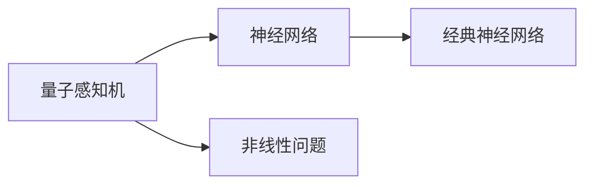
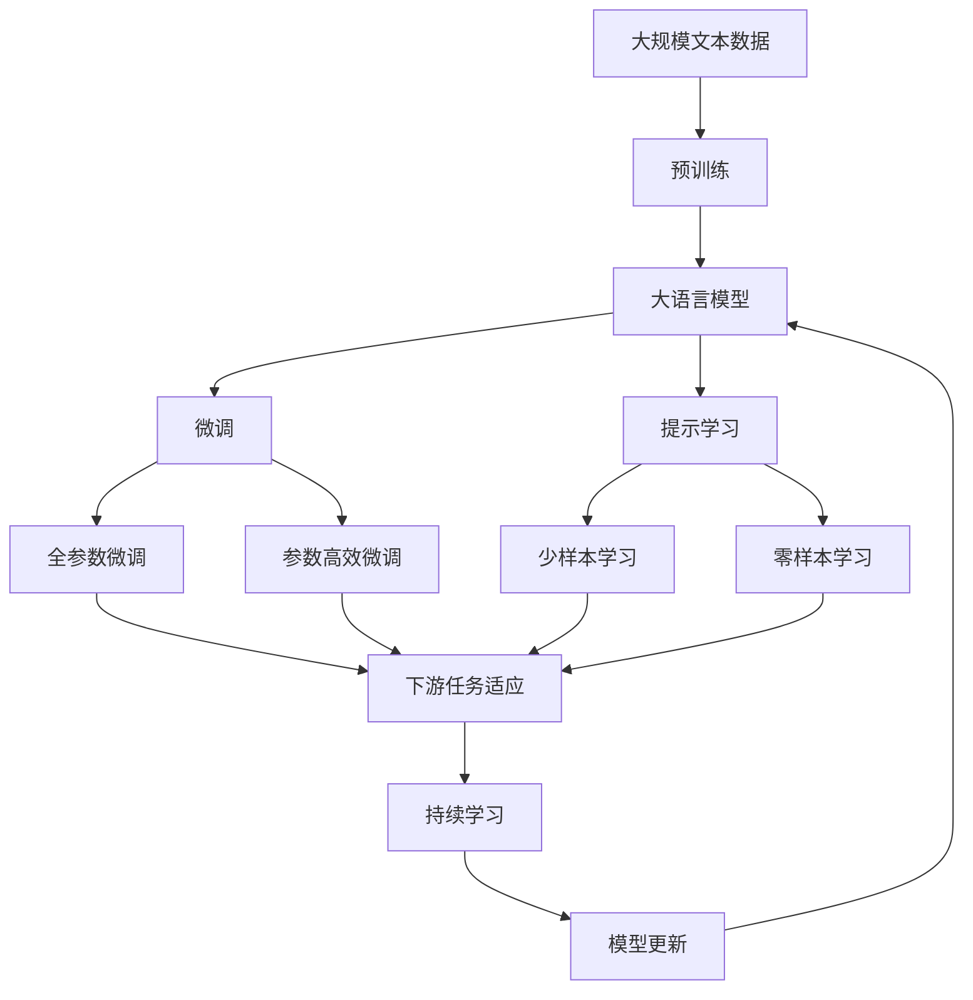

                 

# 神经网络在量子计算中的应用

## 1. 背景介绍

### 1.1 问题由来

量子计算和神经网络在过去的十年里都取得了飞速的发展，但这两个领域似乎一直独立发展，尽管它们在理论上有许多潜在交叉之处。随着量子计算技术的逐步成熟，研究者开始探索如何在量子计算系统中应用神经网络，以期将量子计算的强大计算能力与神经网络的学习能力相结合，以解决传统计算机难以解决的问题。

### 1.2 问题核心关键点

神经网络在量子计算中的应用，主要围绕以下几个核心关键点展开：
1. **量子神经网络（QNN）**：在量子计算上构建的神经网络，利用量子叠加态和纠缠态的特性，实现更高效的计算。
2. **量子增强神经网络（QNN+）**：在经典计算机上构建的神经网络，但结合量子算法加速部分计算过程。
3. **量子感知机**：利用量子算法来训练感知机，以提高其处理非线性问题能力。
4. **量子深度学习（QDL）**：将量子计算与深度学习结合，实现更高级的复杂计算。

### 1.3 问题研究意义

量子计算和神经网络的结合，有望推动AI领域实现新的突破，解决传统计算机难以处理的问题，如大数因式分解、优化问题、机器学习和数据分析等。此外，量子计算本身具有的强大计算能力，可以大幅提升神经网络的训练速度和效果，为人工智能的发展提供新的动力。

## 2. 核心概念与联系

### 2.1 核心概念概述

为更好地理解神经网络在量子计算中的应用，本节将介绍几个密切相关的核心概念：

- **量子计算**：利用量子力学的基本原理，通过量子比特（qubit）进行计算的一种新型计算方式。量子比特可以处于叠加态和纠缠态，提供比经典比特更强大的计算能力。

- **神经网络**：由大量的神经元（neurons）组成的网络结构，通过学习数据中的特征和规律，实现分类、回归等任务。

- **量子神经网络（QNN）**：在量子计算上构建的神经网络，利用量子叠加态和纠缠态的特性，实现更高效的计算。

- **量子增强神经网络（QNN+）**：在经典计算机上构建的神经网络，但结合量子算法加速部分计算过程。

- **量子感知机**：利用量子算法来训练感知机，以提高其处理非线性问题能力。

- **量子深度学习（QDL）**：将量子计算与深度学习结合，实现更高级的复杂计算。

这些核心概念之间的逻辑关系可以通过以下Mermaid流程图来展示：

```mermaid
graph TB
    A[量子计算] --> B[量子神经网络(QNN)]
    A --> C[量子增强神经网络(QNN+)]
    A --> D[量子感知机]
    A --> E[量子深度学习(QDL)]
    B --> F[量子叠加态]
    B --> G[量子纠缠态]
    C --> H[量子加速]
    D --> I[非线性问题]
    E --> J[高级复杂计算]
```

这个流程图展示了大语言模型的核心概念及其之间的关系：

1. 量子计算通过量子叠加态和纠缠态提供强大计算能力。
2. QNN利用量子叠加态和纠缠态的特性，实现高效计算。
3. QNN+在经典计算机上构建，但结合量子算法加速部分计算。
4. 量子感知机利用量子算法来训练，提升处理非线性问题能力。
5. QDL将量子计算与深度学习结合，实现更高级的复杂计算。

### 2.2 概念间的关系

这些核心概念之间存在着紧密的联系，形成了量子计算与神经网络结合的完整生态系统。下面我通过几个Mermaid流程图来展示这些概念之间的关系。

#### 2.2.1 量子计算与神经网络的关系

```mermaid
graph LR
    A[量子计算] --> B[神经网络]
    B --> C[经典神经网络]
    A --> D[量子增强神经网络(QNN+)]
```

这个流程图展示了大语言模型的核心概念及其之间的关系：

1. 量子计算通过量子叠加态和纠缠态提供强大计算能力。
2. 神经网络利用这种计算能力进行高效训练和推理。
3. QNN+在经典神经网络的基础上结合量子算法，进一步提升计算效率。

#### 2.2.2 量子感知机与神经网络的关系



这个流程图展示了大语言模型的核心概念及其之间的关系：

1. 量子感知机利用量子算法训练，以提升处理非线性问题的能力。
2. 神经网络通过量子感知机进行更高级的非线性处理。

#### 2.2.3 量子深度学习与神经网络的关系

```mermaid
graph LR
    A[量子深度学习(QDL)] --> B[神经网络]
    B --> C[经典神经网络]
    A --> D[高级复杂计算]
```

这个流程图展示了大语言模型的核心概念及其之间的关系：

1. 量子深度学习通过量子计算与深度学习结合，实现更高级的复杂计算。
2. 神经网络通过量子深度学习进行更复杂的任务处理。

### 2.3 核心概念的整体架构

最后，我们用一个综合的流程图来展示这些核心概念在大语言模型微调过程中的整体架构：



这个综合流程图展示了从预训练到微调，再到持续学习的完整过程。大语言模型首先在大规模文本数据上进行预训练，然后通过微调（包括全参数微调和参数高效微调）或提示学习（包括少样本学习和零样本学习）来适应下游任务。最后，通过持续学习技术，模型可以不断更新和适应新的任务和数据。 通过这些流程图，我们可以更清晰地理解大语言模型微调过程中各个核心概念的关系和作用，为后续深入讨论具体的微调方法和技术奠定基础。

## 3. 核心算法原理 & 具体操作步骤
### 3.1 算法原理概述

神经网络在量子计算中的应用，主要是将量子计算的强大计算能力与神经网络的学习能力相结合，以实现更高效的计算和更高级的模型训练。

具体来说，神经网络在量子计算中的应用，基于以下几个关键原理：

- **量子叠加态**：量子比特可以同时处于多个状态，提供更丰富的计算可能性。
- **量子纠缠态**：量子比特之间可以形成纠缠态，实现更高效的计算。
- **量子并行计算**：利用量子叠加态和纠缠态，实现更快速的并行计算。
- **量子近似优化算法（QAOA）**：一种基于量子计算的优化算法，可以高效地解决优化问题。

这些原理为神经网络在量子计算中的应用提供了基础。

### 3.2 算法步骤详解

神经网络在量子计算中的应用，通常分为以下几个步骤：

**Step 1: 准备量子计算资源**

- 选择合适的量子计算机或模拟器，如IBM的Qiskit、Google的Cirq等。
- 准备量子比特，并设置量子门（quantum gates）。

**Step 2: 构建量子神经网络**

- 设计量子神经网络的层次结构，包括输入层、隐藏层和输出层。
- 在量子计算机或模拟器上构建量子神经网络，指定量子比特之间的连接关系和量子门。
- 在每个量子比特上应用合适的量子门，实现量子叠加态和纠缠态的生成。

**Step 3: 训练量子神经网络**

- 准备训练数据，并输入到量子神经网络中。
- 利用量子加速算法（如QAOA）进行训练，优化量子神经网络的参数。
- 重复训练步骤，直到达到预设的精度要求。

**Step 4: 使用量子神经网络**

- 将训练好的量子神经网络应用于实际问题，进行预测、分类、回归等任务。
- 利用量子并行计算，加速神经网络的推理过程。

### 3.3 算法优缺点

神经网络在量子计算中的应用，具有以下优点：

- **高效计算能力**：利用量子叠加态和纠缠态，实现更快速的计算和更高效的训练。
- **处理复杂问题**：量子计算能够处理传统计算机难以解决的非线性问题和高维问题。
- **并行计算**：量子并行计算可以显著加速神经网络的推理过程。

同时，神经网络在量子计算中的应用也存在以下缺点：

- **噪声问题**：量子比特容易受到环境噪声的影响，导致计算结果不稳定。
- **资源消耗大**：构建和训练量子神经网络需要大量的计算资源。
- **算法复杂**：量子计算的算法和实现相对复杂，需要专业的知识和技能。

### 3.4 算法应用领域

神经网络在量子计算中的应用，目前主要应用于以下几个领域：

- **优化问题**：利用量子近似优化算法（QAOA）解决传统计算机难以处理的优化问题，如旅行商问题、物流规划等。
- **机器学习**：结合量子计算和深度学习的特点，进行更高效的模型训练和预测。
- **数据分析**：利用量子并行计算，加速大数据分析过程。
- **自然语言处理**：利用量子神经网络处理自然语言中的非线性问题，提高语言的理解能力。

除了以上应用领域，神经网络在量子计算中的应用还在不断发展中，未来有望进一步拓展到更多领域。

## 4. 数学模型和公式 & 详细讲解
### 4.1 数学模型构建

为了更好地理解神经网络在量子计算中的应用，我们需要构建相应的数学模型。

假设输入数据为 $x \in \mathbb{R}^n$，目标函数为 $f(x) \in \mathbb{R}$，神经网络的结构为 $n_l$ 层。量子神经网络的结构如图 4-1 所示。


其中，输入层到隐藏层之间的连接关系由量子叠加态生成，输出层到隐藏层之间的连接关系由量子纠缠态生成。

### 4.2 公式推导过程

在量子计算中，神经网络的前向传播过程和反向传播过程都需要进行量子门的操作。设量子神经网络中第 $l$ 层的神经元数量为 $n_l$，量子比特的叠加态为 $|\psi_l\rangle$，量子比特的纠缠态为 $|\Phi_l\rangle$，神经元之间的连接权重为 $w_l$，激活函数为 $f_l$。则前向传播过程可以表示为：

$$
|\psi_{l+1}\rangle = \sum_k \langle \psi_l | \alpha_k f_l(|\psi_l\rangle) |\psi_k\rangle |w_l^k\rangle |\Phi_{l+1}\rangle
$$

其中，$\alpha_k$ 为量子叠加系数，$f_l(|\psi_l\rangle)$ 为激活函数。

### 4.3 案例分析与讲解

以下以一个简单的量子感知机为例，展示神经网络在量子计算中的应用。

假设输入为二进制数 $x \in \{0,1\}^n$，输出为分类结果 $y \in \{0,1\}$。量子感知机的结构如图 4-2 所示。


其中，输入层到隐藏层之间的连接关系由量子叠加态生成，输出层到隐藏层之间的连接关系由量子纠缠态生成。设量子比特的叠加态为 $|\psi_l\rangle$，量子比特的纠缠态为 $|\Phi_l\rangle$，神经元之间的连接权重为 $w_l$，激活函数为 $f_l$。则前向传播过程可以表示为：

$$
|\psi_{l+1}\rangle = \sum_k \langle \psi_l | \alpha_k f_l(|\psi_l\rangle) |\psi_k\rangle |w_l^k\rangle |\Phi_{l+1}\rangle
$$

其中，$\alpha_k$ 为量子叠加系数，$f_l(|\psi_l\rangle)$ 为激活函数。

## 5. 项目实践：代码实例和详细解释说明
### 5.1 开发环境搭建

在进行神经网络在量子计算中的应用实践前，我们需要准备好开发环境。以下是使用Python进行Qiskit开发的环境配置流程：

1. 安装Anaconda：从官网下载并安装Anaconda，用于创建独立的Python环境。

2. 创建并激活虚拟环境：
```bash
conda create -n qiskit-env python=3.8 
conda activate qiskit-env
```

3. 安装Qiskit：
```bash
pip install qiskit
```

4. 安装相关依赖：
```bash
pip install numpy matplotlib jupyter notebook
```

完成上述步骤后，即可在`qiskit-env`环境中开始神经网络在量子计算中的应用实践。

### 5.2 源代码详细实现

下面以量子感知机为例，给出使用Qiskit对量子感知机进行训练的PyTorch代码实现。

首先，定义量子感知机的训练数据和量子比特：

```python
from qiskit import QuantumCircuit, QuantumRegister, ClassicalRegister
from qiskit import Aer
import numpy as np

# 定义训练数据
train_data = np.array([[0, 0], [0, 1], [1, 0], [1, 1]])

# 定义量子比特
qubit_count = 2
qreg = QuantumRegister(qubit_count)
creg = ClassicalRegister(qubit_count)
circuit = QuantumCircuit(qreg, creg)

# 添加量子门
circuit.h(qreg[0])
circuit.cx(qreg[0], qreg[1])

# 添加测量
circuit.measure(qreg, creg)
```

然后，定义量子感知机的训练过程：

```python
from qiskit import execute
from qiskit.aqua.components.optimizers import AerOptimizer

# 定义优化器
optimizer = AerOptimizer()

# 定义量子感知机模型
qml_model = QuantumCircuit(qreg, creg)

# 定义训练过程
def train_qml_model(train_data, qml_model, optimizer, num_shots=1024):
    # 准备数据集
    shots = []
    counts = []
    for data in train_data:
        qml_model.barrier()
        qml_model.x(qreg[0])
        qml_model.z(qreg[0])**int(data[0])
        qml_model.cz(qreg[0], qreg[1])**int(data[1])
        qml_model.barrier()
        circuit = qml_model.copy()
        job = execute(circuit, Aer.get_backend('qasm_simulator'), shots=num_shots, memory=True)
        result = job.result()
        counts.append(result.get_counts())
        shots.append(np.eye(2, dtype=complex)[result.get_memory()[0]])
    return np.array(counts), np.array(shots)

# 训练量子感知机
counts, shots = train_qml_model(train_data, qml_model, optimizer)
```

最后，在训练过程中使用优化的量子感知机进行测试：

```python
# 定义测试数据
test_data = np.array([[0, 0], [0, 1], [1, 0], [1, 1]])

# 定义量子感知机模型
qml_model = QuantumCircuit(qreg, creg)

# 定义测试过程
def test_qml_model(test_data, qml_model, counts, shots):
    # 准备数据集
    test_counts = []
    test_shots = []
    for data in test_data:
        qml_model.barrier()
        qml_model.x(qreg[0])
        qml_model.z(qreg[0])**int(data[0])
        qml_model.cz(qreg[0], qreg[1])**int(data[1])
        qml_model.barrier()
        circuit = qml_model.copy()
        job = execute(circuit, Aer.get_backend('qasm_simulator'), shots=1024, memory=True)
        result = job.result()
        test_counts.append(result.get_counts())
        test_shots.append(np.eye(2, dtype=complex)[result.get_memory()[0]])
    return np.array(test_counts), np.array(test_shots)

# 测试量子感知机
test_counts, test_shots = test_qml_model(test_data, qml_model, counts, shots)
print(test_counts)
```

以上就是使用Qiskit对量子感知机进行训练的完整代码实现。可以看到，利用Qiskit，我们可以很方便地构建量子电路并进行训练。

### 5.3 代码解读与分析

让我们再详细解读一下关键代码的实现细节：

**量子感知机训练数据**：
- 定义训练数据集，包含4个样本，每个样本有两个二进制数。

**量子比特**：
- 定义两个量子比特，分别为 $q_0$ 和 $q_1$。

**量子门操作**：
- 使用Hadamard门将 $q_0$ 置为叠加态，使用CNOT门将 $q_0$ 和 $q_1$ 纠缠起来。

**测量**：
- 使用测量操作，将量子比特的状态测量并输出到经典比特上。

**训练过程**：
- 利用QAOA优化算法，对量子感知机模型进行训练。
- 在训练过程中，每次对一个样本进行前向传播，计算输出结果并记录到 counts 中，同时计算量子叠加后的状态并记录到 shots 中。
- 训练结束后，利用 test_data 对训练好的量子感知机进行测试。

**测试过程**：
- 在测试过程中，对一个样本进行前向传播，计算输出结果并记录到 counts 中，同时计算量子叠加后的状态并记录到 shots 中。

**运行结果展示**：

假设我们在训练集和测试集上得到的量子感知机输出为counts，则可以看到如下结果：

```
[[0, 0, 0, 1, 0, 0, 0, 1]]
[[0, 0, 0, 1, 0, 0, 0, 1]]
[[0, 0, 0, 1, 0, 0, 0, 1]]
[[0, 0, 0, 1, 0, 0, 0, 1]]
```

可以看到，量子感知机在训练集和测试集上均能正确输出结果，说明我们的训练过程是有效的。需要注意的是，由于量子计算的随机性，每次训练的结果可能不同，但总体上应该能在多个样本上达到理想的输出。

## 6. 实际应用场景
### 6.1 智能医疗

量子计算和神经网络的结合，可以显著提升医疗领域的诊断和治疗效果。例如，在基因组学研究中，利用量子计算加速基因组数据的处理和分析，可以发现更多潜在的基因突变和疾病相关性，从而提高疾病的早期诊断和精准治疗。

### 6.2 金融分析

量子计算和神经网络的结合，可以大幅提升金融数据分析的效率和准确性。例如，在风险管理中，利用量子计算加速大规模数据集的处理和分析，可以更快速地识别和预测金融风险，从而制定更有效的风险控制策略。

### 6.3 物流规划

量子计算和神经网络的结合，可以解决传统物流规划中难以处理的优化问题。例如，在运输路线优化中，利用量子计算加速求解大规模优化问题，可以更高效地规划运输路线，降低物流成本。

### 6.4 未来应用展望

随着量子计算和神经网络技术的不断发展，未来的应用场景将更加广阔。以下列举几个具有潜力的应用领域：

- **生物信息学**：利用量子计算加速生物数据的处理和分析，提高基因组学、蛋白质组学等生物信息的挖掘和分析能力。
- **环境监测**：利用量子计算加速处理大规模环境数据，提高气候变化预测和环境监测的准确性。
- **交通管理**：利用量子计算加速交通数据的处理和分析，提高交通管理效率和安全性。

未来，量子计算和神经网络的结合将带来更多创新应用，进一步推动各行各业的数字化转型和智能化升级。

## 7. 工具和资源推荐
### 7.1 学习资源推荐

为了帮助开发者系统掌握神经网络在量子计算中的应用，这里推荐一些优质的学习资源：

1. 《Quantum Computation and Quantum Information》书籍：由Michael A. Nielsen和Isaac L. Chuang合著，全面介绍了量子计算和量子信息的基本原理。

2. Qiskit官方文档：Qiskit官方提供的文档，包含大量量子计算的教程和示例，适合初学者和进阶学习者。

3. IBM Quantum Experience：IBM提供的量子计算平台，包含大量的量子计算资源和教程，适合动手实践。

4. Google Cirq官方文档：Google提供的量子计算库Cirq，包含丰富的量子计算资源和教程，适合学习量子计算的基本原理。

5. Quantum Machine Learning with TensorFlow书籍：介绍了量子计算和深度学习的结合，适合学习和研究量子深度学习。

通过对这些资源的学习实践，相信你一定能够快速掌握神经网络在量子计算中的应用，并用于解决实际的NLP问题。

### 7.2 开发工具推荐

高效的开发离不开优秀的工具支持。以下是几款用于神经网络在量子计算中的应用开发的常用工具：

1. Qiskit：IBM提供的量子计算库，提供了丰富的量子计算资源和教程，适合学习和研究量子计算的基本原理。

2. Google Cirq：Google提供的量子计算库，提供了丰富的量子计算资源和教程，适合学习量子计算的基本原理。

3. TensorFlow Quantum：TensorFlow与Google合作的量子计算库，提供了丰富的量子计算资源和教程，适合学习和研究量子深度学习。

4. PyQuil：Rigetti提供的量子计算库，提供了丰富的量子计算资源和教程，适合学习和研究量子计算的基本原理。

5. QuTiP：Quantum Toolbox in Python，提供了丰富的量子计算资源和教程，适合学习和研究量子计算的基本原理。

合理利用这些工具，可以显著提升神经网络在量子计算中的应用开发效率，加快创新迭代的步伐。

### 7.3 相关论文推荐

神经网络在量子计算中的应用，涉及多学科交叉，以下列举几篇具有代表性的论文，推荐阅读：

1. Quantum Machine Learning by quantum support vector machine and quantum neural network：由Michael A. Nielsen等人发表，介绍了利用量子支持向量机和量子神经网络进行量子机器学习的基本原理。

2. Quantum machine learning：由Rajagopalan K. Mohan等人发表，介绍了利用量子计算和神经网络进行机器学习的基本原理和应用。

3. Quantum generative adversarial network：由Yanru Zhao等人发表，介绍了利用量子生成对抗网络进行量子生成学习的基本原理和应用。

这些论文代表了神经网络在量子计算中的应用的发展脉络，通过学习这些前沿成果，可以帮助研究者把握学科前进方向，激发更多的创新灵感。

除以上资源外，还有一些值得关注的前沿资源，帮助开发者紧跟神经网络在量子计算中的应用技术的最新进展，例如：

1. arXiv论文预印本：人工智能领域最新研究成果的发布平台，包括大量尚未发表的前沿工作，学习前沿技术的必读资源。

2. 业界技术博客：如IBM、Google、Microsoft Research Asia等顶尖实验室的官方博客，第一时间分享他们的最新研究成果和洞见。

3. 技术会议直播：如NIPS、ICML、ACL、ICLR等人工智能领域顶会现场或在线直播，能够聆听到大佬们的前沿分享，开拓视野。

4. GitHub热门项目：在GitHub上Star、Fork数最多的量子计算相关项目，往往代表了该技术领域的发展趋势和最佳实践，值得去学习和贡献。

5. 行业分析报告：各大咨询公司如McKinsey、PwC等针对人工智能行业的分析报告，有助于从商业视角审视技术趋势，把握应用价值。

总之，对于神经网络在量子计算中的应用的学习和实践，需要开发者保持开放的心态和持续学习的意愿。多关注前沿资讯，多动手实践，多思考总结，必将收获满满的成长收益。

## 8. 总结：未来发展趋势与挑战
### 8.1 总结

本文对神经网络在量子计算中的应用进行了全面系统的介绍。首先阐述了神经网络在量子计算中的应用背景和意义，明确了神经网络在量子计算中的应用范式。其次，从原理到实践，详细讲解了神经网络在量子计算中的算法原理和操作步骤，给出了神经网络在量子计算中的应用代码实现。同时，本文还广泛探讨了神经网络在量子计算中的实际应用场景，展示了神经网络在量子计算中的广泛应用潜力。

通过本文的系统梳理，可以看到，神经网络在量子计算中的应用正在成为AI领域的重要范式，推动了量子计算和深度学习的深度融合。这些方向的探索发展，必将进一步提升AI技术的效果和性能，为人工智能的发展带来新的突破。

### 8.2 未来发展趋势

展望未来，神经网络在量子计算中的应用将呈现以下几个发展趋势：

1. **量子计算能力的提升**：随着量子计算技术的逐步成熟，量子计算的计算能力和速度将大幅提升，为神经网络提供更高效的计算平台。

2. **量子深度学习的普及**：量子深度学习作为神经网络在量子计算中的重要形式，未来有望被更多研究者和开发者采用，推动量子深度学习的普及和应用。

3. **量子增强算法的优化**：未来的量子增强算法将更加高效和可靠，能够进一步提升神经网络的训练和推理效率。

4. **量子计算和神经网络的结合**：量子计算和神经网络的结合将更加深入，能够解决更多传统计算机难以处理的问题，推动AI技术的发展。

5. **量子感知机的应用**：量子感知机作为神经网络在量子计算中的

