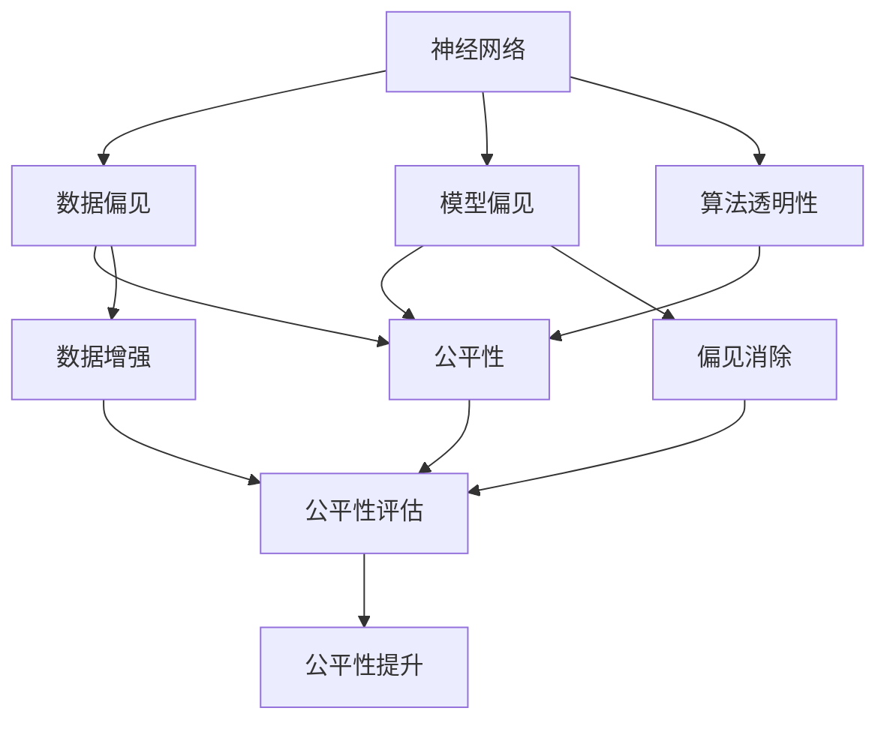
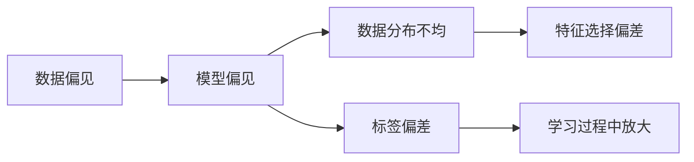
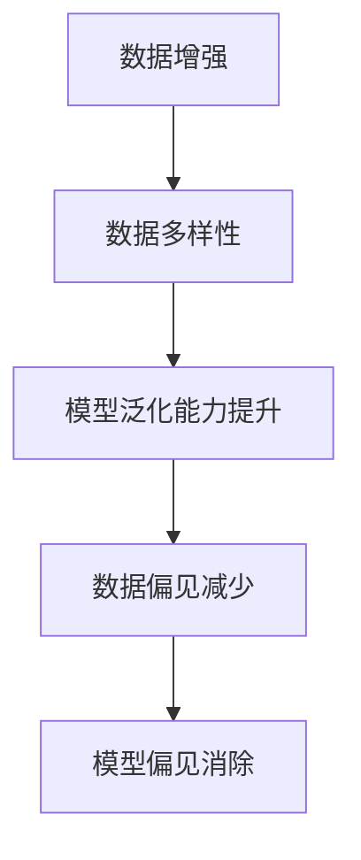

                 

# 神经网络模型的潜在偏见问题

> 关键词：神经网络, 潜在偏见, 公平性, 算法透明性, 数据增强, 偏见消除

## 1. 背景介绍

### 1.1 问题由来
随着人工智能（AI）技术在各个领域的广泛应用，深度神经网络（DNN）模型在决策和预测方面的能力愈发凸显。然而，近年来越来越多的研究表明，DNN模型在训练和推理过程中，可能会引入或放大某些偏见，从而带来不公平的决策结果，甚至导致歧视性输出。这些问题不仅仅存在于数据偏见方面，还可能源于模型架构和训练策略，因此亟需得到广泛关注和深入研究。

### 1.2 问题核心关键点
深度神经网络模型中的潜在偏见问题，主要包括以下几个关键点：

- **数据偏见**：模型在训练阶段使用到的数据样本可能存在系统性的偏差，导致模型学习到的特征偏向于某些群体，从而产生不公平的输出。
- **模型偏见**：模型架构和训练过程本身可能存在偏见，如某些层的权重分配不均或训练策略不当，可能导致模型输出结果具有歧视性。
- **算法透明性**：深度模型的决策过程复杂，难以解释和透明化，这使得偏见问题更加难以识别和纠正。
- **公平性评估**：缺乏标准化的公平性评估指标和方法，难以全面衡量模型在不同群体上的表现。

这些问题在多个实际应用场景中已经被观察到，如在金融贷款审批、司法判决、招聘录取、医疗诊断等决策过程中，模型输出显示出对某些群体的歧视性偏见。因此，理解和解决神经网络模型的潜在偏见问题，对于构建公平、透明和可信赖的AI系统至关重要。

### 1.3 问题研究意义
研究神经网络模型的潜在偏见问题，对于提升AI系统的公平性、透明性和可信赖性，具有重要的理论和实际意义：

1. **提升公平性**：通过消除或减少偏见，确保AI系统在各个群体上都能提供公平的决策和服务。
2. **增强透明性**：通过可解释性技术，使AI系统的决策过程透明化和可理解，提升用户信任。
3. **增强可信赖性**：通过识别和纠正偏见，确保AI系统的稳定性和可靠性，避免因偏见导致的系统失效。
4. **促进技术进步**：深入研究偏见问题，推动算法设计和优化方法的进步，提升AI技术的整体水平。

## 2. 核心概念与联系

### 2.1 核心概念概述

为更好地理解神经网络模型的潜在偏见问题，本节将介绍几个关键概念：

- **神经网络（Neural Network）**：由多个层次的神经元组成，通过学习输入数据和标签的映射关系，进行分类、回归等任务。深度神经网络（DNN）通常具有多层的结构，能够处理复杂的输入数据。
- **偏见（Bias）**：在数据和模型中存在的系统性偏差，导致某些群体的样本或特征被忽略或过度重视，从而影响模型的公平性。
- **公平性（Fairness）**：模型在处理不同群体数据时，应提供相同质量的服务，避免对某些群体的歧视。
- **算法透明性（Transparency）**：模型的决策过程应透明、可解释，用户能够理解模型如何做出决策。
- **数据增强（Data Augmentation）**：通过对原始数据进行扩充和变换，提高模型的泛化能力，减少过拟合和数据偏见。
- **偏见消除（Bias Mitigation）**：通过调整数据、模型和算法，降低或消除模型中的偏见，提升公平性和透明性。

这些概念之间存在着紧密的联系，构成了研究神经网络模型潜在偏见问题的完整框架。下面通过Mermaid流程图展示这些概念之间的关系：



这个流程图展示了神经网络模型中潜在偏见问题的各个方面及其相互关系：

1. 神经网络模型可能存在数据偏见和模型偏见。
2. 数据偏见和模型偏见会影响公平性，需要加以评估和处理。
3. 算法透明性有助于识别和解决偏见问题，提升公平性。
4. 数据增强和偏见消除技术可以降低模型中的偏见，提升公平性。
5. 通过公平性评估，可以全面衡量模型的公平性，指导后续的优化。

### 2.2 概念间的关系

这些核心概念之间存在着紧密的联系，形成了研究神经网络模型潜在偏见问题的完整生态系统。下面通过几个Mermaid流程图来展示这些概念之间的关系：

#### 2.2.1 数据偏见与模型偏见的关系



这个流程图展示了数据偏见如何导致模型偏见，以及模型偏见的具体表现形式：

1. 数据偏见可能会导致数据分布不均。
2. 数据分布不均可能导致特征选择偏差。
3. 特征选择偏差可能会放大标签偏差。
4. 标签偏差在模型学习过程中会被放大，导致模型偏见。

#### 2.2.2 数据增强与偏见消除的关系



这个流程图展示了数据增强如何通过提升模型泛化能力，减少数据偏见和模型偏见：

1. 数据增强可以增加数据多样性。
2. 数据多样性可以提高模型的泛化能力。
3. 提高泛化能力可以减少数据偏见。
4. 减少数据偏见可以降低模型偏见。

#### 2.2.3 算法透明性与偏见消除的关系


这个流程图展示了算法透明性如何通过解释决策过程，识别和消除偏见，提升模型公平性：

1. 算法透明性可以解释模型的决策过程。
2. 解释决策过程可以帮助识别偏见。
3. 识别偏见可以采取相应的偏见消除策略。
4. 消除偏见可以提升模型的公平性。

## 3. 核心算法原理 & 具体操作步骤
### 3.1 算法原理概述

研究神经网络模型中的潜在偏见问题，可以从数据、模型和算法三个层面进行分析。本节将详细介绍这些层面中的关键算法原理。

#### 3.1.1 数据层面

在数据层面，潜在的偏见主要来自于训练数据的不均衡和偏差。解决数据偏见的算法通常包括：

- **数据重采样**：通过过采样或欠采样，平衡数据分布。
- **合成数据生成**：使用生成对抗网络（GAN）等生成模型，合成与原始数据分布相同的新数据。
- **对抗样本生成**：通过引入对抗样本，增加数据的多样性，提升模型的鲁棒性。

#### 3.1.2 模型层面

在模型层面，潜在的偏见可能来自于模型架构和训练策略的不当设计。解决模型偏见的算法通常包括：

- **模型结构优化**：设计更加公平的模型结构，如使用公平正则化等。
- **公平损失函数**：设计针对公平性的损失函数，如最大化最小公平度（MAX-MIN公平）等。
- **模型参数调整**：通过调整模型的权重或激活函数，减少偏见的影响。

#### 3.1.3 算法层面

在算法层面，潜在的偏见可能来自于优化算法和超参数设置的不当。解决算法偏见的算法通常包括：

- **优化算法选择**：选择合适的优化算法，如AdamW、Adagrad等。
- **超参数优化**：使用超参数优化技术，如贝叶斯优化、遗传算法等，找到最优的超参数组合。
- **正则化技术**：使用L2正则、Dropout等正则化技术，防止过拟合和数据偏见。

### 3.2 算法步骤详解

下面是针对神经网络模型潜在偏见问题的具体操作步骤：

#### 3.2.1 数据准备

1. **数据收集**：收集训练数据和测试数据，确保数据集的代表性。
2. **数据清洗**：去除噪声和异常值，处理缺失值，确保数据质量。
3. **数据划分**：将数据划分为训练集、验证集和测试集，用于模型的训练、调优和评估。

#### 3.2.2 模型设计

1. **模型选择**：选择适合的深度学习模型，如卷积神经网络（CNN）、循环神经网络（RNN）、变分自编码器（VAE）等。
2. **架构设计**：设计模型架构，选择合适的层数、激活函数、正则化技术等。
3. **公平性约束**：在模型设计中加入公平性约束，如使用公平正则化、公平损失函数等。

#### 3.2.3 训练与优化

1. **模型训练**：在训练集上使用合适的优化算法和超参数，训练模型。
2. **偏见检测**：在训练过程中，使用公平性评估指标，检测模型中的偏见。
3. **偏见纠正**：根据偏见检测结果，调整模型参数或训练策略，消除偏见。
4. **模型评估**：在验证集和测试集上评估模型性能，确保偏见消除。

#### 3.2.4 部署与监控

1. **模型部署**：将训练好的模型部署到实际应用中，进行推理和预测。
2. **实时监控**：对模型输出进行实时监控，发现和纠正新的偏见。
3. **用户反馈**：收集用户反馈，持续优化模型，提升公平性和透明性。

### 3.3 算法优缺点

#### 3.3.1 优点

- **泛化能力强**：通过数据增强和模型优化，可以提高模型的泛化能力，减少数据偏见和模型偏见。
- **灵活性强**：算法透明性和偏见检测技术，使得模型的公平性和透明性可以灵活调整和优化。
- **适应性强**：适用于各种类型的深度学习模型和任务，具有广泛的应用前景。

#### 3.3.2 缺点

- **计算成本高**：数据增强和模型优化需要大量计算资源，增加训练和推理成本。
- **复杂度高**：算法透明性和偏见检测技术，增加了模型的复杂度和实现难度。
- **效果依赖数据**：模型偏见和公平性评估依赖于数据质量，数据不均衡可能导致效果不理想。

### 3.4 算法应用领域

神经网络模型的潜在偏见问题在多个领域都有广泛应用，以下是几个典型的应用场景：

- **医疗诊断**：在医疗数据中，某些群体的疾病患病率可能存在系统性偏差。通过公平性优化，确保模型在各个群体上都能提供准确的诊断结果。
- **金融风控**：在金融贷款审批和信用评分中，模型输出可能对某些群体的风险评估存在偏见。通过偏见消除技术，提升模型的公平性和透明性。
- **司法判决**：在司法判决中，模型输出可能对某些群体的判罚存在偏差。通过算法透明性和偏见检测技术，确保司法判决的公平性。
- **招聘录取**：在招聘录取中，模型输出可能对某些群体的招聘评估存在偏见。通过公平性优化和偏见消除技术，提升模型的公平性和透明性。
- **推荐系统**：在推荐系统中，模型输出可能对某些群体的推荐结果存在偏见。通过数据增强和偏见检测技术，提升推荐系统的公平性和透明性。

## 4. 数学模型和公式 & 详细讲解  
### 4.1 数学模型构建

本节将使用数学语言对神经网络模型的潜在偏见问题进行更加严格的刻画。

设神经网络模型为 $M(x;\theta)$，其中 $x$ 为输入数据，$\theta$ 为模型参数。假设训练数据集为 $D=\{(x_i,y_i)\}_{i=1}^N$，其中 $y_i$ 为标签。

定义模型的公平性度量 $\phi(D;\theta)$，用于衡量模型在不同群体上的表现。常见的公平性度量包括均等机会度量（Equal Opportunity）和最小公平度量（Minimax Fairness）。例如，均等机会度量可以定义为：

$$
\phi(D;\theta) = \min_{y \in \{0,1\}} \max_{x \in X} |P(y=1|x;M(\theta)) - P(y=1|x;M(\theta))|
$$

其中 $P(y=1|x;M(\theta))$ 表示模型在输入 $x$ 下预测为正例的概率。

### 4.2 公式推导过程

以下是均等机会度量的推导过程：

1. 假设模型在正例和负例上的预测概率分别为 $P^+(x;\theta)$ 和 $P^-(x;\theta)$，则均等机会度量可以表示为：

$$
\phi(D;\theta) = \min_{y \in \{0,1\}} \max_{x \in X} |P^+(x;\theta) - P^-(x;\theta)|
$$

2. 为了简化计算，假设正例和负例的样本分布分别为 $P_+$ 和 $P_-$，则均等机会度量可以进一步表示为：

$$
\phi(D;\theta) = \min_{y \in \{0,1\}} \max_{x \in X} |P^+(x;\theta) - P^-(x;\theta)| = \min_{y \in \{0,1\}} \max_{x \in X} |\frac{N_{y=1}(x)}{N_{y=1}(x)+N_{y=0}(x)} - \frac{N_{y=0}(x)}{N_{y=1}(x)+N_{y=0}(x)}|
$$

其中 $N_{y=1}(x)$ 和 $N_{y=0}(x)$ 分别表示样本 $x$ 在正例和负例上的数量。

3. 假设正例和负例的样本分布分别为 $p_+$ 和 $p_-$，则均等机会度量可以进一步表示为：

$$
\phi(D;\theta) = \min_{y \in \{0,1\}} \max_{x \in X} |\frac{p_+ \cdot P^+(x;\theta)}{p_+ \cdot P^+(x;\theta) + p_- \cdot P^-(x;\theta)} - \frac{p_- \cdot P^-(x;\theta)}{p_+ \cdot P^+(x;\theta) + p_- \cdot P^-(x;\theta)}|
$$

### 4.3 案例分析与讲解

以均等机会度量为例子，分析一个简单的二分类模型。假设模型 $M(x;\theta)$ 的输出为 $P(x;\theta)$，则均等机会度量可以表示为：

$$
\phi(D;\theta) = \min_{y \in \{0,1\}} \max_{x \in X} |P(x;\theta)|
$$

其中 $P(x;\theta)$ 表示模型在输入 $x$ 下预测为正例的概率。

假设模型输出为 $P(x;\theta) = \frac{1}{1+e^{-z(x;\theta)}}$，其中 $z(x;\theta) = x^\top\theta$。则均等机会度量可以表示为：

$$
\phi(D;\theta) = \min_{y \in \{0,1\}} \max_{x \in X} |P(x;\theta)|
$$

假设模型在训练数据上的均等机会度量为目标 $\phi_{\text{target}}$，则优化目标可以表示为：

$$
\min_{\theta} \mathcal{L}(\theta) = \min_{\theta} \frac{1}{N} \sum_{i=1}^N \ell(y_i, M(x_i;\theta)) + \lambda \phi(D;\theta) - \lambda \phi_{\text{target}}
$$

其中 $\ell$ 为损失函数，$\lambda$ 为公平性约束系数。

在实际应用中，可以通过调整模型参数和公平性约束系数，优化模型的均等机会度量，确保模型在各个群体上提供公平的服务。

## 5. 项目实践：代码实例和详细解释说明
### 5.1 开发环境搭建

在进行神经网络模型偏见问题研究前，我们需要准备好开发环境。以下是使用Python进行TensorFlow开发的环境配置流程：

1. 安装Anaconda：从官网下载并安装Anaconda，用于创建独立的Python环境。

2. 创建并激活虚拟环境：
```bash
conda create -n tf-env python=3.8 
conda activate tf-env
```

3. 安装TensorFlow：根据CUDA版本，从官网获取对应的安装命令。例如：
```bash
conda install tensorflow
```

4. 安装各类工具包：
```bash
pip install numpy pandas scikit-learn matplotlib tqdm jupyter notebook ipython
```

完成上述步骤后，即可在`tf-env`环境中开始偏见问题的研究。

### 5.2 源代码详细实现

这里我们以生成对抗网络（GAN）为例，生成与原始数据分布相同的新数据，减少数据偏见。

首先，定义GAN模型：

```python
import tensorflow as tf
from tensorflow.keras import layers

def make_generator(input_dim):
    model = tf.keras.Sequential([
        layers.Dense(256, input_shape=(input_dim,)),
        layers.BatchNormalization(),
        layers.LeakyReLU(),
        layers.Dense(256),
        layers.BatchNormalization(),
        layers.LeakyReLU(),
        layers.Dense(784, activation='tanh')
    ])
    return model

def make_discriminator(input_dim):
    model = tf.keras.Sequential([
        layers.Dense(256, input_shape=(input_dim,)),
        layers.BatchNormalization(),
        layers.LeakyReLU(),
        layers.Dropout(0.5),
        layers.Dense(256),
        layers.BatchNormalization(),
        layers.LeakyReLU(),
        layers.Dropout(0.5),
        layers.Dense(1, activation='sigmoid')
    ])
    return model
```

然后，定义训练GAN模型的函数：

```python
def train_gan(generator, discriminator, input_dim, epochs=100, batch_size=128):
    input_dim = 784
    for epoch in range(epochs):
        for batch in tf.data.Dataset.from_tensor_slices(np.random.uniform(-1, 1, (batch_size, input_dim))).batch(batch_size):
            real_images = batch
            real_labels = tf.ones_like(real_images)
            fake_images = generator(batch)
            fake_labels = tf.zeros_like(real_images)

            with tf.GradientTape() as tape:
                gen_loss = discriminator.train_on_batch(fake_images, fake_labels)
                disc_loss = discriminator.train_on_batch(real_images, real_labels)
                tape.watch([generator.trainable_variables, discriminator.trainable_variables])
                gen_grads = tape.gradient(gen_loss, generator.trainable_variables)
                disc_grads = tape.gradient(disc_loss, discriminator.trainable_variables)

            optimizer.apply_gradients(zip(gen_grads, generator.trainable_variables))
            optimizer.apply_gradients(zip(disc_grads, discriminator.trainable_variables))
```

最后，启动训练流程：

```python
input_dim = 784

generator = make_generator(input_dim)
discriminator = make_discriminator(input_dim)

train_gan(generator, discriminator, input_dim)
```

以上就是使用TensorFlow生成对抗网络生成新数据的代码实现。可以看到，通过GAN模型，我们可以生成与原始数据分布相同的新数据，从而减少数据偏见。

### 5.3 代码解读与分析

让我们再详细解读一下关键代码的实现细节：

**make_generator函数**：
- 定义生成器的架构，使用两个Dense层、两个BatchNormalization层和两个LeakyReLU激活函数，最后使用Tanh激活函数将输出归一化到[-1,1]。

**make_discriminator函数**：
- 定义判别器的架构，使用两个Dense层、两个BatchNormalization层、两个LeakyReLU激活函数和两个Dropout层，最后使用Sigmoid激活函数输出预测结果。

**train_gan函数**：
- 定义训练GAN模型的过程，包括生成器和判别器的损失函数、梯度计算和模型更新。

**启动训练流程**：
- 定义输入维度，创建生成器和判别器模型。
- 调用训练函数，训练GAN模型。

GAN模型在生成对抗网络生成新数据方面具有出色的表现，能够有效地减少数据偏见。然而，GAN模型的训练过程复杂，训练时间长，需要大量计算资源。在实际应用中，还需要考虑模型的稳定性和泛化能力，确保生成的新数据对模型训练有意义。

## 6. 实际应用场景
### 6.1 金融风控

在金融风控领域，模型输出可能对某些群体的风险评估存在偏见。通过GAN等数据增强技术，生成与原始数据分布相同的新数据，可以减少数据偏见，提升模型的公平性和透明性。

在具体应用中，可以收集用户的贷款申请数据，包括用户的个人信息、收入、职业、信用记录等。然后，使用GAN生成与原始数据分布相同的新数据，扩充训练集，确保模型在各个群体上都能提供公平的评估结果。

### 6.2 医疗诊断

在医疗诊断中，模型输出可能对某些群体的疾病诊断存在偏见。通过GAN等数据增强技术，生成与原始数据分布相同的新数据，可以减少数据偏见，提升模型的公平性和透明性。

在具体应用中，可以收集患者的病历数据，包括患者的个人信息、病史、体征、检查结果等。然后，使用GAN生成与原始数据分布相同的新数据，扩充训练集，确保模型在各个群体上都能提供准确的诊断结果。

### 6.3 司法判决

在司法判决中，模型输出可能对某些群体的判罚存在偏见。通过GAN等数据增强技术，生成与原始数据分布相同的新数据，可以减少数据偏见，提升模型的公平性和透明性。

在具体应用中，可以收集历史案件数据，包括案件的详细信息、证据、证人证词、判罚结果等。然后，使用GAN生成与原始数据分布相同的新数据，扩充训练集，确保模型在各个群体上都能提供公平的判罚结果。

### 6.4 推荐系统

在推荐系统中，模型输出可能对某些群体的推荐结果存在偏见。通过GAN等数据增强技术，生成与原始数据分布相同的新数据，可以减少数据偏见，提升模型的公平性和透明性。

在具体应用中，可以收集用户的浏览、点击、购买等行为数据，提取和用户交互的物品标题、描述、标签等文本内容。然后，使用GAN生成与原始数据分布相同的新数据，扩充训练集，确保模型在各个群体上都能提供公平的推荐结果。

### 6.5 招聘录取

在招聘录取中，模型输出可能对某些群体的招聘评估存在偏见。通过GAN等数据增强技术，生成与原始数据分布相同的新数据，可以减少数据偏见，提升模型的公平性和透明性。

在具体应用中，可以收集历史招聘数据，包括求职者的个人信息、简历、面试表现、工作经历等。然后，使用GAN生成与原始数据分布相同的新数据，扩充训练集，确保模型在各个群体上都能提供公平的招聘评估结果。

## 7. 工具和资源推荐
### 7.1 学习资源推荐

为了帮助开发者系统掌握神经网络模型偏见问题的理论基础和实践技巧，这里推荐一些优质的学习资源：

1. 《深度学习基础》系列博文：由大模型技术专家撰写，介绍了深度学习的基础概念和算法原理，包括神经网络、优化算法、正则化技术等。

2. 《TensorFlow官方文档》：TensorFlow官方提供的详细文档，包含了大量预训练模型和完整的训练样例代码，是上手实践的必备资料。

3. 《Python深度学习》书籍：Ian Goodfellow等人合著的深度学习经典教材，全面介绍了深度学习的基本概念和实现方法，包括神经网络、GAN等。

4. 《公平学习：方法、应用和挑战》书籍：探讨了公平学习的基本概念和前沿研究，提供了大量实际案例和解决方案，值得深入学习。

5. 《深度学习中的公平性和透明性》论文集：汇集了深度学习领域关于公平性和透明性的最新研究成果，是研究这方面的重要参考资料。

通过对这些资源的学习实践，相信你一定能够快速掌握神经网络模型偏见问题的精髓，并用于解决实际的AI问题。
###  7.2 开发工具推荐

高效的开发离不开优秀的工具支持。以下是几款用于神经网络模型偏见问题研究的常用工具：

1. TensorFlow：由Google主导开发的开源深度学习框架，生产部署方便，适合大规模工程应用。同样有丰富的预训练语言模型资源。

2. PyTorch：基于Python的开源深度学习框架，灵活动态的计算图，适合快速迭代研究。大部分预训练语言模型都有PyTorch版本的实现。

3. Keras：基于TensorFlow和Theano的高层API，易于上手，适合快速原型开发和模型训练。

4. Scikit-learn：基于Python的机器学习库，提供了丰富的数据预处理、特征工程和模型评估工具。

5. Jupyter Notebook：交互式笔记本工具，适合快速实验和模型迭代。

合理利用这些工具，可以显著提升神经网络模型偏见问题的研究效率，加快创新迭代的步伐。

### 7.3 相关论文推荐

神经网络模型偏见问题的研究源于学界的持续研究。以下是几篇奠基性的相关论文，推荐阅读：

1. Delving Deep into Generative Adversarial Nets：

