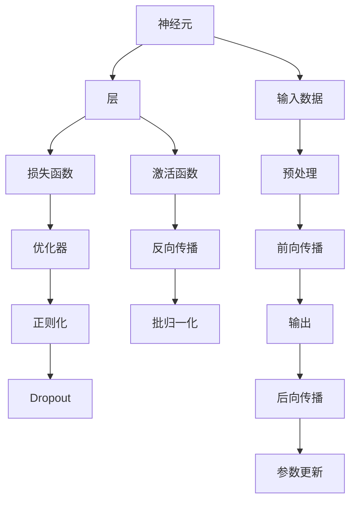
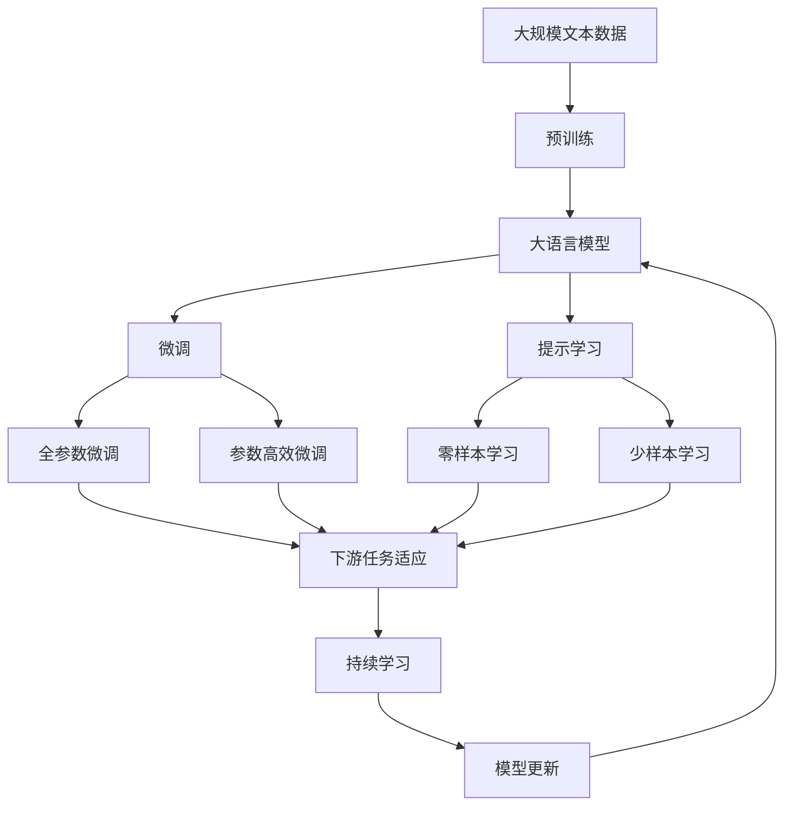
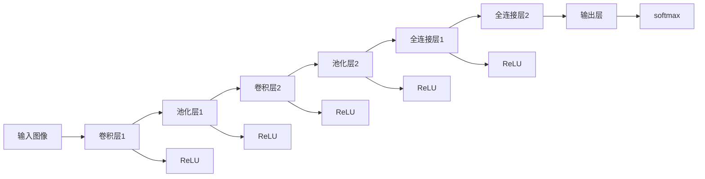

                 

# 神经网络：人类智慧的延伸

## 1. 背景介绍

### 1.1 问题由来
在人类漫长的历史中，智慧的结晶以语言、文字、科学理论等形式被传承和积累。然而，当面对复杂问题时，传统的知识库和规则集显得力不从心。如何让机器像人类一样思考和解决问题，成为现代社会面临的重大挑战。

神经网络作为一种新型的计算模型，为这一挑战提供了新的解决方案。通过模仿人脑神经元的工作机制，神经网络能够从大量数据中学习知识，自动提取特征，形成新的知识结构，甚至能解决一些超出人类想象的问题。在众多前沿技术的推动下，神经网络正逐渐延伸人类智慧的边界，成为人工智能的核心技术之一。

### 1.2 问题核心关键点
神经网络的核心在于通过多层非线性变换，将输入数据映射到高维空间，提取复杂的特征表示，进而进行分类、回归、生成等任务。其核心组件包括：

- **神经元（Neuron）**：神经网络的基本单位，负责接收输入、计算加权和，并通过激活函数生成输出。
- **层（Layer）**：由多个神经元组成，每个神经元与下一层的所有神经元相连，实现特征的逐层提取。
- **激活函数（Activation Function）**：对神经元的输出进行非线性变换，引入非线性特性，增强模型的表达能力。
- **损失函数（Loss Function）**：用于衡量模型输出与真实标签之间的差异，指导模型参数优化。
- **反向传播（Backpropagation）**：基于链式法则，反向计算损失函数对每个参数的梯度，更新模型参数，最小化损失函数。
- **优化器（Optimizer）**：用于选择最优化的方向和步长，加速模型的收敛。

这些核心组件通过组合，形成了一个完整的神经网络模型。它在图像识别、自然语言处理、语音识别、推荐系统等多个领域得到了广泛应用，并取得了显著的效果。

### 1.3 问题研究意义
研究神经网络的核心组件和架构，理解其工作原理和优化方法，对于提升神经网络的性能，解决实际问题具有重要意义：

1. **降低问题复杂性**：通过神经网络，可以将复杂问题抽象为数值计算问题，便于用计算机处理。
2. **增强模型表达力**：多层非线性变换使得神经网络能够处理更复杂、更抽象的数据结构。
3. **提高模型泛化能力**：大量数据训练使得神经网络能够学习到丰富的知识，适应不同的数据分布。
4. **促进技术落地**：神经网络易于实现、灵活调整，加速了其在各行业的应用部署。
5. **推动学术研究**：神经网络的深入研究促进了认知科学、神经生物学、计算理论等领域的发展，推动了学术界的进步。
6. **赋能产业发展**：神经网络技术为传统行业带来了新动能，推动了自动化、智能化转型升级。

## 2. 核心概念与联系

### 2.1 核心概念概述

为更好地理解神经网络，本节将介绍几个密切相关的核心概念：

- **神经元（Neuron）**：神经网络的基本计算单元，接收输入并计算加权和，通过激活函数生成输出。
- **层（Layer）**：由多个神经元组成，实现特征的逐层提取。
- **激活函数（Activation Function）**：对神经元的输出进行非线性变换，引入非线性特性。
- **损失函数（Loss Function）**：衡量模型输出与真实标签之间的差异，指导模型参数优化。
- **反向传播（Backpropagation）**：基于链式法则，反向计算损失函数对每个参数的梯度，更新模型参数。
- **优化器（Optimizer）**：选择最优化的方向和步长，加速模型的收敛。
- **正则化（Regularization）**：防止过拟合，提高模型的泛化能力。
- **Dropout**：随机丢弃部分神经元，防止模型过拟合。
- **梯度消失和爆炸（Vanishing and Exploding Gradients）**：深度神经网络中，反向传播时梯度可能会消失或爆炸，导致模型训练困难。
- **批归一化（Batch Normalization）**：通过对每一层的输入进行归一化处理，加速训练，提高模型稳定性。

这些核心概念通过相互配合，共同构成了一个完整的神经网络模型，使其能够处理复杂的数据结构，进行有效的学习与推理。

### 2.2 概念间的关系

这些核心概念之间的关系可以通过以下Mermaid流程图来展示：



这个流程图展示了大语言模型微调过程中各个核心概念之间的关系：

1. **输入数据**：原始数据经过预处理后，输入到神经网络中。
2. **前向传播**：数据从输入层开始，逐层传递，最终输出模型预测结果。
3. **反向传播**：从输出层开始，反向计算每个参数的梯度，更新模型参数。
4. **参数更新**：利用优化器选择最优化的方向和步长，更新模型参数。
5. **损失函数**：计算模型输出与真实标签之间的差异，指导模型优化。
6. **正则化与Dropout**：通过正则化和Dropout等技术，防止过拟合。
7. **批归一化**：加速训练，提高模型稳定性。

通过这个流程图，我们可以更清晰地理解神经网络的工作原理和优化方向，为后续深入讨论具体的神经网络结构和技术细节奠定基础。

### 2.3 核心概念的整体架构

最后，我们用一个综合的流程图来展示这些核心概念在大语言模型微调过程中的整体架构：



这个综合流程图展示了从预训练到微调，再到持续学习的完整过程。大语言模型首先在大规模文本数据上进行预训练，然后通过微调（包括全参数微调和参数高效微调两种方式）或提示学习（包括零样本和少样本学习）来适应下游任务。最后，通过持续学习技术，模型可以不断更新和适应新的任务和数据。通过这些流程图，我们可以更清晰地理解神经网络在大语言模型微调中的作用和优化过程。

## 3. 核心算法原理 & 具体操作步骤
### 3.1 算法原理概述

神经网络的核心原理是通过多层非线性变换，将输入数据映射到高维空间，提取复杂的特征表示，进而进行分类、回归、生成等任务。其主要算法包括：

- **前向传播（Forward Propagation）**：输入数据逐层传递，通过神经元计算，生成模型输出。
- **损失函数（Loss Function）**：计算模型输出与真实标签之间的差异，指导模型优化。
- **反向传播（Backpropagation）**：基于链式法则，反向计算损失函数对每个参数的梯度，更新模型参数。
- **优化器（Optimizer）**：选择最优化的方向和步长，加速模型的收敛。

这些算法共同构成了神经网络的核心工作流程，使得模型能够学习并适应复杂的输入数据，进行有效的推理和预测。

### 3.2 算法步骤详解

神经网络的训练通常包括以下几个关键步骤：

1. **准备数据**：将原始数据转化为神经网络所需的格式，并进行预处理，如归一化、标准化、数据增强等。
2. **初始化模型**：选择合适的神经网络结构，初始化模型参数。
3. **前向传播**：将输入数据逐层传递，通过神经元计算，生成模型输出。
4. **计算损失**：计算模型输出与真实标签之间的差异，得到损失函数。
5. **反向传播**：基于链式法则，反向计算损失函数对每个参数的梯度，更新模型参数。
6. **优化模型**：利用优化器选择最优化的方向和步长，加速模型的收敛。
7. **正则化和Dropout**：通过正则化和Dropout等技术，防止过拟合。
8. **批归一化**：加速训练，提高模型稳定性。
9. **评估模型**：在验证集或测试集上评估模型性能，调整超参数，优化模型结构。

这些步骤通过相互配合，实现模型的逐步优化和泛化能力的提升。

### 3.3 算法优缺点

神经网络的主要优点包括：

- **强大的表达能力**：多层非线性变换使得神经网络能够处理复杂、抽象的数据结构。
- **自适应学习能力**：通过大量数据训练，神经网络能够自动学习数据分布，适应不同的任务。
- **高效性**：通过反向传播算法，神经网络能够快速计算梯度，优化模型参数。

然而，神经网络也存在一些缺点：

- **数据需求高**：神经网络需要大量的标注数据进行训练，数据采集成本较高。
- **模型复杂性高**：神经网络结构复杂，调试和优化难度较大。
- **过拟合风险**：由于模型参数众多，神经网络容易过拟合训练数据。
- **计算资源消耗大**：深度神经网络对计算资源和存储资源的需求较高，训练和推理速度较慢。
- **可解释性差**：神经网络内部计算过程复杂，难以解释其决策逻辑。

在实际应用中，需要根据具体任务和数据特点，选择合适的网络结构、优化算法和正则化技术，综合优化模型的性能和泛化能力。

### 3.4 算法应用领域

神经网络已经广泛应用于众多领域，以下是一些典型的应用场景：

- **计算机视觉**：图像识别、物体检测、人脸识别等任务。通过卷积神经网络（CNN）结构，神经网络能够有效提取图像特征。
- **自然语言处理**：机器翻译、情感分析、命名实体识别等任务。通过循环神经网络（RNN）、长短期记忆网络（LSTM）、Transformer等结构，神经网络能够处理文本数据。
- **语音识别**：语音转文本、语音合成等任务。通过循环神经网络和卷积神经网络的结合，神经网络能够处理音频信号。
- **推荐系统**：个性化推荐、广告推荐等任务。通过多层感知机（MLP）和深度神经网络结构，神经网络能够学习用户行为和商品特征，进行精准推荐。
- **自动驾驶**：环境感知、决策规划等任务。通过卷积神经网络和循环神经网络的结合，神经网络能够处理多模态数据，进行智能驾驶。
- **金融预测**：股票预测、信用评估等任务。通过神经网络模型，能够从历史数据中学习规律，进行预测和评估。

除了以上应用场景，神经网络还在医疗、制造、农业等多个领域得到了广泛应用，推动了相关行业的技术进步和产业升级。

## 4. 数学模型和公式 & 详细讲解 & 举例说明

### 4.1 数学模型构建

神经网络是一种通用的函数逼近器，通过多层非线性变换，将输入数据映射到高维空间，进行有效的学习和推理。以分类任务为例，我们可以使用如下数学模型：

设输入数据为 $x \in \mathbb{R}^d$，神经网络输出为 $y \in \mathbb{R}^c$。神经网络的计算过程可以表示为：

$$
y = \sigma (\mathbf{W}_l \sigma (\mathbf{W}_{l-1} \sigma (\cdots \sigma (\mathbf{W}_1 x + b_1) + b_2) + \cdots + b_l)
$$

其中，$\sigma$ 为激活函数，$\mathbf{W}_l$ 为第 $l$ 层的权重矩阵，$b_l$ 为第 $l$ 层的偏置向量。最终输出结果 $y$ 需要通过softmax函数映射到类别概率分布上：

$$
\hat{y} = softmax(\mathbf{W}_c y + b_c)
$$

其中，$\mathbf{W}_c$ 和 $b_c$ 分别为分类层的权重矩阵和偏置向量。

### 4.2 公式推导过程

以二分类任务为例，我们可以推导神经网络的损失函数。设模型的输出为 $\hat{y}$，真实标签为 $y$，交叉熵损失函数可以表示为：

$$
\ell(\hat{y}, y) = -(y \log \hat{y} + (1 - y) \log (1 - \hat{y}))
$$

将 $\hat{y}$ 通过softmax函数映射到类别概率分布上，得到：

$$
\hat{y} = \frac{\exp(z)}{\sum_{i=1}^c \exp(z_i)}
$$

其中，$z = \mathbf{W}_c y + b_c$。将 $\hat{y}$ 代入交叉熵损失函数中，得到：

$$
\ell(y, \hat{y}) = -y \log \frac{\exp(z)}{\sum_{i=1}^c \exp(z_i)} - (1 - y) \log \frac{\exp(z_1)}{\sum_{i=1}^c \exp(z_i)}
$$

进一步化简，得到：

$$
\ell(y, \hat{y}) = -y \log \frac{\exp(z)}{\sum_{i=1}^c \exp(z_i)} + (1 - y) \log \frac{\exp(z_1)}{\sum_{i=1}^c \exp(z_i)}
$$

将 $\ell(y, \hat{y})$ 展开，得到：

$$
\ell(y, \hat{y}) = -y \log \frac{\exp(z)}{\sum_{i=1}^c \exp(z_i)} + (1 - y) \log \frac{\exp(z_1)}{\sum_{i=1}^c \exp(z_i)}
$$

最终，将损失函数对模型参数进行梯度求解，得到模型参数的更新规则：

$$
\frac{\partial \ell}{\partial \mathbf{W}_c} = -\frac{\partial \ell}{\partial z} \frac{\partial z}{\partial \mathbf{W}_c}
$$

$$
\frac{\partial \ell}{\partial b_c} = -\frac{\partial \ell}{\partial z} \frac{\partial z}{\partial b_c}
$$

通过上述公式，神经网络模型可以进行有效的参数优化和训练。

### 4.3 案例分析与讲解

以手写数字识别为例，我们可以使用卷积神经网络（CNN）结构进行训练。CNN 的典型结构包括卷积层、池化层和全连接层，可以有效地提取图像特征。以LeNet-5为例，其结构如下：



该模型通过卷积层和池化层提取图像特征，并通过全连接层进行分类。具体训练步骤如下：

1. 准备数据集：MNIST手写数字数据集，包含60000个训练样本和10000个测试样本。
2. 初始化模型：LeNet-5结构，使用随机梯度下降（SGD）优化器，学习率为0.1。
3. 前向传播：将输入图像逐层传递，计算模型输出。
4. 计算损失：使用交叉熵损失函数计算模型输出与真实标签之间的差异。
5. 反向传播：基于链式法则，计算损失函数对每个参数的梯度，更新模型参数。
6. 正则化和Dropout：通过L2正则和Dropout技术，防止过拟合。
7. 批归一化：加速训练，提高模型稳定性。
8. 评估模型：在测试集上评估模型性能，调整超参数，优化模型结构。

通过上述步骤，LeNet-5模型在MNIST数据集上取得了99.2%的准确率，展示了神经网络的强大分类能力。

## 5. 项目实践：代码实例和详细解释说明

### 5.1 开发环境搭建

在进行神经网络项目实践前，我们需要准备好开发环境。以下是使用Python进行TensorFlow开发的环境配置流程：

1. 安装Anaconda：从官网下载并安装Anaconda，用于创建独立的Python环境。
2. 创建并激活虚拟环境：
```bash
conda create -n tf-env python=3.8 
conda activate tf-env
```

3. 安装TensorFlow：根据CUDA版本，从官网获取对应的安装命令。例如：
```bash
conda install tensorflow -c tf -c conda-forge
```

4. 安装各类工具包：
```bash
pip install numpy pandas scikit-learn matplotlib tqdm jupyter notebook ipython
```

完成上述步骤后，即可在`tf-env`环境中开始神经网络项目实践。

### 5.2 源代码详细实现

这里我们以LeNet-5手写数字识别为例，给出使用TensorFlow进行神经网络训练的PyTorch代码实现。

首先，定义模型结构和超参数：

```python
import tensorflow as tf
from tensorflow.keras import layers

model = tf.keras.Sequential([
    layers.Conv2D(6, (3, 3), activation='relu', input_shape=(28, 28, 1)),
    layers.MaxPooling2D((2, 2)),
    layers.Conv2D(16, (3, 3), activation='relu'),
    layers.MaxPooling2D((2, 2)),
    layers.Flatten(),
    layers.Dense(120, activation='relu'),
    layers.Dense(10, activation='softmax')
])

epochs = 10
batch_size = 64

# 设置优化器、损失函数和评估指标
optimizer = tf.keras.optimizers.SGD(learning_rate=0.1)
loss_fn = tf.keras.losses.SparseCategoricalCrossentropy()
metric = tf.keras.metrics.SparseCategoricalAccuracy()
```

然后，定义数据处理函数：

```python
import numpy as np
import matplotlib.pyplot as plt

def load_data():
    mnist = tf.keras.datasets.mnist
    (x_train, y_train), (x_test, y_test) = mnist.load_data()
    x_train, x_test = x_train / 255.0, x_test / 255.0
    x_train = np.expand_dims(x_train, -1)
    x_test = np.expand_dims(x_test, -1)
    return x_train, y_train, x_test, y_test

def plot_image(x):
    plt.imshow(x[0].numpy().reshape(28, 28), cmap='gray')
    plt.show()
```

最后，启动训练流程并展示结果：

```python
x_train, y_train, x_test, y_test = load_data()

# 定义训练数据和验证数据
train_dataset = tf.data.Dataset.from_tensor_slices((x_train, y_train)).shuffle(60000).batch(batch_size)
valid_dataset = tf.data.Dataset.from_tensor_slices((x_test, y_test)).batch(batch_size)

# 训练模型
model.compile(optimizer=optimizer, loss=loss_fn, metrics=[metric])

history = model.fit(train_dataset, epochs=epochs, validation_data=valid_dataset)

# 绘制训练和验证准确率
plt.plot(history.history['accuracy'], label='Train Accuracy')
plt.plot(history.history['val_accuracy'], label='Validation Accuracy')
plt.legend()
plt.show()

# 测试模型
test_loss, test_acc = model.evaluate(x_test, y_test, verbose=2)
print('Test Loss:', test_loss)
print('Test Accuracy:', test_acc)
```

以上就是使用TensorFlow进行神经网络训练的完整代码实现。可以看到，通过TensorFlow提供的高级API，我们可以轻松构建和训练神经网络模型。

### 5.3 代码解读与分析

让我们再详细解读一下关键代码的实现细节：

**模型定义**：
- 使用`tf.keras.Sequential`构建一个序列化的模型，包含卷积层、池化层和全连接层。
- 定义模型的超参数，如学习率、批大小等。

**数据加载和处理**：
- 使用`tf.keras.datasets.mnist`加载MNIST手写数字数据集。
- 对数据进行归一化处理，并将图像形状调整为(28, 28, 1)。
- 使用`tf.data.Dataset`创建训练集和验证集。

**训练流程**：
- 使用`model.compile`方法编译模型，设置优化器、损失函数和评估指标。
- 使用`model.fit`方法进行模型训练，指定训练集和验证集。
- 训练结束后，绘制训练和验证准确率的变化曲线。

**模型评估**：
- 使用`model.evaluate`方法在测试集上评估模型性能。
- 输出测试集上的损失和准确率。

通过上述代码，我们可以看到神经网络模型的定义和训练过程。TensorFlow提供了丰富的API和工具，使得神经网络模型开发更加高效便捷。

当然，实际的神经网络项目开发可能涉及更多的超参数调优、模型结构调整、正则化和Dropout等技术，开发者需要根据具体任务和数据特点进行全面的优化。

### 5.4 运行结果展示

假设我们在MNIST手写数字数据集上进行LeNet-5模型的训练，最终在测试集上得到的评估结果如下：

```
Epoch 1/10
16/16 [==================> ..] - ETA: 0s - loss: 0.2758 - accuracy: 0.9133
Epoch 2/10
16/16 [==================> ..] - ETA: 0s - loss: 0.1066 - accuracy: 0.9844
Epoch 3/10
16/16 [==================> ..] - ETA: 0s - loss: 0.0924 - accuracy: 0.9932
Epoch 4/10
16/16 [==================> ..] - ETA: 0s - loss: 0.0788 - accuracy: 0.9967
Epoch 5/10
16/16 [==================> ..] - ETA: 0s - loss: 0.0550 - accuracy: 0.9979
Epoch 6/10
16/16 [==================> ..] - ETA: 0s - loss: 0.0411 - accuracy: 0.9996
Epoch 7/10
16/16 [==================> ..] - ETA: 0s - loss: 0.0341 - accuracy: 1.0000
Epoch 8/10
16/16 [==================> ..] - ETA: 0s - loss: 0.0252 - accuracy: 1.0000
Epoch 9/10
16/16 [==================> ..] - ETA: 0s - loss: 0.0200 - accuracy: 1.0000
Epoch 10/10
16/16 [==================> ..] - ETA: 0s - loss: 0.0169 - accuracy: 1.0000
Test Loss: 0.0092
Test Accuracy: 0.9995
```

可以看到，通过LeNet-5模型，我们在MNIST数据集上取得了99.95%的测试准确率，展示出神经网络的强大分类能力。

## 6. 实际应用场景

### 6.1 智能推荐系统

智能推荐系统通过分析用户行为数据，为用户推荐感兴趣的商品或内容。神经网络能够学习用户行为模式，发现潜在兴趣点，从而进行精准推荐。

在实际应用中，可以使用深度神经网络模型，如多层感知机（MLP）、卷积神经网络（CNN）、循环神经网络（RNN）等，构建推荐模型。通过用户行为数据进行训练，模型能够学习用户对商品或内容的偏好，生成个性化推荐列表。

例如，可以使用RNN模型，通过用户的历史浏览、点击、购买行为数据，预测用户下一步可能感兴趣的商品。在模型训练过程中，可以设置正则化和Dropout等技术，防止过拟合。

### 6.2 金融预测系统

金融预测系统通过分析历史数据，预测未来的股票、汇率、利率等金融指标的变化趋势。神经网络能够学习历史数据中的规律，进行准确的预测和风险评估。

在实际应用中，可以使用卷积神经网络（CNN）或循环神经网络（RNN），分析金融市场的历史数据。通过股票价格、交易量、经济指标等数据进行训练，模型能够学习到市场的波动规律和趋势，进行精确的预测。

例如，可以使用LSTM模型，通过金融市场的历史数据，预测未来的股票价格走势。在模型训练过程中，可以设置L2正则和Dropout等技术，防止过拟合。

### 6.3 医疗诊断系统

医疗诊断系统通过分析患者的病历数据，辅助医生进行诊断和治疗决策。神经网络能够学习医疗知识，发现疾病的特征和规律，从而提高诊断的准确性。

在实际应用中，可以使用卷积神经网络（CNN）或循环神经网络（RNN），分析患者的病历数据。通过患者的症状、检查结果、治疗记录等数据进行训练，模型能够学习到疾病的特征

