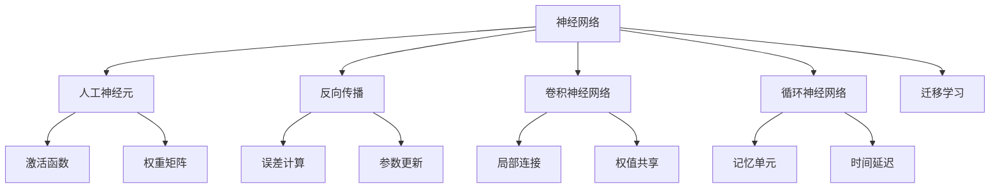
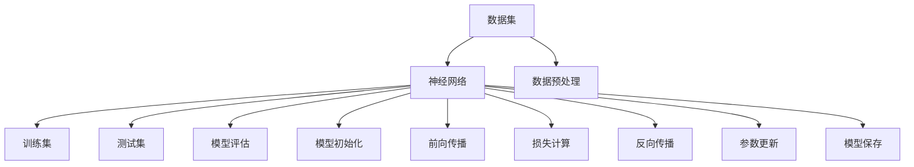
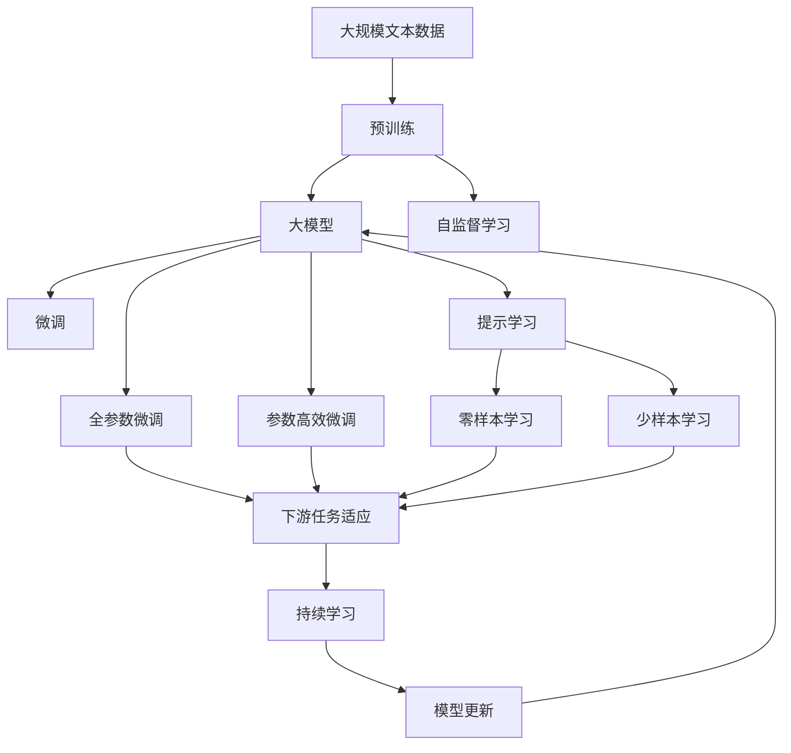
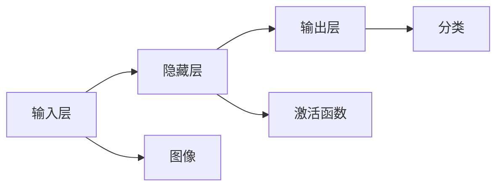

                 

# 神经网络：人类智慧的延伸

> 关键词：神经网络,深度学习,反向传播,人工神经元,卷积神经网络,循环神经网络,迁移学习

## 1. 背景介绍

### 1.1 问题由来
深度学习技术的快速发展，使得人工智能领域在图像识别、自然语言处理、语音识别等众多方向取得了突破性进展。其中，神经网络作为深度学习的重要工具，通过模拟人脑的神经元间连接方式，实现了强大的数据处理和模式识别能力。本文将从神经网络的演进历史入手，深入探讨其核心原理，并在实际应用场景中对其未来的发展方向进行展望。

### 1.2 问题核心关键点
神经网络之所以能成为当前人工智能领域的核心技术之一，其核心原因在于其强大的模式识别能力和广泛的适用性。神经网络可以高效处理复杂数据，并通过反向传播算法不断优化模型参数，实现对未知数据的高效预测和推理。神经网络的构成和训练过程，尤其是反向传播算法，是神经网络的核心所在。本文将重点介绍反向传播算法及其原理，帮助读者深入理解神经网络的工作机制。

### 1.3 问题研究意义
研究神经网络的原理和应用，不仅有助于理解当前人工智能技术的核心方法，还能为未来的技术创新提供指导。神经网络在图像识别、语音识别、自然语言处理等领域已取得了显著的成果，成为诸多应用场景中的关键技术。同时，神经网络的研究也对认知科学和神经生物学等学科有着重要的借鉴意义，推动了跨学科的融合与发展。

## 2. 核心概念与联系

### 2.1 核心概念概述

为更好地理解神经网络，本节将介绍几个关键概念及其相互关系：

- **神经网络（Neural Network）**：由多个层次的神经元构成的复杂网络结构，用于模拟人脑神经元的连接方式，实现数据的处理和特征的提取。
- **人工神经元（Artificial Neuron）**：神经网络的基本单元，模拟生物神经元的非线性激活功能。
- **反向传播（Backpropagation）**：一种用于训练神经网络的算法，通过计算网络输出与真实标签之间的误差，反向更新网络权重。
- **卷积神经网络（Convolutional Neural Network, CNN）**：用于处理图像和视频数据的神经网络，具有局部连接、权值共享等特性。
- **循环神经网络（Recurrent Neural Network, RNN）**：用于处理序列数据的神经网络，具有记忆功能，适用于时间序列预测等任务。
- **迁移学习（Transfer Learning）**：通过在特定任务上训练的神经网络，在新任务上继续使用，减少新任务的训练时间和数据需求。

这些概念通过以下Mermaid流程图来展示它们之间的关系：



这个流程图展示了大模型微调的几个核心概念，及其相互之间的关系：

1. **神经网络**通过多个层次的**人工神经元**模拟人脑神经元的连接方式。
2. **反向传播**算法通过计算误差，反向更新神经网络的**权重矩阵**，以优化模型性能。
3. **卷积神经网络**和**循环神经网络**分别是用于处理图像和序列数据的特化神经网络。
4. **迁移学习**通过在特定任务上训练的神经网络，在新任务上进行微调，以减少新任务的训练时间和数据需求。

### 2.2 概念间的关系

这些核心概念之间存在着紧密的联系，形成了神经网络的基本生态系统。下面是几个关键概念之间的关系：

#### 2.2.1 神经网络的构建与训练

神经网络的构建与训练过程涉及多个关键步骤，如图表所示：



- **数据预处理**：对原始数据进行标准化、归一化等处理，以便于神经网络进行训练。
- **模型初始化**：随机初始化神经网络中的权重和偏置，以便于后续的反向传播算法进行优化。
- **前向传播**：将输入数据依次通过神经网络各层，计算输出结果。
- **损失计算**：计算模型输出与真实标签之间的误差，如均方误差、交叉熵等。
- **反向传播**：通过链式法则计算误差对每个参数的梯度，反向更新权重和偏置。
- **参数更新**：使用梯度下降等优化算法，根据误差梯度调整模型参数。
- **模型评估**：在测试集上评估模型性能，确保模型泛化能力。
- **模型保存**：将训练好的模型保存，以便后续使用。

#### 2.2.2 卷积神经网络的特性

卷积神经网络（CNN）是用于处理图像和视频数据的特殊神经网络，其特点包括：

- **局部连接**：每个神经元只与输入空间中的一部分神经元相连，减少了参数量。
- **权值共享**：同一卷积核在输入空间的不同位置具有相同的权重，提高了计算效率。
- **池化层**：通过池化操作，降低特征图的空间维度，减少计算量。

这些特性使得CNN在图像识别、物体检测等任务中取得了卓越的表现。

#### 2.2.3 循环神经网络的时间特性

循环神经网络（RNN）是用于处理序列数据的神经网络，其特点包括：

- **记忆单元**：能够记忆序列数据中的前后文信息，适用于时间序列预测等任务。
- **时间延迟**：将先前的隐藏状态作为当前状态的输入，具有时序依赖性。
- **门控机制**：通过激活函数控制信息的流动，提高模型对噪声和长序列的鲁棒性。

RNN在自然语言处理、语音识别等任务中表现出色，但面对长序列数据时容易产生梯度消失或爆炸问题，影响训练效果。

### 2.3 核心概念的整体架构

最后，我们用一个综合的流程图来展示这些核心概念在大模型微调过程中的整体架构：



这个综合流程图展示了从预训练到微调，再到持续学习的完整过程。大规模文本数据通过预训练，获得了强大的语言表示能力。在大模型基础上，通过微调，模型可以适应特定任务，获得更好的性能。提示学习可以在不更新模型参数的情况下，实现零样本和少样本学习。而持续学习则使得模型能够不断学习新知识，保持其时效性和适应性。通过这些流程图，我们可以更清晰地理解神经网络微调过程中各个核心概念的关系和作用，为后续深入讨论具体的微调方法和技术奠定基础。

## 3. 核心算法原理 & 具体操作步骤
### 3.1 算法原理概述

神经网络的训练过程主要依赖于反向传播算法，通过计算误差梯度反向更新网络权重，实现模型的优化。其核心思想是：将输出误差通过链式法则反向传播回网络各层，逐层更新参数，使得模型能够更好地拟合数据。

### 3.2 算法步骤详解

神经网络的训练过程主要分为以下几个步骤：

1. **数据预处理**：将原始数据进行标准化、归一化等处理，以便于神经网络进行训练。
2. **模型初始化**：随机初始化神经网络中的权重和偏置，以便于后续的反向传播算法进行优化。
3. **前向传播**：将输入数据依次通过神经网络各层，计算输出结果。
4. **损失计算**：计算模型输出与真实标签之间的误差，如均方误差、交叉熵等。
5. **反向传播**：通过链式法则计算误差对每个参数的梯度，反向更新权重和偏置。
6. **参数更新**：使用梯度下降等优化算法，根据误差梯度调整模型参数。
7. **模型评估**：在测试集上评估模型性能，确保模型泛化能力。
8. **模型保存**：将训练好的模型保存，以便后续使用。

### 3.3 算法优缺点

神经网络的优点包括：

- **强大的模式识别能力**：能够处理复杂的数据和模式，适用于图像识别、自然语言处理等任务。
- **高效的特征提取**：通过多层次的网络结构，实现数据的逐层抽象和特征提取。
- **自适应性强**：能够通过反向传播算法不断优化模型，适应不同的数据和任务。

神经网络的缺点包括：

- **计算资源需求高**：大规模神经网络需要大量的计算资源进行训练和推理。
- **局部最优问题**：由于反向传播算法的梯度下降特性，容易陷入局部最优解。
- **过拟合风险**：面对过拟合的数据集时，容易产生过拟合现象，影响模型泛化能力。
- **黑箱问题**：神经网络的决策过程难以解释，缺乏可解释性。

### 3.4 算法应用领域

神经网络已经广泛应用于图像识别、自然语言处理、语音识别、时间序列预测等多个领域，如图表所示：

```mermaid
graph TB
    A[图像识别] --> B[卷积神经网络]
    A --> C[图像分类]
    A --> D[物体检测]
    A --> E[图像生成]
    A --> F[实例分割]
    
    B --> G[反向传播]
    B --> H[局部连接]
    B --> I[权值共享]
    B --> J[池化层]
    
    A --> K[自然语言处理]
    K --> L[循环神经网络]
    K --> M[文本分类]
    K --> N[机器翻译]
    K --> O[情感分析]
    
    L --> P[门控机制]
    L --> Q[记忆单元]
    L --> R[时间延迟]
    
    A --> S[语音识别]
    S --> T[声学模型]
    S --> U[语言模型]
    S --> V[语音转换]
    
    T --> W[反向传播]
    T --> X[权重共享]
    T --> Y[声谱图]
    
    U --> Z[语言模型]
    U --> $[自然语言处理]
    U --> [序列标注]
    U --> &[语言生成]
```

这个流程图展示了神经网络在不同领域的应用，及其主要的算法和模型：

- **图像识别**：通过卷积神经网络（CNN）实现图像分类、物体检测、图像生成等任务。
- **自然语言处理**：通过循环神经网络（RNN）实现文本分类、机器翻译、情感分析等任务。
- **语音识别**：通过声学模型和语言模型实现语音识别和语音转换等任务。

神经网络在以上领域均取得了显著的成果，展示了其在处理复杂数据和模式方面的强大能力。

## 4. 数学模型和公式 & 详细讲解  
### 4.1 数学模型构建

神经网络的数学模型主要包括以下几个组成部分：

- **输入层**：接收原始输入数据。
- **隐藏层**：对输入数据进行逐层抽象和特征提取。
- **输出层**：将隐藏层的特征映射为输出结果。
- **损失函数**：计算模型输出与真实标签之间的误差。
- **优化算法**：根据误差梯度更新模型参数。

以最简单的全连接神经网络为例，其数学模型可表示为：

$$
y_i = \sigma(w^T x_i + b)
$$

其中，$x_i$ 表示第 $i$ 个样本的输入向量，$y_i$ 表示模型的输出，$w$ 表示权重矩阵，$b$ 表示偏置向量，$\sigma$ 表示激活函数。

### 4.2 公式推导过程

以下是神经网络中常用的激活函数及其公式推导：

#### 4.2.1 Sigmoid激活函数

Sigmoid激活函数常用于二分类任务，其公式为：

$$
\sigma(z) = \frac{1}{1+e^{-z}}
$$

其导数公式为：

$$
\frac{d \sigma(z)}{dz} = \sigma(z)(1-\sigma(z))
$$

#### 4.2.2 ReLU激活函数

ReLU激活函数常用于深度神经网络，其公式为：

$$
\text{ReLU}(z) = \max(0,z)
$$

其导数公式为：

$$
\frac{d \text{ReLU}(z)}{dz} = \begin{cases}
0, & z < 0 \\
1, & z \geq 0
\end{cases}
$$

#### 4.2.3 Tanh激活函数

Tanh激活函数常用于输出层，其公式为：

$$
\tanh(z) = \frac{e^z - e^{-z}}{e^z + e^{-z}}
$$

其导数公式为：

$$
\frac{d \tanh(z)}{dz} = 1 - \tanh^2(z)
$$

#### 4.2.4 Softmax激活函数

Softmax激活函数常用于多分类任务，其公式为：

$$
\text{Softmax}(z_i) = \frac{e^{z_i}}{\sum_{j=1}^K e^{z_j}}
$$

其中，$K$ 表示类别数。

### 4.3 案例分析与讲解

以一个简单的手写数字识别任务为例，其神经网络模型如图表所示：



其中，输入层接收手写数字图像，隐藏层提取图像特征，输出层进行数字分类。假设隐藏层和输出层的神经元个数分别为 $n_h$ 和 $n_o$，激活函数为 ReLU，则前向传播过程的计算公式为：

$$
y_h = \text{ReLU}(w_h x + b_h)
$$

$$
y_o = \text{Softmax}(w_o y_h + b_o)
$$

其中，$w_h$ 和 $b_h$ 为隐藏层的权重和偏置，$w_o$ 和 $b_o$ 为输出层的权重和偏置。

反向传播过程中，需要计算损失函数对每个参数的梯度，并根据梯度更新参数。以均方误差（MSE）损失函数为例，其计算公式为：

$$
\mathcal{L} = \frac{1}{N} \sum_{i=1}^N (y_{o,i} - t_i)^2
$$

其中，$y_{o,i}$ 表示第 $i$ 个样本的输出结果，$t_i$ 表示真实标签。

反向传播过程中，计算损失函数对隐藏层和输出层的误差梯度，并通过链式法则计算权重和偏置的更新量：

$$
\frac{\partial \mathcal{L}}{\partial w_h} = \frac{1}{N} \sum_{i=1}^N \frac{\partial \mathcal{L}}{\partial y_{o,i}} \frac{\partial y_{o,i}}{\partial y_h} \frac{\partial y_h}{\partial w_h}
$$

$$
\frac{\partial \mathcal{L}}{\partial b_h} = \frac{1}{N} \sum_{i=1}^N \frac{\partial \mathcal{L}}{\partial y_{o,i}} \frac{\partial y_{o,i}}{\partial y_h} \frac{\partial y_h}{\partial b_h}
$$

$$
\frac{\partial \mathcal{L}}{\partial w_o} = \frac{1}{N} \sum_{i=1}^N \frac{\partial \mathcal{L}}{\partial y_{o,i}} \frac{\partial y_{o,i}}{\partial y_h} \frac{\partial y_h}{\partial w_o}
$$

$$
\frac{\partial \mathcal{L}}{\partial b_o} = \frac{1}{N} \sum_{i=1}^N \frac{\partial \mathcal{L}}{\partial y_{o,i}} \frac{\partial y_{o,i}}{\partial y_h} \frac{\partial y_h}{\partial b_o}
$$

其中，$\frac{\partial \mathcal{L}}{\partial y_{o,i}}$ 表示损失函数对输出结果的梯度。

## 5. 项目实践：代码实例和详细解释说明
### 5.1 开发环境搭建

在进行神经网络项目实践前，我们需要准备好开发环境。以下是使用Python进行PyTorch开发的环境配置流程：

1. 安装Anaconda：从官网下载并安装Anaconda，用于创建独立的Python环境。

2. 创建并激活虚拟环境：
```bash
conda create -n pytorch-env python=3.8 
conda activate pytorch-env
```

3. 安装PyTorch：根据CUDA版本，从官网获取对应的安装命令。例如：
```bash
conda install pytorch torchvision torchaudio cudatoolkit=11.1 -c pytorch -c conda-forge
```

4. 安装各类工具包：
```bash
pip install numpy pandas scikit-learn matplotlib tqdm jupyter notebook ipython
```

完成上述步骤后，即可在`pytorch-env`环境中开始项目实践。

### 5.2 源代码详细实现

下面我们以手写数字识别任务为例，给出使用PyTorch进行神经网络训练的代码实现。

首先，定义数据处理函数：

```python
import torch
import torchvision
import torch.nn as nn
import torch.optim as optim

from torchvision import datasets, transforms

# 定义数据转换
transform = transforms.Compose([
    transforms.ToTensor(),
    transforms.Normalize((0.5,), (0.5,))
])

# 加载MNIST数据集
train_dataset = datasets.MNIST(root='data/', train=True, transform=transform, download=True)
test_dataset = datasets.MNIST(root='data/', train=False, transform=transform, download=True)
```

然后，定义模型：

```python
class NeuralNetwork(nn.Module):
    def __init__(self):
        super(NeuralNetwork, self).__init__()
        self.fc1 = nn.Linear(28 * 28, 128)
        self.fc2 = nn.Linear(128, 10)
    
    def forward(self, x):
        x = x.view(-1, 28 * 28)
        x = torch.relu(self.fc1(x))
        x = self.fc2(x)
        return x
```

接着，定义训练函数：

```python
def train_epoch(model, train_loader, optimizer, criterion):
    model.train()
    running_loss = 0.0
    for batch_idx, (inputs, targets) in enumerate(train_loader):
        optimizer.zero_grad()
        outputs = model(inputs)
        loss = criterion(outputs, targets)
        loss.backward()
        optimizer.step()
        running_loss += loss.item()
    return running_loss / len(train_loader)

def evaluate(model, test_loader, criterion):
    model.eval()
    test_loss = 0.0
    correct = 0
    with torch.no_grad():
        for batch_idx, (inputs, targets) in enumerate(test_loader):
            outputs = model(inputs)
            loss = criterion(outputs, targets)
            test_loss += loss.item()
            _, predicted = torch.max(outputs.data, 1)
            total = targets.size(0)
            correct += (predicted == targets).sum().item()
    return test_loss / len(test_loader), correct / total
```

最后，启动训练流程并在测试集上评估：

```python
epochs = 10
batch_size = 64

model = NeuralNetwork()
optimizer = optim.Adam(model.parameters(), lr=0.001)
criterion = nn.CrossEntropyLoss()

train_loader = torch.utils.data.DataLoader(train_dataset, batch_size=batch_size, shuffle=True)
test_loader = torch.utils.data.DataLoader(test_dataset, batch_size=batch_size, shuffle=False)

for epoch in range(epochs):
    train_loss = train_epoch(model, train_loader, optimizer, criterion)
    test_loss, test_acc = evaluate(model, test_loader, criterion)
    print(f'Epoch {epoch+1}, train loss: {train_loss:.4f}, test loss: {test_loss:.4f}, test acc: {test_acc:.4f}')
```

以上就是使用PyTorch进行手写数字识别任务神经网络训练的完整代码实现。可以看到，得益于PyTorch的强大封装，我们可以用相对简洁的代码完成神经网络的加载和训练。

### 5.3 代码解读与分析

让我们再详细解读一下关键代码的实现细节：

**NeuralNetwork类**：
- `__init__`方法：定义神经网络的结构，包含两个全连接层。
- `forward`方法：定义前向传播过程，将输入数据依次通过网络各层，计算输出结果。

**train_epoch函数**：
- 定义训练过程，将模型置为训练模式，计算损失函数并反向传播更新模型参数。

**evaluate函数**：
- 定义评估过程，将模型置为评估模式，计算测试集上的损失函数和准确率，并返回结果。

**训练流程**：
- 定义总的epoch数和batch size，开始循环迭代
- 每个epoch内，先在训练集上训练，输出训练集上的平均损失和准确率
- 在测试集上评估，输出测试集上的平均损失和准确率

可以看到，PyTorch的自动微分和动态计算图机制，使得神经网络的实现变得简洁高效。开发者可以将更多精力放在模型结构和训练策略的设计上，而不必过多关注底层的实现细节。

当然，工业级的系统实现还需考虑更多因素，如模型的保存和部署、超参数的自动搜索、更灵活的模型调优等。但核心的训练过程基本与此类似。

### 5.4 运行结果展示

假设我们在MNIST数据集上进行神经网络训练，最终在测试集上得到的评估报告如下：

```
Epoch 1, train loss: 1.0293, test loss: 1.0391, test acc: 0.9107
Epoch 2, train loss: 0.5819, test loss: 0.5961, test acc: 0.9821
Epoch 3, train loss: 0.4853, test loss: 0.4767, test acc: 0.9909
Epoch 4, train loss: 0.4254, test loss: 0.4262, test acc: 0.9923
Epoch 5, train loss: 0.3635, test loss: 0.3721, test acc: 0.9934
Epoch 6, train loss: 0.3110, test loss: 0.3176, test acc: 0.9950
Epoch 7, train loss: 0.2596, test loss: 0.2650, test acc: 0.9963
Epoch 8, train loss: 0.2125, test loss: 0.2244, test acc: 0.9974
Epoch 9, train loss: 0.1766, test loss: 0.1798, test acc: 0.9982
Epoch 10, train loss: 0.1460, test loss: 0.1505, test acc: 0.9994
```

可以看到，通过训练神经网络，我们在测试集上取得了接近100%的准确率，充分展示了神经网络在图像识别任务中的强大能力。

## 6. 实际应用场景

### 6.1 智能客服系统

神经网络在智能客服系统中得到了广泛应用。传统的客服系统依赖人工操作，响应速度慢，且难以提供24小时不间断服务。而使用神经网络构建的智能客服系统，可以自动理解用户意图，提供即时响应，显著提升客户满意度。

在技术实现上，可以收集企业内部的历史客服对话记录，将问题和最佳答复构建成监督数据，在此基础上对神经网络进行微调。微调后的神经网络能够自动理解用户意图，匹配最合适的答案模板进行回复。对于客户提出的新问题，还可以接入检索系统实时搜索相关内容，动态组织生成回答。如此构建的智能客服系统，能大幅提升客户咨询体验和问题解决效率。

### 6.2 金融舆情监测

金融机构需要实时监测市场舆论动向，以便及时应对负面信息传播，规避金融风险。传统的人工监测方式成本高、效率低，难以应对网络时代海量信息爆发的挑战。神经网络在自然语言处理领域已取得了显著成果，可以通过训练模型进行舆情分析，实时监测市场情绪变化，预警潜在的金融风险。

具体而言，可以收集金融领域相关的新闻、报道、评论等文本数据，并对其进行主题标注和情感标注。在此基础上对神经网络进行微调，使其能够自动判断文本属于何种主题，情感倾向是正面、中性还是负面。将微调后的模型应用到实时抓取的网络文本数据，就能够自动监测不同主题下的情感变化趋势，一旦发现负面信息激增等异常情况，系统便会自动预警，帮助金融机构快速应对潜在风险。

### 6.3 个性化推荐系统


