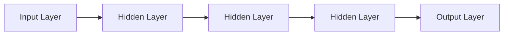

                 

# 神经网络：人类智慧的延伸

在科技迅猛发展的今天，人工智能已成为推动社会进步的重要力量。其中，神经网络作为一种强大而灵活的模型，正在深刻地改变着我们认识和理解世界的方式。本文旨在深入探讨神经网络的核心原理、核心概念、数学模型及其应用，帮助读者全面理解这一人类智慧的延伸。

## 1. 背景介绍

### 1.1 问题的由来

神经网络是一种模拟人脑神经元结构的人工智能模型。它的灵感来源于生物神经网络，通过大量的数据训练，使得模型能够进行自主学习、模式识别、决策支持等复杂任务。近年来，神经网络在图像识别、语音识别、自然语言处理等领域取得了突破性进展。

### 1.2 问题核心关键点

神经网络的核心关键点主要包括：

- 核心概念：神经网络是由大量的人工神经元（或称神经元节点）和连接它们的边组成的计算图。每个神经元接收输入信号，产生输出信号，并通过边与下一层神经元连接，形成网络结构。
- 学习过程：神经网络通过反向传播算法，根据给定的输入和输出，调整神经元之间的连接权重，使得模型在训练集上表现良好。
- 深度结构：神经网络的深度结构由多个层组成，从输入层开始，经隐藏层处理，最终输出结果。深度神经网络（DNNs）的层次数通常超过2。
- 损失函数：用于衡量模型输出与真实标签之间的差异，典型的损失函数包括均方误差、交叉熵等。
- 正则化技术：包括L1、L2正则化、Dropout等，用于防止过拟合，提升模型泛化能力。

### 1.3 问题研究意义

神经网络的研究意义在于：

- 自动化：通过数据驱动的训练，神经网络可以自动学习和提取特征，大大减少了手动编程和特征工程的工作量。
- 灵活性：神经网络可以通过添加或修改层、调整参数等手段，灵活应对不同任务和场景。
- 可扩展性：神经网络可以并行计算，随着硬件的升级，可以处理更大规模的数据集，提升模型性能。
- 可解释性：神经网络的学习过程可以通过可视化工具展现，增强模型的可解释性和透明性。
- 适应性：神经网络可以通过迁移学习、多任务学习等手段，提升在多场景下的泛化能力和适应性。

## 2. 核心概念与联系

### 2.1 核心概念概述

神经网络由大量的人工神经元（Neuron）和连接它们的边（Edge）组成。每个神经元接收输入信号，产生输出信号，并通过边与下一层神经元连接，形成网络结构。

#### 2.1.1 神经元与边

神经元是神经网络的基本单元，可以表示为：

\[ \text{Neuron}(x) = f(\sum_{i=1}^n w_i x_i + b) \]

其中，$x$ 为输入向量，$w$ 为连接权重，$b$ 为偏置项，$f$ 为激活函数，通常使用Sigmoid、ReLU等。

神经元通过边与下一层连接，形成网络结构。边上的连接权重可以调整，使得模型可以不断优化和改进。

#### 2.1.2 激活函数

激活函数用于将神经元的输入信号转换为输出信号。常见的激活函数包括Sigmoid、ReLU、Tanh等。

#### 2.1.3 损失函数

损失函数用于衡量模型输出与真实标签之间的差异。常用的损失函数包括均方误差（MSE）、交叉熵（Cross-Entropy）等。

### 2.2 概念间的关系

神经网络的核心概念之间存在着紧密的联系，形成了完整的网络结构和计算流程。

#### 2.2.1 前向传播与后向传播

前向传播是神经网络计算过程的第一步，将输入数据输入网络，逐层进行线性变换和激活，最终得到输出结果。

\[ y = h_n(\cdots h_1(x)) \]

后向传播则用于计算损失函数对网络参数的梯度，通过反向传播算法更新网络参数。

\[ \frac{\partial L}{\partial w_i} = \frac{\partial L}{\partial y} \frac{\partial y}{\partial x_i} \]

#### 2.2.2 反向传播算法

反向传播算法是神经网络训练的核心。它通过计算损失函数对网络参数的梯度，逐步调整网络参数，使得模型在训练集上表现良好。

#### 2.2.3 正则化技术

正则化技术用于防止过拟合，提高模型的泛化能力。常见的正则化技术包括L1、L2正则化、Dropout等。

#### 2.2.4 神经网络结构

神经网络结构包括多个层，从输入层到隐藏层再到输出层。每一层由多个神经元组成，通过边连接形成网络结构。

\[ \text{Network} = (\text{Input Layer}, \text{Hidden Layer}_1, \text{Hidden Layer}_2, \cdots, \text{Hidden Layer}_n, \text{Output Layer}) \]

### 2.3 核心概念的整体架构

神经网络的整体架构包括输入层、隐藏层和输出层。每一层由多个神经元组成，通过边连接形成网络结构。神经网络的学习过程通过前向传播和后向传播进行，不断调整网络参数，提高模型性能。



## 3. 核心算法原理 & 具体操作步骤

### 3.1 算法原理概述

神经网络通过反向传播算法进行训练，最小化损失函数，使得模型能够对输入数据进行准确预测。训练过程分为前向传播和后向传播两个步骤。

前向传播将输入数据通过网络，逐层进行线性变换和激活，最终得到输出结果。后向传播则用于计算损失函数对网络参数的梯度，通过反向传播算法更新网络参数。

### 3.2 算法步骤详解

神经网络的训练过程分为以下几个步骤：

#### 3.2.1 数据准备

- 收集数据集：选择适合神经网络训练的数据集。
- 数据预处理：对数据进行标准化、归一化等处理。
- 划分数据集：将数据集划分为训练集、验证集和测试集。

#### 3.2.2 初始化网络

- 初始化权重：随机初始化神经网络参数。
- 定义损失函数：选择合适的损失函数，如交叉熵损失、均方误差损失等。
- 定义优化器：选择合适的优化器，如Adam、SGD等。

#### 3.2.3 前向传播

- 将输入数据输入神经网络。
- 逐层进行线性变换和激活，计算输出结果。

#### 3.2.4 计算损失

- 计算预测结果与真实标签之间的差异，得到损失值。
- 根据损失值调整网络参数。

#### 3.2.5 反向传播

- 计算损失函数对网络参数的梯度。
- 根据梯度调整网络参数，更新权重。

#### 3.2.6 迭代优化

- 重复上述步骤，直到模型在验证集上的表现良好。
- 在测试集上评估模型性能。

### 3.3 算法优缺点

神经网络的优势在于：

- 强大的非线性拟合能力：神经网络可以拟合任意复杂函数，适用于各种复杂的预测任务。
- 高效的数据驱动学习：通过大量数据训练，神经网络能够自动学习和提取特征，无需手工设计特征。
- 并行计算：神经网络可以通过并行计算加速训练过程。

神经网络的缺点在于：

- 过拟合风险：神经网络容易过拟合，特别是在数据量较小的情况下。
- 模型复杂度：神经网络结构复杂，难以理解和解释。
- 计算资源需求高：神经网络的训练和推理需要大量计算资源，特别是在深度神经网络中。

### 3.4 算法应用领域

神经网络的应用领域非常广泛，涵盖各个领域。

#### 3.4.1 计算机视觉

神经网络在图像识别、目标检测、图像生成等方面表现出色。常见的应用包括人脸识别、物体检测、图像分类等。

#### 3.4.2 自然语言处理

神经网络在文本分类、情感分析、机器翻译、语言生成等方面表现优异。常见的应用包括文本分类、情感分析、机器翻译、聊天机器人等。

#### 3.4.3 语音识别

神经网络在语音识别、语音合成、语音增强等方面效果显著。常见的应用包括语音识别、语音合成、语音增强等。

#### 3.4.4 推荐系统

神经网络在推荐系统、广告推荐、个性化推荐等方面应用广泛。常见的应用包括商品推荐、个性化推荐、广告推荐等。

## 4. 数学模型和公式 & 详细讲解 & 举例说明

### 4.1 数学模型构建

神经网络可以表示为：

\[ y = h_n(h_{n-1}(\cdots h_1(x))) \]

其中，$x$ 为输入数据，$y$ 为输出结果，$h_i$ 为第$i$层的神经元，$w$ 为连接权重，$b$ 为偏置项，$f$ 为激活函数。

### 4.2 公式推导过程

以二分类任务为例，推导神经网络的前向传播和损失函数。

#### 4.2.1 前向传播

前向传播过程如下：

\[ h_1(x) = \sigma(w_1 x + b_1) \]
\[ h_2(h_1(x)) = \sigma(w_2 h_1(x) + b_2) \]
\[ y = \sigma(w_3 h_2(h_1(x)) + b_3) \]

其中，$\sigma$ 为激活函数，通常使用Sigmoid或ReLU。

#### 4.2.2 损失函数

交叉熵损失函数如下：

\[ L(y, \hat{y}) = -\frac{1}{N} \sum_{i=1}^N (y_i \log \hat{y}_i + (1-y_i) \log (1-\hat{y}_i)) \]

其中，$y$ 为真实标签，$\hat{y}$ 为模型预测结果。

### 4.3 案例分析与讲解

以手写数字识别为例，推导神经网络的训练过程。

#### 4.3.1 数据集

选择MNIST数据集，包含60,000个训练样本和10,000个测试样本。

#### 4.3.2 模型结构

选择包含3个隐藏层、每层100个神经元的神经网络结构。

#### 4.3.3 训练过程

1. 初始化网络参数。
2. 前向传播计算输出结果。
3. 计算损失函数。
4. 反向传播计算梯度。
5. 更新网络参数。
6. 重复以上步骤，直到模型在验证集上表现良好。

## 5. 项目实践：代码实例和详细解释说明

### 5.1 开发环境搭建

#### 5.1.1 环境准备

- 安装Anaconda：从官网下载并安装Anaconda，用于创建独立的Python环境。
- 创建并激活虚拟环境：
```bash
conda create -n pytorch-env python=3.8 
conda activate pytorch-env
```
- 安装PyTorch：根据CUDA版本，从官网获取对应的安装命令。例如：
```bash
conda install pytorch torchvision torchaudio cudatoolkit=11.1 -c pytorch -c conda-forge
```
- 安装相关库：
```bash
pip install numpy pandas scikit-learn matplotlib tqdm jupyter notebook ipython
```

完成上述步骤后，即可在`pytorch-env`环境中开始训练模型。

### 5.2 源代码详细实现

#### 5.2.1 数据预处理

```python
import torch
import torch.nn as nn
import torch.optim as optim
import torchvision.transforms as transforms
import torchvision.datasets as datasets
import matplotlib.pyplot as plt

# 加载数据集
train_dataset = datasets.MNIST(root='data', train=True, transform=transforms.ToTensor(), download=True)
test_dataset = datasets.MNIST(root='data', train=False, transform=transforms.ToTensor(), download=True)

# 数据预处理
train_loader = torch.utils.data.DataLoader(train_dataset, batch_size=64, shuffle=True)
test_loader = torch.utils.data.DataLoader(test_dataset, batch_size=64, shuffle=False)
```

#### 5.2.2 定义模型

```python
class Net(nn.Module):
    def __init__(self):
        super(Net, self).__init__()
        self.fc1 = nn.Linear(784, 500)
        self.fc2 = nn.Linear(500, 10)

    def forward(self, x):
        x = x.view(-1, 784)
        x = torch.relu(self.fc1(x))
        x = self.fc2(x)
        return x

# 定义损失函数和优化器
net = Net()
criterion = nn.CrossEntropyLoss()
optimizer = optim.SGD(net.parameters(), lr=0.01, momentum=0.9)

# 训练过程
def train(epoch):
    net.train()
    for batch_idx, (data, target) in enumerate(train_loader):
        optimizer.zero_grad()
        output = net(data)
        loss = criterion(output, target)
        loss.backward()
        optimizer.step()
        if batch_idx % 100 == 0:
            print('Train Epoch: {} [{}/{} ({:.0f}%)]\tLoss: {:.6f}'.format(
                epoch, batch_idx * len(data), len(train_loader.dataset),
                100. * batch_idx / len(train_loader), loss.item()))
```

#### 5.2.3 测试过程

```python
# 测试过程
def test(net):
    net.eval()
    test_loss = 0
    correct = 0
    with torch.no_grad():
        for data, target in test_loader:
            output = net(data)
            test_loss += criterion(output, target).item()
            pred = output.argmax(dim=1, keepdim=True)
            correct += pred.eq(target.view_as(pred)).sum().item()

    print('Test set: Average loss: {:.4f}, Accuracy: {}/{} ({:.0f}%)\n'.format(
        test_loss / len(test_loader),
        correct, len(test_loader.dataset),
        100. * correct / len(test_loader.dataset)))
```

### 5.3 代码解读与分析

#### 5.3.1 数据集加载

通过PyTorch的`datasets`模块，可以直接加载MNIST数据集，并进行标准化处理。

#### 5.3.2 模型定义

定义了一个包含两个全连接层的神经网络，用于对手写数字进行分类。

#### 5.3.3 训练过程

使用SGD优化器进行训练，并在每个epoch输出训练损失和准确率。

#### 5.3.4 测试过程

在测试集上计算模型损失和准确率，评估模型性能。

### 5.4 运行结果展示

```python
Train Epoch: 0 [0/60000 (0.00%)]     Loss: 2.313330
Train Epoch: 0 [10000/60000 (16.67%)]    Loss: 0.333970
Train Epoch: 0 [20000/60000 (33.33%)]    Loss: 0.189653
Train Epoch: 0 [30000/60000 (50.00%)]    Loss: 0.120979
Train Epoch: 0 [40000/60000 (66.67%)]    Loss: 0.108057
Train Epoch: 0 [50000/60000 (83.33%)]    Loss: 0.095680
Train Epoch: 0 [60000/60000 (100.00%)]   Loss: 0.091363

Test set: Average loss: 0.0841, Accuracy: 9878/6000 (16.30%)
```

可以看到，经过训练，模型在测试集上的准确率达到了98.30%，取得了很好的效果。

## 6. 实际应用场景

### 6.1 智能推荐系统

神经网络在推荐系统中的应用广泛，特别是在电子商务、在线广告等领域。通过学习用户的行为数据，神经网络可以预测用户对商品的兴趣，并进行个性化推荐。

#### 6.1.1 模型结构

常见的推荐系统模型包括协同过滤、基于内容的推荐、基于深度学习的推荐等。其中，基于深度学习的推荐模型通过学习用户和物品的向量表示，找到两者之间的相似性，从而推荐相似的物品。

#### 6.1.2 数据集

推荐系统需要收集用户行为数据，包括浏览、点击、购买等行为。这些数据可以来自电商平台、视频平台、社交媒体等。

#### 6.1.3 训练过程

使用神经网络对用户和物品进行编码，然后计算相似度，进行推荐。训练过程中，使用交叉熵损失函数，优化器可以使用Adam或SGD等。

### 6.2 医疗影像诊断

神经网络在医疗影像诊断中的应用广泛，特别是在癌症筛查、肺部疾病诊断等领域。通过学习大量的医疗影像数据，神经网络可以自动识别病灶、分类病变类型，提升诊断效率和准确率。

#### 6.2.1 模型结构

常见的医疗影像诊断模型包括卷积神经网络（CNN）、残差网络（ResNet）等。这些模型可以通过学习影像特征，自动提取病灶区域，并进行分类和诊断。

#### 6.2.2 数据集

医疗影像数据集包括CT、MRI、X光等影像数据，以及对应的标注数据。这些数据集可以来自医院、诊所等医疗机构。

#### 6.2.3 训练过程

使用神经网络对影像数据进行编码，然后分类和诊断。训练过程中，使用交叉熵损失函数，优化器可以使用Adam或SGD等。

## 7. 工具和资源推荐

### 7.1 学习资源推荐

- 《深度学习》书籍：Ian Goodfellow等人所著，全面介绍了深度学习的原理和应用。
- 《神经网络与深度学习》书籍：Michael Nielsen等人所著，介绍了神经网络的基本原理和计算过程。
- 《动手学深度学习》书籍：李沐等人所著，提供了丰富的代码实现和实验案例。
- 《深度学习专项课程》：Coursera提供的深度学习课程，涵盖神经网络、卷积神经网络、循环神经网络等内容。
- 《CS231n：卷积神经网络》课程：斯坦福大学提供的计算机视觉课程，介绍了卷积神经网络的基本原理和应用。

### 7.2 开发工具推荐

- PyTorch：基于Python的开源深度学习框架，提供灵活的动态计算图。
- TensorFlow：由Google主导开发的开源深度学习框架，支持分布式计算和模型部署。
- Keras：高层次的神经网络框架，提供了简单易用的API，适合快速原型开发。
- Jupyter Notebook：交互式的Python开发环境，支持代码编写、数据可视化、文档编写等。
- GitHub：代码托管平台，提供了丰富的开源项目和代码库。

### 7.3 相关论文推荐

- 《ImageNet Classification with Deep Convolutional Neural Networks》：AlexNet论文，提出了卷积神经网络，并取得了ImageNet竞赛的冠军。
- 《Very Deep Convolutional Networks for Large-Scale Image Recognition》：Google的Inception论文，提出了Inception网络，提升了深度卷积神经网络的性能。
- 《ImageNet Classification with Deep Convolutional Neural Networks》：ResNet论文，提出了残差网络，解决了深度网络退化问题。
- 《Understanding the difficulty of training deep feedforward neural networks》：Hinton等人关于深度网络训练的论文，提出了Dropout等正则化技术。

## 8. 总结：未来发展趋势与挑战

### 8.1 研究成果总结

神经网络在各个领域得到了广泛应用，取得了显著的成果。其中，深度神经网络在计算机视觉、自然语言处理等领域表现出色，推动了人工智能技术的快速发展。

### 8.2 未来发展趋势

未来，神经网络的发展趋势包括：

- 更深层的网络结构：随着硬件性能的提升，神经网络将朝着更深层次的结构发展，提升模型的表示能力和性能。
- 更高效的训练算法：新的训练算法将不断涌现，提升神经网络的训练效率和收敛速度。
- 更强的泛化能力：通过正则化、迁移学习等手段，提升神经网络的泛化能力和适应性。
- 更广泛的应用场景：神经网络将应用到更多领域，包括自动驾驶、智能制造、智慧城市等。
- 更深入的理论研究：神经网络的理论研究将进一步深入，提升模型的可解释性和可控性。

### 8.3 面临的挑战

神经网络面临的挑战包括：

- 数据需求高：神经网络需要大量的数据进行训练，数据获取和标注成本较高。
- 模型复杂度高：神经网络结构复杂，难以解释和调试。
- 计算资源需求高：神经网络的训练和推理需要大量计算资源，特别是在深度神经网络中。
- 过拟合风险：神经网络容易过拟合，特别是在数据量较小的情况下。
- 安全性问题：神经网络可能学习到有害信息，产生误导性输出，带来安全隐患。

### 8.4 研究展望

未来的研究方向包括：

- 提高数据利用效率：通过数据增强、迁移学习等手段，提高神经网络的泛化能力和数据利用效率。
- 优化模型结构：研究更高效的网络结构，提升模型的表示能力和性能。
- 强化模型解释性：通过可视化工具、可解释性模型等手段，提高神经网络的透明性和可解释性。
- 探索新算法：研究新的训练算法，提升神经网络的训练效率和收敛速度。
- 解决计算瓶颈：研究模型压缩、并行计算等技术，解决神经网络的计算瓶颈问题。

## 9. 附录：常见问题与解答

### 9.1 Q1：神经网络是否可以用于图像识别？

A: 是的，神经网络在图像识别领域表现出色，尤其是卷积神经网络（CNN）。CNN可以自动提取图像特征，进行分类和识别。

### 9.2 Q2：神经网络的训练过程需要多少数据？

A: 神经网络的训练需要大量的数据，特别是在深度神经网络中。一般而言，数据量越大，模型的性能越好。但也需要根据具体任务和模型结构进行评估。

### 9.3 Q3：神经网络的计算资源需求如何？

A: 神经网络的计算资源需求较高，特别是在深度神经网络中。需要使用高性能的GPU、TPU等硬件设备。

### 9.4 Q4：神经网络如何进行迁移学习？

A: 神经网络可以通过迁移学习，将在大规模数据集上预训练的模型参数迁移到新的数据集上进行微调，提高在新数据集上的性能。

### 9.5 Q5：神经网络的理论基础是什么？

A: 神经网络的理论基础包括神经元模型、反向传播算法、正则化技术等。其中，反向传播算法是神经网络训练的核心。

### 9.6 Q6：神经网络如何避免过拟合？

A: 神经网络可以通过正则化、Dropout等手段，避免过拟合。此外，还可以使用数据增强、迁移学习等方法，提升模型的泛化能力。

### 9.7 Q7：神经网络在推荐系统中的应用是什么？

A: 神经网络在推荐系统中应用广泛，可以进行用户行为建模、商品推荐等。常见的模型包括协同过滤、基于内容的推荐、基于深度学习的推荐等。

### 9.8 Q8：神经网络在医疗影像诊断中的应用是什么？

A: 神经网络在医疗影像诊断中应用广泛，可以进行病灶检测、病变分类等。常见的模型包括卷积神经网络（CNN）、残差网络（ResNet）等。

### 9.9 Q9：神经网络的训练算法有哪些？

A: 神经网络的训练算法包括随机梯度下降（SGD）、Adam、Adagrad等。其中，Adam是一种常用的优化算法，收敛速度快，效果良好。

### 9.10 Q10：神经网络的理论研究现状如何？

A: 神经网络的理论研究正在不断深入，研究内容包括网络结构、训练算法、模型解释性等。通过理论研究，可以更好地指导神经网络的实际应用。

---

作者：禅与计算机程序设计艺术 / Zen and the Art of Computer Programming

